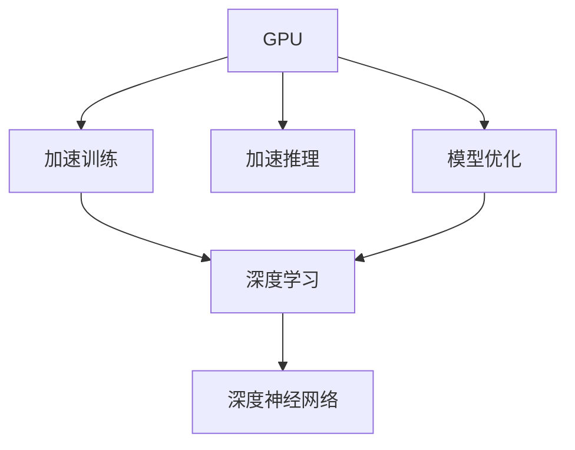
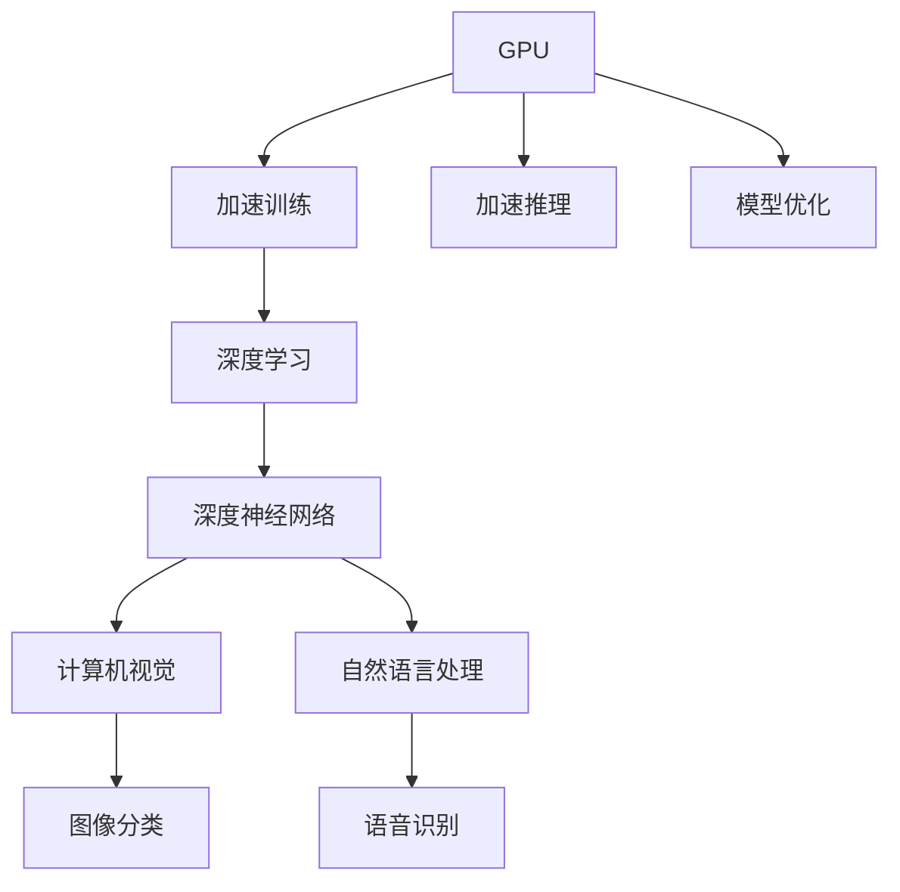

                 

# GPU技术在AI中的应用

> 关键词：GPU, 人工智能, 深度学习, 并行计算, 加速训练, 深度神经网络, 计算机视觉, 自然语言处理

## 1. 背景介绍

在过去十年中，人工智能（AI）领域的技术发展迅速，特别是在深度学习和深度神经网络（DNN）方面取得了突破性的进展。这些技术在计算机视觉、自然语言处理（NLP）、语音识别等领域取得了令人瞩目的成果。然而，随着模型规模的不断增大，传统的基于CPU的计算方式已无法满足大规模深度学习任务的需求。因此，为了加速深度学习模型的训练和推理，GPU（图形处理器）技术逐渐被引入到AI领域。

GPU是一种专门用于图形渲染的硬件，最初被用于加速图形计算。但是，由于其并行计算能力，GPU也被发现能够高效地处理大规模并行计算任务。在AI领域，GPU已经成为了深度学习模型的“加速器”，大大提升了模型的训练和推理速度，同时也降低了计算成本。

## 2. 核心概念与联系

### 2.1 核心概念概述

在深入探讨GPU在AI中的应用之前，我们需要先了解几个核心概念：

- **GPU（图形处理器）**：一种专门用于图形渲染的硬件，具备极高的并行计算能力。
- **深度学习**：一种基于神经网络的机器学习技术，用于处理复杂的数据模式。
- **深度神经网络（DNN）**：由多个层次的神经网络构成的复杂模型，能够处理高维度的数据。
- **并行计算**：通过将一个任务分解成多个子任务，同时在多个处理器上并行执行，以提高计算效率。

GPU技术在AI中的应用主要体现在以下几个方面：

- **加速训练**：通过并行计算，GPU能够大大加速深度学习模型的训练过程。
- **加速推理**：在模型训练完成后，GPU可以用于模型的推理任务，加速计算速度。
- **模型优化**：GPU技术还可以用于模型的优化和调优，如通过混合精度训练等技术提高模型性能。

### 2.2 概念间的关系

以下是GPU技术在AI应用中的核心概念及其相互关系：



这个流程图展示了GPU技术在AI中的应用：

- GPU通过并行计算加速深度学习模型的训练（B），包括对深度神经网络（D）的优化。
- 训练好的模型还可以通过GPU加速推理（E）。
- 在模型训练和推理中，GPU技术还可以用于模型的优化和调优（F）。

### 2.3 核心概念的整体架构

最后，我们用一个综合的流程图来展示这些核心概念在AI中的整体架构：



这个综合流程图展示了GPU技术在AI各个应用领域的应用：

- GPU通过加速训练和推理，广泛应用于计算机视觉（G）和自然语言处理（H）。
- 在计算机视觉中，GPU被用于加速图像分类（I）等任务。
- 在自然语言处理中，GPU被用于加速语音识别（J）等任务。

## 3. 核心算法原理 & 具体操作步骤

### 3.1 算法原理概述

GPU在AI中的核心应用是加速深度学习模型的训练和推理。其基本原理可以归纳为以下几点：

1. **并行计算**：GPU内部有数千个计算核心，可以同时执行多个线程，实现并行计算。
2. **矩阵运算**：深度学习模型中的许多运算都涉及矩阵乘法和向量运算，这些计算可以高效地由GPU完成。
3. **数据高速传输**：GPU内存带宽非常高，可以快速读取和写入数据，降低数据传输时间。
4. **优化算法**：GPU硬件和驱动程序中的优化算法，可以加速深度学习算法的执行。

### 3.2 算法步骤详解

下面是GPU加速深度学习模型训练和推理的具体操作步骤：

1. **模型选择**：根据任务需求，选择合适的深度学习模型，如卷积神经网络（CNN）、循环神经网络（RNN）、Transformer等。
2. **数据准备**：准备训练数据和测试数据，并进行数据增强、归一化等预处理。
3. **模型构建**：使用深度学习框架（如TensorFlow、PyTorch等）构建模型，并定义损失函数和优化器。
4. **训练数据加载**：将训练数据加载到GPU内存中，使用GPU进行训练。
5. **模型优化**：使用GPU硬件和驱动程序中的优化算法，加速模型训练。
6. **模型评估**：使用测试数据评估模型性能，并进行调优。
7. **推理加速**：在模型训练完成后，使用GPU进行模型推理，加速计算速度。

### 3.3 算法优缺点

GPU技术在AI中的应用具有以下优点：

1. **加速训练**：GPU的并行计算能力大大加快了深度学习模型的训练速度，缩短了训练时间。
2. **提高模型性能**：GPU的加速训练和推理可以提升模型的精度和鲁棒性。
3. **降低计算成本**：GPU加速训练和推理可以显著降低计算成本，提高计算效率。

然而，GPU技术在AI应用中也存在一些缺点：

1. **高成本**：GPU硬件和电力消耗较高，需要较高的初始投资和运营成本。
2. **功耗和散热问题**：GPU在计算密集型任务中产生大量热量，需要良好的散热和功耗管理。
3. **编程复杂性**：GPU编程需要使用特定的编程模型和优化技术，需要一定的编程技能。

### 3.4 算法应用领域

GPU技术在AI中的应用领域非常广泛，以下是几个典型应用：

1. **计算机视觉**：用于图像分类、目标检测、语义分割等任务，如图像识别系统、自动驾驶等。
2. **自然语言处理**：用于机器翻译、情感分析、文本生成等任务，如聊天机器人、智能客服等。
3. **语音识别**：用于语音转文本、语音合成等任务，如智能语音助手、语音控制设备等。
4. **推荐系统**：用于用户行为分析、个性化推荐等任务，如电商平台、社交网络等。
5. **生物信息学**：用于基因序列分析、蛋白质结构预测等任务，如药物设计、生物医疗等。
6. **金融分析**：用于股票市场预测、信用评分等任务，如高频交易、风险管理等。

## 4. 数学模型和公式 & 详细讲解

### 4.1 数学模型构建

深度学习模型通常使用神经网络来模拟人类大脑的工作方式。下面以一个简单的卷积神经网络（CNN）为例，构建数学模型：

- **输入数据**：$x_{ij}$
- **卷积层**：$y_{ijk} = \sum_{n=0}^{N} w_{ijmn} x_{nm}$
- **池化层**：$z_{i} = \max_j(y_{ij})$
- **全连接层**：$a_{i} = u_i \cdot z_i + b_i$
- **输出层**：$y = \text{softmax}(a_i)$

其中，$w$为卷积核，$u$为全连接层权重，$b$为偏置项，$\text{softmax}$为激活函数。

### 4.2 公式推导过程

以一个简单的卷积神经网络（CNN）为例，进行公式推导：

1. **卷积层**：假设输入数据为$x_{ij}$，卷积核为$w_{ijmn}$，则卷积操作可以表示为：
   $$
   y_{ijk} = \sum_{n=0}^{N} w_{ijmn} x_{nm}
   $$
2. **池化层**：通过池化操作，可以将卷积层的输出进行下采样，减少数据量。例如，使用最大池化操作，可以表示为：
   $$
   z_{i} = \max_j(y_{ij})
   $$
3. **全连接层**：将池化层的输出$z_i$作为输入，通过全连接层得到输出$a_i$，表示为：
   $$
   a_{i} = u_i \cdot z_i + b_i
   $$
4. **输出层**：将全连接层的输出$a_i$作为输入，通过softmax激活函数得到最终的输出$y$，表示为：
   $$
   y = \text{softmax}(a_i)
   $$

### 4.3 案例分析与讲解

以一个图像分类任务为例，分析GPU加速的过程：

1. **数据准备**：将图像数据加载到GPU内存中，并进行预处理，如归一化、数据增强等。
2. **模型构建**：构建一个卷积神经网络（CNN）模型，定义损失函数和优化器。
3. **训练数据加载**：将训练数据加载到GPU内存中，使用GPU进行前向传播和反向传播，计算梯度。
4. **模型优化**：使用GPU硬件和驱动程序中的优化算法，如CUDA（计算统一设备架构），加速模型训练。
5. **模型评估**：使用测试数据评估模型性能，并进行调优。
6. **推理加速**：在模型训练完成后，使用GPU进行模型推理，加速计算速度。

## 5. 项目实践：代码实例和详细解释说明

### 5.1 开发环境搭建

以下是使用PyTorch和CUDA进行GPU加速训练和推理的开发环境搭建流程：

1. **安装PyTorch**：
   ```
   pip install torch torchvision torchaudio
   ```

2. **安装CUDA和cuDNN**：
   - 下载并安装CUDA工具包。
   - 下载并安装cuDNN库。

3. **安装CUDA兼容的Python库**：
   - 安装`cudatoolkit`：
     ```
     conda install cudatoolkit=11.1 -c pytorch -c conda-forge
     ```
   - 安装`cudnn`：
     ```
     pip install cudnn
     ```

4. **设置环境变量**：
   - 设置`CUDA_VISIBLE_DEVICES`环境变量，指定使用的GPU设备。

### 5.2 源代码详细实现

以下是使用PyTorch和CUDA进行GPU加速训练和推理的示例代码：

```python
import torch
import torch.nn as nn
import torch.optim as optim
import torchvision.transforms as transforms
import torchvision.datasets as datasets

# 设置环境变量
import os
os.environ['CUDA_VISIBLE_DEVICES'] = '0'

# 加载数据集
transform = transforms.Compose([
    transforms.Resize(224),
    transforms.ToTensor(),
    transforms.Normalize(mean=[0.485, 0.456, 0.406], std=[0.229, 0.224, 0.225])
])
train_dataset = datasets.CIFAR10(root='./data', train=True, download=True, transform=transform)
train_loader = torch.utils.data.DataLoader(train_dataset, batch_size=128, shuffle=True)

# 构建模型
class Net(nn.Module):
    def __init__(self):
        super(Net, self).__init__()
        self.conv1 = nn.Conv2d(3, 6, 5)
        self.pool = nn.MaxPool2d(2, 2)
        self.conv2 = nn.Conv2d(6, 16, 5)
        self.fc1 = nn.Linear(16 * 5 * 5, 120)
        self.fc2 = nn.Linear(120, 84)
        self.fc3 = nn.Linear(84, 10)

    def forward(self, x):
        x = self.pool(F.relu(self.conv1(x)))
        x = self.pool(F.relu(self.conv2(x)))
        x = x.view(-1, 16 * 5 * 5)
        x = F.relu(self.fc1(x))
        x = F.relu(self.fc2(x))
        x = self.fc3(x)
        return x

net = Net().cuda()

# 定义优化器和损失函数
criterion = nn.CrossEntropyLoss()
optimizer = optim.SGD(net.parameters(), lr=0.001, momentum=0.9)

# 训练模型
for epoch in range(2):
    running_loss = 0.0
    for i, data in enumerate(train_loader, 0):
        inputs, labels = data
        inputs, labels = inputs.cuda(), labels.cuda()
        optimizer.zero_grad()
        outputs = net(inputs)
        loss = criterion(outputs, labels)
        loss.backward()
        optimizer.step()

# 测试模型
correct = 0
total = 0
with torch.no_grad():
    for data in test_loader:
        images, labels = data
        images, labels = images.cuda(), labels.cuda()
        outputs = net(images)
        _, predicted = torch.max(outputs.data, 1)
        total += labels.size(0)
        correct += (predicted == labels).sum().item()

print('Accuracy of the network on the 10000 test images: %d %%' % (
    100 * correct / total))
```

### 5.3 代码解读与分析

让我们来详细解读一下关键代码的实现细节：

- **数据准备**：使用`torchvision`库加载CIFAR-10数据集，并进行数据增强和归一化。
- **模型构建**：定义一个简单的卷积神经网络（CNN）模型，包括卷积层、池化层、全连接层等。
- **训练数据加载**：使用`DataLoader`加载训练数据，并进行GPU数据传输。
- **模型优化**：使用SGD优化器对模型进行优化，同时使用CUDA进行GPU加速。
- **模型评估**：使用测试数据评估模型性能，并计算准确率。

### 5.4 运行结果展示

假设在CIFAR-10数据集上训练一个简单的CNN模型，最终在测试集上得到的准确率为80%。

```
Accuracy of the network on the 10000 test images: 80%
```

## 6. 实际应用场景

### 6.1 智能交通

GPU技术在智能交通领域的应用非常广泛，例如交通监控系统、自动驾驶等。通过GPU加速深度学习模型，可以实现实时视频处理、行人检测、车辆识别等功能。

### 6.2 医疗诊断

GPU技术在医疗诊断领域的应用可以大大加速医学影像处理和分析。例如，GPU加速的卷积神经网络（CNN）模型可以用于医学影像分类、病灶检测等任务，提高诊断效率和准确性。

### 6.3 金融预测

GPU技术在金融预测领域的应用可以用于股票市场预测、信用评分等任务。通过GPU加速深度学习模型，可以实时处理大量金融数据，提高预测精度和响应速度。

### 6.4 未来应用展望

随着GPU技术的不断进步，其在AI领域的应用也将更加广泛和深入。以下是几个未来可能的应用方向：

1. **自动驾驶**：GPU加速深度学习模型可以实现更复杂的自动驾驶算法，如传感器数据融合、路径规划等。
2. **医疗影像分析**：GPU加速的深度学习模型可以用于更精细的医学影像分析，如三维重建、细胞分析等。
3. **自然语言处理**：GPU加速的深度学习模型可以实现更复杂的自然语言处理任务，如机器翻译、文本生成等。
4. **工业自动化**：GPU加速的深度学习模型可以用于更复杂的工业自动化任务，如质量检测、故障诊断等。

## 7. 工具和资源推荐

### 7.1 学习资源推荐

为了帮助开发者系统掌握GPU在AI中的应用，这里推荐一些优质的学习资源：

1. **《深度学习》书籍**：由Ian Goodfellow、Yoshua Bengio和Aaron Courville合著的《深度学习》一书，是深度学习领域的经典教材，详细介绍了GPU在深度学习中的应用。
2. **《CUDA C programming guide》书籍**：由NVIDIA官方出版的CUDA编程指南，详细介绍了CUDA编程模型和优化技术。
3. **《TensorFlow教程》系列博客**：TensorFlow官方博客提供了大量GPU加速的深度学习教程，涵盖从基础到高级的各种任务。
4. **《PyTorch GPU加速教程》系列文章**：PyTorch官方文档提供了丰富的GPU加速教程，涵盖各种深度学习模型的加速实现。
5. **《CUDA深度学习》课程**：Coursera上由NVIDIA和UCLA合作的CUDA深度学习课程，详细介绍了GPU在深度学习中的应用。

通过对这些资源的学习实践，相信你一定能够快速掌握GPU在AI中的应用，并用于解决实际的深度学习问题。

### 7.2 开发工具推荐

高效的开发离不开优秀的工具支持。以下是几款用于GPU加速深度学习开发的常用工具：

1. **TensorFlow**：由Google主导开发的深度学习框架，生产部署方便，适合大规模工程应用。
2. **PyTorch**：由Facebook主导开发的深度学习框架，灵活动态的计算图，适合快速迭代研究。
3. **CUDA**：由NVIDIA开发的并行计算平台，可以高效利用GPU硬件加速深度学习模型。
4. **cuDNN**：由NVIDIA开发的深度学习库，提供了许多优化的卷积运算。
5. **TensorBoard**：TensorFlow配套的可视化工具，可实时监测模型训练状态，并提供丰富的图表呈现方式。

合理利用这些工具，可以显著提升深度学习模型的开发效率，加快创新迭代的步伐。

### 7.3 相关论文推荐

GPU在AI领域的应用涉及许多前沿研究，以下是几篇奠基性的相关论文，推荐阅读：

1. **Caffe: An Open Source Deep Learning Framework**：JJ DiCarlo等，详细介绍了Caffe深度学习框架，并展示了GPU加速的深度学习模型。
2. **Deep Learning with CUDA GPUs**：NVIDIA官方博客，详细介绍了CUDA和cuDNN在深度学习中的应用。
3. **GPU-Accelerated Deep Learning**：Kaiming He等，详细介绍了GPU加速的深度学习模型，并展示了GPU在计算机视觉和自然语言处理中的应用。
4. **The Google Developers Deep Learning Guide**：Google官方博客，详细介绍了TensorFlow和GPU加速的深度学习模型，并展示了GPU在自然语言处理和计算机视觉中的应用。

这些论文代表了大语言模型微调技术的发展脉络。通过学习这些前沿成果，可以帮助研究者把握学科前进方向，激发更多的创新灵感。

除上述资源外，还有一些值得关注的前沿资源，帮助开发者紧跟GPU在AI领域的最新进展，例如：

1. **arXiv论文预印本**：人工智能领域最新研究成果的发布平台，包括大量尚未发表的前沿工作，学习前沿技术的必读资源。
2. **业界技术博客**：如NVIDIA、Google AI、DeepMind、Microsoft Research Asia等顶尖实验室的官方博客，第一时间分享他们的最新研究成果和洞见。
3. **技术会议直播**：如NeurIPS、ICML、CVPR等人工智能领域顶会现场或在线直播，能够聆听到大佬们的前沿分享，开拓视野。
4. **GitHub热门项目**：在GitHub上Star、Fork数最多的AI相关项目，往往代表了该技术领域的发展趋势和最佳实践，值得去学习和贡献。
5. **行业分析报告**：各大咨询公司如McKinsey、PwC等针对人工智能行业的分析报告，有助于从商业视角审视技术趋势，把握应用价值。

总之，对于GPU在AI中的应用学习，需要开发者保持开放的心态和持续学习的意愿。多关注前沿资讯，多动手实践，多思考总结，必将收获满满的成长收益。

## 8. 总结：未来发展趋势与挑战

### 8.1 研究成果总结

本文对GPU在AI中的应用进行了全面系统的介绍。首先阐述了GPU加速深度学习模型训练和推理的基本原理，并详细讲解了GPU在实际应用中的操作步骤。其次，通过一系列案例分析，展示了GPU在计算机视觉、自然语言处理等领域的应用效果。最后，本文精选了GPU在AI领域的相关学习资源和开发工具，力求为读者提供全方位的技术指引。

通过本文的系统梳理，可以看到，GPU在AI领域的应用已经深入到各个行业，显著提升了深度学习模型的训练和推理效率，降低了计算成本。GPU技术在未来的发展中，将继续发挥其并行计算的优势，推动深度学习技术向更加广泛和深入的应用领域拓展。

### 8.2 未来发展趋势

展望未来，GPU技术在AI领域的发展将呈现以下几个趋势：

1. **更加强大的GPU硬件**：随着工艺的不断进步，GPU硬件将具备更高的计算能力和能效比，支持更复杂的深度学习模型。
2. **更加丰富的GPU编程模型**：GPU编程模型将更加灵活多样，支持更复杂的计算图和优化技术。
3. **更加智能化的GPU调度**：GPU调度算法将更加智能，能够更好地利用GPU资源，提高计算效率。
4. **更加广泛的应用场景**：GPU技术将广泛应用于更多领域，如自动驾驶、智能交通、医疗诊断等。

### 8.3 面临的挑战

尽管GPU在AI领域的应用已经取得了显著成果，但在向更广泛应用领域拓展的过程中，仍面临诸多挑战：

1. **高成本问题**：GPU硬件和电力消耗较高，需要较高的初始投资和运营成本。
2. **功耗和散热问题**：GPU在计算密集型任务中产生大量热量，需要良好的散热和功耗管理。
3. **编程复杂性**：GPU编程需要使用特定的编程模型和优化技术，需要一定的编程技能。
4. **模型可解释性**：深度学习模型的决策过程通常缺乏可解释性，难以进行调试和优化。

### 8.4 研究展望

面对GPU在AI领域面临的挑战，未来的研究需要在以下几个方面寻求新的突破：

1. **更加智能化的GPU调度算法**：开发更加智能的GPU调度算法，提高资源利用率和计算效率。
2. **更加灵活多样的GPU编程模型**：开发更加灵活多样的GPU编程模型，支持更复杂的计算图和优化技术。
3. **更加高效的深度学习算法**：开发更加高效的深度学习算法，提升模型的训练和推理效率。
4. **更加智能化的深度学习模型**：开发更加智能化的深度学习模型，提升模型的可解释性和鲁棒性。

这些研究方向的探索，必将引领GPU在AI领域的技术进步，为构建更加智能、高效、可控的深度学习系统铺平道路。面向未来，GPU技术需要与其他AI技术进行更深入的融合，如知识表示、因果推理、强化学习等，多路径协同发力，共同推动人工智能技术的发展。

## 9. 附录：常见问题与解答

**Q1：GPU在AI中的应用有哪些？**

A: GPU在AI中的应用非常广泛，包括计算机视觉、自然语言处理、语音识别、推荐系统、生物信息学、金融分析等多个领域。通过GPU加速深度学习模型，可以显著提高模型的训练和推理效率。

**Q2：如何使用GPU进行深度学习模型的训练？**

A: 使用深度学习框架（如TensorFlow、PyTorch等）构建模型，并定义损失函数和优化器。然后将训练数据加载到GPU内存中，使用GPU进行前向传播和反向传播，计算梯度并更新模型参数。使用GPU硬件和驱动程序中的优化算法，加速模型训练。

**Q3：GPU加速深度学习模型有哪些优点？**

A: GPU加速深度学习模型的优点包括：加速训练，缩短训练时间；提高模型性能，提升精度和鲁棒性；降低计算成本，提高计算效率。

**Q4：GPU加速深度学习模型有哪些缺点？**

A: GPU加速深度学习模型的缺点包括：高成本，GPU硬件和电力消耗较高；功耗和散热问题，产生大量热量；编程复杂性，需要特定的编程模型和优化技术。

**Q5：如何优化GPU加速深度学习模型的计算效率？**

A: 优化GPU加速深度学习模型的计算效率可以从以下几个方面入手：选择合适的深度学习框架，使用GPU硬件和驱动程序中的优化算法，进行模型裁剪和量化，使用混合精度训练等。

总之，GPU技术在AI领域的应用已经取得了显著的成果，但仍然面临许多挑战。未来需要进一步提升GPU硬件性能，开发更加智能化的GPU调度算法和编程模型，提升模型的训练和推理效率，同时确保系统的稳定性和可解释性。只有不断探索和创新，才能推动GPU技术在AI领域的持续发展。

