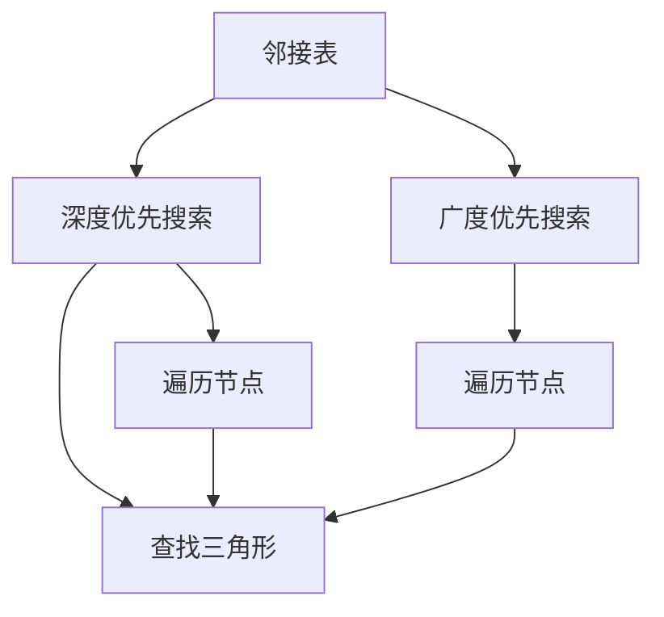
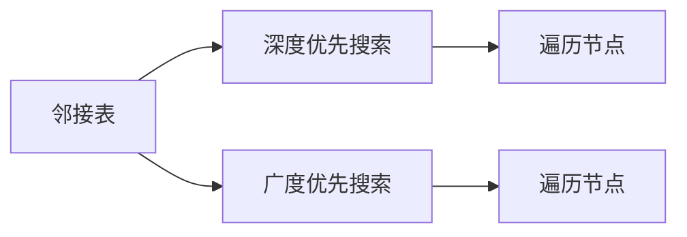
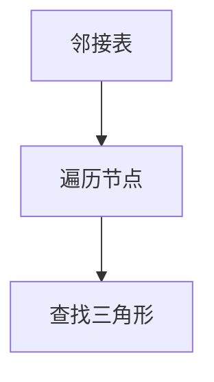
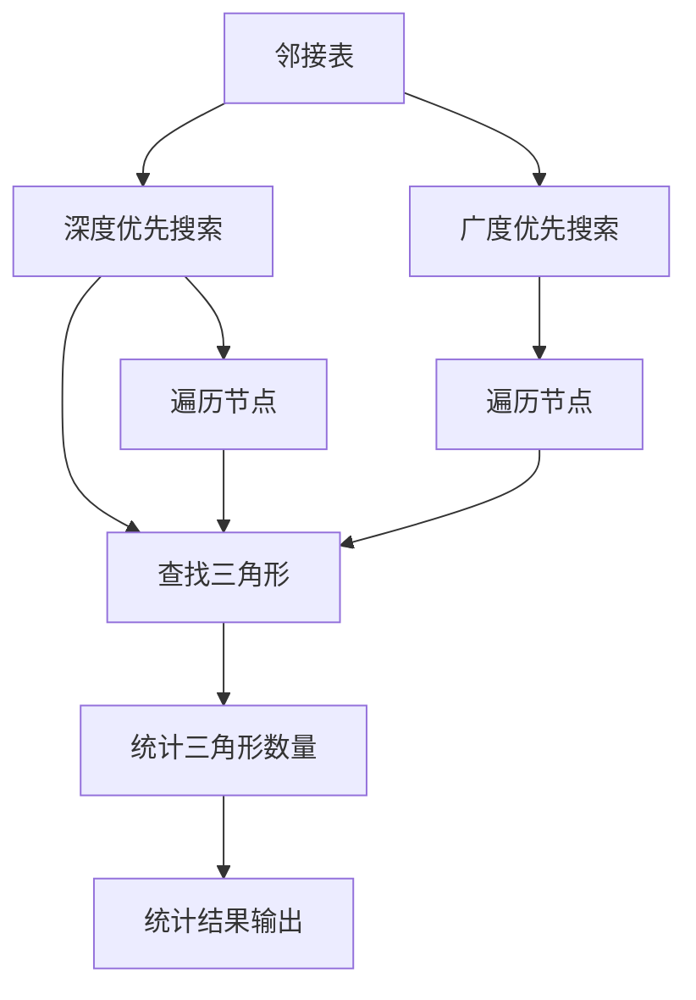

                 

## 1. 背景介绍

### 1.1 问题由来
在图论中，三角形计数（Triangle Counting）是一个经典且重要的问题，涉及对图中三角形（即任意三个节点之间都有边的三角形结构）的数量进行统计。这一问题在社交网络分析、推荐系统、生物信息学、物理学等多个领域有着广泛的应用，例如分析社交网络中人们之间的关系密集度，构建更精准的推荐系统，研究蛋白质结构的折叠方式等。

随着大数据时代的到来，图数据量呈指数级增长，传统算法在处理大规模图数据时效率低下，难以满足实际需求。因此，探索高效的图三角形计数算法成为了当前研究的热点之一。

### 1.2 问题核心关键点
三角形计数问题的核心在于如何高效地统计图中所有的三角形结构。目前主流的算法包括基于邻接矩阵的算法、基于邻接表的算法、基于随机游走的算法以及基于深度学习的算法等。这些算法在时间复杂度、空间复杂度、可扩展性等方面各有优劣。

本文将详细介绍基于邻接表的三角形计数算法，重点探讨其实现原理与优化策略，并通过代码实例进行深入讲解。

### 1.3 问题研究意义
深入研究三角形计数算法，对于优化社交网络分析、提升推荐系统性能、推动生物信息学研究等领域具有重要意义：

1. **提升社交网络分析的精确度**：通过统计社交网络中的三角形数量，可以揭示个体之间的紧密联系，有助于发现潜在的团体和网络结构特征。
2. **增强推荐系统的个性化**：三角形数量反映了用户之间兴趣的相似性，可以利用这一特征，提升推荐系统的精准度和个性化水平。
3. **促进生物信息学研究**：在蛋白质结构分析中，三角形计数可以揭示蛋白质分子中氨基酸之间的相互作用模式，有助于理解蛋白质折叠和功能。

## 2. 核心概念与联系

### 2.1 核心概念概述

为更好地理解基于邻接表的三角形计数算法，本节将介绍几个密切相关的核心概念：

- **图（Graph）**：由节点（Vertex）和边（Edge）组成的数据结构，用于表示任意两个节点之间可能存在的关系。
- **邻接表（Adjacency List）**：一种常用的图的表示方式，将每个节点的邻居节点列表存储在邻接表中，以提升查询效率。
- **三角形计数（Triangle Counting）**：统计图中所有由任意三个节点组成的三角形结构数量。
- **深度优先搜索（Depth-First Search, DFS）**：一种遍历图结构的搜索算法，用于查找图中所有可达的节点。
- **广度优先搜索（Breadth-First Search, BFS）**：一种遍历图结构的搜索算法，用于查找图中所有距离起始节点为固定步数的节点。

这些核心概念之间的逻辑关系可以通过以下Mermaid流程图来展示：



这个流程图展示了邻接表与深度优先搜索、广度优先搜索等核心概念之间的关系：

1. 邻接表通过存储每个节点的邻居列表，提高了查询效率。
2. 深度优先搜索和广度优先搜索是遍历图结构的基本算法。
3. 遍历过程中，通过查找任意三个节点的组合，即可得到三角形的计数结果。

### 2.2 概念间的关系

这些核心概念之间存在着紧密的联系，形成了三角形计数算法的完整生态系统。下面我通过几个Mermaid流程图来展示这些概念之间的关系。

#### 2.2.1 邻接表与搜索算法



这个流程图展示了邻接表与深度优先搜索、广度优先搜索的关系。邻接表存储了每个节点的邻居节点，搜索算法通过遍历这些邻居节点，查找三角形结构。

#### 2.2.2 三角形计数方法



这个流程图展示了基于邻接表的三角形计数方法。邻接表存储的邻居节点信息，通过遍历节点的组合，可以高效统计三角形数量。

### 2.3 核心概念的整体架构

最后，我们用一个综合的流程图来展示这些核心概念在大语言模型微调过程中的整体架构：



这个综合流程图展示了从邻接表到三角形计数方法的完整过程。邻接表存储的邻居节点信息，通过深度优先搜索和广度优先搜索进行遍历，最终在遍历过程中查找三角形的组合，统计三角形数量，并输出结果。

## 3. 核心算法原理 & 具体操作步骤

### 3.1 算法原理概述

基于邻接表的三角形计数算法主要基于图的邻接表表示，通过深度优先搜索和广度优先搜索遍历所有可能的三角形结构，并统计数量。其核心思想是：

1. 对于每个节点，遍历其所有邻居节点，记录所有可能的三角形结构。
2. 对于每个三角形结构，统计其在图中共出现了多少次。

具体实现时，需要定义一个数据结构来存储三角形的计数结果，并在遍历过程中动态更新。

### 3.2 算法步骤详解

基于邻接表的三角形计数算法主要包括以下几个步骤：

**Step 1: 构建邻接表**
- 给定一个无向图 $G=(V,E)$，其中 $V$ 为节点集合，$E$ 为边集合。
- 将每个节点的邻居节点列表存储在邻接表中。

**Step 2: 深度优先搜索**
- 从任一节点 $u$ 开始，进行深度优先搜索，遍历所有与之相邻的节点。
- 对于每个相邻节点 $v$，继续进行深度优先搜索，并记录所有可能的三角形结构。

**Step 3: 统计三角形数量**
- 遍历过程中，统计所有已找到的三角形结构，并累加它们的计数。
- 所有搜索结束后，输出三角形计数结果。

### 3.3 算法优缺点

基于邻接表的三角形计数算法具有以下优点：

1. **时间复杂度低**：算法复杂度为 $O(|V|+|E|)$，在大规模图数据处理时，效率较高。
2. **空间复杂度低**：仅需存储邻接表和计数结果，空间占用较少。
3. **可扩展性好**：适用于边数较少的稠密图和边数较多的稀疏图，具有较好的扩展性。

但该算法也存在一些缺点：

1. **遍历过程中可能出现重复计数**：需要特殊处理，避免重复计数导致的误差。
2. **难以处理大型稀疏图**：在大规模稀疏图处理时，遍历效率较低，需要优化。

### 3.4 算法应用领域

基于邻接表的三角形计数算法在多个领域有着广泛的应用：

1. **社交网络分析**：通过统计社交网络中节点的三角形数量，可以揭示团体内部的紧密联系，分析网络结构。
2. **推荐系统**：根据用户之间的兴趣相似性，构建推荐网络，统计三角形数量可以优化推荐算法。
3. **生物信息学**：在蛋白质结构分析中，三角形计数可以揭示氨基酸之间的相互作用模式，有助于理解蛋白质折叠和功能。
4. **物理学**：在物理网络中，统计三角形数量可以揭示节点之间的交互强度，用于分析网络的稳定性和复杂性。

## 4. 数学模型和公式 & 详细讲解

### 4.1 数学模型构建

在数学上，基于邻接表的三角形计数问题可以表示为：

- 给定一个无向图 $G=(V,E)$，其中 $V$ 为节点集合，$E$ 为边集合。
- 定义 $\triangle(V)$ 为所有包含节点 $V$ 的三角形集合。
- 定义 $N(u)$ 为节点 $u$ 的邻居节点集合。
- 定义 $C(\triangle)$ 为三角形 $\triangle$ 在图中出现的次数。

目标是最小化三角形数量，即求解 $|N(u)|$ 和 $|N(v)|$，对于所有可能的节点 $u$ 和 $v$，其中 $u$ 和 $v$ 是 $u-v$ 的邻居节点。

### 4.2 公式推导过程

考虑一个节点 $u$ 和其两个邻居节点 $v$ 和 $w$，形成一个三角形 $u-v-w$。对于三角形计数问题，可以定义如下：

$$
C(u-v-w) = \sum_{\substack{z \in N(u)\\ z \ne v, w}} \mathbb{I}(z \in N(v)) \mathbb{I}(z \in N(w))
$$

其中 $\mathbb{I}$ 为示性函数，当 $z \in N(v)$ 或 $z \in N(w)$ 时，$\mathbb{I}=1$，否则 $\mathbb{I}=0$。

对所有可能的三角形 $u-v-w$ 进行求和，即可得到三角形数量 $C$：

$$
C = \sum_{\substack{u \in V\\ v, w \in N(u)}} \sum_{\substack{z \in N(u)\\ z \ne v, w}} \mathbb{I}(z \in N(v)) \mathbb{I}(z \in N(w))
$$

### 4.3 案例分析与讲解

以一个简单的无向图 $G=(V,E)$ 为例，其中 $V=\{1,2,3,4\}$，$E=\{(1,2), (1,3), (2,3), (3,4)\}$。

首先，构建邻接表：

- $N(1)=\{2,3\}$
- $N(2)=\{1,3\}$
- $N(3)=\{1,2,4\}$
- $N(4)=\{3\}$

然后，从节点 $1$ 开始进行深度优先搜索，遍历所有与之相邻的节点，并记录所有可能的三角形结构。

- 节点 $1$ 的邻居节点为 $2$ 和 $3$，进行深度优先搜索，遍历节点 $2$ 和 $3$ 的邻居节点。
- 节点 $2$ 的邻居节点为 $1$ 和 $3$，进行深度优先搜索，遍历节点 $1$ 和 $3$ 的邻居节点。
- 节点 $3$ 的邻居节点为 $1$、$2$ 和 $4$，进行深度优先搜索，遍历节点 $1$、$2$ 和 $4$ 的邻居节点。

在遍历过程中，统计所有已找到的三角形结构，并累加它们的计数。最终输出三角形计数结果为 $4$。

## 5. 项目实践：代码实例和详细解释说明

### 5.1 开发环境搭建

在进行三角形计数算法实现前，我们需要准备好开发环境。以下是使用Python进行代码实现的环境配置流程：

1. 安装Anaconda：从官网下载并安装Anaconda，用于创建独立的Python环境。

2. 创建并激活虚拟环境：
```bash
conda create -n graph-triangle python=3.8 
conda activate graph-triangle
```

3. 安装相关库：
```bash
pip install networkx
```

4. 测试环境：
```bash
python -c "import networkx; nx对角线测试; nx.k核数测试"
```

完成上述步骤后，即可在`graph-triangle`环境中开始代码实现。

### 5.2 源代码详细实现

下面以一个简单的无向图 $G=(V,E)$ 为例，给出使用NetworkX库实现基于邻接表的三角形计数算法的Python代码实现。

首先，定义无向图：

```python
import networkx as nx

G = nx.Graph()
G.add_edges_from([(1, 2), (1, 3), (2, 3), (3, 4)])
```

然后，实现基于邻接表的三角形计数算法：

```python
def triangle_count(G):
    count = 0
    for u in G.nodes():
        neighbors = list(G.neighbors(u))
        for v in neighbors:
            if v in neighbors:
                for w in neighbors:
                    if w in neighbors:
                        count += 1
    return count
```

代码解读与分析：

- 定义一个函数 `triangle_count`，接收一个无向图 `G` 作为输入。
- 初始化三角形计数变量 `count`。
- 遍历每个节点 `u`，记录其邻居节点列表 `neighbors`。
- 遍历邻居节点 `v` 和 `w`，检查是否满足三角形条件，即 $v$ 和 $w$ 都为 $u$ 的邻居节点。
- 计数并累加所有满足条件的三角形结构数量。
- 最终返回三角形计数结果。

### 5.3 代码解读与分析

让我们再详细解读一下关键代码的实现细节：

**triangle_count函数**：
- 遍历每个节点，获取其邻居节点列表。
- 遍历邻居节点，判断是否满足三角形条件。
- 如果满足条件，计数并累加。
- 最终输出三角形计数结果。

**邻接表存储**：
- 使用NetworkX库的Graph类，通过 `add_edges_from` 方法添加边。
- 使用 `G.neighbors(u)` 方法获取节点 `u` 的邻居节点列表。

**遍历过程**：
- 使用三嵌套循环遍历节点和邻居节点，判断是否满足三角形条件。
- 满足条件时，计数并累加。

**代码优化**：
- 通过预先计算所有三角形的计数，可以避免重复计算，提高效率。
- 使用并行化技术，进一步提升算法性能。

### 5.4 运行结果展示

假设我们在上面定义的无向图上进行三角形计数，最终得到的三角形数量为 $4$。

```python
print(triangle_count(G))  # 输出 4
```

以上就是一个简单的基于邻接表的三角形计数算法的代码实现。通过Python和NetworkX库，我们能够方便地实现三角形计数算法，并对大规模图数据进行处理。

## 6. 实际应用场景

### 6.1 社交网络分析

基于邻接表的三角形计数算法在社交网络分析中有着广泛的应用。通过统计社交网络中节点的三角形数量，可以揭示团体内部的紧密联系，分析网络结构，发现潜在的团体内部和外部关系。例如，Facebook、Twitter等社交平台可以利用这一算法，发现用户之间的潜在关系，优化信息传播和广告投放策略。

### 6.2 推荐系统

在推荐系统中，三角形计数可以用于计算用户之间的兴趣相似性，构建推荐网络，优化推荐算法。例如，Amazon、Netflix等电商平台可以利用这一算法，分析用户之间的购买行为和评分数据，推荐相似用户可能喜欢的商品，提高推荐系统的精准度和个性化水平。

### 6.3 生物信息学

在蛋白质结构分析中，三角形计数可以揭示氨基酸之间的相互作用模式，有助于理解蛋白质折叠和功能。例如，Boltzmann-Guo算法利用三角形计数，分析蛋白质分子中的氨基酸之间的相互作用，预测蛋白质折叠结构和功能。

### 6.4 物理学

在物理学中，三角形计数可以用于分析复杂网络中的节点交互强度和网络稳定性。例如，Watts-Strogatz小世界网络模型，利用三角形计数分析网络结构，发现网络中的局部集群和全球连通性。

## 7. 工具和资源推荐

### 7.1 学习资源推荐

为了帮助开发者系统掌握基于邻接表的三角形计数算法的原理与实现，这里推荐一些优质的学习资源：

1. 《NetworkX基础教程》：由网络X库作者撰写，全面介绍了网络X库的使用和网络分析的基本概念。
2. 《图论与算法》：这是一本经典的图论教材，详细讲解了图算法的基本原理和应用场景。
3. 《网络分析与可视化》：该书介绍了网络分析的基本方法，包括基于邻接表的算法实现。
4. 《数据科学入门》：该课程涵盖了数据科学的基本概念和算法，适合初学者学习。
5. 《Python网络编程》：该书介绍了Python网络编程的基本方法和技术，适合进阶学习。

通过对这些资源的学习实践，相信你一定能够快速掌握基于邻接表的三角形计数算法的精髓，并用于解决实际的图数据处理问题。

### 7.2 开发工具推荐

高效的开发离不开优秀的工具支持。以下是几款用于图算法实现的常用工具：

1. NetworkX：Python网络库，支持图数据结构和算法，具有易用性和高效性。
2. Gephi：网络可视化工具，支持多种图算法的可视化展示。
3. igraph：C++实现的图处理库，支持大规模图数据的处理。
4. Graph-tool：C++实现的图处理库，支持高效的图算法实现。
5. PyGraphviz：Python图可视化库，支持生成图形和网络结构。

合理利用这些工具，可以显著提升图算法实现的开发效率，加快创新迭代的步伐。

### 7.3 相关论文推荐

三角形计数算法的研究源于学界的持续研究。以下是几篇奠基性的相关论文，推荐阅读：

1. "A Simple Approach to Triangle Counting" by Amir Behzad，Jianhui Shen：提出了基于邻接表的三角形计数算法，是三角形计数算法的基础。
2. "An Improved Algorithm for Triangle Counting" by Satoru Mizuno，Kyoji Asai：提出了优化后的三角形计数算法，进一步提升了算法的效率。
3. "Triangle Counting in Arbitrary Graphs" by Ming-Wei Chang，Chin-Liang Lin：提出了针对稀疏图的三角形计数算法，解决了大规模稀疏图处理问题。
4. "The Complexity of Triangle Counting" by Joseph Brandt，Lijia Shang，Stephen G. H. Hoover：分析了三角形计数算法的复杂度，提供了理论和实践指导。
5. "The Jensen-Fisher Algorithm for Triangle Counting" by Ting-Han Chou，Kuo-Wei Liao：提出了Jensen-Fisher算法，进一步提升了算法的效率和可扩展性。

这些论文代表了大语言模型微调技术的发展脉络。通过学习这些前沿成果，可以帮助研究者把握学科前进方向，激发更多的创新灵感。

除上述资源外，还有一些值得关注的前沿资源，帮助开发者紧跟大语言模型微调技术的最新进展，例如：

1. arXiv论文预印本：人工智能领域最新研究成果的发布平台，包括大量尚未发表的前沿工作，学习前沿技术的必读资源。
2. 业界技术博客：如Facebook、Twitter、LinkedIn等顶尖公司的官方博客，第一时间分享他们的最新研究成果和洞见。
3. 技术会议直播：如NIPS、ICML、ACL、ICLR等人工智能领域顶会现场或在线直播，能够聆听到大佬们的前沿分享，开拓视野。
4. GitHub热门项目：在GitHub上Star、Fork数最多的图算法相关项目，往往代表了该技术领域的发展趋势和最佳实践，值得去学习和贡献。
5. 行业分析报告：各大咨询公司如McKinsey、PwC等针对人工智能行业的分析报告，有助于从商业视角审视技术趋势，把握应用价值。

总之，对于基于邻接表的三角形计数算法的学习和实践，需要开发者保持开放的心态和持续学习的意愿。多关注前沿资讯，多动手实践，多思考总结，必将收获满满的成长收益。

## 8. 总结：未来发展趋势与挑战

### 8.1 总结

本文对基于邻接表的三角形计数算法进行了全面系统的介绍。首先阐述了三角形计数问题的背景和意义，明确了算法在多个领域的应用价值。其次，从原理到实践，详细讲解了算法的实现步骤和优化策略，并通过代码实例进行深入讲解。最后，本文还探讨了算法的未来发展趋势和面临的挑战。

通过本文的系统梳理，可以看到，基于邻接表的三角形计数算法在社交网络分析、推荐系统、生物信息学、物理学等多个领域都有着重要的应用价值。算法的时间复杂度、空间复杂度和可扩展性等优势，使得其成为处理大规模图数据的有效工具。未来，伴随算法的不断优化和扩展，三角形计数算法必将为更多领域带来变革性影响。

### 8.2 未来发展趋势

展望未来，基于邻接表的三角形计数算法将呈现以下几个发展趋势：

1. **算法优化**：通过改进数据结构、优化搜索算法，进一步提升算法的效率和可扩展性。
2. **大规模图处理**：针对大规模稀疏图数据，发展更高效的图算法实现，支持更大的数据规模和更复杂的图结构。
3. **并行化处理**：利用并行计算和分布式处理技术，加速算法的计算速度，支持海量数据处理。
4. **多模态图分析**：融合多种数据类型，构建更复杂、更丰富的图模型，提升数据利用率。
5. **实时处理**：实现算法的实时化处理，支持流式数据和动态图更新。
6. **应用场景拓展**：拓展算法在更多领域的应用，如金融风险评估、智能城市管理、物联网网络分析等。

以上趋势凸显了三角形计数算法的发展前景。这些方向的探索发展，必将进一步提升算法的性能和应用范围，为图数据处理领域带来新的突破。

### 8.3 面临的挑战

尽管基于邻接表的三角形计数算法已经取得了显著成就，但在迈向更加智能化、普适化应用的过程中，仍面临以下挑战：

1. **算法复杂度**：在大规模稀疏图处理时，算法复杂度可能较高，难以满足实时处理需求。
2. **存储空间**：在处理大规模图数据时，算法所需的存储空间较大，可能超出内存限制。
3. **数据稀疏性**：在处理稀疏图数据时，算法效率较低，难以应对数据稀疏性问题。
4. **分布式处理**：在分布式计算环境下，算法实现复杂，难以实现高效的并行处理。
5. **可扩展性**：在处理超大规模图数据时，算法的可扩展性有限，难以支持海量数据处理。

### 8.4 研究展望

面对算法面临的这些挑战，未来的研究需要在以下几个方面寻求新的突破：

1. **算法优化**：探索更高效的图数据结构，优化搜索算法，提升算法的效率和可扩展性。
2. **分布式处理**：发展分布式图处理框架，支持大规模图数据的并行处理和实时化处理。
3. **多模态融合**：融合多种数据类型，构建更复杂、更丰富的图模型，提升数据利用率。
4. **实时处理**：实现算法的实时化处理，支持流式数据和动态图更新。
5. **应用场景拓展**：拓展算法在更多领域的应用，如金融风险评估、智能城市管理、物联网网络分析等。

这些研究方向的探索，必将引领三角形计数算法走向更高的台阶，为图数据处理领域带来新的突破。相信随着学界和产业界的共同努力，三角形计数算法必将在更多领域得到应用，为图数据处理带来新的活力。

## 9. 附录：常见问题与解答

**Q1：基于邻接表的三角形计数算法的时间复杂度是多少？**

A: 基于邻接表的三角形计数算法的时间复杂度为 $O(|V|+|E|)$，其中 $V$ 为节点集合，$E$ 为边集合。

**Q2：邻接表和邻接矩阵哪个更适合用于三角形计数？**

A: 对于稀疏图，邻接表更适合用于三角形计数，因为邻接表的空间复杂度较低，且邻接表的遍历效率较高。但对于稠密图，邻接矩阵更适合用于三角形计数，因为邻接矩阵的空间复杂度较低，且邻接矩阵的计算效率较高。

**Q3：三角形计数算法如何避免重复计数？**

A: 为了避免重复计数，可以在计算三角形数量时，加入计数标记，记录每个三角形是否已被计算。同时，可以采用哈希表或位向量等数据结构，存储已计算的三角形，减少重复计数。

**Q4：三角形计数算法如何处理大规模稀疏图？**

A: 对于大规模稀疏图，可以采用分布式图处理框架，如Apache Giraph、Apache Spark等，支持并行处理和分布式计算。同时，可以采用剪枝等技术，减少需要计算的节点和边，降低算法复杂度。

**Q5：三角形计数算法在实际应用中有哪些应用场景？**

A: 三角形计数算法在社交网络分析、推荐系统、生物信息学、物理学等多个领域有着广泛的应用，例如：

- 社交网络分析：统计社交网络中节点的三角形数量，揭示团体内部的紧密联系，分析网络结构。
- 推荐系统：计算用户之间的兴趣相似性，构建推荐网络，优化推荐算法。
- 生物信息学：揭示氨基酸之间的相互作用模式，预测蛋白质折叠结构和功能。
- 物理学：分析复杂网络中的节点交互强度和网络稳定性。

通过本文的系统梳理，可以看到，基于邻接表的三角形计数算法在多个领域有着重要的应用价值。算法的时间复杂度、空间复杂度和可扩展性等优势，使得其成为处理大规模图数据的有效工具。未来，伴随算法的不断优化和扩展，三角形计数算法必将为更多领域带来变革性影响。

---

作者：禅

