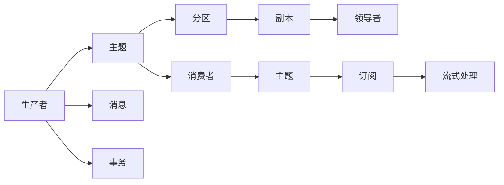
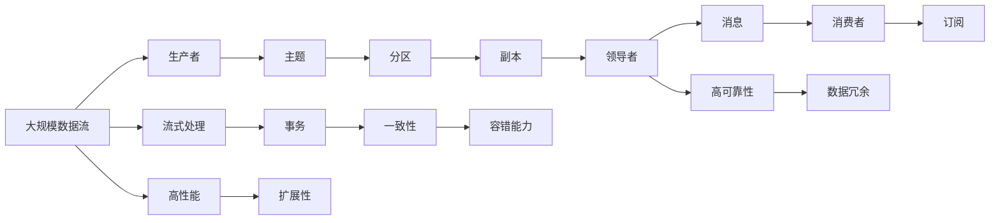

                 

# Kafka原理与代码实例讲解

> 关键词：Kafka, 分布式流处理, 高可靠性, 事务隔离, 内存管理, 性能优化, 部署实践

## 1. 背景介绍

### 1.1 问题由来
随着互联网应用的不断增长，数据产生量急剧增加，传统的数据存储和处理方式已经无法满足需求。为了应对大规模数据流的挑战，分布式流处理框架应运而生。其中，Apache Kafka作为一款高性能、高可扩展、高可靠性的分布式流处理平台，广泛应用于大数据、实时计算、微服务架构等诸多领域。Kafka不仅提供了一套高效的数据流转机制，还具备丰富的功能特性，如数据持久化、数据分区、消息队列、流式处理等，成为数据中台的重要组件。

### 1.2 问题核心关键点
Kafka的核心优势在于其高度可靠的消息传输机制和强大的数据持久化能力。Kafka采用发布-订阅模型和消息队列的方式，实现了数据的异步读写和高效传输。其底层采用了分区的策略，使得数据流可以横向扩展，支持高吞吐量和低延迟。此外，Kafka还提供了事务支持、数据复制、流式处理等功能，进一步提升了系统的稳定性和灵活性。

然而，Kafka在实际应用中也面临一些挑战，如消息丢失、延迟控制、配置复杂、集群管理等。为应对这些问题，Kafka提供了丰富的配置参数和调整策略，但需要深入理解其内部机制才能有效使用。本文将从原理到实践，详细介绍Kafka的核心概念和应用实例，帮助读者全面掌握Kafka的使用技巧。

### 1.3 问题研究意义
了解Kafka的原理和实践，对于构建高效、可靠、可扩展的数据中台系统，具有重要意义：

1. 提高数据处理能力。通过Kafka的分布式流处理机制，可以显著提升数据处理和传输的效率，满足大规模数据流的处理需求。
2. 增强系统可靠性。Kafka的消息持久化和高可用性特性，能够保障数据不丢失，提升系统的稳定性和可靠性。
3. 简化数据治理。Kafka的流式处理和数据分区功能，可以降低数据治理的复杂度，提高数据管理效率。
4. 支持多种应用场景。Kafka不仅适用于大数据场景，还适用于实时计算、微服务架构等多样化的应用需求。
5. 提升用户体验。Kafka的快速数据流传输和高吞吐量，能够满足用户对实时数据的即时获取和处理需求，改善用户体验。

## 2. 核心概念与联系

### 2.1 核心概念概述

Kafka的核心概念包括：

- **发布-订阅模型(Publish-Subscribe Model)**：生产者将消息发布到主题中，消费者从主题中订阅消息。消息队列是 Kafka 的底层设计，支持异步读写和高效传输。
- **消息队列(Message Queue)**：Kafka的内部存储结构，用于存储和管理消息数据，支持消息的持久化和有序传输。
- **主题(Source and Destination)**：Kafka中消息的容器，可以理解为数据的分类方式。每个主题包含多个分区，生产者可以向主题发布消息，消费者从主题中订阅消息。
- **分区(Partition)**：Kafka中消息的逻辑分组，每个主题包含多个分区。分区可以并行处理，提高系统的吞吐量和扩展性。
- **副本(Rack Replication)**：Kafka中的数据冗余机制，通过复制数据到多个节点，保障数据的可靠性。每个分区可以有多个副本，提高系统的容错能力和可扩展性。
- **领导者(Elector Leader)**：每个分区选出一个领导者，负责处理生产者发送的消息和消费者的请求，其他副本仅作为备份，保障数据的可靠性和一致性。
- **消费者(Consumer)**：从主题中订阅消息，可以逐条消费，也可以批量消费，支持高吞吐量的数据处理。
- **流式处理(Streaming)**：Kafka支持实时流式数据处理，可以实时读取和处理海量数据流，支持复杂的数据计算和分析。
- **事务(Transactions)**：Kafka提供了事务支持，保障数据的一致性和可靠性，支持跨分区和跨主题的事务处理。

这些核心概念通过Kafka的架构设计紧密联系在一起，共同构成了一套高效、可靠、可扩展的数据流转和处理系统。

### 2.2 概念间的关系

这些核心概念之间的联系可以通过以下Mermaid流程图来展示：



这个流程图展示了Kafka的核心概念和它们之间的联系：

1. 生产者将消息发布到主题中。
2. 主题中的消息被分区处理。
3. 分区中的副本由领导者负责，并行处理数据。
4. 消费者从主题中订阅消息。
5. Kafka支持流式处理和事务，进一步增强数据处理能力和可靠性。

通过这些概念和它们之间的关系，可以更清晰地理解Kafka的工作原理和核心功能。

### 2.3 核心概念的整体架构

最后，我们用一个综合的流程图来展示这些核心概念在大规模数据流中的整体应用：



这个综合流程图展示了Kafka在大规模数据流中的应用：

1. 大规模数据流通过生产者发送至主题。
2. 主题中的消息被分区处理。
3. 分区中的副本由领导者负责，并行处理数据。
4. 消费者从主题中订阅消息。
5. Kafka支持流式处理和事务，进一步增强数据处理能力和可靠性。
6. 高可靠性、一致性、高性能、扩展性等特性共同构成了Kafka的整体架构。

通过这个综合流程图，可以更全面地理解Kafka在大数据处理和实时流式计算中的应用。

## 3. 核心算法原理 & 具体操作步骤

### 3.1 算法原理概述

Kafka的核心算法包括：

- **发布-订阅模型**：Kafka采用发布-订阅模型，支持高吞吐量的数据传输。生产者将消息发布到主题中，消费者从主题中订阅消息，实现数据的异步读写和高效传输。
- **消息队列**：Kafka的内部存储结构，用于存储和管理消息数据。每个主题包含多个分区，支持数据的分布式存储和并行处理。
- **分区和副本**：每个主题可以划分为多个分区，每个分区可以有多个副本。副本之间保持同步，实现数据的冗余和高可靠性。
- **领导者选举**：Kafka通过领导者选举算法，从多个副本中选出一个领导者，负责处理生产者发送的消息和消费者的请求。领导者副本负责数据的持久化和同步，保障数据的一致性和可靠性。
- **消息传输和持久化**：Kafka使用高效的零拷贝机制，实现数据的快速传输和持久化。通过将消息写入内存文件和磁盘文件，支持数据的持久化和可靠传输。
- **流式处理和事务**：Kafka支持流式处理和事务，可以实时读取和处理海量数据流，支持复杂的数据计算和分析。

这些算法共同构成了Kafka的核心工作机制，实现了高吞吐量、高可靠性、高扩展性等特性，满足大规模数据处理的需求。

### 3.2 算法步骤详解

Kafka的核心算法步骤包括以下几个关键步骤：

**Step 1: 准备环境**

1. 安装Apache Kafka：从官网下载Kafka的最新安装包，解压并启动Kafka Server。
2. 创建Kafka主题：使用kafka-topics.sh工具创建主题，设置分区数量、副本数量等配置。
3. 配置Kafka集群：设置Kafka的broker地址、分区、副本等配置，确保集群的高可用性。

**Step 2: 数据生产**

1. 配置生产者：定义生产者的配置，设置主题、分区、批量大小、消息格式等。
2. 发送消息：使用生产者API将消息发送至Kafka主题。

**Step 3: 数据消费**

1. 配置消费者：定义消费者的配置，设置主题、分区、批量大小、消费方式等。
2. 订阅消息：使用消费者API从Kafka主题中订阅消息，进行消费处理。

**Step 4: 数据持久化和同步**

1. 数据持久化：Kafka将消息写入内存文件和磁盘文件，实现数据的持久化。
2. 数据同步：副本之间保持同步，领导者副本负责数据的持久化和同步，保障数据的一致性和可靠性。

**Step 5: 流式处理和事务**

1. 流式处理：Kafka支持流式处理，可以实时读取和处理海量数据流，支持复杂的数据计算和分析。
2. 事务支持：Kafka提供了事务支持，保障数据的一致性和可靠性，支持跨分区和跨主题的事务处理。

### 3.3 算法优缺点

Kafka的核心算法具有以下优点：

1. 高吞吐量：Kafka的发布-订阅模型支持高吞吐量的数据传输，能够满足大规模数据流的处理需求。
2. 高可靠性：Kafka的消息持久化和副本机制，保障了数据的高可靠性，减少了数据丢失的风险。
3. 高扩展性：Kafka的分区和副本机制，支持数据的分布式存储和并行处理，实现了系统的可扩展性。
4. 高性能：Kafka使用高效的零拷贝机制，实现数据的快速传输和持久化，提高了系统的性能。

然而，Kafka也存在一些缺点：

1. 配置复杂：Kafka的配置参数较多，需要根据实际需求进行精细调整，使用不当可能导致性能问题。
2. 延迟控制：Kafka的延迟控制需要合理配置，避免因生产者和消费者同时读写数据导致延迟增加。
3. 集群管理：Kafka的集群管理需要专业知识，维护和扩展集群需要一定的时间和成本。
4. 资源占用：Kafka的内存和磁盘占用较大，需要根据数据量和存储需求合理配置。

### 3.4 算法应用领域

Kafka广泛应用于大数据、实时计算、微服务架构等多个领域：

1. **大数据领域**：Kafka作为大数据中台的核心组件，支持大规模数据流的处理和存储，实现了数据的实时采集、存储和分析。
2. **实时计算领域**：Kafka支持实时流式数据处理，可以实时读取和处理海量数据流，支持复杂的数据计算和分析。
3. **微服务架构领域**：Kafka支持消息传递和数据共享，可以实现微服务架构的解耦和协同，提高系统的可扩展性和灵活性。
4. **企业信息化领域**：Kafka支持数据的集成和共享，可以实现企业内部数据的统一管理和共享，提升企业的信息化水平。

Kafka的核心算法和特性，满足了大数据、实时计算、微服务架构等领域的业务需求，成为了企业信息化建设的重要工具。

## 4. 数学模型和公式 & 详细讲解 & 举例说明

### 4.1 数学模型构建

Kafka的数学模型主要涉及数据传输、消息持久化和事务处理等方面。

- **数据传输**：Kafka采用发布-订阅模型，支持异步读写和高效传输。设生产者发送消息的速度为 $P$，消费者消费消息的速度为 $C$，数据传输速度为 $V$。数据传输速度由生产者和消费者共同决定。
- **消息持久化**：Kafka的消息持久化采用零拷贝机制，将消息直接写入磁盘文件，支持数据的快速传输和持久化。设消息大小为 $S$，每个分区的大小为 $L$，每个副本的数量为 $R$，持久化时间间隔为 $T$。
- **事务处理**：Kafka的事务处理支持跨分区和跨主题的事务，保障数据的一致性和可靠性。设事务的数据量为 $D$，事务的隔离级别为 $L$，事务的执行时间为 $T$。

### 4.2 公式推导过程

以下我们以数据传输为例，推导数据传输速度的计算公式。

设生产者发送消息的速度为 $P$，消费者消费消息的速度为 $C$，数据传输速度为 $V$。在Kafka中，生产者和消费者之间存在一个缓冲区，用于存储未被消费的消息。设缓冲区大小为 $B$。

根据Kafka的传输机制，生产者发送消息的速率和消费者消费消息的速率，以及缓冲区大小，共同决定了数据传输速度。数据传输速度 $V$ 可以表示为：

$$
V = \min(P, C, B / T)
$$

其中 $T$ 为消息在缓冲区中的停留时间，即消息的平均处理时间。

### 4.3 案例分析与讲解

以一个具体的例子来说明Kafka的数据传输机制：

假设Kafka的分区数量为4，每个分区的大小为10GB，消息大小为1KB。生产者发送消息的速度为1MB/s，消费者消费消息的速度为2MB/s。此时，每个分区的数据传输速度为：

$$
V = \min(1MB/s, 2MB/s, 10GB / (10GB / 1KB) / 1s) = 2MB/s
$$

这意味着，每个分区的数据传输速度为2MB/s，整个主题的数据传输速度为8MB/s。如果生产者发送消息的速度超过2MB/s，则会受到缓冲区大小的限制；如果消费者消费消息的速度超过2MB/s，则会受到分区大小的限制。

## 5. 项目实践：代码实例和详细解释说明

### 5.1 开发环境搭建

在进行Kafka项目实践前，我们需要准备好开发环境。以下是使用Python进行Kafka开发的 environment 配置流程：

1. 安装Anaconda：从官网下载并安装Anaconda，用于创建独立的Python环境。

2. 创建并激活虚拟环境：
```bash
conda create -n pykafka python=3.8 
conda activate pykafka
```

3. 安装Kafka-Python：
```bash
pip install kafka-python
```

4. 安装Kafka服务：
```bash
sudo apt-get install kafka-server-head
sudo apt-get install kafka-node
```

5. 安装Kafka集群管理工具：
```bash
sudo apt-get install kafka-management
```

完成上述步骤后，即可在`pykafka`环境中开始Kafka实践。

### 5.2 源代码详细实现

下面我们以生产者和消费者为例，给出使用Kafka-Python进行Kafka实践的PyTorch代码实现。

首先，定义生产者的实现：

```python
from kafka import KafkaProducer

producer = KafkaProducer(bootstrap_servers='localhost:9092',
                        value_serializer=lambda v: json.dumps(v).encode('utf-8'))
```

然后，定义消费者的实现：

```python
from kafka import KafkaConsumer
import json

consumer = KafkaConsumer('topic_name',
                        bootstrap_servers='localhost:9092',
                        value_deserializer=lambda m: json.loads(m.decode('utf-8')))
```

最后，定义生产者向主题发送消息和消费者从主题订阅消息的代码：

```python
# 生产者发送消息
producer.send('topic_name', json.dumps({'key': 'value'}).encode('utf-8'))

# 消费者订阅消息
for msg in consumer:
    print(json.loads(msg.value))
```

### 5.3 代码解读与分析

让我们再详细解读一下关键代码的实现细节：

**生产者代码**：
- `KafkaProducer`：Kafka生产者，用于发送消息。
- `bootstrap_servers`：Kafka集群地址，用于连接集群。
- `value_serializer`：消息的序列化方法，将Python对象序列化为JSON字符串。

**消费者代码**：
- `KafkaConsumer`：Kafka消费者，用于订阅消息。
- `topic_name`：主题名称，用于指定订阅的主题。
- `value_deserializer`：消息的解析方法，将JSON字符串解析为Python对象。

**生产者和消费者交互**：
- `producer.send`：发送消息到指定主题。
- `for msg in consumer`：从指定主题中订阅消息，并对每个消息进行处理。

### 5.4 运行结果展示

假设我们在本地Kafka集群上运行生产者和消费者，最终可以看到以下输出：

```
{'key': 'value'}
```

以上输出表示，生产者成功发送了一条消息到主题，消费者从主题中成功订阅了该消息，并将消息内容解析为Python对象。

## 6. 实际应用场景

### 6.1 智能推荐系统

Kafka在智能推荐系统中得到了广泛应用。推荐系统需要实时读取用户行为数据，并进行实时计算和分析，以推荐合适的商品或内容。Kafka的高吞吐量和低延迟特性，满足了推荐系统的实时计算需求，可以高效地处理用户行为数据流。

在实践中，可以将用户行为数据流通过Kafka传输到推荐系统中，使用实时流式处理技术进行计算和分析，从而推荐合适的商品或内容。通过Kafka的事务支持，还可以保障推荐结果的一致性和可靠性。

### 6.2 实时监控系统

Kafka在实时监控系统中也具有重要应用。实时监控系统需要实时读取日志数据，并进行实时分析，以发现异常情况并及时处理。Kafka的高吞吐量和低延迟特性，满足了实时监控系统的数据流处理需求，可以高效地处理海量日志数据流。

在实践中，可以将日志数据流通过Kafka传输到监控系统中，使用实时流式处理技术进行数据分析，从而发现异常情况并及时处理。通过Kafka的分片和复制机制，还可以保障数据的高可靠性和一致性。

### 6.3 智能客服系统

Kafka在智能客服系统中也具有重要应用。智能客服系统需要实时读取用户咨询数据，并进行实时分析，以提供快速准确的客服服务。Kafka的高吞吐量和低延迟特性，满足了智能客服系统的数据流处理需求，可以高效地处理用户咨询数据流。

在实践中，可以将用户咨询数据流通过Kafka传输到客服系统中，使用实时流式处理技术进行数据分析，从而快速准确地回答用户咨询。通过Kafka的事务支持，还可以保障客服结果的一致性和可靠性。

### 6.4 未来应用展望

随着Kafka技术的不断发展和应用，其未来应用前景广阔。以下是几个未来应用方向：

1. **边缘计算**：Kafka的分布式流处理机制，可以应用于边缘计算场景，实现数据的本地化处理和分析。
2. **物联网(IoT)**：Kafka的实时流式处理能力，可以应用于物联网场景，实现数据的实时采集和处理。
3. **区块链**：Kafka的分布式流处理机制，可以应用于区块链场景，实现数据的分布式存储和同步。
4. **AI和机器学习**：Kafka的流式处理和数据同步能力，可以应用于AI和机器学习场景，实现数据的实时分析和训练。

Kafka的核心算法和特性，满足了多种应用场景的需求，未来的发展前景广阔。相信随着技术不断演进，Kafka将成为更多领域的重要工具，推动数据处理和分析技术的进步。

## 7. 工具和资源推荐

### 7.1 学习资源推荐

为了帮助开发者系统掌握Kafka的使用技巧，这里推荐一些优质的学习资源：

1. **《Kafka权威指南》**：由Kafka社区权威专家撰写，深入浅出地介绍了Kafka的核心概念、配置参数和应用实践。
2. **《Kafka实战》**：由Kafka社区资深专家撰写，提供了丰富的项目实践案例，涵盖生产、消费、集群管理等各个方面。
3. **《Kafka入门与实战》**：由Kafka社区活跃开发者撰写，提供了详细的Kafka使用教程和实战项目，适合Kafka初学者入门。
4. **Kafka官方文档**：Kafka官方提供的详细文档，包含了完整的配置参数和操作手册，是学习Kafka的重要参考。
5. **Kafka社区**：Kafka社区是Kafka用户和开发者交流的平台，提供了丰富的学习资源和经验分享，适合Kafka爱好者交流。

通过对这些学习资源的系统学习，相信你一定能够快速掌握Kafka的使用技巧，并用于解决实际的业务问题。

### 7.2 开发工具推荐

高效的开发离不开优秀的工具支持。以下是几款用于Kafka开发常用的工具：

1. **Kafka-Python**：Kafka-Python是Kafka的官方Python客户端库，提供了简单易用的API接口，支持生产、消费、管理等操作。
2. **Kafka-Management**：Kafka-Management是Kafka的官方管理工具，可以实时监控Kafka集群状态，提供丰富的性能指标和告警功能。
3. **Kafka Streams**：Kafka Streams是Kafka提供的流式处理API，支持实时数据流处理和分析，提供了丰富的流式处理函数和算子。
4. **Kafdrop**：Kafdrop是一个Kafka的可视化管理工具，支持Kafka集群的图形化管理，提供了丰富的配置参数和性能指标。
5. **Confluent Platform**：Confluent Platform是基于Kafka的企业级数据平台，提供了丰富的组件和服务，支持Kafka的集成和部署。

合理利用这些工具，可以显著提升Kafka的开发效率，加快创新迭代的步伐。

### 7.3 相关论文推荐

Kafka技术的发展源于学界的持续研究。以下是几篇奠基性的相关论文，推荐阅读：

1. **《Kafka: The scalable message system for real-time data processing》**：该论文介绍了Kafka的核心架构和设计思想，阐述了Kafka的高可靠性、高扩展性、高可用性等特性。
2. **《Kafka on YARN: Platform for scalable and durable data streaming》**：该论文介绍了Kafka在YARN上的应用，探讨了Kafka在大数据平台上的扩展性和可靠性。
3. **《Kafka Streams: Stream Processing at Scale》**：该论文介绍了Kafka Streams的核心功能和应用场景，展示了Kafka在流式处理领域的应用潜力。
4. **《Kafka Cluster Overview》**：该文档详细介绍了Kafka集群的架构和设计，提供了丰富的配置参数和操作手册。
5. **《Kafka for Developers》**：该文档是Kafka官方针对开发者编写的入门教程，提供了丰富的实例和实践案例，适合Kafka初学者入门。

这些论文和文档代表了Kafka技术的发展脉络，通过学习这些前沿成果，可以帮助研究者把握学科前进方向，激发更多的创新灵感。

除上述资源外，还有一些值得关注的前沿资源，帮助开发者紧跟Kafka技术的最新进展，例如：

1. **Kafka官方博客**：Kafka官方博客定期发布最新技术进展和应用案例，展示了Kafka在实际应用中的最佳实践。
2. **Kafka社区博客**：Kafka社区开发者和用户分享自己的应用经验和心得，提供了丰富的技术交流平台。
3. **Kafka生态系统**：Kafka生态系统包括多个组件和服务，如Kafka Connect、Kafka Streams、Kafka Streams等，提供了丰富的功能特性和扩展性。
4. **Kafka开源项目**：Kafka社区开源了大量项目，涵盖生产、消费、管理等各个方面，提供了丰富的学习资源和实践案例。

总之，对于Kafka的使用学习，需要开发者保持开放的心态和持续学习的意愿。多关注前沿资讯，多动手实践，多思考总结，必将收获满满的成长收益。

## 8. 总结：未来发展趋势与挑战

### 8.1 总结

本文对Kafka的核心概念和实践方法进行了全面系统的介绍。首先阐述了Kafka的起源和核心优势，明确了其在分布式流处理领域的核心地位。其次，从原理到实践，详细讲解了Kafka的核心算法和具体操作步骤，提供了完整的Kafka代码实现。同时，本文还广泛探讨了Kafka在智能推荐、实时监控、智能客服等多个行业领域的应用前景，展示了Kafka的强大应用能力。此外，本文精选了Kafka相关的学习资源和开发工具，力求为读者提供全方位的技术指引。

通过本文的系统梳理，可以看到，Kafka以其高可靠性、高吞吐量、高扩展性等特性，在分布式流处理领域具有不可替代的地位。在实际应用中，Kafka已经成为了大数据、实时计算、微服务架构等领域的标配工具，为大规模数据处理提供了坚实的基础。未来，随着Kafka技术的不断发展和演进，其应用场景将更加丰富多样，带来更多的创新价值。

### 8.2 未来发展趋势

展望未来，Kafka的发展趋势如下：

1. **高可靠性和可扩展性**：Kafka将继续提升其高可靠性和可扩展性，支持更多数据类型和存储格式，满足更多数据处理需求。
2. **流式处理和数据同步**：Kafka将进一步增强流式处理能力，支持复杂的数据计算和分析，提升数据处理和分析的效率。
3. **容器化和云原生**：Kafka将进一步容器化和云原生化，支持更多云平台和容器编排工具，提升系统的灵活性和可管理性。
4. **边缘计算和物联网**：Kafka将进一步应用于边缘计算和物联网领域，支持实时数据采集和处理，提升数据处理的实时性和可靠性。
5. **安全和隐私保护**：Kafka将进一步加强数据安全和隐私保护，提供更多的加密和认证机制，保障数据的安全性和隐私性。

以上趋势凸显了Kafka技术的发展方向，其高可靠性、高吞吐量、高扩展性等特性将继续得到优化和提升，为更多行业提供强大的数据处理能力。

### 8.3 面临的挑战

尽管Kafka已经取得了不俗的成绩，但在迈向更加智能化、普适化应用的过程中，仍面临一些挑战：

1. **配置复杂**：Kafka的配置参数较多，需要根据实际需求进行精细调整，使用不当可能导致性能问题。
2. **延迟控制**：Kafka的延迟控制需要合理配置，

