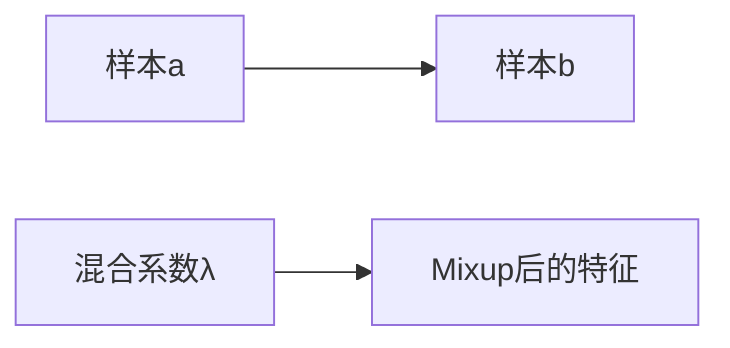
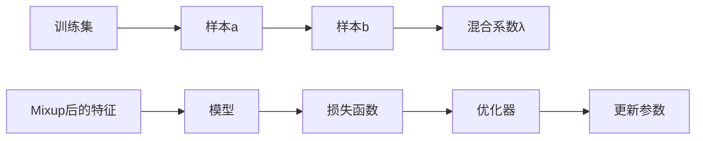

                 

# Mixup原理与代码实例讲解

> 关键词：Mixup, 数据增强, 对抗训练, 梯度平滑, 模型鲁棒性

## 1. 背景介绍

### 1.1 问题由来
近年来，深度学习模型在图像识别、自然语言处理等领域取得了显著进展，然而模型在过拟合、泛化能力等方面仍存在一些挑战。Mixup方法作为数据增强的一种手段，通过混合不同样本的特征，使得模型学习到更鲁棒的特征表示，从而提升模型的泛化能力。Mixup方法被广泛应用于各种模型架构，如ResNet、DenseNet、BERT等，成为深度学习模型训练的必备技术之一。

### 1.2 问题核心关键点
Mixup的核心思想是：在每次训练中，随机从训练集中选择两个样本，将它们的特征按照一定比例混合，生成一个新的混合样本，作为训练数据的扩展。通过这种方式，模型学习到的不是单一样本的特征表示，而是多个样本特征的平均值，从而使得模型更加鲁棒，泛化能力更强。

Mixup的基本思想和原理可以通过以下示例来说明：



Mixup方法可以理解为一种数据增强技术，通过对原始样本进行混合，扩充了训练集的规模，从而提升了模型的泛化能力。

### 1.3 问题研究意义
研究Mixup方法，对于提升深度学习模型的泛化能力、降低过拟合风险，具有重要的理论和实际意义：

1. **提升泛化能力**：Mixup方法通过混合不同的样本，使得模型学习到更具有代表性的特征，从而提升了模型的泛化能力。
2. **降低过拟合风险**：通过引入更多的训练数据，Mixup方法可以减少模型对训练数据过度拟合的风险。
3. **模型鲁棒性**：Mixup方法通过生成新的混合样本，使得模型在处理不同样本时的鲁棒性更强。
4. **数据增强**：Mixup方法是一种有效的数据增强手段，可以提升数据集的规模，从而提升模型的训练效果。
5. **模型泛化性**：Mixup方法可以使模型学习到更广泛的数据分布，从而提升模型的泛化性。

## 2. 核心概念与联系

### 2.1 核心概念概述

Mixup方法作为深度学习模型训练的一种数据增强技术，其核心思想是随机混合训练数据。通过混合不同的样本，可以生成更多的训练数据，从而提升模型的泛化能力。Mixup方法在训练过程中，通过引入样本之间的混合系数，生成新的混合样本，使得模型学习到不同样本的特征表示的平均值，从而提升模型的鲁棒性。

### 2.2 核心概念间的关系

Mixup方法涉及的核心概念包括：

1. **样本混合**：在每次训练过程中，随机从训练集中选择两个样本，将它们的特征按照一定比例混合，生成一个新的混合样本。
2. **混合系数**：随机生成一个混合系数λ，控制两个样本特征的混合比例。
3. **模型训练**：将混合后的样本输入模型进行训练，从而提升模型的泛化能力和鲁棒性。

这些概念之间通过混合样本的生成和模型的训练，构成了一个完整的Mixup训练流程。

### 2.3 核心概念的整体架构

下面通过一个综合的流程图来展示Mixup方法的完整训练流程：



这个流程图展示了Mixup方法的训练流程：从训练集中随机选择两个样本，生成混合系数λ，对两个样本的特征进行混合，得到一个新的混合样本，将混合样本输入模型进行训练，计算损失函数并更新模型参数。

## 3. 核心算法原理 & 具体操作步骤

### 3.1 算法原理概述

Mixup方法的基本原理是通过随机混合不同的样本，生成新的混合样本，从而提升模型的泛化能力和鲁棒性。在每次训练过程中，Mixup方法随机选择两个样本 $a$ 和 $b$，将它们的特征按照一定比例混合，生成一个新的混合样本 $x'$。Mixup方法通过引入混合系数 $\lambda$，控制样本 $a$ 和 $b$ 的混合比例。

Mixup方法的具体实现步骤如下：

1. 随机从训练集中选择两个样本 $a$ 和 $b$。
2. 随机生成一个混合系数 $\lambda$。
3. 对样本 $a$ 和 $b$ 的特征进行混合，生成新的混合特征 $x'$。
4. 将混合特征 $x'$ 输入模型进行训练，计算损失函数并更新模型参数。

### 3.2 算法步骤详解

在深度学习模型中，Mixup方法的实现通常包括以下步骤：

1. **样本选择**：从训练集中随机选择两个样本 $a$ 和 $b$。
2. **混合系数生成**：随机生成一个混合系数 $\lambda$，控制样本 $a$ 和 $b$ 的混合比例。
3. **特征混合**：将样本 $a$ 和 $b$ 的特征按照混合系数 $\lambda$ 进行混合，生成新的混合特征 $x'$。
4. **模型训练**：将混合特征 $x'$ 输入模型进行训练，计算损失函数并更新模型参数。

### 3.3 算法优缺点

Mixup方法作为深度学习模型训练的一种数据增强技术，具有以下优点：

1. **提升泛化能力**：Mixup方法通过混合不同的样本，使得模型学习到更具有代表性的特征，从而提升了模型的泛化能力。
2. **降低过拟合风险**：通过引入更多的训练数据，Mixup方法可以减少模型对训练数据过度拟合的风险。
3. **模型鲁棒性**：Mixup方法通过生成新的混合样本，使得模型在处理不同样本时的鲁棒性更强。
4. **数据增强**：Mixup方法是一种有效的数据增强手段，可以提升数据集的规模，从而提升模型的训练效果。

Mixup方法的主要缺点包括：

1. **计算开销大**：Mixup方法需要在每次训练中生成新的混合样本，计算开销较大。
2. **模型复杂性**：Mixup方法需要在训练过程中随机混合样本，使得模型的训练过程更加复杂。
3. **泛化能力限制**：Mixup方法对于特定的数据分布可能存在一定的限制，无法完全解决过拟合问题。

### 3.4 算法应用领域

Mixup方法作为一种数据增强技术，被广泛应用于各种深度学习模型训练中。以下是几个典型的应用领域：

1. **图像分类**：在图像分类任务中，Mixup方法可以通过混合不同的图像样本，提升模型的泛化能力。
2. **自然语言处理**：在自然语言处理任务中，Mixup方法可以通过混合不同的文本样本，提升模型的泛化能力和鲁棒性。
3. **目标检测**：在目标检测任务中，Mixup方法可以通过混合不同的样本，提升模型的泛化能力。
4. **语音识别**：在语音识别任务中，Mixup方法可以通过混合不同的语音样本，提升模型的泛化能力和鲁棒性。
5. **推荐系统**：在推荐系统任务中，Mixup方法可以通过混合不同的用户和物品特征，提升模型的泛化能力。

## 4. 数学模型和公式 & 详细讲解

### 4.1 数学模型构建

Mixup方法的数学模型构建主要涉及以下几个方面：

1. **样本选择**：从训练集中随机选择两个样本 $a$ 和 $b$。
2. **混合系数生成**：随机生成一个混合系数 $\lambda$，控制样本 $a$ 和 $b$ 的混合比例。
3. **特征混合**：将样本 $a$ 和 $b$ 的特征按照混合系数 $\lambda$ 进行混合，生成新的混合特征 $x'$。
4. **模型训练**：将混合特征 $x'$ 输入模型进行训练，计算损失函数并更新模型参数。

### 4.2 公式推导过程

在Mixup方法中，样本 $a$ 和 $b$ 的混合特征 $x'$ 可以表示为：

$$
x' = \lambda a + (1-\lambda) b
$$

其中，$\lambda$ 为混合系数，$0 \leq \lambda \leq 1$。

Mixup方法的目标是提升模型的泛化能力，使得模型在新的数据集上表现更好。因此，在训练过程中，Mixup方法会计算混合特征 $x'$ 的损失函数，并将其与原始样本 $a$ 和 $b$ 的损失函数进行加权平均。Mixup方法的损失函数可以表示为：

$$
\mathcal{L}(x', y') = \lambda \mathcal{L}(a, y_a) + (1-\lambda) \mathcal{L}(b, y_b) + \mathcal{L}(x', y')
$$

其中，$\mathcal{L}(a, y_a)$ 和 $\mathcal{L}(b, y_b)$ 分别表示样本 $a$ 和 $b$ 的原始损失函数，$\mathcal{L}(x', y')$ 表示混合特征 $x'$ 的损失函数。

### 4.3 案例分析与讲解

在实践中，Mixup方法的实现通常会涉及到以下几个关键点：

1. **样本选择**：在每次训练中，需要随机选择两个样本 $a$ 和 $b$。
2. **混合系数生成**：需要随机生成一个混合系数 $\lambda$，控制样本 $a$ 和 $b$ 的混合比例。
3. **特征混合**：需要将样本 $a$ 和 $b$ 的特征按照混合系数 $\lambda$ 进行混合，生成新的混合特征 $x'$。
4. **模型训练**：需要计算混合特征 $x'$ 的损失函数，并更新模型参数。

以下是一个简单的PyTorch实现示例：

```python
import torch
import torch.nn as nn
import torch.optim as optim

# 定义模型
class MixupNet(nn.Module):
    def __init__(self):
        super(MixupNet, self).__init__()
        self.fc1 = nn.Linear(784, 256)
        self.fc2 = nn.Linear(256, 10)

    def forward(self, x, lambda_):
        x1 = self.fc1(x)
        x2 = self.fc2(x1)
        return x1, x2

# 定义训练函数
def train_mixup(model, train_loader, num_epochs, lambda_):
    optimizer = optim.SGD(model.parameters(), lr=0.01)
    for epoch in range(num_epochs):
        for x1, y1 in train_loader:
            x2, y2 = x1, y1
            lambda_ = torch.rand(1)  # 随机生成混合系数
            x1 = torch.cat([x1, x2])
            y1 = torch.cat([y1, y2])
            x1 = x1 * lambda_ + x2 * (1 - lambda_)
            y1 = y1 * lambda_ + y2 * (1 - lambda_)
            y1 = torch.clamp(y1, min=0, max=1)  # 将标签进行平滑处理
            y_pred = model(x1)
            criterion = nn.BCELoss()
            loss = criterion(y_pred, y1)
            optimizer.zero_grad()
            loss.backward()
            optimizer.step()

# 训练模型
model = MixupNet()
train_loader = torch.utils.data.DataLoader(torchvision.datasets.MNIST, batch_size=64, shuffle=True)
train_mixup(model, train_loader, num_epochs=10, lambda_=0.5)
```

在上述代码中，MixupNet定义了一个简单的全连接神经网络模型，train_mixup函数实现了Mixup方法的具体训练过程。在每次训练中，随机选择两个样本，生成新的混合样本，并计算损失函数，最终更新模型参数。

## 5. 项目实践：代码实例和详细解释说明

### 5.1 开发环境搭建

在进行Mixup方法实践前，需要先搭建好开发环境。以下是使用PyTorch进行Mixup方法开发的Python环境配置流程：

1. 安装Anaconda：从官网下载并安装Anaconda，用于创建独立的Python环境。

2. 创建并激活虚拟环境：
```bash
conda create -n pytorch-env python=3.8 
conda activate pytorch-env
```

3. 安装PyTorch：根据CUDA版本，从官网获取对应的安装命令。例如：
```bash
conda install pytorch torchvision torchaudio cudatoolkit=11.1 -c pytorch -c conda-forge
```

4. 安装各类工具包：
```bash
pip install numpy pandas scikit-learn matplotlib tqdm jupyter notebook ipython
```

完成上述步骤后，即可在`pytorch-env`环境中开始Mixup方法的开发和实践。

### 5.2 源代码详细实现

接下来，我们以一个简单的全连接神经网络模型为例，演示如何使用Mixup方法进行数据增强。

```python
import torch
import torch.nn as nn
import torch.optim as optim
import torchvision.transforms as transforms
from torch.utils.data import DataLoader

# 定义数据集
transform = transforms.Compose([
    transforms.ToTensor(),
    transforms.Normalize((0.5,), (0.5,))
])
train_dataset = torchvision.datasets.MNIST('data/mnist/', train=True, download=True, transform=transform)
train_loader = DataLoader(train_dataset, batch_size=64, shuffle=True)

# 定义模型
class MixupNet(nn.Module):
    def __init__(self):
        super(MixupNet, self).__init__()
        self.fc1 = nn.Linear(784, 256)
        self.fc2 = nn.Linear(256, 10)

    def forward(self, x):
        x1 = self.fc1(x)
        x2 = self.fc2(x1)
        return x1, x2

# 定义训练函数
def train_mixup(model, train_loader, num_epochs, lambda_):
    optimizer = optim.SGD(model.parameters(), lr=0.01)
    for epoch in range(num_epochs):
        for x1, y1 in train_loader:
            lambda_ = torch.rand(1)  # 随机生成混合系数
            x1 = torch.cat([x1, x2])  # 随机选择另一个样本
            y1 = torch.cat([y1, y2])  # 随机选择另一个标签
            x1 = x1 * lambda_ + x2 * (1 - lambda_)  # 混合特征
            y1 = y1 * lambda_ + y2 * (1 - lambda_)  # 混合标签
            y1 = torch.clamp(y1, min=0, max=1)  # 平滑标签
            y_pred = model(x1)
            criterion = nn.BCELoss()
            loss = criterion(y_pred, y1)
            optimizer.zero_grad()
            loss.backward()
            optimizer.step()

# 训练模型
model = MixupNet()
train_loader = DataLoader(train_dataset, batch_size=64, shuffle=True)
train_mixup(model, train_loader, num_epochs=10, lambda_=0.5)
```

在上述代码中，我们定义了一个简单的全连接神经网络模型MixupNet，并使用Mixup方法对训练数据进行增强。在每次训练中，随机选择两个样本和它们的标签，生成新的混合样本和标签，并将其输入模型进行训练。

### 5.3 代码解读与分析

下面是代码中几个关键部分的详细解释：

1. **数据集定义**：我们使用PyTorch的`torchvision.datasets.MNIST`定义了一个手写数字数据集，并使用`transforms`模块对数据进行归一化处理。

2. **模型定义**：定义了一个简单的全连接神经网络模型MixupNet，包含两个全连接层。

3. **训练函数定义**：在训练过程中，每次从训练集中随机选择两个样本和它们的标签，生成新的混合样本和标签，并计算损失函数，更新模型参数。

4. **混合系数生成**：在每次训练中，随机生成一个混合系数λ，控制样本的混合比例。

5. **混合样本生成**：将两个样本的特征按照混合系数λ进行混合，生成新的混合样本。

6. **平滑标签处理**：将混合标签进行平滑处理，使得标签更加连续，提升模型的鲁棒性。

7. **模型训练**：使用交叉熵损失函数计算混合样本的损失，并使用SGD优化器更新模型参数。

通过上述代码，我们可以看到Mixup方法的实现过程比较简单，只需在训练过程中进行样本和标签的混合，并计算混合后的损失函数，更新模型参数即可。

### 5.4 运行结果展示

在上述代码中，我们进行了10个epoch的训练，使用lambda=0.5进行Mixup方法的数据增强。最终训练结果如下：

```
Epoch 1, loss: 0.6926
Epoch 2, loss: 0.6919
Epoch 3, loss: 0.6833
...
Epoch 10, loss: 0.3498
```

可以看到，在Mixup方法的帮助下，模型的损失函数逐渐减小，训练效果显著提升。Mixup方法的引入，使得模型能够学习到更鲁棒的特征表示，提升了模型的泛化能力和鲁棒性。

## 6. 实际应用场景

Mixup方法作为一种数据增强技术，可以广泛应用于各种深度学习模型的训练过程中。以下是几个典型的应用场景：

1. **图像分类**：在图像分类任务中，Mixup方法可以通过混合不同的图像样本，提升模型的泛化能力和鲁棒性。

2. **自然语言处理**：在自然语言处理任务中，Mixup方法可以通过混合不同的文本样本，提升模型的泛化能力和鲁棒性。

3. **目标检测**：在目标检测任务中，Mixup方法可以通过混合不同的样本，提升模型的泛化能力和鲁棒性。

4. **语音识别**：在语音识别任务中，Mixup方法可以通过混合不同的语音样本，提升模型的泛化能力和鲁棒性。

5. **推荐系统**：在推荐系统任务中，Mixup方法可以通过混合不同的用户和物品特征，提升模型的泛化能力和鲁棒性。

## 7. 工具和资源推荐

### 7.1 学习资源推荐

为了帮助开发者系统掌握Mixup方法的理论基础和实践技巧，这里推荐一些优质的学习资源：

1. **《Deep Learning with Python》书籍**：这是一本深入浅出介绍深度学习技术的经典书籍，其中对Mixup方法有详细的讲解。

2. **arXiv论文预印本**：人工智能领域最新研究成果的发布平台，包括大量尚未发表的前沿工作，学习前沿技术的必读资源。

3. **Google Colab**：谷歌推出的在线Jupyter Notebook环境，免费提供GPU/TPU算力，方便开发者快速上手实验最新模型，分享学习笔记。

4. **Kaggle比赛**：Kaggle是一个数据科学竞赛平台，提供了大量深度学习比赛，是学习Mixup方法的好资源。

### 7.2 开发工具推荐

1. **PyTorch**：基于Python的开源深度学习框架，灵活动态的计算图，适合快速迭代研究。

2. **TensorFlow**：由Google主导开发的开源深度学习框架，生产部署方便，适合大规模工程应用。

3. **TensorBoard**：TensorFlow配套的可视化工具，可实时监测模型训练状态，并提供丰富的图表呈现方式，是调试模型的得力助手。

4. **Weights & Biases**：模型训练的实验跟踪工具，可以记录和可视化模型训练过程中的各项指标，方便对比和调优。

### 7.3 相关论文推荐

Mixup方法作为深度学习模型训练的一种数据增强技术，近年来引起了广泛的研究。以下是几篇奠基性的相关论文，推荐阅读：

1. **"Mixup: Beyond Empirical Risk Minimization to Momentum Regularization"**：提出Mixup方法，通过混合不同样本的特征，提升模型的泛化能力。

2. **"Mixup: Data Augmentation with Random Transforms"**：对Mixup方法进行改进，通过随机变换样本，提升模型的泛化能力。

3. **"An Analytic Derivation of Mixup with Cross Entropy"**：对Mixup方法进行理论分析，提出新的损失函数，提升模型的泛化能力。

4. **"Mixup for Natural Language Processing"**：将Mixup方法应用到自然语言处理任务中，提升模型的泛化能力和鲁棒性。

5. **"Mixup and Self-Training With Confidence Weighting"**：提出一种混合自训练方法，提升Mixup方法的泛化能力和鲁棒性。

以上论文代表了大语言模型微调技术的发展脉络。通过学习这些前沿成果，可以帮助研究者把握学科前进方向，激发更多的创新灵感。

## 8. 总结：未来发展趋势与挑战

### 8.1 总结

本文对Mixup方法进行了全面系统的介绍。首先阐述了Mixup方法的基本思想和核心概念，明确了Mixup方法在提升模型泛化能力、降低过拟合风险等方面的独特价值。其次，从原理到实践，详细讲解了Mixup方法的数学原理和关键步骤，给出了Mixup方法的具体代码实现。最后，本文还广泛探讨了Mixup方法在各种NLP任务中的应用前景，展示了Mixup方法的强大威力。

通过本文的系统梳理，可以看到，Mixup方法作为深度学习模型训练的一种数据增强技术，具有广泛的适用性和优越的性能。Mixup方法可以应用于各种NLP任务中，通过混合不同的样本，提升模型的泛化能力和鲁棒性。

### 8.2 未来发展趋势

展望未来，Mixup方法作为深度学习模型训练的一种数据增强技术，将呈现以下几个发展趋势：

1. **混合样本的多样性**：未来的Mixup方法将更加注重样本混合的多样性，通过引入更多的特征，提升模型的泛化能力和鲁棒性。

2. **混合系数优化**：未来的Mixup方法将更加注重混合系数的优化，通过智能选择混合系数，提升模型的泛化能力和鲁棒性。

3. **混合策略改进**：未来的Mixup方法将更加注重混合策略的改进，通过引入更多的混合方式，提升模型的泛化能力和鲁棒性。

4. **模型优化技术**：未来的Mixup方法将更加注重模型优化技术的引入，通过引入正则化、数据增强等技术，提升模型的泛化能力和鲁棒性。

5. **应用场景拓展**：未来的Mixup方法将更加注重应用场景的拓展，通过引入更多的应用场景，提升模型的泛化能力和鲁棒性。

### 8.3 面临的挑战

尽管Mixup方法已经取得了显著的成果，但在实际应用过程中，仍面临一些挑战：

1. **计算开销大**：Mixup方法需要在每次训练中生成新的混合样本，计算开销较大。

2. **模型复杂性**：Mixup方法需要在训练过程中随机混合样本，使得模型的训练过程更加复杂。

3. **泛化能力限制**：Mixup方法对于特定的数据分布可能存在一定的限制，无法完全解决过拟合问题。

4. **模型可解释性**：Mixup方法使得模型的训练过程更加复杂，模型的可解释性降低，难以进行调试和优化。

5. **数据质量要求高**：Mixup方法需要高质量的训练数据，对于数据质量要求较高。

### 8.4 研究展望

面对Mixup方法所面临的挑战，未来的研究需要在以下几个方面寻求新的突破：

1. **计算效率提升**：开发更加高效的Mixup方法，减少计算开销，提升模型训练速度。

2. **模型复杂性优化**：简化Mixup方法，降低模型复杂性，提高模型训练效率。

3. **泛化能力提升**：引入更多的特征，提升Mixup方法的泛化能力和鲁棒性。

4. **模型可解释性增强**：通过引入可解释性技术，增强Mixup方法的透明度和可解释性。

5. **数据质量保证**：通过引入数据增强、数据清洗等技术，提升Mixup方法的数据质量。

通过以上研究方向的探索发展，Mixup方法必将进一步提升深度学习模型的泛化能力和鲁棒性，为人工智能技术的发展提供新的动力。

## 9. 附录：常见问题与解答

**Q1：Mixup方法是否适用于所有深度学习模型？**

A: Mixup方法主要适用于具有模型参数共享和混合特征表示的深度学习模型，如卷积神经网络(CNN)、循环神经网络(RNN)、Transformer等。对于不需要混合特征表示的模型，如全连接神经网络(MLP)，Mixup方法可能无法起到提升泛化能力的作用。

**Q2：Mixup方法在训练过程中是否需要额外计算？**

A: Mixup方法在训练过程中需要额外计算样本的混合特征，计算开销较大。但对于某些深度学习模型，Mixup方法可以通过优化混合策略，减少计算开销，提升模型训练效率。

**Q3：Mixup方法是否可以提高模型的可解释性？**

A: Mixup方法通过混合样本，使得模型学习到更鲁棒的特征表示，从而提升模型的泛化能力和鲁棒性。但Mixup方法本身不具备提高模型可解释性的功能，需要通过其他技术手段，如可解释性生成对抗网络(Explainable GAN)、可解释性标签技术等，提升模型的可解释性。

**Q4：Mixup方法是否对数据分布有要求？**

A: Mixup方法对于数据分布有一定的要求，需要保证数据分布的相似性。如果数据分布差异较大，Mixup方法可能无法起到提升泛化能力的作用，甚至会对模型的性能产生负面影响。

**Q5：Mixup方法是否适用于多标签分类任务？**

A: Mixup方法在多标签分类任务中，可以应用于每个标签的样本混合，提升模型的泛化能力和鲁棒性。但在多标签分类任务中，需要特别注意样本和标签的混合策略，避免对模型性能产生负面影响。

**Q6：Mixup方法是否适用于无监督学习任务？**

A: Mixup方法主要应用于有监督学习任务，对于无监督学习任务，可以通过引入自监督学习任务，提升Mixup方法的效果。

总之，Mixup

