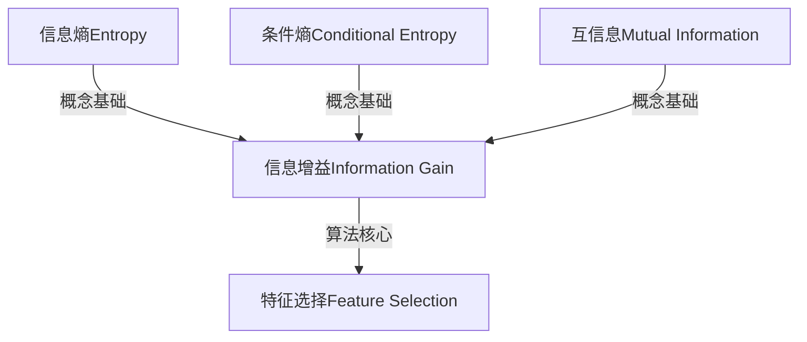

# 信息增益Information Gain原理与代码实例讲解

## 1. 背景介绍

### 1.1 问题的由来

在机器学习和数据挖掘领域中,特征选择是一个非常重要的预处理步骤。特征选择的目的是从原始数据集中选择出最相关和最有价值的特征子集,以提高模型的准确性和效率。在众多特征选择算法中,信息增益(Information Gain)是一种广为人知和常用的算法。

信息增益算法源于信息论中的信息熵(Information Entropy)概念,它衡量了特征对于分类的"纯度"贡献。通过计算每个特征的信息增益值,我们可以评估该特征对于预测目标变量的重要性。具有较高信息增益值的特征将被选择,而那些信息增益值较低的特征将被舍弃。

### 1.2 研究现状

信息增益算法最早由Claude Shannon在1948年提出,用于量化不确定性。随后,它被J.R.Quinlan在1986年的ID3决策树算法中应用,成为特征选择的一种常用方法。近年来,信息增益算法在机器学习、数据挖掘、模式识别等领域得到了广泛应用,成为特征选择的基础算法之一。

尽管信息增益算法简单高效,但它也存在一些缺陷,如对于连续值特征的处理效果不佳,以及容易受到特征值数量的影响。为了解决这些问题,研究人员提出了一些改进算法,如信息增益比(Information Gain Ratio)和基尼指数(Gini Index)等。

### 1.3 研究意义

信息增益算法在特征选择中具有重要意义:

1. **提高模型精度**:通过选择最相关的特征,可以减少噪声和冗余数据的影响,从而提高模型的预测精度。
2. **降低计算复杂度**:减少特征数量可以降低模型训练和预测的计算复杂度,提高效率。
3. **增强模型可解释性**:选择出最重要的特征,有助于理解模型的决策过程,提高可解释性。
4. **降低数据维度**:特征选择可以有效降低数据维度,缓解"维数灾难"问题。

### 1.4 本文结构

本文将全面介绍信息增益算法的原理、数学模型、代码实现和应用场景。文章结构如下:

1. 背景介绍
2. 核心概念与联系
3. 核心算法原理与具体操作步骤
4. 数学模型和公式详细讲解与举例说明
5. 项目实践:代码实例和详细解释说明
6. 实际应用场景
7. 工具和资源推荐
8. 总结:未来发展趋势与挑战
9. 附录:常见问题与解答

## 2. 核心概念与联系

在介绍信息增益算法之前,我们需要先了解一些核心概念:

1. **信息熵(Information Entropy)**
   - 信息熵是信息论中的一个基本概念,用于衡量随机变量的不确定性程度。
   - 熵值越高,表示随机变量的不确定性越大;熵值越低,表示随机变量的确定性越高。

2. **条件熵(Conditional Entropy)**
   - 条件熵表示在已知另一个随机变量的条件下,随机变量的不确定性程度。
   - 条件熵的值取决于两个随机变量之间的关联程度。

3. **互信息(Mutual Information)**
   - 互信息衡量了两个随机变量之间的相关性。
   - 互信息越大,表示两个随机变量之间的相关性越强。

4. **信息增益(Information Gain)**
   - 信息增益是衡量特征对于分类的"纯度"贡献的指标。
   - 信息增益等于原始数据集的信息熵,减去按照该特征划分后各子集的信息熵之和。
   - 信息增益值越高,表示该特征对于预测目标变量越重要。

这些概念之间存在着紧密的联系,信息增益算法正是基于这些概念而衍生出来的。下面我们将详细介绍信息增益算法的原理和数学模型。

## 3. 核心算法原理与具体操作步骤

### 3.1 算法原理概述

信息增益算法的核心思想是:计算每个特征对于分类的"纯度"贡献,选择那些贡献最大(信息增益值最高)的特征。具体来说,算法遵循以下原理:

1. **计算原始数据集的信息熵**,表示数据集的纯度程度。
2. **对于每个特征,根据该特征的不同取值将数据集划分为若干子集**。
3. **计算每个子集的信息熵**,并根据子集的比例计算加权平均值,得到该特征的条件熵。
4. **计算该特征的信息增益**,等于原始数据集的信息熵减去该特征的条件熵。
5. **选择信息增益值最高的特征**,作为分类的最优特征。

通过这种方式,我们可以评估每个特征对于分类的重要性,并选择出最有价值的特征子集。

### 3.2 算法步骤详解

下面我们将详细介绍信息增益算法的具体步骤:

#### 步骤1: 计算原始数据集的信息熵

首先,我们需要计算原始数据集的信息熵,作为评估特征重要性的基准。信息熵的计算公式如下:

$$
H(X) = -\sum_{i=1}^{n}p(x_i)\log_2p(x_i)
$$

其中:
- $X$是离散随机变量,取值为$\{x_1, x_2, ..., x_n\}$
- $p(x_i)$是$X$取值为$x_i$的概率

对于分类问题,我们可以将目标变量的不同类别作为随机变量$X$的取值,计算每个类别的概率$p(x_i)$,然后代入公式计算信息熵。

#### 步骤2: 计算每个特征的条件熵

对于每个特征$A$,我们需要计算它的条件熵$H(X|A)$,表示在已知特征$A$的条件下,目标变量$X$的不确定性程度。条件熵的计算公式如下:

$$
H(X|A) = \sum_{j=1}^{m}p(a_j)H(X|A=a_j)
$$

其中:
- $A$是特征随机变量,取值为$\{a_1, a_2, ..., a_m\}$
- $p(a_j)$是$A$取值为$a_j$的概率
- $H(X|A=a_j)$是在$A=a_j$的条件下,目标变量$X$的信息熵

对于每个特征值$a_j$,我们需要计算$H(X|A=a_j)$,即将数据集按照$A=a_j$划分为子集,然后计算该子集的信息熵。最后,根据每个特征值的概率$p(a_j)$,计算加权平均值,得到该特征的条件熵$H(X|A)$。

#### 步骤3: 计算信息增益

有了原始数据集的信息熵$H(X)$和每个特征的条件熵$H(X|A)$,我们就可以计算每个特征的信息增益$IG(X|A)$:

$$
IG(X|A) = H(X) - H(X|A)
$$

信息增益表示了特征$A$对于预测目标变量$X$的"纯度"贡献。信息增益值越高,表示该特征对于分类越重要。

#### 步骤4: 选择最优特征

最后,我们选择信息增益值最高的特征作为分类的最优特征。具有较高信息增益值的特征将被选择,而那些信息增益值较低的特征将被舍弃。

通过这种方式,我们可以从原始数据集中选择出最相关和最有价值的特征子集,用于构建机器学习模型。

### 3.3 算法优缺点

信息增益算法具有以下优点:

1. **简单高效**:算法原理简单,计算过程直观,易于实现和理解。
2. **无需数据预处理**:算法可以直接处理离散数据和连续数据,无需进行数据归一化等预处理。
3. **无参数调优**:算法本身不需要调整任何参数,可以直接应用于特征选择。
4. **可解释性强**:通过计算每个特征的信息增益值,可以直观地了解特征的重要性排序。

然而,信息增益算法也存在一些缺点:

1. **偏向取值多的特征**:对于取值较多的特征,信息增益值往往会被高估,导致算法偏向选择这些特征。
2. **对连续值特征效果不佳**:对于连续值特征,需要先进行离散化处理,可能会导致信息损失。
3. **不能处理冗余特征**:算法无法有效地识别和去除冗余特征,可能会选择相关性较高的冗余特征。
4. **对缺失值敏感**:算法对缺失值比较敏感,需要进行缺失值处理。

为了解决这些缺点,研究人员提出了一些改进算法,如信息增益比(Information Gain Ratio)和基尼指数(Gini Index)等。

### 3.4 算法应用领域

信息增益算法广泛应用于以下领域:

1. **决策树算法**:信息增益是构建决策树的基础,用于选择最优特征进行节点划分。
2. **特征选择**:在机器学习和数据挖掘中,信息增益常用于特征选择,选择最相关的特征子集。
3. **文本分类**:在自然语言处理中,可以使用信息增益算法选择最有区分能力的词语特征。
4. **基因选择**:在生物信息学中,信息增益可用于选择与疾病相关的基因特征。
5. **图像分割**:在计算机视觉领域,信息增益可用于选择最优特征进行图像分割。

总的来说,信息增益算法在需要进行特征选择和评估特征重要性的场景中都有广泛应用。

## 4. 数学模型和公式详细讲解与举例说明

在前面的章节中,我们已经介绍了信息增益算法的原理和步骤。现在,我们将深入探讨算法背后的数学模型和公式,并通过具体案例进行详细讲解。

### 4.1 数学模型构建

信息增益算法的数学模型基于信息论中的信息熵和条件熵概念。我们将目标变量$X$和特征$A$建模为离散随机变量,分别取值为$\{x_1, x_2, ..., x_n\}$和$\{a_1, a_2, ..., a_m\}$。

首先,我们定义目标变量$X$的信息熵$H(X)$:

$$
H(X) = -\sum_{i=1}^{n}p(x_i)\log_2p(x_i)
$$

其中,$p(x_i)$表示$X$取值为$x_i$的概率。信息熵衡量了目标变量的不确定性程度,值越高表示不确定性越大。

接下来,我们定义特征$A$对目标变量$X$的条件熵$H(X|A)$:

$$
H(X|A) = \sum_{j=1}^{m}p(a_j)H(X|A=a_j)
$$

其中:
- $p(a_j)$是特征$A$取值为$a_j$的概率
- $H(X|A=a_j)$是在$A=a_j$的条件下,目标变量$X$的信息熵

$H(X|A=a_j)$可以通过将数据集按照$A=a_j$划分为子集,然后计算该子集的信息熵得到。

最后,我们定义特征$A$对目标变量$X$的信息增益$IG(X|A)$:

$$
IG(X|A) = H(X) - H(X|A)
$$

信息增益表示了特征$A$对于预测目标变量$X$的"纯度"贡献。信息增益值越高,表示该特征对于分类越重要。

通过计算每个特征的信息增益值,我们可以评估特征的重要性,并选择出