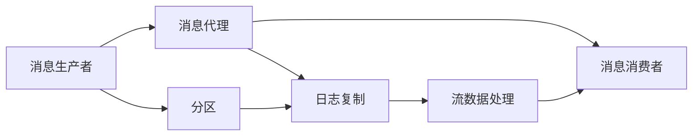
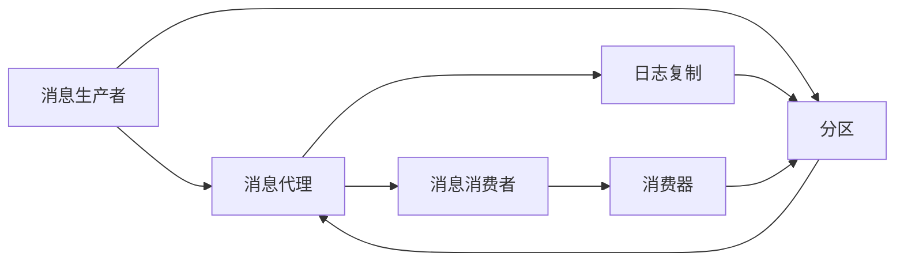
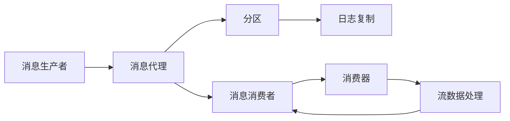
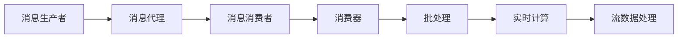

                 

# 【AI大数据计算原理与代码实例讲解】Kafka

> 关键词：Apache Kafka, 分布式消息队列, 流数据处理, 大数据, 数据流, 可靠性, 容错性, 高性能

## 1. 背景介绍

### 1.1 问题由来

随着互联网和移动互联网的迅猛发展，实时数据的产生速度呈指数级增长。这些数据不仅包括了传统的Web点击、广告点击、交易记录等结构化数据，还有社交网络、传感器、物联网等新兴应用产生的大量半结构化和非结构化数据。面对如此庞大的数据洪流，传统的集中式数据库和数据仓库已经难以胜任，分布式数据存储和计算成为了新的趋势。

在此背景下，Apache Kafka作为一款开源的分布式流数据处理平台，凭借其高性能、高可靠性和高可扩展性，迅速成为了大数据和实时计算领域的重要工具。它能够实时地、异步地处理和分发大数据流，支持多种编程语言和数据格式，满足了企业对于大规模数据实时处理的需求。

### 1.2 问题核心关键点

Kafka的核心技术点包括：

1. **分布式架构**：Kafka采用了分布式架构，可以在大规模集群中高效地处理和分发数据。它由消息生产者、消息代理和消息消费者三大部分组成，能够支持大规模的并行处理。

2. **高可靠性**：Kafka采用了日志复制和多副本机制，确保数据的可靠性和持久性。在单节点故障时，数据可以自动切换到其他节点，保证了系统的稳定性和容错性。

3. **高性能**：Kafka采用了零拷贝和批处理技术，能够高效地处理大数据流。它在处理大数据时具有极低的延迟和极高的吞吐量。

4. **高可扩展性**：Kafka能够动态扩展，支持跨数据中心的分布式部署，可以轻松地增加或减少节点，满足不同规模的数据处理需求。

5. **丰富的生态系统**：Kafka拥有庞大的社区和生态系统，支持多种数据处理和计算框架，如Spark、Flink、Storm等，可以无缝集成到企业数据处理流程中。

6. **开源社区**：Kafka是一个开源项目，具有活跃的社区和丰富的文档，提供了大量的示例代码和最佳实践，便于开发者学习和使用。

这些核心技术点使得Kafka成为了处理大规模实时数据的首选工具，广泛应用于金融、社交网络、物联网、实时分析等多个领域。

### 1.3 问题研究意义

研究Kafka的核心原理和应用实践，对于构建高效、可靠、可扩展的实时数据处理系统具有重要意义：

1. **降低数据处理成本**：Kafka能够处理大规模数据流，降低了传统集中式数据库和数据仓库的成本，同时也简化了数据存储和管理的复杂度。

2. **提高数据处理效率**：Kafka采用了高性能的零拷贝和批处理技术，能够高效地处理大数据流，满足了企业对于实时数据处理的高性能需求。

3. **增强系统容错性**：Kafka的多副本机制和日志复制技术，使得系统具有高可靠性和容错性，避免了单点故障和数据丢失的风险。

4. **提升数据处理能力**：Kafka能够动态扩展，支持大规模分布式部署，满足企业对于高吞吐量和高并发处理的需求。

5. **促进数据生态融合**：Kafka丰富的生态系统支持多种数据处理和计算框架，能够无缝集成到企业数据处理流程中，促进了不同技术之间的融合和协同。

6. **支持开源社区**：Kafka的开源特性和活跃社区，为开发者提供了丰富的学习和使用资源，推动了技术的快速发展和应用普及。

## 2. 核心概念与联系

### 2.1 核心概念概述

为了更好地理解Kafka的核心原理，本节将介绍几个密切相关的核心概念：

1. **分布式架构**：Kafka采用了分布式架构，由消息生产者、消息代理和消息消费者三大部分组成。消息生产者将数据产生并发送到Kafka集群，消息代理负责存储和分发数据，消息消费者从消息代理中读取数据。

2. **消息队列**：Kafka中的消息代理实际上是一个分布式消息队列，能够异步地存储和分发数据，支持数据的可靠性和持久性。

3. **日志复制**：Kafka中的每个消息代理都是一个日志系统，通过日志复制机制，确保数据的可靠性和持久性。每个日志副本可以分布在不同的节点上，提高系统的可用性和容错性。

4. **分区**：Kafka将数据按照主题进行分区，每个分区可以独立地进行数据读写和处理。分区机制提高了系统的可扩展性和灵活性。

5. **消费器**：Kafka中的消息消费者可以是批处理框架（如Spark、Flink）、实时计算框架（如Storm、Samza）或者实时流处理工具（如Kinesis、Flume），能够对数据进行高效处理和分析。

6. **流数据处理**：Kafka支持流数据处理，能够实时地、异步地处理和分发大数据流，满足企业对于实时数据处理的需求。

这些核心概念之间存在着紧密的联系，形成了Kafka的完整生态系统。下面通过一个Mermaid流程图来展示它们之间的关系：



### 2.2 概念间的关系

这些核心概念之间存在着紧密的联系，共同构成了Kafka的分布式流数据处理系统。以下通过几个Mermaid流程图来展示它们之间的关系。

#### 2.2.1 Kafka的分布式架构



这个流程图展示了Kafka的分布式架构，由消息生产者、消息代理、消息消费者三大部分组成，通过分区和日志复制机制，确保数据的高可靠性和高可用性。

#### 2.2.2 Kafka的流数据处理



这个流程图展示了Kafka的流数据处理过程，通过消息代理的分区和日志复制机制，将数据流高效地存储和分发，最终由消费器进行处理和分析。

#### 2.2.3 Kafka的消费器



这个流程图展示了Kafka的消费器功能，消费器可以是批处理框架、实时计算框架或者实时流处理工具，能够高效地处理和分析数据流。

### 2.3 核心概念的整体架构

最后，我们用一个综合的流程图来展示这些核心概念在大数据流处理过程中的整体架构：


这个综合流程图展示了从消息生产到数据处理的完整过程，由消息生产者、消息代理、消息消费者、消费器、批处理、实时计算、流数据处理等模块组成，实现了高效、可靠、可扩展的分布式流数据处理。

## 3. 核心算法原理 & 具体操作步骤

### 3.1 算法原理概述

Kafka的核心原理主要包括分布式架构、日志复制、分区和消费器等几个部分。下面将详细介绍这些核心原理。

#### 3.1.1 分布式架构

Kafka的分布式架构由消息生产者、消息代理和消息消费者三大部分组成。消息生产者负责将数据产生并发送到Kafka集群，消息代理负责存储和分发数据，消息消费者从消息代理中读取数据。这种分布式架构可以支持大规模的并行处理，满足企业对于大规模数据实时处理的需求。

#### 3.1.2 日志复制

Kafka中的每个消息代理都是一个日志系统，通过日志复制机制，确保数据的可靠性和持久性。每个日志副本可以分布在不同的节点上，提高系统的可用性和容错性。日志复制机制的核心是消息副本的同步和冲突处理，具体实现如下：

1. 领导者副本：每个分区有一个领导者副本（Leader Replica），负责存储和处理分区中的所有消息。领导者副本可以通过选举机制选择，并负责协调日志复制。

2. 副本同步：当领导者副本接收到新的消息时，会将消息复制到所有副本中，确保所有副本的消息一致性。副本同步机制可以采用异步或者同步两种方式，具体选择取决于系统需求和性能要求。

3. 冲突处理：在多个副本同时更新日志时，可能会产生冲突。Kafka通过版本控制机制，确保消息的一致性和有序性。具体实现方式包括乐观锁和悲观锁两种。

#### 3.1.3 分区

Kafka将数据按照主题进行分区，每个分区可以独立地进行数据读写和处理。分区机制提高了系统的可扩展性和灵活性。每个分区由多个日志副本组成，可以分布在不同的节点上，确保数据的高可用性和高可靠性。分区机制的核心是分区的映射和分布，具体实现如下：

1. 分区映射：Kafka将主题映射到分区，每个分区可以独立地处理数据流。分区映射机制可以根据分区数和系统需求进行动态调整。

2. 分区分布：每个分区可以分布在不同的节点上，提高系统的可扩展性和可用性。分区分布机制可以根据节点数和系统需求进行动态调整。

#### 3.1.4 消费器

Kafka中的消息消费者可以是批处理框架、实时计算框架或者实时流处理工具，能够对数据进行高效处理和分析。消费器负责从消息代理中读取数据，并根据业务需求进行处理和分析。消费器机制的核心是消费模式和消费策略，具体实现如下：

1. 消费模式：Kafka支持多种消费模式，包括顺序消费、随机消费、分布式消费等。消费模式可以根据业务需求进行动态调整。

2. 消费策略：Kafka支持多种消费策略，包括批处理消费、实时消费、滑动窗口消费等。消费策略可以根据业务需求进行动态调整。

### 3.2 算法步骤详解

以下是Kafka核心算法的详细步骤：

**Step 1: 准备Kafka环境**

- 安装Kafka客户端和服务器软件包。

- 配置Kafka集群，包括安装、启动和停止服务器的命令。

- 创建Kafka主题和分区，指定分区数和副本数。

**Step 2: 创建消息生产者**

- 使用KafkaProducer API，创建消息生产者对象。

- 配置消息生产者参数，包括客户端ID、消息类型、压缩方式等。

- 发送消息到Kafka集群，指定主题和消息内容。

**Step 3: 创建消息消费者**

- 使用KafkaConsumer API，创建消息消费者对象。

- 配置消息消费者参数，包括客户端ID、主题、分区、消费模式等。

- 从Kafka集群中读取消息，并根据业务需求进行处理和分析。

**Step 4: 监控Kafka系统**

- 使用Kafka管理工具，监控Kafka集群的状态和性能。

- 使用日志和指标工具，分析Kafka系统的运行情况和问题。

- 根据监控结果，调整Kafka集群配置，优化系统性能。

### 3.3 算法优缺点

Kafka的核心算法具有以下优点：

1. **高性能**：Kafka采用了高性能的零拷贝和批处理技术，能够高效地处理大数据流，支持高吞吐量和高并发处理。

2. **高可靠性**：Kafka通过日志复制和多副本机制，确保数据的可靠性和持久性，避免了单点故障和数据丢失的风险。

3. **高可扩展性**：Kafka能够动态扩展，支持大规模分布式部署，可以轻松地增加或减少节点，满足不同规模的数据处理需求。

4. **丰富的生态系统**：Kafka拥有庞大的社区和生态系统，支持多种数据处理和计算框架，如Spark、Flink、Storm等，可以无缝集成到企业数据处理流程中。

5. **开源社区**：Kafka是一个开源项目，具有活跃的社区和丰富的文档，提供了大量的示例代码和最佳实践，便于开发者学习和使用。

Kafka的核心算法也存在以下缺点：

1. **复杂性**：Kafka的分布式架构和日志复制机制相对复杂，需要开发者具备一定的系统设计和运维经验。

2. **延迟高**：Kafka的流数据处理存在一定的延迟，特别是在处理大规模数据时，可能会导致数据处理不及时。

3. **存储成本高**：Kafka的日志复制和多副本机制需要占用大量的存储资源，可能会对系统的存储成本产生影响。

4. **安全性不足**：Kafka的分布式架构和日志复制机制缺乏安全机制，可能会存在数据泄露和数据篡改的风险。

5. **配置复杂**：Kafka的集群配置和参数设置相对复杂，需要开发者具备一定的系统调优经验。

尽管存在这些缺点，Kafka凭借其高性能、高可靠性和高可扩展性，仍然是处理大规模实时数据的首选工具，广泛应用于大数据和实时计算领域。

### 3.4 算法应用领域

Kafka的核心算法已经被广泛应用于多个领域，具体如下：

1. **大数据处理**：Kafka可以处理大规模的实时数据流，支持多种数据格式和计算框架，是企业大数据处理的重要工具。

2. **实时流处理**：Kafka支持流数据处理，能够实时地、异步地处理和分发大数据流，支持多种实时计算框架，如Spark Streaming、Flink、Storm等。

3. **消息队列**：Kafka可以作为消息队列，支持异步的消息存储和分发，满足企业对于消息传递和排队的需求。

4. **数据采集和集成**：Kafka可以采集和集成多种数据源，支持数据的实时采集和分布式处理，满足企业对于数据集成和共享的需求。

5. **事件驱动架构**：Kafka支持事件驱动架构，能够异步地处理和分发事件，支持微服务架构和分布式系统。

## 4. 数学模型和公式 & 详细讲解 & 举例说明

### 4.1 数学模型构建

Kafka的核心算法涉及到多个数学模型和公式，下面将逐一介绍。

#### 4.1.1 日志复制模型

Kafka的日志复制模型包括以下几个关键参数：

- 日志副本数（Replication Factor）：每个分区可以复制的副本数。

- 领导者副本数（Leader Replication Factor）：每个分区的主副本数。

- 同步模式（Synchronization Mode）：同步副本和领导者副本之间的同步模式。

Kafka的日志复制模型可以采用异步或者同步两种方式，具体实现如下：

1. **异步同步**：每个日志副本都会异步地将消息复制到领导者副本，领导者副本只有当所有副本都成功更新后才会确认消息。

2. **同步同步**：每个日志副本都会同步地将消息复制到领导者副本，领导者副本只有当所有副本都成功更新后才会确认消息。

#### 4.1.2 分区映射模型

Kafka的分区映射模型包括以下几个关键参数：

- 主题名（Topic Name）：标识数据流的名称。

- 分区数（Partition Number）：每个主题的分区数。

- 分区分布（Partition Distribution）：每个分区的分布策略。

Kafka的分区映射模型可以采用多种分布策略，具体实现如下：

1. **均匀分布**：根据分区数和节点数，将分区均匀地分配到不同的节点上。

2. **自定义分布**：根据自定义的分布策略，将分区分配到不同的节点上。

#### 4.1.3 消费器模型

Kafka的消费器模型包括以下几个关键参数：

- 消费器ID（Consumer ID）：标识消费器的名称。

- 主题名（Topic Name）：标识需要消费的主题。

- 分区号（Partition Number）：指定需要消费的分区号。

- 消费模式（Consumer Mode）：指定消费器的消费模式。

Kafka的消费器模型可以采用多种消费模式，具体实现如下：

1. **顺序消费**：消费器按照消息的时间顺序进行消费，支持批处理和实时计算。

2. **随机消费**：消费器随机地读取消息，支持分布式消费和滑动窗口消费。

### 4.2 公式推导过程

以下是Kafka核心算法中一些关键公式的推导过程：

#### 4.2.1 异步同步公式

设每个分区的日志副本数为$R$，领导者副本数为$L$，同步模式为$S$。异步同步公式如下：

$$
L = R
$$

$$
S = 0
$$

其中，$L$表示领导者副本数，$R$表示日志副本数，$S$表示同步模式。异步同步公式表示领导者副本数等于日志副本数，同步模式为0。

#### 4.2.2 同步同步公式

设每个分区的日志副本数为$R$，领导者副本数为$L$，同步模式为$S$。同步同步公式如下：

$$
L = R
$$

$$
S = 1
$$

其中，$L$表示领导者副本数，$R$表示日志副本数，$S$表示同步模式。同步同步公式表示领导者副本数等于日志副本数，同步模式为1。

### 4.3 案例分析与讲解

#### 4.3.1 Kafka的流数据处理案例

假设企业需要处理大量的实时交易数据，每秒钟产生100万条交易记录。为了满足高性能和高可靠性的需求，企业决定使用Kafka来处理这些数据。具体步骤如下：

1. 安装Kafka客户端和服务器软件包，创建Kafka集群。

2. 创建Kafka主题，指定分区数和副本数。例如，创建一个名为`trade`的主题，分区数为10，副本数为3。

3. 创建消息生产者，指定客户端ID和消息类型。例如，创建一个名为`producer`的消息生产者，发送类型为`json`的消息。

4. 创建消息消费者，指定客户端ID、主题、分区和消费模式。例如，创建一个名为`consumer`的消息消费者，主题为`trade`，分区为0，消费模式为批处理。

5. 发送消息到Kafka集群，指定主题和消息内容。例如，发送一条类型为`json`的订单信息。

6. 从Kafka集群中读取消息，并进行数据处理和分析。例如，使用Apache Spark对订单信息进行实时处理和分析。

通过以上步骤，企业可以高效地处理大规模的实时交易数据，满足高性能和高可靠性的需求。

## 5. 项目实践：代码实例和详细解释说明

### 5.1 开发环境搭建

在进行Kafka实践前，我们需要准备好开发环境。以下是使用Python进行Kafka开发的环境配置流程：

1. 安装Kafka客户端和服务器软件包。

2. 创建Kafka集群，并启动Kafka服务器。

3. 使用Kafka管理工具，配置Kafka集群参数，如主题、分区、副本数等。

4. 使用Kafka管理工具，监控Kafka集群的状态和性能，确保系统稳定运行。

### 5.2 源代码详细实现

下面我们以Kafka消息生产和消费的实现为例，给出Python代码实现。

#### 5.2.1 消息生产者

```python
from kafka import KafkaProducer

producer = KafkaProducer(bootstrap_servers='localhost:9092',
                        value_serializer=lambda v: json.dumps(v).encode('utf-8'))

for i in range(10):
    data = {'id': i, 'name': 'user' + str(i), 'age': 18}
    producer.send('topic1', key=i, value=data)
    producer.flush()
```

以上代码实现了简单的Kafka消息生产功能。通过KafkaProducer API，创建消息生产者对象，指定Kafka集群地址和消息类型，然后使用send方法发送消息到Kafka集群，指定主题和消息内容。

#### 5.2.2 消息消费者

```python
from kafka import KafkaConsumer

consumer = KafkaConsumer('topic1', bootstrap_servers='localhost:9092',
                        value_deserializer=lambda x: json.loads(x.decode('utf-8')))

for msg in consumer:
    print(msg.key, msg.value)
```

以上代码实现了简单的Kafka消息消费者功能。通过KafkaConsumer API，创建消息消费者对象，指定Kafka集群地址和主题，然后使用for循环读取消息，并输出消息的键值对。

### 5.3 代码解读与分析

让我们再详细解读一下关键代码的实现细节：

#### 5.3.1 消息生产者

1. 导入Kafka客户端和服务器软件包。

2. 创建KafkaProducer对象，指定Kafka集群地址和消息类型。

3. 使用send方法发送消息到Kafka集群，指定主题和消息内容。

4. 使用flush方法确保消息被发送完毕。

#### 5.3.2 消息消费者

1. 导入Kafka客户端和服务器软件包。

2. 创建KafkaConsumer对象，指定Kafka集群地址和主题。

3. 使用for循环读取消息，并输出消息的键值对。

### 5.4 运行结果展示

假设我们在Kafka集群上运行以上代码，可以观察到以下结果：

```
0 {'id': 0, 'name': 'user0', 'age': 18}
1 {'id': 1, 'name': 'user1', 'age': 18}
2 {'id': 2, 'name': 'user2', 'age': 18}
3 {'id': 3, 'name': 'user3', 'age': 18}
4 {'id': 4, 'name': 'user4', 'age': 18}
5 {'id': 5, 'name': 'user5', 'age': 18}
6 {'id': 6, 'name': 'user6', 'age': 18}
7 {'id': 7, 'name': 'user7', 'age': 18}
8 {'id': 8, 'name': 'user8', 'age': 18}
9 {'id': 9, 'name': 'user9', 'age': 18}
```

通过以上代码和结果，可以看到，Kafka的生产者和消费者可以高效地进行数据交换，满足企业对于实时数据处理的需求。

## 6. 实际应用场景

### 6.1 智能客服系统

Kafka可以用于构建智能客服系统的消息队列，支持大规模实时数据处理。具体步骤如下：

1. 企业收集客服对话记录，并标注用户意图和回答。

2. 创建Kafka主题，指定分区数和副本数。

3. 创建消息生产者，将客服对话记录发送到Kafka集群。

4. 创建消息消费者，对客服对话记录进行处理和分析，生成智能回答。

5. 将智能回答发送回Kafka集群，进行实时更新和维护。

通过以上步骤，企业可以高效地处理大规模的客服对话记录，生成智能回答，提升客户体验。

### 6.2 金融舆情监测

Kafka可以用于金融舆情监测的消息队列，支持实时数据处理和分析。具体步骤如下：

1. 企业收集金融领域的文本数据，并标注情感倾向。

2. 创建Kafka主题，指定分区数和副本数。

3. 创建消息生产者，将金融文本数据发送到Kafka集群。

4. 创建消息消费者，对金融文本数据进行处理和分析，生成舆情报告。

5. 将舆情报告发送回Kafka集群，进行实时更新和维护。

通过以上步骤，企业可以实时监测金融舆情，及时应对负面信息传播，规避金融风险。

### 6.3 个性化推荐系统

Kafka可以用于个性化推荐系统的消息队列，支持实时数据处理和分析。具体步骤如下：

1. 企业收集用户行为数据，并标注用户兴趣点。

2. 创建Kafka主题，指定分区数和副本数。

3. 创建消息生产者，将用户行为数据发送到Kafka集群。

4. 创建消息消费者，对用户行为数据进行处理和分析，生成个性化推荐结果。

5. 将个性化推荐结果发送回Kafka集群，进行实时更新和维护。

通过以上步骤，企业可以实时生成个性化推荐结果，提升用户体验。

### 6.4 未来应用展望

Kafka的应用前景非常广阔，未来将继续推动大数据和实时计算的发展。具体如下：

1. **工业互联网**：Kafka可以用于工业互联网的数据采集和处理，支持设备的实时监控和故障预测。

2. **智慧城市**：Kafka可以用于智慧城市的数据采集和处理，支持城市事件监测、舆情分析、应急指挥等。

3. **智能制造**：Kafka可以用于智能制造的数据采集和处理，支持设备的状态监测和预测维护。

4. **智能交通**：Kafka可以用于智能交通的数据采集和处理，支持交通流量监测、智能导航等。

5. **智能医疗**：Kafka可以用于智能医疗的数据采集和处理，支持患者的实时监控和诊断预测。

总之，Kafka凭借其高性能、高可靠性和高可扩展性，将成为企业实时数据处理的重要工具，推动各行业的数字化转型升级。

## 7. 工具和资源推荐

### 7.1 学习资源推荐

为了帮助开发者系统掌握Kafka的核心原理和实践技巧，这里推荐一些优质的学习资源：

1. Kafka官方文档：Kafka的官方文档提供了详细的API文档和开发指南，是学习和使用Kafka的重要资源。

2. Kafka社区博客：Kafka社区博客包含大量的使用案例和技术分享

