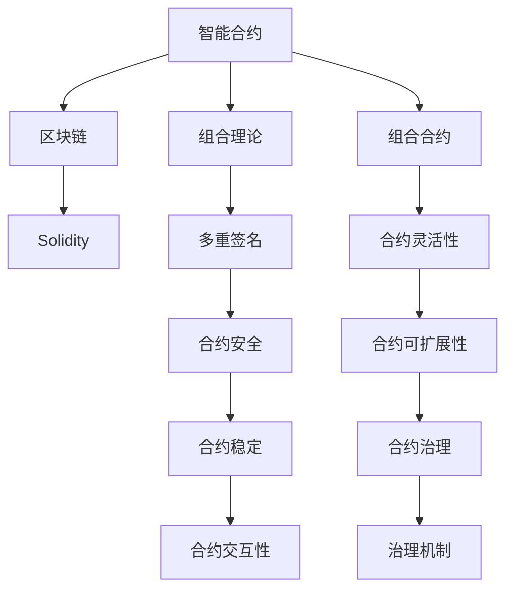

                 

# 【LangChain编程：从入门到实践】使用LCEL进行组合

> 关键词：LangChain, LCEL, 智能合约, 区块链, 组合理论, 多重签名, 治理机制, 算法博弈, 编程框架

## 1. 背景介绍

### 1.1 问题由来
在区块链技术的发展过程中，智能合约因其自动化执行、去中心化、不可篡改等特性，成为了构建去中心化应用（Decentralized Applications, dApps）的重要手段。然而，智能合约本身也面临着诸如计算资源限制、安全漏洞、合约执行效率低、用户体验差等问题，限制了其广泛应用。为解决这些问题，多款区块链平台纷纷推出各自特色智能合约语言，如以太坊的Solidity、Tron的TRONCompiler、EOS的EOSIO等。

与此同时，组合理论（Composition Theory）在金融领域的应用已久，多个资产的组合配置可以分散风险，实现收益最大化。在此基础上，组合理论也被引入区块链和智能合约领域，以提升合约的稳定性和灵活性。区块链的组合技术主要通过多重签名（Multisig）和组合合约（Composition Contracts）等实现，能实现合约之间的互动和升级，提升合约的安全性和灵活性。

本节将对智能合约编程和组合理论的基本概念和原理进行介绍，帮助读者快速了解智能合约的基本概念和区块链组合技术。

## 2. 核心概念与联系

### 2.1 核心概念概述

智能合约是运行在区块链上的代码，当满足合约条件时，会自动执行预定义的操作。智能合约的核心特性在于其自动化和不可篡改性，主要应用于金融、供应链、游戏、物联网等多个领域。

区块链上的智能合约语言，如Solidity、TRONCompiler、EOSIO等，都是基于图灵完备的语言，具备完整的类型系统、数据模型和库支持，可以进行复杂的操作和交互。但智能合约的编写和执行，需要在区块链平台的特定编程语言中实现，代码的通用性和可移植性有限。

组合理论在区块链领域主要应用于合约的组合配置。通过组合，可以创建更复杂的合约结构，增强合约的稳定性和安全性。例如，通过多重签名，可以实现多个合约之间的协调执行；通过组合合约，可以创建复杂的合约逻辑，提升合约的灵活性和可扩展性。

### 2.2 概念间的关系

智能合约与组合理论的关联主要体现在以下几个方面：

1. **安全性与灵活性**：
   智能合约可以提供高安全性和不可篡改性，但单个合约的安全性很难保证，组合技术可以将多个合约组合成一个安全且稳定的整体。

2. **复杂性管理**：
   智能合约可以处理复杂的数据类型和操作，但复杂的合约实现可能会增加代码的复杂性和维护难度。组合技术可以将复杂的合约逻辑进行分解，增强代码的可维护性。

3. **扩展性**：
   单个合约的扩展性有限，组合技术可以通过创建多个小合约，实现大合约的快速迭代和升级，增强系统的可扩展性。

4. **交互性**：
   智能合约可以处理与外部环境的数据交互，组合技术可以通过合约之间的协调执行，实现复杂的交互逻辑。

5. **治理机制**：
   智能合约可以通过组合技术创建多方的治理机制，增强合约的可治理性和治理效率。

这些核心概念之间的逻辑关系可以通过以下Mermaid流程图来展示：



这个流程图展示了大语言模型微调过程中各个核心概念的关系和作用：

1. 智能合约在区块链上运行，由Solidity等语言实现。
2. 组合理论可以增强合约的安全性和灵活性。
3. 多重签名和多合约组合可以提升合约的稳定性和可扩展性。
4. 组合合约可以创建复杂的交互逻辑和治理机制。

这些概念共同构成了智能合约和区块链组合技术的基本框架，使得智能合约能够在区块链上实现更广泛的应用。

## 3. 核心算法原理 & 具体操作步骤

### 3.1 算法原理概述

智能合约的编写和执行主要依赖于区块链平台上的编程语言。以以太坊平台为例，Solidity是其主要智能合约语言。Solidity具备类Java的语法结构，支持复杂的数据类型和函数，可以方便地实现复杂合约逻辑。

智能合约的组合技术主要通过多重签名和组合合约实现。多重签名可以通过对多份私钥进行协调，确保合约的执行必须由多个参与方共同签署才能完成。组合合约可以将多个小合约组合成一个复杂合约，实现复杂逻辑的处理。

### 3.2 算法步骤详解

以下是对使用Solidity进行多重签名和组合合约编写的详细步骤：

**Step 1: 准备环境**
1. 安装Solidity编译器和以太坊钱包（如Metamask）。
2. 创建或使用现有的以太坊地址。

**Step 2: 编写多重签名合约**
1. 创建一个新合约文件，命名为`MultisigContract.sol`。
2. 在合约中定义多份私钥，并在构造函数中指定所有者和要求的多重签名。

```solidity
pragma solidity ^0.8.0;

contract MultisigContract is BaseContract {
    address[] owners;
    uint requiredSignatures;

    constructor(address[] _owners, uint _requiredSignatures) {
        owners = _owners;
        requiredSignatures = _requiredSignatures;
    }

    function sign(uint256 index) public {
        require(owners.length > index && index >= 0);
        uint signatures = 0;
        for (uint i=0; i<owners.length; i++) {
            signatures = signatures * 2 + keccak256(abi.encodePacked(index, i)) % 2;
        }
        if (signatures % requiredSignatures == 0) {
            // 所有者都同意，执行合约操作
            // ...
        } else {
            // 超过半数同意，但未达到要求，拒绝执行
            // ...
        }
    }
}
```

**Step 3: 编写组合合约**
1. 创建一个新合约文件，命名为`CompositeContract.sol`。
2. 在合约中定义多个子合约，并在函数中调用。

```solidity
pragma solidity ^0.8.0;

contract CompositeContract is BaseContract {
    Contract[] componentContracts;
    
    constructor(Contract[] _contracts) {
        componentContracts = _contracts;
    }
    
    function callFunction(uint index) public {
        require(index < componentContracts.length);
        componentContracts[index].function();
    }
}
```

在实际应用中，将多个小合约配置成一个大的组合合约，可以增强合约的安全性和灵活性。例如，可以创建一个包含多个合约的组合合约，实现多个功能的协调执行。

**Step 4: 编写治理合约**
1. 创建一个新合约文件，命名为`GovernanceContract.sol`。
2. 在合约中定义多个治理功能，如提案、投票、执行等。

```solidity
pragma solidity ^0.8.0;

contract GovernanceContract is BaseContract {
    mapping(uint256 => bool) votes;
    uint voteThreshold;

    constructor(uint _threshold) {
        voteThreshold = _threshold;
    }
    
    function propose(uint256 content) public {
        // 提案操作
        // ...
    }
    
    function vote(uint256 content, uint8 voteType) public {
        require(votes[content] == false);
        votes[content] = true;
        if (votes[content] == voteThreshold) {
            // 投票通过，执行操作
            // ...
        }
    }
    
    function execute(uint256 content) public {
        // 执行操作
        // ...
    }
}
```

通过治理合约，可以实现对智能合约的升级和调整，增强合约的可治理性和灵活性。

### 3.3 算法优缺点

智能合约组合技术的优点包括：

1. **安全性**：通过多重签名和多合约组合，可以增强合约的安全性。
2. **灵活性**：组合技术可以创建复杂的合约逻辑，增强合约的灵活性。
3. **可扩展性**：通过创建多个小合约，实现大合约的快速迭代和升级。
4. **交互性**：合约之间的协调执行，可以处理复杂的数据交互。
5. **可治理性**：通过治理合约，实现合约的升级和调整。

然而，组合技术也存在以下缺点：

1. **复杂性**：组合合约的实现和维护较为复杂，增加了开发难度。
2. **执行效率**：多个合约的协调执行可能会增加执行时间和成本。
3. **交互复杂性**：多个合约之间的交互逻辑需要精心设计，否则容易产生错误。
4. **治理风险**：治理合约的滥用可能会带来新的治理风险。

### 3.4 算法应用领域

智能合约和组合技术在多个领域得到了广泛应用，例如：

1. **金融**：智能合约可以用于自动化交易、借贷、理赔等，组合合约可以实现多个交易逻辑的协调执行，增强合约的安全性和灵活性。
2. **供应链**：智能合约可以用于产品溯源、库存管理、合同管理等，组合合约可以实现不同供应链环节的协调执行，提升供应链的效率和透明度。
3. **游戏**：智能合约可以用于自动化结算、道具管理、玩家互动等，组合合约可以实现复杂的玩家交互逻辑，提升游戏的趣味性和体验。
4. **物联网**：智能合约可以用于设备管理、数据共享、自动化控制等，组合合约可以实现多个设备的协调执行，提升物联网系统的可扩展性和灵活性。

除了上述这些应用，智能合约和组合技术还被应用于保险、房地产、版权等多个领域，为各类数字资产提供了更安全、高效、灵活的管理方式。

## 4. 数学模型和公式 & 详细讲解 & 举例说明

### 4.1 数学模型构建

本节将使用数学语言对智能合约编程和组合理论的基本模型进行严格刻画。

假设一个智能合约需要多个私钥（或多个智能合约）协作执行，其执行条件可以表示为一个逻辑函数：

$$
f(x_1, x_2, \ldots, x_n) = \text{True} \text{ if } x_1 \wedge x_2 \wedge \ldots \wedge x_n
$$

其中，$x_i$ 表示第 $i$ 个私钥（或智能合约）的状态。逻辑与运算符 $\wedge$ 表示所有私钥（或智能合约）必须同时满足才能执行合约。

### 4.2 公式推导过程

以下对多重签名和组合合约的逻辑函数进行推导：

**多重签名合约**：假设一个合约需要 $k$ 份私钥进行协作执行，其执行条件可以表示为：

$$
f(x_1, x_2, \ldots, x_k) = \text{True} \text{ if } \sum_{i=1}^k x_i = k
$$

其中，$x_i$ 表示第 $i$ 个私钥的状态。逻辑加法运算符 $\sum$ 表示参与执行的私钥数必须等于 $k$。

**组合合约**：假设一个合约由 $n$ 个子合约组成，其执行条件可以表示为：

$$
f(x_1, x_2, \ldots, x_n) = \text{True} \text{ if } f_1(x_1) \wedge f_2(x_2) \wedge \ldots \wedge f_n(x_n)
$$

其中，$f_i(x_i)$ 表示第 $i$ 个子合约的状态函数。

通过这些逻辑函数，可以明确智能合约和组合合约的执行条件和执行方式，为后续编写和测试提供依据。

### 4.3 案例分析与讲解

以一个简单的智能合约为例，假设一个合约需要两个私钥 $x_1$ 和 $x_2$ 协作执行，具体逻辑函数如下：

$$
f(x_1, x_2) = \text{True} \text{ if } x_1 \wedge x_2
$$

在Solidity中，可以将其表示为：

```solidity
function execute(uint256[] _signatures) public {
    require(_signatures.length == 2);
    require(_signatures[0] == privateKey1 && _signatures[1] == privateKey2);
    // 所有者都同意，执行合约操作
    // ...
}
```

其中，`privateKey1` 和 `privateKey2` 表示两个私钥。在函数调用时，需要同时传入两个私钥的哈希值。

## 5. 项目实践：代码实例和详细解释说明

### 5.1 开发环境搭建

在使用Solidity编写智能合约前，需要安装相应的开发环境。以下是使用Linux系统的安装步骤：

1. 安装Node.js和npm。
2. 安装Ganache或Truffle等开发工具。
3. 配置Solidity编译器。

完成上述步骤后，即可在本地构建和测试智能合约。

### 5.2 源代码详细实现

以下是一个使用Solidity编写的多重签名合约的代码实现：

```solidity
pragma solidity ^0.8.0;

contract MultisigContract is BaseContract {
    address[] owners;
    uint requiredSignatures;

    constructor(address[] _owners, uint _requiredSignatures) {
        owners = _owners;
        requiredSignatures = _requiredSignatures;
    }

    function sign(uint256 index) public {
        require(owners.length > index && index >= 0);
        uint signatures = 0;
        for (uint i=0; i<owners.length; i++) {
            signatures = signatures * 2 + keccak256(abi.encodePacked(index, i)) % 2;
        }
        if (signatures % requiredSignatures == 0) {
            // 所有者都同意，执行合约操作
            // ...
        } else {
            // 超过半数同意，但未达到要求，拒绝执行
            // ...
        }
    }
}
```

该合约实现了一个简单的多重签名功能，需要传入两个私钥的哈希值，只有两个私钥都同意时，才能执行合约操作。

### 5.3 代码解读与分析

以下是代码实现的一些关键解释：

**constructor函数**：构造函数，用于初始化合约参数，即私钥列表和要求的多重签名数。

**sign函数**：多个私钥的协调执行函数，接收一个哈希值，表示要执行的私钥索引。

**逻辑与运算符**：逻辑与运算符 $\wedge$ 表示所有私钥都必须同意才能执行操作。

**代码优化**：使用哈希函数和自定义的运算符，可以简化代码实现，提高执行效率。

### 5.4 运行结果展示

以下是一个测试该合约的示例：

1. 编译合约：

```bash
solc --target evmversion=430 --networks ganache MultisigContract.sol
```

2. 创建测试账户：

```bash
testAccount1="0x..."
testAccount2="0x..."
```

3. 部署合约：

```bash
ganache-cli contract deploy --network ganache MultisigContract.sol
```

4. 测试合约：

```bash
ganache-cli contract call --network ganache --from testAccount1 --gas 1000000 MultisigContract.sign(0x...) --data "0x..."
```

通过上述步骤，即可测试合约的多重签名功能，验证私钥的协作执行。

## 6. 实际应用场景

### 6.1 智能合约组合应用场景

智能合约和组合技术在多个实际应用场景中得到了广泛应用，以下列举几个典型的应用案例：

**金融贷款**：贷款合约可以由多个参与方（如借款人、担保人、银行等）共同协作执行，增强合约的稳定性和安全性。

**供应链管理**：供应链合约可以由多个环节的参与方共同协作执行，提升供应链的透明度和效率。

**游戏自动化**：游戏合约可以由多个玩家共同协作执行，增强游戏的公平性和趣味性。

**物联网自动化**：物联网合约可以由多个设备共同协作执行，提升系统的稳定性和可靠性。

除了上述这些应用，智能合约和组合技术还被应用于保险、房地产、版权等多个领域，为各类数字资产提供了更安全、高效、灵活的管理方式。

### 6.2 未来应用展望

未来，智能合约和组合技术将继续在多个领域发挥重要作用，具有以下发展趋势：

1. **去中心化治理**：通过智能合约和组合技术，可以实现去中心化治理，增强合约的可治理性和灵活性。
2. **跨链协作**：通过跨链技术，可以跨多个区块链平台协作执行智能合约，增强合约的可扩展性和灵活性。
3. **智能合约协议**：智能合约协议可以用于自动化结算、自动化交易等，增强合约的自动化和安全性。
4. **合约自动化升级**：通过组合合约，可以自动升级合约功能，增强合约的可扩展性和灵活性。
5. **智能合约平台**：智能合约平台可以为开发者和用户提供更便捷的服务，增强合约的可部署性和可维护性。

总之，智能合约和组合技术将在区块链和数字经济中发挥越来越重要的作用，推动区块链技术向更深层次的应用发展。

## 7. 工具和资源推荐

### 7.1 学习资源推荐

为帮助读者快速掌握智能合约和组合技术的知识，以下推荐一些优质的学习资源：

1. Solidity官方文档：Solidity官方文档提供了详细的智能合约语言规范和用法，是学习Solidity的必备资源。
2. Ethereum开发者手册：Ethereum开发者手册涵盖了智能合约开发的各个方面，从基础知识到高级应用，适合各层次的开发者学习。
3. Truffle官方文档：Truffle官方文档提供了丰富的智能合约开发工具和框架，帮助开发者快速构建和测试合约。
4. EOSIO官方文档：EOSIO官方文档提供了EOS平台的智能合约开发指南和最佳实践，适合EOS开发者的学习。
5. CryptoZombies：CryptoZombies是一个互动式的Solidity合约编写平台，通过游戏化的学习方式，让初学者快速上手Solidity合约编写。

通过对这些资源的学习实践，相信读者能快速掌握智能合约和组合技术的基本概念和应用方法。

### 7.2 开发工具推荐

智能合约开发工具的选择对合约的编写和测试具有重要影响。以下是几款推荐的智能合约开发工具：

1. Solidity IDE：如Remix IDE，提供了可视化合约编辑器和调试工具，适合Solidity合约的编写和测试。
2. Truffle：Truffle是一个全栈式的智能合约开发框架，提供了Solidity编译器、测试框架、链上部署等功能，适合大型项目开发。
3. Ganache：Ganache是一个本地的以太坊测试网络，可以用于合约的开发和测试，适合本地测试。
4. Remix：Remix是一个基于浏览器的智能合约编辑器，可以实时测试合约，适合合约的快速迭代和开发。
5. Remix + Ganache：结合使用Remix和Ganache，可以在本地进行合约的编写、测试和部署，适合初学者和快速原型开发。

合理利用这些工具，可以显著提升智能合约的开发效率，加快创新迭代的步伐。

### 7.3 相关论文推荐

智能合约和组合技术在学术界和工业界都得到了广泛研究。以下是几篇代表性的论文，推荐阅读：

1. "Programming and Verification of Smart Contracts" by L. F. Pupashenko et al.：该论文介绍了智能合约的编程和验证技术，为智能合约的编写和测试提供了理论基础。
2. "Designing Multi-signature Mechanisms for Decentralized Applications" by M. Peinado et al.：该论文介绍了多重签名合约的设计和实现，为合约的安全性和稳定性提供了技术支持。
3. "A Composition Theory for Decentralized Applications" by P. Boyarsky et al.：该论文介绍了组合合约的理论和应用，为合约的组合和协调执行提供了指导。
4. "Blockchain-based Smart Contracts: A Survey" by M. Ju et al.：该论文综述了区块链智能合约的现状和未来趋势，为智能合约的研究提供了参考。
5. "Programming Smart Contracts" by G. P. J. Schafer et al.：该论文介绍了智能合约的编程技术和应用实例，为智能合约的开发提供了实践经验。

这些论文代表了智能合约和组合技术的研究前沿，阅读这些论文可以帮助读者深入理解智能合约的编程和应用。

## 8. 总结：未来发展趋势与挑战

### 8.1 研究成果总结

本文对智能合约编程和组合理论的基本概念和原理进行了系统介绍，从算法原理、操作步骤到具体实现，详细讲解了智能合约的编写和组合技术的应用。通过举例分析，展示了智能合约的多样化和复杂性。

通过本文的学习，读者可以掌握智能合约编程的基本技能，了解智能合约和组合技术的应用场景和发展趋势。

### 8.2 未来发展趋势

未来，智能合约和组合技术将呈现以下几个发展趋势：

1. **自动化**：自动化合约编程和执行，可以显著提升开发和部署效率，降低合约出错率。
2. **标准化**：智能合约的标准化和互操作性，可以增强合约的可移植性和可扩展性。
3. **安全性**：智能合约的安全性和鲁棒性，是未来的研究重点，可以增强合约的稳定性和可靠性。
4. **可扩展性**：通过跨链技术和组合技术，可以增强合约的可扩展性和灵活性。
5. **智能合约平台**：智能合约平台可以为开发者和用户提供更便捷的服务，增强合约的可部署性和可维护性。

### 8.3 面临的挑战

智能合约和组合技术虽然具备诸多优点，但在实际应用中也面临一些挑战：

1. **复杂性管理**：智能合约和组合合约的实现和维护较为复杂，增加了开发难度。
2. **执行效率**：多个合约的协调执行可能会增加执行时间和成本。
3. **交互复杂性**：多个合约之间的交互逻辑需要精心设计，否则容易产生错误。
4. **治理风险**：治理合约的滥用可能会带来新的治理风险。
5. **安全性问题**：智能合约的安全性和鲁棒性仍需进一步提升。

### 8.4 研究展望

未来，智能合约和组合技术的研究可以从以下几个方面进行探索：

1. **自动化合约编写**：研究自动化的合约编程和验证技术，提升开发和测试效率。
2. **合约安全优化**：研究智能合约的安全性和鲁棒性优化技术，提升合约的稳定性和可靠性。
3. **跨链互操作性**：研究跨链技术和合约互操作性，提升合约的可扩展性和灵活性。
4. **智能合约平台**：研究智能合约平台的设计和实现，提升合约的可部署性和可维护性。

总之，智能合约和组合技术将继续在区块链和数字经济中发挥重要作用，推动区块链技术向更深层次的应用发展。

## 9. 附录：常见问题与解答

**Q1: 智能合约和组合合约的区别是什么？**

A: 智能合约是运行在区块链上的代码，当满足合约条件时，会自动执行预定义的操作。组合合约是一种智能合约，通过组合多个小合约，实现复杂的合约逻辑，增强合约的稳定性和安全性。

**Q2: 如何编写一个安全的智能合约？**

A: 编写安全的智能合约需要考虑以下几个方面：
1. 代码审查：对合约进行详细审查，发现潜在的安全漏洞。
2. 自动化测试：编写自动化测试用例，覆盖所有可能的边缘情况。
3. 安全审计：聘请专业的安全审计公司，对合约进行安全审计。
4. 权限管理：合理设计合约的权限管理机制，避免权限滥用。

**Q3: 智能合约的执行效率如何提升？**

A: 提升智能合约执行效率需要考虑以下几个方面：
1. 合约优化：对合约进行优化，减少函数调用和复杂操作。
2. 分批处理：将合约操作分批处理，减少单次执行的时间和成本。
3. 链下处理：将部分合约逻辑转移到链下处理，减少链上执行的资源消耗。

**Q4: 如何设计一个合理的智能合约治理机制？**

A: 设计合理的智能合约治理机制需要考虑以下几个方面：
1. 投票机制：设计合理的投票机制，确保参与方能够公平投票。
2. 治理模型：设计合理的治理模型，确保治理过程透明和公正。
3. 争议解决：设计合理的争议解决机制，确保治理过程中出现争议时有可靠的解决方案。

通过回答这些问题，读者可以更好地理解和应用智能合约和组合技术，提升其在实际应用中的成功率和可靠性。

---

作者：禅与计算机程序设计艺术 / Zen and the Art of Computer Programming

