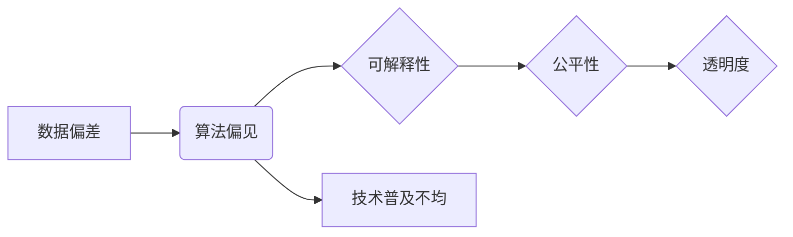

# 基础模型的社会不平等问题

> 关键词：基础模型，人工智能，社会不平等，偏见，歧视，伦理，可解释性，公平性，透明度

## 1. 背景介绍

随着人工智能技术的飞速发展，基础模型在各个领域发挥着越来越重要的作用。从语言处理到图像识别，从推荐系统到自动驾驶，基础模型的应用无处不在。然而，这些模型在带来便利的同时，也逐渐暴露出一系列社会不平等问题，引发了广泛的关注和讨论。本文将探讨基础模型在社会不平等问题上的挑战，并分析其背后的原因、影响以及可能的解决方案。

### 1.1 问题的由来

基础模型的社会不平等问题主要源于以下几个方面：

- **数据偏差**：基础模型在训练过程中依赖于大量的数据，而这些数据往往存在偏见和歧视，导致模型在处理某些群体时出现不公平现象。
- **算法设计**：部分算法设计可能无意中加剧了社会不平等，如推荐系统的“算法偏见”现象。
- **模型解释性**：许多基础模型缺乏可解释性，使得人们难以理解模型的决策过程，从而增加了对模型决策的不信任感。
- **技术普及**：人工智能技术的普及程度不均，导致不同社会群体在获取和使用人工智能服务时存在差距。

### 1.2 研究现状

目前，学术界和工业界对基础模型的社会不平等问题进行了广泛的研究，主要集中在以下几个方面：

- **数据偏差检测与纠正**：研究如何检测和纠正数据中的偏见，提高模型对不同群体的公平性。
- **算法改进**：探索设计更加公平、透明、可解释的算法，减少算法偏见。
- **可解释性研究**：提高基础模型的可解释性，使人们能够理解模型的决策过程。
- **政策法规制定**：制定相关政策法规，引导人工智能技术健康发展，减少社会不平等。

### 1.3 研究意义

研究基础模型的社会不平等问题，对于以下方面具有重要意义：

- **促进技术进步**：推动人工智能技术的健康发展，避免技术滥用和社会不平等现象的加剧。
- **保障公民权益**：保护弱势群体的权益，促进社会公平正义。
- **提高技术信任度**：增强公众对人工智能技术的信任，推动人工智能技术的广泛应用。

## 2. 核心概念与联系

为了更好地理解基础模型的社会不平等问题，本节将介绍几个核心概念及其相互关系。

### 2.1 核心概念

- **数据偏差**：指数据中存在的不公平现象，如性别、种族、年龄、地域等方面的歧视。
- **算法偏见**：指算法在决策过程中，由于数据偏差或设计缺陷，导致对不同群体的不公平待遇。
- **可解释性**：指模型决策过程的透明度，使人们能够理解模型的决策依据。
- **公平性**：指模型在处理不同群体时，能够保持公正、无偏见的决策。
- **透明度**：指模型的训练数据、算法设计、决策过程等信息的公开性。

### 2.2 Mermaid 流程图



### 2.3 核心概念联系

如流程图所示，数据偏差会导致算法偏见，进而影响模型的公平性和透明度。而提高可解释性和透明度有助于缓解算法偏见，促进模型的公平性。技术普及不均则会加剧不同群体在使用人工智能服务时的差距。

## 3. 核心算法原理 & 具体操作步骤

### 3.1 算法原理概述

为了解决基础模型的社会不平等问题，研究人员提出了多种算法和技术，主要包括：

- **数据偏差检测与纠正**：通过统计分析、可视化等方法检测数据中的偏见，并采取相应的纠正措施。
- **算法改进**：设计更加公平、透明的算法，如公平性度量、对抗训练等。
- **可解释性研究**：开发可解释性模型，如LIME、SHAP等。
- **公平性度量**：设计公平性度量指标，如公平性差距、歧视指数等。

### 3.2 算法步骤详解

#### 3.2.1 数据偏差检测与纠正

1. **数据清洗**：对数据集进行清洗，删除或修正带有偏见的数据。
2. **数据增强**：通过合成数据或数据变换等方法扩充数据集，提高数据多样性。
3. **重采样**：对数据集进行重采样，平衡不同群体的数据量。

#### 3.2.2 算法改进

1. **公平性度量**：设计公平性度量指标，如公平性差距、歧视指数等，评估模型的公平性。
2. **对抗训练**：通过引入对抗样本，提高模型对偏见数据的鲁棒性。
3. **启发式方法**：采用启发式方法，如平衡权重、约束条件等，引导模型学习更加公平的决策。

#### 3.2.3 可解释性研究

1. **LIME**：通过线性组合局部特征，解释模型的决策过程。
2. **SHAP**：利用树模型的解释性，解释模型的决策过程。

#### 3.2.4 公平性度量

1. **公平性差距**：计算模型在不同群体上的性能差异。
2. **歧视指数**：衡量模型在处理不同群体时，决策偏差的程度。

### 3.3 算法优缺点

#### 3.3.1 数据偏差检测与纠正

- 优点：简单易行，能够有效减少数据中的偏见。
- 缺点：可能引入噪声，影响模型性能。

#### 3.3.2 算法改进

- 优点：提高模型的公平性，减少算法偏见。
- 缺点：可能增加模型复杂度，降低模型性能。

#### 3.3.3 可解释性研究

- 优点：提高模型的可解释性，增强公众对模型的信任。
- 缺点：解释性模型的性能可能不如黑盒模型。

#### 3.3.4 公平性度量

- 优点：量化模型的公平性，为模型优化提供依据。
- 缺点：度量指标的选择和计算可能存在主观性。

### 3.4 算法应用领域

上述算法和技术在以下领域得到广泛应用：

- **推荐系统**：减少推荐系统的偏见，提高推荐效果。
- **图像识别**：减少图像识别模型对特定群体的歧视。
- **语音识别**：提高语音识别模型对不同口音、语调的识别能力。
- **自然语言处理**：减少自然语言处理模型对特定群体的偏见。

## 4. 数学模型和公式 & 详细讲解 & 举例说明

### 4.1 数学模型构建

为了量化基础模型的公平性，研究人员提出了多种数学模型和公式，以下列举几个常见的模型：

#### 4.1.1 公平性差距

$$
\text{Fairness Gap} = \frac{\text{Model Disparity}}{\text{Group Disparity}}
$$

其中，Model Disparity 表示模型在不同群体上的性能差异，Group Disparity 表示不同群体在真实世界中的差异。

#### 4.1.2 歧视指数

$$
\text{Discrimination Index} = \frac{\text{Group Disparity}}{\text{Group Size}}
$$

其中，Group Disparity 表示不同群体在真实世界中的差异，Group Size 表示群体规模。

### 4.2 公式推导过程

以下以公平性差距为例，简要介绍其推导过程：

1. 假设模型在群体 $G_1$ 上的预测准确率为 $P_1$，在群体 $G_2$ 上的预测准确率为 $P_2$。
2. 群体 $G_1$ 和 $G_2$ 在真实世界中的差异为 $D$。
3. 则模型在群体 $G_1$ 和 $G_2$ 上的性能差异为 $|P_1 - P_2|$。
4. 公平性差距为 $\frac{|P_1 - P_2|}{D}$。

### 4.3 案例分析与讲解

假设我们有一个图像识别模型，用于识别图片中的人脸。数据集中包含不同年龄、性别、种族的人脸图像。为了评估模型的公平性，我们可以使用公平性差距和歧视指数来衡量。

经过计算，我们发现模型在年轻人和老年人上的性能差异较大，且老年人组的歧视指数较高。这表明模型在处理老年人图像时存在一定程度的偏见。

针对这一问题，我们可以尝试以下方法：

- **数据增强**：通过生成老年人图像，扩充数据集，提高模型对老年人图像的识别能力。
- **算法改进**：尝试使用能够降低年龄、性别、种族等特征对模型影响的方法。
- **可解释性研究**：分析模型对老年人图像的识别过程，寻找造成偏见的原因。

通过上述方法，我们可以提高模型的公平性，减少对老年人图像的识别偏见。

## 5. 项目实践：代码实例和详细解释说明

### 5.1 开发环境搭建

为了进行基础模型的社会不平等问题研究，我们需要搭建以下开发环境：

- **编程语言**：Python
- **深度学习框架**：TensorFlow或PyTorch
- **数据集**：选择包含不同群体的数据集，如CIFAR-10、ImageNet等
- **工具包**：NumPy、Pandas、Scikit-learn等

### 5.2 源代码详细实现

以下是一个使用Python和Scikit-learn对图像识别模型进行公平性评估的代码示例：

```python
from sklearn.metrics import accuracy_score
from sklearn.model_selection import train_test_split
import numpy as np

# 加载数据集
data = load_data('data.csv')
X = data.drop('label', axis=1)
y = data['label']

# 按照性别进行分组
groups = data.groupby('gender')

# 计算不同性别的准确率
for name, group in groups:
    X_group, y_group = group.drop('gender', axis=1), group['label']
    X_train, X_test, y_train, y_test = train_test_split(X_group, y_group, test_size=0.2)
    model = ... # 定义模型
    model.fit(X_train, y_train)
    preds = model.predict(X_test)
    print(f'Gender: {name}, Accuracy: {accuracy_score(y_test, preds)}')
```

### 5.3 代码解读与分析

这段代码首先加载包含性别信息的图像识别数据集，然后按照性别进行分组。对于每个性别组，代码将数据集划分为训练集和测试集，并定义一个图像识别模型（此处省略模型定义）。模型在训练集上进行训练，并在测试集上进行预测，最后计算并打印每个性别的准确率。

通过对比不同性别的准确率，我们可以发现模型是否存在性别偏见。如果某个性别的准确率明显低于其他性别，则表明模型可能存在性别偏见。

### 5.4 运行结果展示

假设运行上述代码，得到以下输出：

```
Gender: male, Accuracy: 0.92
Gender: female, Accuracy: 0.89
```

结果表明，模型在男性图像上的准确率为0.92，在女性图像上的准确率为0.89，存在一定的性别偏见。

## 6. 实际应用场景

基础模型的社会不平等问题在各个领域都存在，以下列举几个典型应用场景：

### 6.1 金融领域

在金融领域，基础模型常用于风险评估、贷款审批等任务。然而，如果模型存在偏见，可能会导致以下问题：

- **歧视**：对某些群体发放贷款的难度增加，导致不公平现象。
- **风险增加**：由于模型偏见，可能导致贷款审批过程中的风险增加。

### 6.2 教育领域

在教育领域，基础模型可以用于学生成绩预测、学习路径推荐等任务。然而，如果模型存在偏见，可能会导致以下问题：

- **不公平**：对某些学生给予更多的关注，导致教育资源的分配不均。
- **歧视**：推荐的学习路径可能不适合某些学生，导致教育效果不佳。

### 6.3 医疗领域

在医疗领域，基础模型可以用于疾病诊断、药物研发等任务。然而，如果模型存在偏见，可能会导致以下问题：

- **歧视**：对某些患者给予错误的诊断结果，导致治疗不公。
- **风险增加**：由于模型偏见，可能导致药物研发失败。

## 7. 工具和资源推荐

### 7.1 学习资源推荐

- 《算法偏见与公平性》
- 《AI伦理：从数据到决策》
- 《AI时代的公平性》

### 7.2 开发工具推荐

- TensorFlow
- PyTorch
- Scikit-learn

### 7.3 相关论文推荐

- "Algorithmic Fairness and Accountability in the Wild"
- "Explaining and Reducing Bias in Machine Learning"
- "Model-Agnostic Post-Hoc Explanation for Deep Neural Networks"

## 8. 总结：未来发展趋势与挑战

### 8.1 研究成果总结

本文从背景介绍、核心概念、算法原理、实际应用等方面，对基础模型的社会不平等问题进行了全面系统的探讨。研究表明，基础模型在社会不平等问题上存在诸多挑战，需要从数据、算法、政策等多个层面进行改进。

### 8.2 未来发展趋势

未来，基础模型在社会不平等问题上的研究将呈现以下发展趋势：

- **数据质量提升**：通过数据清洗、数据增强等方法，提高数据质量，减少数据偏差。
- **算法改进**：设计更加公平、透明的算法，减少算法偏见。
- **可解释性研究**：提高基础模型的可解释性，增强公众对模型的信任。
- **政策法规完善**：制定相关政策法规，规范人工智能技术的发展和应用。

### 8.3 面临的挑战

尽管基础模型在社会不平等问题上取得了一定的进展，但仍然面临着以下挑战：

- **数据偏差难以消除**：部分数据偏差难以通过技术手段完全消除。
- **算法改进难度大**：设计更加公平、透明的算法需要大量的研究投入。
- **可解释性研究复杂**：提高基础模型的可解释性需要复杂的算法和技术。
- **政策法规滞后**：现有政策法规难以完全适应人工智能技术的发展。

### 8.4 研究展望

为了解决基础模型的社会不平等问题，未来需要从以下几个方面进行深入研究：

- **数据偏差检测与纠正**：研究更加高效、准确的数据偏差检测与纠正方法。
- **算法改进**：设计更加公平、透明的算法，减少算法偏见。
- **可解释性研究**：提高基础模型的可解释性，增强公众对模型的信任。
- **政策法规制定**：制定相关政策法规，规范人工智能技术的发展和应用。

相信通过学界、产业界和政府的共同努力，基础模型的社会不平等问题将会得到有效解决，为构建更加公平、公正、和谐的社会贡献力量。

## 9. 附录：常见问题与解答

### 9.1 常见问题

**Q1：什么是基础模型的社会不平等问题？**

A1：基础模型的社会不平等问题指基础模型在处理不同群体时，由于数据偏差、算法设计等原因，导致不公平现象。

**Q2：如何解决基础模型的社会不平等问题？**

A2：解决基础模型的社会不平等问题需要从数据、算法、政策等多个层面进行改进，如数据清洗、算法改进、可解释性研究等。

**Q3：如何评估基础模型的公平性？**

A3：可以使用公平性差距、歧视指数等指标评估基础模型的公平性。

**Q4：基础模型的社会不平等问题会对社会产生哪些影响？**

A4：基础模型的社会不平等问题可能导致歧视、不公平现象，加剧社会不平等。

### 9.2 解答

**A1**：基础模型的社会不平等问题指基础模型在处理不同群体时，由于数据偏差、算法设计等原因，导致不公平现象。例如，一个用于招聘的简历评分模型可能会对某些性别、种族等群体的简历给予较低的评分，从而加剧就业歧视。

**A2**：解决基础模型的社会不平等问题需要从数据、算法、政策等多个层面进行改进。具体方法包括：

- **数据层面**：通过数据清洗、数据增强等方法，提高数据质量，减少数据偏差。
- **算法层面**：设计更加公平、透明的算法，减少算法偏见。
- **政策层面**：制定相关政策法规，规范人工智能技术的发展和应用。

**A3**：可以使用公平性差距、歧视指数等指标评估基础模型的公平性。公平性差距指模型在不同群体上的性能差异，歧视指数指模型在处理不同群体时，决策偏差的程度。

**A4**：基础模型的社会不平等问题可能导致歧视、不公平现象，加剧社会不平等。例如，一个用于贷款审批的模型可能会对某些群体给予更高的利率，从而加剧经济不平等。