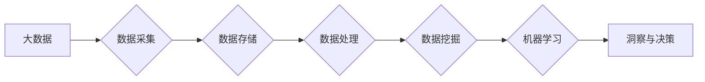

# 大数据分析 原理与代码实例讲解

> 关键词：大数据分析，Hadoop，Spark，MapReduce，机器学习，数据挖掘，Python，Jupyter Notebook

## 1. 背景介绍

随着互联网、物联网、社交网络等技术的飞速发展，数据量呈指数级增长，大数据时代已经到来。如何从海量数据中提取有价值的信息，成为各行各业关注的焦点。大数据分析技术应运而生，它利用先进的数据处理和分析方法，帮助企业和组织从数据中挖掘洞察，做出更明智的决策。

## 2. 核心概念与联系

### 2.1 核心概念

**大数据**：指的是规模庞大、类型多样、增长速度快的数据集，无法用传统数据处理应用软件工具进行处理。

**大数据分析**：指的是使用各种技术和方法，对大量数据进行分析，从中提取有价值的信息和知识。

**Hadoop**：一个开源的分布式计算平台，用于存储和处理大规模数据集。

**Spark**：一个开源的分布式内存计算系统，用于大规模数据处理和分析。

**MapReduce**：Hadoop的核心计算框架，用于并行处理大规模数据集。

**机器学习**：一种使计算机系统能够从数据中学习并做出决策的技术。

**数据挖掘**：从大量数据中挖掘出有价值的信息和知识的过程。

### 2.2 核心概念原理和架构的 Mermaid 流程图



## 3. 核心算法原理 & 具体操作步骤

### 3.1 算法原理概述

大数据分析的核心算法主要包括：

- **数据采集**：通过API、爬虫、传感器等方式收集数据。

- **数据存储**：使用分布式文件系统如Hadoop HDFS或分布式数据库如Apache Cassandra存储数据。

- **数据处理**：使用MapReduce、Spark等分布式计算框架对数据进行清洗、转换、聚合等操作。

- **数据挖掘**：使用聚类、分类、关联规则挖掘等算法从数据中提取有价值的信息。

- **机器学习**：使用监督学习、无监督学习、强化学习等算法从数据中学习并做出预测或决策。

### 3.2 算法步骤详解

以下是大数据分析的基本步骤：

1. **数据采集**：根据业务需求确定数据来源，并使用相应的工具进行采集。

2. **数据存储**：将采集到的数据存储到分布式文件系统或分布式数据库中。

3. **数据处理**：使用MapReduce、Spark等分布式计算框架对数据进行清洗、转换、聚合等操作。

4. **数据挖掘**：根据业务需求选择合适的算法进行数据挖掘，如聚类、分类、关联规则挖掘等。

5. **机器学习**：使用机器学习算法对挖掘到的数据进行训练，并用于预测或决策。

### 3.3 算法优缺点

**MapReduce**：

- **优点**：易于理解和实现，具有良好的可扩展性，适合大规模数据集处理。

- **缺点**：计算过程较为复杂，不适合实时性要求高的应用，且难以进行迭代计算。

**Spark**：

- **优点**：支持内存计算，计算速度快，易于编程，可进行迭代计算，适合实时性要求高的应用。

- **缺点**：相比于MapReduce，Spark的部署和运维相对复杂。

### 3.4 算法应用领域

大数据分析技术在各个领域都有广泛的应用，如：

- **金融**：风险评估、客户行为分析、欺诈检测等。

- **医疗**：疾病预测、患者护理、药物研发等。

- **零售**：客户细分、库存管理、精准营销等。

- **交通**：交通流量预测、智能导航、交通事故预防等。

## 4. 数学模型和公式 & 详细讲解 & 举例说明

### 4.1 数学模型构建

大数据分析中的数学模型主要包括：

- **聚类算法**：K-means、层次聚类等。

- **分类算法**：决策树、支持向量机等。

- **关联规则挖掘**：Apriori、FP-growth等。

### 4.2 公式推导过程

以下是K-means算法的公式推导过程：

假设有m个数据点 $x_1, x_2, ..., x_m$，将它们分为k个簇 $C_1, C_2, ..., C_k$。每个簇的质心为 $\mu_1, \mu_2, ..., \mu_k$。

对于每个数据点 $x_i$，计算其与各个簇的质心距离，选择距离最小的簇作为其所属簇：

$$
c_i = \arg\min_{j=1,2,...,k} \parallel x_i - \mu_j \parallel
$$

计算每个簇的质心：

$$
\mu_j = \frac{1}{|C_j|} \sum_{x_i \in C_j} x_i
$$

重复上述步骤，直到质心不再变化。

### 4.3 案例分析与讲解

假设我们有一个包含100个数据点的二维数据集，要将其分为3个簇。以下是K-means算法的Python实现：

```python
import numpy as np
import matplotlib.pyplot as plt

def kmeans(X, k, max_iter=100):
    centroids = X[np.random.choice(range(len(X)), k, replace=False)]
    for _ in range(max_iter):
        clusters = []
        for x in X:
            distances = [np.linalg.norm(x - centroid) for centroid in centroids]
            clusters.append(np.argmin(distances))
        new_centroids = np.array([X[clusters.count(i)] for i in range(k)])
        if np.allclose(new_centroids, centroids):
            break
        centroids = new_centroids
    return clusters, centroids

X = np.random.rand(100, 2)
k = 3
clusters, centroids = kmeans(X, k)
for i, centroid in enumerate(centroids):
    plt.scatter(X[clusters == i], X[:, 1][clusters == i], label=f'Cluster {i}')
plt.scatter(centroids[:, 0], centroids[:, 1], color='red', label='Centroids')
plt.legend()
plt.show()
```

## 5. 项目实践：代码实例和详细解释说明

### 5.1 开发环境搭建

以下是在Python环境下进行大数据分析的开发环境搭建步骤：

1. 安装Python 3.x版本。

2. 安装Anaconda，用于创建独立的Python环境。

3. 创建并激活虚拟环境：

```bash
conda create -n bigdata-env python=3.8
conda activate bigdata-env
```

4. 安装必要的库：

```bash
conda install pandas numpy scipy matplotlib scikit-learn
```

### 5.2 源代码详细实现

以下是一个使用Python进行数据分析和可视化的小例子：

```python
import pandas as pd
import matplotlib.pyplot as plt

# 加载数据
data = pd.read_csv('data.csv')

# 数据预处理
data = data.dropna()
data['age'] = pd.to_numeric(data['age'], errors='coerce')

# 数据分析
age_group = data['age'].value_counts(bins=[0, 20, 40, 60, 80, 100], right=False)
print(age_group)

# 数据可视化
age_group.plot(kind='bar')
plt.xlabel('Age Group')
plt.ylabel('Number of People')
plt.title('Age Distribution')
plt.show()
```

### 5.3 代码解读与分析

以上代码首先加载了名为`data.csv`的CSV文件，然后进行数据预处理，将缺失值和非法值替换为NaN。接着，使用`value_counts`函数统计不同年龄段的样本数量，并打印出来。最后，使用matplotlib库绘制柱状图，直观地展示年龄分布情况。

### 5.4 运行结果展示

运行以上代码后，控制台将打印出不同年龄段的样本数量，并显示一个年龄分布的柱状图。

## 6. 实际应用场景

### 6.1 金融风控

在大数据时代，金融风控显得尤为重要。通过收集和分析大量交易数据、用户行为数据等，金融机构可以识别出潜在的风险，并采取措施进行防范。例如，使用机器学习算法对用户进行信用评分，预测用户违约概率，从而降低信贷风险。

### 6.2 健康医疗

大数据分析技术在健康医疗领域的应用日益广泛。通过收集和分析患者病历、基因信息、医疗设备数据等，医疗机构可以更好地了解疾病发生规律，提高诊断和治疗效果。例如，利用机器学习算法进行疾病预测、药物研发等。

### 6.3 智能交通

在大数据时代，智能交通系统可以有效缓解交通拥堵、提高交通安全。通过收集和分析交通流量、路况数据等，可以实现实时交通监控、智能调度、自动驾驶等功能。

### 6.4 未来应用展望

随着大数据技术的不断发展和应用领域的不断拓展，大数据分析技术将在以下方面发挥更大的作用：

- **个性化推荐**：基于用户行为数据，为用户推荐个性化的商品、服务、内容等。

- **智能决策**：通过大数据分析，为企业提供决策支持，提高决策效率和准确性。

- **智慧城市**：利用大数据技术构建智慧城市，提升城市管理效率，改善市民生活质量。

## 7. 工具和资源推荐

### 7.1 学习资源推荐

- 《Python数据分析基础教程》

- 《Hadoop技术详解》

- 《Spark编程指南》

- 《机器学习实战》

### 7.2 开发工具推荐

- Jupyter Notebook

- Pandas

- NumPy

- Matplotlib

- Scikit-learn

### 7.3 相关论文推荐

- 《Large-Scale Online Learning for Web Search》，来自Google的论文，介绍了大规模在线学习在搜索引擎中的应用。

- 《The MapReduce Programming Model for Large Scale Data Processing》，MapReduce算法的论文。

- 《Spark: Distributed Data Processing with Scala》，Spark的论文。

- 《TensorFlow: Large-Scale Machine Learning on Heterogeneous Systems》，TensorFlow的论文。

## 8. 总结：未来发展趋势与挑战

### 8.1 研究成果总结

大数据分析技术在各个领域都取得了显著的应用成果，推动了各行各业的数字化转型。随着技术的不断发展和应用领域的不断拓展，大数据分析技术将在未来发挥更大的作用。

### 8.2 未来发展趋势

- **云计算与大数据的结合**：云计算为大数据分析提供了强大的计算和存储资源，未来两者将更加紧密地结合。

- **数据隐私保护**：随着数据隐私意识的提高，数据隐私保护将成为大数据分析的重要课题。

- **人工智能与大数据的结合**：人工智能技术将为大数据分析带来新的突破，如深度学习在图像识别、语音识别等领域的应用。

### 8.3 面临的挑战

- **数据质量问题**：数据质量问题将影响分析结果的准确性。

- **计算资源瓶颈**：大规模数据处理对计算资源提出了很高的要求。

- **数据安全和隐私问题**：数据安全和隐私问题是大数据分析面临的重大挑战。

### 8.4 研究展望

未来，大数据分析技术需要从以下几个方面进行研究和突破：

- **数据质量提升**：开发数据清洗、转换、归一化等数据预处理工具，提高数据质量。

- **计算效率优化**：研究更加高效的计算算法和优化方法，提高数据处理效率。

- **数据隐私保护**：研究更加安全的数据分析和数据共享方法，保护数据隐私。

- **可解释性增强**：提高机器学习模型的可解释性，使模型更容易被理解和接受。

作者：禅与计算机程序设计艺术 / Zen and the Art of Computer Programming