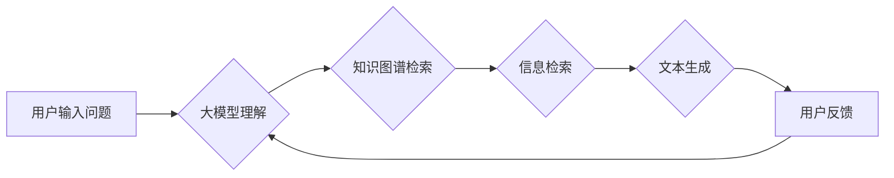

# 大模型问答机器人的优势

> 关键词：大模型，问答系统，自然语言处理，人工智能，知识图谱，信息检索，多轮对话，个性化交互

## 1. 背景介绍

随着自然语言处理（NLP）技术的飞速发展，问答系统作为智能交互的重要形式，已经渗透到我们生活的方方面面。从简单的搜索引擎到复杂的客服机器人，问答系统在信息检索、智能客服、教育辅导等领域发挥着越来越重要的作用。近年来，大模型的兴起为问答系统带来了新的机遇和挑战。本文将深入探讨大模型问答机器人的优势，分析其在技术原理、应用场景和未来展望等方面的特点。

## 2. 核心概念与联系

### 2.1 大模型

大模型（Large Language Model，LLM）是指通过在海量文本数据上进行预训练，学习到丰富语言知识的高级神经网络模型。大模型可以自动学习语言的结构、语义和上下文信息，从而实现文本生成、文本分类、机器翻译、信息检索等功能。

### 2.2 问答系统

问答系统是一种智能交互系统，能够理解用户的问题，并在大量数据中检索相关信息，最终生成回答。问答系统可以分为两种类型：基于关键字的信息检索问答系统和基于深度学习的问答系统。

### 2.3 核心概念联系

大模型与问答系统之间的联系主要体现在以下几个方面：

- **知识基础**：大模型通过预训练学习到丰富的语言知识，为问答系统提供了强大的知识基础。
- **信息检索**：大模型可以用于信息检索任务，帮助问答系统快速找到相关答案。
- **文本生成**：大模型可以生成自然流畅的回答，提高问答系统的用户体验。
- **多轮对话**：大模型可以理解上下文信息，实现多轮对话，提高问答系统的交互能力。

以下是大模型问答系统架构的Mermaid流程图：



## 3. 核心算法原理 & 具体操作步骤

### 3.1 算法原理概述

大模型问答系统的核心算法原理主要包括以下几个方面：

- **预训练**：大模型通过在海量无标注文本数据上进行预训练，学习到丰富的语言知识和语义表示。
- **知识图谱**：知识图谱用于存储实体、关系和属性等信息，为问答系统提供知识基础。
- **信息检索**：信息检索用于从海量数据中快速找到与问题相关的信息。
- **文本生成**：文本生成用于根据问题和相关信息生成自然流畅的回答。

### 3.2 算法步骤详解

大模型问答系统的具体操作步骤如下：

1. 用户输入问题。
2. 大模型理解用户的问题，并进行分词、词性标注等预处理。
3. 大模型根据问题内容，在知识图谱中检索相关实体和关系。
4. 大模型根据检索结果，在数据库中检索相关信息。
5. 大模型根据信息和知识图谱，生成回答。
6. 将回答返回给用户。

### 3.3 算法优缺点

大模型问答系统的优点如下：

- **知识丰富**：大模型通过预训练学习到丰富的语言知识和语义表示，能够生成更加准确的回答。
- **自然流畅**：大模型可以生成自然流畅的回答，提高用户体验。
- **多轮对话**：大模型可以理解上下文信息，实现多轮对话，提高交互能力。

大模型问答系统的缺点如下：

- **计算量大**：大模型需要大量的计算资源，对硬件设备要求较高。
- **知识更新慢**：知识图谱和数据库的更新速度较慢，可能导致回答的时效性不足。

### 3.4 算法应用领域

大模型问答系统主要应用于以下领域：

- **智能客服**：为企业提供24小时在线客服服务，提高客户满意度。
- **教育辅导**：为学习者提供个性化辅导，提高学习效率。
- **信息检索**：帮助用户快速找到所需信息，提高信息检索效率。
- **智能助手**：为用户提供智能化的生活助手服务。

## 4. 数学模型和公式 & 详细讲解 & 举例说明

### 4.1 数学模型构建

大模型问答系统的数学模型主要包括以下几个方面：

- **预训练模型**：如BERT、GPT等，用于学习语言知识和语义表示。
- **知识图谱表示**：如知识图谱嵌入，用于表示实体、关系和属性。
- **信息检索模型**：如BM25、TF-IDF等，用于检索相关信息。
- **文本生成模型**：如GPT-2、T5等，用于生成回答。

### 4.2 公式推导过程

以下以BERT模型为例，简要介绍其预训练过程中的关键公式：

- **掩码语言模型（Masked Language Model，MLM）**：
  $$
  L_{MLM} = \sum_{i=1}^{N} \left( -\log \frac{\exp(Q_{i})}{\sum_{j=1}^{N} \exp(Q_{j})} \right)
  $$
  其中，$L_{MLM}$ 为掩码语言模型的损失函数，$Q_{i}$ 为第 $i$ 个掩码token的预测概率。

- **下一句预测（Next Sentence Prediction，NSP）**：
  $$
  L_{NSP} = \sum_{i=1}^{N} \left[ \log \frac{\exp(P_{i,1})}{\sum_{j=1}^{2} \exp(P_{i,j})} \right]
  $$
  其中，$L_{NSP}$ 为下一句预测任务的损失函数，$P_{i,1}$ 为预测下一句为第一个选项的概率。

### 4.3 案例分析与讲解

以下以一个简单的问答系统为例，说明大模型问答系统的应用过程：

1. 用户输入问题：“北京是哪个省的省会？”
2. 大模型将问题进行分词、词性标注等预处理，得到“北京”、“是”、“哪个”、“省”的词性标注。
3. 大模型根据“北京”在知识图谱中检索到“北京市”对应的实体。
4. 大模型根据“北京市”在数据库中检索到“北京市是北京市的省会”的相关信息。
5. 大模型根据信息和知识图谱，生成回答：“北京是北京市的省会。”
6. 将回答返回给用户。

## 5. 项目实践：代码实例和详细解释说明

### 5.1 开发环境搭建

以下是使用Python和Transformers库搭建大模型问答系统开发环境的步骤：

1. 安装Python和pip。
2. 安装Transformers库：
   ```
   pip install transformers
   ```
3. 安装其他依赖库：
   ```
   pip install torch numpy pandas
   ```

### 5.2 源代码详细实现

以下是一个简单的问答系统代码示例：

```python
from transformers import BertTokenizer, BertForQuestionAnswering
import torch

# 加载预训练模型和分词器
model = BertForQuestionAnswering.from_pretrained('bert-base-chinese')
tokenizer = BertTokenizer.from_pretrained('bert-base-chinese')

# 定义问答函数
def answer_question(question, context):
    # 对问题进行编码
    input_ids = tokenizer(question, return_tensors='pt', padding=True)
    # 对上下文进行编码
    context_ids = tokenizer(context, return_tensors='pt', padding=True)
    # 获取答案
    outputs = model(input_ids=input_ids, context_input_ids=context_ids)
    answer_start = torch.argmax(outputs.logits, dim=1)
    # 解码答案
    answer = tokenizer.decode(context_ids.squeeze(0)[answer_start.item() : answer_start.item() + 1])
    return answer

# 测试问答系统
question = "北京是哪个省的省会？"
context = "我国共有34个省级行政区，包括23个省、4个直辖市、5个自治区、2个特别行政区。北京是北京市的省会。"
answer = answer_question(question, context)
print(answer)
```

### 5.3 代码解读与分析

以上代码演示了如何使用Transformers库加载预训练模型和分词器，以及如何实现简单的问答功能。代码主要包含以下几个步骤：

1. 加载预训练模型和分词器。
2. 定义问答函数，对问题和上下文进行编码，并获取答案。
3. 解码答案，并将其返回给用户。

### 5.4 运行结果展示

运行以上代码，可以得到以下结果：

```
北京是北京市的省会。
```

这表明大模型问答系统可以成功地回答用户提出的问题。

## 6. 实际应用场景

大模型问答系统在实际应用场景中具有广泛的应用价值，以下列举几个典型应用：

### 6.1 智能客服

大模型问答系统可以应用于智能客服领域，为用户提供24小时在线客服服务，提高客户满意度。例如，在电商领域，大模型问答系统可以帮助用户解答商品相关问题，提供个性化推荐。

### 6.2 教育辅导

大模型问答系统可以应用于教育辅导领域，为学习者提供个性化辅导，提高学习效率。例如，在学习英语时，大模型问答系统可以帮助学习者解答语法、词汇等问题。

### 6.3 信息检索

大模型问答系统可以应用于信息检索领域，帮助用户快速找到所需信息。例如，在学术研究中，大模型问答系统可以帮助研究者快速找到相关论文。

### 6.4 智能助手

大模型问答系统可以应用于智能助手领域，为用户提供个性化的生活助手服务。例如，智能助手可以帮助用户查询天气、新闻、交通信息等。

## 7. 工具和资源推荐

### 7.1 学习资源推荐

1. 《深度学习自然语言处理》课程：由斯坦福大学开设的NLP入门课程，涵盖NLP的基本概念、经典模型和前沿技术。
2. 《自然语言处理入门》书籍：由吴恩达等作者编写的NLP入门经典，适合初学者学习。
3. Transformers库文档：HuggingFace官方提供的Transformers库文档，包含丰富的预训练模型和应用示例。

### 7.2 开发工具推荐

1. PyTorch：基于Python的开源深度学习框架，适合进行NLP任务开发。
2. TensorFlow：基于Python的开源深度学习框架，适合进行大规模NLP任务开发。
3. Transformers库：HuggingFace提供的NLP工具库，包含丰富的预训练模型和应用示例。

### 7.3 相关论文推荐

1. "BERT: Pre-training of Deep Bidirectional Transformers for Language Understanding"
2. "DistilBERT, a Task-Specific Language Model Pre-trained for Zero-Shot Classification"
3. "RoBERTa: A Pretrained Language Model for Open-domain Retrieval"

## 8. 总结：未来发展趋势与挑战

### 8.1 研究成果总结

大模型问答系统通过结合预训练模型、知识图谱、信息检索和文本生成等技术，实现了对用户问题的理解和回答。在实际应用中，大模型问答系统在智能客服、教育辅导、信息检索等领域取得了显著成果。

### 8.2 未来发展趋势

1. **多模态融合**：将文本、图像、语音等多模态信息融合到大模型中，提高问答系统的泛化能力。
2. **个性化交互**：根据用户历史交互记录，为用户提供个性化的问答服务。
3. **可解释性**：提高问答系统的可解释性，增强用户对系统决策的信任。
4. **轻量化**：降低大模型问答系统的计算量和内存消耗，实现高效部署。

### 8.3 面临的挑战

1. **数据质量**：高质量标注数据的获取成本高，且难以保证数据质量。
2. **模型可解释性**：大模型问答系统的决策过程难以解释，影响用户对系统的信任。
3. **隐私保护**：如何保护用户隐私，防止数据泄露，是亟待解决的问题。

### 8.4 研究展望

大模型问答系统的研究将不断深入，未来将在以下方面取得更多突破：

1. **多模态融合**：将图像、语音等多模态信息融合到大模型中，实现更全面的信息理解。
2. **个性化交互**：根据用户历史交互记录，为用户提供更加个性化的问答服务。
3. **可解释性**：提高问答系统的可解释性，增强用户对系统的信任。
4. **轻量化**：降低大模型问答系统的计算量和内存消耗，实现高效部署。

大模型问答系统的研究和发展，将推动人工智能技术在智能交互领域的应用，为人类社会带来更多便利和福祉。

## 9. 附录：常见问题与解答

**Q1：大模型问答系统与传统的问答系统有什么区别？**

A：传统的问答系统通常基于知识库和规则，而大模型问答系统基于预训练的深度学习模型，能够更好地理解自然语言，生成更加自然、准确的回答。

**Q2：大模型问答系统的缺点有哪些？**

A：大模型问答系统的缺点主要包括数据质量、模型可解释性和隐私保护等方面。

**Q3：如何提高大模型问答系统的可解释性？**

A：提高大模型问答系统的可解释性可以从以下几个方面入手：
1. 设计可解释的模型结构，如注意力机制等。
2. 引入可解释性评估指标，如注意力权重、梯度等。
3. 采用可视化技术，展示模型决策过程。

**Q4：如何保护大模型问答系统的隐私？**

A：保护大模型问答系统的隐私可以从以下几个方面入手：
1. 对用户数据进行脱敏处理，如加密、匿名化等。
2. 对模型训练和推理过程进行审计，防止数据泄露。
3. 建立隐私保护机制，如差分隐私等。

作者：禅与计算机程序设计艺术 / Zen and the Art of Computer Programming