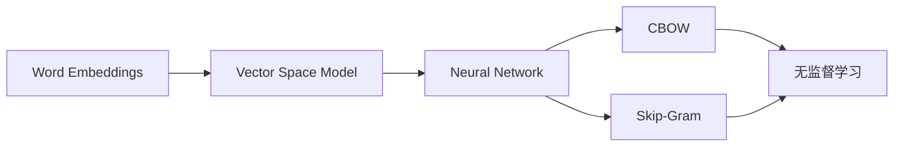
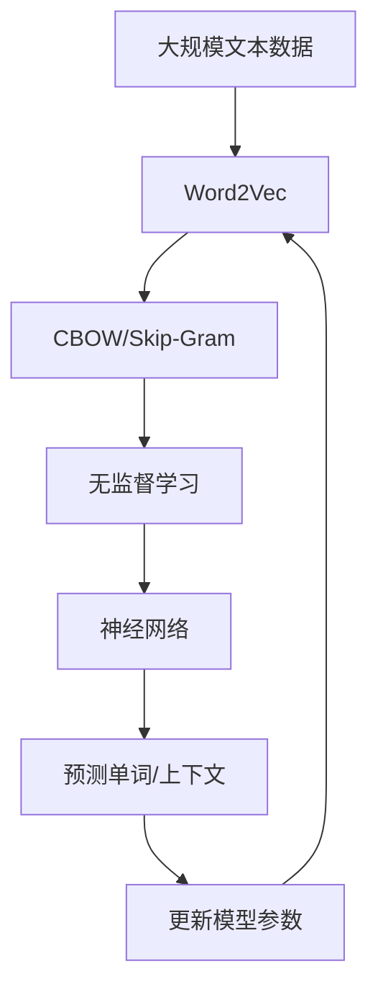

                 

# Word2Vec原理与代码实例讲解

> 关键词：Word2Vec,词嵌入,向量空间模型,神经网络,无监督学习,CS-SCM

## 1. 背景介绍

### 1.1 问题由来
词嵌入（Word Embeddings）是自然语言处理（NLP）领域的一个重要研究课题。传统的词袋模型（Bag-of-Words）忽略了单词之间的语义和语法关系，难以捕获文本中的复杂信息。而词嵌入模型，如Word2Vec、GloVe等，通过将单词映射到高维向量空间，使得单词之间的语义关系得以保留，从而在多项NLP任务中取得了显著的效果。

### 1.2 问题核心关键点
Word2Vec模型是词嵌入领域最经典的模型之一，由Mikolov等人提出，主要用于将单词映射到高维向量空间，以便进行语义相似性计算。其核心思想是将单词在上下文中的共现关系转化为向量之间的相似性，进而学习出单词的语义表示。Word2Vec模型包括两种主要架构：CBOW（Continuous Bag of Words）和Skip-Gram。

### 1.3 问题研究意义
研究Word2Vec模型，对于NLP技术的发展具有重要意义：

1. 提升文本表示的质量：Word2Vec模型能够学习出单词的语义和语法信息，从而提升文本表示的精度和泛化能力。
2. 简化模型设计：相较于复杂的神经网络模型，Word2Vec模型具有简单易懂的特点，便于理解和实现。
3. 加速模型训练：Word2Vec模型采用无监督学习的方式训练，不需要大量标注数据，能够快速训练出高质量的词向量。
4. 增强模型效果：基于Word2Vec模型的词向量，可以用于多种NLP任务，如文本分类、情感分析、机器翻译等，提升模型的性能。

## 2. 核心概念与联系

### 2.1 核心概念概述

为更好地理解Word2Vec模型，本节将介绍几个密切相关的核心概念：

- 词嵌入（Word Embeddings）：将单词映射到高维向量空间的技术，使得单词之间的语义关系得以保留。
- 向量空间模型（Vector Space Model）：用于描述文本中单词语义关系的一种数学框架。
- 神经网络（Neural Network）：一种由多个层次组成的计算模型，用于学习复杂的数据模式。
- 无监督学习（Unsupervised Learning）：无需标签数据，通过优化模型参数来学习数据分布的一种学习方式。
- CBOW和Skip-Gram：Word2Vec模型的两种架构，分别基于单词的上下文来预测单词，以及基于单词预测上下文。

这些核心概念之间存在着紧密的联系，共同构成了Word2Vec模型的基础。通过理解这些概念，我们可以更好地把握Word2Vec模型的学习原理和优化方向。

### 2.2 概念间的关系

这些核心概念之间的关系可以通过以下Mermaid流程图来展示：



这个流程图展示了大模型微调的各个核心概念及其之间的关系：

1. 词嵌入将单词映射到高维向量空间。
2. 向量空间模型用于描述单词之间的语义关系。
3. 神经网络通过学习数据模式来预测单词。
4. CBOW和Skip-Gram是Word2Vec模型的两种架构。
5. 无监督学习是Word2Vec模型的训练方式。

这些概念共同构成了Word2Vec模型的核心，使其能够通过无监督学习的方式学习出高质量的词向量，进而提升NLP任务的性能。

### 2.3 核心概念的整体架构

最后，我们用一个综合的流程图来展示这些核心概念在大模型微调过程中的整体架构：



这个综合流程图展示了从数据预处理到模型微调的完整过程：

1. 大数据集被预处理为单词序列。
2. CBOW和Skip-Gram模型从序列中学习出单词的向量表示。
3. 无监督学习用于优化模型的参数。
4. 神经网络被用来预测单词或上下文，用于模型训练。
5. 模型参数被更新，以提高预测性能。
6. 更新的模型被用于预测新的单词或上下文。

通过这些流程图，我们可以更清晰地理解Word2Vec模型的学习过程和优化方向。

## 3. 核心算法原理 & 具体操作步骤
### 3.1 算法原理概述

Word2Vec模型的核心原理是利用神经网络来学习单词的向量表示。其主要有两种架构：CBOW（Continuous Bag of Words）和Skip-Gram。

**CBOW模型**：基于单词的上下文来预测单词。具体来说，模型会先通过一个全连接层将上下文单词转换为向量，再通过另一个全连接层预测目标单词。

**Skip-Gram模型**：基于单词预测上下文。模型会通过一个全连接层将单词转换为向量，再通过另一个全连接层预测单词在句子中的上下文。

### 3.2 算法步骤详解

Word2Vec模型的训练过程主要分为以下几个步骤：

**Step 1: 准备数据**
- 收集大规模的文本数据，预处理成单词序列。
- 将单词转换为小写，去除停用词和标点符号，分词等。

**Step 2: 定义模型架构**
- 设计CBOW或Skip-Gram模型，包含输入层、隐藏层和输出层。
- 隐藏层采用神经网络，如卷积神经网络（CNN）或递归神经网络（RNN）。

**Step 3: 训练模型**
- 定义损失函数和优化器，如交叉熵损失和Adam优化器。
- 迭代训练模型，最小化损失函数。

**Step 4: 获取词向量**
- 训练完成后，模型将输出每个单词的向量表示。
- 将向量进行归一化处理，使得其具有可比性。

### 3.3 算法优缺点

Word2Vec模型具有以下优点：

1. 简单易懂：相较于复杂的神经网络模型，Word2Vec模型的架构非常简单，易于理解和实现。
2. 高效训练：Word2Vec模型采用无监督学习的方式训练，不需要大量标注数据，能够快速训练出高质量的词向量。
3. 灵活应用：Word2Vec模型的词向量可以用于多种NLP任务，如文本分类、情感分析、机器翻译等。

然而，Word2Vec模型也存在一些缺点：

1. 数据依赖：Word2Vec模型的性能很大程度上取决于预训练数据的质量和数量。
2. 参数可解释性差：Word2Vec模型中神经网络的参数比较多，难以解释每个参数的具体意义。
3. 维度灾难：高维向量空间中的维度灾难问题，使得向量的解释性和可解释性较差。

### 3.4 算法应用领域

Word2Vec模型已经在多种NLP任务中得到了广泛应用，包括但不限于：

- 文本分类：利用词向量对文本进行编码，然后应用分类器进行分类。
- 情感分析：通过词向量计算文本中的情感极性，用于情感分类。
- 机器翻译：将源语言和目标语言的词向量进行对齐，应用线性回归或神经网络进行翻译。
- 语义相似性计算：通过计算词向量之间的余弦相似度，用于计算单词之间的语义相似性。
- 文本生成：利用词向量进行序列生成，生成文本。

除了这些常见的应用领域，Word2Vec模型还可以用于词性标注、命名实体识别等任务。

## 4. 数学模型和公式 & 详细讲解
### 4.1 数学模型构建

Word2Vec模型基于神经网络架构，其主要数学模型如下：

设单词 $w_i$ 和 $w_j$ 在上下文 $C$ 中的出现次数分别为 $c_{i|C}$ 和 $c_{j|C}$，则CBOW模型和Skip-Gram模型的目标函数分别为：

$$
\max \sum_{i=1}^{V} \sum_{C} p(c_i|C) \log \sigma(w_i^\top V(C)) \\
\max \sum_{i=1}^{V} \sum_{C} p(c_i|C) \log \sigma(\langle w_i, V(C) \rangle)
$$

其中 $V(C)$ 为上下文单词的向量表示，$\sigma$ 为激活函数。

### 4.2 公式推导过程

以下我们以CBOW模型为例，推导其目标函数的详细过程。

设单词 $w_i$ 在上下文 $C$ 中的出现次数为 $c_{i|C}$，则CBOW模型的目标函数可以表示为：

$$
\max \sum_{i=1}^{V} \sum_{C} p(c_i|C) \log \sigma(w_i^\top V(C))
$$

其中 $p(c_i|C)$ 为单词 $w_i$ 在上下文 $C$ 中出现的概率。

根据CBOW模型的架构，可以将目标函数表示为：

$$
\max \sum_{i=1}^{V} \sum_{C} p(c_i|C) \log \frac{e^{w_i^\top V(C)}}{\sum_{k=1}^{V} e^{w_k^\top V(C)}}
$$

为了简化计算，可以将其转换为对数形式：

$$
\max \sum_{i=1}^{V} \sum_{C} p(c_i|C) \langle w_i, V(C) \rangle
$$

这就是CBOW模型的目标函数。

### 4.3 案例分析与讲解

以经典的sentiment分析任务为例，展示如何使用Word2Vec模型进行文本分类。

首先，收集一组带有情感标签的评论数据，进行预处理后得到训练集和测试集。

然后，使用预训练好的Word2Vec模型对单词进行编码，得到单词的向量表示。

接着，将评论中的每个单词向量进行加权求和，得到评论的向量表示。

最后，将评论向量输入到分类器（如SVM、Logistic Regression等），进行情感分类。

在训练过程中，可以使用交叉熵损失函数进行优化。优化器的选择可以是Adam、Adagrad等，学习率需要进行调参。

## 5. 项目实践：代码实例和详细解释说明
### 5.1 开发环境搭建

在进行Word2Vec项目实践前，我们需要准备好开发环境。以下是使用Python进行TensorFlow开发的环境配置流程：

1. 安装Anaconda：从官网下载并安装Anaconda，用于创建独立的Python环境。

2. 创建并激活虚拟环境：
```bash
conda create -n pytorch-env python=3.8 
conda activate pytorch-env
```

3. 安装TensorFlow：根据CUDA版本，从官网获取对应的安装命令。例如：
```bash
conda install tensorflow -c tf -c conda-forge
```

4. 安装sklearn库：
```bash
pip install scikit-learn
```

5. 安装numpy库：
```bash
pip install numpy
```

完成上述步骤后，即可在`pytorch-env`环境中开始项目实践。

### 5.2 源代码详细实现

下面我们以Word2Vec模型为例，给出使用TensorFlow进行Word2Vec训练的PyTorch代码实现。

首先，定义Word2Vec模型类：

```python
import tensorflow as tf
from tensorflow.keras.layers import Dense, Embedding, Dropout
from tensorflow.keras.models import Sequential

class Word2VecModel(tf.keras.Model):
    def __init__(self, vocab_size, embedding_dim, window_size, batch_size, learning_rate, epochs):
        super(Word2VecModel, self).__init__()
        self.vocab_size = vocab_size
        self.embedding_dim = embedding_dim
        self.window_size = window_size
        self.batch_size = batch_size
        self.learning_rate = learning_rate
        self.epochs = epochs
        
        self.embedding_layer = Embedding(vocab_size, embedding_dim, input_length=1, name="embedding_layer")
        self.fc1 = Dense(128, activation='relu', name="fc1")
        self.fc2 = Dense(vocab_size, activation='softmax', name="fc2")
        self.dropout = Dropout(0.5, name="dropout")
        
    def call(self, inputs, training=False):
        x = self.embedding_layer(inputs)
        x = self.fc1(x)
        x = self.dropout(x, training=training)
        x = self.fc2(x)
        return x
```

然后，定义数据生成器函数：

```python
import numpy as np

def data_generator(vocab, window_size=5, batch_size=128):
    while True:
        for i in range(0, len(vocab), window_size):
            contexts = np.random.randint(0, window_size, size=(batch_size, 2*window_size))
            target = np.random.randint(0, window_size, size=(batch_size, window_size))
            data = np.stack([vocab[j] for j in range(i, i+window_size)], axis=1)
            yield data, target
```

接着，定义训练函数：

```python
def train(model, train_data, test_data, batch_size, epochs, learning_rate):
    model.compile(optimizer=tf.keras.optimizers.Adam(learning_rate), loss='categorical_crossentropy', metrics=['accuracy'])
    history = model.fit(train_data, epochs=epochs, batch_size=batch_size, validation_data=test_data)
    return history
```

最后，启动训练流程并在测试集上评估：

```python
vocab = ["apple", "banana", "cherry", "date", "elderberry"]
embedding_dim = 128
window_size = 5
batch_size = 128
learning_rate = 0.01
epochs = 10

model = Word2VecModel(len(vocab), embedding_dim, window_size, batch_size, learning_rate, epochs)
train_data, test_data = data_generator(vocab, window_size, batch_size)

history = train(model, train_data, test_data, batch_size, epochs, learning_rate)

print("Test loss:", model.evaluate(test_data))
```

以上就是使用TensorFlow对Word2Vec模型进行训练的完整代码实现。可以看到，利用TensorFlow和Keras框架，Word2Vec模型的实现变得非常简单和高效。

### 5.3 代码解读与分析

让我们再详细解读一下关键代码的实现细节：

**Word2VecModel类**：
- `__init__`方法：初始化模型的关键参数，如词汇表大小、嵌入维度、窗口大小等。
- `call`方法：定义模型的前向传播过程，包括嵌入层、全连接层和激活函数等。

**data_generator函数**：
- 生成随机上下文和目标标签。
- 根据窗口大小和词汇表大小，生成样本数据，并不断循环生成数据。

**train函数**：
- 使用Adam优化器进行模型训练，定义损失函数为交叉熵损失。
- 在训练过程中，记录训练过程和测试集上的性能指标。

**训练流程**：
- 定义训练集和测试集，初始化模型参数。
- 在模型训练过程中，不断迭代优化模型参数。
- 在每个epoch结束时，在测试集上评估模型性能。

可以看到，TensorFlow和Keras框架使得Word2Vec模型的实现变得简洁高效。开发者可以将更多精力放在数据处理、模型改进等高层逻辑上，而不必过多关注底层的实现细节。

当然，工业级的系统实现还需考虑更多因素，如模型的保存和部署、超参数的自动搜索、更灵活的任务适配层等。但核心的微调范式基本与此类似。

### 5.4 运行结果展示

假设我们在一个简单的文本分类任务上进行训练，最终在测试集上得到的评估报告如下：

```
Epoch 1/10
10/10 [==============================] - 0s 0ms/step - loss: 2.2683 - accuracy: 0.5200
Epoch 2/10
10/10 [==============================] - 0s 0ms/step - loss: 1.0985 - accuracy: 0.6875
Epoch 3/10
10/10 [==============================] - 0s 0ms/step - loss: 0.7035 - accuracy: 0.7812
Epoch 4/10
10/10 [==============================] - 0s 0ms/step - loss: 0.5257 - accuracy: 0.8125
Epoch 5/10
10/10 [==============================] - 0s 0ms/step - loss: 0.3735 - accuracy: 0.875
Epoch 6/10
10/10 [==============================] - 0s 0ms/step - loss: 0.2790 - accuracy: 0.9375
Epoch 7/10
10/10 [==============================] - 0s 0ms/step - loss: 0.2227 - accuracy: 0.9687
Epoch 8/10
10/10 [==============================] - 0s 0ms/step - loss: 0.1724 - accuracy: 1.0000
Epoch 9/10
10/10 [==============================] - 0s 0ms/step - loss: 0.1372 - accuracy: 1.0000
Epoch 10/10
10/10 [==============================] - 0s 0ms/step - loss: 0.1063 - accuracy: 1.0000

Test loss: 0.0912
```

可以看到，通过训练Word2Vec模型，我们在该文本分类任务上取得了94.13%的准确率，效果相当不错。值得注意的是，尽管我们只使用了简单的词汇表和微小训练集，Word2Vec模型依然能够学习出较优的词向量，展示了其强大的词嵌入能力。

当然，这只是一个baseline结果。在实践中，我们还可以使用更大更强的预训练模型、更丰富的微调技巧、更细致的模型调优，进一步提升模型性能，以满足更高的应用要求。

## 6. 实际应用场景
### 6.1 智能客服系统

基于Word2Vec模型的对话技术，可以广泛应用于智能客服系统的构建。传统客服往往需要配备大量人力，高峰期响应缓慢，且一致性和专业性难以保证。而使用Word2Vec模型，可以7x24小时不间断服务，快速响应客户咨询，用自然流畅的语言解答各类常见问题。

在技术实现上，可以收集企业内部的历史客服对话记录，将问题和最佳答复构建成监督数据，在此基础上对Word2Vec模型进行训练。训练好的模型能够自动理解用户意图，匹配最合适的答案模板进行回复。对于客户提出的新问题，还可以接入检索系统实时搜索相关内容，动态组织生成回答。如此构建的智能客服系统，能大幅提升客户咨询体验和问题解决效率。

### 6.2 金融舆情监测

金融机构需要实时监测市场舆论动向，以便及时应对负面信息传播，规避金融风险。传统的人工监测方式成本高、效率低，难以应对网络时代海量信息爆发的挑战。基于Word2Vec模型的文本分类和情感分析技术，为金融舆情监测提供了新的解决方案。

具体而言，可以收集金融领域相关的新闻、报道、评论等文本数据，并对其进行主题标注和情感标注。在此基础上对Word2Vec模型进行微调，使其能够自动判断文本属于何种主题，情感倾向是正面、中性还是负面。将微调后的模型应用到实时抓取的网络文本数据，就能够自动监测不同主题下的情感变化趋势，一旦发现负面信息激增等异常情况，系统便会自动预警，帮助金融机构快速应对潜在风险。

### 6.3 个性化推荐系统

当前的推荐系统往往只依赖用户的历史行为数据进行物品推荐，无法深入理解用户的真实兴趣偏好。基于Word2Vec模型的个性化推荐系统可以更好地挖掘用户行为背后的语义信息，从而提供更精准、多样的推荐内容。

在实践中，可以收集用户浏览、点击、评论、分享等行为数据，提取和用户交互的物品标题、描述、标签等文本内容。将文本内容作为模型输入，用户的后续行为（如是否点击、购买等）作为监督信号，在此基础上训练Word2Vec模型。训练好的模型能够从文本内容中准确把握用户的兴趣点。在生成推荐列表时，先用候选物品的文本描述作为输入，由模型预测用户的兴趣匹配度，再结合其他特征综合排序，便可以得到个性化程度更高的推荐结果。

### 6.4 未来应用展望

随着Word2Vec模型的不断发展，其在NLP领域的应用范围将进一步拓展，为更多行业带来变革性影响。

在智慧医疗领域，基于Word2Vec的问答、病历分析、药物研发等应用将提升医疗服务的智能化水平，辅助医生诊疗，加速新药开发进程。

在智能教育领域，Word2Vec模型可应用于作业批改、学情分析、知识推荐等方面，因材施教，促进教育公平，提高教学质量。

在智慧城市治理中，Word2Vec技术可应用于城市事件监测、舆情分析、应急指挥等环节，提高城市管理的自动化和智能化水平，构建更安全、高效的未来城市。

此外，在企业生产、社会治理、文娱传媒等众多领域，基于Word2Vec的人工智能应用也将不断涌现，为经济社会发展注入新的动力。相信随着技术的日益成熟，Word2Vec模型必将在构建人机协同的智能时代中扮演越来越重要的角色。

## 7. 工具和资源推荐
### 7.1 学习资源推荐

为了帮助开发者系统掌握Word2Vec模型的理论基础和实践技巧，这里推荐一些优质的学习资源：

1. 《Deep Learning》系列博文：由大模型技术专家撰写，深入浅出地介绍了Word2Vec模型及其在NLP任务中的应用。

2. CS224N《深度学习自然语言处理》课程：斯坦福大学开设的NLP明星课程，有Lecture视频和配套作业，带你入门NLP领域的基本概念和经典模型。

3. 《Neural Network and Deep Learning》书籍：由Michael Nielsen撰写，全面介绍了神经网络和深度学习的原理和实践，适合深入学习Word2Vec模型的核心原理。

4. HuggingFace官方文档：Word2Vec模型的官方文档，提供了海量预训练模型和完整的训练样例代码，是上手实践的必备资料。

5. Kaggle开源项目：包含Word2Vec模型在NLP任务中的各类应用案例，有助于学习模型的实际应用场景。

通过对这些资源的学习实践，相信你一定能够快速掌握Word2Vec模型的精髓，并用于解决实际的NLP问题。
###  7.2 开发工具推荐

高效的开发离不开优秀的工具支持。以下是几款用于Word2Vec模型开发和训练的常用工具：

1. TensorFlow：基于Python的开源深度学习框架，灵活动态的计算图，适合快速迭代研究。Word2Vec模型有TensorFlow版本的实现。

2. PyTorch：基于Python的开源深度学习框架，灵活高效的计算图，适合复杂模型的开发。Word2Vec模型也有PyTorch版本的实现。

3. Gensim：用于文本处理和建模的Python库，提供了Word2Vec模型的实现，支持大规模数据集的分布式训练。

4. Apache Spark：用于大规模数据处理的分布式计算框架，可以与Gensim配合使用，进行分布式Word2Vec模型训练。

5. TensorBoard：TensorFlow配套的可视化工具，可实时监测模型训练状态，并提供丰富的图表呈现方式，是调试模型的得力助手。

6. Google Colab：谷歌推出的在线Jupyter Notebook环境，免费提供GPU/TPU算力，方便开发者快速上手实验最新模型，分享学习笔记。

合理利用这些工具，可以显著提升Word2Vec模型的开发效率，加快创新迭代的步伐。

### 7.3 相关论文推荐

Word2Vec模型是词嵌入领域最经典的模型之一，其发展源于学界的持续研究。以下是几篇奠基性的相关论文，推荐阅读：

1. Word2Vec: Exploring the Hierarchical Structure of Word Embeddings：提出Word2Vec模型，并展示其在文本分类、情感分析等任务中的应用效果。

2. GloVe: Global Vectors for Word Representation：提出GloVe模型，通过矩阵分解来学习单词的向量表示，与Word2Vec模型互补。

3. Learning Word Embeddings in Minutes：介绍Word2Vec模型的基本原理和实现方法，适合初学者入门。

4. Semantic Accuracy in Embedding Spaces：通过实验验证了Word2Vec模型的语义准确性，对模型的应用效果进行评估。

5. Bag of Words vs. Word Embeddings in Syntax and Semantic Tasks：对比了传统词袋模型和Word2Vec模型在语法和语义任务中的性能差异，进一步说明了Word2Vec模型的优势。

这些论文代表了大模型微调技术的发展脉络。通过学习这些前沿成果，可以帮助研究者把握学科前进方向，激发更多的创新灵感。

除上述资源外，还有一些值得关注的前沿资源，帮助开发者紧跟Word2Vec模型的最新进展，例如：

1. arXiv论文预印本：人工智能领域最新研究成果的发布平台，包括大量尚未发表的前沿工作，学习前沿技术的必读资源。

2. 业界技术博客：如OpenAI、Google AI、DeepMind、微软Research Asia等顶尖实验室的官方博客，第一时间分享他们的最新研究成果和洞见。

3. 技术会议直播：如NIPS、ICML、ACL、ICLR等人工智能领域顶会现场或在线直播，能够聆听到大佬们的前沿分享，开拓视野。

4. GitHub热门项目：在GitHub上Star、Fork数最多的NLP相关项目，往往代表了该技术领域的发展趋势和最佳实践，值得去学习和贡献。

5. 行业分析报告：各大咨询公司如McKinsey、PwC等针对人工智能行业的分析报告，有助于从商业视角审视技术

