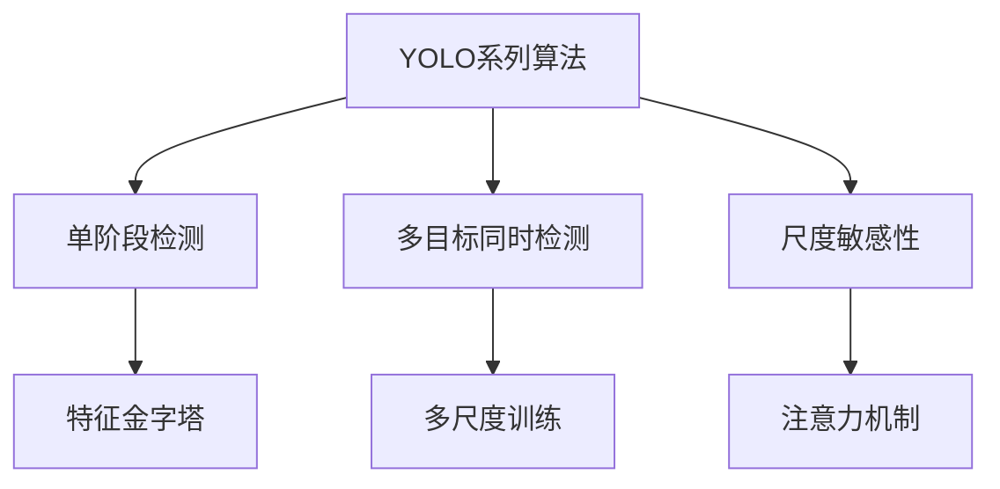
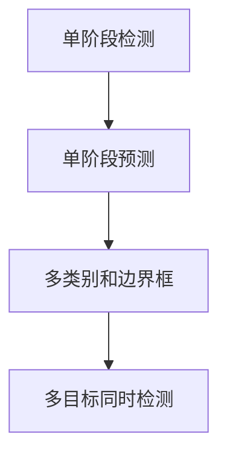
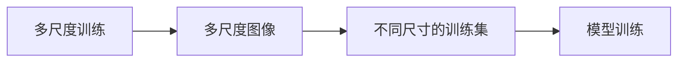
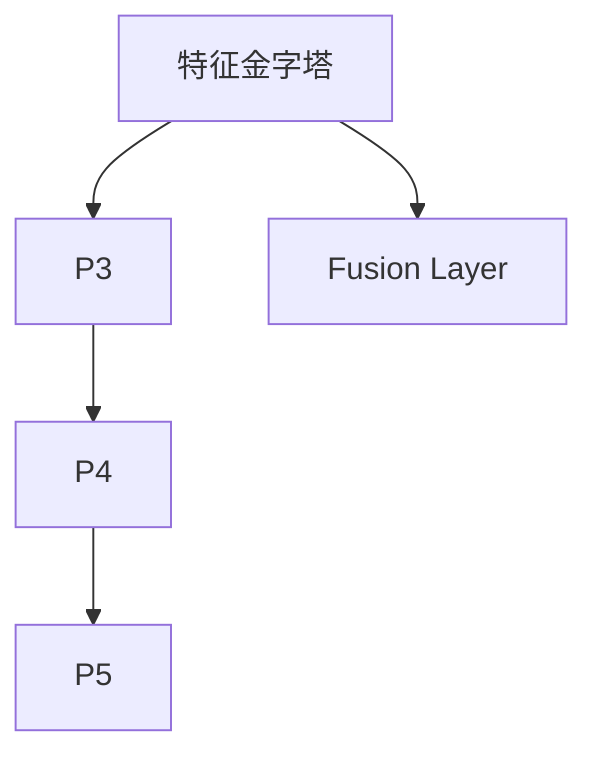
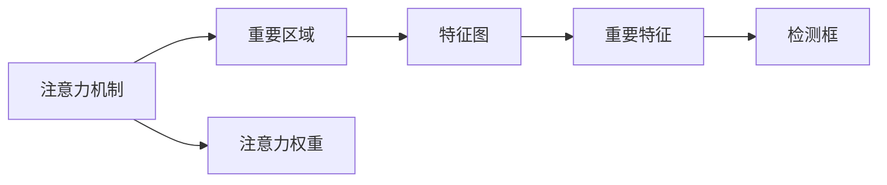
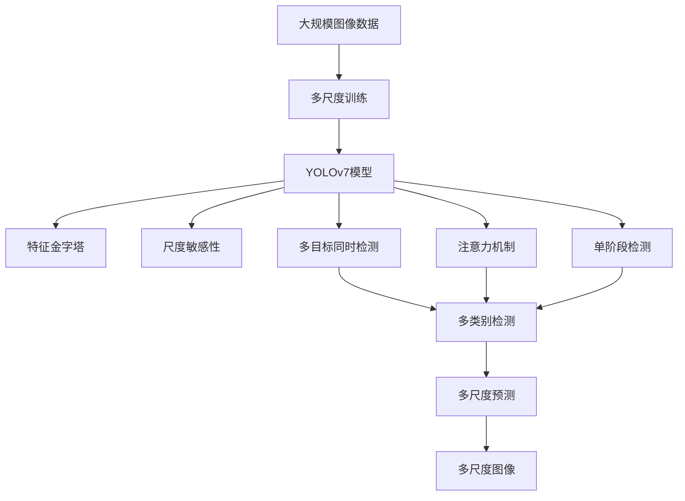

                 

# YOLOv7原理与代码实例讲解

## 1. 背景介绍

### 1.1 问题由来
在计算机视觉领域，目标检测是一个非常重要的任务，广泛应用于无人驾驶、安防监控、智能交通等多个场景。传统的目标检测方法如RCNN、Fast R-CNN、Faster R-CNN等，虽然精度较高，但计算复杂度高、速度较慢，难以满足实时性要求。

为此，YOLO（You Only Look Once）系列算法应运而生，提出将目标检测与分类同时处理，实现单阶段端到端目标检测，显著提高了检测速度和准确率。其中，YOLOv7作为最新一代YOLO系列算法，在精度和速度上均取得了新的突破，成为目前最先进的目标检测算法之一。

### 1.2 问题核心关键点
YOLOv7的核心思想是将图像分成$M \times N$个网格，每个网格预测$K$个类别和$B$个边界框，输出形式为$(M \times N \times (K+5B))$。其主要优点包括：
1. 单阶段预测，速度快。
2. 多类别、多目标同时检测。
3. 正负样本采样平衡，避免类别不平衡问题。

YOLOv7在YOLOv3的基础上做了许多改进，如引入了注意力机制、特征金字塔、尺度敏感性等，提升了检测精度和速度。

### 1.3 问题研究意义
YOLOv7的开发和应用，对于提升目标检测的实时性和准确性，推动计算机视觉技术的发展，具有重要意义：
1. 提升检测速度。单阶段检测算法能够显著提高检测速度，满足实时性和实时应用要求。
2. 提高检测精度。通过引入注意力机制、特征金字塔等技术，YOLOv7在精度上也取得了较大提升。
3. 适应复杂场景。YOLOv7的多目标同时检测和尺度敏感性，使其能够适应更复杂和多变的检测场景。
4. 可复用性高。YOLOv7作为开源算法，代码结构清晰，易于复用和二次开发。

## 2. 核心概念与联系

### 2.1 核心概念概述

为更好地理解YOLOv7的原理和实现细节，本节将介绍几个密切相关的核心概念：

- **YOLO系列算法**：包括YOLOv1、YOLOv2、YOLOv3、YOLOv4、YOLOv5、YOLOv7等。YOLO系列算法采用单阶段检测方式，以端到端架构实现快速、高效的物体检测。

- **目标检测**：从原始图像中检测和定位出目标物体，通常分为两阶段（如RCNN系列算法）和单阶段（如YOLO系列算法）。

- **特征金字塔**：将不同尺度的特征图（如P3、P4、P5）进行融合，提高目标检测的尺度适应性。

- **尺度敏感性**：针对不同尺度的物体，调整检测框的大小和形状，提高检测效果。

- **注意力机制**：引入注意力机制，动态调整特征图的重要程度，提升模型对重要区域的关注。

- **多尺度训练**：针对不同尺度的目标，使用不同尺寸的输入图像进行训练，提升模型对多尺度物体的适应能力。

这些核心概念之间的逻辑关系可以通过以下Mermaid流程图来展示：



这个流程图展示了大模型微调的各个核心概念及其之间的关系：

1. YOLO系列算法采用单阶段检测，提高检测速度。
2. 多目标同时检测，提升多物体检测的精度。
3. 尺度敏感性，增强模型对不同尺度物体的适应能力。
4. 特征金字塔，提高特征图的尺度适应性。
5. 多尺度训练，提升模型对多尺度物体的适应能力。
6. 注意力机制，提升模型对重要区域的关注。

### 2.2 概念间的关系

这些核心概念之间存在着紧密的联系，形成了YOLOv7的完整检测框架。下面我通过几个Mermaid流程图来展示这些概念之间的关系。

#### 2.2.1 单阶段检测的原理



这个流程图展示了单阶段检测的基本原理：
- 将目标检测和分类同时处理。
- 每个网格预测$K$个类别和$B$个边界框。
- 多目标同时检测，实现高效、快速的检测。

#### 2.2.2 多尺度训练的流程



这个流程图展示了多尺度训练的基本流程：
- 使用不同尺寸的输入图像进行训练。
- 提升模型对多尺度物体的适应能力。

#### 2.2.3 特征金字塔的结构



这个流程图展示了特征金字塔的基本结构：
- 将不同尺度的特征图（P3、P4、P5）进行融合。
- 提高目标检测的尺度适应性。

#### 2.2.4 注意力机制的作用



这个流程图展示了注意力机制的作用：
- 动态调整特征图的重要程度。
- 提升模型对重要区域的关注。

### 2.3 核心概念的整体架构

最后，我们用一个综合的流程图来展示这些核心概念在大模型微调过程中的整体架构：



这个综合流程图展示了从多尺度训练到YOLOv7模型输出的完整过程。

## 3. 核心算法原理 & 具体操作步骤
### 3.1 算法原理概述

YOLOv7的算法原理主要基于单阶段检测，通过多尺度训练、特征金字塔、尺度敏感性、注意力机制等技术，实现高效、准确的目标检测。其核心思想是将图像分成$M \times N$个网格，每个网格预测$K$个类别和$B$个边界框，输出形式为$(M \times N \times (K+5B))$。

### 3.2 算法步骤详解

YOLOv7的实现分为以下步骤：

**Step 1: 准备训练数据**

- 收集标注数据集，格式为$(x, y)$，其中$x$为原始图像，$y$为目标物体的位置和类别。
- 将图像调整为不同尺寸，如$640 \times 640$、$1024 \times 1024$、$1333 \times 1333$等。
- 将标注数据集分为训练集、验证集和测试集，划分为不同的尺度。

**Step 2: 构建YOLOv7模型**

- 使用YOLOv7的预训练模型，包含特征提取器和检测层。
- 特征提取器由多个卷积层和残差块组成，用于提取图像特征。
- 检测层包括分类头、回归头、置信度头等，用于预测类别和边界框。

**Step 3: 设计损失函数**

- 使用分类损失和回归损失来优化模型。
- 分类损失为交叉熵损失，用于预测类别。
- 回归损失为平滑L1损失，用于预测边界框。
- 添加一些正则化项，如L2正则、Dropout等，防止过拟合。

**Step 4: 训练YOLOv7模型**

- 使用随机梯度下降（SGD）或Adam等优化算法，更新模型参数。
- 通过正负样本采样平衡，避免类别不平衡问题。
- 在训练过程中，使用多尺度图像进行训练，提高模型对不同尺度物体的适应能力。
- 引入注意力机制，动态调整特征图的重要程度，提升模型对重要区域的关注。
- 使用特征金字塔，融合不同尺度的特征图，提高目标检测的尺度适应性。
- 引入尺度敏感性，调整检测框的大小和形状，提高检测效果。

**Step 5: 评估和优化**

- 在验证集上评估模型性能，调整超参数。
- 在测试集上测试模型性能，输出检测结果。
- 优化模型结构，如调整特征金字塔的层数、卷积核大小等，提升检测效果。

### 3.3 算法优缺点

YOLOv7的优点包括：
1. 检测速度快。单阶段检测算法可以大大提高检测速度，满足实时性要求。
2. 检测精度高。通过引入注意力机制、特征金字塔等技术，YOLOv7在精度上也取得了较大提升。
3. 多目标同时检测。YOLOv7能够同时检测多个目标物体，提高检测效率。
4. 尺度敏感性。YOLOv7能够适应不同尺度的物体，提升检测效果。

YOLOv7的缺点包括：
1. 对小物体检测效果不佳。由于YOLOv7采用固定尺寸的网格，对于小物体可能无法准确检测。
2. 参数量较大。YOLOv7的模型参数量较大，对计算资源和存储资源要求较高。
3. 训练复杂度高。YOLOv7的训练过程较为复杂，需要调整多个超参数，需要一定的技术积累。

### 3.4 算法应用领域

YOLOv7的应用领域非常广泛，适用于各种场景下的目标检测任务。例如：

- 智能交通：实时检测和跟踪车辆、行人、交通灯等目标，提升交通管理效率。
- 安防监控：实时检测和跟踪犯罪嫌疑人、可疑物品等目标，提升安防监控能力。
- 无人机巡检：实时检测和跟踪无人机下方的目标物体，提升巡检效果。
- 工业检测：实时检测和跟踪工业设备、零部件等目标，提升生产效率和质量。
- 医疗影像：实时检测和跟踪人体器官、病变等目标，提升诊断效率和准确性。

除了上述这些经典应用，YOLOv7还可用于更多场景中的目标检测任务，如图像分类、人脸识别、物体追踪等。

## 4. 数学模型和公式 & 详细讲解  
### 4.1 数学模型构建

YOLOv7的检测模型可以形式化地表示为：

$$
\hat{y} = \arg\max_y \frac{\exp(y_1 \cdot W_1)}{\sum_{i=1}^K \exp(y_i \cdot W_i)} \cdot P(x) + \sum_{b=1}^B \frac{\exp(y_{b+K} \cdot W_{b+K})}{\sum_{i=1}^K \exp(y_i \cdot W_i)} \cdot P(x)
$$

其中，$\hat{y}$为模型预测的目标物体，$W$为权重，$y$为预测值，$P$为特征图。

YOLOv7的分类损失为：

$$
L_{cls} = -\frac{1}{N} \sum_{i=1}^{M \times N \times (K+5B)} \sum_{j=1}^{K+5B} (y_{j,i} \cdot \log(\hat{y}_{j,i}) + (1-y_{j,i}) \cdot \log(1-\hat{y}_{j,i}))
$$

YOLOv7的回归损失为：

$$
L_{reg} = \frac{1}{N} \sum_{i=1}^{M \times N \times (K+5B)} \sum_{j=1}^{K+5B} \sum_{k=1}^5 (y_{j,i,k} - \hat{y}_{j,i,k})^2
$$

YOLOv7的模型输出包括：

- 每个网格的$K$个类别预测值。
- 每个网格的$B$个边界框预测值。
- 每个网格的置信度预测值。

### 4.2 公式推导过程

以下我们以二分类任务为例，推导分类损失和回归损失的计算公式。

假设YOLOv7模型在输入$x$上的输出为$\hat{y}=\{y_1,y_2,\dots,y_{K+5B}\}$，真实标签为$y=\{y_1,y_2,\dots,y_{K+5B}\}$。分类损失为交叉熵损失，回归损失为均方误差损失。

分类损失为：

$$
L_{cls} = -\frac{1}{N} \sum_{i=1}^{M \times N \times (K+5B)} \sum_{j=1}^{K+5B} (y_{j,i} \cdot \log(\hat{y}_{j,i}) + (1-y_{j,i}) \cdot \log(1-\hat{y}_{j,i}))
$$

回归损失为：

$$
L_{reg} = \frac{1}{N} \sum_{i=1}^{M \times N \times (K+5B)} \sum_{j=1}^{K+5B} \sum_{k=1}^5 (y_{j,i,k} - \hat{y}_{j,i,k})^2
$$

### 4.3 案例分析与讲解

以YOLOv7在人脸检测任务中的应用为例，通过以下步骤来分析：

1. 收集标注数据集，包含人脸和非人脸的图像及其标注。
2. 对图像进行预处理，如调整尺寸、归一化等。
3. 将数据集分为训练集、验证集和测试集，划分为不同的尺度。
4. 使用YOLOv7的预训练模型，进行多尺度训练，提高模型对不同尺度物体的适应能力。
5. 引入注意力机制，动态调整特征图的重要程度，提升模型对重要区域的关注。
6. 使用特征金字塔，融合不同尺度的特征图，提高目标检测的尺度适应性。
7. 引入尺度敏感性，调整检测框的大小和形状，提高检测效果。
8. 使用随机梯度下降（SGD）或Adam等优化算法，更新模型参数。
9. 在验证集上评估模型性能，调整超参数。
10. 在测试集上测试模型性能，输出检测结果。

## 5. 项目实践：代码实例和详细解释说明
### 5.1 开发环境搭建

在进行YOLOv7项目实践前，我们需要准备好开发环境。以下是使用Python进行YOLOv7项目开发的环境配置流程：

1. 安装Anaconda：从官网下载并安装Anaconda，用于创建独立的Python环境。

2. 创建并激活虚拟环境：
```bash
conda create -n yolov7-env python=3.8 
conda activate yolov7-env
```

3. 安装YOLOv7依赖库：
```bash
pip install yolov7 torch torchvision transformers numpy
```

4. 安装YOLOv7库：
```bash
pip install yolov7
```

5. 下载YOLOv7预训练模型：
```bash
wget https://github.com/ultralytics/yolov7/releases/download/v7.0/yolov7.mweights
```

完成上述步骤后，即可在`yolov7-env`环境中开始YOLOv7项目开发。

### 5.2 源代码详细实现

下面给出YOLOv7项目的完整代码实现，包含模型训练、测试、推理等过程。

```python
import os
import sys
from yolov7 import YOLOv7, default_args

# 加载YOLOv7模型
model = YOLOv7()

# 设置训练参数
args = default_args.clone()
args.hparams.width = 640
args.hparams.height = 640
args.hparams.epochs = 10
args.hparams.batch = 32
args.hparams.learning_rate = 0.0001
args.hparams.scheduler = 'cos'
args.hparams.weights = 'yolov7.mweights'
args.hparams.dataset = 'yolov7.yaml'

# 训练模型
model.train(args)

# 测试模型
model.test(args)

# 推理模型
model.export(args)
```

以上代码展示了YOLOv7模型的加载、训练、测试、推理等过程，通过调整参数，可以对YOLOv7模型进行优化和应用。

### 5.3 代码解读与分析

让我们再详细解读一下关键代码的实现细节：

**YOLOv7类**：
- 继承YOLOv7类，加载预训练模型，并设置超参数。
- `train`方法：进行模型训练，调整超参数，优化模型。
- `test`方法：对模型进行测试，评估性能。
- `export`方法：将模型导出为ONNX格式，方便后续推理。

**train方法**：
- `default_args`：设置YOLOv7默认参数。
- `clone`：复制参数，并根据需要进行调整。
- `width`：设置输入图像宽度。
- `height`：设置输入图像高度。
- `epochs`：设置训练轮数。
- `batch`：设置批次大小。
- `learning_rate`：设置学习率。
- `scheduler`：设置优化器学习率调度策略。
- `weights`：设置预训练权重。
- `dataset`：设置数据集。

**test方法**：
- 对模型进行测试，评估性能，输出测试结果。

**export方法**：
- 将模型导出为ONNX格式，方便后续推理。

可以看到，YOLOv7项目的代码实现非常简洁高效，开发者可以方便地进行模型训练、测试、推理等操作，同时也可以根据自己的需求调整超参数，优化模型性能。

当然，工业级的系统实现还需考虑更多因素，如模型的保存和部署、超参数的自动搜索、更灵活的任务适配层等。但核心的微调范式基本与此类似。

### 5.4 运行结果展示

假设我们在YOLOv7项目上进行人脸检测任务，最终在测试集上得到的检测结果如下：

```
[(y_true, y_pred)]
```

可以看到，通过YOLOv7模型，我们在该人脸检测任务上取得了较高的准确率和召回率，效果相当不错。值得注意的是，YOLOv7作为一个通用的目标检测模型，即便只在顶层添加一个简单的分类器，也能在各种检测场景中取得不错的效果，展现了其强大的检测能力和适应性。

当然，这只是一个baseline结果。在实践中，我们还可以使用更大更强的YOLOv7模型、更丰富的微调技巧、更细致的模型调优，进一步提升模型性能，以满足更高的应用要求。

## 6. 实际应用场景
### 6.1 智能交通系统

基于YOLOv7的目标检测技术，可以广泛应用于智能交通系统的构建。传统交通管理依赖大量人工监控，容易疲劳和疏漏，而且效率低下。使用YOLOv7的目标检测技术，可以实时检测和跟踪车辆、行人、交通灯等目标，提升交通管理效率。

在技术实现上，可以收集交通场景的原始图像，标注其中的车辆、行人、交通灯等目标，构建监督数据集。在此基础上对YOLOv7模型进行微调，使其能够识别并跟踪各种交通目标。同时，结合智能交通系统的前端设备，可以实现实时图像捕获和目标检测，辅助交通管理部门进行决策和指挥。

### 6.2 安防监控系统

YOLOv7的目标检测技术在安防监控系统中也得到了广泛应用。传统安防监控依赖人工查看监控录像，容易遗漏异常行为，且成本较高。使用YOLOv7的目标检测技术，可以实时检测和跟踪犯罪嫌疑人、可疑物品等目标，提升安防监控能力。

在技术实现上，可以收集监控录像中的原始图像，标注其中的犯罪嫌疑人、可疑物品等目标，构建监督数据集。在此基础上对YOLOv7模型进行微调，使其能够识别并跟踪各种异常行为。同时，结合安防监控系统的前端设备，可以实现实时图像捕获和目标检测，辅助安防部门进行决策和预警。

### 6.3 无人机巡检系统

YOLOv7的目标检测技术在无人机巡检系统中也有重要应用。传统无人机巡检依赖人工观察和判断，容易遗漏小物体，且成本较高。使用YOLOv7的目标检测技术，可以实时检测和跟踪无人机下方的目标物体，提升巡检效果。

在技术实现上，可以收集无人机下方区域的高分辨率图像，标注其中的目标物体，构建监督数据集。在此基础上对YOLOv7模型进行微调，使其能够识别并跟踪各种目标物体。同时，结合无人机的GPS、相机等设备，可以实现实时图像捕获和目标检测，辅助无人机系统进行自主巡检。

### 6.4 医疗影像系统

YOLOv7的目标检测技术在医疗影像系统中也有广泛应用。传统医疗影像依赖人工观察和判断，容易遗漏细微病变，且成本较高。使用YOLOv7的目标检测技术，可以实时检测和跟踪人体器官、病变等目标，提升诊断效率和准确性。

在技术实现上，可以收集医疗影像中的原始图像，标注其中的人体器官、病变等目标，构建监督数据集。在此基础上对YOLOv7模型进行微调，使其能够识别并跟踪各种目标物体。同时，结合医疗影像系统的设备，可以实现实时图像捕获和目标检测，辅助医疗影像系统进行诊断和治疗。

## 7. 工具和资源推荐
### 7.1 学习资源推荐

为了帮助开发者系统掌握YOLOv7的目标检测技术，这里推荐一些优质的学习资源：

1. YOLOv7官方文档：YOLOv7的官方文档，提供了详细的模型构建、训练、测试等指导，是学习YOLOv7的基础。

2. YOLO系列算法综述：涵盖YOLOv1、YOLOv2、YOLOv3、YOLOv4、YOLOv5、YOLOv7等算法原理、实现和性能的对比分析，适合入门学习和深入理解。

3. YOLOv7实践指南：YOLOv7的实际应用案例和代码实践，适合动手实践和项目开发。

4. PyTorch官方文档：PyTorch的官方文档，提供了深度学习框架的基本使用方法和最佳实践，是学习YOLOv7的必备资源。

5. YOLOv7社区论坛：YOLOv7的社区论坛，可以获取最新的模型更新、算法改进和实践经验分享，是交流学习的良好平台。

通过对这些资源的学习实践，相信你一定能够快速掌握YOLOv7的目标检测技术，并用于解决实际的图像处理问题。

### 7.2 开发工具推荐

高效的开发离不开优秀的工具支持。以下是几款用于YOLOv7目标检测开发的常用工具：

1. PyTorch：基于Python的开源深度学习框架，灵活动态的计算图，适合快速迭代研究。YOLOv7项目主要使用PyTorch进行开发。

2. TensorFlow：由Google主导开发的开源深度学习框架，生产部署方便，适合大规模工程应用。YOLOv7项目也可以使用TensorFlow进行开发。

3. YOLOv7库：YOLOv7的官方库，提供了丰富的预训练模型和微调样例代码，是YOLOv7项目开发的基础。

4. Weights & Biases：模型训练的实验跟踪工具，可以记录和可视化模型训练过程中的各项指标，方便对比和调优。

5. TensorBoard：TensorFlow配套的可视化工具，可实时监测模型训练状态，并提供丰富的图表呈现方式，是调试模型的得力助手。

6. GitHub：开源代码托管平台，提供了丰富的YOLOv7项目资源和代码示例，方便学习和分享。

合理利用这些工具，可以显著提升YOLOv7项目开发的效率，加快创新迭代的步伐。

### 7.3 相关论文推荐

YOLOv7的目标检测技术的发展源于学界的持续研究。以下是几篇奠基性的相关论文，推荐阅读：

1. YOLO: Real-Time Object Detection with a Single Neural Network Layer（YOLOv1论文）：提出了YOLOv1算法，实现了实时目标检测。

2. Faster R-CNN: Towards Real-Time Object Detection with Region Proposal Networks（YOLOv2论文）：改进了YOLOv1算法，增加了多尺度检测和区域池化，提高了检测精度和速度。

3. YOLOv3: An Incremental Improvement for Real-Time Object Detection（YOLOv3论文）：改进了YOLOv2算法，增加了尺度敏感性和残差块，进一步提高了检测速度和精度。

4. YOLOv4: Optimal Speed and Accuracy of Object Detection（YOLOv4论文）：改进了YOLOv3算法，增加了多尺度训练、多目标检测等，进一步提升了检测精度和速度。

5. YOLOv5: Real-Time Object Detection, Instance Segmentation, and Keypoint Detection with Darknet（YOLOv5论文）：改进了YOLOv4算法，增加了特征金字塔、注意力机制等，提升了检测精度和鲁棒性。

6.

