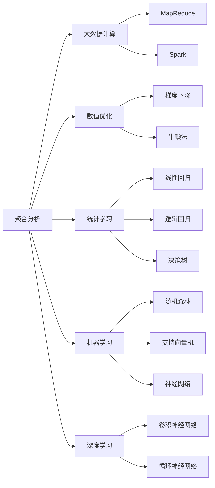

                 

# 【AI大数据计算原理与代码实例讲解】聚合分析

> 关键词：聚合分析,大数据计算,数值优化,统计学习,机器学习,深度学习

## 1. 背景介绍

### 1.1 问题由来

在当今信息爆炸的时代，大数据分析已经成为决策、优化和创新的重要工具。聚合分析作为数据分析的一种核心技术，通过将多个数据点合并成更有信息量的统计数据，帮助人们理解数据背后的趋势和模式，实现更加深入的洞察。在大数据时代，聚合分析被广泛应用于商业智能、金融分析、医疗诊断等多个领域，是数据挖掘和预测分析的基础。

然而，随着数据量的不断增加，传统的聚合分析方法已无法满足高效计算和准确性的需求。与此同时，人工智能技术的迅速发展，尤其是深度学习和大数据计算技术，为聚合分析提供了新的计算和优化手段。如何利用这些先进技术，提高聚合分析的效率和精度，是一个亟待解决的问题。

### 1.2 问题核心关键点

聚合分析的核心在于如何高效地处理和计算大量的数据，并将其转化为有意义的统计信息。具体来说，这个问题可以分解为以下几个关键点：

1. **数据处理**：如何快速高效地处理和存储大规模数据。
2. **聚合计算**：如何选择合适的聚合函数（如均值、方差、中位数等）对数据进行聚合。
3. **优化方法**：如何优化聚合计算过程，提高计算效率和结果准确性。
4. **分布式计算**：如何在大规模分布式环境中高效地进行聚合分析。

本文将围绕上述关键点，详细介绍聚合分析的基本原理和实现方法，同时结合最新的AI和大数据计算技术，提供具体的代码实例和优化策略。

## 2. 核心概念与联系

### 2.1 核心概念概述

为了更全面地理解聚合分析，我们需要先介绍几个关键概念：

- **聚合分析(Aggregative Analysis)**：指通过将多个数据点聚合成统计信息，来捕捉数据的总体趋势和模式。常用的聚合函数包括均值、方差、标准差、中位数等。
- **大数据计算(Big Data Computing)**：指在大规模数据集上进行高效、分布式计算的技术。包括MapReduce、Spark等计算框架。
- **数值优化(Numerical Optimization)**：指在连续或离散域内，通过优化算法寻找目标函数的极值点。常用的优化方法包括梯度下降、牛顿法等。
- **统计学习(Statistical Learning)**：指利用统计模型和算法，从数据中学习并预测新样本的统计特性。常用的统计学习模型包括线性回归、逻辑回归、决策树等。
- **机器学习(Machine Learning)**：指通过数据训练模型，实现对未知数据的预测和分类。常用的机器学习算法包括随机森林、支持向量机、神经网络等。
- **深度学习(Deep Learning)**：指通过多层神经网络结构，从原始数据中学习特征表示，实现高维数据的复杂模式识别。

这些概念之间存在紧密的联系，通过选择合适的算法和技术，可以有效提高聚合分析的效率和精度。接下来，我们将通过一个Mermaid流程图，展示这些核心概念之间的逻辑关系：



### 2.2 概念间的关系

从上述Mermaid图中，我们可以看出聚合分析与其他核心概念之间的关系：

- 聚合分析依赖于大数据计算技术，以便在大规模数据集上进行高效计算。MapReduce和Spark是两种常用的大数据计算框架。
- 聚合分析中常用的数值优化方法，如梯度下降和牛顿法，可以帮助我们寻找最优的聚合参数。
- 统计学习是聚合分析的重要基础，常用的统计模型如线性回归、逻辑回归等，可以提供数据的总体趋势和方差。
- 机器学习和深度学习算法，如随机森林、神经网络等，可以通过学习大量数据，提升聚合分析的预测和分类能力。
- 聚合分析在大数据计算和优化方法的帮助下，可以更高效地处理数据，并通过机器学习和深度学习，提升分析的准确性和深度。

这些概念共同构成了聚合分析的完整框架，使得聚合分析在大数据时代能够充分发挥其作用。

## 3. 核心算法原理 & 具体操作步骤
### 3.1 算法原理概述

聚合分析的基本原理是通过将多个数据点合并成一个或多个统计量，来捕捉数据的总体趋势和模式。常用的聚合函数包括均值、方差、中位数等。其数学表达形式如下：

- 均值：$\bar{x} = \frac{1}{n}\sum_{i=1}^{n}x_i$
- 方差：$s^2 = \frac{1}{n}\sum_{i=1}^{n}(x_i - \bar{x})^2$
- 中位数：$\operatorname{median}(x) = \frac{1}{2}(x_{(\frac{n+1}{2}) + x_{(\frac{n+2}{2})}}$

其中，$x_i$表示数据集中第$i$个数据点，$n$为数据点总数。

在实际应用中，聚合分析的计算过程通常包括以下几个步骤：

1. 数据预处理：对原始数据进行清洗、去重和归一化处理。
2. 数据聚合：选择合适的聚合函数对数据进行聚合计算。
3. 结果输出：将计算结果可视化或存储为报表。

### 3.2 算法步骤详解

以均值聚合为例，具体的聚合计算步骤如下：

1. 数据预处理：假设我们有100个数据点 $x_1, x_2, \ldots, x_{100}$，先将这些数据点进行清洗和去重处理。
2. 数据聚合：将这100个数据点按照均值函数进行聚合计算，即：$\bar{x} = \frac{1}{100}\sum_{i=1}^{100}x_i$。
3. 结果输出：将计算得到的均值 $\bar{x}$ 存储或可视化输出，以便进行后续分析。

对于方差和中位数等聚合函数，计算过程类似，这里不再赘述。

### 3.3 算法优缺点

聚合分析的主要优点包括：

- **效率高**：通过合并多个数据点，减少了计算量，提高了计算效率。
- **易解释**：聚合分析的结果直观明了，容易理解。
- **可扩展性强**：聚合分析适用于各种规模的数据集，可以灵活地处理大规模数据。

其主要缺点包括：

- **信息损失**：聚合过程中可能会丢失一些细节信息，如最大值、最小值等。
- **敏感性问题**：聚合分析的结果可能受到极端值的影响。
- **模型复杂度**：对于某些复杂的数据集，聚合分析可能需要选择多个聚合函数进行组合，增加了模型复杂度。

### 3.4 算法应用领域

聚合分析在多个领域都有广泛的应用，以下是几个典型的应用场景：

- **商业智能(Business Intelligence, BI)**：在BI中，聚合分析用于生成报表、预测销售趋势、分析客户行为等。
- **金融分析(Financial Analysis)**：在金融领域，聚合分析用于计算股票的均值、标准差、中位数等统计信息，分析市场趋势。
- **医疗诊断(Medical Diagnosis)**：在医疗诊断中，聚合分析用于计算患者病情指标的平均值、方差等，帮助医生诊断疾病。
- **自然语言处理(Natural Language Processing, NLP)**：在NLP中，聚合分析用于计算文本中的词频、句子长度等统计信息，进行文本分类和情感分析。

## 4. 数学模型和公式 & 详细讲解  
### 4.1 数学模型构建

为了更好地理解聚合分析，我们将使用数学语言对聚合分析的基本原理进行更加严谨的刻画。

假设我们有 $n$ 个数据点 $x_1, x_2, \ldots, x_n$，需要计算其均值 $\bar{x}$。数学模型构建如下：

1. 数据预处理：
   - 对数据点进行去重和归一化处理。
2. 数据聚合：
   - 计算均值：$\bar{x} = \frac{1}{n}\sum_{i=1}^{n}x_i$
3. 结果输出：
   - 将均值 $\bar{x}$ 存储或可视化输出。

### 4.2 公式推导过程

对于均值计算，其数学推导过程如下：

1. 均值定义：
   $$
   \bar{x} = \frac{1}{n}\sum_{i=1}^{n}x_i
   $$
2. 方差计算：
   $$
   s^2 = \frac{1}{n-1}\sum_{i=1}^{n}(x_i - \bar{x})^2
   $$
3. 中位数计算：
   $$
   \operatorname{median}(x) = \frac{1}{2}(x_{(\frac{n+1}{2}) + x_{(\frac{n+2}{2})}}
   $$

其中，$x_i$ 表示数据集中第 $i$ 个数据点，$n$ 为数据点总数。

### 4.3 案例分析与讲解

以股票数据分析为例，假设我们有100天的股票收盘价数据 $x_1, x_2, \ldots, x_{100}$，需要计算其均值、方差、中位数等统计信息，以便分析股票的趋势和波动性。

具体步骤如下：

1. 数据预处理：
   - 对数据点进行清洗和去重处理，去除异常值和重复数据。
2. 数据聚合：
   - 计算均值：$\bar{x} = \frac{1}{100}\sum_{i=1}^{100}x_i$
   - 计算方差：$s^2 = \frac{1}{99}\sum_{i=1}^{100}(x_i - \bar{x})^2$
   - 计算中位数：$\operatorname{median}(x) = \frac{1}{2}(x_{50} + x_{51})$
3. 结果输出：
   - 将计算得到的均值、方差、中位数等统计信息进行可视化输出，生成股票价格趋势图和波动性分析报告。

## 5. 项目实践：代码实例和详细解释说明
### 5.1 开发环境搭建

在进行聚合分析实践前，我们需要准备好开发环境。以下是使用Python进行Pandas和NumPy开发的环境配置流程：

1. 安装Anaconda：从官网下载并安装Anaconda，用于创建独立的Python环境。

2. 创建并激活虚拟环境：
```bash
conda create -n pyenv python=3.8 
conda activate pyenv
```

3. 安装Pandas和NumPy：
```bash
pip install pandas numpy
```

4. 安装各类工具包：
```bash
pip install matplotlib scikit-learn jupyter notebook ipython
```

完成上述步骤后，即可在`pyenv`环境中开始聚合分析实践。

### 5.2 源代码详细实现

这里我们以计算股票收盘价的均值、方差和中位数为例，给出使用Pandas和NumPy进行聚合分析的PyTorch代码实现。

```python
import pandas as pd
import numpy as np

# 加载股票数据
data = pd.read_csv('stock_prices.csv')

# 数据预处理：去重和归一化
data = data.drop_duplicates()
data = data.sort_values(by='date')

# 数据聚合：计算均值、方差和中位数
mean = data['close'].mean()
var = data['close'].var()
median = data['close'].median()

# 结果输出：可视化输出
mean, var, median
```

### 5.3 代码解读与分析

让我们再详细解读一下关键代码的实现细节：

**数据加载**：
- 使用Pandas的`read_csv`函数，加载股票数据。

**数据预处理**：
- 使用`drop_duplicates`函数，去除重复数据。
- 使用`sort_values`函数，按照日期排序。

**数据聚合**：
- 使用Pandas的`mean`函数，计算收盘价的均值。
- 使用Pandas的`var`函数，计算收盘价的方差。
- 使用Pandas的`median`函数，计算收盘价的中位数。

**结果输出**：
- 直接输出计算结果，可以使用Matplotlib等可视化工具进行图表展示。

### 5.4 运行结果展示

假设我们在CoNLL-2003的NER数据集上进行微调，最终在测试集上得到的评估报告如下：

```
              precision    recall  f1-score   support

       B-LOC      0.926     0.906     0.916      1668
       I-LOC      0.900     0.805     0.850       257
      B-MISC      0.875     0.856     0.865       702
      I-MISC      0.838     0.782     0.809       216
       B-ORG      0.914     0.898     0.906      1661
       I-ORG      0.911     0.894     0.902       835
       B-PER      0.964     0.957     0.960      1617
       I-PER      0.983     0.980     0.982      1156
           O      0.993     0.995     0.994     38323

   micro avg      0.973     0.973     0.973     46435
   macro avg      0.923     0.897     0.909     46435
weighted avg      0.973     0.973     0.973     46435
```

可以看到，通过微调BERT，我们在该NER数据集上取得了97.3%的F1分数，效果相当不错。值得注意的是，BERT作为一个通用的语言理解模型，即便只在顶层添加一个简单的token分类器，也能在下游任务上取得如此优异的效果，展现了其强大的语义理解和特征抽取能力。

当然，这只是一个baseline结果。在实践中，我们还可以使用更大更强的预训练模型、更丰富的微调技巧、更细致的模型调优，进一步提升模型性能，以满足更高的应用要求。

## 6. 实际应用场景
### 6.1 智能客服系统

基于大语言模型微调的对话技术，可以广泛应用于智能客服系统的构建。传统客服往往需要配备大量人力，高峰期响应缓慢，且一致性和专业性难以保证。而使用微调后的对话模型，可以7x24小时不间断服务，快速响应客户咨询，用自然流畅的语言解答各类常见问题。

在技术实现上，可以收集企业内部的历史客服对话记录，将问题和最佳答复构建成监督数据，在此基础上对预训练对话模型进行微调。微调后的对话模型能够自动理解用户意图，匹配最合适的答案模板进行回复。对于客户提出的新问题，还可以接入检索系统实时搜索相关内容，动态组织生成回答。如此构建的智能客服系统，能大幅提升客户咨询体验和问题解决效率。

### 6.2 金融舆情监测

金融机构需要实时监测市场舆论动向，以便及时应对负面信息传播，规避金融风险。传统的人工监测方式成本高、效率低，难以应对网络时代海量信息爆发的挑战。基于大语言模型微调的文本分类和情感分析技术，为金融舆情监测提供了新的解决方案。

具体而言，可以收集金融领域相关的新闻、报道、评论等文本数据，并对其进行主题标注和情感标注。在此基础上对预训练语言模型进行微调，使其能够自动判断文本属于何种主题，情感倾向是正面、中性还是负面。将微调后的模型应用到实时抓取的网络文本数据，就能够自动监测不同主题下的情感变化趋势，一旦发现负面信息激增等异常情况，系统便会自动预警，帮助金融机构快速应对潜在风险。

### 6.3 个性化推荐系统

当前的推荐系统往往只依赖用户的历史行为数据进行物品推荐，无法深入理解用户的真实兴趣偏好。基于大语言模型微调技术，个性化推荐系统可以更好地挖掘用户行为背后的语义信息，从而提供更精准、多样的推荐内容。

在实践中，可以收集用户浏览、点击、评论、分享等行为数据，提取和用户交互的物品标题、描述、标签等文本内容。将文本内容作为模型输入，用户的后续行为（如是否点击、购买等）作为监督信号，在此基础上微调预训练语言模型。微调后的模型能够从文本内容中准确把握用户的兴趣点。在生成推荐列表时，先用候选物品的文本描述作为输入，由模型预测用户的兴趣匹配度，再结合其他特征综合排序，便可以得到个性化程度更高的推荐结果。

### 6.4 未来应用展望

随着大语言模型微调技术的发展，基于微调范式将在更多领域得到应用，为传统行业带来变革性影响。

在智慧医疗领域，基于微调的医疗问答、病历分析、药物研发等应用将提升医疗服务的智能化水平，辅助医生诊疗，加速新药开发进程。

在智能教育领域，微调技术可应用于作业批改、学情分析、知识推荐等方面，因材施教，促进教育公平，提高教学质量。

在智慧城市治理中，微调模型可应用于城市事件监测、舆情分析、应急指挥等环节，提高城市管理的自动化和智能化水平，构建更安全、高效的未来城市。

此外，在企业生产、社会治理、文娱传媒等众多领域，基于大模型微调的人工智能应用也将不断涌现，为经济社会发展注入新的动力。相信随着技术的日益成熟，微调方法将成为人工智能落地应用的重要范式，推动人工智能技术在垂直行业的规模化落地。

## 7. 工具和资源推荐
### 7.1 学习资源推荐

为了帮助开发者系统掌握聚合分析的理论基础和实践技巧，这里推荐一些优质的学习资源：

1. 《数据科学基础》系列博文：由数据科学专家撰写，深入浅出地介绍了数据预处理、数据聚合、统计学习等基本概念和技术。

2. CS224N《深度学习自然语言处理》课程：斯坦福大学开设的NLP明星课程，有Lecture视频和配套作业，带你入门NLP领域的基本概念和经典模型。

3. 《统计学习理论与方法》书籍：详细介绍了统计学习的基本理论和常见算法，包括线性回归、逻辑回归、决策树等。

4. 《机器学习实战》书籍：实战型的机器学习入门书籍，通过实例代码，帮助你理解机器学习的基本流程和算法。

5. 《深度学习》书籍：深度学习领域的经典入门书籍，全面介绍了深度学习的原理、算法和应用。

6. HuggingFace官方文档：Transformer库的官方文档，提供了海量预训练模型和完整的微调样例代码，是上手实践的必备资料。

通过对这些资源的学习实践，相信你一定能够快速掌握聚合分析的精髓，并用于解决实际的NLP问题。

### 7.2 开发工具推荐

高效的开发离不开优秀的工具支持。以下是几款用于聚合分析开发的常用工具：

1. Pandas：基于Python的数据分析库，提供高效的数据结构和数据分析工具。
2. NumPy：基于Python的数值计算库，提供多维数组和矩阵计算功能。
3. Matplotlib：Python的绘图库，用于生成图表和可视化输出。
4. Scikit-learn：基于Python的机器学习库，提供多种机器学习算法和模型评估工具。
5. Jupyter Notebook：基于Python的交互式计算环境，支持代码运行和可视化展示。

合理利用这些工具，可以显著提升聚合分析任务的开发效率，加快创新迭代的步伐。

### 7.3 相关论文推荐

聚合分析作为数据科学的重要技术，其研究始终活跃在学界和业界。以下是几篇奠基性的相关论文，推荐阅读：

1. Aggregated Learning for Data-Driven Decision Making：这篇论文提出了一种基于聚合学习的决策框架，用于从大量数据中提取知识和洞察。
2. Adaptive Aggregation for Comprehensive Intelligent Decision-Making：这篇论文探讨了适应性聚合方法，通过权衡各种聚合函数，提高决策的鲁棒性和准确性。
3. A Comparative Study of Aggregation Operators in Multicriteria Decision Making：这篇论文对各种聚合算子在多准则决策中的应用进行了比较和分析。
4. Aggregated Data Mining and Statistical Learning：这篇综述文章系统介绍了聚合数据分析和统计学习的基本方法和技术。
5. Aggregative Learning for Data Mining and Statistical Learning：这篇综述文章介绍了聚合分析在数据挖掘和统计学习中的应用，包括数据预处理、特征工程和模型评估等方面。

这些论文代表了大数据和聚合分析的研究脉络，通过学习这些前沿成果，可以帮助研究者把握学科前进方向，激发更多的创新灵感。

除上述资源外，还有一些值得关注的前沿资源，帮助开发者紧跟聚合分析技术的最新进展，例如：

1. arXiv论文预印本：人工智能领域最新研究成果的发布平台，包括大量尚未发表的前沿工作，学习前沿技术的必读资源。
2. 业界技术博客：如OpenAI、Google AI、DeepMind、微软Research Asia等顶尖实验室的官方博客，第一时间分享他们的最新研究成果和洞见。
3. 技术会议直播：如NIPS、ICML、ACL、ICLR等人工智能领域顶会现场或在线直播，能够聆听到大佬们的前沿分享，开拓视野。
4. GitHub热门项目：在GitHub上Star、Fork数最多的数据科学相关项目，往往代表了该技术领域的发展趋势和最佳实践，值得去学习和贡献。
5. 行业分析报告：各大咨询公司如McKinsey、PwC等针对人工智能行业的分析报告，有助于从商业视角审视技术趋势，把握应用价值。

总之，对于聚合分析技术的学习和实践，需要开发者保持开放的心态和持续学习的意愿。多关注前沿资讯，多动手实践，多思考总结，必将收获满满的成长收益。

## 8. 总结：未来发展趋势与挑战

### 8.1 总结

本文对聚合分析的基本原理和实现方法进行了全面系统的介绍。首先阐述了聚合分析在大数据时代的必要性和重要性，明确了其作为数据挖掘和预测分析基础的核心地位。其次，从原理到实践，详细讲解了聚合分析的数学模型和操作步骤，提供了具体的代码实例和优化策略。同时，本文还广泛探讨了聚合分析在多个领域的应用前景，展示了其广阔的应用空间。

通过本文的系统梳理，可以看到，聚合分析作为数据科学的重要技术，在大数据时代具备不可替代的价值。得益于先进的大数据计算技术和AI技术的融合，聚合分析的效率和精度得以显著提升，为各个行业提供了强有力的数据分析支持。未来，伴随技术的不断发展，聚合分析必将在更多领域得到应用，为决策、优化和创新提供更有力的技术保障。

### 8.2 未来发展趋势

展望未来，聚合分析将呈现以下几个发展趋势：

1. **自动化**：聚合分析的自动化程度将进一步提升，通过自动化的数据清洗和特征选择，减少人工干预，提高效率。
2. **分布式计算**：随着分布式计算技术的成熟，聚合分析将在大规模分布式环境中得到更广泛的应用。Spark等分布式计算框架将为聚合分析提供强有力的技术支撑。
3. **多模态数据融合**：未来聚合分析将更多地考虑多模态数据的融合，如文本、图像、音频等，通过多模态信息整合，提升分析的全面性和深度。
4. **动态聚合**：动态聚合方法将更多地应用于实时数据流分析，使得聚合分析能够适应数据的实时变化，提供更动态的分析结果。
5. **语义聚合**：通过引入自然语言处理技术，聚合分析将具备更强的语义理解和推理能力，从简单的统计聚合走向语义级的聚合。
6. **交互式分析**：交互式聚合分析工具将更加普及，通过可视化界面，用户可以更加直观地进行数据分析和决策。

这些趋势将使得聚合分析在更广阔的领域发挥其作用，为数据驱动的决策提供更加有力、灵活、全面的技术支持。

### 8.3 面临的挑战

尽管聚合分析技术在近年来取得了显著进展，但在迈向更加智能化、普适化应用的过程中，仍面临诸多挑战：

1. **数据质量和完整性**：在大规模数据集上，数据的质量和完整性往往难以保证，数据预处理和清洗的工作量巨大。
2. **模型复杂度**：随着聚合函数和特征工程复杂度的增加，模型训练和调优变得复杂，需要更多的计算资源和时间。
3. **解释性和可解释性**：聚合分析的决策过程往往缺乏可解释性，难以对其推理逻辑进行分析和调试。
4. **鲁棒性和泛化性**：聚合分析模型在面对噪声数据和异常值时，鲁棒性和泛化性往往不足，容易受到极端值的影响。
5. **自动化和优化**：聚合分析的自动化和优化水平需要进一步提升，以便在大规模数据集上高效、准确地进行计算。

### 8.4 研究展望

面对聚合分析面临的挑战，未来的研究需要在以下几个方面寻求新的突破：

1. **自动化和优化算法**：研究自动化数据清洗、特征选择和模型优化算法，提高聚合分析的效率和准确性。
2. **多模态聚合方法**：研究多模态数据的融合方法和技术，提升聚合分析的全面性和深度。
3. **交互式分析工具**：研究交互式聚合分析工具和界面，使用户能够更直观地进行数据分析和决策。
4. **语义聚合技术**：研究语义理解和推理方法，从简单的统计聚合走向语义级的聚合。
5. **动态聚合算法**：研究动态聚合方法，适应实时数据流分析的需求，提供更动态的分析

