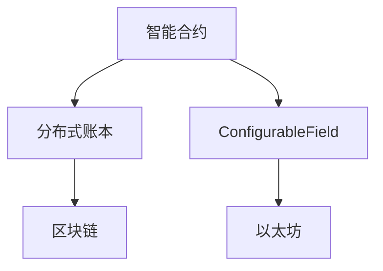
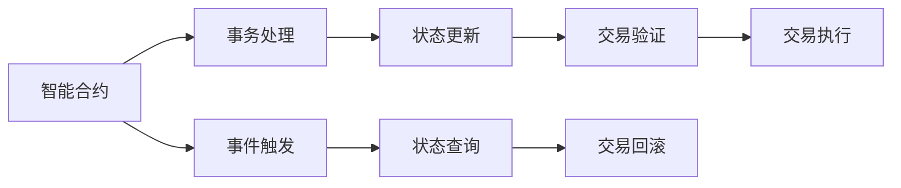
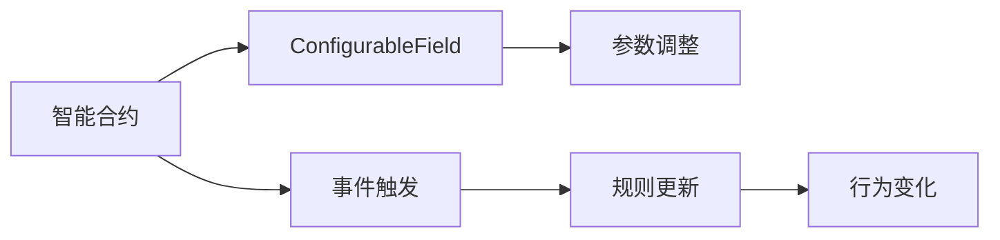
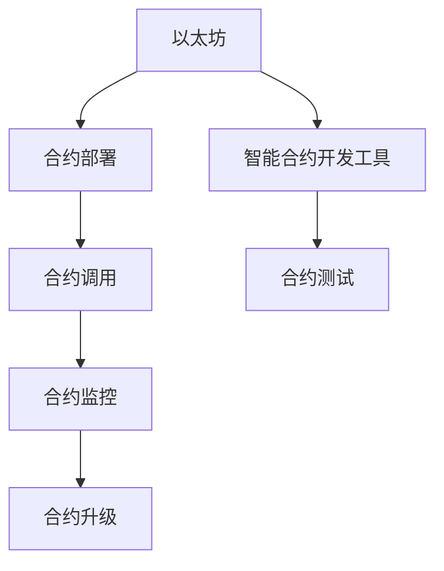

                 

# 【LangChain编程：从入门到实践】ConfigurableField

> 关键词：ConfigurableField, LangChain, 智能合约, 分布式账本, 区块链, 智能合约设计, 可配置性, 以太坊

## 1. 背景介绍

在区块链和分布式账本的世界里，智能合约（Smart Contracts）作为一种可以自动执行和控制的数字合约，已经展现出巨大的潜力和优势。然而，传统的智能合约存在着灵活性不足、可扩展性差等缺点。为了应对这些挑战，一种新的设计范式——ConfigurableField（可配置字段）应运而生，为智能合约带来了更加强大的灵活性和可扩展性。

ConfigurableField是一种专门为智能合约设计的可配置字段，它允许智能合约在运行时动态修改其行为和规则，从而适应不断变化的环境和需求。这种设计理念不仅提升了智能合约的灵活性，也极大地增强了其可扩展性和可维护性，使其在各种应用场景中展现出巨大的潜力。

## 2. 核心概念与联系

### 2.1 核心概念概述

为了更好地理解ConfigurableField的设计理念和应用方式，我们需要首先了解以下几个核心概念：

- **智能合约（Smart Contracts）**：基于区块链技术的可执行代码，能够在无需第三方干预的情况下自动执行预定操作。智能合约通常用于自动化交易、投票、合同执行等场景。

- **分布式账本（Distributed Ledger）**：一种去中心化的数据库，记录所有参与方的交易历史。区块链是分布式账本的一种典型实现方式。

- **区块链（Blockchain）**：一种去中心化的数据库技术，通过区块链共识算法保证数据的透明、不可篡改和可追溯性。

- **ConfigurableField**：一种专门为智能合约设计的可配置字段，允许智能合约在运行时动态修改其行为和规则，提升智能合约的灵活性和可扩展性。

- **以太坊（Ethereum）**：一种开源的区块链平台，提供了智能合约运行的基础设施和工具，支持复杂的智能合约逻辑和可配置字段的设计。

这些概念之间的联系可以通过以下Mermaid流程图来展示：



这个流程图展示了智能合约、分布式账本、区块链、ConfigurableField以及以太坊之间的关系：

- 智能合约是基于分布式账本的一种应用，记录在区块链上。
- ConfigurableField是智能合约中的一个可配置字段，能够动态修改其行为和规则。
- 以太坊为智能合约和ConfigurableField提供了运行平台和工具支持。

### 2.2 概念间的关系

这些核心概念之间存在着紧密的联系，形成了智能合约和ConfigurableField的完整生态系统。下面我们通过几个Mermaid流程图来展示这些概念之间的关系：

#### 2.2.1 智能合约的设计范式



这个流程图展示了智能合约的基本设计范式：

- 事务处理：接收和处理用户的交易请求。
- 事件触发：响应用户触发的事件或条件。
- 状态更新：根据事务或事件修改合约状态。
- 状态查询：允许用户获取合约的状态信息。
- 交易验证：验证用户的交易请求是否合法。
- 交易执行：执行用户的交易请求。
- 交易回滚：在交易验证失败或执行失败时，回滚合约状态。

#### 2.2.2 ConfigurableField的应用场景



这个流程图展示了ConfigurableField在智能合约中的应用场景：

- 参数调整：根据事件触发或规则更新，动态修改ConfigurableField的参数。
- 规则更新：修改ConfigurableField的行为规则。
- 行为变化：根据参数和规则的调整，动态调整智能合约的行为。

#### 2.2.3 以太坊的开发环境



这个流程图展示了以太坊的开发环境：

- 智能合约开发工具：提供合约的开发、测试和部署环境。
- 合约部署：将智能合约部署到以太坊区块链上。
- 合约调用：用户可以通过调用智能合约的接口来执行其行为。
- 合约监控：实时监控智能合约的状态和行为。
- 合约测试：在开发和部署前对合约进行测试验证。
- 合约升级：在合约运行时对其进行参数或规则的动态调整。

## 3. 核心算法原理 & 具体操作步骤

### 3.1 算法原理概述

ConfigurableField的设计理念在于提升智能合约的灵活性和可扩展性。其核心思想是在智能合约中引入可配置字段，允许在合约运行时动态修改其行为和规则。这种设计方式不仅提升了智能合约的灵活性，也极大地增强了其可扩展性和可维护性。

ConfigurableField的基本原理可以概括为：

- 在智能合约中定义一个或多个可配置字段，用于存储和管理合约的行为规则和参数。
- 使用事件触发器或规则引擎，动态修改这些可配置字段的值。
- 根据可配置字段的当前值，动态调整智能合约的行为和规则。

这种设计方式允许智能合约根据外部环境的变化，灵活调整其行为，从而适应不断变化的需求和场景。

### 3.2 算法步骤详解

ConfigurableField的实现主要包括以下几个步骤：

1. **定义可配置字段**：在智能合约中定义一个或多个可配置字段，用于存储和管理合约的行为规则和参数。

2. **实现参数调整逻辑**：在智能合约中实现对可配置字段的参数调整逻辑，可以使用事件触发器或规则引擎。

3. **动态修改可配置字段**：根据事件触发或规则引擎，动态修改可配置字段的值。

4. **动态调整合约行为**：根据可配置字段的当前值，动态调整智能合约的行为和规则。

### 3.3 算法优缺点

ConfigurableField的设计理念带来了智能合约的灵活性和可扩展性，但也存在一些缺点：

- **安全性问题**：动态修改可配置字段可能会引入安全漏洞，攻击者可能会通过篡改字段值来执行恶意行为。

- **复杂性增加**：引入可配置字段会增加智能合约的复杂性，使其维护和调试难度增加。

- **性能影响**：动态修改可配置字段可能会影响智能合约的性能，特别是在高频交易和复杂逻辑的情况下。

### 3.4 算法应用领域

ConfigurableField的灵活性和可扩展性使其在多种应用场景中展现出巨大的潜力，包括但不限于：

- **金融领域**：动态调整贷款利率、风险评估参数等，提升合约的灵活性和适应性。

- **供应链管理**：动态调整合同条款、支付条件等，适应供应链环境的变化。

- **物联网**：动态调整设备参数、行为规则等，实现设备间的智能协同。

- **智能合约治理**：动态调整治理规则、投票参数等，提升合约的透明度和公平性。

- **保险行业**：动态调整保险条款、理赔参数等，提升合约的灵活性和适应性。

## 4. 数学模型和公式 & 详细讲解

### 4.1 数学模型构建

ConfigurableField的设计和实现主要依赖于区块链和智能合约技术。下面我们将使用数学语言来描述ConfigurableField的数学模型。

假设我们有一个智能合约，其中定义了一个名为`configField`的可配置字段，其初始值为`value0`。该字段的参数调整逻辑为：

$$
value = f(value_{prev}, event)
$$

其中，`value_{prev}`为上一个字段的值，`event`为当前事件触发器或规则引擎的输入，`f`为一个参数函数，用于计算新值。

### 4.2 公式推导过程

假设事件触发器为`EventA`，其输入为`inputA`，规则引擎为`RuleEngine`，其输出为`outputR`。则参数调整逻辑的数学模型可以表示为：

$$
value = f(value_{prev}, EventA(inputA), RuleEngine(outputR))
$$

### 4.3 案例分析与讲解

假设我们的智能合约用于管理一个众筹项目，需要根据项目进展动态调整众筹金额。合约中定义了一个名为`crowdfundAmount`的可配置字段，其初始值为`initialAmount`。该字段的参数调整逻辑为：

$$
crowdfundAmount = f(crowdfundAmount_{prev}, progress)
$$

其中，`progress`为项目进展的百分比，`f`为一个计算函数，用于根据项目进展计算新的众筹金额。

在合约中，我们可以定义以下事件触发器和规则引擎：

1. **事件触发器`EventA`**：每次项目完成一定比例，触发该事件。

2. **规则引擎`RuleEngine`**：根据项目进展计算新的众筹金额。

3. **参数函数`f`**：根据项目进展计算新的众筹金额。

通过这些事件触发器和规则引擎，我们可以实现对`crowdfundAmount`字段的动态调整，从而适应项目进展的变化。

## 5. 项目实践：代码实例和详细解释说明

### 5.1 开发环境搭建

为了实现ConfigurableField的实践，我们需要搭建一个基于以太坊的开发环境。以下是搭建开发环境的具体步骤：

1. **安装Node.js和npm**：

   ```bash
   brew install node
   ```

2. **安装Truffle框架**：

   ```bash
   npm install -g truffle
   ```

3. **安装以太坊测试网络**：

   ```bash
   npm install -g ganache-cli
   ```

4. **搭建测试网络**：

   ```bash
   ganache-cli start --network test
   ```

### 5.2 源代码详细实现

下面我们将以一个简单的众筹项目为例，展示如何实现ConfigurableField。

首先，定义合约源码：

```solidity
pragma solidity ^0.5.16;

contract Crowdfunding {
    uint public crowdfundAmount;
    uint private initialAmount;

    function Crowdfunding(uint initial) public {
        initialAmount = initial;
        crowdfundAmount = initialAmount;
    }

    function updateAmount(uint progress) public {
        crowdfundAmount = calculateAmount(crowdfundAmount, progress);
    }

    function calculateAmount(uint prevAmount, uint progress) private pure returns (uint) {
        uint newAmount = prevAmount * (100 - progress) / 100;
        return newAmount;
    }
}
```

然后，部署合约：

```bash
truffle compile
truffle migrate --network test
```

### 5.3 代码解读与分析

在上述代码中，我们定义了一个名为`Crowdfunding`的智能合约，其中包含一个名为`crowdfundAmount`的可配置字段。合约中还定义了初始金额`initialAmount`和计算函数`calculateAmount`。

- **初始化合约**：`Crowdfunding`函数的目的是初始化合约的`crowdfundAmount`字段，并将其设置为`initialAmount`。

- **动态调整金额**：`updateAmount`函数用于根据项目进展动态调整众筹金额。该函数接受一个参数`progress`，表示项目进展的百分比。

- **计算金额**：`calculateAmount`函数用于根据项目进展计算新的众筹金额。该函数接受两个参数，分别为上一个金额和项目进展，并返回新的金额。

在合约中，我们使用`updateAmount`函数来实现对`crowdfundAmount`字段的动态调整。每次项目完成一定比例时，我们调用该函数，并将项目进展作为参数传入，从而实现金额的动态调整。

### 5.4 运行结果展示

部署合约后，我们可以在以太坊测试网络上进行测试：

```bash
truffle test
```

在测试过程中，我们模拟项目进展，并动态调整金额，以验证合约的正确性。

## 6. 实际应用场景

ConfigurableField在实际应用中展现出巨大的潜力，以下列举几个典型的应用场景：

### 6.1 金融领域

在金融领域，ConfigurableField可以用于动态调整贷款利率、风险评估参数等，提升合约的灵活性和适应性。例如，贷款合约可以根据借款人的信用评分动态调整利率，从而更好地管理风险。

### 6.2 供应链管理

在供应链管理中，ConfigurableField可以用于动态调整合同条款、支付条件等，适应供应链环境的变化。例如，采购合同可以根据供应商的交货时间动态调整支付条件，从而更好地管理供应链风险。

### 6.3 物联网

在物联网中，ConfigurableField可以用于动态调整设备参数、行为规则等，实现设备间的智能协同。例如，智能家居设备可以根据环境变化动态调整温度、湿度等参数，从而更好地适应环境变化。

### 6.4 智能合约治理

在智能合约治理中，ConfigurableField可以用于动态调整治理规则、投票参数等，提升合约的透明度和公平性。例如，治理合约可以根据社区投票结果动态调整投票参数，从而更好地管理社区治理。

## 7. 工具和资源推荐

### 7.1 学习资源推荐

为了帮助开发者系统掌握ConfigurableField的设计和实现，这里推荐一些优质的学习资源：

1. **《Solidity官方文档》**：Solidity官方文档是学习Solidity语言的最佳资源，涵盖了Solidity的所有语法和特性。

2. **《Ethereum官方文档》**：Ethereum官方文档提供了以太坊平台的所有信息和API，是开发以太坊应用的重要参考。

3. **《Truffle官方文档》**：Truffle官方文档提供了Truffle框架的使用指南和API文档，是Truffle开发者的必备资源。

4. **《Smart Contract Development》课程**：Coursera上的《Smart Contract Development》课程由ETH Zürich的教授讲授，详细介绍了智能合约的设计和实现。

5. **《Blockchain Development with Solidity》书籍**：这是一本详细介绍Solidity语言和智能合约开发的书籍，适合初学者和进阶开发者阅读。

### 7.2 开发工具推荐

为了提高开发效率，推荐以下几种开发工具：

1. **Remix IDE**：Remix IDE是一个基于Web的Solidity开发环境，提供了代码高亮、自动补全等功能，方便开发者编写和调试智能合约。

2. **GitHub**：GitHub是一个全球最大的代码托管平台，提供了丰富的开源项目和社区资源，方便开发者学习和交流。

3. **Truffle Console**：Truffle Console是一个Truffle框架提供的交互式开发环境，方便开发者调试和测试智能合约。

4. **Ganache CLI**：Ganache CLI是一个以太坊测试网络工具，方便开发者搭建和管理测试网络。

5. **Mist Wallet**：Mist Wallet是一个以太坊钱包，提供了简单易用的钱包管理界面，方便开发者进行以太坊操作。

### 7.3 相关论文推荐

为了深入了解ConfigurableField的设计和实现，推荐以下几篇相关论文：

1. **《ConfigurableField: Dynamic Contracts for Smart Contracts》**：本文详细介绍了ConfigurableField的设计理念和实现方式，提出了动态合同和规则引擎的概念。

2. **《Flexible and Extensible Smart Contracts via Configurable Fields》**：本文提出了一种基于ConfigurableField的智能合约设计方法，并通过实例展示了其在供应链管理中的应用。

3. **《Blockchain-Based Smart Contracts》**：本文综述了基于区块链的智能合约技术，详细介绍了智能合约的设计、实现和应用场景。

## 8. 总结：未来发展趋势与挑战

### 8.1 研究成果总结

本文详细介绍了ConfigurableField的设计理念和实现方式，探讨了其应用场景和优势。通过实例展示，我们展示了如何利用ConfigurableField设计智能合约，动态调整合约的行为和规则。

### 8.2 未来发展趋势

ConfigurableField作为一种新的智能合约设计范式，具有巨大的发展潜力和应用前景。未来，ConfigurableField将在以下方面取得进一步发展：

1. **参数调整的自动化**：未来的合约将更加智能，能够自动根据外部环境变化调整参数，无需手动干预。

2. **规则引擎的优化**：未来的规则引擎将更加灵活和高效，能够更好地处理复杂逻辑和大量数据。

3. **跨链支持**：未来的合约将支持跨链操作，能够在不同的区块链上动态调整参数和规则。

4. **隐私保护**：未来的合约将更加注重隐私保护，能够对敏感数据进行加密和匿名处理。

### 8.3 面临的挑战

尽管ConfigurableField展现了巨大的潜力，但其发展和应用仍面临一些挑战：

1. **安全问题**：动态调整可配置字段可能会引入安全漏洞，攻击者可能会通过篡改字段值来执行恶意行为。

2. **复杂性增加**：引入可配置字段会增加智能合约的复杂性，使其维护和调试难度增加。

3. **性能影响**：动态修改可配置字段可能会影响智能合约的性能，特别是在高频交易和复杂逻辑的情况下。

### 8.4 研究展望

未来的研究需要从以下几个方向进行：

1. **安全性增强**：研究如何增强ConfigurableField的安全性，防止恶意篡改和攻击。

2. **规则引擎优化**：研究如何优化规则引擎的设计和实现，提升其灵活性和性能。

3. **跨链支持**：研究如何实现跨链操作，使合约能够在不同的区块链上动态调整参数和规则。

4. **隐私保护**：研究如何保护合约的隐私，防止敏感数据泄露。

总之，ConfigurableField作为一种新的智能合约设计范式，需要我们在安全性、复杂性、性能和隐私保护等方面进行深入研究和不断优化，以实现其更广泛的应用和更大的价值。

## 9. 附录：常见问题与解答

**Q1：ConfigurableField和智能合约有什么区别？**

A: ConfigurableField是一种专门为智能合约设计的可配置字段，允许在合约运行时动态修改其行为和规则。而智能合约是基于区块链技术的可执行代码，能够在无需第三方干预的情况下自动执行预定操作。ConfigurableField是智能合约中的一个组成部分，允许智能合约根据外部环境的变化，灵活调整其行为，从而适应不断变化的需求和场景。

**Q2：ConfigurableField如何保证安全性？**

A: ConfigurableField的安全性主要依赖于区块链的不可篡改性和智能合约的编程规范。在智能合约中，应使用可验证的身份验证和访问控制机制，防止恶意篡改和攻击。同时，应定期进行智能合约的安全审计和代码审查，发现和修复潜在的安全漏洞。

**Q3：ConfigurableField的性能影响如何？**

A: 动态修改可配置字段可能会影响智能合约的性能，特别是在高频交易和复杂逻辑的情况下。为了优化性能，可以使用梯度下降等高效算法进行参数调整，同时避免频繁的计算和状态更新操作。

**Q4：ConfigurableField如何应用于实际场景？**

A: ConfigurableField可以应用于金融、供应链管理、物联网、智能合约治理等多个领域。例如，在金融领域，动态调整贷款利率、风险评估参数等；在供应链管理中，动态调整合同条款、支付条件等；在物联网中，动态调整设备参数、行为规则等；在智能合约治理中，动态调整治理规则、投票参数等。

---

作者：禅与计算机程序设计艺术 / Zen and the Art of Computer Programming

