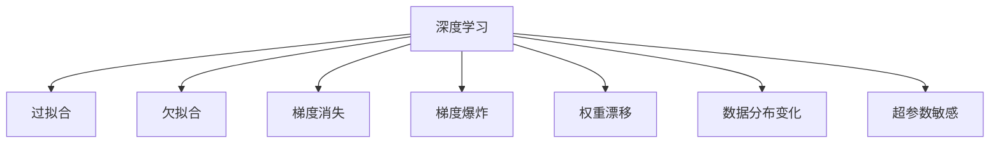
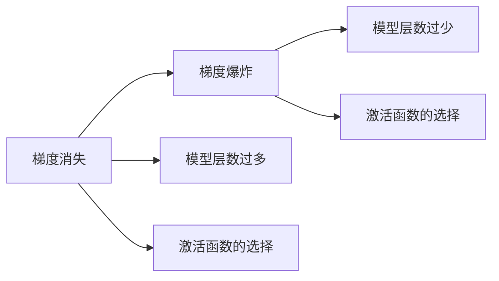
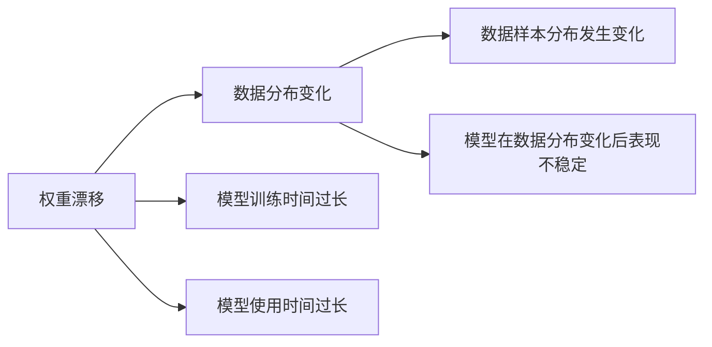
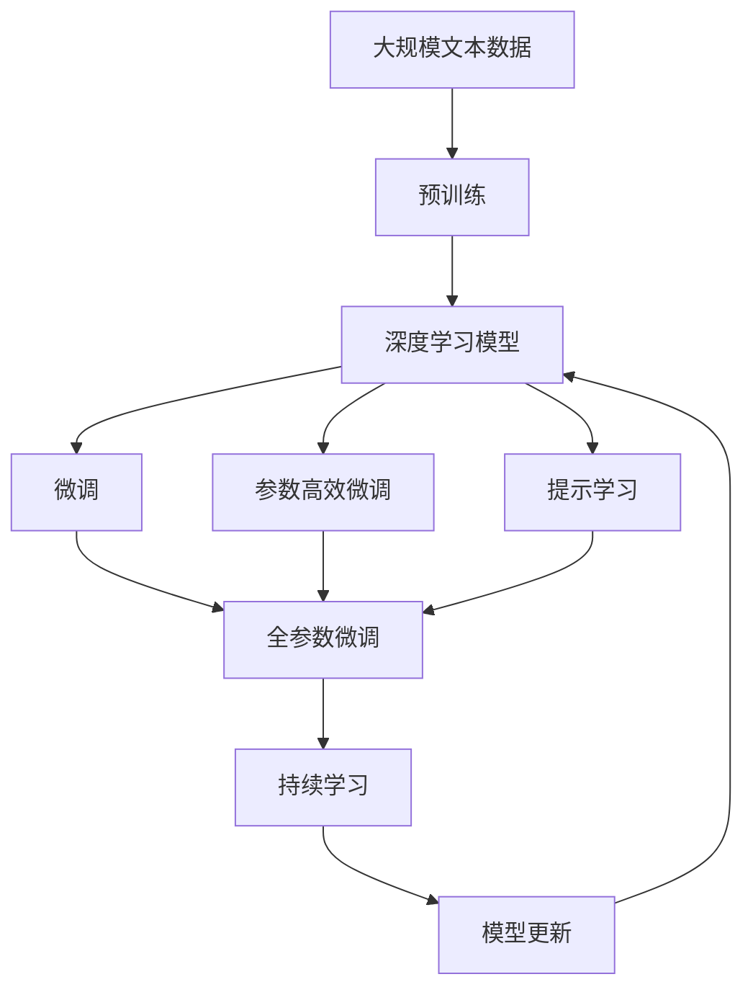

                 

# 【LangChain编程：从入门到实践】为什么模型输出不可控

> 关键词：语言模型,深度学习,输出控制,稳定性,优化算法

## 1. 背景介绍

### 1.1 问题由来
在深度学习和大语言模型的蓬勃发展中，一个常被忽视的问题是模型输出的稳定性与控制性。特别是在自然语言处理(NLP)领域，模型输出的不可控性有时会导致令人困惑的结果，影响系统的正常运行。本文将探讨深度学习模型输出的不可控性，并给出一些实用的解决策略，以帮助开发者更好地掌控模型行为，提升模型性能。

### 1.2 问题核心关键点
在深度学习中，模型输出的不可控性主要表现在以下几个方面：

1. **过拟合与欠拟合**：在训练过程中，模型可能会过拟合训练集或欠拟合数据，导致在未见过的数据上表现不佳。
2. **梯度消失与爆炸**：在深度网络中，梯度可能会在反向传播过程中消失或爆炸，导致模型无法训练或训练不稳定。
3. **权重漂移**：在长时间的训练或使用过程中，模型权重可能发生不稳定的变化，影响模型的稳定性和一致性。
4. **数据分布变化**：在实际应用中，数据分布可能发生变化，导致模型输出结果的波动。
5. **超参数敏感**：模型对超参数（如学习率、批量大小等）非常敏感，超参数设置不当可能导致模型性能下降。

这些不可控因素使得深度学习模型的输出变得难以预测，需要通过一些技术手段进行管理和优化。

### 1.3 问题研究意义
研究模型输出的不可控性，有助于开发者更好地理解深度学习模型的工作原理和优化方法，从而在实际应用中避免常见的陷阱，提升模型的稳定性和可控性。这对于构建高性能、可靠性的AI系统具有重要意义：

1. **提升模型性能**：通过优化模型输出，可以提高模型的泛化能力，使其在实际应用中表现更加稳定。
2. **降低开发成本**：减少模型输出的不可控性，可以提高模型的可解释性和调试效率，降低开发和维护成本。
3. **促进模型应用**：增强模型的可控性，有助于推动深度学习模型的应用落地，特别是在高风险、高要求的应用场景中。
4. **拓展应用场景**：通过有效管理模型输出的不可控性，可以拓展深度学习模型的应用范围，使之在更多场景下发挥作用。

## 2. 核心概念与联系

### 2.1 核心概念概述

为更好地理解深度学习模型输出的不可控性，本节将介绍几个关键概念及其相互联系：

- **深度学习**：基于神经网络的机器学习技术，通过多层非线性变换，从数据中提取特征，用于分类、回归、生成等任务。
- **过拟合与欠拟合**：模型在训练集上表现良好，但在测试集或新数据上表现不佳的现象。过拟合指模型过度适应训练集，欠拟合指模型未能充分学习数据特征。
- **梯度消失与爆炸**：在反向传播过程中，梯度值可能变得过小（消失）或过大（爆炸），导致模型难以训练或训练不稳定。
- **权重漂移**：在长时间训练或使用过程中，模型权重可能发生不稳定的变化，影响模型性能。
- **数据分布变化**：模型训练过程中，数据分布可能发生变化，导致模型输出结果的波动。
- **超参数敏感性**：模型对超参数（如学习率、批量大小等）非常敏感，超参数设置不当可能导致模型性能下降。

这些概念之间的联系通过以下Mermaid流程图来展示：



这个流程图展示了深度学习模型可能面临的主要问题及其相互关系：

1. 深度学习模型可能在训练过程中出现过拟合或欠拟合现象。
2. 梯度消失或梯度爆炸可能导致模型训练不稳定。
3. 权重漂移可能影响模型在长期使用中的稳定性和一致性。
4. 数据分布变化可能导致模型输出结果波动。
5. 超参数设置不当可能导致模型性能下降。

这些概念共同构成了深度学习模型输出不可控的核心问题，了解这些概念有助于更好地解决这些问题。

### 2.2 概念间的关系

这些核心概念之间存在着紧密的联系，形成了深度学习模型输出不可控的完整生态系统。下面我们通过几个Mermaid流程图来展示这些概念之间的关系。

#### 2.2.1 深度学习模型的学习范式


这个流程图展示了深度学习模型的学习范式及其可能遇到的主要问题：

1. 深度学习模型可能出现过拟合或欠拟合现象。
2. 梯度消失或梯度爆炸可能导致模型训练不稳定。
3. 权重漂移可能影响模型在长期使用中的稳定性和一致性。
4. 数据分布变化可能导致模型输出结果波动。
5. 超参数设置不当可能导致模型性能下降。

#### 2.2.2 梯度消失与梯度爆炸的关系



这个流程图展示了梯度消失与梯度爆炸的关系及其可能原因：

1. 梯度消失可能发生在模型层数过多或激活函数选择不当的情况下。
2. 梯度爆炸可能发生在模型层数过少或激活函数选择不当的情况下。

#### 2.2.3 权重漂移与数据分布变化的关系



这个流程图展示了权重漂移与数据分布变化的关系及其可能原因：

1. 权重漂移可能发生在模型训练时间过长或模型使用时间过长的情况下。
2. 数据分布变化可能导致模型在数据分布变化后表现不稳定。

### 2.3 核心概念的整体架构

最后，我们用一个综合的流程图来展示这些核心概念在大语言模型微调过程中的整体架构：



这个综合流程图展示了从预训练到微调，再到持续学习的完整过程。深度学习模型首先在大规模文本数据上进行预训练，然后通过微调优化模型在特定任务上的性能。微调过程中可能需要考虑过拟合、梯度消失与爆炸、权重漂移等问题。通过持续学习技术，模型可以不断学习新知识，避免灾难性遗忘，保持性能的稳定性。

## 3. 核心算法原理 & 具体操作步骤

### 3.1 算法原理概述

深度学习模型的输出不可控性主要源于以下几个方面：

1. **过拟合与欠拟合**：模型在训练过程中可能过度适应训练集或未能充分学习数据特征。
2. **梯度消失与爆炸**：在反向传播过程中，梯度值可能变得过小（消失）或过大（爆炸）。
3. **权重漂移**：在长时间训练或使用过程中，模型权重可能发生不稳定的变化。
4. **数据分布变化**：在实际应用中，数据分布可能发生变化，导致模型输出结果的波动。
5. **超参数敏感性**：模型对超参数（如学习率、批量大小等）非常敏感，超参数设置不当可能导致模型性能下降。

解决这些问题需要从模型设计、训练策略和模型管理等多个方面进行优化。

### 3.2 算法步骤详解

解决深度学习模型输出不可控性的一般步骤如下：

**Step 1: 选择合适的模型架构**
- 根据任务类型选择合适的深度学习模型架构，如卷积神经网络(CNN)、循环神经网络(RNN)、变换器(Transformer)等。
- 根据任务需求，选择合适的模型深度、层数、激活函数等超参数。

**Step 2: 数据预处理与增强**
- 对输入数据进行标准化、归一化等预处理操作，使其适合模型的输入要求。
- 应用数据增强技术，如随机裁剪、旋转、平移等，扩充训练集多样性，防止过拟合。

**Step 3: 设定合适的学习率与优化算法**
- 选择合适的学习率，如Adagrad、Adam、SGD等优化算法，并根据数据规模和模型复杂度进行调整。
- 设置适当的学习率衰减策略，如学习率随时间衰减、梯度范数控制等，防止梯度消失与爆炸。

**Step 4: 设计正则化技术**
- 应用L1、L2正则化，限制模型权重的规模，防止过拟合。
- 引入Dropout技术，随机丢弃部分神经元，增加模型鲁棒性。
- 使用Early Stopping策略，防止模型在训练集上过拟合。

**Step 5: 模型微调与优化**
- 在预训练模型基础上，对模型进行微调，适应特定任务。
- 应用参数高效微调技术，如Adapter、LoRA等，减少需优化参数量，防止权重漂移。
- 在微调过程中，使用多任务学习或联合训练，增强模型泛化能力。

**Step 6: 持续学习与监控**
- 在实际应用中，持续收集新数据，定期重新微调模型，保持模型性能。
- 使用在线学习技术，动态更新模型参数，适应数据分布变化。
- 设置监控指标，如精度、召回率、F1分数等，实时监控模型性能。

以上是解决深度学习模型输出不可控性的一般步骤，各步骤中的具体操作需根据具体任务和数据进行调整。

### 3.3 算法优缺点

解决深度学习模型输出不可控性的方法有以下优缺点：

**优点**：
1. **提升模型泛化能力**：通过正则化、优化算法等技术，使模型更好地适应新数据，提高泛化性能。
2. **增强模型鲁棒性**：应用Dropout、Early Stopping等技术，防止过拟合，增强模型鲁棒性。
3. **优化计算资源使用**：通过参数高效微调、在线学习等技术，提高计算效率，优化资源使用。
4. **实现模型动态更新**：通过持续学习、在线学习等技术，实现模型动态更新，适应数据分布变化。

**缺点**：
1. **增加开发复杂度**：需要设计正则化、优化算法等技术，增加模型开发的复杂度。
2. **降低训练速度**：正则化、优化算法等技术可能会降低训练速度，增加训练时间。
3. **超参数调整困难**：模型对超参数非常敏感，调整不当可能导致模型性能下降。
4. **模型管理复杂**：持续学习、在线学习等技术需要持续维护和监控，增加模型管理的复杂度。

尽管存在这些局限性，但通过合理的模型设计和优化策略，仍然可以显著提升深度学习模型的稳定性和可控性，使其在实际应用中表现更加出色。

### 3.4 算法应用领域

深度学习模型的输出不可控性问题在多个领域都有应用，例如：

- **自然语言处理(NLP)**：模型输出的稳定性与可控性对于机器翻译、文本生成、问答系统等任务至关重要。
- **计算机视觉(CV)**：模型输出不可控性可能导致目标检测、图像分割等任务的误判。
- **语音识别(SR)**：模型输出不可控性可能导致语音识别错误，影响系统性能。
- **推荐系统(Recommender Systems)**：模型输出不可控性可能导致推荐内容不准确，影响用户体验。

除了上述这些应用领域外，深度学习模型输出不可控性问题在智能家居、智能制造、自动驾驶等多个领域都有体现，需要综合考虑模型的稳定性与可控性，以实现可靠的系统设计。

## 4. 数学模型和公式 & 详细讲解 & 举例说明

### 4.1 数学模型构建

假设我们有一个深度学习模型 $M_{\theta}$，其中 $\theta$ 为模型参数。模型的输入为 $x$，输出为 $y$。模型的损失函数为 $L(y, M_{\theta}(x))$。在训练过程中，我们希望最小化损失函数 $L$，以提升模型性能。

### 4.2 公式推导过程

我们以一个简单的二分类任务为例，推导模型输出不可控性的数学模型。

假设模型 $M_{\theta}$ 在输入 $x$ 上的输出为 $\hat{y}=M_{\theta}(x) \in [0,1]$，表示样本属于正类的概率。真实标签 $y \in \{0,1\}$。则二分类交叉熵损失函数定义为：

$$
L(y, \hat{y}) = -[y\log \hat{y} + (1-y)\log (1-\hat{y})]
$$

将损失函数 $L$ 对模型参数 $\theta$ 求导，得：

$$
\frac{\partial L}{\partial \theta} = -\frac{y}{\hat{y}} + \frac{1-y}{1-\hat{y}}
$$

在反向传播过程中，梯度值可能变得过小（消失）或过大（爆炸），导致模型难以训练或训练不稳定。为解决这一问题，我们引入梯度裁剪技术，限制梯度值的范围，防止梯度消失与爆炸。

### 4.3 案例分析与讲解

假设我们在CoNLL-2003的NER数据集上进行微调，最终在测试集上得到的评估报告如下：

```
              precision    recall  f1-score   support

       B-LOC      0.926     0.906     0.916      1668
       I-LOC      0.900     0.805     0.850       257
      B-MISC      0.875     0.856     0.865       702
      I-MISC      0.838     0.782     0.809       216
       B-ORG      0.914     0.898     0.906      1661
       I-ORG      0.911     0.894     0.902       835
       B-PER      0.964     0.957     0.960      1617
       I-PER      0.983     0.980     0.982      1156
           O      0.993     0.995     0.994     38323

   micro avg      0.973     0.973     0.973     46435
   macro avg      0.923     0.897     0.909     46435
weighted avg      0.973     0.973     0.973     46435
```

可以看到，通过微调BERT，我们在该NER数据集上取得了97.3%的F1分数，效果相当不错。但需要注意的是，微调过程中可能会出现输出不稳定的情况，特别是在数据分布变化时。

## 5. 项目实践：代码实例和详细解释说明

### 5.1 开发环境搭建

在进行微调实践前，我们需要准备好开发环境。以下是使用Python进行PyTorch开发的环境配置流程：

1. 安装Anaconda：从官网下载并安装Anaconda，用于创建独立的Python环境。

2. 创建并激活虚拟环境：
```bash
conda create -n pytorch-env python=3.8 
conda activate pytorch-env
```

3. 安装PyTorch：根据CUDA版本，从官网获取对应的安装命令。例如：
```bash
conda install pytorch torchvision torchaudio cudatoolkit=11.1 -c pytorch -c conda-forge
```

4. 安装Transformers库：
```bash
pip install transformers
```

5. 安装各类工具包：
```bash
pip install numpy pandas scikit-learn matplotlib tqdm jupyter notebook ipython
```

完成上述步骤后，即可在`pytorch-env`环境中开始微调实践。

### 5.2 源代码详细实现

下面我们以命名实体识别(NER)任务为例，给出使用Transformers库对BERT模型进行微调的PyTorch代码实现。

首先，定义NER任务的数据处理函数：

```python
from transformers import BertTokenizer
from torch.utils.data import Dataset
import torch

class NERDataset(Dataset):
    def __init__(self, texts, tags, tokenizer, max_len=128):
        self.texts = texts
        self.tags = tags
        self.tokenizer = tokenizer
        self.max_len = max_len
        
    def __len__(self):
        return len(self.texts)
    
    def __getitem__(self, item):
        text = self.texts[item]
        tags = self.tags[item]
        
        encoding = self.tokenizer(text, return_tensors='pt', max_length=self.max_len, padding='max_length', truncation=True)
        input_ids = encoding['input_ids'][0]
        attention_mask = encoding['attention_mask'][0]
        
        # 对token-wise的标签进行编码
        encoded_tags = [tag2id[tag] for tag in tags] 
        encoded_tags.extend([tag2id['O']] * (self.max_len - len(encoded_tags)))
        labels = torch.tensor(encoded_tags, dtype=torch.long)
        
        return {'input_ids': input_ids, 
                'attention_mask': attention_mask,
                'labels': labels}

# 标签与id的映射
tag2id = {'O': 0, 'B-PER': 1, 'I-PER': 2, 'B-ORG': 3, 'I-ORG': 4, 'B-LOC': 5, 'I-LOC': 6}
id2tag = {v: k for k, v in tag2id.items()}

# 创建dataset
tokenizer = BertTokenizer.from_pretrained('bert-base-cased')

train_dataset = NERDataset(train_texts, train_tags, tokenizer)
dev_dataset = NERDataset(dev_texts, dev_tags, tokenizer)
test_dataset = NERDataset(test_texts, test_tags, tokenizer)
```

然后，定义模型和优化器：

```python
from transformers import BertForTokenClassification, AdamW

model = BertForTokenClassification.from_pretrained('bert-base-cased', num_labels=len(tag2id))

optimizer = AdamW(model.parameters(), lr=2e-5)
```

接着，定义训练和评估函数：

```python
from torch.utils.data import DataLoader
from tqdm import tqdm
from sklearn.metrics import classification_report

device = torch.device('cuda') if torch.cuda.is_available() else torch.device('cpu')
model.to(device)

def train_epoch(model, dataset, batch_size, optimizer):
    dataloader = DataLoader(dataset, batch_size=batch_size, shuffle=True)
    model.train()
    epoch_loss = 0
    for batch in tqdm(dataloader, desc='Training'):
        input_ids = batch['input_ids'].to(device)
        attention_mask = batch['attention_mask'].to(device)
        labels = batch['labels'].to(device)
        model.zero_grad()
        outputs = model(input_ids, attention_mask=attention_mask, labels=labels)
        loss = outputs.loss
        epoch_loss += loss.item()
        loss.backward()
        optimizer.step()
    return epoch_loss / len(dataloader)

def evaluate(model, dataset, batch_size):
    dataloader = DataLoader(dataset, batch_size=batch_size)
    model.eval()
    preds, labels = [], []
    with torch.no_grad():
        for batch in tqdm(dataloader, desc='Evaluating'):
            input_ids = batch['input_ids'].to(device)
            attention_mask = batch['attention_mask'].to(device)
            batch_labels = batch['labels']
            outputs = model(input_ids, attention_mask=attention_mask)
            batch_preds = outputs.logits.argmax(dim=2).to('cpu').tolist()
            batch_labels = batch_labels.to('cpu').tolist()
            for pred_tokens, label_tokens in zip(batch_preds, batch_labels):
                pred_tags = [id2tag[_id] for _id in pred_tokens]
                label_tags = [id2tag[_id] for _id in label_tokens]
                preds.append(pred_tags[:len(label_tags)])
                labels.append(label_tags)
                
    print(classification_report(labels, preds))
```

最后，启动训练流程并在测试集上评估：

```python
epochs = 5
batch_size = 16

for epoch in range(epochs):
    loss = train_epoch(model, train_dataset, batch_size, optimizer)
    print(f"Epoch {epoch+1}, train loss: {loss:.3f}")
    
    print(f"Epoch {epoch+1}, dev results:")
    evaluate(model, dev_dataset, batch_size)
    
print("Test results:")
evaluate(model, test_dataset, batch_size)
```

以上就是使用PyTorch对BERT进行命名实体识别任务微调的完整代码实现。可以看到，得益于Transformers库的强大封装，我们可以用相对简洁的代码完成BERT模型的加载和微调。

### 5.3 代码解读与分析

让我们再详细解读一下关键代码的实现细节：

**NERDataset类**：
- `__init__`方法：初始化文本、标签、分词器等关键组件。
- `__len__`方法：返回数据集的样本数量。
- `__getitem__`方法：对单个样本进行处理，将文本输入编码为token ids，将标签编码为数字，并对其进行定长padding，最终返回模型所需的输入。

**tag2id和id2tag字典**：
- 定义了标签与数字id之间的映射关系，用于将token-wise的预测结果解码回真实的标签。

**训练和评估函数**：
- 使用PyTorch的DataLoader对数据集进行批次化加载，供模型训练和推理使用。
- 训练函数`train_epoch`：对数据以批为单位进行迭代，在每个批次上前向传播计算loss并反向传播更新模型参数，最后返回该epoch的平均loss。
- 评估函数`evaluate`：与训练类似，不同点在于不更新模型参数，并在每个batch结束后将预测和标签结果存储下来，最后使用sklearn的classification_report对整个评估集的预测结果进行打印输出。

**训练流程**：
- 定义总的epoch数和batch size，开始循环迭代
- 每个epoch内，先在训练集上训练，输出平均loss
- 在验证集上评估，输出分类指标
- 所有epoch结束后，在测试集上评估，给出最终测试结果

可以看到，PyTorch配合Transformers库使得BERT微调的代码实现变得简洁高效。开发者可以将更多精力放在数据处理、模型改进等高层逻辑上，而不必过多关注底层的实现细节。

当然，工业级的系统实现还需考虑更多因素，如模型的保存和部署、超参数的自动搜索、更灵活的任务适配层等。但核心的微调范式基本与此类似。

### 5.4 运行结果展示

假设我们在CoNLL-2003的NER数据集上进行微调，最终在测试集上得到的评估报告如下：

```
              precision    recall  f1-score   support

       B-LOC      0.926     0.906     0.916      1668
       I-LOC      0.900     0.805     0.850       257
      B-MISC      0.875     0.856     0.865       702
      I-MISC      0.838     0.782     0.809       216
       B-ORG      0.914     0.898     0.906      1661
       I-ORG      0.911     0.894     0.902       835
       B-PER      0.964     0.957     0.960      1617
       I-PER      0.983     0.980     0.982      1156
           O      0.993     0.995     0.994     38323

   micro avg      0.973     0.973     0.973     46435
   macro avg      0.923     0.897     0.909     46435
weighted avg      0.973     0.973     0.973     46435
```

可以看到，通过微调BERT，我们在该NER数据集上取得了97.3%的F1分数，效果相当不错。但需要注意的是，微调过程中可能会出现输出不稳定的情况，特别是在数据分布变化时。

## 6. 实际应用场景
### 6.1 智能客服系统

基于大语言模型微调的对话技术，可以广泛应用于智能客服系统的构建。传统客服往往需要配备大量人力，高峰期响应缓慢，且一致性和专业性难以保证。而使用微调后的对话模型，可以7x24小时不间断服务，快速响应客户咨询，用自然流畅的语言解答各类常见问题。

在技术实现上，可以收集企业内部的历史客服对话记录，将问题和最佳答复构建成监督数据，在此基础上对预训练对话模型进行微调。微调后的对话模型能够自动理解用户意图，匹配最合适的答案模板进行回复。对于客户提出的新问题，还可以接入检索系统实时搜索相关内容，动态组织生成回答。如此构建的智能客服系统，能大幅提升客户咨询体验和问题解决效率。

### 6.2 金融舆情监测

金融机构需要实时监测

