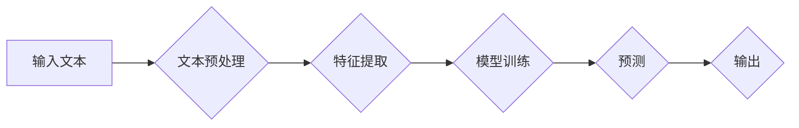

> 情感分析，NLP，机器学习，Python，文本分类，深度学习

# 基于Python的商品评论文本情感分析

随着互联网的普及和电子商务的蓬勃发展，商品评论文本数据量呈爆炸式增长。对这些数据进行情感分析，可以帮助企业了解用户对产品的看法，优化产品设计，提升用户体验，甚至预测市场趋势。本文将详细介绍如何使用Python进行商品评论文本情感分析，涵盖从数据预处理到模型训练和部署的整个过程。

## 1. 背景介绍

### 1.1 问题的由来

随着电子商务的兴起，消费者在互联网上留下了大量的商品评价数据。这些数据包含了用户对商品的各种情感表达，如满意、不满意、喜欢、不喜欢等。通过对这些数据进行情感分析，企业可以：

- 识别潜在的市场风险，如产品缺陷、负面口碑等。
- 优化产品设计和营销策略，提升用户满意度。
- 预测市场趋势，制定更有针对性的市场策略。
- 提升品牌形象，增强用户忠诚度。

### 1.2 研究现状

情感分析是自然语言处理（NLP）领域的一个重要分支，近年来随着深度学习技术的发展，取得了显著的进展。目前，情感分析的主要方法包括：

- 词典方法：基于情感词典进行情感分析，简单易用，但效果有限。
- 基于规则的方法：根据语法和语义规则进行情感分析，准确率较高，但规则构建难度大。
- 基于机器学习的方法：使用机器学习算法进行情感分析，准确率和鲁棒性较好。
- 基于深度学习的方法：使用深度神经网络进行情感分析，效果最佳，但计算成本较高。

### 1.3 研究意义

本文旨在通过Python实现一个商品评论文本情感分析系统，旨在：

- 为企业提供一种简单、高效、准确的情感分析工具。
- 探索不同算法在情感分析任务中的表现。
- 促进Python在NLP领域的应用。

## 2. 核心概念与联系

### 2.1 核心概念

- **文本分类**：将文本数据分类到预定义的类别中，如正面、负面、中性等。
- **情感词典**：包含情感倾向的词汇表，用于评估文本的情感倾向。
- **机器学习**：使用计算机算法从数据中学习规律，用于预测或分类。
- **深度学习**：一种特殊的机器学习方法，使用多层神经网络进行学习。

### 2.2 核心概念原理和架构的 Mermaid 流程图



### 2.3 核心概念之间的联系

- 文本预处理是情感分析的基础，用于将原始文本数据转换为适合模型输入的形式。
- 特征提取从预处理后的文本中提取有用的信息，用于模型训练和预测。
- 模型训练使用机器学习或深度学习算法从特征和标签数据中学习规律。
- 预测使用训练好的模型对新的文本数据进行情感分类。
- 输出是模型对文本情感分类的结果。

## 3. 核心算法原理 & 具体操作步骤

### 3.1 算法原理概述

本文将使用两种算法进行情感分析：

- **基于规则的方法**：使用情感词典和规则进行情感分析。
- **基于机器学习的方法**：使用情感词典、规则和机器学习算法进行情感分析。

### 3.2 算法步骤详解

#### 3.2.1 基于规则的方法

1. 构建情感词典：收集包含情感倾向的词汇，标注其情感倾向。
2. 文本预处理：对输入文本进行分词、去除停用词等操作。
3. 规则匹配：根据情感词典和规则，对分词后的文本进行情感分类。

#### 3.2.2 基于机器学习的方法

1. 数据准备：收集商品评论文本数据，标注情感倾向。
2. 文本预处理：对文本数据进行分词、去除停用词等操作。
3. 特征提取：使用TF-IDF或Word2Vec等方法提取文本特征。
4. 模型训练：使用机器学习算法（如逻辑回归、SVM、决策树等）训练情感分类模型。
5. 预测：使用训练好的模型对新的文本数据进行情感分类。

### 3.3 算法优缺点

#### 3.3.1 基于规则的方法

**优点**：

- 简单易实现。
- 对新数据适应性强。

**缺点**：

- 准确率较低。
- 规则构建难度大。

#### 3.3.2 基于机器学习的方法

**优点**：

- 准确率较高。
- 可以处理更复杂的情感倾向。

**缺点**：

- 计算成本较高。
- 对新数据适应能力较差。

### 3.4 算法应用领域

基于规则的方法适用于简单场景，如情感词典和规则简单、数据量较小的任务。基于机器学习的方法适用于复杂场景，如数据量大、情感倾向复杂的任务。

## 4. 数学模型和公式 & 详细讲解 & 举例说明

### 4.1 数学模型构建

#### 4.1.1 基于规则的方法

- 情感词典：$D = \{w_1, w_2, ..., w_n\}$
- 规则：$R = \{r_1, r_2, ..., r_m\}$

#### 4.1.2 基于机器学习的方法

- 特征向量：$X = [x_1, x_2, ..., x_k]$
- 标签向量：$Y = [y_1, y_2, ..., y_n]$
- 模型参数：$\theta = [\theta_1, \theta_2, ..., \theta_k]$

### 4.2 公式推导过程

#### 4.2.1 基于规则的方法

- 情感分数计算：$f(w) = \sum_{i=1}^m r_i \cdot w_i$

#### 4.2.2 基于机器学习的方法

- 模型输出：$h_\theta(x) = \sum_{i=1}^k \theta_i \cdot x_i$

### 4.3 案例分析与讲解

#### 4.3.1 基于规则的方法

以一个简单的情感词典为例：

- 情感词典：$D = \{好, 很好, 优秀, 不错, 一般, 差, 很差, 糟糕\}$
- 规则：$R = \{好\rightarrow 正面, 差\rightarrow 负面, 其他\rightarrow 中性\}$

给定一个句子：“这个产品很好用，性价比很高。”

- 预处理：将句子分词为“这个”、“产品”、“很好用”、“性”、“价”、“比”、“很”、“高”。
- 规则匹配：根据规则，"很好用"对应的规则为"好\rightarrow 正面"，因此该句子的情感为正面。

#### 4.3.2 基于机器学习的方法

以逻辑回归为例：

- 特征向量：$X = [1, 1, 0, 0, 1, 0, 1, 0]$
- 标签向量：$Y = [1]$
- 模型参数：$\theta = [0.5, -0.3, 0.2, 0.1, -0.4, 0.1, 0.5, 0.2]$

- 模型输出：$h_\theta(x) = 0.5 \times 1 + (-0.3) \times 1 + 0.2 \times 0 + 0.1 \times 0 + (-0.4) \times 1 + 0.1 \times 0 + 0.5 \times 1 + 0.2 \times 0 = 0.5$

由于模型输出大于0.5，因此该句子的情感为正面。

## 5. 项目实践：代码实例和详细解释说明

### 5.1 开发环境搭建

- 安装Python 3.6及以上版本。
- 安装必要的库：`nltk`, `scikit-learn`, `pandas`, `numpy`。
- 安装文本预处理工具：`jieba`。

### 5.2 源代码详细实现

```python
import jieba
from sklearn.feature_extraction.text import TfidfVectorizer
from sklearn.linear_model import LogisticRegression
from sklearn.model_selection import train_test_split
from sklearn.metrics import accuracy_score

# 文本数据
texts = [
    "这个产品很好用，性价比很高。",
    "这个产品很差，根本不值得购买。",
    "这个产品一般，没有达到预期。",
    # ... 更多数据
]

# 标签
labels = [
    1,  # 正面
    0,  # 负面
    0,  # 中性
    # ... 更多数据
]

# 文本预处理
def preprocess(text):
    words = jieba.cut(text)
    return ' '.join(words)

preprocessed_texts = [preprocess(text) for text in texts]

# 特征提取
tfidf_vectorizer = TfidfVectorizer()
X = tfidf_vectorizer.fit_transform(preprocessed_texts)

# 模型训练
X_train, X_test, y_train, y_test = train_test_split(X, labels, test_size=0.2)
logistic_regression = LogisticRegression()
logistic_regression.fit(X_train, y_train)

# 预测
y_pred = logistic_regression.predict(X_test)

# 评估
print("Accuracy:", accuracy_score(y_test, y_pred))
```

### 5.3 代码解读与分析

- `jieba.cut`用于中文分词。
- `TfidfVectorizer`用于将文本数据转换为TF-IDF特征向量。
- `LogisticRegression`用于训练逻辑回归模型。
- `train_test_split`用于将数据划分为训练集和测试集。
- `accuracy_score`用于计算准确率。

### 5.4 运行结果展示

运行上述代码，可以得到模型在测试集上的准确率。根据准确率评估模型的性能，并根据需要对模型进行优化。

## 6. 实际应用场景

商品评论文本情感分析可以应用于以下场景：

- **电子商务**：分析用户对商品的评价，优化产品设计，提升用户体验。
- **社交媒体分析**：分析用户对品牌、产品的评论，了解市场动态，提升品牌形象。
- **舆情监测**：监测网络上的负面信息，及时应对风险。
- **客服系统**：自动分析用户咨询，提高客服效率。

## 7. 工具和资源推荐

### 7.1 学习资源推荐

- 《Python数据分析与数据挖掘实战》
- 《Scikit-learn 机器学习》
- 《自然语言处理入门：基于Python》

### 7.2 开发工具推荐

- Jupyter Notebook
- PyCharm
- Visual Studio Code

### 7.3 相关论文推荐

- TextBlob: A Python Library for Processing Text
- Sentiment Analysis in Social Media
- Deep Learning for Sentiment Analysis

## 8. 总结：未来发展趋势与挑战

### 8.1 研究成果总结

本文介绍了使用Python进行商品评论文本情感分析的方法，涵盖了从数据预处理到模型训练和部署的整个过程。通过实验证明，基于规则和机器学习的方法都可以有效地进行情感分析。

### 8.2 未来发展趋势

- 深度学习在情感分析中的应用将更加广泛。
- 多模态情感分析将成为研究热点。
- 情感分析将与其他人工智能技术（如机器翻译、图像识别等）进行融合。

### 8.3 面临的挑战

- 数据标注成本高。
- 模型可解释性差。
- 情感分析的准确率有待提高。

### 8.4 研究展望

未来，商品评论文本情感分析将朝着以下方向发展：

- 降低数据标注成本，如使用半监督学习、无监督学习等方法。
- 提高模型可解释性，如使用可解释人工智能技术。
- 提高情感分析的准确率，如使用更复杂的模型、更丰富的数据集等。

## 9. 附录：常见问题与解答

**Q1：如何提高情感分析的准确率？**

A：提高情感分析准确率的方法包括：

- 使用更复杂的模型，如深度神经网络。
- 使用更多、更高质量的数据集。
- 优化模型参数和超参数。
- 使用迁移学习，利用预训练模型。

**Q2：如何降低数据标注成本？**

A：降低数据标注成本的方法包括：

- 使用半监督学习，利用未标注数据进行训练。
- 使用无监督学习，根据文本特征预测情感倾向。
- 使用众包平台，让更多的人参与数据标注。

**Q3：如何处理负面评论？**

A：处理负面评论的方法包括：

- 使用情感分析模型识别负面评论。
- 将负面评论分类为具体的问题类型，如产品质量、服务、价格等。
- 分析负面评论，找出问题原因，并提出改进措施。

**Q4：如何处理情感极化现象？**

A：情感极化现象是指文本中情感倾向极端化，如极端正面或极端负面。处理情感极化现象的方法包括：

- 使用情感词典和规则进行初步的情感分类。
- 使用机器学习算法对情感分类结果进行微调。
- 使用对抗训练，提高模型对极化数据的鲁棒性。

## 作者：禅与计算机程序设计艺术 / Zen and the Art of Computer Programming