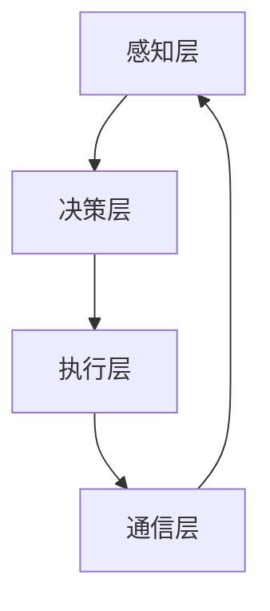

> 多Agent系统, Agent, 交互, 分布式计算, 联邦学习, 智能体, 协同, 竞争, 领域应用

# 多Agent系统：多Agent系统的概念，其中多个Agent可以同步或异步地交互，以执行更复杂的任务

多Agent系统（Multi-Agent Systems，MAS）是人工智能领域的一个核心概念，它模拟了现实世界中多智能体之间的交互和协作。在多Agent系统中，多个Agent可以独立地或同步、异步地交互，以共同完成更复杂的任务。本文将深入探讨多Agent系统的概念、原理、实现方法以及在实际应用中的重要性。

## 1. 背景介绍

### 1.1 问题的由来

随着计算机技术的飞速发展，复杂性问题日益突出。许多现实世界问题，如智能交通系统、电网管理、多机器人协作等，都需要多个智能体共同参与和协作才能有效解决。多Agent系统作为一种新兴的计算范式，为解决这类复杂问题提供了一种有效的途径。

### 1.2 研究现状

近年来，多Agent系统研究取得了显著进展。在理论研究方面，研究者们提出了多种Agent通信协议、协调机制和决策模型。在应用领域，多Agent系统已成功应用于多个领域，如智能交通、电子政务、智能制造等。

### 1.3 研究意义

多Agent系统研究具有重要的理论意义和应用价值。在理论上，它有助于我们理解智能体的协同行为和复杂系统的涌现现象。在应用上，多Agent系统可以构建高度自主、灵活和可靠的智能系统，提高复杂任务处理的效率和质量。

### 1.4 本文结构

本文将分为以下几个部分：
- 第2章：介绍多Agent系统的核心概念和基本架构。
- 第3章：探讨多Agent系统的核心算法原理和实现方法。
- 第4章：分析多Agent系统的数学模型和公式。
- 第5章：展示多Agent系统的代码实例和实现细节。
- 第6章：探讨多Agent系统在实际应用场景中的案例。
- 第7章：展望多Agent系统的未来发展趋势和挑战。
- 第8章：总结本文的研究成果和贡献。

## 2. 核心概念与联系

### 2.1 核心概念

#### 2.1.1 Agent

Agent是多Agent系统的基本单元，它是具有智能、自主性和社会性的实体。Agent可以是一个实体（如机器人、人类等），也可以是一个虚拟实体（如软件程序、应用程序等）。

#### 2.1.2 交互

交互是多Agent系统中的核心概念，它描述了不同Agent之间如何通过通信和协作来共同完成任务。

#### 2.1.3 环境模型

环境模型是多Agent系统对环境的描述，它包括环境的状态、资源、规则等。

#### 2.1.4 行为策略

行为策略是多Agent系统中的决策规则，它指导Agent如何根据环境模型和交互信息来选择自己的行为。

### 2.2 架构

多Agent系统通常采用分层架构，包括以下层次：

- **感知层**：感知层负责收集环境信息，如传感器数据、传感器状态等。
- **决策层**：决策层根据感知层提供的信息，结合行为策略进行决策。
- **执行层**：执行层负责执行决策层生成的动作，如移动、通信等。
- **通信层**：通信层负责Agent之间的信息交换。

### 2.3 Mermaid 流程图



## 3. 核心算法原理 & 具体操作步骤

### 3.1 算法原理概述

多Agent系统的核心算法通常包括以下方面：

- **通信算法**：用于Agent之间的信息交换。
- **决策算法**：用于根据环境信息和交互信息进行决策。
- **协作算法**：用于实现Agent之间的协作。

### 3.2 算法步骤详解

#### 3.2.1 通信算法

通信算法通常包括以下步骤：

1. **消息发送**：Agent根据决策结果，向其他Agent发送消息。
2. **消息接收**：Agent接收来自其他Agent的消息。
3. **消息处理**：Agent根据接收到的消息进行相应的处理。

#### 3.2.2 决策算法

决策算法通常包括以下步骤：

1. **状态感知**：Agent收集环境信息。
2. **策略选择**：根据状态信息和行为策略，选择合适的行动。
3. **决策执行**：执行决策结果。

#### 3.2.3 协作算法

协作算法通常包括以下步骤：

1. **任务分配**：将任务分配给不同的Agent。
2. **任务执行**：Agent根据分配的任务进行执行。
3. **结果反馈**：Agent将执行结果反馈给其他Agent。

### 3.3 算法优缺点

#### 3.3.1 优点

- **高度灵活性**：多Agent系统可以适应复杂多变的环境。
- **高度可靠性**：即使部分Agent失效，系统仍能正常运行。
- **高度适应性**：多Agent系统可以适应不同的应用场景。

#### 3.3.2 缺点

- **复杂性**：多Agent系统的设计和实现相对复杂。
- **通信开销**：Agent之间的通信需要消耗一定的资源。
- **同步问题**：在异步环境中，Agent之间的同步可能比较困难。

### 3.4 算法应用领域

多Agent系统的应用领域非常广泛，包括但不限于以下方面：

- **智能交通系统**：用于优化交通流量、减少拥堵。
- **电子政务**：用于提高政府服务效率、降低行政成本。
- **智能制造**：用于实现生产过程的自动化、智能化。
- **多机器人协作**：用于实现机器人之间的协同作业。

## 4. 数学模型和公式 & 详细讲解 & 举例说明

### 4.1 数学模型构建

多Agent系统的数学模型通常包括以下方面：

- **状态空间**：描述Agent和环境的当前状态。
- **动作空间**：描述Agent可以执行的动作。
- **奖励函数**：描述Agent执行动作后的奖励或惩罚。

### 4.2 公式推导过程

以下是一个简单的多Agent系统奖励函数的例子：

$$
R(s, a) = r
$$

其中，$R(s, a)$ 表示Agent在状态 $s$ 下执行动作 $a$ 后获得的奖励，$r$ 为奖励值。

### 4.3 案例分析与讲解

假设一个简单的多Agent系统，其中有两个Agent，它们需要在一条单行道上相互避让，避免碰撞。

状态空间 $S$：

$$
S = \{空闲, 检测到对方, 正在避让\}
$$

动作空间 $A$：

$$
A = \{加速, 减速, 保持\}
$$

奖励函数 $R$：

$$
R(s, a) = \begin{cases}
1, & \text{if } s = 空闲 \text{ and } a = 保持 \\
-1, & \text{if } s = 检测到对方 \text{ and } a \neq 避让 \\
-2, & \text{if } s = 检测到对方 \text{ and } a = 避让 \\
\end{cases}
$$

在这个例子中，当两个Agent都处于空闲状态时，保持速度可以获得奖励；当其中一个Agent检测到对方时，未采取避让动作的Agent将受到惩罚。

## 5. 项目实践：代码实例和详细解释说明

### 5.1 开发环境搭建

为了演示多Agent系统的实现，我们将使用Python编写一个简单的多Agent避障程序。

```bash
# 安装必要的Python库
pip install pyglet matplotlib
```

### 5.2 源代码详细实现

以下是一个使用Pyglet和Matplotlib实现的多Agent避障程序：

```python
import pyglet
import matplotlib.pyplot as plt

# 定义Agent类
class Agent:
    def __init__(self, x, y):
        self.x = x
        self.y = y
        self.velocity = 1

    def move(self):
        self.x += self.velocity

    def draw(self, window):
        plt.scatter(self.x, self.y, c='r')

# 创建窗口
window = pyglet.window.Window(width=800, height=600)

# 创建Agent
agent = Agent(0, 300)

# 创建定时器
timer = window.schedule_interval(agent.move)

# 创建绘制函数
@window.event
def on_draw():
    window.clear()
    agent.draw(window)

# 运行程序
pyglet.app.run()
```

### 5.3 代码解读与分析

在这个例子中，我们定义了一个Agent类，它具有位置和速度属性。每个时间步长，Agent都会向右移动一定的距离。同时，我们使用Matplotlib在窗口中绘制Agent的位置。

### 5.4 运行结果展示

运行程序后，你将看到一个红色的点在窗口中向右移动。这个简单的例子演示了多Agent系统实现的基本原理。

## 6. 实际应用场景

### 6.1 智能交通系统

多Agent系统可以用于构建智能交通系统，优化交通流量、减少拥堵。例如，可以设计多个Agent代表不同道路上的车辆，它们之间通过通信和协作来避免碰撞、选择最佳行驶路线。

### 6.2 电子政务

多Agent系统可以用于构建电子政务系统，提高政府服务效率、降低行政成本。例如，可以设计多个Agent代表不同政府部门，它们之间通过通信和协作来处理政务事项、提高服务效率。

### 6.3 智能制造

多Agent系统可以用于构建智能制造系统，实现生产过程的自动化、智能化。例如，可以设计多个Agent代表不同的生产线、机器，它们之间通过通信和协作来优化生产流程、提高生产效率。

## 7. 工具和资源推荐

### 7.1 学习资源推荐

- 《多智能体系统：原理与应用》
- 《多智能体系统导论》
- 《智能体交互：原理与实现》

### 7.2 开发工具推荐

- Python
- Python编程语言库：NumPy、Pandas、Matplotlib、Pyglet
- 多Agent系统开发框架：MASim、PySwarm

### 7.3 相关论文推荐

- "A Framework for Developing Multi-Agent Systems" by Yoav Shoham and Kevin Leyton-Brown
- "Multi-Agent System: An Introduction" by Frank Dignum and Rob Kowalksi
- "An Overview of Multi-Agent Systems: From Distributed AI to Ambient Intelligence" by Janusz Kacprzyk and Agnieszka Tarka

## 8. 总结：未来发展趋势与挑战

### 8.1 研究成果总结

本文深入探讨了多Agent系统的概念、原理、实现方法以及在实际应用中的重要性。通过分析多Agent系统的核心算法、数学模型和代码实例，我们展示了多Agent系统的强大功能和广泛的应用前景。

### 8.2 未来发展趋势

未来，多Agent系统研究将呈现以下发展趋势：

- **跨领域融合**：多Agent系统与其他人工智能技术（如机器学习、知识表示、自然语言处理等）的融合。
- **边缘计算**：多Agent系统在边缘计算环境下的应用。
- **人机协同**：多Agent系统与人机交互的融合。

### 8.3 面临的挑战

多Agent系统研究面临着以下挑战：

- **复杂性问题**：多Agent系统的设计和实现相对复杂，需要解决协同、通信、决策等复杂问题。
- **资源消耗**：多Agent系统的通信和计算需要消耗一定的资源。
- **安全性问题**：多Agent系统的安全性问题需要得到有效解决。

### 8.4 研究展望

未来，多Agent系统研究将朝着以下方向发展：

- **更加智能化**：提高多Agent系统的自主性和适应性。
- **更加高效**：降低多Agent系统的资源消耗。
- **更加安全**：提高多Agent系统的安全性。

## 9. 附录：常见问题与解答

**Q1：什么是Agent？**

A1：Agent是多Agent系统中的基本单元，它具有智能、自主性和社会性。

**Q2：多Agent系统有哪些应用场景？**

A2：多Agent系统的应用场景非常广泛，包括智能交通系统、电子政务、智能制造、多机器人协作等。

**Q3：如何设计多Agent系统？**

A3：设计多Agent系统需要考虑以下方面：
- **定义Agent**：明确Agent的功能、行为和交互方式。
- **定义环境**：明确环境的状态、规则和资源。
- **定义通信机制**：明确Agent之间的通信方式和协议。
- **定义决策规则**：明确Agent的决策策略和决策模型。

**Q4：多Agent系统有哪些挑战？**

A4：多Agent系统面临的挑战包括复杂性、资源消耗和安全性问题。

**Q5：如何提高多Agent系统的性能？**

A5：提高多Agent系统的性能可以从以下方面入手：
- **优化算法**：优化Agent的决策算法、通信算法和协作算法。
- **资源优化**：优化多Agent系统的资源消耗，如通信带宽、计算资源等。
- **安全性优化**：提高多Agent系统的安全性，防止恶意攻击和数据泄露。

---

作者：禅与计算机程序设计艺术 / Zen and the Art of Computer Programming