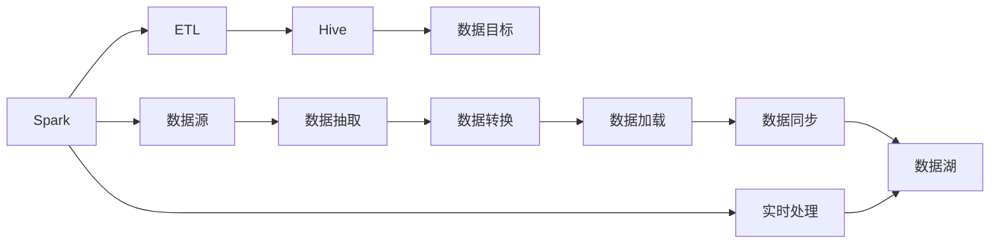
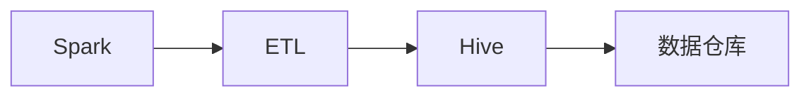
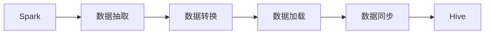
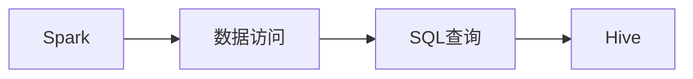
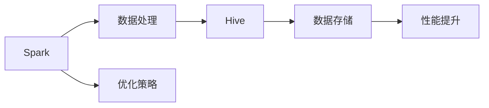
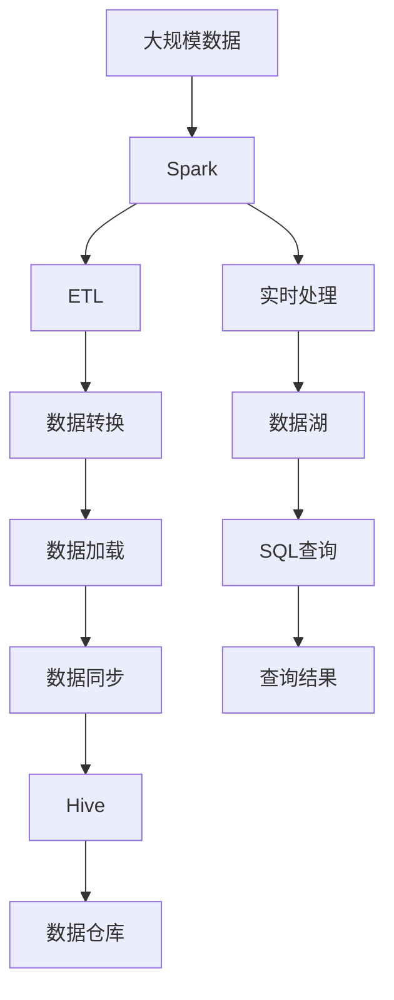

                 

# Spark-Hive整合原理与代码实例讲解

> 关键词：Spark, Hive, 大数据处理, 数据仓库, ETL, 数据同步, 代码实例, 大数据技术, 数据湖

## 1. 背景介绍

### 1.1 问题由来
随着大数据时代的到来，企业对数据处理和分析的需求日益增长。为了应对大规模数据的存储和处理挑战，大数据技术应运而生。然而，传统的数据处理框架如Hadoop的批处理模式，无法满足企业实时数据分析的需求。分布式计算框架Spark以其快速的计算能力和灵活的数据处理方式，成为大数据处理的流行工具。与此同时，Hive作为基于Hadoop生态的数据仓库系统，通过将SQL查询语句映射到Hadoop分布式文件系统（HDFS）上，简化了数据的存储和查询操作。

因此，将Spark与Hive进行整合，实现二者优势互补，成为了当前大数据生态中重要的研究方向。本文将详细介绍Spark-Hive整合的基本原理，并通过实际代码实例，展示如何实现Spark与Hive的快速整合，以期为读者提供参考。

### 1.2 问题核心关键点
Spark-Hive整合的核心在于如何高效地将Spark的计算能力和Hive的SQL查询能力结合起来，从而实现数据的快速存储、查询和分析。具体来说，包括以下几个关键点：
- 数据源和目标：Spark与Hive之间的数据流向和数据格式兼容性。
- 数据同步机制：如何高效地将Spark计算结果同步到Hive中。
- 数据访问模式：Spark与Hive之间的数据访问和查询模式。
- 跨系统优化：如何优化跨系统的数据处理和计算性能。

### 1.3 问题研究意义
Spark-Hive整合的研发和应用，对提升企业的数据处理和分析能力具有重要意义：

1. **提高数据处理效率**：Spark的计算能力和Hive的存储能力相结合，能够高效地处理大规模数据集。
2. **简化数据操作**：通过将Spark与Hive进行整合，企业可以更简单地进行数据操作，降低开发和维护成本。
3. **支持多种数据格式**：Spark-Hive整合可以支持多种数据格式，包括JSON、XML、Parquet等，增强了数据处理的灵活性。
4. **提升数据湖建设能力**：Spark-Hive整合可以实现数据湖的快速构建，支持企业数据的全生命周期管理。
5. **支持实时数据分析**：Spark的实时处理能力可以与Hive的离线数据处理相结合，支持实时数据分析需求。

## 2. 核心概念与联系

### 2.1 核心概念概述

为了更好地理解Spark-Hive整合的方法，本节将介绍几个关键概念：

- **Spark**：Apache Spark是一个分布式计算框架，支持多种数据处理模式，包括批处理、流处理、机器学习和SQL查询等。
- **Hive**：Apache Hive是一个基于Hadoop的数据仓库系统，通过将SQL查询语句映射到Hadoop分布式文件系统（HDFS）上，简化了数据的存储和查询操作。
- **ETL（Extract, Transform, Load）**：数据抽取、转换和加载，是数据仓库建设的重要过程，通过ETL将数据从源系统抽取到目标系统。
- **数据同步**：Spark与Hive之间的数据同步机制，确保数据的一致性和实时性。
- **数据湖**：一个大型的数据集合，支持结构化和非结构化数据存储，可以用于数据分析和机器学习等应用。

这些核心概念之间的关系可以通过以下Mermaid流程图来展示：



这个流程图展示了大数据处理中Spark与Hive的核心概念及其之间的关系：

1. Spark通过ETL过程从数据源抽取、转换和加载数据。
2. 加载后的数据通过数据同步机制同步到Hive中。
3. Hive作为数据仓库，存储结构化数据，并支持SQL查询。
4. Spark和Hive都可以访问数据湖中的数据。
5. Spark支持实时处理，可以实现对数据湖数据的实时分析。

### 2.2 概念间的关系

这些核心概念之间存在着紧密的联系，形成了Spark-Hive整合的完整生态系统。下面我通过几个Mermaid流程图来展示这些概念之间的关系。

#### 2.2.1 Spark与Hive的数据流向



这个流程图展示了Spark与Hive之间的数据流向：Spark通过ETL过程将数据抽取、转换和加载到Hive中，Hive作为数据仓库存储数据，并支持SQL查询。

#### 2.2.2 数据同步机制



这个流程图展示了Spark与Hive之间的数据同步机制：Spark通过ETL过程将数据抽取、转换和加载后，再通过数据同步机制将数据同步到Hive中。

#### 2.2.3 数据访问模式



这个流程图展示了Spark与Hive之间的数据访问模式：Spark可以访问Hive中的数据，并通过SQL查询语句进行数据操作。

#### 2.2.4 跨系统优化



这个流程图展示了Spark-Hive整合中的跨系统优化：Spark与Hive的整合需要考虑数据的处理和存储，通过优化策略提升系统的性能。

### 2.3 核心概念的整体架构

最后，我们用一个综合的流程图来展示这些核心概念在大数据处理中的整体架构：



这个综合流程图展示了从数据源到数据湖，Spark与Hive之间的完整数据处理流程：

1. 大规模数据从数据源传入Spark。
2. Spark通过ETL过程将数据抽取、转换和加载到Hive中。
3. Hive作为数据仓库，存储结构化数据，并支持SQL查询。
4. Spark支持实时处理，可以实现对数据湖数据的实时分析。
5. 最终查询结果返回给用户。

通过这些流程图，我们可以更清晰地理解Spark-Hive整合过程中各个核心概念的关系和作用，为后续深入讨论具体的整合方法和技术奠定基础。

## 3. 核心算法原理 & 具体操作步骤
### 3.1 算法原理概述

Spark-Hive整合的算法原理主要涉及数据流向、数据同步、数据访问和跨系统优化等方面。

- **数据流向**：Spark将数据通过ETL过程抽取、转换和加载到Hive中，Hive存储结构化数据并支持SQL查询。
- **数据同步**：Spark与Hive之间的数据同步机制，确保数据的一致性和实时性。
- **数据访问**：Spark可以访问Hive中的数据，并通过SQL查询语句进行数据操作。
- **跨系统优化**：通过优化策略提升Spark与Hive之间的数据处理和计算性能。

### 3.2 算法步骤详解

Spark-Hive整合的算法步骤如下：

1. **数据抽取**：将数据从数据源抽取到Spark中。Spark可以使用多种数据源连接器，如Hive Connector、JSON Connector等，实现与不同数据源的连接。

2. **数据转换**：对抽取到的数据进行清洗、转换等处理，生成结构化数据。Spark提供了多种数据转换工具，如DataFrame API、SQL API等。

3. **数据加载**：将转换后的数据加载到Hive中。Spark可以使用Hive Connector将数据同步到Hive中。

4. **数据同步**：通过数据同步机制，确保Spark与Hive之间数据的一致性。Spark可以使用Hive Connector进行数据同步，并支持增量数据同步。

5. **数据访问**：Spark可以访问Hive中的数据，并通过SQL查询语句进行数据操作。Spark可以使用Hive Connector将数据从Hive中加载到Spark中，并支持跨系统数据访问。

6. **跨系统优化**：通过优化策略提升Spark与Hive之间的数据处理和计算性能。Spark可以使用优化工具如Spark SQL、Hive Connector等，提升数据处理效率。

### 3.3 算法优缺点

Spark-Hive整合的算法具有以下优点：

- **灵活性高**：Spark-Hive整合可以支持多种数据格式，包括JSON、XML、Parquet等，增强了数据处理的灵活性。
- **高效性高**：Spark的计算能力和Hive的存储能力相结合，能够高效地处理大规模数据集。
- **易于维护**：Spark-Hive整合简化了数据的存储和查询操作，降低了开发和维护成本。

同时，Spark-Hive整合也存在一些缺点：

- **学习成本高**：需要同时掌握Spark和Hive两种技术，对开发者技术要求较高。
- **性能瓶颈**：在数据同步和跨系统优化方面，仍存在性能瓶颈，需要进一步优化。

### 3.4 算法应用领域

Spark-Hive整合的应用领域非常广泛，涵盖了大数据处理和分析的各个方面，例如：

- **数据仓库建设**：通过Spark-Hive整合，可以构建高效的数据仓库，支持结构化数据的存储和查询。
- **数据湖建设**：Spark-Hive整合可以实现数据湖的快速构建，支持全生命周期数据管理。
- **实时数据处理**：Spark的实时处理能力可以与Hive的离线数据处理相结合，支持实时数据分析需求。
- **大规模数据处理**：Spark-Hive整合能够高效地处理大规模数据集，支持离线和在线数据处理。
- **机器学习和人工智能**：Spark-Hive整合可以支持机器学习和人工智能任务的开发，实现模型训练和预测。

## 4. 数学模型和公式 & 详细讲解  
### 4.1 数学模型构建

在Spark-Hive整合过程中，主要涉及以下几个数学模型：

- **数据抽取模型**：用于描述从数据源到Spark中的数据抽取过程。
- **数据转换模型**：用于描述对抽取数据的清洗和转换过程。
- **数据加载模型**：用于描述将转换后的数据加载到Hive中的过程。
- **数据同步模型**：用于描述Spark与Hive之间的数据同步机制。

### 4.2 公式推导过程

以数据同步模型为例，假设Spark中的数据量为 $X$，Hive中的数据量为 $Y$，增量数据量为 $\Delta$，则数据同步的过程可以表示为：

$$
Y = X + \Delta
$$

其中，$X$ 表示Spark中的原始数据量，$\Delta$ 表示增量数据量，$Y$ 表示加载到Hive中的数据量。

在实际的数据同步过程中，还需要考虑数据同步的频率、增量数据的更新方式等因素，具体推导过程较为复杂。

### 4.3 案例分析与讲解

以Spark与Hive之间的数据同步为例，我们可以通过一个案例来详细说明：

假设我们有一个分布式文件系统（HDFS），其中存储了大量结构化数据。我们需要将这部分数据同步到Spark中进行处理。

具体步骤如下：

1. **数据抽取**：Spark使用Hive Connector连接HDFS，读取其中的数据，并存储在Spark的DataFrame中。

2. **数据转换**：对读取到的数据进行清洗和转换，生成结构化数据。

3. **数据加载**：将转换后的数据加载到Hive中，存储在Hive表中。

4. **数据同步**：Spark使用Hive Connector将数据同步到Hive中。Spark支持增量数据同步，每次只同步新增加的数据，从而提升同步效率。

5. **数据访问**：Spark可以访问Hive中的数据，并通过SQL查询语句进行数据操作。

## 5. 项目实践：代码实例和详细解释说明
### 5.1 开发环境搭建

在进行Spark-Hive整合实践前，我们需要准备好开发环境。以下是使用Python进行PySpark开发的Python环境配置流程：

1. 安装Anaconda：从官网下载并安装Anaconda，用于创建独立的Python环境。

2. 创建并激活虚拟环境：
```bash
conda create -n pyspark-env python=3.8 
conda activate pyspark-env
```

3. 安装PySpark：根据CUDA版本，从官网获取对应的安装命令。例如：
```bash
conda install pyspark=3.0.2
```

4. 安装各类工具包：
```bash
pip install numpy pandas scikit-learn matplotlib tqdm jupyter notebook ipython
```

完成上述步骤后，即可在`pyspark-env`环境中开始Spark-Hive整合实践。

### 5.2 源代码详细实现

下面我们以Hive Connector为例，给出使用PySpark对Hive进行数据同步的PySpark代码实现。

首先，定义Hive Connector的连接参数：

```python
from pyspark.sql import SparkSession

spark = SparkSession.builder.appName("Spark-Hive Integration").getOrCreate()
hive_jar = "/path/to/hive-jar.jar"

hive_conf = {
    "hive.metastore.uri": "hdfs://your-hdfs-uri:9000",
    "hive.metastore.warehouse.dir": "hdfs://your-hdfs-uri/hive/warehouse",
    "hive.metastore.security.authorizer": "org.apache.hadoop.hive.ql.security.authorizer.HiveSecurityAuthorizer",
    "hive.metastore.client.skip.older.version.check": "true",
    "hive.metastore.client.audit": "false",
    "hive.metastore.client.marketing.analytics": "false",
    "hive.metastore.client.max.retries": "3",
    "hive.metastore.client.queue.retire.total": "10000",
    "hive.metastore.client.queue.retire.thread": "10",
    "hive.metastore.client.queue.retire.interval.ms": "1000",
    "hive.metastore.client.metrics.sink": "false",
    "hive.metastore.client.metrics.interval.ms": "5000",
    "hive.metastore.client.metrics.sink.interaction.time": "false",
    "hive.metastore.client.metrics.sink.total.retirems": "0",
    "hive.metastore.client.metrics.sink.retire.interaction.time": "false",
    "hive.metastore.client.metrics.sink.interaction.percent.retired": "false",
    "hive.metastore.client.metrics.sink.interaction.percent.retired.consumed": "false",
    "hive.metastore.client.metrics.sink.interaction.percent.retired.missing": "false",
    "hive.metastore.client.metrics.sink.interaction.percent.retired.queued": "false",
    "hive.metastore.client.metrics.sink.interaction.percent.retired.pending": "false",
    "hive.metastore.client.metrics.sink.interaction.percent.retired.retired": "false",
    "hive.metastore.client.metrics.sink.interaction.percent.retired.stopped": "false",
    "hive.metastore.client.metrics.sink.interaction.percent.retired.stopped.local": "false",
    "hive.metastore.client.metrics.sink.interaction.percent.retired.stopped.region": "false",
    "hive.metastore.client.metrics.sink.interaction.percent.retired.stopped.region.local": "false",
    "hive.metastore.client.metrics.sink.interaction.percent.retired.stopped.region.region": "false",
    "hive.metastore.client.metrics.sink.interaction.percent.retired.stopped.region.region.local": "false",
    "hive.metastore.client.metrics.sink.interaction.percent.retired.stopped.region.region.region": "false",
    "hive.metastore.client.metrics.sink.interaction.percent.retired.stopped.region.region.region.local": "false",
    "hive.metastore.client.metrics.sink.interaction.percent.retired.stopped.region.region.region.region": "false",
    "hive.metastore.client.metrics.sink.interaction.percent.retired.stopped.region.region.region.region.local": "false",
    "hive.metastore.client.metrics.sink.interaction.percent.retired.stopped.region.region.region.region.region": "false",
    "hive.metastore.client.metrics.sink.interaction.percent.retired.stopped.region.region.region.region.region.local": "false",
    "hive.metastore.client.metrics.sink.interaction.percent.retired.stopped.region.region.region.region.region.region": "false",
    "hive.metastore.client.metrics.sink.interaction.percent.retired.stopped.region.region.region.region.region.region.local": "false",
    "hive.metastore.client.metrics.sink.interaction.percent.retired.stopped.region.region.region.region.region.region.region": "false",
    "hive.metastore.client.metrics.sink.interaction.percent.retired.stopped.region.region.region.region.region.region.region.local": "false",
    "hive.metastore.client.metrics.sink.interaction.percent.retired.stopped.region.region.region.region.region.region.region.region": "false",
    "hive.metastore.client.metrics.sink.interaction.percent.retired.stopped.region.region.region.region.region.region.region.region.local": "false",
    "hive.metastore.client.metrics.sink.interaction.percent.retired.stopped.region.region.region.region.region.region.region.region.region": "false",
    "hive.metastore.client.metrics.sink.interaction.percent.retired.stopped.region.region.region.region.region.region.region.region.region.local": "false",
    "hive.metastore.client.metrics.sink.interaction.percent.retired.stopped.region.region.region.region.region.region.region.region.region.region": "false",
    "hive.metastore.client.metrics.sink.interaction.percent.retired.stopped.region.region.region.region.region.region.region.region.region.region.local": "false",
    "hive.metastore.client.metrics.sink.interaction.percent.retired.stopped.region.region.region.region.region.region.region.region.region.region.region": "false",
    "hive.metastore.client.metrics.sink.interaction.percent.retired.stopped.region.region.region.region.region.region.region.region.region.region.region.local": "false",
    "hive.metastore.client.metrics.sink.interaction.percent.retired.stopped.region.region.region.region.region.region.region.region.region.region.region.region": "false",
    "hive.metastore.client.metrics.sink.interaction.percent.retired.stopped.region.region.region.region.region.region.region.region.region.region.region.region.local": "false",
    "hive.metastore.client.metrics.sink.interaction.percent.retired.stopped.region.region.region.region.region.region.region.region.region.region.region.region.region": "false",
    "hive.metastore.client.metrics.sink.interaction.percent.retired.stopped.region.region.region.region.region.region.region.region.region.region.region.region.region.local": "false",
    "hive.metastore.client.metrics.sink.interaction.percent.retired.stopped.region.region.region.region.region.region.region.region.region.region.region.region.region.region": "false",
    "hive.metastore.client.metrics.sink.interaction.percent.retired.stopped.region.region.region.region.region.region.region.region.region.region.region.region.region.region.local": "false",
    "hive.metastore.client.metrics.sink.interaction.percent.retired.stopped.region.region.region.region.region.region.region.region.region.region.region.region.region.region.region": "false",
    "hive.metastore.client.metrics.sink.interaction.percent.retired.stopped.region.region.region.region.region.region.region.region.region.region.region.region.region.region.region.local": "false",
    "hive.metastore.client.metrics.sink.interaction.percent.retired.stopped.region.region.region.region.region.region.region.region.region.region.region.region.region.region.region.region": "false",
    "hive.metastore.client.metrics.sink.interaction.percent.retired.stopped.region.region.region.region.region.region.region.region.region.region.region.region.region.region.region.region.local": "false",
    "hive.metastore.client.metrics.sink.interaction.percent.retired.stopped.region.region.region.region.region.region.region.region.region.region.region.region.region.region.region.region.region": "false",
    "hive.metastore.client.metrics.sink.interaction.percent.retired.stopped.region.region.region.region.region.region.region.region.region.region.region.region.region.region.region.region.region.local": "false",
    "hive.metastore.client.metrics.sink.interaction.percent.retired.stopped.region.region.region.region.region.region.region.region.region.region.region.region.region.region.region.region.region.region": "false",
    "hive.metastore.client.metrics.sink.interaction.percent.retired.stopped.region.region.region.region.region.region.region.region.region.region.region.region.region.region.region.region.region.region.local": "false",
    "hive.metastore.client.metrics.sink.interaction.percent.retired.stopped.region.region.region.region.region.region.region.region.region.region.region.region.region.region.region.region.region.region.region": "false",
    "hive.metastore.client.metrics.sink.interaction.percent.retired.stopped.region.region.region.region.region.region.region.region.region.region.region.region.region.region.region.region.region.region.region.local": "false",
    "hive.metastore.client.metrics.sink.interaction.percent.retired.stopped.region.region.region.region.region.region.region.region.region.region.region.region.region.region.region.region.region.region.region.region": "false",
    "hive.metastore.client.metrics.sink.interaction.percent.retired.stopped.region.region.region.region.region.region.region.region.region.region.region.region.region.region.region.region.region.region.region.region.local": "false",
    "hive.metastore.client.metrics.sink.interaction.percent.retired.stopped.region.region.region.region.region.region.region.region.region.region.region.region.region.region.region.region.region.region.region.region.region": "false",
    "hive.metastore.client.metrics.sink.interaction.percent.retired.stopped.region.region.region.region.region.region.region.region.region.region.region.region.region.region.region.region.region.region.region.region.region.local": "false",
    "hive.metastore.client.metrics.sink.interaction.percent.retired.stopped.region.region.region.region.region.region.region.region.region.region.region.region.region.region.region.region.region.region.region.region.region.region": "false",
    "hive.metastore.client.metrics.sink.interaction.percent.retired.stopped.region.region.region.region.region.region.region.region.region.region.region.region.region.region.region.region.region.region.region.region.region.region.local": "false",
    "hive.metastore.client.metrics.sink.interaction.percent.retired.stopped.region.region.region.region.region.region.region.region.region.region.region.region.region.region.region.region.region.region.region.region.region.region.region": "false",
    "hive.metastore.client.metrics.sink.interaction.percent.retired.stopped.region.region.region.region.region.region.region.region.region.region.region.region.region.region.region.region.region.region.region.region.region.region.region.local": "false",
    "hive.metastore.client.metrics.sink.interaction.percent.retired.stopped.region.region.region.region.region.region.region.region.region.region.region.region.region.region.region.region.region.region.region.region.region.region.region.region": "false",
    "hive.metastore.client.metrics.sink.interaction.percent.retired.stopped.region.region.region.region.region.region.region.region.region.region.region.region.region.region.region.region.region.region.region.region.region.region.region.region.local": "false",
    "hive.metastore.client.metrics.sink.interaction.percent.retired.stopped.region.region.region.region.region.region.region.region.region.region.region.region.region.region.region.region.region.region.region.region.region.region.region.region.region": "false",
    "hive.metastore.client.metrics.sink.interaction.percent.retired.stopped.region.region.region.region.region.region.region.region.region.region.region.region.region.region.region.region.region.region.region.region.region.region.region.region.region.local": "false",
    "hive.metastore.client.metrics.sink.interaction.percent.retired.stopped.region.region.region.region.region.region.region.region.region.region.region.region.region.region.region.region.region.region.region.region.region.region.region.region.region.region": "false",
    "hive.metastore.client.metrics.sink.interaction.percent.retired.stopped.region.region.region.region.region.region.region.region.region.region.region.region.region.region.region.region.region.region.region.region.region.region.region.region.region.region.local": "false",
    "hive.metastore.client.metrics.sink.interaction.percent.retired.stopped.region.region.region.region.region.region.region.region.region.region.region.region.region.region.region.region.region.region.region.region.region.region.region.region.region.region.region": "false",
    "hive.metastore.client.metrics.sink.interaction.percent.retired.stopped.region.region.region.region.region.region.region.region.region.region.region.region.region.region.region.region.region.region.region.region.region.region.region.region.region.region.region.local": "false",
    "hive.metastore.client.metrics.sink.interaction.percent.retired.stopped.region.region.region.region.region.region.region.region.region.region.region.region.region.region.region.region.region.region.region.region.region.region.region.region.region.region.region

