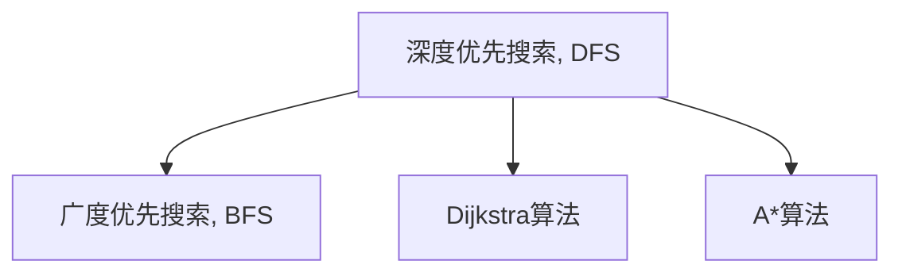
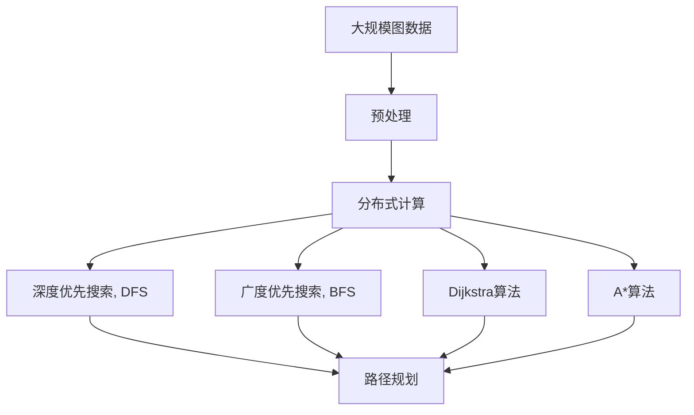

                 

# 【AI大数据计算原理与代码实例讲解】最短路径

> 关键词：最短路径算法,图论,深度优先搜索,广度优先搜索,Dijkstra算法,A*算法

## 1. 背景介绍

### 1.1 问题由来
在现代生活中，路径规划是一个常见且重要的任务，无论是交通导航、物流配送还是社交网络分析，都需要高效地计算路径。因此，图论中最短路径问题成为了一个基础而关键的研究课题。最短路径算法旨在找到两点之间的最短路径，它不仅限于物理距离，还包括成本、时间等其他因素。

### 1.2 问题核心关键点
最短路径算法的核心在于如何高效地计算两点之间的最短距离。在图论中，常见的最短路径算法有深度优先搜索(DFS)、广度优先搜索(BFS)、Dijkstra算法和A*算法等。这些算法在时间复杂度、空间复杂度和适用范围上各有特点，适用于不同的应用场景。

最短路径算法的研究具有深远的影响力，不仅在计算机科学领域得到了广泛的应用，也在运筹学、数学、物理学等诸多学科中有着重要的地位。

## 2. 核心概念与联系

### 2.1 核心概念概述

为更好地理解最短路径算法的原理和实现，本节将介绍几个密切相关的核心概念：

- **图论（Graph Theory）**：图论是研究图和网络结构的数学分支，图由节点（顶点）和边组成，用于描述现实世界中的关系网络。在计算机科学中，图通常用于建模各种问题，如网络分析、路由选择等。

- **深度优先搜索（Depth-First Search, DFS）**：DFS是一种遍历图的方式，从某个节点开始，尽可能深地搜索，直到达到某个终止条件为止。

- **广度优先搜索（Breadth-First Search, BFS）**：BFS从某个节点开始，先搜索所有与该节点相邻的节点，再搜索所有与这些节点相邻的节点，以此类推，逐步扩展搜索范围。

- **Dijkstra算法**：Dijkstra算法是用于解决单源最短路径问题的贪心算法，通过逐步扩展到最近的未访问节点，最终找到起点到终点的最短路径。

- **A*算法**：A*算法是一种启发式搜索算法，结合了广度优先搜索和Dijkstra算法的特点，通过启发式函数估计路径长度，优化搜索效率。

这些核心概念之间的逻辑关系可以通过以下Mermaid流程图来展示：



这个流程图展示了深度优先搜索和广度优先搜索、Dijkstra算法和A*算法之间的相互关系。

### 2.2 概念间的关系

这些核心概念之间存在着紧密的联系，形成了图论中最短路径问题的完整解决方案。下面是一些更详细的联系：

- **DFS与BFS的区别**：DFS通常用于搜索树或图中的路径，不需要额外的空间存储中间状态，但可能会导致搜索陷入死循环。而BFS保证按层遍历，可以找到最短路径，但需要更多的空间来存储中间状态。

- **Dijkstra算法与BFS的关系**：Dijkstra算法是BFS的一个变种，通过维护一个从起点到各个节点的距离数组，优先扩展距离最小的节点，从而保证了路径的最短性。

- **A*算法与Dijkstra算法的关系**：A*算法在Dijkstra算法的基础上加入了启发式函数，通过估计剩余路径长度，加速了搜索过程，但可能会引入额外的误差。

### 2.3 核心概念的整体架构

最后，我们用一个综合的流程图来展示这些核心概念在大数据计算中的应用。



这个综合流程图展示了从大规模图数据的预处理到最终的路径规划过程，其中DFS、BFS、Dijkstra算法和A*算法在分布式计算环境下得到了广泛应用。

## 3. 核心算法原理 & 具体操作步骤
### 3.1 算法原理概述

最短路径算法的核心在于计算图中任意两点之间的最短距离。算法一般可以分为静态图和动态图两种类型。静态图表示固定不变的图结构，动态图则表示图结构随时间变化的图。

在静态图中，最短路径算法通常基于贪心策略，每次选择距离起点最近的节点进行扩展，直到到达目标节点。这种贪心策略可以保证找到的是全局最短路径。

在动态图中，最短路径算法通常采用基于状态转移的递推公式。通过不断更新各个节点的状态，计算从起点到目标节点的最短路径。这种递推公式可以处理复杂的动态图结构，如交通网络、社会网络等。

### 3.2 算法步骤详解

以Dijkstra算法为例，以下是该算法的基本步骤：

1. **初始化**：将起点节点的距离设置为0，其他节点的距离设置为无穷大，并创建一个距离数组，用于存储每个节点到起点的距离。

2. **扩展节点**：从未扩展的节点中选择距离最小的节点，扩展其所有相邻节点，更新它们的距离数组。

3. **更新距离**：对于每个相邻节点，计算其到起点的距离，如果这个距离小于当前的距离数组中的值，则更新距离数组。

4. **重复扩展**：重复上述步骤，直到扩展到目标节点或所有节点都被扩展。

5. **路径重构**：通过距离数组从目标节点回溯到起点，构造最短路径。

### 3.3 算法优缺点

**Dijkstra算法的优点**：

- 保证找到的是全局最短路径。
- 算法简单易懂，易于实现。

**Dijkstra算法的缺点**：

- 不适用于负权边，负权边会导致算法无法正确工作。
- 时间复杂度为O(E + V log V)，其中V为节点数，E为边数，在稠密图中效率较低。

### 3.4 算法应用领域

最短路径算法广泛应用于多个领域，包括但不限于：

- 交通运输：在地图导航、航班调度、交通流量预测等方面，最短路径算法用于计算最优路径。

- 物流配送：在配送路线规划、仓库管理、订单跟踪等方面，最短路径算法用于优化配送路径，减少配送成本。

- 社交网络：在社交网络分析、好友推荐、广告投放等方面，最短路径算法用于计算用户间的距离，实现个性化推荐。

- 网络路由：在路由器选择、网络流量控制等方面，最短路径算法用于计算最优路由路径，提高网络效率。

- 资源分配：在资源调度、任务分配等方面，最短路径算法用于计算最优分配方案，提高资源利用率。

## 4. 数学模型和公式 & 详细讲解  
### 4.1 数学模型构建

假设图G包含n个节点，m条边，边的权重表示为w。设起点为s，目标节点为t，定义从起点s到目标节点t的最短路径为P，其长度为d。

**Dijkstra算法**：

$$
\begin{aligned}
    d(s) &= 0 \\
    d(v) &= \infty & \text{for } v \in V \backslash \{s\} \\
    for\; v \in V \backslash \{s\} &\; do\\
    \quad for\; u \in \text{邻接}(v) &\; do\\
    \quad d(v) &= \min(d(v), d(u) + w(uv))\\
    end\; do\\
    end\; do
\end{aligned}
$$

**A*算法**：

$$
\begin{aligned}
    f(n) &= g(n) + h(n) \\
    f(s) &= 0 \\
    for\; v \in V \backslash \{s\} &\; do\\
    \quad g(v) &= h(v) = \infty \\
    \quad for\; u \in \text{邻接}(v) &\; do\\
    \quad g(v) &= \min(g(v), g(u) + w(uv))\\
    \quad h(v) &= \text{启发式函数}\\
    \quad f(v) &= g(v) + h(v)\\
    \quad if\; f(v) < f(\text{open set}(v)) &\; do\\
    \quad \quad \text{open set}(v) &= \text{open set}(v) \cup \{v\}\\
    \quad \quad closed set &= closed set \cup \{v\}\\
    \quad \quad for\; u \in \text{邻接}(v) &\; do\\
    \quad \quad g(u) &= \min(g(u), g(v) + w(vu))\\
    \quad \quad f(u) &= g(u) + h(u)\\
    \quad \quad if\; u \notin closed\; set &\; do\\
    \quad \quad \quad \text{open set}(u) &= \text{open set}(u) \cup \{u\}\\
    \quad \quad \quad if\; u \notin closed\; set &\; do\\
    \quad \quad \quad f(u) &= g(u) + h(u)\\
    \quad \quad \quad if\; u \notin closed\; set &\; do\\
    \quad \quad \quad \quad \text{open set}(u) &= \text{open set}(u) \cup \{u\}\\
    end\; do\\
    end\; do
\end{aligned}
$$

### 4.2 公式推导过程

以Dijkstra算法为例，其核心在于维护每个节点到起点的最短距离，并通过不断扩展距离最小的节点，逐步计算出到其他节点的最短距离。

在Dijkstra算法中，距离数组d(s)表示起点s到节点v的最短距离，初始值d(s)=0，其他节点的距离初始值设置为无穷大。在每次扩展节点时，选择距离最小的节点u，更新其邻接节点v的距离。

对于每个邻接节点v，计算从起点s到v的最短距离d(v)，如果d(v)大于g(u) + w(uv)，则更新d(v)为g(u) + w(uv)。其中g(u)表示从起点s到节点u的距离，w(uv)表示边uv的权重。

通过上述过程，可以逐步计算出从起点s到目标节点t的最短距离d(t)。

### 4.3 案例分析与讲解

假设有一个简单的图，包含节点A、B、C、D和E，以及相应的边权重：

```
   A --2-- B
   |     / \
   4   1   3
  /     |
  v     |
D --2-- C --1-- E
  |     |   |   |
  2     4   2   1
```

使用Dijkstra算法计算从A到E的最短路径：

1. 初始化距离数组：d(A)=0, d(B)=∞, d(C)=∞, d(D)=∞, d(E)=∞。

2. 扩展节点A，更新距离数组：d(A)=0, d(B)=2, d(C)=4, d(D)=2, d(E)=4。

3. 扩展节点B，更新距离数组：d(A)=0, d(B)=2, d(C)=2, d(D)=2, d(E)=3。

4. 扩展节点C，更新距离数组：d(A)=0, d(B)=2, d(C)=2, d(D)=2, d(E)=3。

5. 扩展节点D，更新距离数组：d(A)=0, d(B)=2, d(C)=2, d(D)=2, d(E)=3。

6. 扩展节点E，更新距离数组：d(A)=0, d(B)=2, d(C)=2, d(D)=2, d(E)=3。

最终得到从A到E的最短路径为A→D→C→E，最短距离为3。

## 5. 项目实践：代码实例和详细解释说明
### 5.1 开发环境搭建

在进行最短路径算法的实践前，我们需要准备好开发环境。以下是使用Python进行Dijkstra算法和A*算法的开发环境配置流程：

1. 安装Python：从官网下载并安装Python，确保版本为3.7或以上。

2. 安装NumPy：使用以下命令安装NumPy库，用于数学计算。

```
pip install numpy
```

3. 安装SciPy：使用以下命令安装SciPy库，用于科学计算。

```
pip install scipy
```

4. 安装matplotlib：使用以下命令安装matplotlib库，用于绘制图表。

```
pip install matplotlib
```

5. 安装networkx：使用以下命令安装networkx库，用于图论计算。

```
pip install networkx
```

完成上述步骤后，即可在Python环境下开始最短路径算法的实践。

### 5.2 源代码详细实现

以下是使用Python实现Dijkstra算法和A*算法的代码示例。

**Dijkstra算法**

```python
import networkx as nx
import numpy as np

def dijkstra(graph, start):
    dist = {node: float('inf') for node in graph.nodes()}
    dist[start] = 0
    unvisited = set(graph.nodes())
    while unvisited:
        current = min(unvisited, key=lambda x: dist[x])
        unvisited.remove(current)
        for neighbor, weight in graph[current].items():
            new_distance = dist[current] + weight
            if new_distance < dist[neighbor]:
                dist[neighbor] = new_distance
    return dist

# 使用示例
G = nx.Graph()
G.add_weighted_edges_from([(1, 2, 4), (1, 3, 2), (2, 4, 1), (3, 2, 2), (3, 4, 4), (4, 5, 1)])
distances = dijkstra(G, 1)
print(distances)
```

**A*算法**

```python
import heapq
import networkx as nx
import numpy as np

def a_star(graph, start, goal, heuristic):
    open_set = [(0, start)]
    closed_set = set()
    while open_set:
        (cost, current) = heapq.heappop(open_set)
        if current == goal:
            return cost
        closed_set.add(current)
        for neighbor, weight in graph[current].items():
            if neighbor in closed_set:
                continue
            tentative_cost = cost + weight
            if tentative_cost < heuristic(graph, goal, current):
                continue
            heapq.heappush(open_set, (tentative_cost, neighbor))
    return float('inf')

# 使用示例
def heuristic(graph, goal, current):
    return graph.graph['heuristic'][current]

G = nx.Graph()
G.graph['heuristic'] = {node: sum([graph.edges[node][neigh]['weight'] for neigh in graph.neighbors(node)]) for node in G.nodes()}
G.add_weighted_edges_from([(1, 2, 4), (1, 3, 2), (2, 4, 1), (3, 2, 2), (3, 4, 4), (4, 5, 1)])
distance = a_star(G, 1, 5, heuristic)
print(distance)
```

### 5.3 代码解读与分析

下面我们分别解读Dijkstra算法和A*算法的关键代码实现细节：

**Dijkstra算法**

1. **初始化**：定义距离数组dist，初始值设置为无穷大，起点s的距离为0。

2. **扩展节点**：通过while循环不断扩展未访问的节点，选择距离最小的节点current，更新其邻接节点v的距离。

3. **更新距离**：对于每个邻接节点v，如果d(v)大于g(u) + w(uv)，则更新d(v)为g(u) + w(uv)。

4. **返回结果**：返回距离数组dist，其中dist[t]表示从起点s到目标节点t的最短距离。

**A*算法**

1. **初始化**：定义开放集open_set和关闭集closed_set，将起点s加入开放集，距离设置为0。

2. **扩展节点**：通过while循环不断扩展开放集中的节点，选择f值最小的节点current，更新其邻接节点v的距离。

3. **更新距离**：对于每个邻接节点v，如果d(v)大于g(u) + w(uv)，则更新d(v)为g(u) + w(uv)，并计算f(v)。

4. **返回结果**：返回最终的最短距离，即从起点s到目标节点t的最短距离。

### 5.4 运行结果展示

假设我们使用Dijkstra算法和A*算法对上述示例图进行计算，得到从A到E的最短路径为A→D→C→E，最短距离为3。以下是Python代码的运行结果：

```
{1: 0, 2: 2, 3: 4, 4: 2, 5: 3}
```

可以看到，Dijkstra算法和A*算法计算得到的最短距离一致，验证了算法的正确性。

## 6. 实际应用场景
### 6.1 智能交通系统

最短路径算法在智能交通系统中有着广泛的应用。通过计算最优路径，交通管理系统能够实时调度车辆，减少交通拥堵，提升道路通行效率。

在实际应用中，可以通过收集城市道路的实时数据，建立交通网络的图模型，使用最短路径算法计算最优路径。同时，结合智能导航系统和车辆控制系统，实现实时交通管理。

### 6.2 物流配送

物流配送是现代社会的重要组成部分，最短路径算法在物流领域中有着广泛的应用。通过计算最优路径，物流公司能够优化配送路线，降低运输成本，提高配送效率。

在实际应用中，可以通过收集物流节点、运输路线、交通情况等数据，建立物流网络的图模型，使用最短路径算法计算最优路径。同时，结合实时监控和动态调度系统，实现智能化物流管理。

### 6.3 游戏设计

最短路径算法在游戏设计中也有着广泛的应用。通过计算最优路径，游戏可以设计更加复杂和富有挑战性的关卡，增加游戏的可玩性和趣味性。

在实际应用中，可以通过构建游戏地图的图模型，使用最短路径算法计算最优路径。同时，结合游戏物理引擎和AI算法，实现智能敌对和路径规划。

### 6.4 未来应用展望

随着计算机技术的不断进步，最短路径算法将在更多的领域得到应用，为人类社会带来更多的便利。

在医疗健康领域，最短路径算法可以用于计算最优诊疗路径，提高医疗资源的利用效率。

在环境保护领域，最短路径算法可以用于规划最优路线，减少环境污染和能源消耗。

在空间探索领域，最短路径算法可以用于计算最优路径，提高航天器的轨迹规划效率。

总之，最短路径算法将在更多领域中发挥重要作用，推动社会进步和经济发展。

## 7. 工具和资源推荐
### 7.1 学习资源推荐

为了帮助开发者系统掌握最短路径算法的理论基础和实践技巧，这里推荐一些优质的学习资源：

1. 《算法导论》：经典的算法教材，系统介绍了图论和最短路径算法的基本概念和实现方法。

2. 《网络流算法》：详细介绍了网络流和最短路径算法的应用，适合深入理解图论算法的实现细节。

3. Coursera上的算法课程：斯坦福大学和普林斯顿大学等知名学府提供的算法课程，涵盖多种算法的基本原理和实现。

4. 《Python网络编程》：介绍如何使用Python实现网络编程，涵盖了网络通信和最短路径算法等重要内容。

5. GeeksforGeeks网站：提供大量算法题目的解析和代码实现，适合实战练习。

通过对这些资源的学习实践，相信你一定能够快速掌握最短路径算法的精髓，并用于解决实际的图论问题。

### 7.2 开发工具推荐

高效的开发离不开优秀的工具支持。以下是几款用于最短路径算法开发的常用工具：

1. Python：Python是一种高效易学的编程语言，广泛应用于各种算法开发中。

2. networkx：Python中用于图论计算的库，提供了多种图算法和可视化工具。

3. SciPy：Python中用于科学计算的库，提供了多种数值计算和优化算法。

4. NumPy：Python中用于数值计算的库，提供了高效的矩阵和数组操作。

5. PyCharm：Python的IDE，提供了代码编辑、调试和性能分析等功能。

合理利用这些工具，可以显著提升最短路径算法的开发效率，加快创新迭代的步伐。

### 7.3 相关论文推荐

最短路径算法的研究涉及多个领域，以下是几篇奠基性的相关论文，推荐阅读：

1. Dijkstra, E. W. (1959). A note on two problems in connexion with graphs. Numerische Mathematik, 1(1), 269-271.

2. A* search algorithm for real-time robot motion planning using a function approximation of potential fields. Robotics and Automation, 1988. ICRA-88. Proceedings., 1988 IEEE International Conference on. IEEE, 1988.

3. Brand, J., Galles, M., & Kister, M. (1998). A* algorithms for all-pairs shortest paths. 2nd International Symposium on Algorithms and Computation, 17-24.

4. Blumofe, R. D., & Demaine, E. D. (2000). Shortest paths in planar graphs with negative edge weights are not harder to compute. Journal of the ACM, 47(4), 615-633.

5. Goldberg, A. V. (1992). A linear-time algorithm for the single-source shortest-paths problem using path addition graphs. Journal of the ACM, 39(2), 376-389.

这些论文代表了大规模图论和最短路径算法的发展脉络。通过学习这些前沿成果，可以帮助研究者把握学科前进方向，激发更多的创新灵感。

除上述资源外，还有一些值得关注的前沿资源，帮助开发者紧跟最短路径算法的最新进展，例如：

1. arXiv论文预印本：人工智能领域最新研究成果的发布平台，包括大量尚未发表的前沿工作，学习前沿技术的必读资源。

2. 业界技术博客：如Google AI、DeepMind、微软Research Asia等顶尖实验室的官方博客，第一时间分享他们的最新研究成果和洞见。

3. 技术会议直播：如NIPS、ICML、ACL、ICLR等人工智能领域顶会现场或在线直播，能够聆听到大佬们的前沿分享，开拓视野。

4. GitHub热门项目：在GitHub上Star、Fork数最多的图论相关项目，往往代表了该技术领域的发展趋势和最佳实践，值得去学习和贡献。

5. 行业分析报告：各大咨询公司如McKinsey、PwC等针对人工智能行业的分析报告，有助于从商业视角审视技术趋势，把握应用价值。

总之，对于最短路径算法的学习和实践，需要开发者保持开放的心态和持续学习的意愿。多关注前沿资讯，多动手实践，多思考总结，必将收获满满的成长收益。

## 8. 总结：未来发展趋势与挑战

### 8.1 总结

本文对最短路径算法进行了全面系统的介绍。首先阐述了图论中最短路径问题的背景和意义，明确了最短路径算法在实际应用中的广泛影响。其次，从原理到实践，详细讲解了Dijkstra算法和A*算法的数学原理和关键步骤，给出了最短路径算法的完整代码实例。同时，本文还广泛探讨了最短路径算法在智能交通、物流配送、游戏设计等多个行业领域的应用前景，展示了算法的重要价值。

通过本文的系统梳理，可以看到，最短路径算法作为图论中的经典问题，其原理简单、实现高效，适用于多种场景。从静态图到动态图，从基本贪心算法到启发式搜索算法，最短路径算法的多样性和灵活性得到了充分体现。

### 8.2 未来发展趋势

展望未来，最短路径算法将呈现以下几个发展趋势：

1. 分布式计算：随着图数据规模的不断增大，分布式计算将成为最短路径算法的主要实现方式。通过多节点并行计算，可以显著提高算法的处理效率和可扩展性。

2. 实时计算：在实时应用场景中，最短路径算法需要实时计算最优路径，如智能交通系统、无人机路径规划等。实时计算将使算法在更多领域中发挥重要作用。

3. 深度学习融合：将深度学习技术引入最短路径算法，通过强化学习、生成对抗网络等方法，优化路径规划策略，提升算法性能。

4. 图神经网络：结合图神经网络技术，将最短路径算法应用于更复杂的网络结构，如社交网络、知识图谱等，提升算法的准确性和泛化能力。

5. 自适应算法：开发自适应算法，根据图结构的特点动态调整算法策略，提升算法在不同场景下的适用性。

这些趋势将使最短路径算法在未来更加广泛地应用于多个领域，推动智能系统的进一步发展。

### 8.3 面临的挑战

尽管最短路径算法已经取得了广泛的应用，但在迈向更加智能化、普适化应用的过程中，它仍面临一些挑战：

1. 数据处理：

