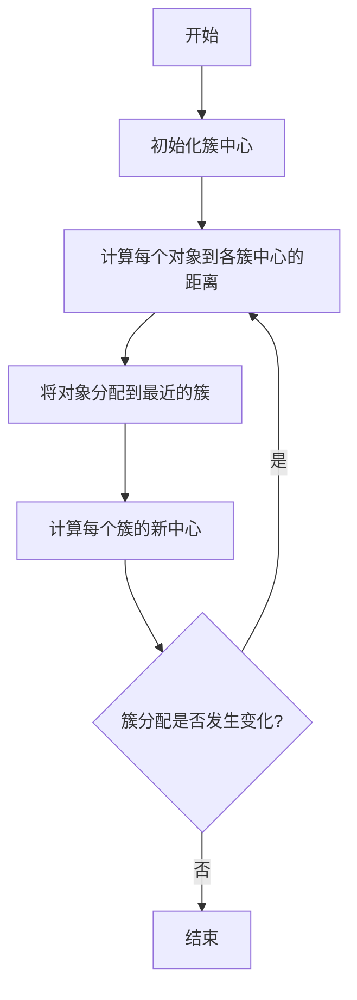

# 聚类算法 原理与代码实例讲解

## 1. 背景介绍

### 1.1 问题的由来

在现实世界中，我们经常会遇到需要对大量数据进行分类和组织的情况。无论是在商业智能、客户关系管理、网络安全还是生物信息学等领域,都存在着对海量数据进行有效分类和挖掘的需求。传统的监督学习方法需要预先标注的训练数据集,而在很多情况下,获取标注数据的成本是非常高昂的。因此,无监督学习算法应运而生,聚类算法作为其中的一种重要方法,可以自动发现数据内在的模式和结构,从而对数据进行合理的划分和分类。

### 1.2 研究现状

聚类算法在过去几十年中得到了广泛的研究和应用。目前,已经提出了多种不同类型的聚类算法,例如:

- **分区聚类算法**:如 K-Means、K-Medoids 等,将数据集划分为互不相交的多个簇。
- **层次聚类算法**:如 BIRCH、CURE 等,通过迭代的聚合或分裂过程形成聚类树状层次结构。
- **密度聚类算法**:如 DBSCAN、OPTICS 等,根据数据点的密度分布特征进行聚类。
- **基于网格的聚类算法**:如 STING、WaveCluster 等,通过将数据空间划分为有限个单元格进行聚类操作。
- **基于模型的聚类算法**:如 EM 算法、概率聚类模型等,假设数据由某种概率分布生成,并通过模型参数估计进行聚类。

这些算法各有优缺点,适用于不同的数据特征和场景。研究人员一直在努力提高聚类算法的鲁棒性、可扩展性和高维数据处理能力。

### 1.3 研究意义

聚类算法在数据挖掘、机器学习、模式识别、图像处理等多个领域都有着广泛的应用。通过对大规模数据进行有效的聚类分析,可以帮助我们发现数据内在的结构和模式,从而为决策分析、异常检测、推荐系统等提供有价值的支持。此外,聚类算法也可以作为其他机器学习任务的预处理步骤,对于提高后续任务的性能具有重要意义。

### 1.4 本文结构

本文将重点介绍几种经典的聚类算法,包括 K-Means、层次聚类和 DBSCAN 等。我们将从以下几个方面进行详细阐述:

1. **核心概念与联系**:阐释聚类算法的基本概念、原理和不同算法之间的联系。
2. **核心算法原理与具体操作步骤**:深入解析每种算法的核心思想、数学模型和实现细节。
3. **数学模型和公式详细讲解与举例说明**:推导聚类算法中常用的数学模型和公式,并通过实例加以说明。
4. **项目实践:代码实例和详细解释说明**:提供 Python 代码实例,并对关键部分进行逐步解读和分析。
5. **实际应用场景**:介绍聚类算法在不同领域的应用案例和实践经验。
6. **工具和资源推荐**:推荐相关的学习资源、开发工具和研究论文等。
7. **总结:未来发展趋势与挑战**:总结聚类算法的研究成果,展望未来的发展方向和面临的挑战。
8. **附录:常见问题与解答**:针对聚类算法中常见的疑难问题进行解答和说明。

通过本文的学习,读者将能够全面掌握聚类算法的核心概念、数学原理和实现细节,并了解其在实际应用中的作用和价值。让我们一起开启聚类算法的探索之旅!

## 2. 核心概念与联系

在深入探讨具体的聚类算法之前,我们先来了解一些核心概念和不同算法之间的联系。

### 2.1 聚类的定义

**聚类(Clustering)**是一种无监督学习技术,旨在根据数据对象之间的相似性或距离,将其自动划分为多个"簇"或"组"。每个簇内部的对象彼此相似,而不同簇之间的对象则存在明显差异。

聚类算法的目标是最大化簇内相似度,最小化簇间相似度,从而发现数据的内在结构和模式。

### 2.2 相似度和距离度量

衡量数据对象之间相似性或差异性的关键在于选择合适的**相似度度量**或**距离度量**。常用的距离度量包括:

- **欧氏距离**:$\sqrt{\sum_{i=1}^{n}(x_i-y_i)^2}$
- **曼哈顿距离**:$\sum_{i=1}^{n}|x_i-y_i|$
- **余弦相似度**:$\frac{\vec{x}\cdot\vec{y}}{||\vec{x}||\times||\vec{y}||}$
- **杰卡德相似系数**:$\frac{|X\cap Y|}{|X\cup Y|}$

不同的距离度量适用于不同的数据类型和应用场景。选择合适的距离度量对聚类结果的准确性至关重要。

### 2.3 聚类算法分类

根据聚类过程的不同,聚类算法可以分为以下几种主要类型:

1. **分区聚类算法**:将数据集划分为互不相交的多个簇,如 K-Means、K-Medoids 等。
2. **层次聚类算法**:通过迭代的聚合或分裂过程形成聚类树状层次结构,如 BIRCH、CURE 等。
3. **密度聚类算法**:根据数据点的密度分布特征进行聚类,如 DBSCAN、OPTICS 等。
4. **基于网格的聚类算法**:将数据空间划分为有限个单元格,并对这些单元格进行聚类操作,如 STING、WaveCluster 等。
5. **基于模型的聚类算法**:假设数据由某种概率分布生成,并通过模型参数估计进行聚类,如 EM 算法、概率聚类模型等。

不同类型的聚类算法适用于不同的数据特征和场景,各有优缺点。选择合适的算法对于获得高质量的聚类结果至关重要。

### 2.4 聚类算法评估指标

评估聚类算法的性能和质量是一个重要的环节。常用的评估指标包括:

- **簇内平方和(Intra-Cluster Sum of Squares, ICSS)**:衡量簇内部的紧密程度。
- **轮廓系数(Silhouette Coefficient)**:综合考虑簇内紧密度和簇间分离度。
- **调整后的兰德指数(Adjusted Rand Index, ARI)**:当有地面真值标签时,可用于评估聚类结果与真实标签的一致性。
- **F measure**:结合了簇的精确率和召回率,用于评估聚类质量。

选择合适的评估指标对于比较不同算法的性能和调优算法参数至关重要。

通过对上述核心概念的理解,我们可以更好地把握聚类算法的本质,为后续的算法原理和实现奠定基础。

## 3. 核心算法原理与具体操作步骤

在本节中,我们将重点介绍三种经典的聚类算法:K-Means 算法、层次聚类算法和 DBSCAN 算法。对于每种算法,我们将从以下几个方面进行详细阐述:

1. 算法原理概述
2. 算法步骤详解
3. 算法优缺点分析
4. 算法应用领域

通过对这些核心算法的深入探讨,读者将能够全面掌握它们的工作机制和实现细节。

### 3.1 K-Means 算法

#### 3.1.1 算法原理概述

K-Means 算法是一种广为人知的分区聚类算法,其目标是将 $n$ 个数据对象划分为 $k$ 个簇,使得簇内对象之间的平方和最小化。算法的基本思想是通过迭代优化的方式,不断调整簇的中心点和对象的簇归属,直至达到收敛。

K-Means 算法的核心思想可以用以下目标函数表示:

$$
J = \sum_{i=1}^{k}\sum_{x \in C_i}||x - \mu_i||^2
$$

其中,$k$ 是簇的数量,$C_i$ 表示第 $i$ 个簇,$\mu_i$ 是第 $i$ 个簇的中心点,目标是最小化所有数据对象到其所属簇中心的平方距离之和。

#### 3.1.2 算法步骤详解

K-Means 算法的具体步骤如下:

1. **初始化**:随机选择 $k$ 个数据对象作为初始簇中心。
2. **簇分配**:对于每个数据对象,计算它与每个簇中心的距离,并将其分配给最近的簇。
3. **更新簇中心**:对于每个簇,重新计算簇中所有对象的均值作为新的簇中心。
4. **迭代**:重复步骤 2 和 3,直到簇分配不再发生变化或达到最大迭代次数。

该算法的关键在于通过不断优化簇中心和对象的簇归属,最终达到目标函数的最小值。

#### 3.1.3 算法优缺点

**优点**:

- 算法思想简单,易于理解和实现。
- 计算复杂度较低,可以处理大规模数据集。
- 对于球形或等高簇,聚类效果较好。

**缺点**:

- 需要预先指定簇的数量 $k$,对结果影响较大。
- 对初始簇中心的选择敏感,可能陷入局部最优解。
- 对噪声和异常值敏感,聚类效果容易受到影响。
- 无法很好地处理非球形或密度不均匀的簇。

#### 3.1.4 算法应用领域

K-Means 算法由于其简单性和高效性,在多个领域都有广泛的应用,包括:

- **客户分类**:根据客户特征对客户进行分组,用于营销策略制定。
- **图像分割**:将图像像素点根据颜色或纹理特征划分为不同的区域。
- **文本挖掘**:根据文本的词频特征对文档进行聚类,用于主题发现和信息检索。
- **基因表达数据分析**:根据基因表达模式对基因进行聚类,用于基因功能研究。

尽管 K-Means 算法存在一些局限性,但由于其简单高效的特点,它仍然是聚类分析中最常用和最基础的算法之一。

### 3.2 层次聚类算法

#### 3.2.1 算法原理概述

层次聚类算法是一种通过迭代的聚合或分裂过程,构建聚类树状层次结构的算法。根据聚类过程的不同,可以分为自底向上的**凝聚层次聚类**和自顶向下的**分裂层次聚类**两种方式。

在凝聚层次聚类中,算法从每个数据对象作为一个单独的簇开始,然后根据某种相似度或距离度量,逐步合并最相似的簇,直到所有对象归为一个簇为止。而在分裂层次聚类中,算法从将所有对象视为一个簇开始,然后根据某种分裂准则,将簇逐步划分为更小的子簇。

无论是凝聚还是分裂,层次聚类算法最终会形成一个树状的层次结构,称为**聚类树(Dendrogram)**。通过对聚类树进行剪枝,可以获得不同层次的聚类结果。

#### 3.2.2 算法步骤详解

以凝聚层次聚类为例,其具体步骤如下:

1. **初始化**:将每个数据对象视为一个单独的簇。
2. **计算簇间距离**:根据所