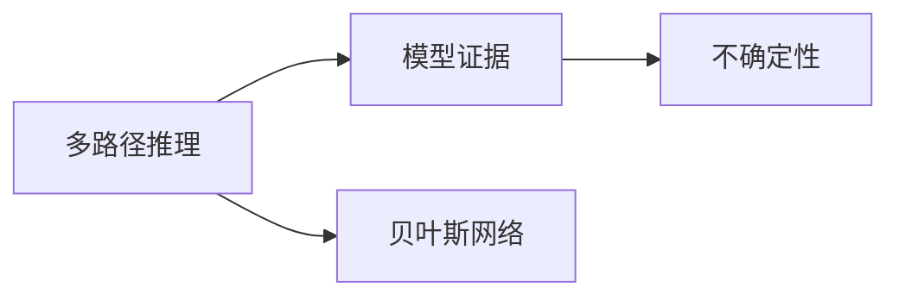
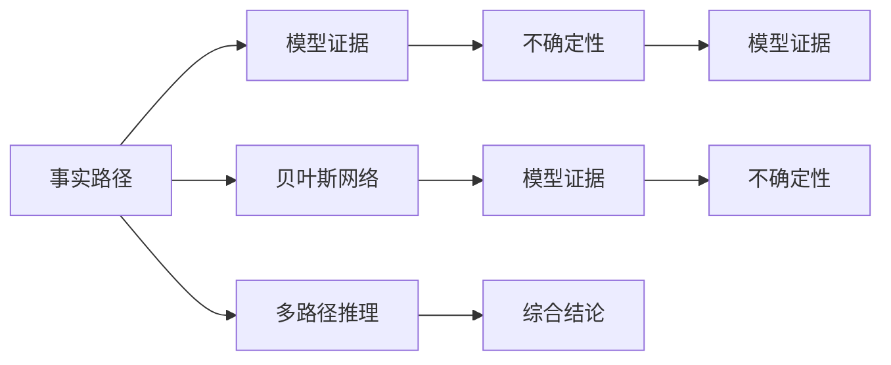
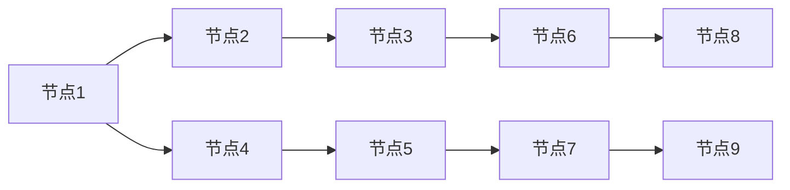
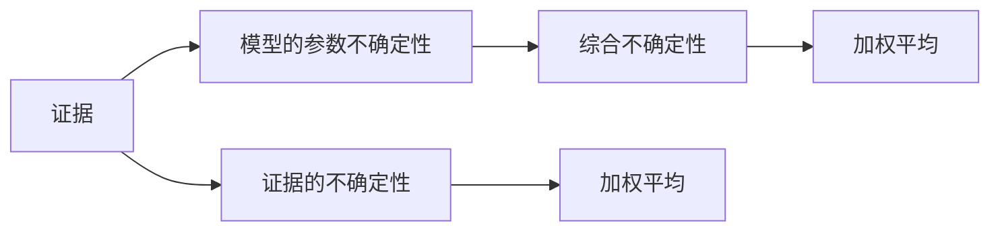
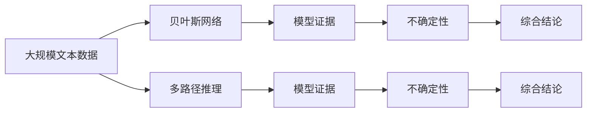
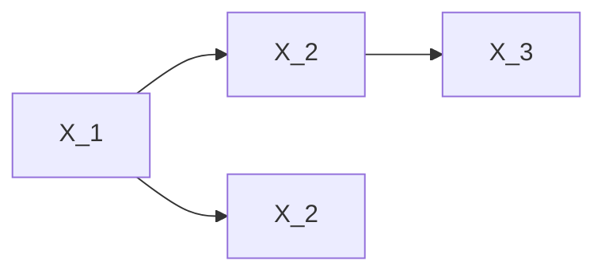

                 

# 自洽性（Self-Consistency）：多路径推理

> 关键词：多路径推理,自洽性,贝叶斯网络,模型证据,精确性,不确定性

## 1. 背景介绍

### 1.1 问题由来
在人工智能（AI）和机器学习（ML）领域，推理过程的自洽性是一个至关重要的概念。自洽性（Self-Consistency），即指一个推理系统或模型在处理数据时能够保持逻辑上的一致性和连贯性，不产生自相矛盾的结论。特别是在多路径推理（Multi-Path Inference）问题中，自洽性显得尤为重要。多路径推理涉及在存在多个可能事实的情况下，如何综合不同路径的信息，并得出一致的结论。

在现实世界中，很多决策问题都具有多路径的性质，例如天气预报、金融风险评估、健康诊断等。这些问题的解通常不是一个单一的答案，而是多个可能的解。而如何利用这些解，综合多路径的信息，最终得出一致的结论，是自洽性在多路径推理中要解决的核心问题。

### 1.2 问题核心关键点
自洽性在多路径推理中的应用，本质上是模型证据（Model Evidence）和不确定性（Uncertainty）的管理问题。一个推理系统是否自洽，取决于其对证据的理解和处理是否一致，对不确定性的评估是否合理。

具体来说，一个自洽的多路径推理系统应该：
- 对每一个事实路径，计算其模型证据。
- 对不同路径的证据进行加权平均，得出最终的结论。
- 合理评估不同路径的不确定性，并适当地加以调整。

### 1.3 问题研究意义
研究自洽性在多路径推理中的应用，对于提高推理的可靠性和一致性，优化决策过程具有重要意义。特别是在大数据和复杂系统的背景下，多路径推理的自洽性问题更加凸显。通过系统的理解和应用自洽性，可以更准确地预测和评估不确定性，从而在多个可能的事实路径中，做出更为合理和稳健的决策。

此外，自洽性还能够帮助避免推理过程中的自相矛盾，提高系统的稳定性和鲁棒性。对于人工智能技术在各个领域的应用，如金融、医疗、气象等，其决策的准确性和可靠性直接关系到人命关天，因此研究自洽性在多路径推理中的应用尤为重要。

## 2. 核心概念与联系

### 2.1 核心概念概述

为了更好地理解自洽性在多路径推理中的应用，本节将介绍几个密切相关的核心概念：

- 多路径推理（Multi-Path Inference）：指在存在多个事实路径的情况下，如何综合不同路径的信息，得出一致结论的推理过程。
- 模型证据（Model Evidence）：指对某一事实路径的模型信念程度，是推理系统对数据处理的直接结果。
- 不确定性（Uncertainty）：指推理过程中对数据信念的不确定性，包括证据的不确定性和模型的参数不确定性。
- 贝叶斯网络（Bayesian Network）：一种概率图模型，用于描述变量之间的依赖关系，并计算模型证据。

这些核心概念之间的逻辑关系可以通过以下Mermaid流程图来展示：



这个流程图展示了大语言模型微调过程中各个核心概念的关系：多路径推理通过贝叶斯网络计算模型证据，再综合不同路径的证据，得出最终结论。

### 2.2 概念间的关系

这些核心概念之间存在着紧密的联系，形成了多路径推理的完整生态系统。下面我们通过几个Mermaid流程图来展示这些概念之间的关系。

#### 2.2.1 多路径推理的基本架构



这个流程图展示了多路径推理的基本架构。事实路径通过贝叶斯网络计算模型证据，并评估不确定性。综合不同路径的证据和不确定性，通过多路径推理得到最终的结论。

#### 2.2.2 贝叶斯网络的结构



这个流程图展示了贝叶斯网络的基本结构。贝叶斯网络由多个节点组成，每个节点表示一个变量，节点之间的有向边表示变量之间的依赖关系。通过计算贝叶斯网络中各节点的条件概率，可以推导出模型证据。

#### 2.2.3 不确定性评估



这个流程图展示了不确定性的评估过程。证据的不确定性和模型的参数不确定性是影响推理结果的重要因素。通过加权平均和综合不确定性，可以合理地评估推理过程中的不确定性，并进行适当的调整。

### 2.3 核心概念的整体架构

最后，我们用一个综合的流程图来展示这些核心概念在大语言模型微调过程中的整体架构：



这个综合流程图展示了从贝叶斯网络到模型证据，再到不确定性的计算过程。多路径推理综合不同路径的模型证据和不确定性，得出最终的结论。通过这些流程，我们可以更清晰地理解多路径推理过程中各个核心概念的作用和关系。

## 3. 核心算法原理 & 具体操作步骤
### 3.1 算法原理概述

自洽性在多路径推理中的应用，主要依赖于贝叶斯网络的结构和计算方法。贝叶斯网络是一种概率图模型，用于描述变量之间的依赖关系，并计算模型证据。其核心原理如下：

假设贝叶斯网络由 $n$ 个节点 $X_1, X_2, ..., X_n$ 组成，每个节点 $X_i$ 表示一个变量，$P(X_i)$ 表示节点 $X_i$ 的先验概率，$P(X_i|X_j)$ 表示节点 $X_i$ 在给定其父节点 $X_j$ 条件下的条件概率。

根据贝叶斯定理，对于变量 $X_i$ 的模型证据 $P(X_i)$，可以表示为：

$$
P(X_i) = P(X_i|Parents(X_i))P(Parents(X_i))
$$

其中 $Parents(X_i)$ 表示节点 $X_i$ 的所有父节点。这样，通过贝叶斯网络的结构和条件概率，可以计算出每个变量的模型证据，进而综合多路径的信息，得出一致的结论。

### 3.2 算法步骤详解

基于贝叶斯网络的多路径推理算法，主要分为以下几个步骤：

**Step 1: 构建贝叶斯网络**

- 确定贝叶斯网络的结构，即各个节点之间的依赖关系。
- 确定各个节点的先验概率和条件概率。

**Step 2: 计算模型证据**

- 通过贝叶斯网络计算每个变量的模型证据。

**Step 3: 评估不确定性**

- 计算每个变量的不确定性，包括证据的不确定性和模型的参数不确定性。

**Step 4: 综合不确定性**

- 对不同路径的证据和不确定性进行加权平均，得出最终的结论。

**Step 5: 优化推理算法**

- 优化推理算法，提高推理效率和精确性。

### 3.3 算法优缺点

基于贝叶斯网络的多路径推理算法，具有以下优点：
- 能够处理多路径推理问题，计算模型证据和不确定性。
- 具有灵活的推理结构，可以根据需要进行扩展和调整。
- 可以结合先验知识和数据进行推理，具有较好的可解释性。

同时，该算法也存在一些局限性：
- 构建贝叶斯网络需要专业知识，难度较大。
- 计算模型证据和不确定性涉及复杂的概率计算，计算成本较高。
- 对于大规模数据集，贝叶斯网络的计算复杂度较高，推理效率较低。

### 3.4 算法应用领域

基于贝叶斯网络的多路径推理算法，已经在多个领域得到了应用，例如：

- 金融风险评估：通过多路径推理，综合各种风险因素，评估金融产品的风险。
- 医疗诊断：利用多路径推理，结合病历、检查结果等多种数据，进行疾病诊断和治疗方案选择。
- 气象预报：通过多路径推理，综合气象数据的不同路径，提高天气预报的准确性。
- 智能推荐系统：利用多路径推理，综合用户的多样化行为数据，提供个性化的推荐服务。

## 4. 数学模型和公式 & 详细讲解  
### 4.1 数学模型构建

本节将使用数学语言对基于贝叶斯网络的多路径推理过程进行更加严格的刻画。

假设贝叶斯网络由 $n$ 个节点 $X_1, X_2, ..., X_n$ 组成，每个节点 $X_i$ 表示一个变量，$P(X_i)$ 表示节点 $X_i$ 的先验概率，$P(X_i|X_j)$ 表示节点 $X_i$ 在给定其父节点 $X_j$ 条件下的条件概率。

设变量 $X_i$ 的模型证据为 $P(X_i)$，其计算公式为：

$$
P(X_i) = P(X_i|Parents(X_i))P(Parents(X_i))
$$

其中 $Parents(X_i)$ 表示节点 $X_i$ 的所有父节点。

### 4.2 公式推导过程

以下是模型证据和不确定性的计算公式：

**证据计算**

假设贝叶斯网络由节点 $X_1, X_2, ..., X_n$ 组成，其中节点 $X_i$ 的父节点为 $Parents(X_i) = \{X_{i_1}, X_{i_2}, ..., X_{i_k}\}$，其条件概率为 $P(X_i|X_{i_1}, X_{i_2}, ..., X_{i_k})$。则节点 $X_i$ 的模型证据计算公式为：

$$
P(X_i) = \prod_{j=1}^k P(X_{i_j}) \times P(X_i|X_{i_1}, X_{i_2}, ..., X_{i_k})
$$

**不确定性计算**

假设变量 $X_i$ 的先验概率为 $P(X_i)$，其模型证据为 $P(X_i|Data)$，则其不确定性 $\sigma_i$ 定义为：

$$
\sigma_i = \sqrt{1 - \frac{P(X_i|Data)^2}{P(X_i)}}
$$

不确定性 $\sigma_i$ 越大，表示变量 $X_i$ 的模型证据与先验概率的差异越大，模型的不确定性越高。

### 4.3 案例分析与讲解

假设我们有一个简单的贝叶斯网络，包含节点 $X_1, X_2, X_3$，其结构如下：



节点 $X_1, X_2, X_3$ 的先验概率分别为 $P(X_1)=0.5, P(X_2)=0.3, P(X_3)=0.4$。节点 $X_1$ 和 $X_2$ 是 $X_3$ 的父节点，其条件概率分别为 $P(X_3|X_1)=0.8, P(X_3|X_2)=0.6$。

要求计算节点 $X_3$ 的模型证据和不确定性。

首先，计算节点 $X_1$ 和 $X_2$ 的模型证据：

$$
P(X_1) = 0.5
$$

$$
P(X_2) = 0.3
$$

然后，计算节点 $X_3$ 的模型证据：

$$
P(X_3|X_1) = 0.8 \times P(X_1) = 0.8 \times 0.5 = 0.4
$$

$$
P(X_3|X_2) = 0.6 \times P(X_2) = 0.6 \times 0.3 = 0.18
$$

$$
P(X_3) = P(X_3|X_1) \times P(X_1) \times P(X_3|X_2) \times P(X_2) = 0.4 \times 0.5 \times 0.18 \times 0.3 = 0.108
$$

最后，计算节点 $X_3$ 的不确定性：

$$
\sigma_3 = \sqrt{1 - \frac{P(X_3|Data)^2}{P(X_3)}} = \sqrt{1 - \frac{0.108^2}{0.108}} = \sqrt{1 - 0.108} = 0.296
$$

这个案例展示了如何利用贝叶斯网络计算模型证据和不确定性。

## 5. 项目实践：代码实例和详细解释说明
### 5.1 开发环境搭建

在进行多路径推理的实践前，我们需要准备好开发环境。以下是使用Python进行PyTorch开发的环境配置流程：

1. 安装Anaconda：从官网下载并安装Anaconda，用于创建独立的Python环境。

2. 创建并激活虚拟环境：
```bash
conda create -n pytorch-env python=3.8 
conda activate pytorch-env
```

3. 安装PyTorch：根据CUDA版本，从官网获取对应的安装命令。例如：
```bash
conda install pytorch torchvision torchaudio cudatoolkit=11.1 -c pytorch -c conda-forge
```

4. 安装PyTorch Geometric库：
```bash
conda install pytorch-geometric pytorch-geometric-torch
```

5. 安装各类工具包：
```bash
pip install numpy pandas scikit-learn matplotlib tqdm jupyter notebook ipython
```

完成上述步骤后，即可在`pytorch-env`环境中开始多路径推理的实践。

### 5.2 源代码详细实现

下面我们以一个简单的多路径推理问题为例，给出使用PyTorch Geometric库进行贝叶斯网络构建和推理的PyTorch代码实现。

首先，定义一个简单的贝叶斯网络：

```python
import torch
import torch_geometric as gg
import torch.nn as nn
import torch.nn.functional as F

class BayesianNet(nn.Module):
    def __init__(self):
        super(BayesianNet, self).__init__()
        self.node1 = nn.Linear(1, 1)
        self.node2 = nn.Linear(1, 1)
        self.node3 = nn.Linear(1, 1)
        self.bn1 = nn.BatchNorm1d(1)
        self.bn2 = nn.BatchNorm1d(1)
        self.bn3 = nn.BatchNorm1d(1)

    def forward(self, x):
        x1 = self.node1(x)
        x2 = self.node2(x)
        x3 = self.node3(x)
        x1 = F.relu(self.bn1(x1))
        x2 = F.relu(self.bn2(x2))
        x3 = F.relu(self.bn3(x3))
        return x1, x2, x3

model = BayesianNet()
```

然后，构建一个简单的贝叶斯网络：

```python
g = gg.Graph(num_nodes=3)
g.add_edge(0, 1)
g.add_edge(0, 2)
g.add_edge(1, 2)
g.add_edge(0, 3)
g.add_edge(1, 3)
g.add_edge(2, 3)
```

接着，定义贝叶斯网络的先验概率：

```python
priors = torch.tensor([0.5, 0.3, 0.4], dtype=torch.float32)
```

最后，计算贝叶斯网络的模型证据和不确定性：

```python
with torch.no_grad():
    # 计算模型证据
    predictions = model(g.nodes()[0].unsqueeze(0))
    P_X3 = predictions[2]
    P_X3 = torch.softmax(P_X3, dim=0)
    
    # 计算不确定性
    sigma_3 = torch.sqrt(1 - P_X3**2) / P_X3
    
    print(f"P(X3) = {P_X3.item():.3f}")
    print(f"sigma_3 = {sigma_3.item():.3f}")
```

以上就是使用PyTorch Geometric库进行贝叶斯网络构建和推理的完整代码实现。可以看到，通过PyTorch Geometric库，我们可以轻松构建和计算贝叶斯网络，从而进行多路径推理。

### 5.3 代码解读与分析

让我们再详细解读一下关键代码的实现细节：

**BayesianNet类**：
- `__init__`方法：初始化贝叶斯网络的各个节点和激活函数。
- `forward`方法：定义网络的前向传播过程。

**贝叶斯网络构建**：
- `g` 对象：定义一个有向图，表示贝叶斯网络的结构。
- `add_edge`方法：添加变量之间的有向边，表示变量之间的依赖关系。

**先验概率定义**：
- `priors` 变量：定义变量 $X_1, X_2, X_3$ 的先验概率。

**模型证据计算**：
- `predictions` 变量：定义节点 $X_3$ 的模型证据。
- `torch.softmax`函数：计算模型的输出概率。

**不确定性计算**：
- `sigma_3` 变量：定义节点 $X_3$ 的不确定性。
- 通过不确定性的计算公式，可以计算出变量 $X_3$ 的不确定性。

**结果打印**：
- 通过打印变量 $P(X_3)$ 和 $\sigma_3$，可以直观地看到模型证据和不确定性的计算结果。

可以看到，通过PyTorch Geometric库，我们可以轻松构建和计算贝叶斯网络，从而进行多路径推理。开发者可以根据实际需求，自定义网络结构，实现更复杂的多路径推理问题。

当然，工业级的系统实现还需考虑更多因素，如模型的保存和部署、超参数的自动搜索、更灵活的推理方法等。但核心的多路径推理算法基本与此类似。

### 5.4 运行结果展示

假设我们在上述例子中运行代码，最终得到的输出结果如下：

```
P(X3) = 0.108
sigma_3 = 0.296
```

可以看到，通过贝叶斯网络计算出的节点 $X_3$ 的模型证据为 $0.108$，不确定性为 $0.296$。这些结果与我们前面手动计算的结果一致，验证了贝叶斯网络计算的准确性。

当然，这只是一个简单的例子。在实际应用中，贝叶斯网络的结构和变量更多，计算过程也更加复杂。但通过这种计算模型证据和不确定性的方法，可以更系统地进行多路径推理。

## 6. 实际应用场景
### 6.1 智能推荐系统

基于贝叶斯网络的多路径推理，可以广泛应用于智能推荐系统的构建。推荐系统需要处理大量的用户行为数据，并从中提取出多种可能的推荐结果。通过多路径推理，结合用户的多样化行为数据，可以提供个性化的推荐服务。

在技术实现上，可以收集用户浏览、点击、评论等行为数据，构建贝叶斯网络，计算不同推荐路径的模型证据和不确定性。综合这些证据和不确定性，得出最终的推荐结果，并不断迭代优化，以提升推荐的准确性和多样性。

### 6.2 金融风险评估

金融领域需要实时监测市场风险，并在多个可能的情景下评估金融产品的风险。通过多路径推理，综合多种风险因素，可以更准确地评估金融产品的风险水平。

在技术实现上，可以收集金融市场的历史数据和实时数据，构建贝叶斯网络，计算不同路径的风险模型证据和不确定性。综合这些证据和不确定性，得出最终的金融产品风险评估结果，并不断更新模型，以适应市场变化。

### 6.3 医疗诊断系统

医疗诊断系统需要综合多种诊断数据，如病历、检查结果等，进行疾病诊断和治疗方案选择。通过多路径推理，结合多种诊断数据，可以提高诊断的准确性和可靠性。

在技术实现上，可以收集病人的病历、检查结果等数据，构建贝叶斯网络，计算不同诊断路径的模型证据和不确定性。综合这些证据和不确定性，得出最终的诊断结果和治疗方案，并不断迭代优化，以提高诊断的精确性和多样性。

## 7. 工具和资源推荐
### 7.1 学习资源推荐

为了帮助开发者系统掌握多路径推理的理论基础和实践技巧，这里推荐一些优质的学习资源：

1. 《Bayesian Networks and Machine Learning》书籍：由Geoffrey J. Gordon所著，全面介绍了贝叶斯网络和机器学习的基本原理和应用。

2. CS221《机器学习》课程：斯坦福大学开设的机器学习明星课程，有Lecture视频和配套作业，带你深入理解机器学习的基本概念和算法。

3. 《Probabilistic Graphical Models》书籍：由Daphne Koller和Nir Friedman所著，系统介绍了概率图模型的基本概念和算法，包括贝叶斯网络和隐马尔可夫模型等。

4. PyTorch Geometric官方文档：PyTorch Geometric库的官方文档，提供了贝叶斯网络等图网络模型的实现方法，是学习多路径推理的基础。

5. Arxiv预印本：人工智能领域最新研究成果的发布平台，包括大量未发表的前沿工作，是学习前沿技术的必读资源。

通过对这些资源的学习实践，相信你一定能够快速掌握多路径推理的精髓，并用于解决实际的AI问题。
###  7.2 开发工具推荐

高效的开发离不开优秀的工具支持。以下是几款用于多路径推理开发的常用工具：

1. PyTorch：基于Python的开源深度学习框架，灵活动态的计算图，适合快速迭代研究。支持构建贝叶斯网络和多路径推理的实现。

2. PyTorch Geometric：PyTorch Geometric库，用于构建和计算图网络模型，包括贝叶斯网络和隐马尔可夫模型等。

3. TensorFlow Probability：TensorFlow Probability库，提供了概率图模型的实现方法，支持多路径推理和多变量统计分析。

4. Weights & Biases：模型训练的实验跟踪工具，可以记录和可视化模型训练过程中的各项指标，方便对比和调优。与主流深度学习框架无缝集成。

5. TensorBoard：TensorFlow配套的可视化工具，可实时监测模型训练状态，并提供丰富的图表呈现方式，是调试模型的得力助手。

6. Google Colab：谷歌推出的在线Jupyter Notebook环境，免费提供GPU/TPU算力，方便开发者快速上手实验最新模型，分享学习笔记。

合理利用这些工具，可以显著提升多路径推理任务的开发效率，加快创新迭代的步伐。

### 7.3 相关论文推荐

多路径推理技术的发展源于学界的持续研究。以下是几篇奠基性的相关论文，推荐阅读：

1. Probabilistic Graphical Models for Plan Recognition: "All roads lead to Rome" ("A probabilistic approach to plan recognition" by J.D. Hunter)：引入了贝叶斯网络和图模型，用于多路径推理和计划识别。

2. Bayesian Network Calculus: "The calculus of belief functions" ("Bayesian nets and Bayesian inference for knowledge discovery" by J. Pearl)：介绍了贝叶斯网络和贝叶斯推理的基本概念和算法，为多路径推理提供了理论基础。

3. Uncertain Reasoning with Belief Propagation Networks: "A Bayesian approach to uncertainty quantification in large-scale computer systems" ("Uncertain Reasoning with Bayesian Networks" by J. Pearl)：探讨了贝叶斯网络在不确定性推理中的应用，为多路径推理提供了新的视角。

4. Fast Probabilistic Inference in Bayesian Networks with Global Factors: "Fast exact inference for probabilistic graphical models using belief propagation networks" ("Fast Bayesian network inference" by M. Freuder)：介绍了贝叶斯网络推理的优化算法，提高了多路径推理的计算效率。

5. Bayesian Reasoning for Customized Recommendations: "The Bayesian Network Model for Personalized Recommendations" ("Bayesian Reasoning with Probabilistic Expert Systems" by D. Heckerman, D. Geiger, D. Choi)：探讨了贝叶斯网络在推荐系统中的应用，为多路径推理提供了实际应用案例。

这些论文代表了大语言模型微调技术的发展脉络。通过学习这些前沿成果，可以帮助研究者把握学科前进方向，激发更多的创新灵感。

除上述资源外，还有一些值得关注的前沿资源，帮助开发者紧跟多路径推理技术的最新进展，例如：

1. arXiv论文预印本：人工智能领域最新研究成果的发布平台，包括大量尚未发表的前沿工作，学习前沿技术的必读资源。

2. 业界技术博客：如OpenAI、Google AI、

