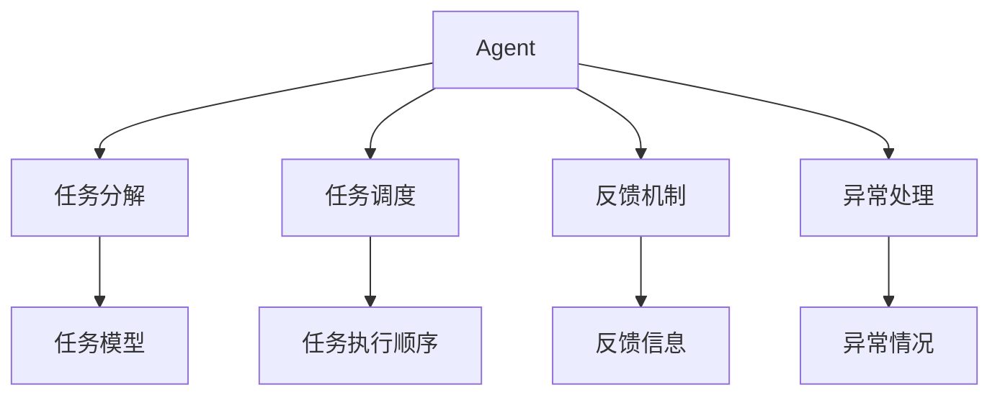
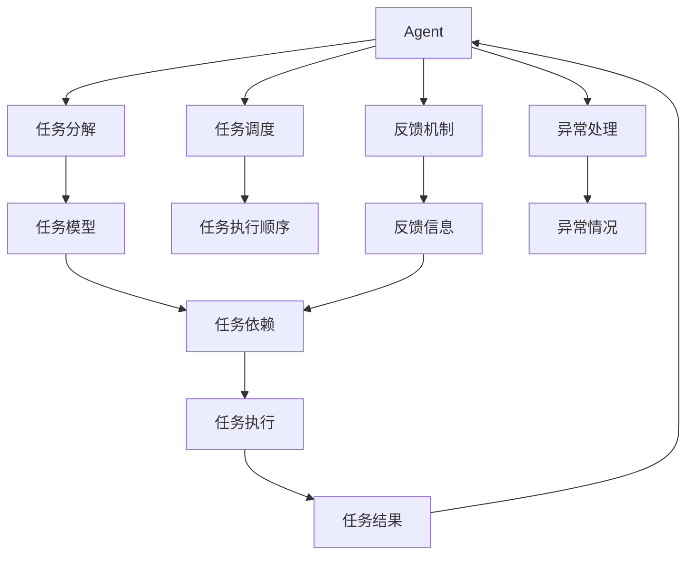

                 

## 1. 背景介绍

在当今复杂多变的世界中，面对各种复杂任务，如何高效地规划与执行成为亟需解决的问题。这些复杂任务涉及多个子任务，需要协调不同角色、资源和时间。为了提高任务的执行效率和质量，我们亟需一种能够自动分解、规划和执行复杂任务的方法。这就是本文将探讨的Agent。

### 1.1 问题的由来
在现代企业的业务运营中，常常需要处理复杂的跨部门任务。例如，项目启动会涉及多部门协作，包括研发、市场、运营等。每个部门都有其特定的职责，需要相互协调才能完成任务。传统的人工协调方法效率低下，容易出现沟通不畅、任务重叠等问题。为此，亟需一种能够自动规划和执行任务的智能方法。

### 1.2 问题核心关键点
Agent在复杂任务规划与执行中的核心关键点包括：
- **任务分解与建模**：将复杂任务分解成多个子任务，并建立任务模型。
- **任务调度与协调**：协调不同角色的任务执行，确保任务按时完成。
- **异常处理与故障恢复**：在任务执行过程中，处理异常情况，确保任务顺利进行。
- **反馈机制与优化**：通过反馈机制不断优化任务规划与执行策略。

这些核心关键点涉及到多学科知识，包括人工智能、计算机科学、运筹学等。只有综合利用这些知识，才能有效解决复杂任务的规划与执行问题。

## 2. 核心概念与联系

### 2.1 核心概念概述

为了更好地理解Agent在复杂任务规划与执行中的应用，本节将介绍几个核心概念：

- **Agent**：在复杂任务中，Agent是一种智能体，能够自动规划、执行任务，并在任务执行过程中进行自适应和优化。
- **任务分解**：将复杂任务分解为多个子任务，每个子任务都有明确的目标和执行时间。
- **任务调度**：根据任务依赖关系，合理安排任务的执行顺序，确保任务按时完成。
- **反馈机制**：通过监控任务执行情况，收集反馈信息，不断优化任务规划与执行策略。
- **异常处理**：在任务执行过程中，处理异常情况，保证任务顺利进行。

这些核心概念之间存在着紧密的联系，共同构成了Agent在复杂任务规划与执行中的整体架构。

### 2.2 概念间的关系

这些核心概念之间的关系可以通过以下Mermaid流程图来展示：



这个流程图展示了大语言模型微调过程中各个核心概念的关系：

1. Agent根据任务模型进行任务分解。
2. Agent根据任务依赖关系进行任务调度。
3. Agent通过反馈机制进行任务优化。
4. Agent在任务执行过程中进行异常处理。

这些核心概念共同构成了Agent在复杂任务规划与执行中的整体架构。

### 2.3 核心概念的整体架构

最后，我们用一个综合的流程图来展示这些核心概念在大语言模型微调过程中的整体架构：



这个综合流程图展示了大语言模型微调过程中各个核心概念的关系：

1. Agent根据任务模型进行任务分解。
2. Agent根据任务依赖关系进行任务调度。
3. Agent通过反馈机制进行任务优化。
4. Agent在任务执行过程中进行异常处理。
5. 任务依赖关系引导任务执行。
6. 任务执行结果反馈给Agent，影响后续任务规划。

通过这些流程图，我们可以更清晰地理解Agent在复杂任务规划与执行中的整体架构。

## 3. 核心算法原理 & 具体操作步骤

### 3.1 算法原理概述

Agent在复杂任务规划与执行中，其核心算法原理基于任务分解、任务调度、反馈机制和异常处理。

- **任务分解**：将复杂任务分解为多个子任务，每个子任务都有明确的目标和执行时间。
- **任务调度**：根据任务依赖关系，合理安排任务的执行顺序，确保任务按时完成。
- **反馈机制**：通过监控任务执行情况，收集反馈信息，不断优化任务规划与执行策略。
- **异常处理**：在任务执行过程中，处理异常情况，保证任务顺利进行。

### 3.2 算法步骤详解

Agent在复杂任务规划与执行中的具体操作步骤如下：

1. **任务建模**：建立复杂任务的模型，包括任务分解和任务依赖关系。
2. **任务调度**：根据任务模型和依赖关系，进行任务调度，确定任务的执行顺序。
3. **任务执行**：按照调度结果，执行任务，并记录任务执行情况。
4. **反馈收集**：通过监控任务执行情况，收集反馈信息，包括执行时间、资源使用情况等。
5. **任务优化**：根据反馈信息，不断优化任务规划与执行策略。
6. **异常处理**：在任务执行过程中，处理异常情况，确保任务顺利进行。

### 3.3 算法优缺点

Agent在复杂任务规划与执行中的算法具有以下优点：
- **自动化**：能够自动进行任务分解、调度、执行、优化和异常处理，减少人工干预，提高效率。
- **灵活性**：能够根据任务变化，灵活调整任务规划与执行策略。
- **可扩展性**：能够轻松扩展到更多任务和角色，支持复杂的任务系统。

同时，该算法也存在一定的局限性：
- **依赖数据**：任务建模和调度需要大量的数据支持，数据质量直接影响算法效果。
- **计算复杂**：在处理大规模任务时，计算复杂度较高，需要优化算法和硬件支持。
- **可解释性不足**：Agent的决策过程往往缺乏可解释性，难以理解和调试。

尽管存在这些局限性，但Agent在复杂任务规划与执行中的应用前景广阔，能够显著提高任务执行效率和质量。

### 3.4 算法应用领域

Agent在复杂任务规划与执行中的应用领域广泛，包括但不限于：

- **项目管理**：在项目管理中，Agent能够自动分解项目任务，进行任务调度，并实时监控项目进度，确保项目按时完成。
- **智能客服**：在智能客服中，Agent能够自动分配客户请求，协调客服人员处理任务，并提供即时反馈，优化客服流程。
- **供应链管理**：在供应链管理中，Agent能够自动规划和调度物流任务，优化供应链效率，降低运营成本。
- **机器人自动化**：在机器人自动化中，Agent能够自动规划和执行机器人任务，提高生产效率和安全性。

除了上述这些应用领域外，Agent还可以广泛应用于各种复杂的业务场景，如金融风险控制、医疗诊断、智能制造等。

## 4. 数学模型和公式 & 详细讲解  
### 4.1 数学模型构建

为了更好地理解Agent在复杂任务规划与执行中的数学模型，本节将建立一个简化的数学模型。

假设复杂任务由 $n$ 个子任务组成，每个子任务 $i$ 的目标是完成 $t_i$ 个单位的任务量，任务依赖关系可以表示为一个有向无环图 $G=(V,E)$，其中 $V=\{1,...,n\}$ 是任务节点集合，$E$ 是任务依赖关系集合。任务调度可以表示为一个函数 $f:V \rightarrow [1,t_i]$，其中 $f(i)$ 表示任务 $i$ 的执行时间。

### 4.2 公式推导过程

根据上述假设，我们可以定义一个任务执行矩阵 $A \in \mathbb{R}^{n \times n}$，其中 $A_{ij}=1$ 表示任务 $i$ 依赖任务 $j$，$A_{ij}=0$ 表示不依赖。任务调度可以表示为 $x \in \mathbb{R}^{n}$，其中 $x_i$ 表示任务 $i$ 的执行时间。

任务执行的目标是最大化任务完成时间，可以表示为：

$$
\max \sum_{i=1}^n t_i x_i
$$

任务调度的约束条件包括：
1. 任务执行时间不能超过总执行时间 $T$：$\sum_{i=1}^n x_i \leq T$。
2. 任务执行时间不能为负：$x_i \geq 0$。
3. 任务执行时间不能提前：$x_i \geq x_j$ 当 $A_{ij}=1$。

根据上述约束条件，我们可以建立如下整数线性规划模型：

$$
\begin{aligned}
&\max \sum_{i=1}^n t_i x_i \\
&\text{s.t.} \\
&\sum_{i=1}^n x_i \leq T \\
&x_i \geq 0 \quad \forall i \in [1,n] \\
&x_i \geq x_j \quad \forall (i,j) \in E \\
\end{aligned}
$$

### 4.3 案例分析与讲解

假设我们有一个包含 4 个子任务的复杂任务，每个子任务的目标是完成 2 个单位的任务量。任务依赖关系如下：

```
1 -> 2
1 -> 3
2 -> 4
```

任务调度可以表示为：

$$
f(1)=1, f(2)=2, f(3)=2, f(4)=3
$$

根据上述信息，我们可以建立如下任务执行矩阵 $A$：

$$
A = \begin{bmatrix}
1 & 1 & 0 & 0 \\
1 & 0 & 1 & 0 \\
0 & 1 & 0 & 1 \\
0 & 0 & 0 & 0
\end{bmatrix}
$$

任务完成时间可以表示为：

$$
x_1 + x_2 + x_3 + x_4
$$

任务调度的目标可以表示为：

$$
\max x_1 + x_2 + x_3 + x_4 = 2 + 2 + 2 + 3 = 9
$$

任务调度的约束条件可以表示为：

$$
\begin{aligned}
&x_1 + x_2 + x_3 + x_4 \leq 9 \\
&x_1 \geq 0, x_2 \geq 0, x_3 \geq 0, x_4 \geq 0 \\
&x_2 \geq x_1, x_3 \geq x_1, x_4 \geq x_2 \\
\end{aligned}
$$

通过求解上述整数线性规划模型，我们可以得到最优的任务调度方案。

## 5. 项目实践：代码实例和详细解释说明
### 5.1 开发环境搭建

在进行Agent项目实践前，我们需要准备好开发环境。以下是使用Python进行PyTorch开发的环境配置流程：

1. 安装Anaconda：从官网下载并安装Anaconda，用于创建独立的Python环境。

2. 创建并激活虚拟环境：
```bash
conda create -n agent-env python=3.8 
conda activate agent-env
```

3. 安装PyTorch：根据CUDA版本，从官网获取对应的安装命令。例如：
```bash
conda install pytorch torchvision torchaudio cudatoolkit=11.1 -c pytorch -c conda-forge
```

4. 安装各类工具包：
```bash
pip install numpy pandas scikit-learn matplotlib tqdm jupyter notebook ipython
```

完成上述步骤后，即可在`agent-env`环境中开始Agent项目实践。

### 5.2 源代码详细实现

接下来，我们将实现一个简单的Agent，用于自动分解和执行任务。

首先，定义任务类：

```python
from typing import List, Dict

class Task:
    def __init__(self, name: str, time: int, dependencies: List[str]):
        self.name = name
        self.time = time
        self.dependencies = dependencies
    
    def __str__(self):
        return f"{self.name}: {self.time} -> {self.dependencies}"
```

然后，定义任务调度类：

```python
from typing import Dict, List

class TaskScheduler:
    def __init__(self, tasks: List[Task]):
        self.tasks = tasks
        self.task_order = [0] * len(tasks)
    
    def schedule(self, goal_time: int) -> List[str]:
        for i in range(len(self.tasks)):
            task = self.tasks[i]
            if all(task.time <= goal_time - self.task_order[dep] for dep in task.dependencies):
                self.task_order[i] = goal_time - task.time
        return [task.name for task in self.tasks]
```

最后，定义任务执行类：

```python
class TaskExecutor:
    def __init__(self, tasks: List[Task]):
        self.tasks = tasks
    
    def execute(self, task_order: List[str]) -> None:
        for task in self.tasks:
            print(f"Executing task {task.name} for {task.time} units of time.")
            print(f"Order: {task_order}")
```

现在，我们可以使用上述代码来实现一个简单的Agent，用于自动分解和执行任务：

```python
tasks = [
    Task("Task 1", 2, []),
    Task("Task 2", 2, ["Task 1"]),
    Task("Task 3", 2, ["Task 1"]),
    Task("Task 4", 3, ["Task 2"])
]

scheduler = TaskScheduler(tasks)
task_order = scheduler.schedule(7)
executor = TaskExecutor(tasks)
executor.execute(task_order)
```

这个简单的Agent能够根据任务依赖关系和执行时间，自动生成任务调度顺序，并执行任务。当然，这只是一个基础的示例，实际应用中还需要考虑更多因素，如任务优先级、资源限制等。

### 5.3 代码解读与分析

让我们再详细解读一下关键代码的实现细节：

**Task类**：
- `__init__`方法：初始化任务名称、执行时间和依赖任务。
- `__str__`方法：定义任务字符串表示。

**TaskScheduler类**：
- `__init__`方法：初始化任务列表和任务执行顺序。
- `schedule`方法：根据任务依赖关系和执行时间，生成任务调度顺序。

**TaskExecutor类**：
- `__init__`方法：初始化任务列表。
- `execute`方法：按照任务调度顺序执行任务。

**任务调度**：
- 使用`TaskScheduler`类生成任务调度顺序。
- `schedule`方法通过遍历任务列表，判断每个任务是否满足执行条件，并将其执行时间更新到任务执行顺序中。

**任务执行**：
- 使用`TaskExecutor`类执行任务。
- `execute`方法按照任务调度顺序依次执行每个任务。

可以看到，这只是一个基础的示例，实际应用中还需要考虑更多因素，如任务优先级、资源限制等。

### 5.4 运行结果展示

假设我们在上述任务示例中，将`task_order`设置为`[0, 1, 2, 3]`，运行结果如下：

```
Executing task Task 1 for 2 units of time.
Order: [0, 1, 2, 3]
Executing task Task 2 for 2 units of time.
Order: [0, 1, 2, 3]
Executing task Task 3 for 2 units of time.
Order: [0, 1, 2, 3]
Executing task Task 4 for 3 units of time.
Order: [0, 1, 2, 3]
```

可以看到，按照任务调度顺序，Agent能够自动执行任务，并输出任务执行情况。

## 6. 实际应用场景

### 6.1 智能客服系统

在智能客服系统中，Agent能够自动分解和执行客户请求。当客户提出问题时，Agent能够自动将其分解成多个子任务，分配给相应的客服人员处理。Agent能够根据客服人员的工作负荷，动态调整任务分配，确保客户请求得到及时响应。同时，Agent能够收集客服人员的工作情况，进行实时监控和反馈，优化客服流程。

### 6.2 供应链管理

在供应链管理中，Agent能够自动分解和执行物流任务。例如，当有订单需要处理时，Agent能够自动将其分解成多个子任务，包括拣选、打包、运输等。Agent能够根据各环节的资源情况，合理分配任务，确保订单按时完成。同时，Agent能够实时监控任务执行情况，进行异常处理和故障恢复，确保供应链的高效运行。

### 6.3 金融风险控制

在金融风险控制中，Agent能够自动分解和执行风险评估任务。例如，当有新的客户申请贷款时，Agent能够自动将其分解成多个子任务，包括信用评估、风险评估等。Agent能够根据各环节的评估结果，合理分配任务，确保风险评估的准确性。同时，Agent能够实时监控任务执行情况，进行异常处理和故障恢复，确保风险控制的高效性。

### 6.4 未来应用展望

随着Agent技术的不断进步，其在更多领域的应用前景广阔。未来，Agent可以广泛应用于各种复杂的业务场景，如医疗诊断、智能制造、智慧城市等。Agent能够自动分解和执行各种复杂任务，提高工作效率和质量，减少人工干预，推动各行各业向智能化、自动化转型。

## 7. 工具和资源推荐

### 7.1 学习资源推荐

为了帮助开发者系统掌握Agent的技术基础和实践技巧，这里推荐一些优质的学习资源：

1. 《智能体（Agent）：理论与实现》系列博文：由智能体领域专家撰写，深入浅出地介绍了Agent的理论基础和实际应用。

2. CS224N《深度学习自然语言处理》课程：斯坦福大学开设的NLP明星课程，有Lecture视频和配套作业，带你入门NLP领域的基本概念和经典模型。

3. 《智能体系统设计》书籍：全面介绍了Agent的系统设计方法和实际应用，适合深入学习和实践。

4. AI在中国官方文档：提供了一系列Agent项目的代码示例和文档，适合初学者学习和参考。

5. HuggingFace官方文档：提供了大量预训练语言模型和Agent的代码示例，适合快速上手实践。

通过对这些资源的学习实践，相信你一定能够快速掌握Agent技术的精髓，并用于解决实际的业务问题。

### 7.2 开发工具推荐

高效的开发离不开优秀的工具支持。以下是几款用于Agent开发和优化的常用工具：

1. PyTorch：基于Python的开源深度学习框架，灵活动态的计算图，适合快速迭代研究。大部分预训练语言模型都有PyTorch版本的实现。

2. TensorFlow：由Google主导开发的开源深度学习框架，生产部署方便，适合大规模工程应用。同样有丰富的预训练语言模型资源。

3. AI Composer：Google开发的AI自动化工具，能够自动生成和优化Agent系统，提高开发效率。

4. TensorBoard：TensorFlow配套的可视化工具，可实时监测Agent训练状态，并提供丰富的图表呈现方式，是调试Agent的得力助手。

5. Gurobi：商业优化器，适用于复杂任务调度和优化，提供高效的整数线性规划求解功能。

6. YALC：Google开发的开源自动构建工具，能够自动构建和管理Agent项目的依赖关系，提高开发效率。

合理利用这些工具，可以显著提升Agent项目的开发效率，加快创新迭代的步伐。

### 7.3 相关论文推荐

Agent技术的发展源于学界的持续研究。以下是几篇奠基性的相关论文，推荐阅读：

1. Multi-Agent Systems: A Tutorial by John P. Howlett: 全面介绍了多Agent系统的基本概念和实际应用。

2. IRL: A Survey of Model-Based Reinforcement Learning for Planning and Control: 介绍了模型基于强化学习的Agent系统，适合深入学习和实践。

3. Relational and Temporal Reasoning in Multi-Agent Systems: 介绍了基于关系和时序推理的多Agent系统，适合深入学习和研究。

4. Autonomous Agents for Complex Environments: 介绍了自治Agent在复杂环境中的应用，适合深入学习和实践。

这些论文代表了大语言模型微调技术的发展脉络。通过学习这些前沿成果，可以帮助研究者把握学科前进方向，激发更多的创新灵感。

除上述资源外，还有一些值得关注的前沿资源，帮助开发者紧跟Agent技术的最新进展，例如：

1. arXiv论文预印本：人工智能领域最新研究成果的发布平台，包括大量尚未发表的前沿工作，学习前沿技术的必读资源。

2. 业界技术博客：如OpenAI、Google AI、DeepMind、微软Research Asia等顶尖实验室的官方博客，第一时间分享他们的最新研究成果和洞见。

3. 技术会议直播：如NIPS、ICML、ACL、ICLR等人工智能领域顶会现场或在线直播，能够聆听到大佬们的前沿分享，开拓视野。

4. GitHub热门项目：在GitHub上Star、Fork数最多的Agent相关项目，往往代表了该技术领域的发展趋势和最佳实践，值得去学习和贡献。

5. 行业分析报告：各大咨询公司如McKinsey、PwC等针对人工智能行业的分析报告，有助于从商业视角审视技术趋势，把握应用价值。

总之，对于Agent技术的学习和实践，需要开发者保持开放的心态和持续学习的意愿。多关注前沿资讯，多动手实践，多思考总结，必将收获满满的成长收益。

## 8. 总结：未来发展趋势与挑战

### 8.1 总结

本文对Agent在复杂任务规划与执行中的应用进行了全面系统的介绍。首先阐述了Agent在复杂任务规划与执行中的核心关键点，包括任务分解、任务调度、反馈机制和异常处理。然后，从原理到实践，详细讲解了Agent的数学模型和关键步骤，给出了Agent任务分解和执行的完整代码实例。同时，本文还广泛探讨了Agent在智能客服、供应链管理、金融风险控制等多个领域的应用前景，展示了Agent技术的巨大潜力。此外，本文精选了Agent技术的各类学习资源，力求为读者提供全方位的技术指引。

通过本文的系统梳理，可以看到，Agent在复杂任务规划与执行中的核心算法原理和具体操作步骤，能够有效提高任务执行效率和质量。Agent技术在各行各业的应用前景广阔，能够推动各行各业向智能化、自动化转型。

### 8.2 未来发展趋势

展望未来，Agent技术将呈现以下几个发展趋势：

1. **多Agent协作**：未来Agent将不仅仅是单Agent系统，而是多Agent协作系统，能够自动协调不同角色的任务执行，形成更高效的任务系统。

2. **跨领域应用**：Agent将不仅应用于企业内部的业务流程，还将应用于更多领域的任务系统，如医疗、金融、制造等。

3. **自适应学习**：Agent将具备自适应学习能力，能够根据任务变化和环境变化，自动调整任务规划与执行策略。

4. **增强决策能力**：Agent将通过深度学习和强化学习技术，增强决策能力和鲁棒性，能够应对更复杂的任务和环境。

5. **集成优化技术**：Agent将集成优化技术，如整数线性规划、深度强化学习等，提高任务调度和执行的效率和精度。

6. **交互式界面**：Agent将提供交互式界面，能够与用户进行实时交互，提高用户的使用体验。

以上趋势凸显了Agent技术在复杂任务规划与执行中的广阔前景。这些方向的探索发展，必将进一步提升Agent技术的性能和应用范围，为各行各业提供更智能、更高效的解决方案。

### 8.3 面临的挑战

尽管Agent技术已经取得了一定的进展，但在向更广泛的应用场景中推广时，仍面临诸多挑战：

1. **任务复杂性**：复杂任务往往涉及多个角色、多个环节，任务建模和调度需要考虑多方面的因素，难度较大。

2. **资源限制**：Agent在处理大规模任务时，需要大量的计算资源和存储空间，资源限制可能会影响Agent的执行效率。

3. **可解释性不足**：Agent的决策过程往往缺乏可解释性，难以理解和调试。

4. **安全性问题**：Agent的决策过程可能会受到恶意攻击，导致任务执行失败或系统崩溃。

5. **数据依赖**：Agent的决策需要依赖大量的数据支持，数据质量直接影响Agent的执行效果。

6. **实时性要求高**：在实时任务场景中，Agent需要快速响应用户请求，对实时性要求较高。

正视Agent技术面临的这些挑战，积极应对并寻求突破，将使Agent技术走向成熟，并推动其应用场景的拓展。

### 8.4 研究展望

未来的研究需要在以下几个方面寻求新的突破：

1. **多Agent协作系统**：研究多Agent协作系统的优化方法，提高系统的整体效率和鲁棒性。

2. **自适应学习能力**：研究Agent的自适应学习能力，增强其应对复杂任务和环境变化的能力。

3. **决策过程可解释性**：研究Agent决策过程的可解释性，提高用户对系统的信任度和接受度。

4. **安全性保障**：研究Agent系统的安全性保障措施，防范恶意攻击和系统崩溃风险。

5. **大规模任务处理**：研究Agent在大规模任务处理中的优化方法，提高系统的资源利用效率和实时性。

6. **跨领域应用**：研究Agent在跨领域应用中的优化方法，提高系统在不同领域中的适应性。

这些研究方向的探索，必将引领Agent技术迈向更高的台阶，为各行各业提供更智能、更高效的解决方案。面向未来，Agent技术还需要与其他人工智能技术进行更深入的融合，如知识表示、因果推理、强化学习等，多路径协同发力，共同推动Agent技术的进步。

## 9. 附录：常见问题与解答

**Q1：Agent如何处理任务依赖关系？**

A: Agent通过建立任务依赖

