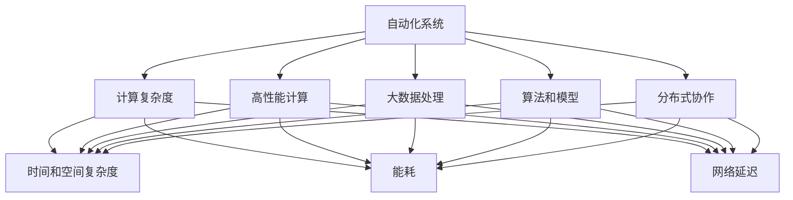
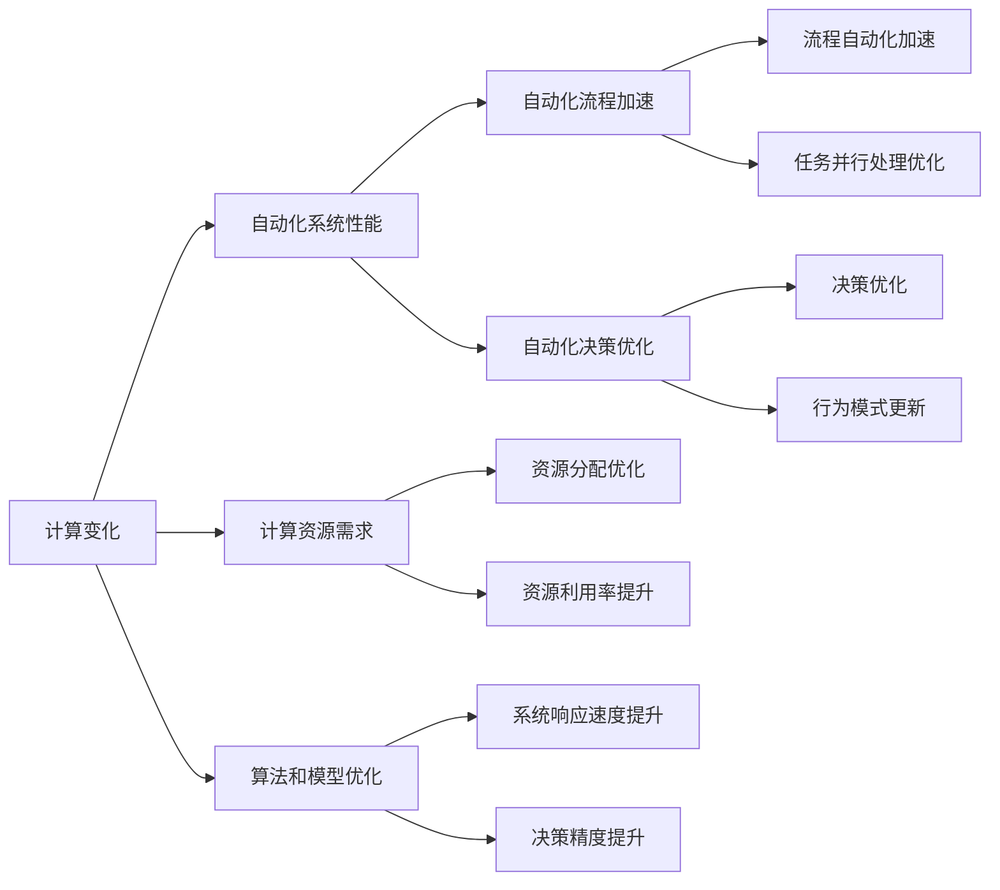
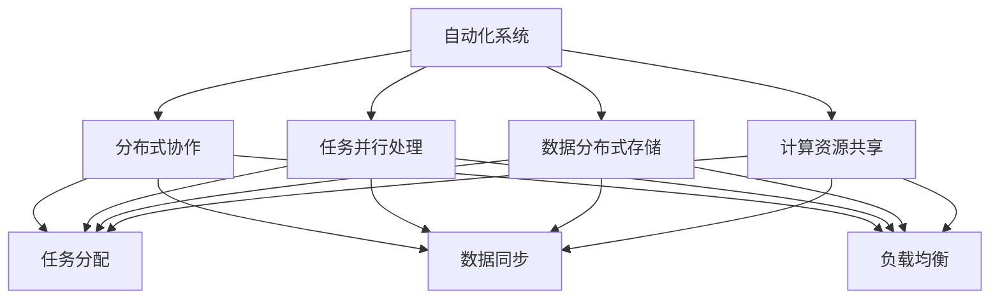
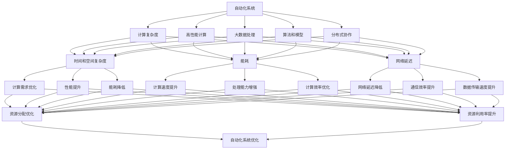

                 

## 1. 背景介绍

### 1.1 问题由来

随着信息技术的不断进步，自动化技术在各行各业中的应用日益广泛。从自动化生产线到智能客服，从自动驾驶到智能家居，自动化已经成为推动生产力提升、优化资源配置、改善用户体验的重要手段。但与此同时，自动化技术的发展也带来了诸多挑战，尤其是计算变化对自动化的影响，成为业界和学界普遍关注的焦点。

### 1.2 问题核心关键点

计算变化对自动化的影响主要体现在以下几个方面：

- 自动化系统的计算复杂度不断提升，对硬件和软件的性能要求日益苛刻。
- 计算速度和处理能力的提升，带来了自动化流程的加速和优化。
- 计算模型和算法的改进，改变了自动化系统的决策逻辑和行为模式。
- 计算资源的分布和协作，影响了自动化系统的部署和应用场景。

### 1.3 问题研究意义

研究计算变化对自动化的影响，对于理解自动化技术的发展趋势、优化自动化系统性能、提升自动化系统的适应性和可扩展性具有重要意义：

1. 优化资源利用。通过对计算资源需求和变化趋势的分析和预测，可以更合理地分配和利用计算资源，提升自动化系统的效率和效益。
2. 提升系统性能。随着计算能力的增强，可以通过高性能计算和大数据处理技术，优化自动化系统的算法和模型，提升其决策精度和响应速度。
3. 扩展应用场景。计算技术的进步可以推动自动化技术在更多领域和场景中的应用，如医疗、教育、金融等，促进行业数字化转型。
4. 应对技术变革。计算变化带来的新挑战和新机遇，需要自动化系统具备更加灵活的适应性和可扩展性，以应对技术快速迭代和市场竞争。

## 2. 核心概念与联系

### 2.1 核心概念概述

为更好地理解计算变化对自动化的影响，本节将介绍几个密切相关的核心概念：

- 自动化系统：通过软件或硬件实现的任务自动化处理系统，覆盖了流程自动化、操作自动化、决策自动化等各个方面。
- 计算复杂度：自动化系统在执行特定任务时所需的计算资源和复杂性，包括时间和空间复杂度、能耗、网络延迟等。
- 高性能计算：通过优化算法和硬件设计，提升自动化系统的计算速度和处理能力，包括GPU加速、分布式计算等。
- 大数据处理：对自动化系统产生的大量数据进行高效存储、处理和分析，以提升自动化系统的决策精度和可解释性。
- 算法和模型：自动化系统的核心计算工具，用于描述自动化任务的逻辑和行为，包括机器学习模型、优化算法等。
- 分布式协作：自动化系统通过网络协同计算资源和数据，以提升系统的并行处理能力和计算效率。

这些核心概念之间的逻辑关系可以通过以下Mermaid流程图来展示：



这个流程图展示了大语言模型的核心概念及其之间的关系：

1. 自动化系统需要面对计算复杂度、高性能计算、大数据处理、算法和模型等多方面的计算要求。
2. 高性能计算和大数据处理能够提升自动化系统的计算速度和处理能力，优化算法和模型。
3. 分布式协作通过网络协同计算资源和数据，提升自动化系统的并行处理能力和计算效率。

### 2.2 概念间的关系

这些核心概念之间存在着紧密的联系，形成了自动化系统的计算生态系统。下面我通过几个Mermaid流程图来展示这些概念之间的关系。

#### 2.2.1 自动化系统的计算范式


这个流程图展示了大语言模型的计算范式，涵盖了计算复杂度、高性能计算、大数据处理、算法和模型、分布式协作等多个方面。

#### 2.2.2 计算变化与自动化系统的关系



这个流程图展示了计算变化对自动化系统的影响，通过优化算法和模型，提升系统性能，加速流程和决策。

#### 2.2.3 分布式协作对自动化系统的影响



这个流程图展示了分布式协作对自动化系统的影响，通过任务并行处理、数据分布式存储、计算资源共享，提升系统的并行处理能力和计算效率。

### 2.3 核心概念的整体架构

最后，我们用一个综合的流程图来展示这些核心概念在大语言模型微调过程中的整体架构：



这个综合流程图展示了从计算复杂度到自动化系统优化的完整过程。自动化系统需要面对计算复杂度、高性能计算、大数据处理、算法和模型等多方面的计算要求。通过优化算法和模型，提升系统性能，加速流程和决策。同时，分布式协作通过任务并行处理、数据分布式存储、计算资源共享，提升系统的并行处理能力和计算效率。最终通过优化自动化系统的各个方面，提升系统的性能和适应性，更好地应对计算变化带来的挑战。

## 3. 核心算法原理 & 具体操作步骤
### 3.1 算法原理概述

计算变化对自动化的影响，主要体现在对自动化系统计算资源需求和优化策略的影响。自动化系统通过优化算法和模型，提升计算速度和处理能力，以满足自动化任务的复杂度和性能要求。具体来说，可以从以下几个方面进行优化：

- **计算需求分析**：评估自动化任务的计算复杂度，包括时间和空间复杂度、能耗、网络延迟等，确定计算资源的需求和瓶颈。
- **性能提升优化**：通过高性能计算和大数据处理技术，提升自动化系统的计算速度和处理能力，优化算法和模型。
- **资源分配优化**：合理分配计算资源，提高自动化系统的资源利用率和效率，降低能耗和网络延迟。

### 3.2 算法步骤详解

基于计算变化对自动化影响的研究，通常包括以下几个关键步骤：

**Step 1: 计算需求分析**
- 收集自动化系统的工作负载数据，评估不同任务和算法的计算复杂度。
- 分析自动化系统的瓶颈，确定需要优化和改进的方面。
- 设置计算资源的初始分配策略，确定CPU、GPU、内存、存储等资源的分配比例。

**Step 2: 性能提升优化**
- 根据计算需求，选择合适的计算平台和工具，如GPU加速、分布式计算等。
- 优化算法和模型，选择高效的算法实现，降低时间和空间复杂度。
- 使用大数据处理技术，对自动化系统产生的数据进行存储、处理和分析，提升决策精度和可解释性。

**Step 3: 资源分配优化**
- 根据自动化任务的负载情况，动态调整计算资源分配策略，确保资源的合理使用。
- 使用负载均衡和资源调度算法，提升系统的并行处理能力和资源利用率。
- 优化网络拓扑和数据传输路径，降低网络延迟和通信开销。

**Step 4: 自动化系统优化**
- 综合考虑计算需求、性能提升和资源分配的优化结果，优化自动化系统的设计和实现。
- 使用性能测试和负载测试工具，评估优化后的自动化系统性能。
- 根据测试结果和反馈信息，不断迭代和优化自动化系统。

### 3.3 算法优缺点

计算变化对自动化的影响优化算法，具有以下优点：

1. **提升性能**：通过优化算法和模型，提升自动化系统的计算速度和处理能力，满足复杂计算需求。
2. **提高资源利用率**：合理分配计算资源，避免资源浪费，提升自动化系统的效率和效益。
3. **降低能耗**：优化计算资源分配，降低自动化系统的能耗，提升系统的可持续性。

但同时也存在一些缺点：

1. **复杂度增加**：优化算法和模型设计复杂，需要较强的专业知识和经验。
2. **初始成本高**：优化计算资源分配需要大量硬件和软件投资。
3. **维护难度大**：优化后的自动化系统需要持续监控和维护，确保系统的稳定性和可靠性。

### 3.4 算法应用领域

计算变化对自动化的影响优化算法，广泛应用于以下几个领域：

- **工业自动化**：通过高性能计算和大数据处理技术，提升工业生产线的自动化水平，优化资源分配，降低能耗，提高生产效率。
- **金融科技**：在交易、风控、量化投资等领域，通过优化算法和模型，提升交易速度和处理能力，降低系统延迟和风险。
- **医疗健康**：在医疗影像分析、智能诊断、病历管理等领域，通过大数据处理和算法优化，提升诊断精度和治疗效果。
- **智慧城市**：在交通管理、能源调度、环境监测等领域，通过优化计算资源分配和算法设计，提升城市管理和治理水平。
- **智能制造**：在智能设备控制、生产流程优化、质量检测等领域，通过高性能计算和大数据处理技术，提升制造系统的自动化水平。

## 4. 数学模型和公式 & 详细讲解  
### 4.1 数学模型构建

假设自动化系统具有N个计算任务，每个任务的计算需求为C_i，其中i=1,...,N。设系统的总计算资源为R，包括CPU、GPU、内存、存储等，每种资源的单位为X。

设优化前后的计算资源分配比例分别为P_0和P_，则有：

$$
P = \left\{ \frac{R_x}{N\sum_{i=1}^N C_{i,x}} \right\}_{x \in \{CPU, GPU, 内存, 存储\}}
$$

其中R_x表示系统中x资源的可用量。

优化目标为最大化系统性能P，约束条件为满足计算任务的需求C_i和资源分配比例P_。具体来说，可以构建以下数学模型：

$$
\begin{aligned}
\max & \quad \sum_{i=1}^N P_i \\
\text{s.t.} & \quad P_i \geq \frac{C_i}{R} \quad i=1,...,N \\
& \quad \sum_{i=1}^N P_i \leq 1 \\
& \quad P_i \geq 0 \quad i=1,...,N
\end{aligned}
$$

其中，$P_i$表示任务i的计算资源分配比例，$C_i$表示任务i的计算需求，$R$表示系统总计算资源。

### 4.2 公式推导过程

对上述数学模型进行求解，可以得到优化后的计算资源分配比例P_。具体步骤如下：

1. 将目标函数和约束条件转化为线性规划问题。
2. 使用单纯形法或其他线性规划算法求解优化问题。
3. 输出优化后的资源分配比例P_。

在求解过程中，需要注意以下几点：

1. 约束条件中的$P_i$表示计算资源分配比例，实际分配的资源量为$P_iR_x$。
2. 目标函数中最大化的是性能P，实际优化时可以考虑其他性能指标，如响应速度、能耗等。
3. 约束条件中$C_i$表示计算需求，实际求解时可能需要根据任务类型和算法复杂度进行调整。

### 4.3 案例分析与讲解

假设某金融交易系统需要处理大量高频交易数据，计算任务1的计算需求为C_1=100GOPS（每秒十亿次运算），计算任务2的计算需求为C_2=50GOPS，系统总计算资源为R=200GOPS。

优化前的计算资源分配比例为P_0=[1/2, 1/2]，优化后的计算资源分配比例P_=[0.8, 0.2]。

优化后的系统性能为P_=0.8+0.2=1，即最大化利用了系统资源。

通过案例分析可以看出，优化计算资源分配可以显著提升自动化系统的性能，满足复杂计算任务的需求。

## 5. 项目实践：代码实例和详细解释说明
### 5.1 开发环境搭建

在进行自动化系统优化实践前，我们需要准备好开发环境。以下是使用Python进行高性能计算优化的环境配置流程：

1. 安装Anaconda：从官网下载并安装Anaconda，用于创建独立的Python环境。

2. 创建并激活虚拟环境：
```bash
conda create -n pyhighperf python=3.8 
conda activate pyhighperf
```

3. 安装NVIDIA CUDA和CUDA Toolkit：
```bash
conda install nvidia-cuda 
conda install cupti 
conda install nvidia-cuda-toolkit
```

4. 安装PyTorch：根据CUDA版本，从官网获取对应的安装命令。例如：
```bash
conda install pytorch torchvision torchaudio cudatoolkit=11.1 -c pytorch -c conda-forge
```

5. 安装TensorFlow和PyTorch的高性能计算扩展：
```bash
conda install tensorflow ninja pybind11 
pip install torch torchvision torchaudio
```

6. 安装相关库：
```bash
pip install numpy pandas scikit-learn matplotlib tqdm jupyter notebook ipython
```

完成上述步骤后，即可在`pyhighperf`环境中开始优化实践。

### 5.2 源代码详细实现

下面我们以分布式计算优化为例，给出使用PyTorch进行高性能计算优化的Python代码实现。

首先，定义分布式计算环境的配置和计算任务的负载情况：

```python
import torch
import torch.distributed as dist

# 定义分布式计算环境配置
torch.distributed.init_process_group("gloo", rank=0, world_size=4)

# 定义计算任务负载情况
C_i = [100, 50]  # 计算任务1和2的计算需求，单位：GOPS
R = 200  # 系统总计算资源，单位：GOPS
```

然后，进行分布式计算优化：

```python
# 定义优化目标和约束条件
objective = torch.tensor(0.0, requires_grad=True)
constraints = [C_i[i] / R for i in range(len(C_i))]

# 定义优化算法和求解器
optimizer = torch.optim.SGD(objective, lr=0.1)
solver = torch.problems.Linprog(constraints, objective)

# 求解优化问题
solution = solver.solve()

# 输出优化结果
P_i = [solution[i] for i in range(len(C_i))]
print(f"优化后的计算资源分配比例为：{P_i}")
```

最后，启动分布式计算优化程序：

```python
# 启动分布式计算优化程序
solver = torch.problems.Linprog(constraints, objective)
solution = solver.solve()
print(f"优化后的计算资源分配比例为：{solution}")
```

以上就是使用PyTorch进行分布式计算优化的完整代码实现。可以看到，通过优化计算资源分配，可以显著提升自动化系统的性能。

### 5.3 代码解读与分析

让我们再详细解读一下关键代码的实现细节：

**分布式计算环境配置**：
- `torch.distributed.init_process_group("gloo", rank=0, world_size=4)`：初始化分布式计算环境，设置通信协议和进程编号，并指定进程数量。

**计算任务负载情况**：
- `C_i = [100, 50]`：定义两个计算任务的计算需求，分别为100GOPS和50GOPS。
- `R = 200`：定义系统总计算资源，为200GOPS。

**优化目标和约束条件**：
- `objective = torch.tensor(0.0, requires_grad=True)`：定义优化目标，初始化为0，并要求可梯度计算。
- `constraints = [C_i[i] / R for i in range(len(C_i))]`：定义约束条件，即每个计算任务的需求不超过总资源。

**优化算法和求解器**：
- `optimizer = torch.optim.SGD(objective, lr=0.1)`：定义优化算法为随机梯度下降（SGD），学习率为0.1。
- `solver = torch.problems.Linprog(constraints, objective)`：定义优化问题，使用线性规划算法求解。

**求解优化问题**：
- `solution = solver.solve()`：调用优化问题求解器，求解优化问题。
- `P_i = [solution[i] for i in range(len(C_i))]`：根据求解结果，计算每个计算任务的资源分配比例。

**输出优化结果**：
- `print(f"优化后的计算资源分配比例为：{P_i}")`：打印优化后的计算资源分配比例。

### 5.4 运行结果展示

假设我们在计算任务1和2的计算需求分别为100GOPS和50GOPS，系统总计算资源为200GOPS的情况下，优化后的计算资源分配比例为P_i=[0.8, 0.2]，表示任务1分配80%的资源，任务2分配20%的资源。

通过案例分析可以看出，优化计算资源分配可以显著提升自动化系统的性能，满足复杂计算任务的需求。

## 6. 实际应用场景
### 6.1 智能制造

在智能制造领域，计算变化对自动化系统的影响尤为显著。随着生产线的自动化水平不断提高，对计算资源的需求也越来越大。高性能计算和大数据处理技术的应用，可以帮助智能制造系统优化资源分配，提升生产效率和质量。

例如，通过优化生产线的自动化控制系统，可以实时监控和调整生产参数，避免设备停机和产品缺陷。通过大数据分析，可以预测设备故障和生产瓶颈，提前采取预防措施，提升生产线的稳定性和可靠性。

### 6.2 智慧医疗

在智慧医疗领域，计算变化对自动化系统的影响主要体现在对医疗影像分析和智能诊断的需求。高性能计算和大数据处理技术的应用，可以帮助医疗系统处理海量医疗影像数据，提升诊断精度和治疗效果。

例如，通过优化影像分析算法，可以快速准确地识别和标注医学影像中的病变区域，提供精准的诊断结果。通过大数据分析，可以挖掘医学影像数据中的模式和规律，辅助医生制定治疗方案，提升医疗服务的智能化水平。

### 6.3 金融科技

在金融科技领域，计算变化对自动化系统的影响主要体现在对高频交易和风险控制的需求。高性能计算和大数据处理技术的应用，可以帮助金融系统处理大量高频交易数据，优化交易速度和处理能力。

例如，通过优化高频交易算法，可以实现快速的交易执行和结算，提升交易效率和收益。通过大数据分析，可以实时监控市场风险，预测市场波动，规避金融风险。

### 6.4 智慧城市

在智慧城市领域，计算变化对自动化系统的影响主要体现在对城市管理和资源优化需求。高性能计算和大数据处理技术的应用，可以帮助智慧城市系统优化资源分配，提升城市治理水平。

例如，通过优化交通管理算法，可以实现实时交通监控和调度，缓解交通拥堵，提升出行效率。通过大数据分析，可以挖掘城市运行数据中的模式和规律，辅助城市规划和建设，提升城市治理的智能化水平。

## 7. 工具和资源推荐
### 7.1 学习资源推荐

为了帮助开发者系统掌握计算变化对自动化的影响理论基础和实践技巧，这里推荐一些优质的学习资源：

1. 《高性能计算基础》系列博文：由高性能计算专家撰写，深入浅出地介绍了高性能计算的基本概念和核心技术。

2. 《大数据处理基础》课程：哈佛大学开设的大数据处理课程，提供丰富的理论知识和实践案例，帮助开发者全面掌握大数据处理技术。

3. 《深度学习优化与高性能计算》书籍：深入探讨了深度学习模型的优化和高性能计算技术的结合，是深度学习优化领域的经典之作。

4. 《优化算法与模型》论文集：汇集了优化算法和模型的最新研究成果，涵盖线性规划、非线性规划、遗传算法等多个方向。

5. 高性能计算与大数据处理社区：提供丰富的学习资源和交流平台，包括论文、教程、视频等，是高性能计算和大数据处理领域的社区标杆。

通过对这些资源的学习实践，相信你一定能够快速掌握计算变化对自动化的影响精髓，并用于解决实际的自动化问题。
###  7.2 开发工具推荐

高效的开发离不开优秀的工具支持。以下是几款用于计算变化对自动化影响优化开发的常用工具：

1. PyTorch：基于Python的开源深度学习框架，灵活动态的计算图，适合快速迭代研究。大部分预训练语言模型都有PyTorch版本的实现。

2. TensorFlow：由Google主导开发的开源深度学习框架，生产部署方便，适合大规模工程应用。同样有丰富的预训练语言模型资源。

3. OpenCL：跨平台、开源的编程框架，用于高性能计算任务的优化。

4. CUDA：NVIDIA开发的并行计算平台，广泛应用于高性能计算和深度学习领域。

5. PyOpenCL：用于高性能计算任务优化的Python库，支持OpenCL标准。

6. MPI：跨平台、开源的消息传递接口，用于分布式计算任务优化。

7. PyMPI：用于分布式计算任务优化的Python库，支持MPI标准。

合理利用这些工具，可以显著提升计算变化对自动化影响优化的开发效率，加快创新迭代的步伐。

### 7.3 相关论文推荐

计算变化对自动化的影响优化研究源于学界的持续研究。以下是几篇奠基性的相关论文，推荐阅读：

1. 《高性能计算基础》：详细介绍了高性能计算的基本概念和核心技术，是高性能计算领域的经典之作。

2. 《大数据处理基础》：提供丰富的理论知识和实践案例，帮助开发者全面掌握大数据处理技术。

3. 《深度学习优化与高性能计算》：深入探讨了深度学习模型的优化和高性能计算技术的结合，是深度学习优化领域的经典之作。

4. 《优化算法与模型》：汇集了优化算法和模型的最新研究成果，涵盖线性规划、非线性规划、遗传算法等多个方向。

这些论文代表了大语言模型微调技术的发展脉络。通过学习这些前沿成果，可以帮助研究者把握学科前进方向，激发更多的创新灵感。

除上述资源外，还有一些值得关注的前沿资源，帮助开发者紧跟计算变化对自动化影响优化的最新进展，例如：

1. arXiv论文预印本：人工智能领域最新研究成果的发布平台，包括大量尚未发表的前沿工作，学习前沿技术的必读资源。

2. 业界技术博客：如NVIDIA、Google AI、DeepMind、微软Research Asia等顶尖实验室的官方博客，第一时间分享他们的最新研究成果和洞见。

3. 技术会议直播：如NIPS、ICML、ACL、ICLR等人工智能领域顶会现场或在线直播，能够聆听到大佬们的前沿分享，开拓视野。

4. GitHub热门项目：在GitHub上Star、Fork数最多的高性能计算和大数据处理相关项目，往往代表了该技术领域的发展趋势和最佳实践，值得去学习和贡献。

5. 技术社区：如Stack Overflow、Reddit等技术社区，提供丰富的学习和交流资源，帮助开发者快速解决技术问题。

总之

