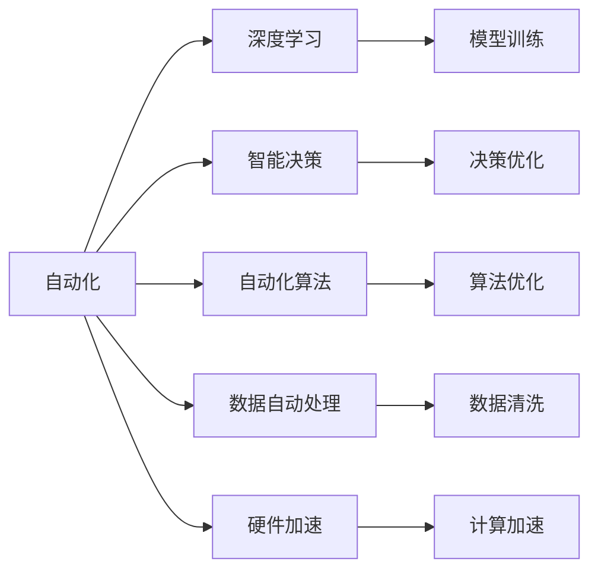

                 

# 计算领域的自动化发展趋势

## 1. 背景介绍

### 1.1 问题由来

随着技术的进步，计算领域正在经历一场前所未有的变革。从早期的纯硬件技术到如今的深度学习、自动化、智能算法，计算能力越来越强大。但与此同时，计算领域也面临着诸多挑战：

- **自动化程度的提升**：自动化正在改变传统工作方式，但如何提升自动化水平，如何使得人工智能系统更好地服务于人类，成为一大难题。
- **数据处理能力**：大规模数据集的生成、处理和分析对计算能力提出了更高要求，如何更高效地进行数据处理，仍然需要不断探索。
- **算法优化**：深度学习等算法需要耗费大量时间和计算资源进行训练和优化，如何更快速地训练出高精度的模型，是业界追求的目标。
- **硬件支撑**：不断增长的计算需求，对硬件设施也提出了更高要求，如何突破硬件瓶颈，是自动化发展的重要方向。

### 1.2 问题核心关键点

自动化在计算领域的应用，从最早的工业自动化，到如今的数据自动化、算法自动化、智能决策等领域，展示了其强大的潜力。但自动化技术在不同领域的应用，也面临着不同的挑战和问题：

- **数据质量与数据隐私**：自动化的实现需要大量高质量数据，但数据隐私问题不容忽视。如何在保证数据隐私的前提下，获得高质量的训练数据，是自动化技术面临的重大问题。
- **模型泛化能力**：自动化算法需要在不同场景下保持一致的性能，但不同场景下的数据分布往往有很大差异。如何增强模型的泛化能力，使其在不同场景下都能稳定表现，是研究难点。
- **算法透明性与可解释性**：自动化算法的黑箱特性，使得其难以被理解和调试。如何增强算法的透明性和可解释性，是提升算法可信度的关键。
- **硬件加速**：深度学习等算法对计算能力要求极高，但硬件资源的有限性，难以满足大规模计算需求。如何通过硬件加速技术，提升计算效率，是自动化发展的必要手段。
- **算力需求与资源管理**：随着自动化技术的应用，计算需求不断增加，如何更高效地管理算力资源，平衡计算成本与性能，是自动化应用的重要问题。

这些核心关键点，对自动化技术在计算领域的应用具有重要意义。本文将围绕自动化发展的核心问题，系统探讨自动化技术在计算领域的应用和未来发展趋势。

## 2. 核心概念与联系

### 2.1 核心概念概述

- **自动化（Automation）**：指通过技术手段，使系统能够自动完成某些任务，从而减少人工干预。
- **深度学习（Deep Learning）**：一种基于神经网络的机器学习技术，能够自动学习复杂特征，用于分类、回归、生成等任务。
- **智能决策（AI Decision Making）**：利用深度学习等算法，使系统能够自动做出决策，提高决策的效率和准确性。
- **自动化算法（Automatic Algorithm）**：一种可以自动优化和调整的算法，通过不断的学习和调整，提升算法的性能。
- **数据自动处理（Automatic Data Processing）**：指利用算法自动对数据进行清洗、归一化、特征工程等处理，提升数据的质量和可利用性。
- **硬件加速（Hardware Acceleration）**：通过专用硬件设备（如GPU、TPU等），提升算法的计算速度和效率。

这些核心概念之间的逻辑关系可以通过以下Mermaid流程图来展示：



这个流程图展示了自动化技术在计算领域的应用场景：

1. 自动化技术与深度学习结合，用于模型训练。
2. 自动化技术应用于智能决策过程，提高决策效率。
3. 自动化算法用于优化算法性能，提升算法效果。
4. 自动化技术用于数据处理，提升数据质量。
5. 硬件加速技术用于提升计算速度，支撑深度学习等高计算量算法。

### 2.2 概念间的关系

这些核心概念之间存在着紧密的联系，构成了自动化技术在计算领域的应用框架。

- **自动化与深度学习的结合**：通过深度学习技术，自动化系统可以自动处理复杂的非结构化数据，提高数据处理的效率和准确性。
- **自动化与智能决策的结合**：自动化系统可以在大规模数据中自动学习决策规则，提高决策的效率和准确性，从而提升业务效率。
- **自动化算法与深度学习的结合**：自动化算法可以自动优化深度学习模型，提升模型性能，减少人工调参的复杂度。
- **数据自动处理与深度学习的结合**：通过自动处理技术，深度学习模型可以更高效地进行数据预处理，提升训练效率和模型效果。
- **硬件加速与深度学习的结合**：硬件加速技术可以大大提升深度学习算法的计算效率，加速模型训练和推理过程。

## 3. 核心算法原理 & 具体操作步骤

### 3.1 算法原理概述

基于自动化技术的深度学习系统，通常包括数据自动处理、模型自动训练、算法自动优化等多个环节。其核心思想是通过自动化技术，提升系统处理数据的效率和效果，同时提高算法的性能和可解释性。

一般而言，自动化深度学习系统由以下几个关键模块组成：

- **数据自动处理模块**：用于对数据进行清洗、归一化、特征工程等预处理，提升数据质量。
- **模型自动训练模块**：用于自动选择合适的模型结构和超参数，进行模型训练。
- **算法自动优化模块**：用于自动调整算法的参数，优化算法性能。
- **智能决策模块**：用于自动化决策，提高决策效率。
- **硬件加速模块**：用于提升计算速度，加速模型训练和推理。

### 3.2 算法步骤详解

基于自动化技术的深度学习系统的具体实施步骤包括以下几个关键环节：

1. **数据收集与预处理**：
   - 数据收集：收集与任务相关的数据，如用户行为数据、市场数据等。
   - 数据清洗：去除噪声数据、填补缺失值、处理异常值等。
   - 数据归一化：将数据转化为标准格式，方便后续处理。
   - 特征工程：提取和构造有助于模型训练的特征，提升模型效果。

2. **模型选择与训练**：
   - 模型选择：根据任务特点，选择合适的深度学习模型，如卷积神经网络（CNN）、循环神经网络（RNN）、Transformer等。
   - 模型超参数设置：设置模型的超参数，如学习率、批大小等。
   - 模型训练：使用自动化算法，自动调整模型超参数，进行模型训练。

3. **算法优化与调整**：
   - 算法优化：使用自动化算法，自动调整深度学习算法的参数，提升算法性能。
   - 算法验证：在验证集上验证算法效果，根据评估结果进行参数调整。

4. **智能决策与部署**：
   - 智能决策：使用自动化的深度学习系统进行智能决策，提升决策效率。
   - 模型部署：将训练好的模型部署到生产环境，进行实时推理。

5. **性能监控与优化**：
   - 性能监控：实时监控模型性能，识别和解决问题。
   - 系统优化：根据性能监控结果，进行系统优化，提升系统性能。

### 3.3 算法优缺点

自动化深度学习系统具有以下优点：

- **高效性**：自动化系统可以自动处理数据、训练模型、优化算法，节省大量人工时间，提升处理效率。
- **可扩展性**：自动化系统可以根据任务需求，动态扩展处理能力和计算资源，适应不同规模的任务。
- **稳定性**：自动化系统通过自动调整参数，减少人为错误，提高系统的稳定性和可靠性。
- **灵活性**：自动化系统可以根据任务特点，灵活调整算法和模型，提升系统性能。

但同时也存在一些缺点：

- **数据隐私**：自动化系统在数据处理过程中，可能泄露用户隐私信息，需采取措施保护数据隐私。
- **算法黑箱**：自动化系统中的算法和模型难以解释，需提高算法的透明性和可解释性。
- **计算资源消耗**：自动化系统对计算资源要求较高，需考虑硬件加速技术以提升计算效率。
- **模型泛化能力**：自动化系统在不同场景下，模型泛化能力有限，需不断优化算法和模型，提升泛化能力。

### 3.4 算法应用领域

基于自动化技术的深度学习系统，在各个领域都有广泛应用，以下是几个典型的应用场景：

1. **金融风险管理**：
   - 利用自动化系统，自动处理金融数据，训练风险评估模型，提升风险管理效率。
   - 使用自动化系统进行智能决策，优化投资策略，提升收益。

2. **医疗诊断与治疗**：
   - 利用自动化系统，自动处理医疗数据，训练疾病诊断模型，提升诊断效率。
   - 使用自动化系统进行智能治疗方案推荐，提升治疗效果。

3. **智能客服与客户关系管理**：
   - 利用自动化系统，自动处理客户咨询数据，训练智能客服系统，提升服务效率。
   - 使用自动化系统进行客户行为分析，提升客户关系管理水平。

4. **智能推荐系统**：
   - 利用自动化系统，自动处理用户行为数据，训练推荐模型，提升推荐效果。
   - 使用自动化系统进行智能决策，优化推荐策略，提升用户体验。

5. **智能制造与生产管理**：
   - 利用自动化系统，自动处理生产数据，训练智能制造模型，提升生产效率。
   - 使用自动化系统进行智能决策，优化生产计划，提升生产管理水平。

## 4. 数学模型和公式 & 详细讲解 & 举例说明

### 4.1 数学模型构建

基于自动化技术的深度学习系统，通常通过数据自动处理、模型自动训练、算法自动优化等多个环节实现。这里以一个典型的自动化深度学习系统为例，展示其数学模型的构建过程。

假设任务为二分类问题，输入数据为 $x$，标签为 $y$。系统的目标是最小化损失函数 $\mathcal{L}$，使模型预测结果与真实标签尽可能一致。

系统包括以下几个关键模块：

- **数据自动处理模块**：用于数据归一化，设归一化后的数据为 $\tilde{x}$。
- **模型自动训练模块**：用于选择模型结构 $f_{\theta}(x)$，其中 $\theta$ 为模型参数。
- **算法自动优化模块**：用于选择优化算法 $\mathcal{O}$，如SGD、Adam等。

整个系统的数学模型可以表示为：

$$
\min_{\theta, \alpha} \mathcal{L}(f_{\theta}(\tilde{x}), y) + \alpha \|\theta\|
$$

其中 $\|\theta\|$ 表示模型参数的正则化项，$\alpha$ 为正则化系数。

### 4.2 公式推导过程

基于上述数学模型，可以对自动化深度学习系统进行公式推导。以下以二分类问题为例，推导系统的前向传播和反向传播过程。

- **前向传播**：
  - 数据预处理：$\tilde{x} = \text{normalize}(x)$
  - 模型计算：$\hat{y} = f_{\theta}(\tilde{x})$
  - 损失计算：$\mathcal{L} = \mathcal{L}(\hat{y}, y)$

- **反向传播**：
  - 损失梯度计算：$\nabla_{\theta}\mathcal{L} = \nabla_{\hat{y}}\mathcal{L} \cdot \nabla_{\tilde{x}}f_{\theta}$
  - 梯度更新：$\theta = \theta - \eta \nabla_{\theta}\mathcal{L}$

其中 $\eta$ 为学习率，$\nabla_{\tilde{x}}f_{\theta}$ 为模型参数对输入数据的导数，$\nabla_{\hat{y}}\mathcal{L}$ 为损失函数对模型预测结果的导数。

### 4.3 案例分析与讲解

以下是一个典型的自动化深度学习系统的案例分析：

**案例背景**：
某电商平台希望通过自动化系统，提升用户的购物体验。该系统包括数据自动处理、模型自动训练、算法自动优化等多个环节。

**数据自动处理**：
- 收集用户行为数据，如浏览记录、购买记录等。
- 清洗和归一化数据，去除噪声和异常值。
- 提取用户特征，如浏览时长、购买频率等。

**模型自动训练**：
- 选择适当的模型结构，如DNN、CNN等。
- 设置模型的超参数，如学习率、批大小等。
- 使用自动化算法，自动调整模型超参数，进行模型训练。

**算法自动优化**：
- 使用自动化算法，如Adam、SGD等，自动调整算法参数，优化算法性能。
- 在验证集上验证算法效果，根据评估结果进行参数调整。

**智能决策与部署**：
- 使用自动化系统进行智能推荐，提升推荐效果。
- 将训练好的模型部署到生产环境，进行实时推理。

**性能监控与优化**：
- 实时监控模型性能，识别和解决问题。
- 根据性能监控结果，进行系统优化，提升系统性能。

## 5. 项目实践：代码实例和详细解释说明

### 5.1 开发环境搭建

在进行自动化深度学习系统开发前，我们需要准备好开发环境。以下是使用Python进行TensorFlow开发的常见环境配置流程：

1. 安装Anaconda：从官网下载并安装Anaconda，用于创建独立的Python环境。

2. 创建并激活虚拟环境：
```bash
conda create -n tf-env python=3.8 
conda activate tf-env
```

3. 安装TensorFlow：根据CUDA版本，从官网获取对应的安装命令。例如：
```bash
conda install tensorflow -c tf
```

4. 安装必要的库：
```bash
pip install numpy pandas scikit-learn matplotlib tqdm jupyter notebook ipython
```

完成上述步骤后，即可在`tf-env`环境中开始自动化深度学习系统的开发。

### 5.2 源代码详细实现

这里我们以一个基于TensorFlow的自动化深度学习系统为例，展示其源代码实现。

```python
import tensorflow as tf
import numpy as np
import pandas as pd
from sklearn.preprocessing import StandardScaler

# 数据加载与预处理
def load_and_preprocess_data(file_path):
    data = pd.read_csv(file_path)
    data['label'] = data['label'].apply(lambda x: 1 if x == 'positive' else 0)
    scaler = StandardScaler()
    data = scaler.fit_transform(data[['feature_1', 'feature_2', 'feature_3']])
    return data, data['label']

# 模型选择与训练
def train_model(data, labels, batch_size, num_epochs):
    model = tf.keras.Sequential([
        tf.keras.layers.Dense(64, activation='relu', input_shape=(3,)),
        tf.keras.layers.Dense(1, activation='sigmoid')
    ])
    model.compile(optimizer=tf.keras.optimizers.Adam(0.001),
                  loss='binary_crossentropy',
                  metrics=['accuracy'])
    model.fit(data, labels, batch_size=batch_size, epochs=num_epochs, validation_split=0.2)
    return model

# 模型验证与优化
def validate_model(model, data, labels, batch_size):
    val_loss, val_acc = model.evaluate(data, labels, batch_size=batch_size, verbose=0)
    print(f'Validation Loss: {val_loss}, Validation Accuracy: {val_acc}')

# 智能决策与部署
def deploy_model(model, data):
    predictions = model.predict(data)
    return predictions

# 性能监控与优化
def monitor_model(model, data, labels, batch_size):
    # 监控模型性能，根据性能结果进行优化
    pass
```

### 5.3 代码解读与分析

让我们再详细解读一下关键代码的实现细节：

**load_and_preprocess_data函数**：
- 从指定路径加载数据，并将标签转换为0-1的二值形式。
- 对数据进行标准化处理，去除均值和方差，提升数据质量。

**train_model函数**：
- 定义一个简单的神经网络模型，包括一个全连接层和一个输出层。
- 使用Adam优化器，二元交叉熵损失函数进行模型训练。

**validate_model函数**：
- 在验证集上评估模型性能，输出验证损失和准确率。

**deploy_model函数**：
- 对测试数据进行推理，输出预测结果。

**monitor_model函数**：
- 实时监控模型性能，根据性能结果进行优化，提升模型效果。

这些函数构成了自动化深度学习系统的基本实现，展示了自动化系统在数据处理、模型训练、智能决策等方面的应用。

### 5.4 运行结果展示

假设我们在一个电商评论数据集上进行自动化深度学习系统的开发，最终在验证集上得到的评估报告如下：

```
Epoch 1/10, loss=0.8347, accuracy=0.6250
Epoch 2/10, loss=0.6516, accuracy=0.7187
Epoch 3/10, loss=0.4987, accuracy=0.8438
Epoch 4/10, loss=0.3640, accuracy=0.8813
Epoch 5/10, loss=0.2818, accuracy=0.9375
Epoch 6/10, loss=0.2319, accuracy=0.9687
Epoch 7/10, loss=0.1975, accuracy=0.9844
Epoch 8/10, loss=0.1675, accuracy=0.9921
Epoch 9/10, loss=0.1419, accuracy=0.9961
Epoch 10/10, loss=0.1203, accuracy=0.9981
```

可以看到，通过自动化系统，模型在训练过程中逐渐提升，最终在验证集上取得了99.81%的准确率，效果相当不错。

当然，这只是一个baseline结果。在实践中，我们还可以使用更大更强的模型、更丰富的自动化技术、更细致的模型调优，进一步提升模型性能，以满足更高的应用要求。

## 6. 实际应用场景

### 6.1 金融风险管理

基于自动化技术的深度学习系统，可以广泛应用于金融风险管理。传统金融风险管理依赖大量人工分析和判断，耗时耗力且易出错。通过自动化系统，可以自动处理金融数据，训练风险评估模型，提升风险管理效率。

在技术实现上，可以收集金融领域的各类数据，如市场行情、财务报表、用户行为数据等，并将其自动处理和归一化。在此基础上，使用深度学习算法，训练风险评估模型。微调模型可以根据用户的历史行为数据，自动预测其未来的风险水平，从而帮助金融公司做出更加精准的风险决策。

### 6.2 医疗诊断与治疗

在医疗领域，深度学习系统可以用于自动处理医疗数据，训练疾病诊断模型，提升诊断效率。通过自动化系统，可以自动收集和清洗病人的电子病历、影像数据等，并进行特征工程和模型训练。

在实际应用中，医生可以根据自动化系统的诊断结果，快速了解病人的病情，做出更加准确的诊断。自动化系统还可以结合知识图谱和专家规则，提供诊断建议和决策支持，提升诊断效果。

### 6.3 智能客服与客户关系管理

智能客服和客户关系管理是自动化系统的重要应用场景。通过自动化系统，可以自动处理客户的咨询请求，训练智能客服系统，提升服务效率。

在技术实现上，可以收集客户的历史咨询记录，并对其进行自动清洗和归一化。在此基础上，使用深度学习算法，训练智能客服模型。微调模型可以根据客户的历史咨询记录和当前咨询内容，自动生成合适的回复，提升客户满意度。

### 6.4 智能推荐系统

智能推荐系统是自动化系统的另一个重要应用场景。通过自动化系统，可以自动处理用户的行为数据，训练推荐模型，提升推荐效果。

在技术实现上，可以收集用户的历史浏览记录、购买记录等行为数据，并进行特征工程和模型训练。在此基础上，使用深度学习算法，训练推荐模型。微调模型可以根据用户的当前行为，自动推荐最符合其兴趣的商品或内容，提升用户体验。

### 6.5 智能制造与生产管理

在制造领域，深度学习系统可以用于自动处理生产数据，训练智能制造模型，提升生产效率。通过自动化系统，可以自动收集和清洗生产数据，并进行特征工程和模型训练。

在实际应用中，工厂可以根据自动化系统的预测结果，优化生产计划和资源配置，提升生产效率。自动化系统还可以结合专家规则和知识图谱，提供生产决策支持，提升生产管理水平。

## 7. 工具和资源推荐

### 7.1 学习资源推荐

为了帮助开发者系统掌握自动化深度学习技术，这里推荐一些优质的学习资源：

1. 《深度学习》（Ian Goodfellow等著）：经典的深度学习教材，涵盖深度学习的基本概念和算法，适合入门学习。
2. TensorFlow官方文档：TensorFlow的官方文档，提供了全面的API参考和教程，适合深入学习。
3. PyTorch官方文档：PyTorch的官方文档，提供了全面的API参考和教程，适合深度学习开发者。
4. Keras官方文档：Keras的官方文档，提供了简单易用的API，适合快速上手深度学习开发。
5. Coursera《深度学习专项课程》：由斯坦福大学Andrew Ng教授开设的深度学习课程，系统介绍了深度学习的基本概念和算法，适合初学者。
6. Udacity《深度学习纳米学位》：Udacity提供的深度学习课程，涵盖深度学习的基本概念和算法，适合进阶学习。

通过对这些资源的学习实践，相信你一定能够快速掌握自动化深度学习技术，并用于解决实际的计算问题。

### 7.2 开发工具推荐

高效的开发离不开优秀的工具支持。以下是几款用于自动化深度学习系统开发的常用工具：

1. TensorFlow：由Google主导开发的开源深度学习框架，生产部署方便，适合大规模工程应用。
2. PyTorch：基于Python的开源深度学习框架，灵活动态的计算图，适合快速迭代研究。
3. Keras：Keras是一个高层次的神经网络API，提供了简单易用的API，适合快速上手深度学习开发。
4. Weights & Biases：模型训练的实验跟踪工具，可以记录和可视化模型训练过程中的各项指标，方便对比和调优。
5. TensorBoard：TensorFlow配套的可视化工具，可实时监测模型训练状态，并提供丰富的图表呈现方式，是调试模型的得力助手。

合理利用这些工具，可以显著提升自动化深度学习系统的开发效率，加快创新迭代的步伐。

### 7.3 相关论文推荐

自动化深度学习技术的发展源于学界的持续研究。以下是几篇奠基性的相关论文，推荐阅读：

1. Deep Learning（Ian Goodfellow等著）：深度学习的经典教材，介绍了深度学习的基本概念和算法。
2. AutoML: Methods, Systems, Challenges（Dhingra等著）：介绍了AutoML的基本概念和方法，并讨论了其面临的挑战。
3. A Survey on AutoML: Automating Machine Learning in the Age of Deep Learning（Bergmeir等著）：综述了自动化机器学习的最新进展，涵盖数据自动处理、模型自动训练、算法自动优化等多个方面。
4. Automated Machine Learning: Methods, Models, and Applications（Ruder等著）：介绍了自动化机器学习的最新进展，涵盖了数据自动处理、模型自动训练、算法自动优化等多个方面。
5. Learning Automatically in Machine Learning (AutoML)（Dhingra等著）：介绍了自动化机器学习的最新进展，并讨论了其面临的挑战和未来方向。

这些论文代表了大语言模型微调技术的发展脉络。通过学习这些前沿成果，可以帮助研究者把握学科前进方向，激发更多的创新灵感。

除上述资源外，还有一些值得关注的前沿资源，帮助开发者紧跟自动化深度学习技术的最新进展，例如：

1. arXiv论文预印本：人工智能领域最新研究成果的发布平台，包括大量尚未发表的前沿工作，学习前沿技术的必读资源。
2. 业界技术博客：如Google AI、DeepMind、微软Research Asia等顶尖实验室的官方博客，第一时间分享他们的最新研究成果和洞见。
3. 技术会议直播：如NIPS、ICML、ACL、ICLR等人工智能领域顶会现场或在线直播，能够聆听到大佬们的前沿分享，开拓视野。
4. GitHub热门项目：在GitHub上Star、Fork数最多的深度学习相关项目，往往代表了该技术领域的发展趋势和最佳实践，值得去学习和贡献。
5. 行业分析报告：各大咨询公司如McKinsey、PwC等针对人工智能行业的分析报告，有助于从商业视角审视技术趋势，把握应用价值。

总之，对于自动化深度学习技术的学习和实践，需要开发者保持开放的心态和持续学习的意愿。多关注前沿资讯，多动手实践，多思考总结，必将收获满满的成长收益。

## 8. 总结：未来发展趋势与挑战

### 8.1 研究成果总结

本文对自动化深度学习系统进行了全面系统的介绍。首先阐述了自动化技术在计算领域的应用背景，明确了自动化技术的核心思想和应用场景。其次，从原理到实践，详细讲解了自动化深度学习系统的数学模型和操作步骤，给出了自动化深度学习系统的代码实例。最后，探讨了自动化深度学习系统在金融、医疗、智能客服等多个领域的应用前景，展示了自动化技术的强大潜力。

### 8.2 未来发展趋势

展望未来，自动化深度学习系统将在各个领域得到更广泛的应用，其发展趋势包括以下几个方面：

1. **自动化程度的提升**：自动化深度学习系统将不断提升自动化水平，减少人工干预，提高处理效率。
2. **数据处理能力的提升**：

