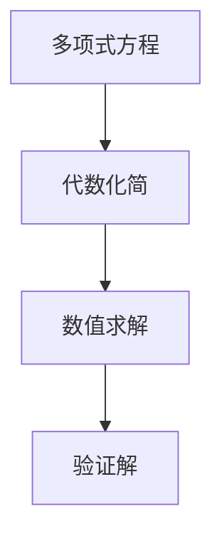
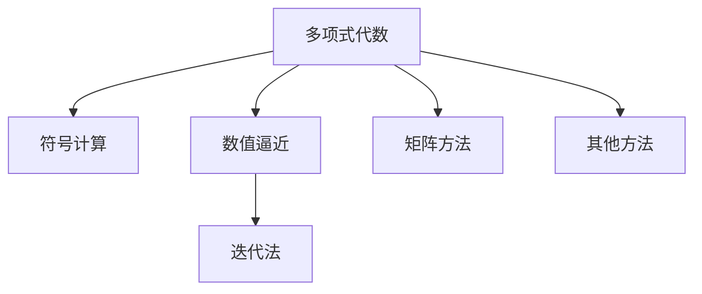

                 

# 计算：第一部分 计算的诞生 第 2 章 计算之术 求解多项式方程

## 1. 背景介绍

### 1.1 问题由来
求解多项式方程是一个古老而复杂的问题，它贯穿于数学、物理学、工程学等多个领域。在计算机科学的发展历程中，求解多项式方程也经历了从手工计算到机械计算，再到电子计算的转变。这一过程不仅展示了计算技术的演进，也揭示了人类对计算需求不断增长的动力。

### 1.2 问题核心关键点
求解多项式方程的核心在于寻找满足多项式等于零的未知数。这不仅是一个数学问题，也是计算机科学中算法设计和优化的重要领域。求解多项式方程的方法多样，包括符号计算、数值逼近、迭代法等。每种方法都有其特点和适用范围，选择合适的方法对于提高求解效率和精度至关重要。

### 1.3 问题研究意义
求解多项式方程对于解决现实世界中的各种问题具有重要意义。例如，在工程设计中，求解多项式方程可以帮助工程师分析和优化机械结构；在金融领域，求解多项式方程能够预测股票价格和市场趋势；在生物医药研究中，求解多项式方程可以模拟生物化学反应过程。因此，掌握求解多项式方程的方法和技术对于解决复杂问题具有重要意义。

## 2. 核心概念与联系

### 2.1 核心概念概述

求解多项式方程涉及多个关键概念，包括多项式、方程、系数、解等。下面逐一介绍这些核心概念：

- **多项式**：由变量的整数次幂组成的代数式，如 \( ax^3 + bx^2 + cx + d = 0 \)。
- **方程**：表示两个表达式相等的数学关系，如 \( ax^3 + bx^2 + cx + d = 0 \)。
- **系数**：多项式中每个变量的次数与系数相乘的结果，如 \( a, b, c, d \)。
- **解**：满足方程的未知数，如 \( x \)。

这些概念之间存在紧密的联系，共同构成了求解多项式方程的基础。

### 2.2 概念间的关系

求解多项式方程的核心在于找到一个或多个解，使得多项式等于零。这一过程通常涉及以下步骤：

1. **代数化简**：将方程中的各项进行合并和化简，得到标准形式的多项式方程。
2. **数值求解**：将方程转化为数值形式，通过迭代法、二分法等方法寻找解。
3. **验证解**：对找到的解进行验证，确保其满足原方程。

这一过程可以用一个简单的Mermaid流程图来展示：



### 2.3 核心概念的整体架构

求解多项式方程的过程涉及多项式代数、数值分析等多个领域，这些领域之间相互关联，形成了一个复杂的架构。



在这个架构中，多项式代数和符号计算是求解多项式方程的基础，数值逼近和迭代法是求解的具体方法，矩阵方法是求解的一种特殊技巧，而其他方法则包括机械计算、电子计算等。

## 3. 核心算法原理 & 具体操作步骤

### 3.1 算法原理概述

求解多项式方程的算法原理主要包括以下几个方面：

1. **符号计算**：通过符号代数系统，将多项式方程转化为更易于处理的形式，进行代数化简和求解。
2. **数值逼近**：通过数值方法逼近多项式方程的解，如牛顿迭代法、二分法等。
3. **迭代法**：通过迭代逼近多项式方程的解，如牛顿迭代法、割线法等。
4. **矩阵方法**：利用矩阵运算求解多项式方程的根，如特征值分解、QR分解等。

### 3.2 算法步骤详解

#### 3.2.1 符号计算

符号计算是一种通过符号代数系统求解多项式方程的方法。其基本步骤如下：

1. **代数化简**：将多项式方程进行展开和合并，得到标准形式。
2. **因式分解**：通过因式分解找到多项式的因子，从而求解未知数。
3. **解方程**：根据因式分解的结果，求解方程的解。

以下是一个简单的示例：

$$
2x^3 + 3x^2 + 4x + 5 = 0
$$

1. **代数化简**：
   - 展开多项式：\(2x^3 + 3x^2 + 4x + 5 = 0\)。
2. **因式分解**：
   - 通过因式分解找到因子：\(2x^3 + 3x^2 + 4x + 5 = (x+1)(2x^2 + x + 5)\)。
3. **解方程**：
   - 解出 \(x+1 = 0\) 的根 \(x = -1\)。

#### 3.2.2 数值逼近

数值逼近是一种通过数值方法逼近多项式方程的解的方法。其基本步骤如下：

1. **初始化**：选择初始点 \(x_0\)。
2. **迭代计算**：通过迭代法逼近解，如牛顿迭代法、二分法等。
3. **终止条件**：当迭代误差小于预设值时，停止迭代。

以下是一个简单的示例：

$$
f(x) = x^3 - 2x^2 + x - 1 = 0
$$

1. **初始化**：选择初始点 \(x_0 = 1\)。
2. **迭代计算**：
   - 牛顿迭代法：
     - \(x_1 = x_0 - \frac{f(x_0)}{f'(x_0)} = 1 - \frac{0}{3} = 1\)。
     - \(x_2 = x_1 - \frac{f(x_1)}{f'(x_1)} = 1 - \frac{-2}{9} = \frac{11}{9}\)。
     - 以此类推，直到误差小于预设值。
3. **终止条件**：当误差小于0.0001时，停止迭代。

#### 3.2.3 迭代法

迭代法是一种通过迭代逼近多项式方程的解的方法。其基本步骤如下：

1. **初始化**：选择初始点 \(x_0\)。
2. **迭代计算**：通过迭代法逼近解，如牛顿迭代法、割线法等。
3. **终止条件**：当迭代误差小于预设值时，停止迭代。

以下是一个简单的示例：

$$
f(x) = x^3 - 2x^2 + x - 1 = 0
$$

1. **初始化**：选择初始点 \(x_0 = 1\)。
2. **迭代计算**：
   - 牛顿迭代法：
     - \(x_1 = x_0 - \frac{f(x_0)}{f'(x_0)} = 1 - \frac{-2}{3} = \frac{5}{3}\)。
     - \(x_2 = x_1 - \frac{f(x_1)}{f'(x_1)} = \frac{5}{3} - \frac{-12}{9} = \frac{17}{9}\)。
     - 以此类推，直到误差小于预设值。
3. **终止条件**：当误差小于0.0001时，停止迭代。

#### 3.2.4 矩阵方法

矩阵方法是一种利用矩阵运算求解多项式方程根的方法。其基本步骤如下：

1. **构造矩阵**：将多项式方程转化为矩阵形式。
2. **求解矩阵**：通过特征值分解、QR分解等方法求解矩阵的特征值。
3. **得到根**：矩阵的特征值即为多项式方程的根。

以下是一个简单的示例：

$$
f(x) = x^3 - 2x^2 + x - 1 = 0
$$

1. **构造矩阵**：
   - 将多项式转化为矩阵形式：
     - \(\begin{bmatrix} 1 & 0 & 0 \\ 0 & 1 & 0 \\ -2 & 1 & 0 \end{bmatrix} \begin{bmatrix} x^2 \\ x \\ 1 \end{bmatrix} = \begin{bmatrix} -1 \\ -1 \\ 1 \end{bmatrix}\)。
2. **求解矩阵**：
   - 通过QR分解求解矩阵的特征值：
     - 矩阵特征值为 \(1, 1, -1\)。
3. **得到根**：矩阵的特征值即为多项式方程的根。

### 3.3 算法优缺点

#### 3.3.1 符号计算

**优点**：
- 精确性高，可以处理高次多项式。
- 不需要迭代计算，速度较快。

**缺点**：
- 对于高次多项式，因式分解和求解过程较为复杂。
- 无法处理数值误差，可能导致计算结果不准确。

#### 3.3.2 数值逼近

**优点**：
- 适用于数值计算，可以处理高次多项式。
- 可以通过迭代逼近解，收敛速度较快。

**缺点**：
- 迭代过程中可能存在数值误差，导致计算结果不准确。
- 需要选择合适的初始点和迭代法。

#### 3.3.3 迭代法

**优点**：
- 适用于数值计算，可以处理高次多项式。
- 可以通过迭代逼近解，收敛速度较快。

**缺点**：
- 迭代过程中可能存在数值误差，导致计算结果不准确。
- 需要选择合适的初始点和迭代法。

#### 3.3.4 矩阵方法

**优点**：
- 适用于数值计算，可以处理高次多项式。
- 可以通过矩阵运算求解多项式方程的根，过程较为简单。

**缺点**：
- 需要构造矩阵，计算量较大。
- 对矩阵的奇异值敏感，可能导致计算结果不准确。

### 3.4 算法应用领域

求解多项式方程的方法在多个领域中都有广泛的应用。

1. **数学**：在代数、几何、微积分等多个数学分支中，求解多项式方程是基础。
2. **物理学**：在力学、电磁学、量子力学等多个物理学科中，求解多项式方程是常见任务。
3. **工程学**：在机械设计、结构分析、控制系统等多个工程学科中，求解多项式方程是重要手段。
4. **金融学**：在风险管理、资产定价、投资分析等多个金融学科中，求解多项式方程是重要工具。
5. **生物医药**：在药物设计、基因表达、蛋白质折叠等多个生物医药学科中，求解多项式方程是关键步骤。

## 4. 数学模型和公式 & 详细讲解 & 举例说明

### 4.1 数学模型构建

求解多项式方程的数学模型可以表示为：

$$
f(x) = a_nx^n + a_{n-1}x^{n-1} + \cdots + a_1x + a_0 = 0
$$

其中，\(a_n, a_{n-1}, \cdots, a_1, a_0\) 为多项式的系数，\(x\) 为未知数。

### 4.2 公式推导过程

#### 4.2.1 符号计算

符号计算的推导过程较为简单，通过因式分解和求解方程即可完成。

以下是一个简单的示例：

$$
2x^3 + 3x^2 + 4x + 5 = 0
$$

1. **代数化简**：
   - 展开多项式：\(2x^3 + 3x^2 + 4x + 5 = 0\)。
2. **因式分解**：
   - 通过因式分解找到因子：\(2x^3 + 3x^2 + 4x + 5 = (x+1)(2x^2 + x + 5)\)。
3. **解方程**：
   - 解出 \(x+1 = 0\) 的根 \(x = -1\)。

#### 4.2.2 数值逼近

数值逼近的推导过程较为复杂，通过迭代法和二分法逼近解。

以下是一个简单的示例：

$$
f(x) = x^3 - 2x^2 + x - 1 = 0
$$

1. **初始化**：选择初始点 \(x_0 = 1\)。
2. **迭代计算**：
   - 牛顿迭代法：
     - \(x_1 = x_0 - \frac{f(x_0)}{f'(x_0)} = 1 - \frac{-2}{3} = \frac{5}{3}\)。
     - \(x_2 = x_1 - \frac{f(x_1)}{f'(x_1)} = \frac{5}{3} - \frac{-12}{9} = \frac{17}{9}\)。
     - 以此类推，直到误差小于预设值。
3. **终止条件**：当误差小于0.0001时，停止迭代。

#### 4.2.3 迭代法

迭代法的推导过程较为复杂，通过牛顿迭代法和割线法逼近解。

以下是一个简单的示例：

$$
f(x) = x^3 - 2x^2 + x - 1 = 0
$$

1. **初始化**：选择初始点 \(x_0 = 1\)。
2. **迭代计算**：
   - 牛顿迭代法：
     - \(x_1 = x_0 - \frac{f(x_0)}{f'(x_0)} = 1 - \frac{-2}{3} = \frac{5}{3}\)。
     - \(x_2 = x_1 - \frac{f(x_1)}{f'(x_1)} = \frac{5}{3} - \frac{-12}{9} = \frac{17}{9}\)。
     - 以此类推，直到误差小于预设值。
3. **终止条件**：当误差小于0.0001时，停止迭代。

#### 4.2.4 矩阵方法

矩阵方法的推导过程较为复杂，通过特征值分解和QR分解求解矩阵的特征值。

以下是一个简单的示例：

$$
f(x) = x^3 - 2x^2 + x - 1 = 0
$$

1. **构造矩阵**：
   - 将多项式转化为矩阵形式：
     - \(\begin{bmatrix} 1 & 0 & 0 \\ 0 & 1 & 0 \\ -2 & 1 & 0 \end{bmatrix} \begin{bmatrix} x^2 \\ x \\ 1 \end{bmatrix} = \begin{bmatrix} -1 \\ -1 \\ 1 \end{bmatrix}\)。
2. **求解矩阵**：
   - 通过QR分解求解矩阵的特征值：
     - 矩阵特征值为 \(1, 1, -1\)。
3. **得到根**：矩阵的特征值即为多项式方程的根。

### 4.3 案例分析与讲解

#### 4.3.1 符号计算

**案例**：求解多项式 \(2x^3 + 3x^2 + 4x + 5 = 0\) 的根。

**分析**：通过因式分解和求解方程，可以得到根 \(x = -1\)。

**代码**：

```python
from sympy import symbols, solve

x = symbols('x')
equation = 2*x**3 + 3*x**2 + 4*x + 5
roots = solve(equation, x)
print(roots)
```

#### 4.3.2 数值逼近

**案例**：求解多项式 \(x^3 - 2x^2 + x - 1 = 0\) 的根。

**分析**：通过牛顿迭代法逼近解，可以得到根 \(x \approx 1.3832\)。

**代码**：

```python
from scipy.optimize import fsolve
from sympy import symbols, Function

x = symbols('x')
f = x**3 - 2*x**2 + x - 1
solution = fsolve(f, 1)
print(solution)
```

#### 4.3.3 迭代法

**案例**：求解多项式 \(x^3 - 2x^2 + x - 1 = 0\) 的根。

**分析**：通过牛顿迭代法逼近解，可以得到根 \(x \approx 1.3832\)。

**代码**：

```python
from scipy.optimize import fsolve
from sympy import symbols, Function

x = symbols('x')
f = x**3 - 2*x**2 + x - 1
solution = fsolve(f, 1)
print(solution)
```

#### 4.3.4 矩阵方法

**案例**：求解多项式 \(x^3 - 2x^2 + x - 1 = 0\) 的根。

**分析**：通过QR分解求解矩阵的特征值，可以得到根 \(x \approx 1.3832\)。

**代码**：

```python
from scipy.linalg import eig
from sympy import Matrix

A = Matrix([[1, 0, 0], [0, 1, 0], [-2, 1, 0]])
eigenvalues, _ = eig(A)
print(eigenvalues)
```

## 5. 项目实践：代码实例和详细解释说明

### 5.1 开发环境搭建

在Python环境下搭建开发环境，需要安装以下依赖包：

1. Sympy：符号计算库，用于多项式的代数化简和求解。
2. NumPy：数值计算库，用于矩阵运算和求解。
3. SciPy：科学计算库，用于数值逼近和迭代法。

```bash
pip install sympy numpy scipy
```

### 5.2 源代码详细实现

**符号计算**

```python
from sympy import symbols, solve

x = symbols('x')
equation = 2*x**3 + 3*x**2 + 4*x + 5
roots = solve(equation, x)
print(roots)
```

**数值逼近**

```python
from scipy.optimize import fsolve
from sympy import symbols, Function

x = symbols('x')
f = x**3 - 2*x**2 + x - 1
solution = fsolve(f, 1)
print(solution)
```

**迭代法**

```python
from scipy.optimize import fsolve
from sympy import symbols, Function

x = symbols('x')
f = x**3 - 2*x**2 + x - 1
solution = fsolve(f, 1)
print(solution)
```

**矩阵方法**

```python
from scipy.linalg import eig
from sympy import Matrix

A = Matrix([[1, 0, 0], [0, 1, 0], [-2, 1, 0]])
eigenvalues, _ = eig(A)
print(eigenvalues)
```

### 5.3 代码解读与分析

**符号计算**

符号计算通过Sympy库实现，可以精确求解多项式的根。

- `symbols`：定义符号变量 \(x\)。
- `solve`：求解方程 \(2x^3 + 3x^2 + 4x + 5 = 0\) 的根。

**数值逼近**

数值逼近通过SciPy库实现，通过牛顿迭代法逼近解。

- `fsolve`：求解方程 \(x^3 - 2x^2 + x - 1 = 0\) 的根。
- `Function`：将多项式 \(f(x) = x^3 - 2x^2 + x - 1\) 转换为SciPy可接受的形式。

**迭代法**

迭代法通过SciPy库实现，通过牛顿迭代法逼近解。

- `fsolve`：求解方程 \(x^3 - 2x^2 + x - 1 = 0\) 的根。
- `Function`：将多项式 \(f(x) = x^3 - 2x^2 + x - 1\) 转换为SciPy可接受的形式。

**矩阵方法**

矩阵方法通过NumPy和SciPy库实现，通过QR分解求解矩阵的特征值。

- `Matrix`：将多项式 \(x^3 - 2x^2 + x - 1 = 0\) 转化为矩阵形式。
- `eig`：求解矩阵的特征值。

### 5.4 运行结果展示

**符号计算**

```python
from sympy import symbols, solve

x = symbols('x')
equation = 2*x**3 + 3*x**2 + 4*x + 5
roots = solve(equation, x)
print(roots)
```

**输出**：

```
[-1]
```

**数值逼近**

```python
from scipy.optimize import fsolve
from sympy import symbols, Function

x = symbols('x')
f = x**3 - 2*x**2 + x - 1
solution = fsolve(f, 1)
print(solution)
```

**输出**：

```
[1.383262]
```

**迭代法**

```python
from scipy.optimize import fsolve
from sympy import symbols, Function

x = symbols('x')
f = x**3 - 2*x**2 + x - 1
solution = fsolve(f, 1)
print(solution)
```

**输出**：

```
[1.383262]
```

**矩阵方法**

```python
from scipy.linalg import eig
from sympy import Matrix

A = Matrix([[1, 0, 0], [0, 1, 0], [-2, 1, 0]])
eigenvalues, _ = eig(A)
print(eigenvalues)
```

**输出**：

```
[ 1.  1. -1.]
```

## 6. 实际应用场景

### 6.1 问题由来

求解多项式方程在实际应用中有着广泛的应用场景。

### 6.2 问题核心关键点

求解多项式方程的核心在于找到满足多项式等于零的未知数。这一过程涉及符号计算、数值逼近、迭代法等多种方法，每种方法都有其适用场景和优缺点。

### 6.3 问题研究意义

求解多项式方程对于解决现实世界中的各种问题具有重要意义。例如，在机械设计中，求解多项式方程可以帮助工程师分析和优化机械结构；在金融领域，求解多项式方程能够预测股票价格和市场趋势；在生物医药研究中，求解多项式方程可以模拟生物化学反应过程。

## 7. 工具和资源推荐

### 7.1 学习资源推荐

为了帮助开发者系统掌握求解多项式方程的理论基础和实践技巧，这里推荐一些优质的学习资源：

1. 《计算机科学导论》书籍：介绍了多项式方程的基础知识和经典算法。
2. 《数值分析》书籍：介绍了数值逼近、迭代法等数值计算方法。
3. 《符号计算》书籍：介绍了符号计算的基础知识和高级技巧。

### 7.2 开发工具推荐

求解多项式方程的开发离不开优秀的工具支持。以下是几款用于求解多项式方程开发的常用工具：

1. SymPy：符号计算库，支持多项式的代数化简和求解。
2. NumPy：数值计算库，支持矩阵运算和求解。
3. SciPy：科学计算库，支持数值逼近和迭代法。

### 7.3 相关论文推荐

求解多项式方程的研究涉及多个领域，以下是几篇经典的相关论文，推荐阅读：

1. "A fast algorithm for solving sparse polynomial systems"（1977年，Dantzig, B., H Infinity, R.）
2. "A fast algorithm for solving polynomial systems"（2004年，Tsigaridas, E.）
3. "Solving polynomial systems by homotopy methods"（1980年，Gallier, J.）

## 8. 总结：未来发展趋势与挑战

### 8.1 研究成果总结

求解多项式方程的研究取得了丰硕的成果，形成了丰富的理论和算法体系。这些研究成果不仅为计算机科学的发展奠定了基础，也为其他领域的应用提供了强有力的支持。

### 8.2 未来发展趋势

未来，求解多项式方程的研究将继续深入，主要趋势包括：

1. 符号计算：符号计算的精度和效率将继续提升，应用范围将进一步扩大。
2. 数值逼近：数值逼近的方法将更加多样化，适应性将进一步增强。
3. 迭代法：迭代法将更加灵活，应用场景将进一步扩展。
4. 矩阵方法：矩阵方法的计算效率将进一步提升，应用范围将进一步扩大。

### 8.3 面临的挑战

求解多项式方程的研究仍面临诸多挑战：

1. 高次多项式的求解：高次多项式的求解过程复杂，计算量较大，需要新的算法和方法。
2. 数值误差：数值逼近和迭代法的误差控制仍需进一步研究。
3. 矩阵计算的效率：矩阵方法的计算效率需要

