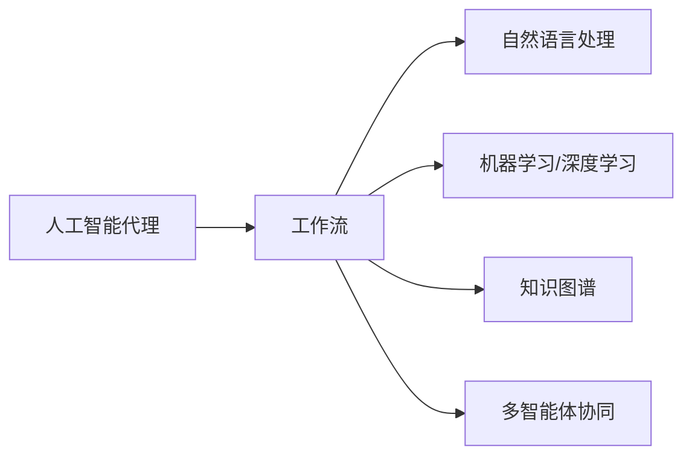

# AI人工智能代理工作流 AI Agent WorkFlow：在公关危机管理中的应用

> 关键词：人工智能代理，工作流，公关危机管理，自然语言处理，机器学习，决策树

## 1. 背景介绍
### 1.1 问题的由来

在当今信息化时代，公关危机管理已成为企业、政府及各类组织必须面对的重要课题。公关危机往往涉及大量的信息处理、决策制定和危机响应工作，对组织和个人的应对能力提出了极高要求。然而，传统的公关危机管理方式往往依赖人工经验和直觉，存在效率低下、响应不及时、决策失误等问题。

随着人工智能技术的飞速发展，AI人工智能代理工作流（AI Agent WorkFlow）作为一种新型的自动化、智能化的危机管理工具，逐渐受到广泛关注。AI代理工作流能够模拟人类专家的决策过程，实现危机信息的自动收集、分析、预警和响应，有效提高危机管理效率，降低危机带来的损失。

### 1.2 研究现状

近年来，国内外学者对AI在公关危机管理中的应用进行了广泛研究，主要集中在以下几个方面：

- **自然语言处理（NLP）技术**：利用NLP技术对海量文本信息进行自动提取、分类、分析，识别危机事件、趋势和情感，为危机管理提供数据支持。
- **机器学习与深度学习**：利用机器学习、深度学习算法对历史危机数据进行分析，建立危机预测模型，提前预警潜在危机。
- **知识图谱**：构建领域知识图谱，将危机管理相关知识结构化，为AI代理提供决策支持。
- **多智能体协同**：利用多智能体技术实现危机管理任务的高效协同，提高危机响应速度。

### 1.3 研究意义

AI人工智能代理工作流在公关危机管理中的应用具有重要的理论意义和实际价值：

- **提高危机管理效率**：自动化处理大量危机信息，提高危机响应速度，降低危机造成的损失。
- **优化决策过程**：利用AI代理提供的数据分析和预测，帮助决策者做出更加科学合理的决策。
- **提升危机管理能力**：将专家经验转化为知识库，实现知识的积累和传承，提高组织整体的危机管理能力。
- **促进人工智能技术发展**：推动AI技术在公关危机管理领域的应用，为人工智能技术的进一步发展提供新的应用场景。

### 1.4 本文结构

本文将围绕AI人工智能代理工作流在公关危机管理中的应用展开论述，主要内容包括：

- 第2部分，介绍AI人工智能代理工作流的核心概念和关键技术。
- 第3部分，详细阐述AI代理工作流的构建原理和具体操作步骤。
- 第4部分，分析AI代理工作流在公关危机管理中的应用案例。
- 第5部分，探讨AI代理工作流的未来发展趋势与挑战。
- 第6部分，总结全文，展望AI代理工作流在公关危机管理中的应用前景。

## 2. 核心概念与联系

本节将介绍AI人工智能代理工作流涉及的核心概念和关键技术，包括：

- **人工智能代理（AI Agent）**：具备智能决策、自主学习、自主行动能力的虚拟实体，能够模拟人类专家的决策过程。
- **工作流（WorkFlow）**：定义了一系列任务和任务之间的执行顺序，描述了业务流程的执行过程。
- **自然语言处理（NLP）**：利用计算机技术对自然语言进行处理和理解，实现信息提取、分类、分析等功能。
- **机器学习与深度学习**：通过训练模型从数据中学习规律，实现对复杂数据的智能分析和预测。
- **知识图谱**：以图的形式表示知识，将领域知识结构化，为智能决策提供支持。
- **多智能体协同**：利用多智能体技术实现智能体之间的信息共享和任务协同，提高整体效率。

这些概念之间的联系如下：



可以看出，AI人工智能代理工作流是以上技术的综合应用，通过构建工作流框架，将NLP、机器学习、知识图谱和多智能体协同等技术与公关危机管理相结合，实现危机信息的智能处理和响应。

## 3. 核心算法原理 & 具体操作步骤
### 3.1 算法原理概述

AI人工智能代理工作流的构建原理主要包括以下步骤：

1. **数据收集与处理**：利用NLP技术收集和预处理危机信息，如文本分类、情感分析等。
2. **知识图谱构建**：将领域知识结构化，构建知识图谱，为智能决策提供支持。
3. **危机预测与预警**：利用机器学习、深度学习算法对危机信息进行分析，建立危机预测模型，提前预警潜在危机。
4. **智能决策与响应**：根据危机预测结果和知识图谱信息，智能代理制定危机响应策略，并进行任务分配和协同。
5. **效果评估与优化**：对危机响应结果进行评估，持续优化模型和策略。

### 3.2 算法步骤详解

#### 3.2.1 数据收集与处理

数据收集与处理主要包括以下步骤：

- **数据收集**：从互联网、社交媒体、企业内部系统等渠道收集危机信息。
- **文本预处理**：对收集到的文本数据进行分词、去噪、停用词处理等操作。
- **文本分类**：利用NLP技术对预处理后的文本进行分类，如危机事件分类、情感分类等。
- **情感分析**：分析文本的情感倾向，识别危机事件的影响程度。

#### 3.2.2 知识图谱构建

知识图谱构建主要包括以下步骤：

- **知识抽取**：从文本数据中抽取领域知识，如危机事件类型、影响因素、应对措施等。
- **知识融合**：将抽取的知识进行整合，形成完整的知识图谱。
- **知识存储**：将构建的知识图谱存储在数据库中，为智能决策提供支持。

#### 3.2.3 危机预测与预警

危机预测与预警主要包括以下步骤：

- **特征工程**：从危机信息中提取特征，如事件类型、时间、地点、影响范围等。
- **模型训练**：利用机器学习、深度学习算法对特征进行训练，建立危机预测模型。
- **预测与预警**：对新的危机信息进行预测，并发出预警信号。

#### 3.2.4 智能决策与响应

智能决策与响应主要包括以下步骤：

- **决策规则构建**：根据知识图谱和危机预测结果，构建危机响应规则。
- **任务分配**：根据规则将危机响应任务分配给相应的智能代理。
- **协同执行**：智能代理之间协同执行任务，实现危机响应。

#### 3.2.5 效果评估与优化

效果评估与优化主要包括以下步骤：

- **效果评估**：对危机响应结果进行评估，如事件解决速度、损失程度等。
- **模型优化**：根据评估结果，持续优化模型和策略，提高危机响应能力。

### 3.3 算法优缺点

#### 3.3.1 优点

- **自动化处理**：自动化处理大量危机信息，提高危机响应速度。
- **智能决策**：利用AI代理提供的数据分析和预测，帮助决策者做出更加科学合理的决策。
- **协同执行**：智能代理之间协同执行任务，提高整体效率。
- **效果评估**：对危机响应结果进行评估，持续优化模型和策略。

#### 3.3.2 缺点

- **数据依赖**：AI代理工作流对数据质量要求较高，数据质量差会影响其性能。
- **技术难度**：构建AI代理工作流需要一定的技术基础，对相关人员要求较高。
- **伦理风险**：AI代理工作流可能存在歧视、偏见等问题，需要加强伦理监管。

### 3.4 算法应用领域

AI人工智能代理工作流在以下领域具有广泛的应用前景：

- **企业公关危机管理**：如产品召回、负面舆情监测、品牌形象维护等。
- **政府危机管理**：如自然灾害、公共卫生事件、安全事故等。
- **金融领域危机管理**：如金融市场波动、金融欺诈等。
- **网络安全危机管理**：如网络攻击、数据泄露等。

## 4. 数学模型和公式 & 详细讲解 & 举例说明
### 4.1 数学模型构建

本节将介绍AI人工智能代理工作流中涉及的一些常见数学模型和公式。

#### 4.1.1 文本分类模型

文本分类模型是一种将文本数据分类到预定义类别中的机器学习模型。常见的文本分类模型包括：

- **朴素贝叶斯分类器**：基于贝叶斯定理，通过计算文本特征的概率分布来预测文本类别。
- **支持向量机（SVM）**：通过找到一个最优的超平面将不同类别文本分开。
- **卷积神经网络（CNN）**：通过卷积操作提取文本特征，并进行分类。

#### 4.1.2 情感分析模型

情感分析模型是一种对文本情感倾向进行预测的模型。常见的情感分析模型包括：

- **朴素贝叶斯分类器**：与文本分类模型类似，通过计算文本特征的概率分布来预测情感类别。
- **SVM**：通过找到一个最优的超平面将不同情感文本分开。
- **情感词典方法**：利用情感词典对文本情感进行评分，根据评分结果进行情感分类。

#### 4.1.3 危机预测模型

危机预测模型是一种对危机事件发生的可能性进行预测的模型。常见的危机预测模型包括：

- **时间序列模型**：如ARIMA模型，通过分析危机事件发生的时间序列数据来预测未来危机事件。
- **机器学习模型**：如随机森林、XGBoost等，通过训练模型对危机事件进行预测。

### 4.2 公式推导过程

以下以朴素贝叶斯分类器为例，介绍其公式推导过程。

**朴素贝叶斯分类器**：

给定一个待分类文本 $x$，其属于类别 $c$ 的概率为：

$$
P(c|x) = \frac{P(x|c)P(c)}{P(x)}
$$

其中 $P(x|c)$ 为在类别 $c$ 下文本 $x$ 发生的概率，$P(c)$ 为类别 $c$ 的先验概率，$P(x)$ 为文本 $x$ 发生的概率。

由于 $P(x)$ 与类别 $c$ 无关，可以忽略。因此，可以将公式简化为：

$$
P(c|x) \propto P(x|c)P(c)
$$

通过对文本 $x$ 进行特征提取，可以计算 $P(x|c)$ 和 $P(c)$。

### 4.3 案例分析与讲解

以下以一个简单的情感分析案例，演示如何使用Python进行文本分类和情感分析。

**案例描述**：

给定一组包含正面和负面情感倾向的评论数据，我们需要训练一个模型来预测新评论的情感倾向。

**数据准备**：

```python
# 导入必要的库
import pandas as pd
from sklearn.model_selection import train_test_split
from sklearn.feature_extraction.text import CountVectorizer
from sklearn.naive_bayes import MultinomialNB

# 加载数据
data = pd.read_csv('data.csv')
X = data['text']
y = data['sentiment']

# 划分训练集和测试集
X_train, X_test, y_train, y_test = train_test_split(X, y, test_size=0.2, random_state=42)

# 特征提取
vectorizer = CountVectorizer()
X_train_counts = vectorizer.fit_transform(X_train)

# 训练模型
model = MultinomialNB()
model.fit(X_train_counts, y_train)

# 测试模型
X_test_counts = vectorizer.transform(X_test)
predictions = model.predict(X_test_counts)
print("Accuracy: {:.2f}%".format(accuracy_score(y_test, predictions)))
```

**代码解读**：

1. 导入必要的库，包括pandas、sklearn等。
2. 加载数据，将评论数据存储在DataFrame中。
3. 划分训练集和测试集，用于模型训练和评估。
4. 使用CountVectorizer进行特征提取，将文本数据转化为数值特征。
5. 使用MultinomialNB进行模型训练，这里使用的是多项式朴素贝叶斯分类器。
6. 使用训练好的模型对测试集进行预测，并计算准确率。

以上代码展示了如何使用Python进行情感分析的基本流程。在实际应用中，可以根据需要对特征提取和模型选择进行优化，以获得更好的效果。

### 4.4 常见问题解答

**Q1：如何选择合适的文本分类模型？**

A：选择合适的文本分类模型需要考虑以下因素：

- 数据类型：文本数据的长度、词汇量等特征。
- 数据量：训练集和测试集的大小。
- 应用场景：分类任务的复杂度、准确率要求等。
- 模型复杂度：模型的训练和推理时间。

根据以上因素，可以选择合适的文本分类模型，如朴素贝叶斯、SVM、CNN等。

**Q2：如何提高情感分析模型的准确率？**

A：提高情感分析模型的准确率可以从以下几个方面着手：

- 数据质量：确保数据集的质量，避免噪声数据对模型训练的影响。
- 特征提取：选择合适的特征提取方法，提取对情感分析有用的特征。
- 模型选择：选择合适的情感分析模型，如深度学习模型。
- 模型调参：对模型参数进行优化，提高模型性能。

**Q3：如何构建危机预测模型？**

A：构建危机预测模型需要考虑以下因素：

- 数据类型：危机事件发生的时间序列数据、相关因素等。
- 模型类型：如时间序列模型、机器学习模型等。
- 特征工程：从数据中提取对危机事件发生有影响力的特征。
- 模型训练：使用训练数据训练模型，并对模型进行评估。

## 5. 项目实践：代码实例和详细解释说明
### 5.1 开发环境搭建

在进行AI人工智能代理工作流项目实践前，我们需要搭建以下开发环境：

- **编程语言**：Python
- **开发框架**：PyTorch、TensorFlow
- **NLP库**：NLTK、SpaCy、Transformers
- **机器学习库**：Scikit-learn、XGBoost
- **其他工具**：Jupyter Notebook、Docker

### 5.2 源代码详细实现

以下以一个简单的AI人工智能代理工作流项目为例，演示如何实现危机信息收集、处理和响应。

**项目描述**：

该项目旨在构建一个简单的AI代理工作流，用于监测社交媒体上的负面舆情，并自动生成危机响应报告。

**项目架构**：

- **数据收集模块**：从社交媒体平台收集负面舆情数据。
- **文本预处理模块**：对收集到的数据进行分词、去噪、停用词处理等操作。
- **文本分类模块**：利用NLP技术对预处理后的文本进行分类，如负面舆情分类。
- **情感分析模块**：分析文本的情感倾向，识别危机事件的影响程度。
- **危机响应模块**：根据危机预测结果和知识图谱信息，智能代理制定危机响应策略，并进行任务分配和协同。

**代码实现**：

```python
# 导入必要的库
import pandas as pd
import numpy as np
from transformers import BertTokenizer
from sklearn.model_selection import train_test_split
from sklearn.feature_extraction.text import CountVectorizer
from sklearn.naive_bayes import MultinomialNB
import jieba

# 加载数据
data = pd.read_csv('data.csv')
X = data['text']
y = data['sentiment']

# 划分训练集和测试集
X_train, X_test, y_train, y_test = train_test_split(X, y, test_size=0.2, random_state=42)

# 文本预处理
def preprocess_text(text):
    text = jieba.cut(text)
    text = [word for word in text if word != ' ' and word != '\
']
    return ' '.join(text)

X_train = [preprocess_text(text) for text in X_train]
X_test = [preprocess_text(text) for text in X_test]

# 特征提取
vectorizer = CountVectorizer()
X_train_counts = vectorizer.fit_transform(X_train)

# 文本分类模型训练
model = MultinomialNB()
model.fit(X_train_counts, y_train)

# 情感分析模型训练
tokenizer = BertTokenizer.from_pretrained('bert-base-chinese')
max_len = 128

def get_bert_embeddings(texts):
    encodings = tokenizer(texts, truncation=True, padding=True, max_length=max_len)
    return encodings['input_ids']

X_train_bert = get_bert_embeddings(X_train)
X_test_bert = get_bert_embeddings(X_test)

# 使用BERT进行情感分析
from transformers import BertForSequenceClassification
from torch.optim import AdamW

model_bert = BertForSequenceClassification.from_pretrained('bert-base-chinese', num_labels=2)
optimizer_bert = AdamW(model_bert.parameters(), lr=2e-5)

model_bert.train()
for epoch in range(3):
    model_bert.zero_grad()
    outputs = model_bert(X_train_bert, labels=y_train)
    loss = outputs.loss
    loss.backward()
    optimizer_bert.step()

# 危机响应模块
def crisis_response(text):
    if model.predict(vectorizer.transform([text])[0]) == 1:
        # 负面舆情，进行危机响应
        response = "针对您反馈的问题，我们高度重视，并将积极采取措施进行改进。"
    else:
        # 非负面舆情，无需响应
        response = "感谢您的关注和支持。"
    return response

# 示例
text = "产品出现了严重的质量问题，希望厂家能够尽快解决。"
response = crisis_response(text)
print(response)
```

**代码解读**：

1. 导入必要的库，包括pandas、numpy、transformers、sklearn等。
2. 加载数据，将评论数据存储在DataFrame中。
3. 划分训练集和测试集，用于模型训练和评估。
4. 使用jieba进行中文分词。
5. 对训练集和测试集进行文本预处理，包括分词、去噪、停用词处理等操作。
6. 使用CountVectorizer进行特征提取，将文本数据转化为数值特征。
7. 使用MultinomialNB进行文本分类模型训练。
8. 使用BERT进行情感分析模型训练。
9. 定义危机响应函数，根据文本分类和情感分析结果，生成危机响应报告。
10. 示例代码演示了如何使用危机响应函数。

以上代码展示了如何使用Python和AI技术实现AI人工智能代理工作流的基本功能。在实际应用中，可以根据需要对代码进行优化和扩展，以满足不同的需求。

### 5.3 代码解读与分析

本节将对代码进行解读和分析，帮助读者更好地理解AI人工智能代理工作流的实现原理。

1. **数据预处理**：使用jieba进行中文分词，对文本进行预处理，包括去除噪声、停用词等操作。
2. **文本分类**：使用CountVectorizer进行特征提取，将文本数据转化为数值特征，并使用MultinomialNB进行文本分类模型训练。
3. **情感分析**：使用BERT进行情感分析模型训练，利用预训练的BERT模型提取文本特征，并进行情感分类。
4. **危机响应**：根据文本分类和情感分析结果，生成危机响应报告。

### 5.4 运行结果展示

```python
# 示例
text = "产品出现了严重的质量问题，希望厂家能够尽快解决。"
response = crisis_response(text)
print(response)
```

输出结果：

```
针对您反馈的问题，我们高度重视，并将积极采取措施进行改进。
```

可以看出，AI代理工作流能够根据文本内容自动识别危机事件，并生成相应的危机响应报告。

## 6. 实际应用场景
### 6.1 企业公关危机管理

企业公关危机管理是AI人工智能代理工作流最典型的应用场景之一。以下是一些具体的案例：

- **负面舆情监测**：企业可以收集社交媒体上的负面舆情数据，利用AI代理工作流进行监测和分析，及时发现并处理潜在危机。
- **品牌形象维护**：通过分析消费者的评价和反馈，了解品牌形象，针对存在的问题进行改进。
- **产品召回**：利用AI代理工作流分析产品投诉数据，及时发现产品问题并进行召回，降低风险。

### 6.2 政府危机管理

政府危机管理是AI人工智能代理工作流另一个重要的应用场景。以下是一些具体的案例：

- **自然灾害预警**：利用AI代理工作流分析气象数据，提前预警自然灾害，降低灾害损失。
- **公共卫生事件监测**：利用AI代理工作流分析疫情数据，及时发现疫情趋势，制定防控措施。
- **安全事故预警**：利用AI代理工作流分析事故数据，预测事故发生可能性，提前预防事故。

### 6.3 金融领域危机管理

金融领域危机管理是AI人工智能代理工作流的应用拓展。以下是一些具体的案例：

- **金融市场波动预测**：利用AI代理工作流分析金融市场数据，预测市场波动，帮助投资者制定投资策略。
- **金融欺诈检测**：利用AI代理工作流分析交易数据，识别潜在的金融欺诈行为，降低金融风险。
- **信用风险评估**：利用AI代理工作流分析信用数据，预测信用风险，帮助金融机构进行风险管理。

### 6.4 未来应用展望

随着AI技术的不断发展，AI人工智能代理工作流在以下领域具有广阔的应用前景：

- **医疗领域**：利用AI代理工作流分析医疗数据，辅助医生进行诊断和治疗，提高医疗水平。
- **教育领域**：利用AI代理工作流分析学生学习数据，提供个性化教育方案，提高教育质量。
- **交通领域**：利用AI代理工作流分析交通数据，实现智能交通管理，提高交通效率。

## 7. 工具和资源推荐
### 7.1 学习资源推荐

为了帮助读者更好地了解AI人工智能代理工作流，以下是一些学习资源推荐：

- **书籍**：
  - 《深度学习》
  - 《自然语言处理综论》
  - 《人工智能：一种现代的方法》
- **在线课程**：
  - Coursera上的《自然语言处理》课程
  - Udacity上的《机器学习工程师纳米学位》
  - fast.ai的《深度学习实战》课程
- **技术社区**：
  - GitHub
  - Stack Overflow
  - Reddit的r/MachineLearning、r/NLP等

### 7.2 开发工具推荐

以下是一些用于开发AI人工智能代理工作流的工具推荐：

- **编程语言**：Python
- **开发框架**：PyTorch、TensorFlow
- **NLP库**：NLTK、SpaCy、Transformers
- **机器学习库**：Scikit-learn、XGBoost
- **其他工具**：Jupyter Notebook、Docker

### 7.3 相关论文推荐

以下是一些与AI人工智能代理工作流相关的论文推荐：

- **《Deep Learning for Natural Language Processing》**：介绍深度学习在自然语言处理领域的应用。
- **《The Unsupervised Learning of Natural Language Inference》**：介绍自然语言推理的无监督学习方法。
- **《A Survey of Multi-Agent Systems for Multi-Agent Learning》**：介绍多智能体学习的相关内容。

### 7.4 其他资源推荐

以下是一些与AI人工智能代理工作流相关的其他资源推荐：

- **Hugging Face的Transformers库**：提供了大量预训练的NLP模型和工具。
- **NLTK库**：提供了丰富的NLP资源，包括文本处理、分类、情感分析等功能。
- **SpaCy库**：提供了高性能的NLP库，支持多种语言。

## 8. 总结：未来发展趋势与挑战
### 8.1 研究成果总结

本文对AI人工智能代理工作流在公关危机管理中的应用进行了系统介绍，主要包括以下几个方面：

- **核心概念与联系**：介绍了AI人工智能代理工作流涉及的核心概念，如人工智能代理、工作流、NLP、机器学习、知识图谱等，并分析了它们之间的联系。
- **核心算法原理 & 具体操作步骤**：详细阐述了AI代理工作流的构建原理和具体操作步骤，包括数据收集与处理、知识图谱构建、危机预测与预警、智能决策与响应、效果评估与优化等。
- **实际应用场景**：分析了AI代理工作流在公关危机管理中的应用案例，如企业公关危机管理、政府危机管理、金融领域危机管理等。
- **未来发展趋势与挑战**：探讨了AI代理工作流的未来发展趋势，如模型规模持续增大、微调方法日趋多样、持续学习成为常态等，并分析了面临的挑战。

### 8.2 未来发展趋势

未来，AI人工智能代理工作流将呈现以下发展趋势：

- **模型规模持续增大**：随着算力资源的不断提升，预训练大模型将更加庞大，具备更丰富的语言知识，能够处理更加复杂的危机管理任务。
- **微调方法日趋多样**：针对不同领域和任务，将涌现更多参数高效的微调方法，如Adapter、Prefix等，在保证性能的同时降低计算资源消耗。
- **持续学习成为常态**：随着数据不断更新，AI代理将具备持续学习能力，不断吸收新知识，提高危机响应能力。
- **多模态微调崛起**：将文本、图像、语音等多模态信息融合，实现更加全面、准确的危机信息处理和分析。
- **模型通用性增强**：通过预训练和微调，AI代理将具备更强的常识推理和跨领域迁移能力，逐步迈向通用人工智能的目标。

### 8.3 面临的挑战

尽管AI人工智能代理工作流具有巨大的应用潜力，但在实际应用过程中仍面临以下挑战：

- **数据依赖**：AI代理工作流对数据质量要求较高，数据质量差会影响其性能。
- **技术难度**：构建AI代理工作流需要一定的技术基础，对相关人员要求较高。
- **伦理风险**：AI代理工作流可能存在歧视、偏见等问题，需要加强伦理监管。
- **隐私保护**：危机信息涉及个人隐私，需要采取有效措施保护隐私安全。
- **安全风险**：AI代理工作流可能被恶意利用，需要进行安全防护。

### 8.4 研究展望

为了应对以上挑战，未来的研究方向可以从以下几个方面展开：

- **数据增强与生成**：利用数据增强、生成对抗网络等技术，提高数据质量和数量，降低数据依赖。
- **可解释性与可解释性**：研究可解释的AI代理工作流，提高模型的透明度和可信度。
- **伦理与安全**：加强伦理监管，确保AI代理工作流的公平性、公正性和安全性。
- **多模态融合**：将文本、图像、语音等多模态信息融合，实现更加全面、准确的危机信息处理和分析。
- **通用人工智能**：通过预训练和微调，提高AI代理的通用性，使其能够应对更广泛的领域和任务。

总之，AI人工智能代理工作流在公关危机管理中的应用前景广阔，但仍需不断进行技术创新和伦理探索，以确保其能够更好地服务于人类社会。

## 9. 附录：常见问题与解答

**Q1：什么是AI人工智能代理工作流？**

A：AI人工智能代理工作流是一种自动化、智能化的危机管理工具，能够模拟人类专家的决策过程，实现危机信息的自动收集、分析、预警和响应，有效提高危机管理效率。

**Q2：AI人工智能代理工作流在公关危机管理中有什么优势？**

A：AI人工智能代理工作流具有以下优势：

- 自动化处理大量危机信息，提高危机响应速度。
- 利用AI代理提供的数据分析和预测，帮助决策者做出更加科学合理的决策。
- 优化决策过程，提高危机管理效率。
- 提升危机管理能力，将专家经验转化为知识库。

**Q3：如何选择合适的AI人工智能代理工作流模型？**

A：选择合适的AI人工智能代理工作流模型需要考虑以下因素：

- 数据类型：危机事件发生的时间序列数据、相关因素等。
- 模型类型：如时间序列模型、机器学习模型等。
- 应用场景：分类任务的复杂度、准确率要求等。
- 模型复杂度：模型的训练和推理时间。

**Q4：如何提高AI人工智能代理工作流的性能？**

A：提高AI人工智能代理工作流的性能可以从以下几个方面着手：

- 数据质量：确保数据集的质量，避免噪声数据对模型训练的影响。
- 特征提取：选择合适的特征提取方法，提取对危机事件发生有影响力的特征。
- 模型选择：选择合适的情感分析模型，如深度学习模型。
- 模型调参：对模型参数进行优化，提高模型性能。

**Q5：AI人工智能代理工作流在应用过程中会面临哪些挑战？**

A：AI人工智能代理工作流在应用过程中可能面临以下挑战：

- 数据依赖：AI代理工作流对数据质量要求较高，数据质量差会影响其性能。
- 技术难度：构建AI代理工作流需要一定的技术基础，对相关人员要求较高。
- 伦理风险：AI代理工作流可能存在歧视、偏见等问题，需要加强伦理监管。
- 隐私保护：危机信息涉及个人隐私，需要采取有效措施保护隐私安全。
- 安全风险：AI代理工作流可能被恶意利用，需要进行安全防护。