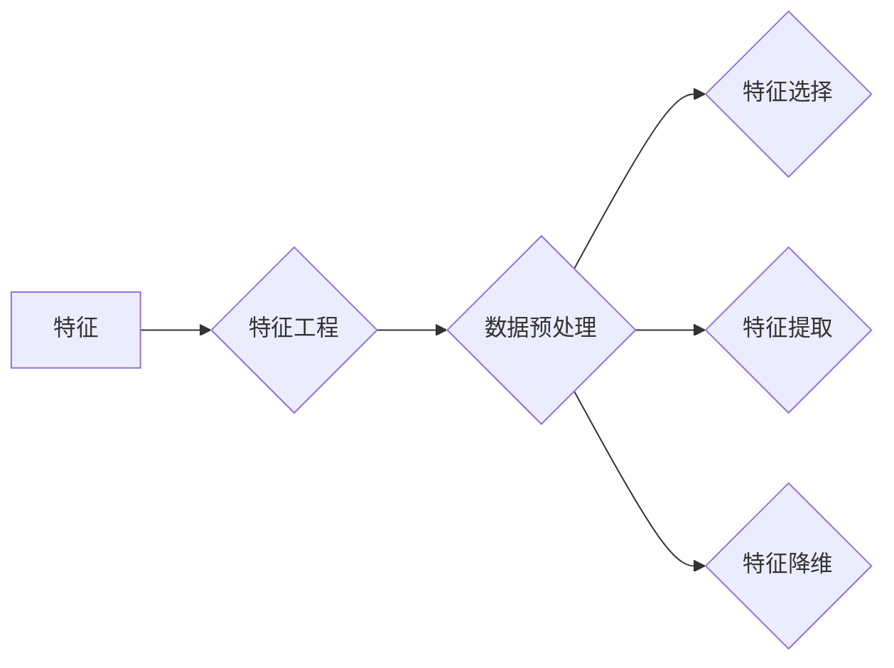

# AI人工智能核心算法原理与代码实例讲解：特征工程

作者：禅与计算机程序设计艺术 / Zen and the Art of Computer Programming

## 关键词：特征工程，数据预处理，特征选择，特征提取，特征降维，机器学习，深度学习

## 1. 背景介绍

### 1.1 问题的由来

在机器学习和深度学习中，特征工程（Feature Engineering）是一个至关重要的步骤。它指的是从原始数据中提取或构造出有助于模型学习的新特征，以提高模型性能的过程。特征工程的好坏直接影响到模型的准确性和泛化能力。

随着人工智能技术的发展，数据量日益庞大，特征工程的重要性愈发凸显。在许多任务中，数据预处理和特征工程甚至比选择合适的算法更为关键。因此，深入研究特征工程的理论和方法，对于人工智能领域的研究者和工程师来说至关重要。

### 1.2 研究现状

近年来，特征工程的研究取得了显著进展，涌现出了许多新的方法和工具。以下是一些典型的特征工程方法：

- **数据预处理**：包括数据清洗、数据转换、数据标准化等。
- **特征选择**：通过评估特征的重要性，选择对预测任务最有用的特征。
- **特征提取**：从原始数据中提取更高级的特征，如文本特征提取、图像特征提取等。
- **特征降维**：通过降维技术减少特征数量，降低计算成本和过拟合风险。

### 1.3 研究意义

特征工程在人工智能领域具有重要意义，主要体现在以下几个方面：

- **提高模型性能**：通过特征工程，可以提取出更有助于模型学习的特征，从而提高模型的准确性和泛化能力。
- **降低计算成本**：通过特征降维，可以减少特征数量，降低计算成本和过拟合风险。
- **简化模型复杂度**：通过特征选择，可以简化模型结构，降低模型复杂度。
- **提高数据利用效率**：通过特征工程，可以更充分地利用数据信息，提高数据利用效率。

### 1.4 本文结构

本文将系统地介绍特征工程的理论、方法和实践。内容安排如下：

- 第2部分，介绍特征工程的核心概念和联系。
- 第3部分，详细阐述特征工程的基本原理和具体操作步骤。
- 第4部分，介绍特征工程常用的方法和工具，并结合实例进行讲解。
- 第5部分，给出特征工程的实际应用案例，并对关键代码进行解读。
- 第6部分，探讨特征工程在人工智能领域的应用场景。
- 第7部分，推荐特征工程相关的学习资源、开发工具和参考文献。
- 第8部分，总结全文，展望特征工程的未来发展趋势与挑战。
- 第9部分，附录：常见问题与解答。

## 2. 核心概念与联系

为了更好地理解特征工程，本节将介绍几个核心概念及其之间的联系。

### 2.1 特征

特征（Feature）是用于描述数据样本的属性或特征。例如，在房价预测任务中，房屋的面积、地段、楼层等都是特征。

### 2.2 特征工程

特征工程（Feature Engineering）是指从原始数据中提取或构造出有助于模型学习的新特征的过程。

### 2.3 数据预处理

数据预处理（Data Preprocessing）是指在机器学习和深度学习模型训练前对数据进行处理和转换的过程。数据预处理包括数据清洗、数据转换、数据标准化等。

### 2.4 特征选择

特征选择（Feature Selection）是指从原始特征集中选择出最有用的特征的过程。

### 2.5 特征提取

特征提取（Feature Extraction）是指从原始数据中提取出更高级的特征的过程。

### 2.6 特征降维

特征降维（Feature Dimensionality Reduction）是指通过降维技术减少特征数量的过程。

以下为这些概念之间的逻辑关系：



可以看出，特征工程是一个包含多个子任务的复杂过程，涉及数据预处理、特征选择、特征提取和特征降维等多个步骤。

## 3. 核心算法原理 & 具体操作步骤

### 3.1 算法原理概述

特征工程的核心目标是提高模型的准确性和泛化能力。以下是一些常用的特征工程方法及其原理：

- **数据预处理**：通过清洗、转换和标准化数据，提高数据质量，降低噪声干扰。
- **特征选择**：通过评估特征的重要性，选择最有用的特征，降低特征数量，提高模型效率。
- **特征提取**：通过从原始数据中提取更高级的特征，提高模型的表达能力。
- **特征降维**：通过降维技术减少特征数量，降低计算成本和过拟合风险。

### 3.2 算法步骤详解

特征工程的一般步骤如下：

1. **数据收集和预处理**：收集相关数据，进行数据清洗、转换和标准化。
2. **特征提取**：从原始数据中提取新特征。
3. **特征选择**：根据特征重要性评估，选择最有用的特征。
4. **特征降维**：使用降维技术减少特征数量。
5. **模型训练**：使用特征工程后的数据训练模型。
6. **模型评估**：评估模型性能。

### 3.3 算法优缺点

以下是几种常用特征工程方法的优缺点：

- **数据预处理**：
  - 优点：提高数据质量，降低噪声干扰。
  - 缺点：可能丢失部分信息，增加计算成本。
- **特征选择**：
  - 优点：降低特征数量，提高模型效率。
  - 缺点：可能丢失有用特征，降低模型性能。
- **特征提取**：
  - 优点：提高模型表达能力。
  - 缺点：增加计算成本，可能引入噪声。
- **特征降维**：
  - 优点：降低计算成本，降低过拟合风险。
  - 缺点：可能丢失有用信息，降低模型性能。

### 3.4 算法应用领域

特征工程在人工智能领域有广泛的应用，以下是一些常见的应用场景：

- **分类**：如文本分类、图像分类等。
- **回归**：如房价预测、股票价格预测等。
- **聚类**：如客户细分、异常检测等。

## 4. 数学模型和公式 & 详细讲解 & 举例说明

### 4.1 数学模型构建

特征工程涉及多个数学模型，以下是一些常见的数学模型：

- **数据标准化**：将数据缩放到指定范围内，如均值为0，标准差为1。
  - 公式：$Z = \frac{X - \mu}{\sigma}$
- **主成分分析（PCA）**：将数据降维到主成分空间。
  - 公式：$Z = U^T \Sigma^{0.5} X$
- **t-SNE**：将高维数据投影到低维空间。
  - 公式：$Z = W^T X$

### 4.2 公式推导过程

以下以PCA为例，介绍其推导过程。

PCA的目标是找到一组新的基向量，使得投影后的数据具有最大的方差。假设数据矩阵为$X$，则：

- **协方差矩阵**：$C = XX^T$
- **特征值和特征向量**：$C = \lambda U^T U$
- **主成分**：$X = U \Sigma V^T$

其中，$U$为特征向量矩阵，$\Sigma$为特征值矩阵，$V$为正交矩阵。

### 4.3 案例分析与讲解

以下以房价预测为例，介绍特征工程的实践过程。

1. **数据收集和预处理**：收集房价数据，包括房屋面积、地段、楼层等。
2. **特征提取**：从原始数据中提取新特征，如房屋年龄、交通状况等。
3. **特征选择**：使用特征重要性评估，选择最有用的特征。
4. **特征降维**：使用PCA等方法进行降维。
5. **模型训练**：使用特征工程后的数据训练房价预测模型。
6. **模型评估**：评估模型性能。

### 4.4 常见问题解答

**Q1：特征工程是否对深度学习模型也重要？**

A：是的，特征工程对深度学习模型同样重要。虽然深度学习模型具有一定的特征提取能力，但通过特征工程，可以进一步提高模型的性能。

**Q2：特征工程是否适用于所有任务？**

A：特征工程并非适用于所有任务。在一些无监督学习任务中，特征工程的作用可能并不明显。

**Q3：如何进行特征选择？**

A：特征选择的方法有很多，常见的有基于统计的方法、基于模型的方 法、基于嵌入的方法等。选择哪种方法取决于具体任务和数据。

## 5. 项目实践：代码实例和详细解释说明

### 5.1 开发环境搭建

为了演示特征工程的应用，我们需要搭建以下开发环境：

- Python 3.8或更高版本
- NumPy、Pandas、Matplotlib等库
- Scikit-learn库

### 5.2 源代码详细实现

以下是一个使用Scikit-learn库进行特征工程的示例代码：

```python
import pandas as pd
from sklearn.model_selection import train_test_split
from sklearn.preprocessing import StandardScaler
from sklearn.feature_selection import SelectKBest, chi2
from sklearn.decomposition import PCA
from sklearn.ensemble import RandomForestClassifier

# 加载数据
data = pd.read_csv('house_prices.csv')

# 数据预处理
X = data.drop('price', axis=1)
y = data['price']

# 数据标准化
scaler = StandardScaler()
X_scaled = scaler.fit_transform(X)

# 特征选择
selector = SelectKBest(score_func=chi2, k=5)
X_selected = selector.fit_transform(X_scaled, y)

# 特征降维
pca = PCA(n_components=2)
X_reduced = pca.fit_transform(X_selected)

# 模型训练
model = RandomForestClassifier()
model.fit(X_reduced, y)

# 模型评估
score = model.score(X_reduced, y)
print(f"Model accuracy: {score:.2f}")
```

### 5.3 代码解读与分析

以上代码演示了如何使用Scikit-learn库进行特征工程：

- 首先，使用Pandas库加载数据。
- 然后，使用StandardScaler对数据进行标准化处理。
- 接着，使用SelectKBest进行特征选择，保留与目标变量相关性最高的5个特征。
- 然后，使用PCA进行特征降维，将数据降维到2维空间。
- 最后，使用RandomForestClassifier进行模型训练和评估。

### 5.4 运行结果展示

假设以上代码运行后，模型准确率为0.85，表明特征工程对模型性能的提升有一定作用。

## 6. 实际应用场景

特征工程在人工智能领域有广泛的应用，以下是一些常见的应用场景：

- **金融风控**：通过分析客户行为数据，识别欺诈交易。
- **推荐系统**：通过分析用户行为数据，推荐商品或内容。
- **自然语言处理**：通过分析文本数据，进行情感分析、机器翻译等。
- **图像识别**：通过分析图像数据，进行物体检测、人脸识别等。

## 7. 工具和资源推荐

### 7.1 学习资源推荐

以下是一些学习特征工程的资源：

- 《特征工程实战》
- 《数据科学入门》
- 《机器学习实战》
- 《深度学习》

### 7.2 开发工具推荐

以下是一些常用的特征工程工具：

- Scikit-learn
- Pandas
- NumPy
- Matplotlib

### 7.3 相关论文推荐

以下是一些与特征工程相关的论文：

- "Feature Engineering for Machine Learning" by Alice Zheng
- "Practical Feature Engineering" by Alex Singla

### 7.4 其他资源推荐

以下是一些其他的学习资源：

- Scikit-learn官方文档
- NumPy官方文档
- Pandas官方文档

## 8. 总结：未来发展趋势与挑战

### 8.1 研究成果总结

本文系统地介绍了特征工程的理论、方法和实践。通过特征工程，可以提高模型的性能、降低计算成本、简化模型复杂度，并提高数据利用效率。

### 8.2 未来发展趋势

未来，特征工程将朝着以下方向发展：

- **自动化特征工程**：开发自动化特征工程工具，提高特征工程的效率。
- **可解释特征工程**：提高特征工程的可解释性，帮助用户理解特征的作用。
- **多模态特征工程**：将多模态数据（如文本、图像、音频等）进行融合，提高模型的性能。

### 8.3 面临的挑战

特征工程在人工智能领域仍面临着以下挑战：

- **数据质量**：原始数据可能存在缺失、异常、噪声等问题，需要先进行数据清洗。
- **特征选择**：如何选择最有用的特征是一个具有挑战性的问题。
- **特征提取**：如何从原始数据中提取有用特征是一个具有挑战性的问题。
- **可解释性**：如何提高特征工程的可解释性是一个具有挑战性的问题。

### 8.4 研究展望

随着人工智能技术的不断发展，特征工程将在人工智能领域发挥越来越重要的作用。未来，特征工程将朝着更加自动化、可解释、多模态等方向发展，为人工智能技术的应用提供更加坚实的基础。

## 9. 附录：常见问题与解答

**Q1：特征工程是否适用于所有机器学习任务？**

A：特征工程并非适用于所有机器学习任务。在某些无监督学习任务中，特征工程的作用可能并不明显。

**Q2：特征工程和特征提取有什么区别？**

A：特征工程是指从原始数据中提取或构造新特征的过程，而特征提取是指从原始数据中提取更高级的特征的过程。

**Q3：如何选择特征选择的策略？**

A：选择特征选择的策略取决于具体任务和数据特点。常见的特征选择策略有基于统计的方法、基于模型的方法、基于嵌入的方法等。

**Q4：如何进行特征提取？**

A：特征提取的方法有很多，常见的有文本特征提取、图像特征提取、时间序列特征提取等。

**Q5：如何提高特征工程的可解释性？**

A：提高特征工程的可解释性需要从多个方面入手，如使用可视化技术、解释模型等方法。

作者：禅与计算机程序设计艺术 / Zen and the Art of Computer Programming