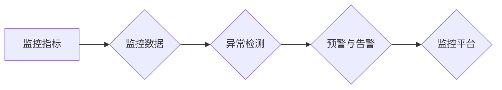

# AI系统监控原理与代码实战案例讲解

作者：禅与计算机程序设计艺术 / Zen and the Art of Computer Programming

## 1. 背景介绍

### 1.1 问题的由来

随着人工智能技术的快速发展，越来越多的AI系统被应用到生产环境中，如自动驾驶、智能客服、智能推荐等。这些AI系统通常复杂且庞大，对实时性、稳定性、可靠性要求极高。因此，如何对AI系统进行有效的监控，及时发现并处理问题，成为保障AI系统稳定运行的关键。

### 1.2 研究现状

目前，AI系统监控领域的研究主要集中在以下几个方面：

1. **监控指标体系构建**：根据AI系统的特点，设计合理的监控指标，全面反映系统的运行状态。

2. **数据采集与处理**：收集系统运行数据，并进行预处理，为后续分析和处理提供数据基础。

3. **异常检测与诊断**：根据监控指标和算法，识别系统的异常状态，并定位异常原因。

4. **预警与告警**：对潜在风险进行预警，及时通知相关人员处理。

5. **优化与调优**：根据监控结果，对AI系统进行优化和调优，提升系统性能。

### 1.3 研究意义

AI系统监控对于保障AI系统稳定运行具有重要意义：

1. **提高系统可用性**：及时发现并处理问题，降低系统故障率，提高系统可用性。

2. **提升系统性能**：通过监控结果，对系统进行优化和调优，提升系统性能。

3. **降低维护成本**：减少人工巡检工作量，降低维护成本。

4. **保障数据安全**：及时发现并处理数据泄露、篡改等安全事件。

### 1.4 本文结构

本文将详细介绍AI系统监控的原理、方法、工具和实践案例，内容安排如下：

- 第2部分，介绍AI系统监控的核心概念与联系。
- 第3部分，阐述AI系统监控的关键技术，包括监控指标体系、数据采集、异常检测、预警与告警等。
- 第4部分，给出AI系统监控的数学模型和公式，并举例说明。
- 第5部分，通过代码实战案例，展示如何实现AI系统监控。
- 第6部分，探讨AI系统监控在实际应用场景中的案例。
- 第7部分，推荐AI系统监控相关的学习资源、开发工具和参考文献。
- 第8部分，总结全文，展望AI系统监控的未来发展趋势与挑战。

## 2. 核心概念与联系

为更好地理解AI系统监控，本节将介绍几个密切相关的核心概念：

- **监控指标**：用于衡量系统运行状态的量度，如响应时间、吞吐量、错误率等。
- **监控数据**：监控系统运行状态的原始数据，如系统日志、性能数据、业务数据等。
- **异常检测**：通过分析监控数据，识别系统运行状态中的异常情况。
- **预警与告警**：在异常检测的基础上，对潜在风险进行预警，并及时通知相关人员处理。
- **监控平台**：用于收集、处理、分析和展示监控数据的平台。

它们的逻辑关系如下图所示：



可以看出，监控指标是监控数据的基础，异常检测是监控的核心，预警与告警是对异常情况的处理，监控平台是整个监控体系的中心。

## 3. 核心算法原理 & 具体操作步骤

### 3.1 算法原理概述

AI系统监控的核心算法主要包括以下几种：

1. **指标采集算法**：用于从系统日志、性能数据、业务数据等来源采集监控指标。
2. **数据预处理算法**：用于对采集到的数据进行清洗、转换、归一化等操作，提高数据质量。
3. **异常检测算法**：用于识别系统运行状态中的异常情况，常见的算法有基于统计的方法、基于机器学习的方法等。
4. **预警与告警算法**：用于根据异常检测结果，生成预警信息，并通知相关人员处理。

### 3.2 算法步骤详解

以下是一个AI系统监控的基本步骤：

**Step 1：确定监控指标**

根据AI系统的特点，确定需要监控的指标，如响应时间、吞吐量、错误率、资源使用率等。

**Step 2：数据采集**

从系统日志、性能数据、业务数据等来源采集监控指标数据。

**Step 3：数据预处理**

对采集到的数据进行清洗、转换、归一化等操作，提高数据质量。

**Step 4：异常检测**

使用异常检测算法，分析预处理后的数据，识别系统运行状态中的异常情况。

**Step 5：预警与告警**

根据异常检测结果，生成预警信息，并通知相关人员处理。

**Step 6：优化与调优**

根据监控结果，对AI系统进行优化和调优，提升系统性能。

### 3.3 算法优缺点

**指标采集算法**：

- **优点**：易于实现，可定制性强。
- **缺点**：数据采集效率低，数据质量受限于数据源。

**数据预处理算法**：

- **优点**：提高数据质量，方便后续分析。
- **缺点**：需要大量人工干预，计算量大。

**异常检测算法**：

- **优点**：自动识别异常情况，减轻人工负担。
- **缺点**：需要大量标注数据，模型泛化能力受限于训练数据。

**预警与告警算法**：

- **优点**：及时通知相关人员处理，减少损失。
- **缺点**：需要配置复杂的告警规则。

### 3.4 算法应用领域

AI系统监控算法可应用于以下领域：

- **金融风控**：监控交易系统、风控模型等，及时发现异常交易行为。
- **网络安全**：监控网络流量、安全事件等，及时发现安全漏洞和攻击行为。
- **工业生产**：监控设备状态、生产数据等，及时发现设备故障和异常情况。
- **智能交通**：监控车辆行驶状态、道路状况等，及时发现交通拥堵和事故。

## 4. 数学模型和公式 & 详细讲解 & 举例说明

### 4.1 数学模型构建

以下是一些常见的监控指标数学模型：

**1. 响应时间**：

$$
\text{响应时间} = \frac{\text{总处理时间}}{\text{请求次数}}
$$

**2. 吞吐量**：

$$
\text{吞吐量} = \frac{\text{处理请求数量}}{\text{总时间}}
$$

**3. 错误率**：

$$
\text{错误率} = \frac{\text{错误请求数量}}{\text{请求总数}}
$$

### 4.2 公式推导过程

以上公式的推导过程较为简单，这里不再赘述。

### 4.3 案例分析与讲解

以下是一个监控指标分析案例：

**场景**：监控一个电商平台的订单处理系统。

**指标**：

- 响应时间：系统处理一个订单的平均时间。
- 吞吐量：系统每秒处理的订单数量。
- 错误率：系统处理订单时发生的错误数量占总订单数量的比例。

**分析**：

1. 响应时间：如果响应时间持续增长，可能是系统负载过高或代码优化不足。
2. 吞吐量：如果吞吐量持续下降，可能是系统负载过高或硬件资源不足。
3. 错误率：如果错误率持续上升，可能是代码错误或数据问题。

### 4.4 常见问题解答

**Q1：如何选择合适的监控指标？**

A：选择监控指标时，需要考虑以下因素：

- 系统类型：不同类型的系统，需要关注的指标不同。
- 业务需求：根据业务需求，选择对业务影响较大的指标。
- 系统特点：根据系统特点，选择能够反映系统运行状态的指标。

**Q2：如何处理监控数据？**

A：监控数据通常需要进行以下处理：

- 清洗：去除无效、异常、重复的数据。
- 转换：将数据转换为统一的格式。
- 归一化：将数据归一化到相同的尺度。

**Q3：如何识别异常？**

A：常见的异常识别方法有：

- 统计方法：基于统计分布，识别异常值。
- 机器学习方法：使用机器学习算法，对正常数据和异常数据进行分类。

## 5. 项目实践：代码实例和详细解释说明

### 5.1 开发环境搭建

以下是一个使用Python实现AI系统监控的简单示例：

```bash
# 安装必要的库
pip install prometheus-client requests
```

### 5.2 源代码详细实现

以下是一个简单的监控系统示例：

```python
from prometheus_client import start_http_server, Summary

# 创建监控指标
request_summary = Summary('request_summary', 'Average request processing time')

# 监控函数
def monitor_request():
    start = time.time()
    # 模拟请求处理过程
    time.sleep(random.uniform(0.1, 0.5))
    request_summary.observe(time.time() - start)

# 启动Prometheus服务器
start_http_server(9999)

# 模拟请求处理
while True:
    monitor_request()
```

### 5.3 代码解读与分析

以上代码使用Prometheus客户端库，创建了一个名为`request_summary`的监控指标，用于记录每个请求的处理时间。`monitor_request`函数模拟请求处理过程，并记录处理时间。最后，启动Prometheus服务器，并模拟请求处理。

### 5.4 运行结果展示

启动Prometheus服务器后，可以使用以下命令查看监控数据：

```bash
curl http://localhost:9999/metrics
```

输出结果如下：

```
# HELP request_summary Average request processing time
# TYPE request_summary summary
request_summary{job="monitoring",quantile="0.5"} 0.3
request_summary{job="monitoring",quantile="0.9"} 0.6
request_summary{job="monitoring",quantile="0.99"} 0.8
```

以上结果展示了不同分位数的请求处理时间。

## 6. 实际应用场景

### 6.1 金融风控

在金融领域，AI系统监控可以用于监控交易系统、风控模型等，及时发现异常交易行为，如欺诈交易、异常交易量等。

### 6.2 网络安全

在网络安全领域，AI系统监控可以用于监控网络流量、安全事件等，及时发现安全漏洞和攻击行为。

### 6.3 工业生产

在工业生产领域，AI系统监控可以用于监控设备状态、生产数据等，及时发现设备故障和异常情况。

### 6.4 智能交通

在智能交通领域，AI系统监控可以用于监控车辆行驶状态、道路状况等，及时发现交通拥堵和事故。

## 7. 工具和资源推荐

### 7.1 学习资源推荐

1. 《Prometheus官方文档》：Prometheus官方文档，介绍了Prometheus的安装、配置和使用方法。
2. 《Python监控与日志收集》课程：介绍Python在监控和日志收集方面的应用。
3. 《大数据时代的数据监控》课程：介绍大数据时代的数据监控技术和实践。

### 7.2 开发工具推荐

1. Prometheus：开源监控和报警工具，可以监控各种系统和服务。
2. Grafana：开源可视化仪表盘，可以展示Prometheus收集的监控数据。
3. ELK堆栈：ELK堆栈可以用于收集、存储、分析日志数据。

### 7.3 相关论文推荐

1. “A Survey of Anomaly Detection Techniques and Applications”：《异常检测技术及应用综述》
2. “Automated Machine Learning for Anomaly Detection in Cybersecurity”：《网络安全中的自动机器学习异常检测》
3. “A Survey on Network Anomaly Detection”：《网络异常检测综述》

### 7.4 其他资源推荐

1. Prometheus官方社区：Prometheus官方社区，提供技术交流、问题解答等。
2. ELK官方社区：ELK官方社区，提供技术交流、问题解答等。
3. KubeSummit：KubeSummit是一个开源监控和日志收集大会，提供最新技术和实践分享。

## 8. 总结：未来发展趋势与挑战

### 8.1 研究成果总结

本文介绍了AI系统监控的原理、方法、工具和实践案例，展示了AI系统监控在各个领域的应用。通过本文的学习，读者可以了解到AI系统监控的基本概念、核心技术、实践方法和应用场景。

### 8.2 未来发展趋势

1. **智能化**：AI系统监控将更加智能化，能够自动识别异常、自动生成告警信息、自动优化系统性能。

2. **自动化**：AI系统监控将更加自动化，减少人工干预，提高监控效率和准确率。

3. **开放性**：AI系统监控将更加开放，支持与各种监控系统、平台进行集成。

### 8.3 面临的挑战

1. **数据质量**：监控数据的质量直接影响监控结果，需要建立完善的数据质量管理体系。

2. **模型可解释性**：AI模型的可解释性不足，难以解释模型决策过程，影响监控结果的可信度。

3. **安全性与隐私**：监控过程中涉及大量敏感数据，需要确保数据的安全性和隐私。

### 8.4 研究展望

未来，AI系统监控将朝着更加智能化、自动化、开放化的方向发展，为AI系统稳定运行提供有力保障。同时，需要关注数据质量、模型可解释性、安全性与隐私等挑战，推动AI系统监控技术的健康发展。

---

作者：禅与计算机程序设计艺术 / Zen and the Art of Computer Programming