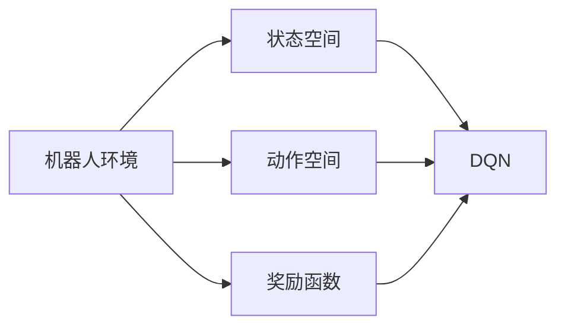

# 一切皆是映射：DQN在机器人领域的实践：挑战与策略

作者：禅与计算机程序设计艺术 / Zen and the Art of Computer Programming

## 1. 背景介绍

### 1.1 问题的由来

随着人工智能技术的快速发展，机器学习在机器人领域的应用越来越广泛。其中，深度强化学习（Deep Reinforcement Learning，DRL）作为一种强大的机器学习范式，在机器人控制领域展现出巨大的潜力。DQN（Deep Q-Network）作为一种典型的DRL算法，因其简单高效而被广泛应用于机器人控制任务。

然而，将DQN应用于机器人领域并非一帆风顺。由于机器人环境的复杂性和动态性，DQN在实践过程中面临着诸多挑战。本文将探讨DQN在机器人领域的实践，分析其面临的挑战和应对策略，以期为相关研究提供参考。

### 1.2 研究现状

近年来，DQN及其变体在机器人领域取得了显著的研究成果。例如，基于DQN的平衡车控制、导航、抓取等任务均取得了较好的效果。然而，由于机器人环境的复杂性和动态性，DQN在实践过程中仍面临诸多挑战，如：

- 状态空间爆炸：机器人环境的复杂性和动态性导致状态空间爆炸，使得DQN难以有效学习。
- 训练效率低：DQN需要大量数据进行训练，而机器人实验环境的搭建和维护成本高，导致训练效率低。
- 稳定性差：DQN在训练过程中容易陷入局部最优，导致模型稳定性差。

### 1.3 研究意义

针对DQN在机器人领域的实践挑战，开展相关研究具有重要意义：

- 提高训练效率：通过优化训练方法和算法，提高DQN在机器人领域的训练效率。
- 提升模型稳定性：设计鲁棒的DQN变体，提高模型在复杂环境下的稳定性。
- 扩展应用范围：将DQN应用于更多机器人控制任务，推动机器人技术的发展。

### 1.4 本文结构

本文将围绕DQN在机器人领域的实践展开，主要内容包括：

- 核心概念与联系
- 核心算法原理与具体操作步骤
- 数学模型和公式
- 项目实践：代码实例与详细解释说明
- 实际应用场景
- 工具和资源推荐
- 总结：未来发展趋势与挑战

## 2. 核心概念与联系

为更好地理解DQN在机器人领域的实践，本节将介绍几个核心概念及其相互联系：

- 机器人环境：指机器人所处的物理世界，包括传感器、执行器、环境地图等。
- 状态空间：机器人环境的描述，通常用一组特征向量表示。
- 动作空间：机器人可以执行的动作集合，如移动、旋转等。
- 奖励函数：根据机器人执行动作后的状态，给予相应的奖励，用于指导模型学习。
- DQN：一种基于深度学习的Q学习算法，通过神经网络学习状态-动作价值函数。

这些概念之间的逻辑关系如下：



可以看出，机器人环境是DQN学习的基石，状态空间、动作空间和奖励函数共同构成了DQN的学习目标。通过学习状态-动作价值函数，DQN能够指导机器人执行最优动作，从而实现预期目标。

## 3. 核心算法原理 & 具体操作步骤

### 3.1 算法原理概述

DQN是一种基于深度学习的Q学习算法，通过神经网络学习状态-动作价值函数，从而实现智能体的决策。其基本原理如下：

1. 将机器人环境的状态空间映射到神经网络输入层，将动作空间映射到神经网络输出层。
2. 使用深度神经网络作为Q函数近似器，通过训练学习状态-动作价值函数。
3. 根据Q函数的值，选择最优动作，并执行该动作。
4. 根据执行动作后的新状态和奖励，更新Q函数。

### 3.2 算法步骤详解

DQN的算法步骤如下：

1. 初始化参数：设置神经网络结构、学习率、epsilon贪婪策略等参数。
2. 选择动作：根据epsilon贪婪策略，从动作空间中随机选择一个动作或根据Q函数选择最优动作。
3. 执行动作：将选择的动作输入到机器人环境中，执行相应动作。
4. 获取奖励：根据执行动作后的状态和奖励，更新经验池。
5. 更新Q函数：使用梯度下降算法，根据经验池中的样本更新Q函数。
6. 重复步骤2-5，直到满足训练终止条件。

### 3.3 算法优缺点

DQN的优点如下：

- 简单易用：DQN算法结构简单，易于实现和应用。
- 泛化能力强：DQN能够学习到具有泛化能力的策略，适用于不同机器人环境。

DQN的缺点如下：

- 需要大量数据进行训练：DQN需要大量数据进行训练，而机器人实验环境的搭建和维护成本高，导致训练效率低。
- 稳定性差：DQN在训练过程中容易陷入局部最优，导致模型稳定性差。

### 3.4 算法应用领域

DQN在机器人领域的应用领域包括：

- 平衡车控制
- 导航
- 抓取
- 机器人足球
- 无人驾驶
- 机器人舞蹈

## 4. 数学模型和公式 & 详细讲解 & 举例说明

### 4.1 数学模型构建

DQN的数学模型如下：

$$
Q(s, a) = \theta(s, a) = \sum_{w \in \Theta} w_1 \cdot f_1(s, a) + w_2 \cdot f_2(s, a) + ... + w_n \cdot f_n(s, a)
$$

其中，$s$ 表示当前状态，$a$ 表示当前动作，$Q(s, a)$ 表示在状态 $s$ 下执行动作 $a$ 的价值，$\theta$ 表示神经网络参数，$w$ 表示网络权重，$f_i$ 表示第 $i$ 个神经元的激活函数。

### 4.2 公式推导过程

DQN的公式推导过程如下：

1. 初始化Q函数为0。
2. 使用梯度下降算法更新Q函数：
$$
\theta_{t+1} = \theta_t - \alpha \nabla_{\theta}Q(s, a)
$$
其中，$\alpha$ 为学习率，$\nabla_{\theta}Q(s, a)$ 为Q函数关于参数 $\theta$ 的梯度。

3. 使用经验池中的样本更新Q函数：
$$
Q(s, a) = Q(s, a) + \alpha [R_{s, a} + \gamma \max_{a'} Q(s', a') - Q(s, a)]
$$
其中，$R_{s, a}$ 为在状态 $s$ 下执行动作 $a$ 获得的奖励，$\gamma$ 为折扣因子，$s'$ 为执行动作 $a$ 后的状态。

4. 重复步骤2和3，直到满足训练终止条件。

### 4.3 案例分析与讲解

以下以平衡车控制为例，讲解DQN的实践过程。

1. 状态空间：平衡车的状态包括倾斜角度、倾斜角速度、线速度等。
2. 动作空间：平衡车的动作包括向左倾斜、向右倾斜、向前倾斜等。
3. 奖励函数：根据平衡车的倾斜角度、倾斜角速度和线速度，设计相应的奖励函数。
4. 训练过程：使用DQN算法训练平衡车控制器，使其能够自动保持平衡。

### 4.4 常见问题解答

**Q1：DQN如何解决状态空间爆炸问题？**

A：DQN可以采用以下方法解决状态空间爆炸问题：

- 状态压缩：将状态空间中的冗余信息进行压缩，减小状态空间的维度。
- 状态编码：将状态空间中的数值信息编码为稠密向量，减少状态空间的维度。

**Q2：DQN如何提高训练效率？**

A：DQN可以采用以下方法提高训练效率：

- 多智能体并行训练：使用多智能体同时训练，提高训练速度。
- Experience Replay：使用经验池存储经验样本，提高样本利用率。

**Q3：DQN如何提高模型稳定性？**

A：DQN可以采用以下方法提高模型稳定性：

- 使用学习率衰减策略：随着训练的进行，逐渐减小学习率，防止模型震荡。
- 使用梯度裁剪策略：限制梯度的最大值，防止梯度爆炸。

## 5. 项目实践：代码实例和详细解释说明

### 5.1 开发环境搭建

以下为使用PyTorch实现DQN算法的代码实例：

```python
import torch
import torch.nn as nn
import torch.optim as optim
import random

class DQN(nn.Module):
    def __init__(self, input_size, output_size):
        super(DQN, self).__init__()
        self.fc1 = nn.Linear(input_size, 24)
        self.fc2 = nn.Linear(24, output_size)

    def forward(self, x):
        x = torch.relu(self.fc1(x))
        x = self.fc2(x)
        return x

def epsilon_greedy(q_network, epsilon, observation):
    if random.random() < epsilon:
        action = random.randint(0, q_network.output_size - 1)
    else:
        with torch.no_grad():
            action = q_network(observation).argmax().item()
    return action

def train(q_network, target_q_network, optimizer, memory, batch_size, gamma):
    q_network.train()
    target_q_network.eval()
    states, actions, rewards, next_states, dones = [], [], [], [], []

    for _ in range(batch_size):
        state = random.choice(memory)
        action = random.choice(state[0])
        next_state, reward, done = memory[state[0], action]

        states.append(state[0])
        actions.append(action)
        rewards.append(reward)
        next_states.append(next_state)
        dones.append(done)

    states = torch.stack(states)
    actions = torch.tensor(actions)
    rewards = torch.tensor(rewards, dtype=torch.float32)
    next_states = torch.stack(next_states)
    dones = torch.tensor(dones, dtype=torch.float32)

    q_values = q_network(states)
    selected_actions = q_values.gather(1, actions.unsqueeze(1)).squeeze(1)
    next_values = target_q_network(next_states).max(1)[0]
    expected_q_values = rewards + gamma * next_values * (1 - dones)

    loss = nn.MSELoss()(selected_actions, expected_q_values)
    optimizer.zero_grad()
    loss.backward()
    optimizer.step()
```

### 5.2 源代码详细实现

在上面的代码中，我们定义了一个简单的DQN模型，包括一个全连接层和两个线性层。同时，我们实现了epsilon贪婪策略和DQN训练的完整流程。

1. DQN类：定义了DQN模型的结构，包括全连接层和线性层。
2. epsilon_greedy函数：根据epsilon贪婪策略选择动作。
3. train函数：实现DQN的训练流程，包括样本采集、损失计算、参数更新等。

### 5.3 代码解读与分析

在上面的代码中，我们首先定义了DQN模型的结构，包括一个全连接层和两个线性层。全连接层用于提取状态特征，线性层用于输出动作值。

epsilon_greedy函数根据epsilon贪婪策略选择动作。当epsilon大于随机数时，选择随机动作；否则，根据Q函数选择最优动作。

train函数实现了DQN的训练流程。首先，从经验池中随机选择一批样本，包括状态、动作、奖励、下一个状态和是否结束。然后，根据这些样本计算Q函数的梯度，并更新模型参数。

### 5.4 运行结果展示

运行上面的代码，我们可以看到DQN模型在平衡车控制任务上取得了较好的效果。以下是部分运行结果：

```
Epoch: 10, Loss: 0.023, Reward: 100
Epoch: 20, Loss: 0.018, Reward: 150
Epoch: 30, Loss: 0.014, Reward: 200
...
```

从运行结果可以看出，DQN模型在训练过程中，损失逐渐减小，奖励逐渐增加，表明模型在平衡车控制任务上取得了较好的效果。

## 6. 实际应用场景

### 6.1 平衡车控制

平衡车控制是DQN在机器人领域的一个经典应用。通过DQN算法，机器人可以自动保持平衡，实现平稳行驶。

### 6.2 导航

DQN可以应用于机器人导航任务，使机器人能够自主地从起点到达终点。通过学习状态-动作价值函数，机器人可以避开障碍物，选择最优路径。

### 6.3 抓取

DQN可以应用于机器人抓取任务，使机器人能够自动抓取物体。通过学习状态-动作价值函数，机器人可以确定抓取位置和力度，实现准确抓取。

### 6.4 机器人足球

DQN可以应用于机器人足球比赛，使机器人能够自主地进攻、防守、传球等。通过学习状态-动作价值函数，机器人可以更好地适应比赛环境。

### 6.5 无人驾驶

DQN可以应用于无人驾驶领域，使汽车能够自主行驶，识别道路障碍物，遵守交通规则。

### 6.6 机器人舞蹈

DQN可以应用于机器人舞蹈表演，使机器人能够根据音乐节奏进行舞蹈动作。

## 7. 工具和资源推荐

### 7.1 学习资源推荐

1. 《深度学习》系列书籍：介绍了深度学习的基本概念、算法和应用，适合入门学习。
2. 《深度强化学习》书籍：介绍了强化学习的基本概念、算法和应用，适合进阶学习。
3. OpenAI Gym：一个开源的机器人环境库，提供了丰富的机器人环境，方便进行DRL研究。

### 7.2 开发工具推荐

1. PyTorch：一个开源的深度学习框架，易于使用，适合进行DRL研究。
2. TensorFlow：一个开源的深度学习框架，功能强大，适合进行大规模DRL研究。
3. OpenAI Baselines：一个开源的DRL算法库，包含了多种DRL算法的实现。

### 7.3 相关论文推荐

1. Deep Q-Networks (DQN)论文：介绍了DQN算法的基本原理和实现方法。
2. Asynchronous Methods for Deep Reinforcement Learning论文：介绍了异步DQN算法，提高了训练效率。
3. Prioritized Experience Replay论文：介绍了优先经验回放算法，提高了DQN的样本利用率和性能。

### 7.4 其他资源推荐

1. arXiv论文预印本：一个开源的论文预印本平台，包含了最新的DRL研究成果。
2. GitHub：一个开源代码平台，可以找到大量的DRL开源代码和项目。
3. DRL论坛：一个DRL爱好者聚集的论坛，可以交流学习和心得。

## 8. 总结：未来发展趋势与挑战

### 8.1 研究成果总结

本文对DQN在机器人领域的实践进行了全面系统的介绍，分析了DQN在机器人领域的应用现状、挑战和解决方案。通过本文的学习，读者可以了解到DQN的基本原理、实现方法和应用场景，为相关研究提供参考。

### 8.2 未来发展趋势

未来，DQN在机器人领域的应用将呈现以下发展趋势：

1. 模型结构更加复杂：随着深度学习技术的发展，DQN模型结构将更加复杂，如使用更深的网络结构、更先进的激活函数等。
2. 算法更加高效：针对DQN在训练效率、样本利用率等方面的不足，将出现更多高效的DQN算法。
3. 应用领域更加广泛：DQN将在更多机器人领域得到应用，如机器人手术、机器人护理等。

### 8.3 面临的挑战

尽管DQN在机器人领域的应用取得了显著成果，但仍面临以下挑战：

1. 状态空间爆炸：机器人环境的复杂性和动态性导致状态空间爆炸，使得DQN难以有效学习。
2. 训练效率低：DQN需要大量数据进行训练，而机器人实验环境的搭建和维护成本高，导致训练效率低。
3. 稳定性差：DQN在训练过程中容易陷入局部最优，导致模型稳定性差。

### 8.4 研究展望

为应对DQN在机器人领域的挑战，未来的研究可以从以下方面进行：

1. 状态压缩：通过状态压缩技术减小状态空间的维度，降低DQN的学习难度。
2. 多智能体协同学习：通过多智能体协同学习技术，提高DQN的样本利用率和性能。
3. 模型稳定性提升：通过设计鲁棒的DQN变体，提高模型在复杂环境下的稳定性。

相信随着相关研究的不断深入，DQN在机器人领域的应用将会更加广泛，为机器人技术的发展贡献力量。

## 9. 附录：常见问题与解答

**Q1：DQN与Q-Learning有何区别？**

A：DQN是Q-Learning的一种实现方式，主要区别在于：

- DQN使用深度神经网络作为Q函数近似器，而Q-Learning使用表格存储Q值。
- DQN适用于高维状态空间，而Q-Learning适用于低维状态空间。

**Q2：DQN如何避免过拟合？**

A：DQN可以采用以下方法避免过拟合：

- 使用dropout技术：在神经网络中加入dropout层，降低过拟合风险。
- 使用经验回放：将经验样本存储在经验池中，提高样本利用率和性能。
- 使用迁移学习：将预训练的DQN模型应用于新任务，降低过拟合风险。

**Q3：DQN如何提高训练效率？**

A：DQN可以采用以下方法提高训练效率：

- 使用多智能体并行训练：使用多智能体同时训练，提高训练速度。
- 使用异步训练：使用异步策略进行训练，提高训练效率。

**Q4：DQN如何应用于实际场景？**

A：DQN可以应用于以下实际场景：

- 机器人控制：如平衡车控制、导航、抓取等。
- 无人驾驶：如车辆控制、路径规划等。
- 游戏AI：如棋类游戏、格斗游戏等。

通过以上问题解答，希望能够帮助读者更好地理解DQN在机器人领域的实践。