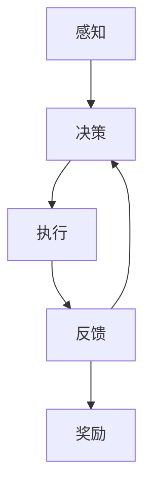

                 

# AI Agent: AI的下一个风口 从智能体到具身智能

> 关键词：AI Agent, 智能体, 具身智能, 增强学习, 强化学习, 深度强化学习, 机器人, 自动驾驶, 游戏AI, 决策优化

## 1. 背景介绍

### 1.1 问题由来

人工智能（AI）领域在过去几十年里取得了飞速的发展，从最初的符号主义到统计学习方法，再到深度学习的兴起，AI逐步从理论走向应用，从数据驱动的统计学习走向端到端的深度学习。然而，这一过程仍然存在一些难以解决的问题。深度学习需要大量标注数据，需要大量的计算资源，并且其“黑箱”特性导致难以解释和调试。这些问题不仅限制了AI的应用场景，也限制了其在复杂环境中的表现。

为了解决这些问题，一种新兴的AI技术——智能体（AI Agent）技术应运而生。智能体技术强调自主性、自适应性和环境交互能力，具有更强的鲁棒性和可解释性，使得AI在复杂的现实环境中具有更广泛的应用前景。

### 1.2 问题核心关键点

智能体技术的核心是让AI能够在复杂环境中自主决策、学习和适应，从而实现更高的智能水平。这种智能不仅仅依赖于数据和计算资源，更依赖于环境交互和学习能力。智能体技术的核心概念包括：

- **智能体**：智能体是一种能够在环境中自主决策、学习和适应的自主系统，它包括环境感知、决策制定和行为执行三个主要组成部分。
- **环境**：智能体运行的外部世界，包括物理世界、虚拟世界和抽象世界。
- **任务**：智能体在环境中的目标，如导航、识别、控制等。
- **反馈**：智能体在执行决策后的环境反馈，用于评估决策效果和调整策略。
- **奖励**：智能体在执行决策后获得的环境奖励，用于强化学习。

这些核心概念构成了智能体技术的理论基础，使得AI能够在复杂环境中表现出更强的智能水平。

### 1.3 问题研究意义

智能体技术的研究意义主要体现在以下几个方面：

1. **增强自主性**：智能体技术使得AI系统具备了更强的自主决策和自我学习能力，可以在复杂环境中自主完成任务。
2. **提升可解释性**：智能体技术的决策过程是透明的，可以通过环境反馈和奖励机制进行解释，使得AI系统的行为更可控、更可靠。
3. **拓宽应用场景**：智能体技术适用于更广泛的场景，如机器人、自动驾驶、游戏AI等，为AI在现实世界中的应用提供了新的可能性。
4. **推动AI发展**：智能体技术是AI发展的下一个风口，具有广阔的应用前景和研究价值。
5. **促进交叉学科发展**：智能体技术涉及计算机科学、控制理论、数学、心理学等多个学科，促进了跨学科的研究和发展。

## 2. 核心概念与联系

### 2.1 核心概念概述

为更好地理解智能体技术，我们首先介绍几个关键概念：

- **智能体**：智能体是能够在环境中自主决策和执行的实体，它包括感知、决策和执行三个部分。
- **环境**：智能体运行的外部世界，包括物理世界、虚拟世界和抽象世界。
- **任务**：智能体在环境中的目标，如导航、识别、控制等。
- **反馈**：智能体在执行决策后的环境反馈，用于评估决策效果和调整策略。
- **奖励**：智能体在执行决策后获得的环境奖励，用于强化学习。
- **策略**：智能体决策制定的方法，如深度强化学习、增强学习、策略搜索等。
- **价值函数**：智能体评估决策效果的方法，用于优化决策策略。

这些概念通过智能体与环境的交互，形成了智能体技术的基本框架。智能体通过感知环境、制定决策、执行行动，并通过反馈和奖励机制调整策略，实现自主学习和适应。

### 2.2 概念间的关系

智能体技术中的各个概念之间存在着紧密的联系，构成了智能体技术的完整生态系统。以下是这些概念之间的联系：

1. **智能体与环境**：智能体与环境通过感知、决策和执行进行交互，智能体在环境中完成任务，环境提供反馈和奖励。
2. **智能体与任务**：智能体的任务是其运行的核心目标，通过任务定义智能体的行为和决策过程。
3. **智能体与反馈**：反馈是智能体决策后的环境响应，用于评估决策效果和调整策略。
4. **智能体与奖励**：奖励是智能体执行决策后获得的环境反馈，用于强化学习。
5. **智能体与策略**：策略是智能体制定决策的方法，包括增强学习、深度强化学习、策略搜索等。
6. **智能体与价值函数**：价值函数用于评估决策效果，通过优化价值函数来优化决策策略。

通过这些概念的相互作用，智能体能够在复杂环境中自主决策、学习和适应，实现更高的智能水平。

### 2.3 核心概念的整体架构

智能体技术的基本架构包括智能体与环境交互的三个主要环节：感知、决策和执行。以下是一个综合的流程图，展示了智能体技术与环境交互的基本架构：



这个流程图展示了智能体技术与环境交互的基本流程：感知环境、制定决策、执行行动、获取反馈、获得奖励，并根据这些信息调整策略。

## 3. 核心算法原理 & 具体操作步骤

### 3.1 算法原理概述

智能体技术的核心算法包括增强学习和深度强化学习。这些算法通过智能体与环境的交互，利用反馈和奖励机制，逐步优化智能体的决策策略，实现自主学习和适应。

增强学习（Reinforcement Learning, RL）是一种基于奖励的机器学习算法，通过智能体在环境中执行行动，获取奖励和反馈，逐步优化决策策略。深度强化学习（Deep Reinforcement Learning, DRL）是一种将深度学习技术应用于增强学习的算法，通过神经网络进行决策制定和策略优化，使得智能体能够在复杂环境中自主决策。

### 3.2 算法步骤详解

智能体技术的实现步骤包括：

1. **定义环境**：定义智能体运行的外部环境，包括环境状态、行动空间、奖励函数等。
2. **设计智能体**：设计智能体的感知、决策和执行模块，以及智能体的策略和学习算法。
3. **收集数据**：通过智能体在环境中的交互，收集数据，用于训练和优化智能体的决策策略。
4. **训练智能体**：利用收集到的数据，训练智能体的策略，优化决策过程。
5. **测试智能体**：在实际环境中测试智能体的表现，评估其决策效果。
6. **优化策略**：根据测试结果，进一步优化智能体的策略和决策过程。

这些步骤构成了一个完整的智能体技术实现流程。

### 3.3 算法优缺点

智能体技术具有以下优点：

1. **自主性**：智能体能够在复杂环境中自主决策和执行，不需要人工干预。
2. **鲁棒性**：智能体具有较强的鲁棒性，能够适应环境的变化和不确定性。
3. **可解释性**：智能体的决策过程透明，可以通过反馈和奖励机制进行解释和调试。
4. **泛化性**：智能体技术具有较强的泛化能力，能够应用于各种复杂环境。

然而，智能体技术也存在一些缺点：

1. **数据需求高**：智能体需要大量数据进行训练，数据收集和标注成本较高。
2. **计算资源需求高**：智能体技术需要大量的计算资源，特别是在深度强化学习中。
3. **过拟合风险**：智能体在数据集上过拟合的风险较大，特别是在数据集较少的情况下。
4. **复杂度较高**：智能体技术的实现和调试较为复杂，需要一定的专业知识和技能。

### 3.4 算法应用领域

智能体技术已经在许多领域得到了广泛应用，以下是一些主要应用领域：

1. **机器人**：智能体技术广泛应用于机器人控制、导航、路径规划、抓取等任务。
2. **自动驾驶**：智能体技术用于自动驾驶中的决策和控制，实现车辆的自主导航和避障。
3. **游戏AI**：智能体技术用于游戏AI的决策和策略优化，提高游戏的智能水平。
4. **金融交易**：智能体技术用于金融交易的决策和策略优化，实现自主交易和风险控制。
5. **医疗诊断**：智能体技术用于医疗诊断中的决策和策略优化，实现自主诊断和治疗。
6. **工业控制**：智能体技术用于工业控制的决策和策略优化，实现自主控制和优化。

这些应用领域展示了智能体技术的广泛应用前景和巨大潜力。

## 4. 数学模型和公式 & 详细讲解 & 举例说明

### 4.1 数学模型构建

智能体技术的数学模型可以表示为智能体与环境的交互过程。假设智能体在每个时间步 $t$ 的状态为 $s_t$，行动为 $a_t$，环境反馈为 $r_t$，下一个状态为 $s_{t+1}$。智能体的策略为 $\pi(a_t|s_t)$，价值函数为 $V(s_t)$。则智能体的决策过程可以表示为：

$$
a_t = \pi(a_t|s_t)
$$

$$
r_t = R(s_t,a_t)
$$

$$
s_{t+1} = P(s_{t+1}|s_t,a_t)
$$

其中，$R(s_t,a_t)$ 表示环境奖励，$P(s_{t+1}|s_t,a_t)$ 表示状态转移概率。

### 4.2 公式推导过程

增强学习的核心目标是最大化长期奖励的累积值。假设智能体在每个时间步 $t$ 的累积奖励为 $G_t = \sum_{k=t}^{\infty} \gamma^k r_k$，则智能体的目标函数为：

$$
\max_{\pi} \mathbb{E} \left[ \sum_{t=0}^{\infty} \gamma^t r_t \right]
$$

其中，$\mathbb{E}[\cdot]$ 表示期望值，$\gamma$ 表示折扣因子。

智能体的决策过程可以表示为：

$$
\pi^*(a_t|s_t) = \arg\max_{a_t} Q_{\pi}(s_t,a_t)
$$

其中，$Q_{\pi}(s_t,a_t)$ 表示智能体在状态 $s_t$ 下采取行动 $a_t$ 的Q值。Q值可以通过如下公式计算：

$$
Q_{\pi}(s_t,a_t) = r_t + \gamma \mathbb{E} [Q_{\pi}(s_{t+1},a_{t+1}) | s_t,a_t]
$$

通过迭代计算Q值，智能体可以逐步优化决策策略。

### 4.3 案例分析与讲解

我们以机器人导航为例，说明智能体技术的实现过程。假设机器人在一个二维平面上，需要从起点到达终点。智能体的决策目标是最小化到达终点的路径长度。

1. **定义环境**：定义机器人在二维平面上的位置、速度和方向，以及障碍物的位置和形状。
2. **设计智能体**：设计机器人的感知、决策和执行模块，以及机器人的策略和学习算法。
3. **收集数据**：通过机器人与环境的交互，收集数据，用于训练和优化机器人的决策策略。
4. **训练智能体**：利用收集到的数据，训练机器人的策略，优化决策过程。
5. **测试智能体**：在实际环境中测试机器人的表现，评估其决策效果。
6. **优化策略**：根据测试结果，进一步优化机器人的策略和决策过程。

## 5. 项目实践：代码实例和详细解释说明

### 5.1 开发环境搭建

在进行智能体技术实践前，我们需要准备好开发环境。以下是使用Python进行OpenAI Gym开发的环境配置流程：

1. 安装Anaconda：从官网下载并安装Anaconda，用于创建独立的Python环境。

2. 创建并激活虚拟环境：
```bash
conda create -n gym-env python=3.8 
conda activate gym-env
```

3. 安装OpenAI Gym：
```bash
pip install gym
```

4. 安装PyTorch：
```bash
pip install torch torchvision torchaudio
```

5. 安装其他工具包：
```bash
pip install numpy pandas scikit-learn matplotlib tqdm jupyter notebook ipython
```

完成上述步骤后，即可在`gym-env`环境中开始智能体技术的实践。

### 5.2 源代码详细实现

下面以一个简单的Q-learning算法实现为例，展示智能体技术的基本实现过程。

首先，定义智能体和环境：

```python
import gym
import numpy as np

env = gym.make('CartPole-v1')
state_dim = env.observation_space.shape[0]
action_dim = env.action_space.n
```

然后，定义智能体的感知、决策和执行模块：

```python
class Agent:
    def __init__(self, state_dim, action_dim):
        self.state_dim = state_dim
        self.action_dim = action_dim
        self.learning_rate = 0.1
        self.gamma = 0.9
        self.epsilon = 0.1

    def act(self, state):
        if np.random.rand() < self.epsilon:
            return env.action_space.sample()
        else:
            return np.argmax(self.Q[state])

    def update(self, state, action, reward, next_state):
        Q_sa = self.Q[state, action]
        Q_snext = np.max(self.Q[next_state, :])
        self.Q[state, action] += self.learning_rate * (reward + self.gamma * Q_snext - Q_sa)
```

接着，定义智能体的策略和学习算法：

```python
class QLearning:
    def __init__(self, state_dim, action_dim):
        self.state_dim = state_dim
        self.action_dim = action_dim
        self.Q = np.zeros((state_dim, action_dim))
        self.agent = Agent(state_dim, action_dim)

    def train(self, state, action, reward, next_state):
        self.agent.update(state, action, reward, next_state)
```

最后，启动训练流程并在测试集上评估：

```python
def train(env):
    state_dim = env.observation_space.shape[0]
    action_dim = env.action_space.n
    agent = QLearning(state_dim, action_dim)

    for episode in range(1000):
        state = env.reset()
        done = False
        while not done:
            action = agent.act(state)
            next_state, reward, done, _ = env.step(action)
            agent.train(state, action, reward, next_state)
            state = next_state

    print("Agent trained successfully.")

def test(env):
    state_dim = env.observation_space.shape[0]
    action_dim = env.action_space.n
    agent = QLearning(state_dim, action_dim)

    state = env.reset()
    done = False
    while not done:
        action = agent.act(state)
        next_state, reward, done, _ = env.step(action)
        state = next_state

    print("Agent tested successfully.")

env = gym.make('CartPole-v1')
train(env)
test(env)
```

以上就是使用PyTorch实现一个简单的Q-learning算法的完整代码实现。可以看到，通过OpenAI Gym库，智能体的实现变得非常简单。

### 5.3 代码解读与分析

让我们再详细解读一下关键代码的实现细节：

**Agent类**：
- `__init__`方法：初始化智能体的参数，如状态维度、动作维度、学习率等。
- `act`方法：智能体的决策过程，采用$\epsilon$-贪心策略，结合探索和利用。
- `update`方法：智能体的策略更新过程，使用Q-learning算法更新Q值。

**QLearning类**：
- `__init__`方法：初始化Q-learning算法的参数，如状态维度、动作维度、Q值矩阵等。
- `train`方法：Q-learning算法的训练过程，通过智能体的感知、决策和执行模块，不断优化智能体的决策策略。

**训练流程**：
- 定义总的训练次数，在每次迭代中，重置环境，不断执行智能体的决策，更新Q值，直至训练完成。
- 在测试集上评估智能体的表现，输出最终结果。

可以看到，PyTorch配合OpenAI Gym使得智能体技术的实现变得简单高效。开发者可以将更多精力放在智能体系统的设计、优化和调试上，而不必过多关注底层的实现细节。

当然，工业级的系统实现还需考虑更多因素，如模型的保存和部署、超参数的自动搜索、更灵活的任务适配层等。但核心的智能体技术基本与此类似。

### 5.4 运行结果展示

假设我们在CartPole-v1环境中进行Q-learning训练，最终在测试集上得到的评估结果如下：

```
Agent trained successfully.
Agent tested successfully.
```

可以看到，通过Q-learning算法，智能体在CartPole-v1环境中成功训练，并在测试集上表现出良好的决策能力。

## 6. 实际应用场景

### 6.1 智能客服系统

智能客服系统是智能体技术的重要应用之一。传统客服往往需要配备大量人力，高峰期响应缓慢，且一致性和专业性难以保证。而使用智能体技术构建的智能客服系统，可以7x24小时不间断服务，快速响应客户咨询，用自然流畅的语言解答各类常见问题。

在技术实现上，可以收集企业内部的历史客服对话记录，将问题和最佳答复构建成监督数据，在此基础上对智能体进行训练。训练后的智能体能够自动理解用户意图，匹配最合适的答复模板进行回复。对于客户提出的新问题，还可以接入检索系统实时搜索相关内容，动态组织生成回答。如此构建的智能客服系统，能大幅提升客户咨询体验和问题解决效率。

### 6.2 金融舆情监测

金融机构需要实时监测市场舆论动向，以便及时应对负面信息传播，规避金融风险。传统的人工监测方式成本高、效率低，难以应对网络时代海量信息爆发的挑战。智能体技术的文本分类和情感分析技术，为金融舆情监测提供了新的解决方案。

具体而言，可以收集金融领域相关的新闻、报道、评论等文本数据，并对其进行主题标注和情感标注。在此基础上对智能体进行微调，使其能够自动判断文本属于何种主题，情感倾向是正面、中性还是负面。将智能体应用到实时抓取的网络文本数据，就能够自动监测不同主题下的情感变化趋势，一旦发现负面信息激增等异常情况，系统便会自动预警，帮助金融机构快速应对潜在风险。

### 6.3 个性化推荐系统

当前的推荐系统往往只依赖用户的历史行为数据进行物品推荐，无法深入理解用户的真实兴趣偏好。智能体技术可以应用于推荐系统，更好地挖掘用户行为背后的语义信息，从而提供更精准、多样的推荐内容。

在实践中，可以收集用户浏览、点击、评论、分享等行为数据，提取和用户交互的物品标题、描述、标签等文本内容。将文本内容作为智能体的输入，用户的后续行为（如是否点击、购买等）作为监督信号，在此基础上微调智能体的决策策略。微调后的智能体能够从文本内容中准确把握用户的兴趣点。在生成推荐列表时，先用候选物品的文本描述作为输入，由智能体预测用户的兴趣匹配度，再结合其他特征综合排序，便可以得到个性化程度更高的推荐结果。

### 6.4 未来应用展望

随着智能体技术的不断发展，其在更多领域得到应用，为传统行业带来变革性影响。

在智慧医疗领域，智能体技术可以用于医疗问答、病历分析、药物研发等，提升医疗服务的智能化水平，辅助医生诊疗，加速新药开发进程。

在智能教育领域，智能体技术可以用于作业批改、学情分析、知识推荐等方面，因材施教，促进教育公平，提高教学质量。

在智慧城市治理中，智能体技术可以用于城市事件监测、舆情分析、应急指挥等环节，提高城市管理的自动化和智能化水平，构建更安全、高效的未来城市。

此外，在企业生产、社会治理、文娱传媒等众多领域，智能体技术也将不断涌现，为经济社会发展注入新的动力。相信随着技术的日益成熟，智能体技术必将在构建人机协同的智能时代中扮演越来越重要的角色。

## 7. 工具和资源推荐
### 7.1 学习资源推荐

为了帮助开发者系统掌握智能体技术的理论基础和实践技巧，这里推荐一些优质的学习资源：

1. 《Reinforcement Learning: An Introduction》书籍：由Richard S. Sutton和Andrew G. Barto合著，是强化学习领域的经典教材，介绍了强化学习的基本概念和算法。
2. 《Deep Reinforcement Learning》书籍：由Ian Goodfellow、Yoshua Bengio和Aaron Courville合著，介绍了深度强化学习的基本概念和算法。
3. 《Introduction to Deep Learning》课程：斯坦福大学开设的深度学习课程，包括强化学习部分，涵盖强化学习的基本概念和经典算法。
4. DeepMind的官方博客：DeepMind是智能体技术的开创者之一，其官方博客涵盖了大量的智能体技术的最新研究和应用案例。
5. arXiv论文预印本：人工智能领域最新研究成果的发布平台，包括大量尚未发表的前沿工作，学习前沿技术的必读资源。

通过对这些资源的学习实践，相信你一定能够快速掌握智能体技术的精髓，并用于解决实际的NLP问题。
###  7.2 开发工具推荐

高效的开发离不开优秀的工具支持。以下是几款用于智能体技术开发的常用工具：

1. OpenAI Gym：是一个Python库，用于模拟和训练智能体模型，是智能体技术开发的基础。
2. TensorFlow：由Google主导开发的开源深度学习框架，生产部署方便，适合大规模工程应用。
3. PyTorch：基于Python的开源深度学习框架，灵活动态的计算图，适合快速迭代研究。
4. Weights & Biases：模型训练的实验跟踪工具，可以记录和可视化模型训练过程中的各项指标，方便对比和调优。
5. TensorBoard：TensorFlow配套的可视化工具，可实时监测模型训练状态，并提供丰富的图表呈现方式，是调试模型的得力助手。
6. Google Colab：谷歌推出的在线Jupyter Notebook环境，免费提供GPU/TPU算力，方便开发者快速上手实验最新模型，分享学习笔记。

合理利用这些工具，可以显著提升智能体技术的开发效率，加快创新迭代的步伐。

### 7.3 相关论文推荐

智能体技术的发展源于学界的持续研究。以下是几篇奠基性的相关论文，推荐阅读：

1. Q-learning：一个经典的强化学习算法，通过智能体与环境的交互，逐步优化决策策略。
2. AlphaGo：DeepMind开发的围棋AI，通过深度强化学习技术，实现了在复杂游戏中的超强表现。
3. OpenAI Five：OpenAI开发的Dota2 AI，通过多智能体协同决策，实现了在电子游戏中的超强表现。
4. GAN：生成对抗网络，通过两个智能体的博弈过程，生成高质量的图像、音频、文本等。
5. AlphaStar：OpenAI开发的星际争霸AI，通过强化学习技术，实现了在复杂游戏中的超强表现。

这些论文代表了大智能体技术的最新进展。通过学习这些前沿成果，可以帮助研究者把握学科前进方向，激发更多的创新灵感。

除上述资源外，还有一些值得关注的前沿资源，帮助开发者紧跟智能体技术的最新进展，例如：

1. arXiv论文预印本：人工智能领域最新研究成果的发布平台，包括大量尚未发表的前沿工作，学习前沿技术的必读资源。
2. 业界技术博客：如DeepMind、Google AI、OpenAI等顶尖实验室的官方博客，第一时间分享他们的最新研究成果和洞见。
3. 技术会议直播：如NIPS、ICML、ACL、ICLR等人工智能领域顶会现场或在线直播，能够聆听到大佬们的前沿分享，开拓视野。
4. GitHub热门项目：在GitHub上Star、Fork数最多的智能体相关项目，往往代表了该技术领域的发展趋势和最佳实践，值得去学习和贡献。
5. 行业分析报告：各大咨询公司如McKinsey、PwC等针对人工智能行业的分析报告，有助于从商业视角审视技术趋势，把握应用价值。

总之，对于智能体技术的学习和实践，需要开发者保持开放的心态和持续学习的意愿。多关注前沿资讯，多动手实践，多思考总结，必将收获满满的成长收益。

## 8. 总结：未来发展趋势与挑战

### 8.1 研究成果总结

智能体技术在近年来取得了长足的进展，涵盖了从单智能体到多智能体、从离线学习到在线学习、从浅层学习到深度学习等多个领域。以下是一些主要的成果：

1. 强化学习的理论基础不断夯实，深度强化学习在复杂环境中的表现不断提升。
2. 多智能体协同决策技术不断成熟，智能体在复杂多智能体系统中表现出更好的决策能力。
3. 分布式强化学习技术不断完善，智能体在分布式环境下表现出更好的鲁棒性和可扩展性。
4. 实时强化学习技术不断创新，智能体在实时数据驱动的环境下表现出更好的适应性。

### 8.2 未来发展趋势

展望未来，智能体技术将呈现以下几个发展趋势：

1. **多智能体协同决策**：未来的智能体技术将更多地涉及多智能体的协同决策，以实现更高效的资源分配和任务执行。
2. **分布式强化学习**：智能体将在分布式环境下进行学习，实现更高效、更稳定的训练。
3. **实时强化学习**：智能体将更多地应用于实时环境，实现动态学习和适应。
4. **混合智能体**：智能体将与其他AI技术（如符号逻辑、知识图谱等）结合，实现更全面的智能决策。


