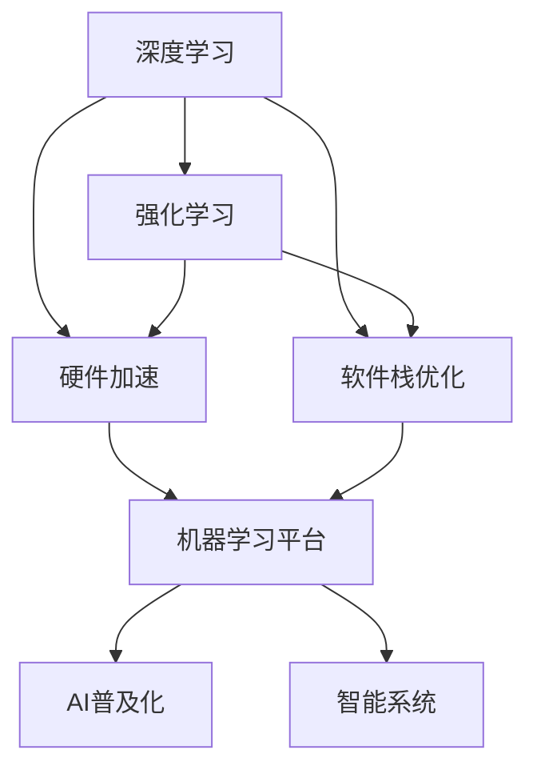
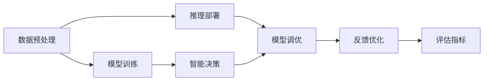
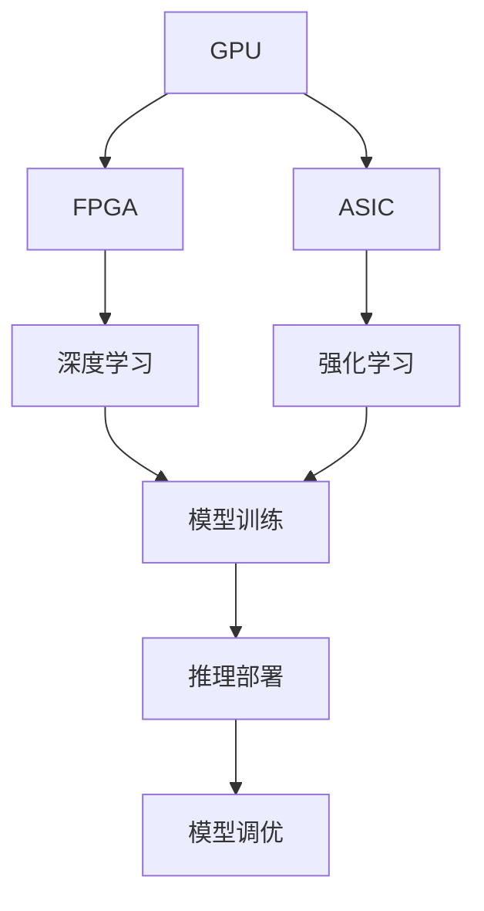
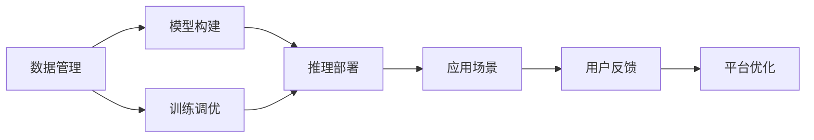
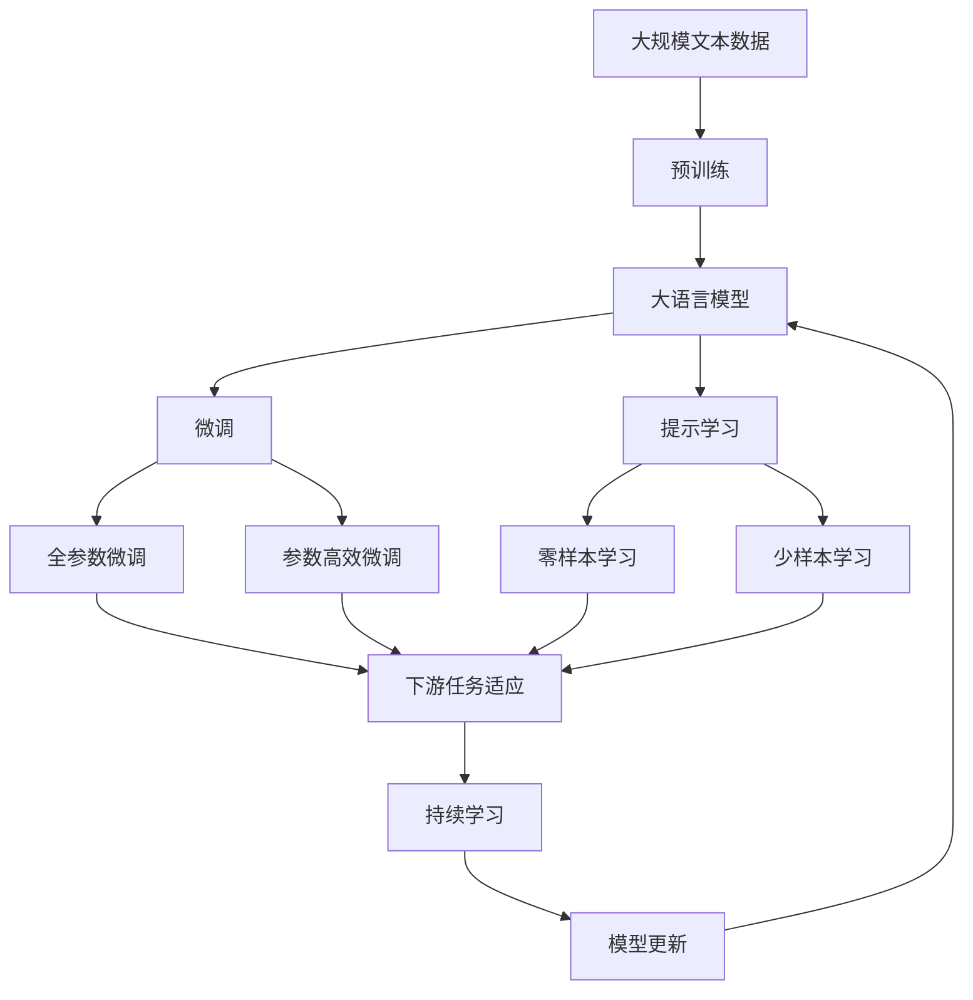

                 

# AI Agent: AI的下一个风口 从软件到硬件的进化

> 关键词：AI Agent, 深度学习, 强化学习, 硬件加速, 软件栈优化, 机器学习平台, AI普及化, 智能系统

## 1. 背景介绍

### 1.1 问题由来

随着人工智能（AI）技术的迅猛发展，AI Agent（人工智能代理人）已成为现代智能系统中不可或缺的一部分。AI Agent通过深度学习、强化学习等技术，能够在复杂环境中自主学习和决策，大大提升了系统智能化水平。但与此同时，AI Agent也面临着计算资源、模型复杂度、数据获取和存储等诸多挑战，尤其是在硬件和软件结合方面，存在较大的优化空间。

AI Agent的核心任务是解决各种实际问题，如自动驾驶、机器人控制、金融投资、医疗诊断等。目前，许多AI Agent已经实现了很好的效果，但仍存在很多不足，特别是在实时性、可解释性、易用性和可靠性方面。如何提升AI Agent的效率、可解释性和应用范围，成为当前AI研究的热点之一。

### 1.2 问题核心关键点

AI Agent涉及的核心概念包括：

1. **深度学习（Deep Learning）**：利用多层神经网络模拟人脑的计算过程，实现复杂的模式识别、分类和预测任务。
2. **强化学习（Reinforcement Learning）**：通过奖励和惩罚机制，使AI Agent能够不断优化其决策策略。
3. **硬件加速（Hardware Acceleration）**：采用GPU、FPGA、ASIC等硬件设备加速AI Agent的计算，提高其处理能力。
4. **软件栈优化（Software Stack Optimization）**：优化AI Agent的各个组件和模块，包括数据预处理、模型训练、推理部署等环节，提升整体性能。
5. **机器学习平台（Machine Learning Platform）**：提供完整的AI开发工具链，包括数据管理、模型构建、训练、调优和部署等，便于开发者使用。
6. **AI普及化（AI Democratization）**：降低AI技术的使用门槛，使得AI Agent能够被更多的用户和行业应用。
7. **智能系统（Intelligent Systems）**：将AI Agent嵌入各种应用场景，实现实时决策、自主学习、人机交互等功能。

这些核心概念之间存在紧密的联系，共同构成了AI Agent的完整生态系统。通过深入理解这些概念，可以更好地把握AI Agent的工作原理和优化方向。

### 1.3 问题研究意义

研究AI Agent的软硬件结合技术，对于推动AI技术在各行各业的广泛应用，具有重要意义：

1. **提升AI技术效率**：硬件加速可以大大提高AI计算速度，使其能够在实时场景下高效运行。
2. **降低AI技术门槛**：优化软件栈可以提升AI系统的易用性和可维护性，使得更多人能够轻松使用AI技术。
3. **扩大AI应用范围**：AI Agent可以适应各种复杂场景，提供个性化的智能解决方案。
4. **增强AI系统的可靠性**：通过硬件和软件的协同优化，提升AI系统的稳定性和鲁棒性。
5. **推动AI技术普及**：软硬件结合技术使得AI系统能够更好地集成到实际应用中，加速AI技术的产业化进程。
6. **实现智能系统的智能化**：将AI Agent嵌入各种智能系统中，提升系统的自主决策和动态调整能力。

## 2. 核心概念与联系

### 2.1 核心概念概述

为更好地理解AI Agent的软硬件结合技术，本节将介绍几个密切相关的核心概念：

- **深度学习（Deep Learning）**：利用多层神经网络模拟人脑的计算过程，实现复杂的模式识别、分类和预测任务。
- **强化学习（Reinforcement Learning）**：通过奖励和惩罚机制，使AI Agent能够不断优化其决策策略。
- **硬件加速（Hardware Acceleration）**：采用GPU、FPGA、ASIC等硬件设备加速AI Agent的计算，提高其处理能力。
- **软件栈优化（Software Stack Optimization）**：优化AI Agent的各个组件和模块，包括数据预处理、模型训练、推理部署等环节，提升整体性能。
- **机器学习平台（Machine Learning Platform）**：提供完整的AI开发工具链，包括数据管理、模型构建、训练、调优和部署等，便于开发者使用。
- **AI普及化（AI Democratization）**：降低AI技术的使用门槛，使得AI Agent能够被更多的用户和行业应用。
- **智能系统（Intelligent Systems）**：将AI Agent嵌入各种应用场景，实现实时决策、自主学习、人机交互等功能。

这些核心概念之间的逻辑关系可以通过以下Mermaid流程图来展示：



这个流程图展示了大语言模型微调过程中各个核心概念之间的关系：

1. 深度学习和强化学习是AI Agent的核心技术，通过学习优化AI Agent的决策策略。
2. 硬件加速和软件栈优化提升AI Agent的计算能力和性能。
3. 机器学习平台提供完整的开发工具链，便于开发者使用。
4. AI普及化使得AI Agent能够被更多的用户和行业应用。
5. 智能系统将AI Agent嵌入各种应用场景，实现实际问题的智能解决。

### 2.2 概念间的关系

这些核心概念之间存在紧密的联系，形成了AI Agent的完整生态系统。下面我通过几个Mermaid流程图来展示这些概念之间的关系。

#### 2.2.1 AI Agent的技术栈结构



这个流程图展示了AI Agent从数据预处理到模型调优的整体流程：

1. 数据预处理：对原始数据进行清洗、转换和归一化，生成训练集。
2. 模型训练：使用深度学习或强化学习算法训练AI Agent，生成模型。
3. 推理部署：将训练好的模型部署到实际应用中，进行推理计算。
4. 模型调优：根据推理结果和评估指标对模型进行调优，提升模型性能。
5. 反馈优化：根据实际应用场景中的反馈，不断优化AI Agent的决策策略。
6. 评估指标：使用各种评估指标监控模型性能，指导模型调优。

#### 2.2.2 硬件加速与软件优化



这个流程图展示了硬件加速和软件栈优化对AI Agent性能提升的具体作用：

1. GPU、FPGA、ASIC等硬件设备提供了强大的计算能力，加速模型训练和推理。
2. 深度学习和强化学习算法可以利用硬件加速提升计算效率。
3. 模型训练阶段，硬件加速显著提升计算速度，缩短训练时间。
4. 推理部署阶段，硬件加速使得AI Agent能够实时处理大量数据。
5. 模型调优阶段，硬件加速使得调优操作更为高效。

#### 2.2.3 机器学习平台与AI普及化



这个流程图展示了机器学习平台和AI普及化对AI Agent应用的具体作用：

1. 数据管理：提供高效的数据存储、管理和访问机制，支持大规模数据处理。
2. 模型构建：提供便捷的开发工具，加速模型设计和实现。
3. 训练调优：提供自动化的调优工具，提升模型性能。
4. 推理部署：提供便捷的推理接口和部署工具，便于模型应用。
5. 应用场景：将AI Agent嵌入各种应用场景，实现智能化的业务解决方案。
6. 用户反馈：收集用户反馈，指导平台优化和模型改进。

### 2.3 核心概念的整体架构

最后，我们用一个综合的流程图来展示这些核心概念在大语言模型微调过程中的整体架构：



这个综合流程图展示了从预训练到微调，再到持续学习的完整过程。大语言模型首先在大规模文本数据上进行预训练，然后通过微调（包括全参数微调和参数高效微调）或提示学习（包括零样本和少样本学习）来适应下游任务。最后，通过持续学习技术，模型可以不断更新和适应新的任务和数据。 通过这些流程图，我们可以更清晰地理解AI Agent的工作原理和优化方向。

## 3. 核心算法原理 & 具体操作步骤
### 3.1 算法原理概述

AI Agent的软硬件结合技术，本质上是一个综合性的优化问题。其核心思想是：通过深度学习和强化学习，使AI Agent在特定环境中自主学习和决策。硬件加速和软件栈优化则提供了高效、可靠的技术支持，使得AI Agent能够在实时场景下高效运行。

形式化地，假设AI Agent在任务 $T$ 中的状态空间为 $S$，动作空间为 $A$，奖励函数为 $R$。AI Agent的目标是在 $T$ 中通过学习策略 $\pi$，最大化累积奖励 $\sum_{t=0}^{T-1} R(s_t, a_t)$。为了实现这一目标，AI Agent通常采用以下步骤：

1. 使用深度学习或强化学习算法，从数据中学习策略 $\pi$。
2. 使用硬件加速，提升模型训练和推理的计算效率。
3. 使用软件栈优化，提升模型调优和部署的效率。
4. 将优化后的策略 $\pi$ 应用到实际任务中，进行智能决策。

### 3.2 算法步骤详解

AI Agent的软硬件结合技术一般包括以下几个关键步骤：

**Step 1: 准备数据和环境**

- 收集任务的标注数据，准备训练集、验证集和测试集。
- 选择合适的硬件设备，如GPU、FPGA、ASIC等，搭建计算环境。
- 配置软件栈，安装必要的深度学习框架和工具库，如TensorFlow、PyTorch等。

**Step 2: 设计模型架构**

- 根据任务类型，选择合适的深度学习或强化学习模型。
- 使用深度学习模型时，设计合适的神经网络结构，如卷积神经网络（CNN）、循环神经网络（RNN）、Transformer等。
- 使用强化学习模型时，设计合适的策略网络（如Q-learning、DQN、Policy Gradient等）和价值网络。
- 设计合适的损失函数和优化算法，如交叉熵损失、均方误差损失、Adam、SGD等。

**Step 3: 训练和优化模型**

- 使用深度学习框架进行模型训练，利用GPU、FPGA、ASIC等硬件设备加速计算。
- 使用软件栈优化工具进行模型调优，如TensorBoard、Weights & Biases等。
- 使用强化学习算法进行模型训练，利用在线学习（如DQN）或离散化学习（如Policy Gradient）。

**Step 4: 部署和评估模型**

- 将训练好的模型部署到实际应用中，进行推理计算。
- 使用软件栈优化工具进行推理加速，如ONNX Runtime、TensorRT等。
- 使用评估指标（如准确率、召回率、F1分数等）监控模型性能，指导模型调优。
- 收集用户反馈，持续改进AI Agent的决策策略。

**Step 5: 持续学习**

- 利用新数据进行模型微调，提升模型性能。
- 使用强化学习进行持续学习，优化模型策略。
- 定期更新模型参数，避免模型过拟合。

以上是AI Agent的软硬件结合技术的完整流程。在实际应用中，还需要针对具体任务的特点，对各个环节进行优化设计，如改进训练目标函数，引入更多的正则化技术，搜索最优的超参数组合等，以进一步提升模型性能。

### 3.3 算法优缺点

AI Agent的软硬件结合技术具有以下优点：

1. 提升AI技术效率：硬件加速可以大大提高AI计算速度，使其能够在实时场景下高效运行。
2. 降低AI技术门槛：优化软件栈可以提升AI系统的易用性和可维护性，使得更多人能够轻松使用AI技术。
3. 扩大AI应用范围：AI Agent可以适应各种复杂场景，提供个性化的智能解决方案。
4. 增强AI系统的可靠性：通过硬件和软件的协同优化，提升AI系统的稳定性和鲁棒性。
5. 推动AI技术普及：软硬件结合技术使得AI系统能够更好地集成到实际应用中，加速AI技术的产业化进程。
6. 实现智能系统的智能化：将AI Agent嵌入各种应用场景，实现实时决策、自主学习、人机交互等功能。

同时，该技术也存在一定的局限性：

1. 硬件设备成本高：高性能硬件设备的投入成本较高，需要更多资金支持。
2. 软件优化复杂：软件栈优化需要深入理解各种工具和算法，对开发者要求较高。
3. 模型复杂度高：深度学习模型结构复杂，训练和推理资源消耗较大。
4. 数据获取困难：高质量标注数据的获取成本较高，特别是在实时场景下。
5. 模型可解释性不足：深度学习模型的决策过程缺乏可解释性，难以对其推理逻辑进行分析和调试。
6. 模型泛化能力有限：当目标任务与预训练数据的分布差异较大时，AI Agent的性能提升有限。

尽管存在这些局限性，但就目前而言，AI Agent的软硬件结合技术仍然是大规模智能系统开发的重要方向。未来相关研究的重点在于如何进一步降低硬件成本，提高软件优化效率，增强模型可解释性，提升模型泛化能力，同时兼顾可解释性和伦理安全性等因素。

### 3.4 算法应用领域

AI Agent的软硬件结合技术已经在众多领域得到应用，覆盖了几乎所有常见的智能系统，例如：

- **自动驾驶**：通过AI Agent控制汽车行驶，实现自动导航、避障等功能。
- **机器人控制**：通过AI Agent控制机器人行为，实现自主导航、物理解剖等功能。
- **金融投资**：通过AI Agent进行股票交易、风险评估等功能。
- **医疗诊断**：通过AI Agent辅助医生诊断疾病，进行医疗影像分析等功能。
- **智能客服**：通过AI Agent进行客户咨询回复，实现自动化客服等功能。
- **推荐系统**：通过AI Agent推荐个性化商品、内容等，提升用户体验。
- **智能制造**：通过AI Agent优化生产流程，实现自动化生产、质量控制等功能。
- **智慧城市**：通过AI Agent进行交通管理、环境监测等功能，提升城市治理水平。

除了上述这些经典应用外，AI Agent的软硬件结合技术还被创新性地应用到更多场景中，如可控文本生成、常识推理、代码生成、数据增强等，为AI技术带来了全新的突破。随着预训练模型和软硬件结合方法的不断进步，相信AI技术将在更广阔的应用领域大放异彩。

## 4. 数学模型和公式 & 详细讲解 & 举例说明

### 4.1 数学模型构建

本节将使用数学语言对AI Agent的软硬件结合技术进行更加严格的刻画。

假设AI Agent在任务 $T$ 中的状态空间为 $S$，动作空间为 $A$，奖励函数为 $R$。假设AI Agent的学习策略为 $\pi$，目标是在 $T$ 中通过学习策略 $\pi$，最大化累积奖励 $\sum_{t=0}^{T-1} R(s_t, a_t)$。

定义模型 $M_{\theta}$ 在状态 $s_t$ 下的动作输出为 $a_t=M_{\theta}(s_t)$。使用深度学习模型时，$M_{\theta}$ 通常为神经网络，参数 $\theta$ 为模型权重。使用强化学习模型时，$M_{\theta}$ 通常为策略网络，参数 $\theta$ 为策略参数。

定义状态空间 $S$ 中的状态为 $s_t$，动作空间 $A$ 中的动作为 $a_t$，奖励为 $R(s_t, a_t)$。定义累积奖励函数为 $R(\pi)=\sum_{t=0}^{T-1} R(s_t, a_t)$。

AI Agent的优化目标是最小化累积奖励函数 $R(\pi)$，即找到最优策略 $\pi^*$：

$$
\pi^* = \mathop{\arg\min}_{\pi} R(\pi)
$$

在实践中，我们通常使用基于梯度的优化算法（如SGD、Adam等）来近似求解上述最优化问题。设 $\eta$ 为学习率，$\lambda$ 为正则化系数，则策略 $\pi$ 的更新公式为：

$$
\pi \leftarrow \pi - \eta \nabla_{\pi}\mathcal{L}(\pi) - \eta\lambda\pi
$$

其中 $\nabla_{\pi}\mathcal{L}(\pi)$ 为累积奖励函数对策略 $\pi$ 的梯度，可通过反向传播算法高效计算。

### 4.2 公式推导过程

以下我们以强化学习中的Q-learning算法为例，推导其累积奖励函数和梯度的计算公式。

假设AI Agent在状态 $s_t$ 下的动作输出为 $a_t=M_{\theta}(s_t)$，奖励为 $R(s_t, a_t)$。Q-learning算法的目标是在每个状态下，选择最大化累积奖励的动作。

假设AI Agent在状态 $s_t$ 下，通过动作 $a_t$ 获得的累积奖励为 $R_{t:T}(s_t, a_t)$。则Q-learning算法的优化目标为：

$$
\mathcal{L}(\pi) = \sum_{t=0}^{T-1} [R(s_t, a_t) + \gamma \max_{a_t'} Q(s_{t+1}, a_{t+1})] - Q(s_t, a_t)
$$

其中 $\gamma$ 为折扣因子，通常取值在0.9到0.99之间。定义 $Q$ 函数为：

$$
Q(s_t, a_t) = \mathbb{E}_{\pi}[R_{t:T}(s_t, a_t)]
$$

根据上式，Q-learning算法的累积奖励函数可以表示为：

$$
\mathcal{L}(\pi) = \sum_{t=0}^{T-1} [R(s_t, a_t) + \gamma \max_{a_t'} Q(s_{t+1}, a_{t+1})] - Q(s_t, a_t)
$$

定义累积奖励函数对策略 $\pi$ 的梯度为：

$$
\nabla_{\pi}\mathcal{L}(\pi) = \sum_{t=0}^{T-1} [\nabla_{a_t} Q(s_t, a_t) + \gamma \nabla_{a_{t+1}} Q(s_{t+1}, a_{t+1})] - \nabla_{a_t} Q(s_t, a_t)
$$

在得到累积奖励函数的梯度后，即可带入策略更新公式，完成AI Agent的迭代优化。重复上述过程直至收敛，最终得到适应特定任务的最优策略 $\pi^*$。

## 5. 项目实践：代码实例和详细解释说明

### 5.1 开发环境搭建

在进行AI Agent的软硬件结合实践前，我们需要准备好开发环境。以下是使用Python进行TensorFlow开发的环境配置流程：

1. 安装Anaconda：从官网下载并安装Anaconda，用于创建独立的Python环境。

2. 创建并激活虚拟环境：
```bash
conda create -n tf-env python=3.8 
conda activate tf-env
```

3. 安装TensorFlow：根据CUDA版本，从官网获取对应的安装命令。例如：
```bash
conda install tensorflow
```

4. 安装各类工具包：
```bash
pip install numpy pandas scikit-learn matplotlib tqdm jupyter notebook ipython
```

完成上述步骤后，即可在`tf-env`环境中开始AI Agent的软硬件结合实践。

### 5.2 源代码详细实现

这里我们以自动驾驶中的AI Agent为例，给出使用TensorFlow进行强化学习的PyTorch代码实现。

首先，定义强化学习环境的类：

```python
import gym
import tensorflow as tf

class Env(gym.Env):
    def __init__(self):
        super(Env, self).__init__()
        self.state_dim = 3
        self.action_dim = 2
        self.current_state = [0, 0, 0]
    
    def step(self, action):
        # 状态转移
        new_state = self.current_state[:]
        new_state[action[0]] += 1
        new_state[action[1]] += 1
        reward = 1
        done = new_state[0] == 1 and new_state[1] == 1
        self.current_state = new_state
        return new_state, reward, done, {}
    
    def reset(self):
        self.current_state = [0, 0, 0]
        return self.current_state
```

然后，定义深度学习模型的类：

```python
import tensorflow as tf

class QNetwork(tf.keras.Model):
    def __init__(self, state_dim, action_dim):
        super(QNetwork, self).__init__()
        self.fc1 = tf.keras.layers.Dense(64, activation='relu', input_shape=(state_dim,))
        self.fc2 = tf.keras.layers.Dense(64, activation='relu')
        self.fc3 = tf.keras.layers.Dense(action_dim)
    
    def call(self, inputs):
        x = self.fc1(inputs)
        x = self.fc2(x)
        return self.fc3(x)
```

接着，定义训练和评估函数：

```python
import tensorflow as tf
import numpy as np

class Agent:
    def __init__(self, env, model):
        self.env = env
        self.model = model
        self.learning_rate = 0.001
        self.gamma = 0.9
        self.epsilon = 0.1
        self.epsilon_min = 0.01
        self.epsilon_decay = 0.999
    
    def act(self, state):
        if np.random.rand() < self.epsilon:
            return self.env.action_space.sample()
        q_values = self.model(tf.constant(state))
        return np.argmax(q_values.numpy()[0])
    
    def train(self, episodes=1000):
        for episode in range(episodes):
            state = self.env.reset()
            done = False
            total_reward = 0
            while not done:
                action = self.act(state)
                next_state, reward, done, _ = self.env.step(action)
                total_reward += reward
                q_values = self.model(tf.constant(state))
                next_q_values = self.model(tf.constant(next_state))
                target = reward + self.gamma * tf.reduce_max(next_q_values)
                q_values[action].assign_add(-1 * (target - q_values[action]))
                state = next_state
                if self.epsilon > self.epsilon_min:
                    self.epsilon *= self.epsilon_decay
            print(f"Episode {episode+1}, reward: {total_reward}")
```

最后，启动训练流程并在测试集上评估：

```python
env = Env()
model = QNetwork(env.state_dim, env.action_dim)
agent = Agent(env, model)
agent.train()

# 测试模型性能
state = env.reset()
done = False
total_reward = 0
while not done:
    action = agent.act(state)
    next_state, reward, done, _ = env.step(action)
    total_reward += reward
    state = next_state
print(f"Test reward: {total_reward}")
```

以上就是使用TensorFlow对自动驾驶AI Agent进行强化学习的完整代码实现。可以看到，得益于TensorFlow的强大封装，我们可以用相对简洁的代码完成AI Agent的强化学习训练。

### 5.3 代码解读与分析

让我们再详细解读一下关键代码的实现细节：

**Env类**：
- `__init__`方法：初始化状态、动作空间和当前状态。
- `step`方法：进行一次状态转移，并返回新状态、奖励和是否结束的标志。
- `reset`方法：重置环境，返回初始状态。

**QNetwork类**：
- `__init__`方法：初始化神经网络结构，包括全连接层和激活函数。
- `call`方法：定义神经网络的计算过程。

**Agent类**：
- `__init__`方法：初始化环境、模型、学习率、折扣因子、探索率等参数。
- `act`方法：选择动作，探索和利用交替进行。
- `train`方法：进行强化学习训练，迭代更新模型参数。

**训练流程**：
- 定义总的训练轮数，开始循环迭代
- 每个轮次中，在环境中进行随机动作探索，直到环境结束
- 根据环境反馈

