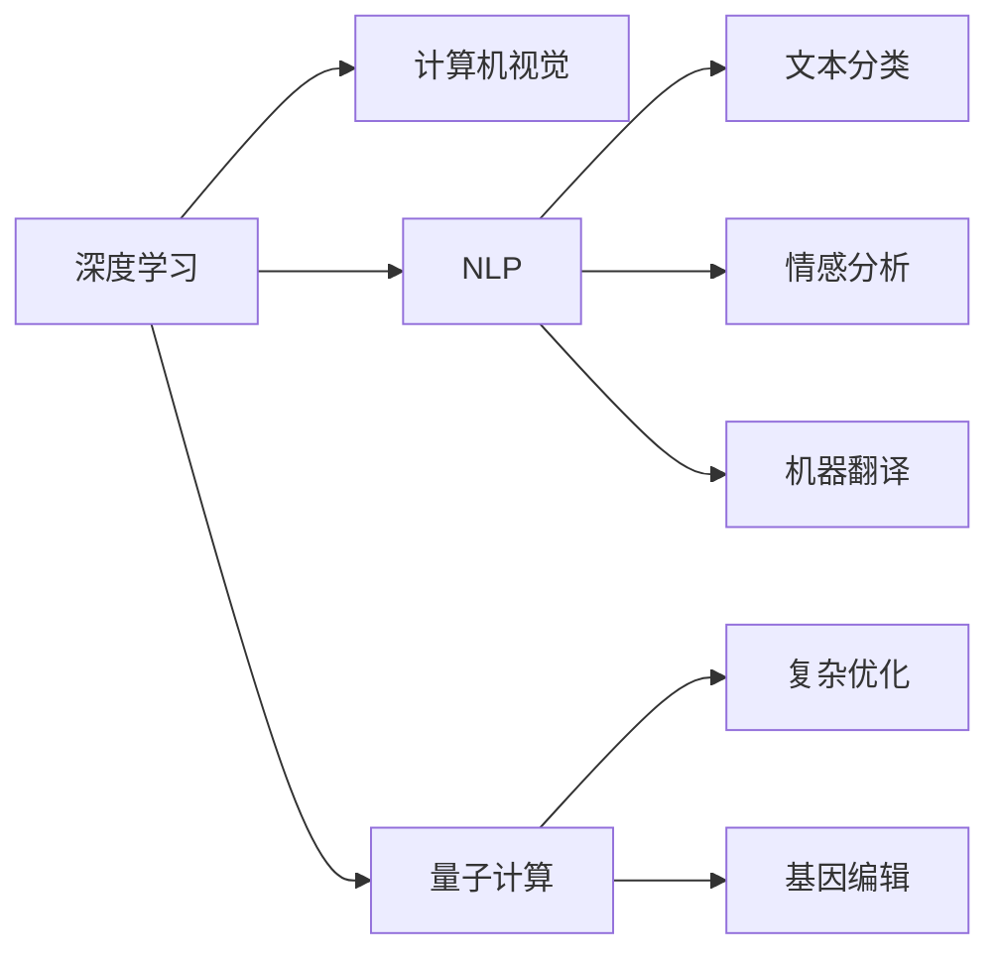
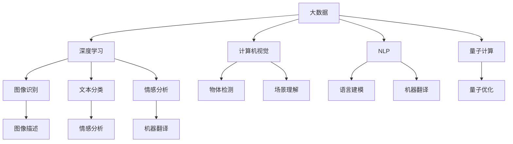

                 

# AI for Science催生新应用场景

## 1. 背景介绍

### 1.1 问题由来

在过去的几十年里，人工智能（AI）技术已经深刻地改变了人类社会的各个方面。从自动驾驶、智能客服，到医疗诊断、金融风控，AI的应用场景越来越多样化。而在这些应用场景中，一个核心的突破点就是"AI for Science"（AI 用于科学研究）。

AI for Science 指的是将AI技术应用于科学研究中，从而加速科学发现、提高科研效率，甚至开辟新的研究领域。通过深度学习、自然语言处理、计算机视觉等AI技术，科学家们能够处理和分析海量数据，发现新的模式和规律，实现从实验数据到科学结论的自动化推导。

### 1.2 问题核心关键点

AI for Science的核心关键点在于：

1. **数据驱动的科学发现**：利用AI技术，从大规模数据中自动提取科学知识，发现新的科学规律和现象。
2. **高效的科研工具**：AI算法和模型可以替代部分人类科研工作，提高科研效率和准确性。
3. **跨学科融合**：AI for Science打破了传统学科的界限，促进了不同领域的交叉融合和创新。
4. **新研究领域的诞生**：AI技术的应用开辟了新的研究领域，如量子计算、基因组学等。

### 1.3 问题研究意义

AI for Science不仅推动了科学研究的创新，也带动了科技产业的发展。其研究意义体现在：

1. **提升科研效率**：AI技术能够自动化处理和分析复杂数据，大大缩短了科研周期。
2. **促进科学发现**：通过AI算法从海量数据中发现隐藏的模式和规律，促进科学新知识的产生。
3. **推动技术发展**：AI for Science的技术和算法能够应用于多个领域，推动了相关技术的发展。
4. **培养新型人才**：AI for Science需要跨学科的知识和技能，培养了大量新型科研人才。

## 2. 核心概念与联系

### 2.1 核心概念概述

为了更好地理解AI for Science的核心概念，我们首先需要介绍几个关键概念：

1. **深度学习（Deep Learning）**：一种基于多层神经网络的机器学习技术，可以自动学习数据的复杂特征，适用于图像、语音、文本等多种数据类型。
2. **计算机视觉（Computer Vision）**：利用计算机技术，使机器“看懂”图像和视频，进行物体识别、场景理解等任务。
3. **自然语言处理（Natural Language Processing，NLP）**：使计算机能够理解和生成人类语言，包括文本分类、情感分析、机器翻译等任务。
4. **量子计算（Quantum Computing）**：利用量子力学的原理，实现超越传统计算机的计算能力，适用于解决复杂优化问题。
5. **基因组学（Genomics）**：研究生物体的基因序列和功能，涉及DNA测序、基因编辑等多个方面。

这些概念之间的联系可以通过以下Mermaid流程图来展示：



这个流程图展示了AI for Science中各个技术领域的关联和应用。

### 2.2 概念间的关系

这些核心概念之间存在着紧密的联系，构成了AI for Science的完整生态系统。以下是几个主要概念的关系：

1. **深度学习与计算机视觉**：深度学习技术为计算机视觉任务提供了强大的模型基础，如卷积神经网络（CNN）在图像识别、目标检测中的应用。
2. **深度学习与自然语言处理**：深度学习模型如循环神经网络（RNN）、Transformer等在NLP任务中取得了突破性进展，如语言建模、文本分类等。
3. **深度学习与量子计算**：深度学习算法在量子计算中也有广泛应用，如量子蒙特卡罗方法、量子神经网络等。
4. **计算机视觉与自然语言处理**：计算机视觉和NLP技术的结合，如视觉问答、图像描述生成等，推动了跨模态信息处理的进步。
5. **量子计算与基因组学**：量子计算技术在基因组学中，如量子机器学习、基因排序等，提供了新的解决方案。

这些关系展示了AI for Science中不同技术领域的相互支撑和融合。

### 2.3 核心概念的整体架构

最后，我们用一个综合的流程图来展示这些核心概念在大数据科学中的整体架构：



这个综合流程图展示了AI for Science的核心技术架构，从大数据到深度学习，再到计算机视觉、自然语言处理和量子计算，形成了一个完整的科学研究工具链。

## 3. 核心算法原理 & 具体操作步骤
### 3.1 算法原理概述

AI for Science的核心算法原理主要基于深度学习技术，通过构建复杂的神经网络模型，从数据中自动提取和分析模式。以下是几种常见的算法原理：

1. **卷积神经网络（Convolutional Neural Network, CNN）**：用于图像和视频数据的处理和分析，通过卷积层、池化层等结构提取局部特征。
2. **循环神经网络（Recurrent Neural Network, RNN）**：用于序列数据的处理，如文本和语音，通过时间依赖的神经网络结构捕捉时间序列信息。
3. **Transformer模型**：基于自注意力机制，适用于自然语言处理任务，能够处理长序列数据，具有较好的并行计算性能。
4. **量子神经网络（Quantum Neural Network, QNN）**：结合量子计算与神经网络的算法，适用于解决复杂优化问题。

### 3.2 算法步骤详解

以下是AI for Science中深度学习模型的典型训练步骤：

1. **数据预处理**：对原始数据进行清洗、标注、归一化等处理，准备用于训练和测试。
2. **模型选择**：根据任务类型选择合适的深度学习模型，如CNN、RNN、Transformer等。
3. **模型构建**：构建模型的网络结构，包括卷积层、池化层、全连接层等，并设定损失函数和优化器。
4. **模型训练**：将处理好的数据输入模型，通过反向传播算法更新模型参数，最小化损失函数。
5. **模型评估**：在验证集或测试集上评估模型的性能，如准确率、精确率、召回率等指标。
6. **模型优化**：根据评估结果调整模型参数，如学习率、正则化强度等，以提升模型性能。
7. **模型应用**：将训练好的模型应用到实际问题中，进行预测、分类、聚类等任务。

### 3.3 算法优缺点

AI for Science中的深度学习算法具有以下优点：

1. **高泛化能力**：深度学习模型能够自动学习数据中的复杂模式，具有较强的泛化能力。
2. **高效处理数据**：深度学习算法可以高效处理大规模数据，适用于大数据科学研究。
3. **自动化推导**：通过构建复杂的模型，深度学习能够自动推导出科学规律和模式。

但这些算法也存在一些缺点：

1. **计算资源需求高**：深度学习模型通常需要大量的计算资源和存储空间，对硬件要求较高。
2. **模型复杂度高**：深度学习模型结构复杂，需要大量的训练数据和时间。
3. **模型可解释性差**：深度学习模型的决策过程难以解释，难以进行人工干预和调试。

### 3.4 算法应用领域

AI for Science的深度学习算法在多个领域得到了广泛应用：

1. **生物信息学**：如基因组学、蛋白质结构预测、药物研发等，利用深度学习分析生物数据，发现新的生物规律。
2. **天文学**：如星系分类、恒星运动预测、宇宙演化模拟等，利用深度学习分析天文数据，发现新的天文现象。
3. **地球科学**：如气候变化预测、地质构造分析、地球系统模拟等，利用深度学习分析地球数据，理解地球系统变化规律。
4. **环境科学**：如水资源管理、空气质量监测、生态系统模拟等，利用深度学习分析环境数据，保护生态环境。
5. **医学**：如医学影像分析、疾病预测、个性化治疗等，利用深度学习分析医学数据，提升医疗服务质量。

## 4. 数学模型和公式 & 详细讲解  
### 4.1 数学模型构建

在AI for Science中，深度学习模型的数学模型构建通常基于以下几个步骤：

1. **输入层**：定义输入数据的维度，如图像的宽度和高度、文本的单词数等。
2. **隐藏层**：定义神经网络的层数和每层的神经元数量，如卷积层的卷积核大小、池化层的池化大小等。
3. **输出层**：定义输出层的结构，如分类任务的softmax函数、回归任务的线性回归函数等。
4. **损失函数**：定义模型输出与真实标签之间的差异函数，如交叉熵损失、均方误差损失等。
5. **优化器**：定义优化算法的更新规则，如梯度下降算法、Adam算法等。

以分类任务为例，深度学习模型的数学模型构建过程如下：

$$
\text{模型输出} = f(\text{输入数据}, \text{模型参数})
$$

其中 $f$ 表示模型前向传播的过程，$\text{模型参数}$ 为神经网络的权重和偏置。模型的目标是最小化损失函数 $\mathcal{L}$：

$$
\mathcal{L} = -\frac{1}{N} \sum_{i=1}^N \log p(y_i | x_i)
$$

其中 $p(y_i | x_i)$ 表示模型在输入 $x_i$ 下预测标签 $y_i$ 的概率。优化器 $\nabla_{\theta}\mathcal{L}$ 对模型参数 $\theta$ 的梯度进行反向传播，更新模型参数，使得损失函数最小化：

$$
\theta \leftarrow \theta - \eta \nabla_{\theta}\mathcal{L}
$$

其中 $\eta$ 为学习率，表示每次迭代更新的步长。

### 4.2 公式推导过程

以下是深度学习模型的公式推导过程：

1. **线性回归**：模型的输出为输入数据的线性组合：

$$
y = w^T x + b
$$

其中 $w$ 为权重向量，$b$ 为偏置，$x$ 为输入向量。损失函数为均方误差：

$$
\mathcal{L} = \frac{1}{2N} \sum_{i=1}^N (y_i - f(x_i))^2
$$

其中 $y_i$ 为真实标签，$f(x_i)$ 为模型预测的标签。优化器为梯度下降算法：

$$
w \leftarrow w - \eta \nabla_{w}\mathcal{L}
$$

2. **二分类任务**：模型的输出为输入数据的线性组合通过sigmoid函数的映射：

$$
p(y=1 | x) = \frac{1}{1 + e^{-w^T x - b}}
$$

损失函数为交叉熵：

$$
\mathcal{L} = -\frac{1}{N} \sum_{i=1}^N [y_i \log p(y_i | x_i) + (1 - y_i) \log (1 - p(y_i | x_i))]
$$

优化器为Adam算法：

$$
w \leftarrow w - \eta \nabla_{w}\mathcal{L} - \lambda w
$$

其中 $\lambda$ 为正则化系数。

### 4.3 案例分析与讲解

以图像分类任务为例，分析深度学习模型在实际应用中的构建和训练过程。

1. **模型选择**：选择卷积神经网络（CNN）作为模型。
2. **模型构建**：
   - **输入层**：图像的宽度和高度为 $n \times n$，输入通道数为 $c$。
   - **隐藏层**：包括卷积层、池化层和全连接层。卷积层使用 $3 \times 3$ 的卷积核和步长为 $1$ 的池化层，全连接层输出神经元数量为 $1000$。
   - **输出层**：输出神经元数量为 $10$，表示 $10$ 个不同的类别。
3. **数据预处理**：将原始图像数据归一化，转换为标准输入格式。
4. **模型训练**：将处理好的图像数据输入模型，使用交叉熵损失函数和Adam优化器，最小化损失函数，更新模型参数。
5. **模型评估**：在验证集上评估模型性能，如准确率、精确率、召回率等指标。
6. **模型优化**：根据评估结果调整模型参数，如学习率、正则化强度等，以提升模型性能。

## 5. 项目实践：代码实例和详细解释说明
### 5.1 开发环境搭建

在进行AI for Science的深度学习模型实践前，我们需要准备好开发环境。以下是使用Python进行TensorFlow开发的步骤：

1. 安装Anaconda：从官网下载并安装Anaconda，用于创建独立的Python环境。

2. 创建并激活虚拟环境：
```bash
conda create -n tensorflow-env python=3.7 
conda activate tensorflow-env
```

3. 安装TensorFlow：根据CUDA版本，从官网获取对应的安装命令。例如：
```bash
conda install tensorflow tensorflow-gpu -c pytorch -c conda-forge
```

4. 安装各类工具包：
```bash
pip install numpy pandas scikit-learn matplotlib tqdm jupyter notebook ipython
```

完成上述步骤后，即可在`tensorflow-env`环境中开始AI for Science的深度学习模型实践。

### 5.2 源代码详细实现

以下是使用TensorFlow实现图像分类的代码实现，并进行详细解释：

```python
import tensorflow as tf
from tensorflow.keras import datasets, layers, models
import matplotlib.pyplot as plt

# 加载数据集
(train_images, train_labels), (test_images, test_labels) = datasets.cifar10.load_data()

# 数据预处理
train_images, test_images = train_images / 255.0, test_images / 255.0

# 构建模型
model = models.Sequential([
    layers.Conv2D(32, (3, 3), activation='relu', input_shape=(32, 32, 3)),
    layers.MaxPooling2D((2, 2)),
    layers.Conv2D(64, (3, 3), activation='relu'),
    layers.MaxPooling2D((2, 2)),
    layers.Conv2D(64, (3, 3), activation='relu'),
    layers.Flatten(),
    layers.Dense(64, activation='relu'),
    layers.Dense(10)
])

# 编译模型
model.compile(optimizer='adam',
              loss=tf.keras.losses.SparseCategoricalCrossentropy(from_logits=True),
              metrics=['accuracy'])

# 训练模型
history = model.fit(train_images, train_labels, epochs=10, 
                    validation_data=(test_images, test_labels))

# 评估模型
test_loss, test_acc = model.evaluate(test_images, test_labels, verbose=2)

# 可视化结果
plt.plot(history.history['accuracy'], label='accuracy')
plt.plot(history.history['val_accuracy'], label='val_accuracy')
plt.xlabel('Epoch')
plt.ylabel('Accuracy')
plt.ylim([0.5, 1])
plt.legend(loc='lower right')
plt.show()
```

1. **加载数据集**：使用CIFAR-10数据集，包含60000张32x32的彩色图像和10个类别标签。
2. **数据预处理**：将像素值归一化到0-1之间，准备输入模型。
3. **模型构建**：使用卷积层、池化层和全连接层，构建一个简单的卷积神经网络。
4. **编译模型**：定义优化器、损失函数和评估指标，准备训练模型。
5. **训练模型**：使用训练集进行模型训练，设定训练轮数为10。
6. **评估模型**：在测试集上评估模型性能，输出损失和准确率。
7. **可视化结果**：绘制训练和验证的准确率曲线，观察模型训练效果。

### 5.3 代码解读与分析

让我们再详细解读一下关键代码的实现细节：

1. **数据加载**：使用`datasets.cifar10.load_data()`函数加载CIFAR-10数据集，包含60000张32x32的彩色图像和10个类别标签。

2. **数据预处理**：将原始图像数据归一化到0-1之间，准备输入模型。

3. **模型构建**：定义一个包含卷积层、池化层和全连接层的卷积神经网络。

4. **模型编译**：定义优化器为Adam，损失函数为交叉熵损失，评估指标为准确率。

5. **模型训练**：在训练集上进行模型训练，设定训练轮数为10。

6. **模型评估**：在测试集上评估模型性能，输出损失和准确率。

7. **可视化结果**：绘制训练和验证的准确率曲线，观察模型训练效果。

## 6. 实际应用场景
### 6.1 生物信息学

AI for Science在生物信息学领域的应用非常广泛，主要涉及基因组学、蛋白质结构预测、药物研发等方面。

1. **基因组学**：利用深度学习模型对基因序列进行分析，发现新的基因调控元件和蛋白质相互作用关系。例如，使用深度学习模型进行基因序列分类、突变预测、基因表达分析等。
2. **蛋白质结构预测**：利用深度学习模型对蛋白质结构进行预测和建模，揭示蛋白质折叠机制和功能。例如，使用深度学习模型进行蛋白质序列分类、折叠预测、功能注释等。
3. **药物研发**：利用深度学习模型对药物分子进行筛选和优化，加速新药研发进程。例如，使用深度学习模型进行分子结构生成、药物作用机制分析、药效评估等。

### 6.2 天文学

AI for Science在天文学领域的应用包括星系分类、恒星运动预测、宇宙演化模拟等。

1. **星系分类**：利用深度学习模型对星系图像进行分类，发现新的星系形态和特征。例如，使用深度学习模型进行星系形态分类、颜色分析、光谱分析等。
2. **恒星运动预测**：利用深度学习模型对恒星运动轨迹进行预测，揭示恒星演化规律。例如，使用深度学习模型进行恒星轨迹预测、质量估算、引力分析等。
3. **宇宙演化模拟**：利用深度学习模型对宇宙演化进行模拟，揭示宇宙演化规律。例如，使用深度学习模型进行宇宙结构模拟、暗物质分布分析、宇宙学参数估算等。

### 6.3 地球科学

AI for Science在地球科学领域的应用包括气候变化预测、地质构造分析、地球系统模拟等。

1. **气候变化预测**：利用深度学习模型对气候数据进行分析和预测，发现气候变化规律和趋势。例如，使用深度学习模型进行气候模式预测、气候变化趋势分析、极端天气预测等。
2. **地质构造分析**：利用深度学习模型对地质构造数据进行分析和模拟，揭示地质构造特征和演化规律。例如，使用深度学习模型进行地质构造分类、形态分析、地震波模拟等。
3. **地球系统模拟**：利用深度学习模型对地球系统进行模拟和预测，揭示地球系统变化规律。例如，使用深度学习模型进行地球系统动态模拟、生态系统预测、环境灾害评估等。

### 6.4 环境科学

AI for Science在环境科学领域的应用包括水资源管理、空气质量监测、生态系统模拟等。

1. **水资源管理**：利用深度学习模型对水资源数据进行分析和预测，发现水资源管理规律和趋势。例如，使用深度学习模型进行水资源监测、水污染预测、水资源调度等。
2. **空气质量监测**：利用深度学习模型对空气质量数据进行分析和预测，发现空气质量变化规律和趋势。例如，使用深度学习模型进行空气质量监测、污染源识别、治理措施评估等。
3. **生态系统模拟**：利用深度学习模型对生态系统数据进行分析和模拟，揭示生态系统变化规律和特征。例如，使用深度学习模型进行生态系统动态模拟、物种分布预测、生态系统服务评估等。

### 6.5 医学

AI for Science在医学领域的应用包括医学影像分析、疾病预测、个性化治疗等。

1. **医学影像分析**：利用深度学习模型对医学影像数据进行分析和处理，发现疾病早期迹象和病变特征。例如，使用深度学习模型进行X光图像分类、CT图像分割、MRI图像分析等。
2. **疾病预测**：利用深度学习模型对病历数据进行分析和预测，发现疾病发生规律和趋势。例如，使用深度学习模型进行疾病风险预测、病程分析、个性化治疗方案设计等。
3. **个性化治疗**：利用深度学习模型对患者数据进行分析和建模，提供个性化的治疗方案。例如，使用深度学习模型进行基因组学分析、药物基因组学、基因编辑等。

## 7. 工具和资源推荐
### 7.1 学习资源推荐

为了帮助开发者系统掌握AI for Science的理论基础和实践技巧，这里推荐一些优质的学习资源：

1. **《深度学习》（Ian Goodfellow, Yoshua Bengio, Aaron Courville著）**：深度学习领域的经典教材，系统介绍了深度学习的基本理论和应用。

2. **《TensorFlow官方文档》**：TensorFlow的官方文档，提供了丰富的API和示例，是深度学习开发的重要参考资料。

3. **《计算机视觉：现代方法》（Russell J. Cintra, Lázaro A. Macêdo, A. Ferraz, Guilherme S. Dantas著）**：计算机视觉领域的经典教材，介绍了计算机视觉的基本理论和算法。

4. **《自然语言处理综论》（Daniel Jurafsky, James H. Martin著）**：自然语言处理领域的经典教材，涵盖了自然语言处理的基本理论和应用。

5. **《量子计算导论》（Michael A. Nielsen著）**：量子计算领域的入门教材，介绍了量子计算的基本理论和应用。

6. **Coursera、edX、Udacity等在线学习平台**：提供大量的深度学习、计算机视觉、自然语言处理、量子计算等课程，适合不同层次的学习者。

通过对这些资源的学习实践，相信你一定能够快速掌握AI for Science的精髓，并用于解决实际的科学研究问题。

### 7.2 开发工具推荐

高效的开发离不开优秀的工具支持。以下是几款用于AI for Science的深度学习模型开发的常用工具：

1. **TensorFlow**：由Google主导开发的开源深度学习框架，生产部署方便，适合大规模工程应用。

2. **PyTorch**：由Facebook开发的开源深度学习框架，灵活动态的计算图，适合快速迭代研究。

3. **MXNet**：由亚马逊开发的开源深度学习框架，支持多种编程语言，适用于多平台开发。

4. **Keras**：基于TensorFlow和Theano的高级神经网络API，易于上手使用，适合初学者和快速原型开发。

5. **Hugging Face Transformers库**：提供了预训练语言模型的封装和微调API，方便模型开发和部署。

6. **Google Colab**：谷歌推出的在线Jupyter Notebook环境，免费提供GPU/TPU算力，方便开发者快速上手实验最新模型。

合理利用这些工具，可以显著提升AI for Science的深度学习模型开发效率，加快创新迭代的步伐。

### 7.3 相关论文推荐

AI for Science的深度学习算法在众多领域得到了广泛研究，以下是几篇奠基性的相关论文，推荐阅读：

1. **ImageNet分类任务：**ImageNet分类任务是最具代表性的计算机视觉任务之一，深度学习算法在该任务上取得了突破性进展。

2. **语音识别：**语音识别是自然语言处理领域的经典任务之一，深度学习算法在该任务上取得了显著提升。

3. **文本分类：**文本分类是自然语言处理领域的核心任务之一，深度学习算法在该任务上取得了广泛应用。

4. **量子计算：**量子计算是人工智能领域的突破性技术之一，深度学习算法在该领域也有广泛应用。

这些论文代表了大语言模型微调技术的发展脉络。通过学习这些前沿成果，可以帮助研究者把握学科前进方向，激发更多的创新灵感。

除上述资源外，还有一些值得关注的前沿资源，帮助开发者紧跟AI for Science的最新进展，例如：

1. **arXiv论文预印本：**人工智能领域最新研究成果的发布平台，包括大量尚未发表的前沿工作，学习前沿技术的必读资源。

2. **各大顶会的论文集：**如NIPS、ICML、ACL、ICLR等人工智能领域顶会论文集，提供最新研究方向和突破性成果。

3. **开源项目和库：**如TensorFlow、PyTorch、MXNet等深度学习框架的源代码和库，是深度学习开发的必备资源。

4. **博客和技术文章：**如Google Research、DeepMind Research、微软Research等顶级实验室的官方博客，第一时间分享他们的最新研究成果和洞见。

5. **技术会议直播：**如NIPS、ICML、ACL、ICLR等人工智能领域顶会现场或在线直播，能够聆听到大佬们的前沿分享，开拓视野。

6. **Git

