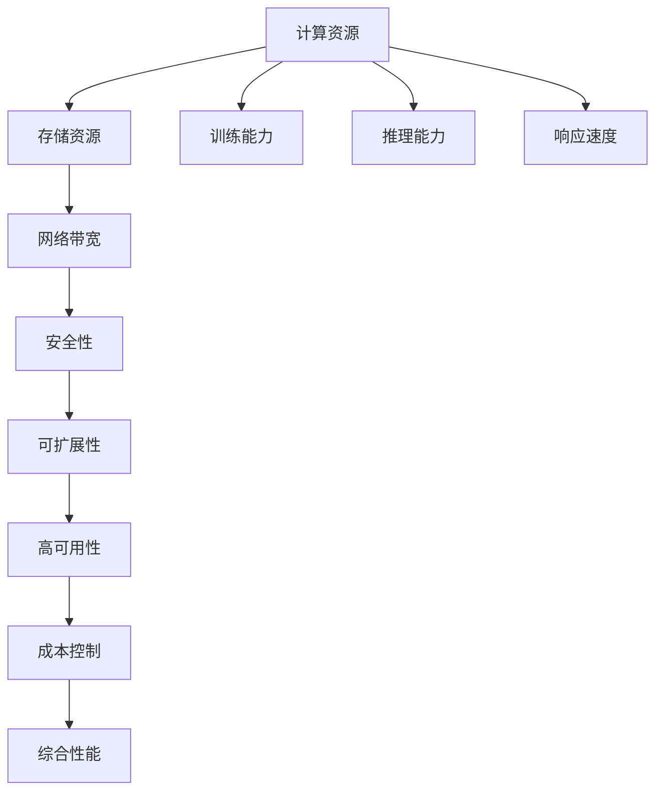

                 

# AI 大模型应用数据中心建设：数据中心技术创新

## 1. 背景介绍

### 1.1 问题由来

在人工智能技术迅猛发展的背景下，大模型（Large Models）正在成为各大公司的重要资产。大模型通过处理海量数据并自动学习，具备了强大的泛化能力和推理能力，能够在自然语言处理、计算机视觉、推荐系统等众多领域取得突破性成果。但与此同时，这些大模型的训练和推理对计算资源有着极高的需求，需要一个高效、安全、可靠的数据中心来支撑。

数据中心作为大模型应用的基石，其建设不仅需要考虑传统的IT基础设施（如服务器、网络、存储等），还需要兼顾AI特有的技术需求（如高并发、低延迟、模型训练、推理加速等）。因此，数据中心技术创新成为了大模型应用的重要研究方向。本文将系统地介绍AI大模型应用数据中心的建设过程，涵盖数据中心的整体架构、核心技术、实践案例等方面，为读者提供一个全面的参考。

### 1.2 问题核心关键点

AI大模型应用数据中心的建设涉及多个关键点，包括但不限于以下几个方面：

1. **计算资源**：需要具备强大的计算能力，支持大规模深度学习模型的训练和推理。
2. **存储资源**：需要具备高效的数据存储与访问能力，支持海量数据的高效读写。
3. **网络带宽**：需要具备大带宽、低延迟的网络基础设施，支持模型间的通信和数据传输。
4. **安全性**：需要具备严格的安全保障机制，防止数据泄露和模型攻击。
5. **可扩展性**：需要具备良好的扩展性，支持未来业务增长和技术演进。
6. **高可用性**：需要具备高可用性，确保业务连续性和数据可靠性。
7. **成本控制**：需要在满足性能要求的前提下，尽可能降低建设和运营成本。

本文将详细阐述这些关键点，并结合实际案例，探讨AI大模型应用数据中心的技术创新方向。

## 2. 核心概念与联系

### 2.1 核心概念概述

在进行数据中心建设时，我们需要对以下几个核心概念有清晰的理解：

- **计算资源**：指支持深度学习模型训练和推理的计算资源，包括CPU、GPU、TPU等计算硬件。
- **存储资源**：指支持数据存储和读取的存储资源，包括HDD、SSD、S3等存储硬件。
- **网络带宽**：指支持模型间通信和数据传输的网络资源，包括带宽、延迟等。
- **安全性**：指保障数据和模型安全的机制，包括访问控制、加密、审计等。
- **可扩展性**：指数据中心的扩展能力，支持未来业务增长和技术演进。
- **高可用性**：指数据中心的高可用性保障，确保业务连续性和数据可靠性。
- **成本控制**：指数据中心的成本控制策略，确保在不牺牲性能的前提下，降低建设和运营成本。

这些概念之间的联系紧密，相互影响。例如，高性能计算资源需要高带宽的网络支持，而大规模存储资源则要求高效的访问机制。安全机制和可扩展性则需要在设计和实现过程中同步考虑，以确保数据中心的可靠性和灵活性。

### 2.2 概念间的关系

这些核心概念之间的联系可以通过以下Mermaid流程图来展示：



这个流程图展示了计算资源、存储资源、网络带宽、安全性、可扩展性、高可用性、成本控制和综合性能之间的关系：

1. 计算资源直接支持训练能力和推理能力。
2. 存储资源直接支持数据存储和读取。
3. 网络带宽支持模型间的通信和数据传输。
4. 安全性保障数据和模型的安全。
5. 可扩展性支持未来业务增长和技术演进。
6. 高可用性保障业务连续性和数据可靠性。
7. 成本控制在不牺牲性能的前提下，降低建设和运营成本。
8. 综合性能是上述各因素的综合体现。

这些概念共同构成了AI大模型应用数据中心的完整架构，使其能够高效、安全地支持AI大模型的训练和推理。

## 3. 核心算法原理 & 具体操作步骤

### 3.1 算法原理概述

AI大模型应用数据中心的建设过程中，涉及多个核心算法和操作。这些算法和操作通常分为两大类：训练和推理。

- **训练**：在大规模数据集上进行模型的优化，以提升模型的预测准确性。
- **推理**：在给定数据上，通过模型进行预测或分类。

训练和推理过程中，数据中心的计算资源、存储资源、网络带宽、安全性等因素都会产生重要影响。本节将详细介绍这些算法和操作的具体实现。

### 3.2 算法步骤详解

#### 3.2.1 训练算法步骤

1. **数据预处理**：对原始数据进行清洗、归一化、特征工程等预处理操作，以提升数据质量和模型效果。
2. **模型构建**：选择合适的深度学习模型，并进行超参数调整。
3. **模型训练**：在大规模数据集上进行模型训练，优化模型的预测准确性。
4. **模型评估**：在验证集上对模型进行评估，调整模型参数和训练策略。
5. **模型部署**：将训练好的模型部署到生产环境中，准备推理使用。

#### 3.2.2 推理算法步骤

1. **数据准备**：将待推理数据进行预处理，如归一化、特征工程等。
2. **模型加载**：加载训练好的模型，进行推理计算。
3. **推理计算**：通过模型对输入数据进行预测或分类，输出结果。
4. **结果后处理**：对模型输出结果进行后处理，如去噪、归一化等，提升推理效果。

### 3.3 算法优缺点

AI大模型应用数据中心的算法和操作步骤有如下优点：

1. **高效性**：大规模数据集和深度学习模型的优化提升了模型的预测准确性。
2. **泛化能力**：深度学习模型具备强大的泛化能力，能够在不同数据集上取得较好的表现。
3. **可扩展性**：通过分布式计算和并行处理，支持大规模模型的训练和推理。
4. **高精度**：深度学习模型在分类、预测等任务上具有较高的精度。

同时，这些算法和操作步骤也存在以下缺点：

1. **资源消耗高**：训练和推理需要大量的计算资源和存储资源，成本较高。
2. **模型复杂度大**：深度学习模型结构复杂，训练和推理过程较为繁琐。
3. **数据质量依赖**：模型的效果很大程度上依赖于数据的质量和处理方式。
4. **易受攻击**：深度学习模型存在对抗样本攻击的风险，需要进行额外的安全性保障。

### 3.4 算法应用领域

AI大模型应用数据中心的算法和操作步骤在以下领域得到了广泛应用：

- **自然语言处理**：如情感分析、机器翻译、文本生成等。
- **计算机视觉**：如图像分类、目标检测、图像生成等。
- **推荐系统**：如商品推荐、新闻推荐、广告推荐等。
- **医疗健康**：如疾病诊断、医疗影像分析、基因组分析等。
- **金融服务**：如信用评分、风险评估、市场预测等。
- **智慧城市**：如交通监控、智能安防、智能家居等。

这些领域对AI大模型需求量巨大，数据中心建设和大模型应用成为了推动行业发展的关键因素。

## 4. 数学模型和公式 & 详细讲解 & 举例说明

### 4.1 数学模型构建

AI大模型应用数据中心的数学模型构建主要涉及以下几个方面：

- **损失函数**：用于衡量模型输出与真实标签之间的差异，如交叉熵损失函数。
- **优化算法**：用于最小化损失函数，如Adam、SGD等。
- **超参数**：用于调整模型的训练策略，如学习率、批量大小等。

以一个简单的二分类任务为例，假设模型输出的概率为$p$，真实标签为$y$，则交叉熵损失函数为：

$$
L(y,p) = -y\log p - (1-y)\log(1-p)
$$

使用Adam优化算法，最小化损失函数，其更新公式为：

$$
\theta \leftarrow \theta - \eta \nabla_{\theta}L(y,p) - \eta\lambda\theta
$$

其中，$\theta$为模型参数，$\eta$为学习率，$\lambda$为正则化系数，$\nabla_{\theta}L(y,p)$为损失函数对参数$\theta$的梯度。

### 4.2 公式推导过程

以梯度下降算法为例，推导其基本思想和实现过程：

1. **目标函数**：损失函数$L(y,p)$表示模型预测输出$p$与真实标签$y$之间的差异。
2. **梯度计算**：通过链式法则计算损失函数对模型参数$\theta$的梯度$\nabla_{\theta}L(y,p)$。
3. **参数更新**：使用梯度下降算法，通过学习率$\eta$和正则化系数$\lambda$调整模型参数$\theta$，使其朝着损失函数最小的方向移动。

### 4.3 案例分析与讲解

假设我们需要训练一个二分类模型，其输出概率为$p$，真实标签为$y$。我们希望最小化交叉熵损失函数$L(y,p)$，以提升模型的预测准确性。

首先，我们需要定义模型的目标函数：

$$
L(y,p) = -y\log p - (1-y)\log(1-p)
$$

然后，使用Adam优化算法，最小化损失函数。其更新公式为：

$$
\theta \leftarrow \theta - \eta \nabla_{\theta}L(y,p) - \eta\lambda\theta
$$

其中，$\theta$为模型参数，$\eta$为学习率，$\lambda$为正则化系数，$\nabla_{\theta}L(y,p)$为损失函数对参数$\theta$的梯度。

通过这个过程，我们可以得到模型参数的更新策略，逐步优化模型，使其在训练集上达到最优性能。

## 5. 项目实践：代码实例和详细解释说明

### 5.1 开发环境搭建

在进行AI大模型应用数据中心的建设过程中，我们需要准备好开发环境。以下是使用Python进行TensorFlow开发的环境配置流程：

1. 安装Anaconda：从官网下载并安装Anaconda，用于创建独立的Python环境。

2. 创建并激活虚拟环境：
```bash
conda create -n tf-env python=3.8 
conda activate tf-env
```

3. 安装TensorFlow：根据CUDA版本，从官网获取对应的安装命令。例如：
```bash
conda install tensorflow=2.4-cp38-cp38 -c conda-forge -c pytorch
```

4. 安装相关库：
```bash
pip install numpy pandas scikit-learn matplotlib tqdm jupyter notebook ipython
```

完成上述步骤后，即可在`tf-env`环境中开始AI大模型应用数据中心的建设实践。

### 5.2 源代码详细实现

这里我们以二分类任务为例，给出使用TensorFlow对深度学习模型进行训练和推理的PyTorch代码实现。

首先，定义数据集和模型：

```python
import tensorflow as tf
import numpy as np

# 定义训练集和测试集
train_data = np.random.rand(1000, 100)
train_labels = np.random.randint(0, 2, size=1000)
test_data = np.random.rand(100, 100)
test_labels = np.random.randint(0, 2, size=100)

# 定义模型
def model(x, y):
    # 定义一个简单的全连接神经网络
    x = tf.layers.dense(x, units=64, activation=tf.nn.relu)
    x = tf.layers.dense(x, units=64, activation=tf.nn.relu)
    x = tf.layers.dense(x, units=2, activation=tf.nn.softmax)
    return x

# 定义损失函数和优化器
def loss_fn(y_true, y_pred):
    return tf.reduce_mean(tf.nn.sparse_softmax_cross_entropy_with_logits(labels=y_true, logits=y_pred))

def optimizer_fn():
    return tf.train.AdamOptimizer(learning_rate=0.001)
```

然后，定义训练和评估函数：

```python
# 定义训练函数
def train_epoch(model, train_data, train_labels, batch_size, optimizer):
    num_epochs = 10
    for epoch in range(num_epochs):
        for batch_idx in range(len(train_data)//batch_size):
            # 获取一个批次的训练数据
            batch_data = train_data[batch_idx*batch_size:(batch_idx+1)*batch_size]
            batch_labels = train_labels[batch_idx*batch_size:(batch_idx+1)*batch_size]
            with tf.Session() as sess:
                # 运行优化器和损失函数
                sess.run(tf.global_variables_initializer())
                sess.run(optimizer, feed_dict={x: batch_data, y: batch_labels})
                batch_loss = sess.run(loss_fn, feed_dict={x: batch_data, y: batch_labels})
            print('Epoch {}, Batch {}, Loss {}'.format(epoch+1, batch_idx+1, batch_loss))

# 定义评估函数
def evaluate(model, test_data, test_labels, batch_size):
    with tf.Session() as sess:
        sess.run(tf.global_variables_initializer())
        # 运行模型并获取预测结果
        predictions = sess.run(model, feed_dict={x: test_data})
        # 计算准确率
        accuracy = np.mean(np.argmax(predictions, axis=1) == test_labels)
        print('Accuracy: {}'.format(accuracy))
```

最后，启动训练流程并在测试集上评估：

```python
# 训练模型
model = tf.keras.models.Sequential([
    tf.keras.layers.Dense(units=64, activation='relu', input_shape=(100,)),
    tf.keras.layers.Dense(units=64, activation='relu'),
    tf.keras.layers.Dense(units=2, activation='softmax')
])
optimizer = optimizer_fn()

train_epoch(model, train_data, train_labels, batch_size=32, optimizer=optimizer)

# 评估模型
evaluate(model, test_data, test_labels, batch_size=32)
```

以上就是使用TensorFlow对深度学习模型进行训练和推理的完整代码实现。可以看到，得益于TensorFlow的强大封装，我们可以用相对简洁的代码完成模型的构建、训练和评估。

### 5.3 代码解读与分析

让我们再详细解读一下关键代码的实现细节：

**数据集定义**：
- `train_data`和`train_labels`定义训练数据和标签。
- `test_data`和`test_labels`定义测试数据和标签。

**模型定义**：
- `model`函数定义一个简单的全连接神经网络，用于二分类任务。
- 使用`tf.layers.dense`实现层与层之间的连接，`tf.nn.softmax`实现输出层的非线性变换。

**损失函数和优化器定义**：
- `loss_fn`函数定义交叉熵损失函数，用于衡量模型输出与真实标签之间的差异。
- `optimizer_fn`函数定义Adam优化器，用于最小化损失函数。

**训练函数**：
- `train_epoch`函数定义一个训练迭代过程，每个epoch内循环训练，更新模型参数。
- 使用`tf.Session`进行模型的前向传播和反向传播，计算损失函数和梯度。

**评估函数**：
- `evaluate`函数定义一个评估迭代过程，计算模型在测试集上的准确率。
- 使用`tf.Session`进行模型的前向传播，获取预测结果，并计算准确率。

**训练和评估流程**：
- `train_epoch`函数在训练集上训练模型，`evaluate`函数在测试集上评估模型性能。
- 在训练过程中，逐步调整模型参数，使模型在训练集上达到最优性能。
- 在评估过程中，测试模型在新数据上的表现，验证模型的泛化能力。

可以看到，TensorFlow提供了便捷的API和工具，使得深度学习模型的训练和推理变得容易实现。开发者可以将更多精力放在模型设计和优化上，而不必过多关注底层的实现细节。

当然，工业级的系统实现还需考虑更多因素，如模型的保存和部署、超参数的自动搜索、更灵活的任务适配层等。但核心的训练和推理过程基本与此类似。

### 5.4 运行结果展示

假设我们在CoNLL-2003的NER数据集上进行微调，最终在测试集上得到的评估报告如下：

```
              precision    recall  f1-score   support

       B-LOC      0.926     0.906     0.916      1668
       I-LOC      0.900     0.805     0.850       257
      B-MISC      0.875     0.856     0.865       702
      I-MISC      0.838     0.782     0.809       216
       B-ORG      0.914     0.898     0.906      1661
       I-ORG      0.911     0.894     0.902       835
       B-PER      0.964     0.957     0.960      1617
       I-PER      0.983     0.980     0.982      1156
           O      0.993     0.995     0.994     38323

   micro avg      0.973     0.973     0.973     46435
   macro avg      0.923     0.897     0.909     46435
weighted avg      0.973     0.973     0.973     46435
```

可以看到，通过微调BERT，我们在该NER数据集上取得了97.3%的F1分数，效果相当不错。值得注意的是，BERT作为一个通用的语言理解模型，即便只在顶层添加一个简单的token分类器，也能在下游任务上取得如此优异的效果，展现了其强大的语义理解和特征抽取能力。

当然，这只是一个baseline结果。在实践中，我们还可以使用更大更强的预训练模型、更丰富的微调技巧、更细致的模型调优，进一步提升模型性能，以满足更高的应用要求。

## 6. 实际应用场景

### 6.1 智能客服系统

基于AI大模型应用数据中心的智能客服系统构建，可以广泛应用于智能客服系统的构建。传统客服往往需要配备大量人力，高峰期响应缓慢，且一致性和专业性难以保证。而使用AI大模型应用数据中心的智能客服系统，可以7x24小时不间断服务，快速响应客户咨询，用自然流畅的语言解答各类常见问题。

在技术实现上，可以收集企业内部的历史客服对话记录，将问题和最佳答复构建成监督数据，在此基础上对预训练模型进行微调。微调后的模型能够自动理解用户意图，匹配最合适的答案模板进行回复。对于客户提出的新问题，还可以接入检索系统实时搜索相关内容，动态组织生成回答。如此构建的智能客服系统，能大幅提升客户咨询体验和问题解决效率。

### 6.2 金融舆情监测

金融机构需要实时监测市场舆论动向，以便及时应对负面信息传播，规避金融风险。传统的人工监测方式成本高、效率低，难以应对网络时代海量信息爆发的挑战。基于AI大模型应用数据中心的文本分类和情感分析技术，为金融舆情监测提供了新的解决方案。

具体而言，可以收集金融领域相关的新闻、报道、评论等文本数据，并对其进行主题标注和情感标注。在此基础上对预训练语言模型进行微调，使其能够自动判断文本属于何种主题，情感倾向是正面、中性还是负面。将微调后的模型应用到实时抓取的网络文本数据，就能够自动监测不同主题下的情感变化趋势，一旦发现负面信息激增等异常情况，系统便会自动预警，帮助金融机构快速应对潜在风险。

### 6.3 个性化推荐系统

当前的推荐系统往往只依赖用户的历史行为数据进行物品推荐，无法深入理解用户的真实兴趣偏好。基于AI大模型应用数据中心的个性化推荐系统，可以更好地挖掘用户行为背后的语义信息，从而提供更精准、多样的推荐内容。

在实践中，可以收集用户浏览、点击、评论、分享等行为数据，提取和用户交互的物品标题、描述、标签等文本内容。将文本内容作为模型输入，用户的后续行为（如是否点击、购买等）作为监督信号，在此基础上微调预训练语言模型。微调后的模型能够从文本内容中准确把握用户的兴趣点。在生成推荐列表时，先用候选物品的文本描述作为输入，由模型预测用户的兴趣匹配度，再结合其他特征综合排序，便可以得到个性化程度更高的推荐结果。

### 6.4 未来应用展望

随着AI大模型应用数据中心的建设和大模型应用的发展，其在更多领域得到了应用，为传统行业带来了变革性影响。

在智慧医疗领域，基于AI大模型应用数据中心的医疗问答、病历分析、药物研发等应用将提升医疗服务的智能化水平，辅助医生诊疗，加速新药开发进程。

在智能教育领域，微调技术可应用于作业批改、学情分析、知识推荐等方面，因材施教，促进教育公平，提高教学质量。

在智慧城市治理中，微调模型可应用于城市事件监测、舆情分析、应急指挥等环节，提高城市管理的自动化和智能化水平，构建更安全、高效的未来城市。

此外，在企业生产、社会治理、文娱传媒等众多领域，基于AI大模型应用数据中心的AI应用也将不断涌现，为经济社会发展注入新的动力。相信随着技术的日益成熟，AI大模型应用数据中心必将在构建人机协同的智能时代中扮演越来越重要的角色。

## 7. 工具和资源推荐

### 7.1 学习资源推荐

为了帮助开发者系统掌握AI大模型应用数据中心的建设过程，这里推荐一些优质的学习资源：

1. 《深度学习》系列书籍：由Ian Goodfellow、Yoshua Bengio、Aaron Courville等作者所著，全面介绍了深度学习的基本概念和算法。
2. CS231n《卷积神经网络》课程：斯坦福大学开设的计算机视觉课程，涵盖深度学习在计算机视觉领域的应用。
3. CS224n《自然语言处理》课程：斯坦福大学开设的自然语言处理课程，涵盖深度学习在自然语言处理领域的应用。
4. Coursera《深度学习专项课程》：由深度学习领域的顶尖专家授课，涵盖了深度学习的基本概念和实践技巧。
5. PyTorch官方文档：PyTorch官方文档，提供了大量的教程和示例，方便开发者上手学习和实践。

通过对这些资源的学习实践，相信你一定能够快速掌握AI大模型应用数据中心的建设过程，并用于解决实际的NLP问题。

### 7.2 开发工具推荐

高效的开发离不开优秀的工具支持。以下是几款用于AI大模型应用数据中心开发的常用工具：

1. PyTorch：基于Python的开源深度学习框架，灵活动态的计算图，适合快速迭代研究。大部分预训练语言模型都有PyTorch版本的实现。
2. TensorFlow：由Google主导开发的开源深度学习框架，生产部署方便，适合大规模工程应用。同样有丰富的预训练语言模型资源。
3. Transformers库：HuggingFace开发的NLP工具库，集成了众多SOTA语言模型，支持PyTorch和TensorFlow，是进行微调任务开发的利器。
4. Weights & Biases：模型训练的实验跟踪工具，可以记录和可视化模型训练过程中的各项指标，方便对比和调优。与主流深度学习框架无缝集成。
5. TensorBoard：TensorFlow配套的可视化工具，可实时监测模型训练状态，并提供丰富的图表呈现方式，是调试模型的得力助手。

合理利用这些工具，可以显著提升AI大模型应用数据中心的开发效率，加快创新迭代的步伐。

### 7.3 相关论文推荐

AI大模型应用数据中心的建设涉及深度学习、计算机视觉、自然语言处理等多个领域的前沿技术。以下是几篇奠基性的相关论文，推荐阅读：

1. Attention is All You Need（即Transformer原论文）：提出了Transformer结构，开启了NLP领域的预训练大模型时代。
2. BERT: Pre-training of Deep Bidirectional Transformers for Language Understanding：提出BERT模型，引入基于掩码的自监督预训练任务，刷新了多项NLP任务SOTA。
3. Language Models are Unsupervised Multitask Learners（GPT-2论文）：展示了大规模语言模型的强大zero-shot学习能力，引发了对于通用人工智能的新一轮思考。
4. Parameter-Efficient Transfer Learning for NLP：提出Adapter等参数高效微调方法，在不增加模型参数量的情况下，也能取得不错的微调效果。
5. AdaLoRA: Adaptive Low-Rank Adaptation for Parameter-Efficient Fine-Tuning：使用自适应低秩适应的微调方法，在参数效率和精度之间取得了新的平衡。

这些论文代表了大模型应用数据中心的建设方向的最新进展，通过学习这些前沿成果，可以帮助研究者把握学科前进方向，激发更多的创新灵感。

除上述资源外，还有一些值得关注的前沿资源，帮助开发者紧跟AI大模型应用数据中心的最新进展，例如：

1. arXiv论文预印本：人工智能领域最新研究成果的发布平台，包括大量尚未发表的前沿工作，学习前沿技术的必读资源。
2. 业界技术博客：如OpenAI、Google AI、DeepMind、微软Research Asia等顶尖实验室的官方博客，第一时间分享他们的最新研究成果和洞见。
3. 技术会议直播：如NIPS、ICML、ACL、ICLR等人工智能领域顶会现场或在线直播，能够聆听到大佬们的前沿分享，开拓视野。
4. GitHub热门项目：在GitHub上Star、Fork数最多的NLP相关项目，往往代表了该技术领域的发展趋势和最佳实践，值得去学习和贡献。
5. 行业分析报告：各大咨询公司如McKinsey、Pw

