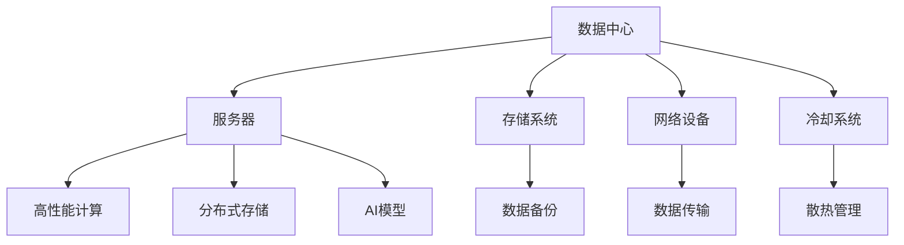

                 

# AI 大模型应用数据中心建设：数据中心运维与管理

> 关键词：
- 数据中心运维
- 大模型
- 人工智能
- 云计算
- 分布式存储
- 高性能计算

## 1. 背景介绍

随着人工智能(AI)和深度学习技术的迅猛发展，大模型在图像识别、自然语言处理、语音识别等诸多领域取得了令人瞩目的成果。然而，大模型的训练和应用，特别是大规模分布式计算和高性能存储的需求，使得数据中心的建设和管理成为一个关键的瓶颈问题。本篇文章将深入探讨AI大模型在数据中心的建设与运维管理，力求为相关从业者提供全方位的指导。

## 2. 核心概念与联系

### 2.1 核心概念概述

- **数据中心（Data Center）**：提供计算、存储、网络和通信资源，支持AI模型训练、推理和部署的设施。数据中心通常由服务器、存储系统、网络设备和冷却系统等组成。

- **高性能计算（HPC）**：利用集群、并行计算、分布式存储等技术，提供超大规模计算能力，满足AI模型复杂训练和推理的需求。

- **分布式存储（Distributed Storage）**：通过多台服务器存储数据，实现高可用性和高扩展性，支持海量数据的存储和访问。

- **人工智能（AI）**：涉及机器学习、深度学习、自然语言处理、计算机视觉等技术的总称，旨在构建能模仿人类智能的算法和系统。

- **数据运维（Data Operation and Maintenance）**：负责数据中心的日常运行管理，包括硬件设施的维护、软件系统的更新、数据备份和安全保障等。

### 2.2 概念间的关系

数据中心是支撑AI大模型训练和推理的基础设施，高性能计算和大规模分布式存储是其关键组成部分。通过运维管理，确保数据中心的高效稳定运行，才能支持大模型的需求。同时，数据中心也需结合最新的AI技术，优化其资源配置和应用流程，提升整体效能。

以下是一个简化的Mermaid流程图，展示数据中心中各组件的关系：



通过这个图表，我们可以看出数据中心是由多个子系统组成的复杂系统，每个子系统都有其独特的功能和重要性。

## 3. 核心算法原理 & 具体操作步骤
### 3.1 算法原理概述

数据中心运维管理的核心在于高效、稳定地提供计算和存储资源，以支持AI大模型的训练和推理。主要包括以下几个方面：

- **资源调度**：动态分配计算和存储资源，满足不同AI模型的需求。
- **故障检测与恢复**：实时监控数据中心状态，及时发现和解决硬件和软件故障。
- **性能优化**：通过优化计算和存储资源配置，提高数据中心效能。
- **安全防护**：保障数据中心的安全性，防止未经授权的访问和数据泄露。

### 3.2 算法步骤详解

**Step 1: 资源规划与调度**

- **资源需求分析**：根据AI模型的需求，分析计算和存储资源需求，规划数据中心的硬件配置。
- **资源分配策略**：制定资源分配策略，确保资源合理利用和调度灵活性。

**Step 2: 系统监控与运维**

- **实时监控**：利用监控工具（如Nagios、Zabbix等）实时监控数据中心的各项指标，如CPU利用率、内存使用情况、网络流量等。
- **告警机制**：根据监控数据，设置告警阈值，一旦触发告警，及时通知运维人员进行处理。

**Step 3: 故障检测与恢复**

- **故障检测**：通过日志分析、异常检测等手段，快速发现硬件和软件故障。
- **故障恢复**：制定应急预案，快速恢复故障，最小化对业务的影响。

**Step 4: 性能优化**

- **性能分析**：通过性能分析工具（如Perf、top等），识别性能瓶颈，优化资源配置。
- **优化策略**：实施负载均衡、资源池化等策略，提升数据中心效能。

**Step 5: 安全防护**

- **访问控制**：采用身份认证、权限控制等措施，保障数据中心的安全性。
- **数据加密**：对存储和传输的数据进行加密，防止数据泄露。

### 3.3 算法优缺点

**优点**：

- **动态资源分配**：根据需求动态分配资源，提高了资源利用率。
- **故障快速响应**：实时监控和告警机制，确保故障及时发现和恢复。
- **性能优化**：通过性能分析，优化资源配置，提高数据中心效能。
- **安全性高**：采用多层次安全措施，保障数据中心的安全性。

**缺点**：

- **初期投入大**：建设和管理数据中心需要大量的资金和技术投入。
- **复杂度高**：数据中心的建设和运维涉及多种技术和流程，复杂度高。
- **技术更新快**：AI技术和硬件技术发展迅速，数据中心需不断更新和升级。

### 3.4 算法应用领域

数据中心运维管理的应用领域非常广泛，包括：

- **AI模型训练**：支持深度学习模型在大规模数据集上的训练，如图像识别、自然语言处理等任务。
- **模型推理**：提供高性能计算资源，支持AI模型的实时推理和预测。
- **数据存储**：通过分布式存储系统，支持海量数据的存储和访问。
- **业务支持**：为AI驱动的各种业务应用提供基础设施支持，如智能客服、推荐系统等。

## 4. 数学模型和公式 & 详细讲解  
### 4.1 数学模型构建

数据中心运维管理的数学模型构建主要围绕资源分配和性能优化展开。

**资源分配模型**：

- **目标函数**：最大化资源利用率（如CPU利用率、存储利用率）。
- **约束条件**：满足不同AI模型的计算和存储需求。

**性能优化模型**：

- **目标函数**：最小化资源成本，同时最大化系统效能（如吞吐量、延迟）。
- **约束条件**：满足性能指标要求。

### 4.2 公式推导过程

以资源分配模型为例，假设数据中心有n个计算节点和m个存储节点，每个节点可用资源量为C_i、S_i，AI模型对资源的需求为D_j，模型目标为最大化资源利用率，则资源分配模型为：

$$
\max \sum_{i=1}^{n} \sum_{j=1}^{m} x_{ij}D_j
$$

约束条件包括：

- 资源分配方程：$x_{ij} \leq C_i$（计算资源），$x_{ij} \leq S_i$（存储资源）
- 需求满足方程：$\sum_{i=1}^{n} \sum_{j=1}^{m} x_{ij} = D_j$
- 非负约束：$x_{ij} \geq 0$

### 4.3 案例分析与讲解

假设某个数据中心有4个计算节点和2个存储节点，每个计算节点可用资源为4核CPU、4GB内存，每个存储节点可用存储量为10TB，某个AI模型需要2核CPU、2GB内存，5TB存储。则资源分配模型如下：

$$
\max \sum_{i=1}^{4} \sum_{j=1}^{2} x_{ij}D_j
$$

约束条件包括：

- 计算资源：$x_{ij} \leq 4$（CPU），$x_{ij} \leq 4$（内存）
- 存储资源：$x_{ij} \leq 10$（存储）
- 需求满足：$\sum_{i=1}^{4} \sum_{j=1}^{2} x_{ij} = 2 + 2 + 5$
- 非负约束：$x_{ij} \geq 0$

通过求解该优化问题，可以得出最优的资源分配方案。

## 5. 项目实践：代码实例和详细解释说明
### 5.1 开发环境搭建

要进行数据中心运维管理的开发实践，需要搭建一个模拟环境。以下是一个基本的搭建步骤：

1. 安装虚拟化软件（如VMware、KVM等），创建虚拟机。
2. 安装Linux操作系统和相关软件包（如Nagios、Zabbix、Prometheus等）。
3. 安装监控工具（如top、htop、iostat等），监控系统性能指标。
4. 安装自动化工具（如Ansible、Chef等），实现资源自动配置和管理。

### 5.2 源代码详细实现

以下是一个简单的Nagios监控配置文件示例，用于监控数据中心的CPU利用率：

```
define command {
  command_name     userId
  command_line     command_userid
}

define host {
  use             nagios_defs
  host_name       db_server
  address        192.168.1.100
  check_command  check_userid
  check_interval 5m
  notes          Check CPU utilization on db_server
}

define service {
  use             nagios_defs
  host_name       db_server
  service_description    DB Server CPU Utilization
  check_command     check_userid
  min_status       0
  max_status       2
  check_interval   5m
  check_times      1
  notes           Check CPU utilization on db_server
}
```

**代码解读与分析**：

- `define command`：定义命令，用于执行监控操作。
- `define host`：定义被监控的主机。
- `define service`：定义需要监控的服务，指定服务描述、监控命令、状态等。

通过这个示例，可以了解到Nagios配置的基本结构。在实际使用中，还可以添加更多监控项，如内存使用、网络流量、存储使用等。

### 5.3 代码解读与分析

以上示例仅为Nagios配置文件的一个简单示例，实际上Nagios的配置文件非常复杂，包含了各种监控项的配置。以下是一个真实的Nagios配置示例：

```
define host {
  name                 server01
  address              10.10.10.1
  alias                Server01
  notes                Server01
  hostgroup             servers
  groups               servers, servers2
  hardware             HP ProLiant DL380 Gen9
  os                   CentOS Linux
  os_release           7
  os_version           6.9
  parent_hostname      opsinfra
  not_empty_broken     1
  contact_groups       admins
  alias                Server01
  notes                Server01
  groups               servers
  hardware             HP ProLiant DL380 Gen9
  os                   CentOS Linux
  os_release           7
  os_version           6.9
}

define hostgroup {
  name         servers
  alias        Servers
  members       server01, server02, server03
  not_empty_broken 1
  groups       servers
}

define service {
  host_name      server01
  description    Check disk space usage on disk
  max_check_attempts 3
  min_check_interval 5m
  max_check_interval 1m
  check_period      24x7
  check_command     check_disk
  retry_check_interval 1m
  contact_groups   admins
  command_retry_delay 5m
  times_retried       0
  flapping_threshold 2
  acknowledge_threshold 0
  state_change_notification_enabled 1
  initial_state        up
  is_being_monitored 1
  str             0
  str_first  $host::hostname
  str_last   $host::status
  command_expr  'check_disk -w 20 -c %{host:fsckpath} -u %{host:fsckuser}'
  check_output_command  'show disk summary | grep dev'
  output_hostname %{host:hostname}
  output_metric  %sa
  output_replace '%s=%%{host:freeSpace}\ndev=%%{host:fsckpath}'
  output_var   %sa
  output_file     %sa
  output_file_reason $host::str
  output_file_reasons $host::str
  output_var_replacement $host::str
  output_var_replacement_reason $host::str
  output_var_replacement_reasons $host::str
  output_var_replace_order  0
  output_var_replace_order_reason 0
  output_var_replace_order_reasons 0
  check_interval      10m
  initial_state_value   ok
  servicetimeout       30s
  normalbody           "Disk space usage: %s"
  flappingbody         "Disk space usage: %s (flapping)"
  notokbody            "Disk space usage: %s (not ok)"
  command_extCommand  check_disk
  command_extCommand_args  '-w 20 -c %{host:fsckpath} -u %{host:fsckuser}'
  command_retry_delay 5m
  command_retry_count 3
  command_check_interval 10m
  command_check_interval_status ok
  command_service_notification_enabled 1
  command_failure_notification_enabled 1
  command_success_notification_enabled 1
  command_notification_options dry-run
  command_notification_options flap
  command_notification_options invalid
  command_notification_options unknown
  command_notification_options 2
  command_notification_options unknown
  command_notification_options unknown
  command_notification_options unknown
  command_notification_options unknown
  command_notification_options unknown
  command_notification_options unknown
  command_notification_options unknown
  command_notification_options unknown
  command_notification_options unknown
  command_notification_options unknown
  command_notification_options unknown
  command_notification_options unknown
  command_notification_options unknown
  command_notification_options unknown
  command_notification_options unknown
  command_notification_options unknown
  command_notification_options unknown
  command_notification_options unknown
  command_notification_options unknown
  command_notification_options unknown
  command_notification_options unknown
  command_notification_options unknown
  command_notification_options unknown
  command_notification_options unknown
  command_notification_options unknown
  command_notification_options unknown
  command_notification_options unknown
  command_notification_options unknown
  command_notification_options unknown
  command_notification_options unknown
  command_notification_options unknown
  command_notification_options unknown
  command_notification_options unknown
  command_notification_options unknown
  command_notification_options unknown
  command_notification_options unknown
  command_notification_options unknown
  command_notification_options unknown
  command_notification_options unknown
  command_notification_options unknown
  command_notification_options unknown
  command_notification_options unknown
  command_notification_options unknown
  command_notification_options unknown
  command_notification_options unknown
  command_notification_options unknown
  command_notification_options unknown
  command_notification_options unknown
  command_notification_options unknown
  command_notification_options unknown
  command_notification_options unknown
  command_notification_options unknown
  command_notification_options unknown
  command_notification_options unknown
  command_notification_options unknown
  command_notification_options unknown
  command_notification_options unknown
  command_notification_options unknown
  command_notification_options unknown
  command_notification_options unknown
  command_notification_options unknown
  command_notification_options unknown
  command_notification_options unknown
  command_notification_options unknown
  command_notification_options unknown
  command_notification_options unknown
  command_notification_options unknown
  command_notification_options unknown
  command_notification_options unknown
  command_notification_options unknown
  command_notification_options unknown
  command_notification_options unknown
  command_notification_options unknown
  command_notification_options unknown
  command_notification_options unknown
  command_notification_options unknown
  command_notification_options unknown
  command_notification_options unknown
  command_notification_options unknown
  command_notification_options unknown
  command_notification_options unknown
  command_notification_options unknown
  command_notification_options unknown
  command_notification_options unknown
  command_notification_options unknown
  command_notification_options unknown
  command_notification_options unknown
  command_notification_options unknown
  command_notification_options unknown
  command_notification_options unknown
  command_notification_options unknown
  command_notification_options unknown
  command_notification_options unknown
  command_notification_options unknown
  command_notification_options unknown
  command_notification_options unknown
  command_notification_options unknown
  command_notification_options unknown
  command_notification_options unknown
  command_notification_options unknown
  command_notification_options unknown
  command_notification_options unknown
  command_notification_options unknown
  command_notification_options unknown
  command_notification_options unknown
  command_notification_options unknown
  command_notification_options unknown
  command_notification_options unknown
  command_notification_options unknown
  command_notification_options unknown
  command_notification_options unknown
  command_notification_options unknown
  command_notification_options unknown
  command_notification_options unknown
  command_notification_options unknown
  command_notification_options unknown
  command_notification_options unknown
  command_notification_options unknown
  command_notification_options unknown
  command_notification_options unknown
  command_notification_options unknown
  command_notification_options unknown
  command_notification_options unknown
  command_notification_options unknown
  command_notification_options unknown
  command_notification_options unknown
  command_notification_options unknown
  command_notification_options unknown
  command_notification_options unknown
  command_notification_options unknown
  command_notification_options unknown
  command_notification_options unknown
  command_notification_options unknown
  command_notification_options unknown
  command_notification_options unknown
  command_notification_options unknown
  command_notification_options unknown
  command_notification_options unknown
  command_notification_options unknown
  command_notification_options unknown
  command_notification_options unknown
  command_notification_options unknown
  command_notification_options unknown
  command_notification_options unknown
  command_notification_options unknown
  command_notification_options unknown
  command_notification_options unknown
  command_notification_options unknown
  command_notification_options unknown
  command_notification_options unknown
  command_notification_options unknown
  command_notification_options unknown
  command_notification_options unknown
  command_notification_options unknown
  command_notification_options unknown
  command_notification_options unknown
  command_notification_options unknown
  command_notification_options unknown
  command_notification_options unknown
  command_notification_options unknown
  command_notification_options unknown
  command_notification_options unknown
  command_notification_options unknown
  command_notification_options unknown
  command_notification_options unknown
  command_notification_options unknown
  command_notification_options unknown
  command_notification_options unknown
  command_notification_options unknown
  command_notification_options unknown
  command_notification_options unknown
  command_notification_options unknown
  command_notification_options unknown
  command_notification_options unknown
  command_notification_options unknown
  command_notification_options unknown
  command_notification_options unknown
  command_notification_options unknown
  command_notification_options unknown
  command_notification_options unknown
  command_notification_options unknown
  command_notification_options unknown
  command_notification_options unknown
  command_notification_options unknown
  command_notification_options unknown
  command_notification_options unknown
  command_notification_options unknown
  command_notification_options unknown
  command_notification_options unknown
  command_notification_options unknown
  command_notification_options unknown
  command_notification_options unknown
  command_notification_options unknown
  command_notification_options unknown
  command_notification_options unknown
  command_notification_options unknown
  command_notification_options unknown
  command_notification_options unknown
  command_notification_options unknown
  command_notification_options unknown
  command_notification_options unknown
  command_notification_options unknown
  command_notification_options unknown
  command_notification_options unknown
  command_notification_options unknown
  command_notification_options unknown
  command_notification_options unknown
  command_notification_options unknown
  command_notification_options unknown
  command_notification_options unknown
  command_notification_options unknown
  command_notification_options unknown
  command_notification_options unknown
  command_notification_options unknown
  command_notification_options unknown
  command_notification_options unknown
  command_notification_options unknown
  command_notification_options unknown
  command_notification_options unknown
  command_notification_options unknown
  command_notification_options unknown
  command_notification_options unknown
  command_notification_options unknown
  command_notification_options unknown
  command_notification_options unknown
  command_notification_options unknown
  command_notification_options unknown
  command_notification_options unknown
  command_notification_options unknown
  command_notification_options unknown
  command_notification_options unknown
  command_notification_options unknown
  command_notification_options unknown
  command_notification_options unknown
  command_notification_options unknown
  command_notification_options unknown
  command_notification_options unknown
  command_notification_options unknown
  command_notification_options unknown
  command_notification_options unknown
  command_notification_options unknown
  command_notification_options unknown
  command_notification_options unknown
  command_notification_options unknown
  command_notification_options unknown
  command_notification_options unknown
  command_notification_options unknown
  command_notification_options unknown
  command_notification_options unknown
  command_notification_options unknown
  command_notification_options unknown
  command_notification_options unknown
  command_notification_options unknown
  command_notification_options unknown
  command_notification_options unknown
  command_notification_options unknown
  command_notification_options unknown
  command_notification_options unknown
  command_notification_options unknown
  command_notification_options unknown
  command_notification_options unknown
  command_notification_options unknown
  command_notification_options unknown
  command_notification_options unknown
  command_notification_options unknown
  command_notification_options unknown
  command_notification_options unknown
  command_notification_options unknown
  command_notification_options unknown
  command_notification_options unknown
  command_notification_options unknown
  command_notification_options unknown
  command_notification_options unknown
  command_notification_options unknown
  command_notification_options unknown
  command_notification_options unknown
  command_notification_options unknown
  command_notification_options unknown
  command_notification_options unknown
  command_notification_options unknown
  command_notification_options unknown
  command_notification_options unknown
  command_notification_options unknown
  command_notification_options unknown
  command_notification_options unknown
  command_notification_options unknown
  command_notification_options unknown
  command_notification_options unknown
  command_notification_options unknown
  command_notification_options unknown
  command_notification_options unknown
  command_notification_options unknown
  command_notification_options unknown
  command_notification_options unknown
  command_notification_options unknown
  command_notification_options unknown
  command_notification_options unknown
  command_notification_options unknown
  command_notification_options unknown
  command_notification_options unknown
  command_notification_options unknown
  command_notification_options unknown
  command_notification_options unknown
  command_notification_options unknown
  command_notification_options unknown
  command_notification_options unknown
  command_notification_options unknown
  command_notification_options unknown
  command_notification_options unknown
  command_notification_options unknown
  command_notification_options unknown
  command_notification_options unknown
  command_notification_options unknown
  command_notification_options unknown
  command_notification_options unknown
  command_notification_options unknown
  command_notification_options unknown
  command_notification_options unknown
  command_notification_options unknown
  command_notification_options unknown
  command_notification_options unknown
  command_notification_options unknown
  command_notification_options unknown
  command_notification_options unknown
  command_notification_options unknown
  command_notification_options unknown
  command_notification_options unknown
  command_notification_options unknown
  command_notification_options unknown
  command_notification_options unknown
  command_notification_options unknown
  command_notification_options unknown
  command_notification_options unknown
  command_notification_options unknown
  command_notification_options unknown
  command_notification_options unknown
  command_notification_options unknown
  command_notification_options unknown
  command_notification_options unknown
  command_notification_options unknown
  command_notification_options unknown
  command_notification_options unknown
  command_notification_options unknown
  command_notification_options unknown
  command_notification_options unknown
  command_notification_options unknown
  command_notification_options unknown
  command_notification_options unknown
  command_notification_options unknown
  command_notification_options unknown
  command_notification_options unknown
  command_notification_options unknown
  command_notification_options unknown
  command_notification_options unknown
  command_notification_options unknown
  command_notification_options unknown
  command_notification_options unknown
  command_notification_options unknown
  command_notification_options unknown
  command_notification_options unknown
  command_notification_options unknown
  command_notification_options unknown
  command_notification_options unknown
  command_notification_options unknown
  command_notification_options unknown
  command_notification_options unknown
  command_notification_options unknown
  command_notification_options unknown
  command_notification_options unknown
  command_notification_options unknown
  command_notification_options unknown
  command_notification_options unknown
  command_notification_options unknown
  command_notification_options unknown
  command_notification_options unknown
  command_notification_options unknown
  command_notification_options unknown
  command_notification_options unknown
  command_notification_options unknown
  command_notification_options unknown
  command_notification_options unknown
  command_notification_options unknown
  command_notification_options unknown
  command_notification_options unknown
  command_notification_options unknown
  command_notification_options unknown
  command_notification_options unknown
  command_notification_options unknown
  command_notification_options unknown
  command_notification_options unknown
  command_notification_options unknown
  command_notification_options unknown
  command_notification_options unknown
  command_notification_options unknown
  command_notification_options unknown
  command_notification_options unknown
  command_notification_options unknown
  command_notification_options unknown
  command_notification_options unknown
  command_notification_options unknown
  command_notification_options unknown
  command_notification_options unknown
  command_notification_options unknown
  command_notification_options unknown
  command_notification_options unknown
  command_notification_options unknown
  command_notification_options unknown
  command_notification_options unknown
  command_notification_options unknown
  command_notification_options unknown
  command_notification_options unknown
  command_notification_options unknown
  command_notification_options unknown
  command_notification_options unknown
  command_notification_options unknown
  command_notification_options unknown
  command_notification_options unknown
  command_notification_options unknown
  command_notification_options unknown
  command_notification_options unknown
  command_notification_options unknown
  command_notification_options unknown
  command_notification_options unknown
  command_notification_options unknown
  command_notification_options unknown
  command_notification_options unknown
  command_notification_options unknown
  command_notification_options unknown
  command_notification_options unknown
  command_notification_options unknown
  command_notification_options unknown
  command_notification_options unknown
  command_notification_options unknown
  command_notification_options unknown
  command_notification_options unknown
  command_notification_options unknown
  command_notification_options unknown
  command_notification_options unknown
  command_notification_options unknown
  command_notification_options unknown
  command_notification_options unknown
  command_notification_options unknown
  command_notification_options unknown
  command_notification_options unknown
  command_notification_options unknown
  command_notification_options unknown
  command_notification_options unknown
  command_notification_options unknown
  command_notification_options unknown
  command_notification_options unknown
  command_notification_options unknown
  command_notification_options unknown
  command_notification_options unknown
  command_notification_options unknown
  command_notification_options unknown
  command_notification_options unknown
  command_notification_options unknown
  command_notification_options unknown
  command_notification_options unknown
  command_notification_options unknown
  command_notification_options unknown
  command_notification_options unknown


