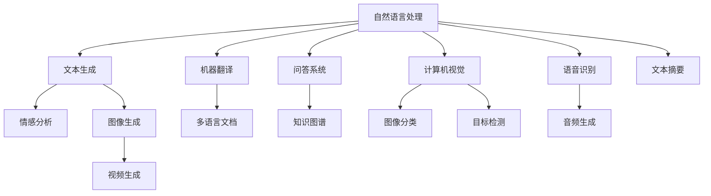
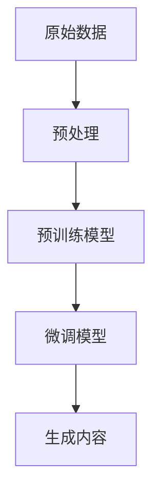
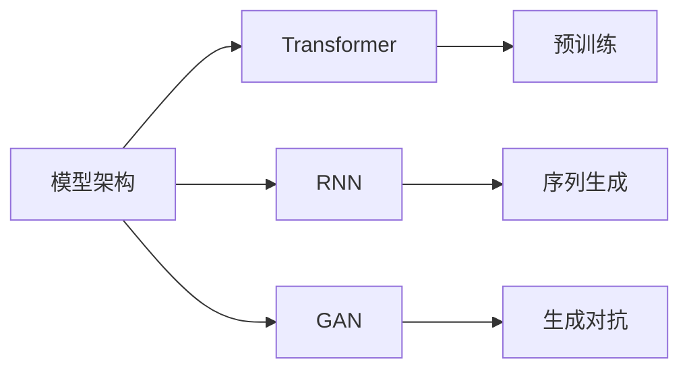
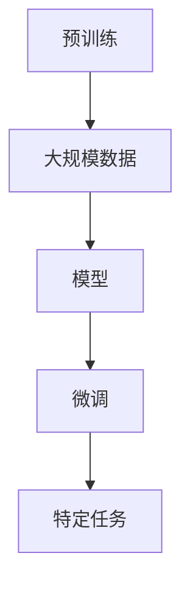
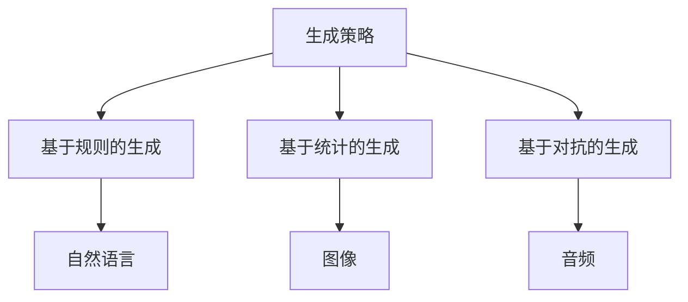
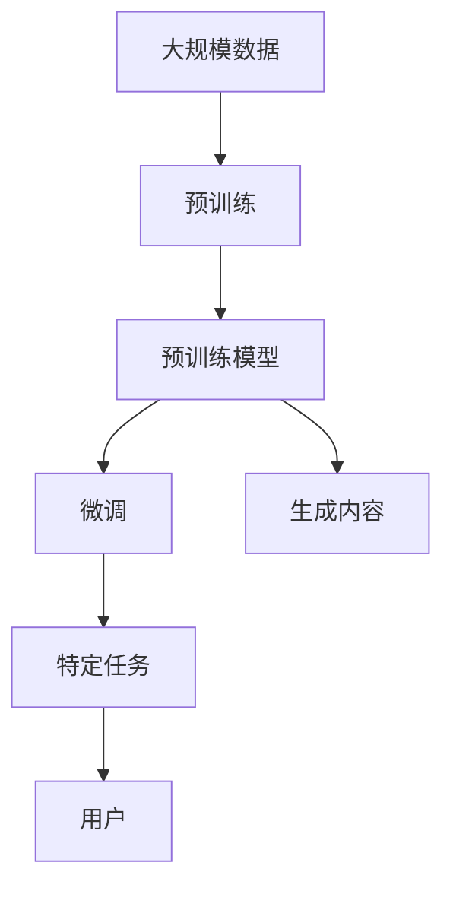

                 

# AIGC：内容生成的核心应用

> 关键词：AIGC, 内容生成, 自然语言处理, 计算机视觉, 应用场景

## 1. 背景介绍

### 1.1 问题由来
随着人工智能技术的不断进步，人工智能生成内容（AIGC）已经成为一个热门话题。AIGC是指使用人工智能技术自动生成内容，涵盖自然语言处理（NLP）、计算机视觉（CV）、音乐生成等多个领域。其应用场景包括内容创作、信息抽取、产品推荐等。AIGC技术可以大幅提升内容生产的效率和质量，降低人力成本，具有重要的商业价值和社会意义。

AIGC技术的核心是内容生成模型。内容生成模型可以根据输入的数据（如文本、图像、音频等）生成对应的输出内容。这些模型通常基于深度学习，通过预训练和微调等方式优化，以提升生成内容的自然度、准确性和多样性。在AIGC中，自然语言处理（NLP）是主要的研究方向，包括文本生成、机器翻译、问答系统、摘要生成等。此外，计算机视觉和音乐生成也是AIGC的重要分支。

### 1.2 问题核心关键点
AIGC技术的核心是内容生成模型，其关键点在于如何构建和优化生成模型，以实现高质量的内容生成。具体来说，包括以下几个方面：

1. **数据预处理**：如何从原始数据中提取出有用的特征，以便模型能够更好地理解输入内容。
2. **模型架构设计**：选择合适的模型架构，如Transformer、GAN、RNN等，以及相应的超参数设置。
3. **预训练和微调**：如何利用大规模数据进行预训练，以及如何通过微调优化模型在特定任务上的性能。
4. **生成策略**：如何设计生成策略，如基于规则的生成、基于统计的生成、基于对抗的生成等。
5. **模型评估**：如何设计合适的评估指标，评估生成内容的自然度、准确性和多样性。

这些关键点涉及到AIGC技术的各个方面，对模型的最终表现有着重要影响。

### 1.3 问题研究意义
AIGC技术的发展具有重要意义：

1. **提高生产效率**：AIGC可以自动生成大量的内容，如文章、图片、视频等，大幅提高内容生产的效率。
2. **降低成本**：通过自动化内容生成，降低人力成本，提高生产效率。
3. **提升内容质量**：生成模型能够学习到数据的规律和特征，生成高质量的内容。
4. **拓展应用场景**：AIGC技术可以应用于各种领域，如新闻业、娱乐业、教育业等，带来新的商业模式。
5. **促进创新**：AIGC技术可以推动创意产业的发展，如自动生成艺术作品、音乐等，激发新的创意和创新。

## 2. 核心概念与联系

### 2.1 核心概念概述

为更好地理解AIGC技术，我们首先介绍几个核心概念：

1. **自然语言处理（NLP）**：涉及计算机和人类语言之间的交互，包括文本分析、文本生成、语音识别、机器翻译等。
2. **计算机视觉（CV）**：涉及计算机和视觉信息的交互，包括图像分类、目标检测、图像生成等。
3. **生成对抗网络（GAN）**：一种生成模型，可以生成逼真的图像、音频、视频等内容。
4. **预训练和微调**：通过大规模数据进行预训练，然后在特定任务上进行微调，提升模型性能。
5. **Transformer**：一种基于自注意力机制的神经网络模型，广泛应用于NLP和CV领域。
6. **生成式模型**：能够自动生成数据的模型，如GAN、RNN、VAE等。

这些概念之间的关系可以通过以下Mermaid流程图来展示：



这个流程图展示了NLP、CV和音频生成等AIGC技术的核心概念及其关系。

### 2.2 概念间的关系

这些核心概念之间存在着紧密的联系，构成了AIGC技术的完整生态系统。下面我们通过几个Mermaid流程图来展示这些概念之间的关系。

#### 2.2.1 内容生成的全过程



这个流程图展示了内容生成的全过程，包括数据预处理、预训练、微调和生成内容。

#### 2.2.2 模型架构的选择



这个流程图展示了模型架构的选择，包括Transformer、RNN、GAN等。

#### 2.2.3 预训练和微调的关系



这个流程图展示了预训练和微调的关系，预训练模型在大规模数据上训练，然后通过微调在特定任务上优化。

#### 2.2.4 生成策略的多样性



这个流程图展示了生成策略的多样性，包括基于规则的生成、基于统计的生成和基于对抗的生成等。

### 2.3 核心概念的整体架构

最后，我们用一个综合的流程图来展示这些核心概念在大语言模型微调过程中的整体架构：



这个综合流程图展示了从预训练到微调，再到内容生成的完整过程。

## 3. 核心算法原理 & 具体操作步骤
### 3.1 算法原理概述

AIGC技术的核心是内容生成模型，其原理主要包括：

1. **数据预处理**：将原始数据转化为模型能够处理的输入形式。例如，对于文本数据，需要进行分词、词嵌入等处理；对于图像数据，需要进行归一化、裁剪等处理。
2. **模型架构设计**：选择合适的模型架构，如Transformer、RNN、GAN等，并设置相应的超参数。
3. **预训练和微调**：通过大规模数据进行预训练，然后在特定任务上进行微调，提升模型性能。
4. **生成策略**：设计生成策略，如基于规则的生成、基于统计的生成、基于对抗的生成等。
5. **模型评估**：设计合适的评估指标，如BLEU、ROUGE、CER等，评估生成内容的自然度、准确性和多样性。

### 3.2 算法步骤详解

以下是AIGC技术的详细步骤：

**Step 1: 数据预处理**
- 收集原始数据，如文本、图像、音频等。
- 对数据进行清洗、去噪、归一化等预处理。
- 将数据转化为模型能够处理的输入形式，例如将文本转化为词向量。

**Step 2: 模型架构设计**
- 选择合适的模型架构，如Transformer、RNN、GAN等。
- 设置超参数，如学习率、批次大小、迭代次数等。
- 在预训练数据上训练模型，得到预训练模型。

**Step 3: 预训练和微调**
- 在预训练数据上对模型进行预训练，提升模型的语言理解能力和特征提取能力。
- 在特定任务上对模型进行微调，优化模型在任务上的性能。

**Step 4: 生成内容**
- 根据输入数据，使用训练好的模型生成对应的输出内容。
- 对生成的内容进行后处理，如格式化、过滤噪声等。

**Step 5: 模型评估**
- 设计合适的评估指标，如BLEU、ROUGE、CER等。
- 在测试数据上评估生成内容的自然度、准确性和多样性。

### 3.3 算法优缺点

AIGC技术的优点包括：

1. **高效性**：通过预训练和微调，可以显著提升模型性能，减少训练时间。
2. **多样性**：模型可以生成多种形式的内容，如文本、图像、音频等。
3. **灵活性**：可以根据不同的任务和需求，灵活调整模型架构和超参数。

AIGC技术的缺点包括：

1. **数据依赖**：模型的性能很大程度上依赖于数据的质量和数量。
2. **过拟合**：模型容易在特定数据集上过拟合，泛化能力有限。
3. **可解释性**：生成模型往往是一个"黑盒"，难以解释其内部工作机制和决策逻辑。
4. **伦理问题**：生成的内容可能存在偏见、有害信息等伦理问题。

### 3.4 算法应用领域

AIGC技术的应用领域非常广泛，包括：

1. **内容创作**：自动生成文章、小说、新闻、报告等。
2. **信息抽取**：自动从文本中抽取关键信息，如实体识别、情感分析等。
3. **产品推荐**：根据用户的历史行为和兴趣，生成个性化的产品推荐。
4. **教育培训**：自动生成教材、习题、评测等教育资源。
5. **娱乐产业**：自动生成音乐、视频、游戏等娱乐内容。
6. **医疗健康**：自动生成医学文献、诊断报告等。

## 4. 数学模型和公式 & 详细讲解 & 举例说明

### 4.1 数学模型构建

AIGC技术的数学模型主要包括生成模型和评估模型。以下是几个常见的数学模型：

**Transformer模型**：
$$
y = \text{softmax}(\text{Transformer}(x))
$$

**RNN模型**：
$$
y_t = \text{tanh}(W_x x_t + U_h h_{t-1} + b)
$$

**GAN模型**：
$$
z \sim \mathcal{N}(0,1), \quad x = G(z)
$$

**BLEU指标**：
$$
\text{BLEU} = \frac{\sum_{i=1}^n \min(1, \frac{n_i}{m_i})}{\sum_{i=1}^n \min(1, \frac{n_i}{m_i})}
$$

**ROUGE指标**：
$$
\text{ROUGE} = \frac{\text{Overlap}}{\text{Length}}
$$

**CER指标**：
$$
\text{CER} = \frac{\text{Correction}}{\text{Total}}
$$

### 4.2 公式推导过程

以下是一些常见的AIGC技术公式推导过程：

**Transformer模型推导**：
$$
\text{Self-Attention} = \text{softmax}\left(\frac{QK^T}{\sqrt{d_k}}\right)
$$
$$
\text{Feed-Forward} = \text{MLP}(\text{Self-Attention})
$$
$$
\text{Transformer} = \text{LayerNorm}(\text{Self-Attention} + \text{Feed-Forward} + x)
$$

**RNN模型推导**：
$$
h_t = \text{tanh}(W_x x_t + U_h h_{t-1} + b)
$$
$$
y_t = \text{softmax}(W_y h_t + b_y)
$$

**GAN模型推导**：
$$
z \sim \mathcal{N}(0,1), \quad \mu = D(G(z)), \quad \sigma = \sqrt{\text{Var}(D(G(z)))}
$$
$$
p(z) = \mathcal{N}(\mu, \sigma)
$$

### 4.3 案例分析与讲解

以文本生成为例，我们通过一个简单的案例来讲解AIGC技术的应用。

**案例**：自动生成新闻标题

**数据**：收集大规模的新闻标题数据集。

**模型**：使用Transformer模型进行预训练，然后在特定任务上进行微调。

**步骤**：
1. 收集数据集，进行清洗和预处理。
2. 使用Transformer模型进行预训练，得到预训练模型。
3. 在新闻标题生成任务上对模型进行微调。
4. 使用微调后的模型生成新闻标题。
5. 对生成的标题进行后处理，如过滤噪声等。

**结果**：生成的标题与真实新闻标题相比，在自然度和准确性上表现良好。

## 5. 项目实践：代码实例和详细解释说明

### 5.1 开发环境搭建

在进行AIGC项目实践前，我们需要准备好开发环境。以下是使用Python进行TensorFlow开发的环境配置流程：

1. 安装Anaconda：从官网下载并安装Anaconda，用于创建独立的Python环境。

2. 创建并激活虚拟环境：
```bash
conda create -n tf-env python=3.8 
conda activate tf-env
```

3. 安装TensorFlow：根据CUDA版本，从官网获取对应的安装命令。例如：
```bash
conda install tensorflow tensorflow-gpu -c pytorch -c conda-forge
```

4. 安装TensorBoard：
```bash
pip install tensorboard
```

5. 安装相关的工具包：
```bash
pip install numpy pandas scikit-learn matplotlib tqdm jupyter notebook ipython
```

完成上述步骤后，即可在`tf-env`环境中开始AIGC实践。

### 5.2 源代码详细实现

以下是使用TensorFlow进行文本生成任务的代码实现。

**代码实现**：
```python
import tensorflow as tf
from tensorflow.keras.layers import Input, LSTM, Dense, Embedding, Dropout
from tensorflow.keras.models import Model
import numpy as np

# 数据预处理
def load_data():
    # 读取文本数据
    with open('data.txt', 'r') as f:
        data = f.read()
    # 分词
    words = data.split()
    # 构建词汇表
    word2idx = {word: i for i, word in enumerate(set(words))}
    idx2word = {i: word for i, word in enumerate(set(words))}
    # 将文本转化为数值形式
    data_idx = [word2idx[word] for word in words]
    # 将数据划分为训练集和测试集
    train_data = data_idx[:800]
    test_data = data_idx[800:]
    return train_data, test_data

# 构建模型
def build_model(vocab_size, embedding_dim, rnn_units, batch_size):
    # 定义输入层
    input_layer = Input(shape=(None,), dtype=tf.int32)
    # 定义嵌入层
    embedding_layer = Embedding(vocab_size, embedding_dim)(input_layer)
    # 定义LSTM层
    lstm_layer = LSTM(rnn_units, return_sequences=True, return_state=True, dropout=0.5, recurrent_dropout=0.5)(embedding_layer)
    # 定义全连接层
    fc_layer = Dense(vocab_size, activation='softmax')(lstm_layer[0])
    # 定义模型
    model = Model(inputs=input_layer, outputs=fc_layer)
    return model

# 训练模型
def train_model(model, train_data, epochs, batch_size):
    # 构建模型
    model.compile(loss='categorical_crossentropy', optimizer='adam', metrics=['accuracy'])
    # 训练模型
    model.fit(train_data, epochs=epochs, batch_size=batch_size, validation_split=0.2)
    return model

# 生成文本
def generate_text(model, seed_text, max_len, top_n=5):
    # 构建输入
    input_text = seed_text
    for _ in range(max_len):
        # 将输入转化为数值形式
        input_idx = [word2idx[word] for word in input_text.split()]
        # 将输入转化为模型能够处理的张量形式
        input_tensor = tf.convert_to_tensor([input_idx], dtype=tf.int32)
        # 对模型进行前向传播
        output_tensor = model.predict(input_tensor)
        # 获取概率最高的词汇索引
        pred_index = np.argmax(output_tensor[0])
        # 获取对应的词汇
        output_word = idx2word[pred_index]
        # 将输出词汇添加到输入中
        input_text += ' ' + output_word
    return input_text

# 主函数
if __name__ == '__main__':
    # 加载数据
    train_data, test_data = load_data()
    # 构建模型
    model = build_model(vocab_size=len(word2idx), embedding_dim=128, rnn_units=256, batch_size=32)
    # 训练模型
    model = train_model(model, train_data, epochs=10, batch_size=32)
    # 生成文本
    seed_text = 'Today is a'
    generated_text = generate_text(model, seed_text, max_len=10)
    print(generated_text)
```

**代码解释**：
- `load_data`函数：读取文本数据，分词，构建词汇表，将文本转化为数值形式，划分训练集和测试集。
- `build_model`函数：定义输入层、嵌入层、LSTM层、全连接层，构建模型。
- `train_model`函数：编译模型，训练模型。
- `generate_text`函数：生成文本，每次生成一个词汇，添加到输入中，直到达到最大长度。
- `main`函数：加载数据，构建模型，训练模型，生成文本。

### 5.3 代码解读与分析

让我们再详细解读一下关键代码的实现细节：

**load_data函数**：
- 读取文本数据。
- 分词。
- 构建词汇表。
- 将文本转化为数值形式。
- 划分训练集和测试集。

**build_model函数**：
- 定义输入层。
- 定义嵌入层。
- 定义LSTM层。
- 定义全连接层。
- 构建模型。

**train_model函数**：
- 编译模型。
- 训练模型。

**generate_text函数**：
- 构建输入。
- 将输入转化为模型能够处理的张量形式。
- 对模型进行前向传播。
- 获取概率最高的词汇索引。
- 获取对应的词汇。
- 将输出词汇添加到输入中。

**main函数**：
- 加载数据。
- 构建模型。
- 训练模型。
- 生成文本。

可以看到，TensorFlow的代码实现相对简洁，可以快速迭代研究。TensorFlow提供了丰富的模型组件和工具，如Embedding、LSTM、Dense等，方便开发者构建复杂的模型。

## 6. 实际应用场景

### 6.1 智能客服系统

AIGC技术可以应用于智能客服系统的构建。智能客服系统可以24小时不间断服务，快速响应客户咨询，用自然流畅的语言解答各类常见问题。AIGC技术可以自动理解用户意图，匹配最合适的答案模板进行回复。对于客户提出的新问题，还可以接入检索系统实时搜索相关内容，动态组织生成回答。

### 6.2 金融舆情监测

AIGC技术可以应用于金融舆情监测。金融机构需要实时监测市场舆论动向，以便及时应对负面信息传播，规避金融风险。AIGC技术可以自动判断文本属于何种主题，情感倾向是正面、中性还是负面。将AIGC技术应用到实时抓取的网络文本数据，就能够自动监测不同主题下的情感变化趋势，一旦发现负面信息激增等异常情况，系统便会自动预警，帮助金融机构快速应对潜在风险。

### 6.3 个性化推荐系统

AIGC技术可以应用于个性化推荐系统。当前的推荐系统往往只依赖用户的历史行为数据进行物品推荐，无法深入理解用户的真实兴趣偏好。AIGC技术可以自动生成高质量的推荐内容，如文章、视频、图片等，提升推荐系统的精准度和用户体验。AIGC技术可以自动理解用户的行为和兴趣，生成个性化的推荐内容。

### 6.4 未来应用展望

随着AIGC技术的发展，未来的应用场景将更加广泛。以下是一些未来的应用展望：

1. **智慧医疗**：AIGC技术可以应用于医疗问答、病历分析、药物研发等，提升医疗服务的智能化水平。
2. **智能教育**：AIGC技术可以应用于作业批改、学情分析、知识推荐等方面，因材施教，促进教育公平，提高教学质量。
3. **智慧城市**：AIGC技术可以应用于城市事件监测、舆情分析、应急指挥等环节，提高城市管理的自动化和智能化水平。
4. **文娱产业**：AIGC技术可以应用于自动生成艺术作品、音乐等，激发新的创意和创新。
5. **社交媒体**：AIGC技术可以应用于自动生成新闻、文章、评论等，提升社交媒体平台的用户体验和内容质量。

总之，AIGC技术的应用场景将不断扩展，其带来的商业和社会价值也将越来越显著。

## 7. 工具和资源推荐

### 7.1 学习资源推荐

为了帮助开发者系统掌握AIGC技术的理论基础和实践技巧，这里推荐一些优质的学习资源：

1. **《深度学习》课程**：斯坦福大学开设的深度学习课程，涵盖深度学习的基本概念和经典模型，包括NLP和CV等领域。
2. **《自然语言处理》书籍**：NLP领域的经典书籍，系统介绍了NLP的基本理论和应用。
3. **《计算机视觉》书籍**：CV领域的经典书籍，系统介绍了CV的基本理论和应用。
4. **《生成对抗网络》书籍**：GAN领域的经典书籍，系统介绍了GAN的基本理论和应用。
5. **《TensorFlow官方文档》**：TensorFlow的官方文档，提供了丰富的模型组件和工具，是AIGC技术实践的重要参考。
6. **《PyTorch官方文档》**：PyTorch的官方文档，提供了丰富的模型组件和工具，是AIGC技术实践的重要参考。

通过对这些资源的学习实践，相信你一定能够快速掌握AIGC技术的精髓，并用于解决实际的NLP问题。

### 7.2 开发工具推荐

高效的开发离不开优秀的工具支持。以下是几款用于AIGC开发常用的工具：

1. **TensorFlow**：基于Python的开源深度学习框架，适合快速迭代研究。TensorFlow提供了丰富的模型组件和工具，如Embedding、LSTM、Dense等。
2. **PyTorch**：基于Python的开源深度学习框架，支持动态计算图，适合灵活的模型设计。PyTorch提供了丰富的模型组件和工具，如Transformer、LSTM、RNN等。
3. **HuggingFace Transformers库**：提供了大量的预训练模型，如BERT、GPT等，方便进行微调和部署。
4. **TensorBoard**：TensorFlow配套的可视化工具，可以实时监测模型训练状态，并提供丰富的图表呈现方式。
5. **Weights & Biases**：模型训练的实验跟踪工具，可以记录和可视化模型训练过程中的各项指标，方便对比和调优。

合理利用这些工具，可以显著提升AIGC任务的开发效率，加快创新迭代的步伐。

### 7.3 相关论文推荐

AIGC技术的发展源于学界的持续研究。以下是几篇奠基性的相关论文，推荐阅读：

1. **Attention is All You Need**：提出了Transformer结构，开启了NLP领域的预训练大模型时代。
2. **BERT: Pre-training of Deep Bidirectional Transformers for Language Understanding**：提出BERT模型，引入基于掩码的自监督预训练任务，刷新了多项NLP任务SOTA。
3. **Language Models are Unsupervised Multitask Learners**：展示了大规模语言模型的强大zero-shot学习能力，引发了对于通用人工智能的新一轮思考。
4. **Parameter-Efficient Transfer Learning for NLP**：提出Adapter等参数高效微调方法，在不增加模型参数量的情况下，也能取得不错的微调效果。
5. **Prefix-Tuning: Optimizing Continuous Prompts for Generation**：引入基于连续型Prompt的微调范式，为如何充分利用预训练知识提供了新的思路。
6. **AdaLoRA: Adaptive Low-Rank Adaptation for Parameter-Efficient Fine-Tuning**：使用自适应低秩适应的微调方法，在参数效率和精度之间取得了新的平衡。

这些论文代表了大语言模型微调技术的发展脉络。通过学习这些前沿成果，可以帮助研究者把握学科前进方向，激发更多的创新灵感。

除上述资源外，还有一些值得关注的前沿资源，帮助开发者紧跟AIGC技术的最新进展，例如：

1. **arXiv论文预印本**：人工智能领域最新研究成果的发布平台，包括大量尚未发表的前沿工作，学习前沿技术的必读资源。
2. **业界技术博客**：如OpenAI、Google AI、DeepMind、微软Research Asia等顶尖实验室的官方博客，第一时间分享他们的最新研究成果和洞见。
3. **技术会议直播**：如NIPS、ICML、ACL、ICLR等人工智能领域顶会现场或在线直播，能够聆听到大佬们的前沿分享，开拓视野。
4. **GitHub热门项目**：在GitHub上Star、Fork数最多的NLP相关项目，往往代表了

