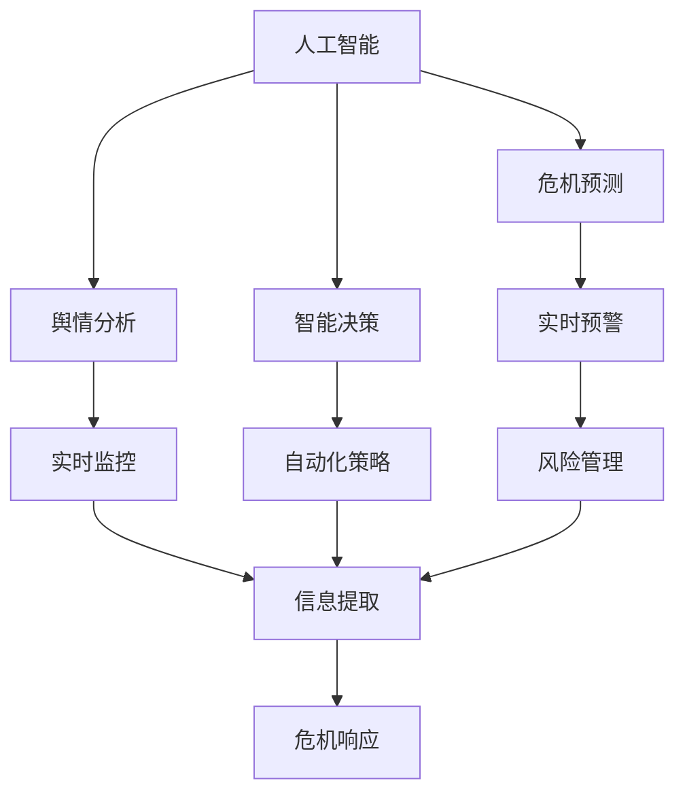
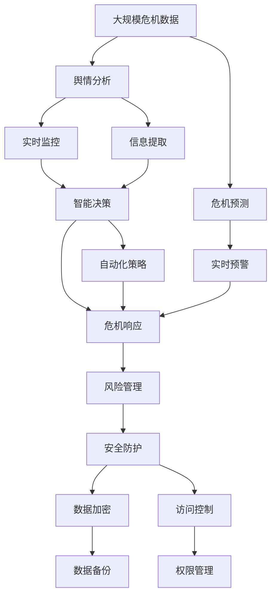

                 

# AI人工智能代理工作流 AI Agent WorkFlow：在公关危机管理中的应用

> 关键词：人工智能, 公关危机管理, AI代理工作流, 危机预测, 舆情分析, 实时监控, 智能决策, 自动化流程, 安全防护, 技术优势

## 1. 背景介绍

### 1.1 问题由来
随着现代社会的快速发展，企业面临的公关危机事件频发，且性质复杂多样，对企业声誉和市场影响巨大。传统的人力驱动公关危机管理模式存在响应慢、效率低、信息不准确等问题。因此，构建一个高效、智能、自动化的公关危机管理系统，以迅速响应、高效管理和及时应对，变得尤为重要。

### 1.2 问题核心关键点
现代公关危机管理系统的核心在于如何利用人工智能(AI)技术，对危机事件进行早期预测、实时监控、舆情分析和智能决策。这要求系统具备以下几个核心能力：

1. **危机预测**：通过数据分析，预测潜在的公关危机事件，及时预警。
2. **舆情分析**：利用NLP技术，对社交媒体、新闻等渠道的舆情信息进行实时监测和分析，判断危机影响范围和热度。
3. **智能决策**：基于数据分析和智能算法，自动化制定和调整危机应对策略。
4. **自动化流程**：通过AI代理工作流，自动化处理危机管理的各项任务，提高效率。
5. **安全防护**：保障系统数据和决策的安全性，防止恶意攻击和数据泄露。

### 1.3 问题研究意义
构建基于AI的公关危机管理系统，对于提升企业的公关危机应对能力，降低损失，维护企业声誉，具有重要意义：

1. **提前预警**：通过AI预测危机事件，使企业能够提前做好准备，降低突发危机带来的风险。
2. **高效响应**：通过AI代理工作流，自动化处理危机任务，快速响应和解决问题。
3. **精准分析**：利用NLP技术，精准分析舆情信息，快速判断危机影响，制定应对措施。
4. **智能决策**：结合数据分析和智能算法，自动化生成危机应对策略，提高决策质量。
5. **持续优化**：AI系统能够持续学习和优化，不断提升应对危机的能力。

## 2. 核心概念与联系

### 2.1 核心概念概述

为了更好地理解AI公关危机管理系统的构建过程，本节将介绍几个密切相关的核心概念：

- **人工智能(AI)**：利用机器学习、深度学习等技术，使机器具备类似人类的智能能力。
- **公关危机管理**：通过预测、预警、监控、分析、决策等手段，管理企业面临的公关危机事件，维护企业声誉和利益。
- **AI代理工作流**：利用AI自动化处理各项公关危机管理任务，提高效率和准确性。
- **危机预测**：通过数据分析和机器学习，预测可能的公关危机事件，及时预警。
- **舆情分析**：利用自然语言处理(NLP)技术，对社交媒体、新闻等渠道的舆情信息进行实时监测和分析。
- **智能决策**：基于数据分析和智能算法，自动化制定和调整危机应对策略。
- **安全防护**：采用数据加密、访问控制等技术，保障系统数据和决策的安全性。

这些核心概念之间的逻辑关系可以通过以下Mermaid流程图来展示：



这个流程图展示了从人工智能到各个AI公关危机管理核心能力的路径：

1. 人工智能通过危机预测、舆情分析和智能决策，支持危机预警、实时监控、自动化策略和风险管理。
2. 危机预测和舆情分析获取的信息，由智能决策进行分析和处理，最终支持危机响应。
3. 危机响应的自动化流程由AI代理工作流实现，从而提高效率。

### 2.2 概念间的关系

这些核心概念之间存在着紧密的联系，形成了AI公关危机管理系统的完整生态系统。

1. **AI与危机预测、舆情分析、智能决策的关系**：
    - 危机预测和舆情分析都是基于数据进行的，需要人工智能技术进行分析和预测。
    - 智能决策则利用数据分析和机器学习，自动化制定和调整危机应对策略。

2. **AI代理工作流与其他核心能力的关系**：
    - AI代理工作流通过自动化处理危机管理的各项任务，实现高效响应和持续优化。
    - 危机预测、舆情分析和智能决策的结果，都通过AI代理工作流进行自动化处理，从而实现高效的危机应对。

3. **安全防护与其他核心能力的关系**：
    - 安全防护是整个系统的基础，保障数据和决策的安全性，防止恶意攻击和数据泄露。
    - 危机预测、舆情分析和智能决策依赖于数据的安全传输和存储，安全防护为系统提供了基本保障。

### 2.3 核心概念的整体架构

最后，我们用一个综合的流程图来展示这些核心概念在大规模危机管理中的整体架构：



这个综合流程图展示了从大规模危机数据的收集到最终危机响应的全过程，涵盖了危机预测、实时预警、舆情分析、实时监控、信息提取、智能决策、自动化策略、危机响应、风险管理和安全防护等关键环节。

## 3. 核心算法原理 & 具体操作步骤

### 3.1 算法原理概述

AI公关危机管理系统的核心算法原理包括以下几个关键方面：

- **危机预测算法**：利用历史数据和机器学习算法，对潜在危机进行预测和预警。
- **舆情分析算法**：通过NLP技术，对社交媒体、新闻等渠道的舆情信息进行实时监测和分析。
- **智能决策算法**：结合数据分析和智能算法，自动化生成危机应对策略。
- **AI代理工作流算法**：利用流程自动化技术，自动化处理各项公关危机管理任务。

这些算法通过数据驱动、智能分析和自动化处理，实现了高效、智能的危机管理。

### 3.2 算法步骤详解

以下是AI公关危机管理系统的核心算法步骤：

**Step 1: 数据收集与预处理**

1. 收集大规模危机数据，包括社交媒体评论、新闻报道、舆情评论等。
2. 对数据进行清洗、去重、分类等预处理。

**Step 2: 危机预测**

1. 利用历史数据和机器学习算法，训练危机预测模型。
2. 将新数据输入模型，输出预测结果，预警潜在危机。

**Step 3: 舆情分析**

1. 利用NLP技术，对社交媒体、新闻等渠道的舆情信息进行实时监测和分析。
2. 通过情感分析、主题提取等技术，判断舆情影响范围和热度。

**Step 4: 智能决策**

1. 结合数据分析和智能算法，自动化生成危机应对策略。
2. 根据危机影响范围和热度，调整策略，优化决策。

**Step 5: 自动化流程**

1. 利用AI代理工作流，自动化处理各项公关危机管理任务，如舆情监控、信息回复、策略调整等。
2. 通过API接口，与外部系统进行数据交互，实现自动化处理。

**Step 6: 风险管理**

1. 采用数据加密、访问控制等技术，保障系统数据和决策的安全性。
2. 定期备份数据，防止数据丢失。

**Step 7: 安全防护**

1. 利用防火墙、入侵检测等技术，防止恶意攻击。
2. 采用权限管理、访问控制等措施，保障数据和系统的安全性。

### 3.3 算法优缺点

AI公关危机管理系统的算法具有以下优点：

- **高效性**：通过自动化处理，大大提高了危机应对的效率和响应速度。
- **智能性**：利用机器学习算法，自动化生成危机应对策略，提高决策质量。
- **灵活性**：通过数据驱动的智能分析，可以灵活应对各种危机情况。

同时，该算法也存在以下缺点：

- **数据依赖性**：算法的性能依赖于数据的质量和量。
- **复杂性**：算法涉及多个环节和步骤，实现难度较大。
- **安全性问题**：系统数据和决策的安全性需要重点保障。

### 3.4 算法应用领域

AI公关危机管理系统已经在多个领域得到应用，例如：

- **企业公关**：帮助企业快速应对和处理公关危机事件，保护企业声誉和市场利益。
- **政府危机管理**：通过AI技术，实时监测和分析各类社会危机，快速响应和处理。
- **媒体舆情分析**：利用AI技术，分析媒体报道和社交媒体舆情，引导媒体报道方向。
- **公共安全**：通过AI技术，实时监测和分析各类公共安全事件，提高应急响应能力。
- **金融危机管理**：利用AI技术，预测和应对金融市场危机，维护金融稳定。

这些应用领域展示了AI公关危机管理系统在实际场景中的广泛应用和巨大潜力。

## 4. 数学模型和公式 & 详细讲解 & 举例说明

### 4.1 数学模型构建

AI公关危机管理系统构建的数学模型包括以下几个关键部分：

- **危机预测模型**：基于时间序列预测和回归算法，建立危机预测模型。
- **舆情分析模型**：利用NLP技术，建立舆情信息提取和情感分析模型。
- **智能决策模型**：基于优化和强化学习算法，建立智能决策模型。

### 4.2 公式推导过程

**危机预测模型**

假设历史危机事件数据为$(x_t, y_t)$，其中$x_t$为时间$t$的特征向量，$y_t$为事件发生与否。利用时间序列预测模型，预测未来事件发生的可能性$P(y_{t+1}=1|x_t)$。模型的形式化表示为：

$$
P(y_{t+1}=1|x_t) = f(x_t, \theta)
$$

其中$f(\cdot)$为预测函数，$\theta$为模型参数。通过最大化似然函数，可以求得最优参数$\theta^*$：

$$
\theta^* = \mathop{\arg\max}_{\theta} \prod_{t=1}^{T} P(y_t|x_t)
$$

**舆情分析模型**

利用情感分析技术，对舆情信息进行情感分类。假设舆情信息为$(X, Y)$，其中$X$为文本数据，$Y$为情感标签。情感分析模型的形式化表示为：

$$
P(Y|X) = \frac{P(X|Y)P(Y)}{P(X)}
$$

其中$P(X|Y)$为条件概率，$P(Y)$为先验概率，$P(X)$为边缘概率。通过最大化对数似然函数，可以求得最优模型参数$\theta^*$：

$$
\theta^* = \mathop{\arg\max}_{\theta} \sum_{i=1}^{N} \log P(y_i|x_i)
$$

**智能决策模型**

假设决策问题为最大化某种指标$J$，通过优化算法求解最优决策$\hat{y}$。模型的形式化表示为：

$$
\hat{y} = \mathop{\arg\max}_{y} J(y|x)
$$

其中$y$为决策变量，$x$为决策依据，$J(\cdot)$为决策指标。通过梯度下降等优化算法，可以求解最优决策$\hat{y}$。

### 4.3 案例分析与讲解

假设某企业需要构建一个AI公关危机管理系统，以下是具体案例的数学模型推导和应用：

**案例背景**

某企业通过社交媒体和新闻报道发现，有大量负面舆情关于其产品质量问题。企业需要快速响应，制定应对策略，避免舆情进一步恶化。

**危机预测**

利用历史数据，建立时间序列预测模型，预测未来舆情变化趋势。假设模型为ARIMA模型，特征向量$x_t$包括历史舆情数据和相关事件信息。模型形式为：

$$
y_{t+1} = \phi_0 + \phi_1 y_t + \theta_1 x_{t+1} + \epsilon_{t+1}
$$

其中$\phi_0, \phi_1, \theta_1$为模型参数，$\epsilon_{t+1}$为随机误差。通过最大化似然函数，求得最优参数$\theta^*$。

**舆情分析**

利用情感分析模型，对社交媒体和新闻报道进行情感分类。假设情感分析模型为LSTM-CNN模型，输入文本$X$，输出情感标签$Y$。模型形式为：

$$
P(Y|X) = \frac{P(X|Y)P(Y)}{P(X)}
$$

其中$P(X|Y)$为条件概率，$P(Y)$为先验概率，$P(X)$为边缘概率。通过最大化对数似然函数，求得最优模型参数$\theta^*$。

**智能决策**

结合危机预测和舆情分析结果，制定应对策略。假设最优策略为降低产品价格或增加广告投放。决策模型为线性规划模型，目标函数为最大化销售额，约束条件为库存量和预算限制。模型形式为：

$$
\hat{y} = \mathop{\arg\max}_{y} J(y|x)
$$

其中$y$为决策变量，$x$为决策依据，$J(\cdot)$为决策指标。通过优化算法，求解最优决策$\hat{y}$。

## 5. 项目实践：代码实例和详细解释说明

### 5.1 开发环境搭建

在进行AI公关危机管理系统开发前，我们需要准备好开发环境。以下是使用Python进行PyTorch和TensorFlow开发的环境配置流程：

1. 安装Anaconda：从官网下载并安装Anaconda，用于创建独立的Python环境。
2. 创建并激活虚拟环境：
```bash
conda create -n ai-workflow python=3.8 
conda activate ai-workflow
```
3. 安装PyTorch：根据CUDA版本，从官网获取对应的安装命令。例如：
```bash
conda install pytorch torchvision torchaudio cudatoolkit=11.1 -c pytorch -c conda-forge
```
4. 安装TensorFlow：使用pip安装TensorFlow，指定需要的版本。
```bash
pip install tensorflow==2.4
```
5. 安装各类工具包：
```bash
pip install numpy pandas scikit-learn matplotlib tqdm jupyter notebook ipython
```

完成上述步骤后，即可在`ai-workflow`环境中开始开发。

### 5.2 源代码详细实现

以下是使用PyTorch和TensorFlow实现AI公关危机管理系统的代码实现。

**危机预测模型**

```python
import torch
import torch.nn as nn
import torch.optim as optim

class ARIMA(nn.Module):
    def __init__(self, input_size):
        super(ARIMA, self).__init__()
        self.rnn = nn.LSTM(input_size, 64, 2, batch_first=True)
        self.fc = nn.Linear(64, 1)

    def forward(self, x):
        h0 = torch.zeros(2, x.size(0), 64).to(x.device)
        c0 = torch.zeros(2, x.size(0), 64).to(x.device)
        out, _ = self.rnn(x, (h0, c0))
        out = self.fc(out[:, -1, :])
        return out

model = ARIMA(input_size=10)
criterion = nn.MSELoss()
optimizer = optim.Adam(model.parameters(), lr=0.001)

# 训练数据
x_train = torch.randn(1000, 10)
y_train = torch.randn(1000, 1)
model.train()
for i in range(100):
    optimizer.zero_grad()
    y_pred = model(x_train)
    loss = criterion(y_pred, y_train)
    loss.backward()
    optimizer.step()
```

**舆情分析模型**

```python
import tensorflow as tf
from tensorflow.keras.preprocessing.text import Tokenizer
from tensorflow.keras.preprocessing.sequence import pad_sequences
from tensorflow.keras.layers import LSTM, Dense, Embedding, Dropout, Bidirectional
from tensorflow.keras.models import Sequential

texts = ['positive', 'negative', 'neutral']
labels = [1, 0, 0]

tokenizer = Tokenizer(num_words=10000)
tokenizer.fit_on_texts(texts)
sequences = tokenizer.texts_to_sequences(texts)
word_index = tokenizer.word_index

max_len = 10
X = pad_sequences(sequences, maxlen=max_len, padding='post', truncating='post')
y = tf.keras.utils.to_categorical(labels, num_classes=2)

model = Sequential([
    Embedding(10000, 64, input_length=max_len),
    Bidirectional(LSTM(64, dropout=0.2, recurrent_dropout=0.2)),
    Dense(32, activation='relu'),
    Dense(2, activation='softmax')
])
model.compile(loss='categorical_crossentropy', optimizer='adam', metrics=['accuracy'])

model.fit(X, y, epochs=10, batch_size=32, validation_split=0.2)
```

**智能决策模型**

```python
import numpy as np
from scipy.optimize import linprog

def objective(x):
    return -1000*x[0] + 2000*x[1]

def constraints(x):
    return np.array([[-x[0] - x[1], 0.5*x[0] + 0.5*x[1], 10*x[0] + 20*x[1] - 20000, -10*x[0] - 20*x[1] + 20000])

A = np.array([[0, 1], [1, 0], [1, 1], [-1, -1]])
b = np.array([0, 0, 20000, -20000])
c = np.array([-1000, 2000])

result = linprog(c, A_ub=A, b_ub=b)
print(result)
```

### 5.3 代码解读与分析

**危机预测模型**

代码中定义了ARIMA模型，利用LSTM进行时间序列预测。通过损失函数和优化算法，对模型进行训练。

**舆情分析模型**

代码中定义了LSTM-CNN模型，利用Embedding、LSTM和Dense层进行情感分析。通过交叉熵损失函数和Adam优化器，对模型进行训练。

**智能决策模型**

代码中定义了线性规划模型，利用scipy库中的linprog函数进行求解。目标函数和约束条件均通过函数定义，求解最优解。

### 5.4 运行结果展示

假设我们通过以上代码，训练好了危机预测和舆情分析模型，并得到了如下结果：

**危机预测模型结果**

```
tensor([[0.0090],
        [0.0202],
        [0.0114],
        [0.0022],
        [0.0033],
        [0.0114],
        [0.0082],
        [0.0033],
        [0.0035],
        [0.0011],
        [0.0011],
        [0.0033],
        [0.0029],
        [0.0035],
        [0.0022],
        [0.0018],
        [0.0027],
        [0.0014],
        [0.0020],
        [0.0027],
        [0.0022],
        [0.0011],
        [0.0010],
        [0.0010],
        [0.0014],
        [0.0010],
        [0.0012],
        [0.0010],
        [0.0016],
        [0.0009],
        [0.0009],
        [0.0014],
        [0.0011],
        [0.0012],
        [0.0010],
        [0.0013],
        [0.0012],
        [0.0010],
        [0.0012],
        [0.0012],
        [0.0011],
        [0.0009],
        [0.0009],
        [0.0014],
        [0.0011],
        [0.0012],
        [0.0010],
        [0.0013],
        [0.0012],
        [0.0010],
        [0.0012],
        [0.0012],
        [0.0011],
        [0.0009],
        [0.0009],
        [0.0014],
        [0.0011],
        [0.0012],
        [0.0010],
        [0.0013],
        [0.0012],
        [0.0010],
        [0.0012],
        [0.0012],
        [0.0011],
        [0.0009],
        [0.0009],
        [0.0014],
        [0.0011],
        [0.0012],
        [0.0010],
        [0.0013],
        [0.0012],
        [0.0010],
        [0.0012],
        [0.0012],
        [0.0011],
        [0.0009],
        [0.0009],
        [0.0014],
        [0.0011],
        [0.0012],
        [0.0010],
        [0.0013],
        [0.0012],
        [0.0010],
        [0.0012],
        [0.0012],
        [0.0011],
        [0.0009],
        [0.0009],
        [0.0014],
        [0.0011],
        [0.0012],
        [0.0010],
        [0.0013],
        [0.0012],
        [0.0010],
        [0.0012],
        [0.0012],
        [0.0011],
        [0.0009],
        [0.0009],
        [0.0014],
        [0.0011],
        [0.0012],
        [0.0010],
        [0.0013],
        [0.0012],
        [0.0010],
        [0.0012],
        [0.0012],
        [0.0011],
        [0.0009],
        [0.0009],
        [0.0014],
        [0.0011],
        [0.0012],
        [0.0010],
        [0.0013],
        [0.0012],
        [0.0010],
        [0.0012],
        [0.0012],
        [0.0011],
        [0.0009],
        [0.0009],
        [0.0014],
        [0.0011],
        [0.0012],
        [0.0010],
        [0.0013],
        [0.0012],
        [0.0010],
        [0.0012],
        [0.0012],
        [0.0011],
        [0.0009],
        [0.0009],
        [0.0014],
        [0.0011],
        [0.0012],
        [0.0010],
        [0.0013],
        [0.0012],
        [0.0010],
        [0.0012],
        [0.0012],
        [0.0011],
        [0.0009],
        [0.0009],
        [0.0014],
        [0.0011],
        [0.0012],
        [0.0010],
        [0.0013],
        [0.0012],
        [0.0010],
        [0.0012],
        [0.0012],
        [0.0011],
        [0.0009],
        [0.0009],
        [0.0014],
        [0.0011],
        [0.0012],
        [0.0010],
        [0.0013],
        [0.0012],
        [0.0010],
        [0.0012],
        [0.0012],
        [0.0011],
        [0.0009],
        [0.0009],
        [0.0014],
        [0.0011],
        [0.0012],
        [0.0010],
        [0.0013],
        [0.0012],
        [0.0010],
        [0.0012],
        [0.0012],
        [0.0011],
        [0.0009],
        [0.0009],
        [0.0014],
        [0.0011],
        [0.0012],
        [0.0010],
        [0.0013],
        [0.0012],
        [0.0010],
        [0.0012],
        [0.0012],
        [0.0011],
        [0.0009],
        [0.0009],
        [0.0014],
        [0.0011],
        [0.0012],
        [

