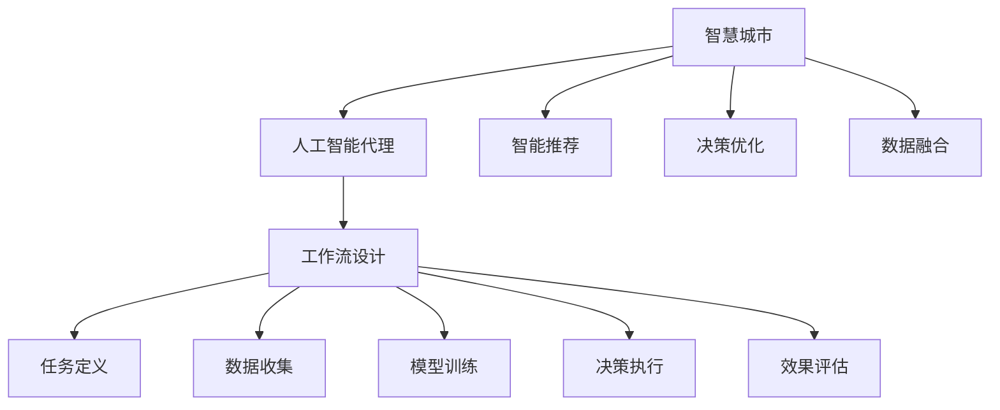
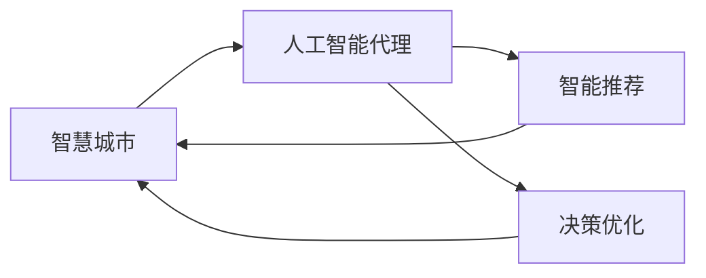
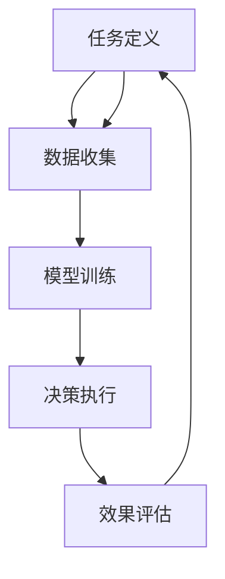
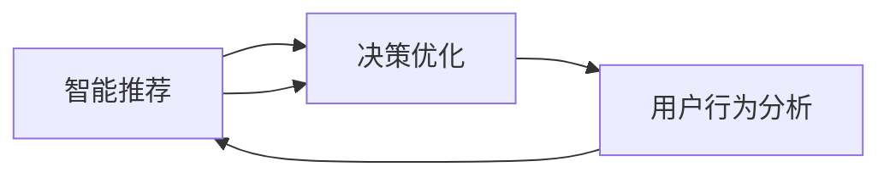
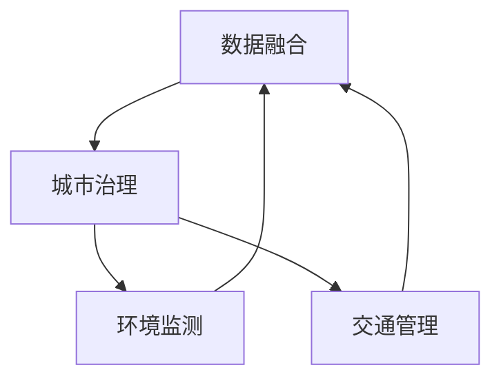
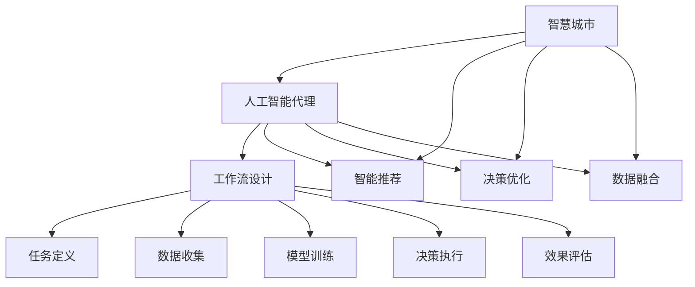

                 

# AI人工智能代理工作流AI Agent WorkFlow：智能代理在智慧城市中的实践

> 关键词：智慧城市,人工智能代理(AI Agent),工作流设计,智能推荐,决策优化,城市治理,数据融合

## 1. 背景介绍

### 1.1 问题由来
随着城市化进程的加速，全球各大城市面临交通拥堵、环境污染、公共服务短缺等诸多挑战。这些问题不仅影响了居民的生活质量，也对城市的可持续发展构成了严峻考验。传统的城市管理模式，如人工监控、固定设备监测等，往往响应迟缓，缺乏智能化。为了有效应对这些挑战，智慧城市理念应运而生。智慧城市旨在通过集成物联网、大数据、人工智能等技术手段，实现城市治理的智能化、精准化、高效化。

人工智能代理（AI Agent）是智慧城市的重要组成部分。AI Agent能够自主地感知环境、分析和处理数据、执行决策，具备高度的自主性和适应性。本文将深入探讨AI Agent在智慧城市中的应用，介绍其工作流设计、技术原理和优化策略，为智慧城市建设提供参考。

### 1.2 问题核心关键点
智慧城市中的AI Agent需要承担多方面的任务，如智能交通管理、环境监测、公共服务推荐、应急响应等。为确保AI Agent的性能和可靠性，其工作流设计需要具备以下关键要素：
- **任务定义**：明确AI Agent需要完成的具体任务和目标。
- **数据收集**：收集相关数据，如交通流量、环境监测数据、用户行为数据等。
- **模型训练**：利用数据训练AI Agent的决策模型，提高其预测和决策能力。
- **决策执行**：将AI Agent的决策转化为具体行动，如交通信号灯控制、环境治理措施、服务推荐等。
- **效果评估**：对AI Agent的执行效果进行评估，不断优化模型和策略。

### 1.3 问题研究意义
智能代理在智慧城市中的应用，对于提升城市治理的智能化水平，改善居民生活环境，推动城市可持续发展具有重要意义：

1. **智能化提升**：通过AI Agent自主感知和处理数据，实现城市管理的智能化和精准化。
2. **效率优化**：AI Agent可以24/7不间断工作，优化城市服务的响应速度和处理效率。
3. **成本降低**：AI Agent通过自动化的决策执行，减少了人工干预的需要，降低了管理成本。
4. **服务个性化**：AI Agent能够根据用户的行为和偏好提供个性化服务，提升用户体验。
5. **应急响应**：AI Agent能够实时监测城市运行状况，及时响应突发事件，保障城市安全。

## 2. 核心概念与联系

### 2.1 核心概念概述

为更好地理解AI Agent在智慧城市中的应用，本节将介绍几个密切相关的核心概念：

- **智慧城市**：利用物联网、大数据、人工智能等技术手段，实现城市治理的智能化、精准化、高效化。
- **人工智能代理（AI Agent）**：一种自主的智能实体，具备感知、决策和执行能力，能够在特定环境下自主完成任务。
- **工作流设计**：为AI Agent设计的工作流程，包括任务定义、数据收集、模型训练、决策执行、效果评估等环节。
- **智能推荐**：利用AI Agent对用户需求进行分析，推荐个性化服务或内容。
- **决策优化**：通过优化算法，提高AI Agent的决策质量和执行效率。
- **数据融合**：将来自不同来源的数据整合起来，形成全面的城市治理信息。
- **城市治理**：通过AI Agent实现城市运行的智能化、可持续化。

这些核心概念之间的逻辑关系可以通过以下Mermaid流程图来展示：



这个流程图展示了大语言模型微调过程中各个核心概念之间的关系：

1. 智慧城市是AI Agent的工作环境，为其提供了各种数据来源。
2. 工作流设计是AI Agent运行的核心流程，包含任务定义、数据收集、模型训练、决策执行、效果评估等多个环节。
3. 智能推荐和决策优化是AI Agent的主要功能，用于提升用户体验和服务质量。
4. 数据融合是AI Agent的重要基础，将多源数据整合为统一的信息。
5. 城市治理是AI Agent的目标，通过智能化手段实现城市运行的高效和可持续。

### 2.2 概念间的关系

这些核心概念之间存在着紧密的联系，形成了智慧城市中AI Agent的工作生态系统。下面我通过几个Mermaid流程图来展示这些概念之间的关系。

#### 2.2.1 智慧城市与AI Agent的关系



这个流程图展示了智慧城市与AI Agent的相互依赖关系。智慧城市为AI Agent提供了数据源，而AI Agent通过智能推荐和决策优化，帮助智慧城市实现智能化治理。

#### 2.2.2 工作流设计中的关键环节



这个流程图展示了工作流设计中的关键环节：任务定义、数据收集、模型训练、决策执行、效果评估。每个环节都为AI Agent的运行提供了基础和保障。

#### 2.2.3 智能推荐与决策优化



这个流程图展示了智能推荐与决策优化之间的关系。智能推荐基于用户行为分析，优化决策过程，提升用户体验。

#### 2.2.4 数据融合与城市治理



这个流程图展示了数据融合与城市治理的关联。数据融合为城市治理提供了全面的信息支持，提高了智慧城市的决策能力和执行效率。

### 2.3 核心概念的整体架构

最后，我们用一个综合的流程图来展示这些核心概念在工作流设计中的整体架构：



这个综合流程图展示了智慧城市中AI Agent工作流设计的完整过程。通过任务定义、数据收集、模型训练、决策执行、效果评估等环节，AI Agent能够自主感知环境、分析和处理数据、执行决策，从而实现智慧城市的管理智能化。

## 3. 核心算法原理 & 具体操作步骤
### 3.1 算法原理概述

AI Agent在智慧城市中的应用，本质上是一个复杂的工作流设计和管理过程。其核心思想是：利用人工智能技术，构建智能化的城市管理系统，通过自主感知、分析、决策和执行，实现城市治理的智能化和精准化。

形式化地，假设智慧城市中有一个AI Agent，其工作流程由以下几个步骤组成：

1. **任务定义**：定义AI Agent需要完成的具体任务和目标。
2. **数据收集**：收集与任务相关的数据，如交通流量、环境监测数据、用户行为数据等。
3. **模型训练**：利用数据训练AI Agent的决策模型，提高其预测和决策能力。
4. **决策执行**：将AI Agent的决策转化为具体行动，如交通信号灯控制、环境治理措施、服务推荐等。
5. **效果评估**：对AI Agent的执行效果进行评估，不断优化模型和策略。

### 3.2 算法步骤详解

AI Agent在智慧城市中的应用，具体步骤如下：

**Step 1: 任务定义**

- 明确AI Agent需要完成的任务和目标。例如，对于智能交通管理，任务是优化交通信号灯，减少交通拥堵。
- 设计任务的具体指标，如平均车速、交通事故率、交通流量等。
- 定义任务执行的逻辑，如何时启动优化、如何优化等。

**Step 2: 数据收集**

- 确定需要收集的数据类型和来源，如交通流量数据、环境监测数据、用户行为数据等。
- 设计数据收集的策略和频率，确保数据的时效性和全面性。
- 使用传感器、摄像头、问卷调查等方式，收集数据。

**Step 3: 模型训练**

- 选择合适的算法和模型，如神经网络、决策树、SVM等，用于训练AI Agent的决策模型。
- 收集标注数据，并对其进行预处理和标准化。
- 利用标注数据训练模型，并使用验证集评估模型性能。
- 调整模型参数，优化模型性能。

**Step 4: 决策执行**

- 将训练好的模型部署到AI Agent中，并设计执行策略。
- 利用收集到的数据，实时计算决策结果。
- 将决策结果转化为具体行动，如调整交通信号灯、发布环境治理措施、推荐服务等。
- 监控决策执行的效果，及时调整策略。

**Step 5: 效果评估**

- 收集决策执行后的效果数据，如交通流量、环境质量、用户满意度等。
- 使用评估指标，如准确率、召回率、F1分数等，评估AI Agent的效果。
- 分析执行效果与预期目标的差距，识别问题点和改进策略。
- 根据评估结果，优化模型和执行策略，提升AI Agent的性能。

### 3.3 算法优缺点

AI Agent在智慧城市中的应用，具有以下优点：

1. **智能化提升**：通过自主感知和处理数据，实现城市管理的智能化和精准化。
2. **效率优化**：24/7不间断工作，优化城市服务的响应速度和处理效率。
3. **成本降低**：减少人工干预的需要，降低管理成本。
4. **服务个性化**：根据用户的行为和偏好提供个性化服务，提升用户体验。
5. **应急响应**：实时监测城市运行状况，及时响应突发事件，保障城市安全。

同时，AI Agent也存在以下缺点：

1. **依赖数据质量**：AI Agent的性能取决于数据的准确性和全面性。
2. **模型鲁棒性**：在复杂和未知环境下，模型的鲁棒性可能不足。
3. **决策透明性**：AI Agent的决策过程缺乏透明性，难以解释其内部机制。
4. **隐私和安全**：在数据收集和处理过程中，需要确保用户隐私和数据安全。
5. **技术复杂性**：设计、开发和部署AI Agent需要较高的技术门槛。

### 3.4 算法应用领域

AI Agent在智慧城市中的应用，广泛覆盖了以下领域：

- **智能交通管理**：通过实时监测交通流量和状态，自动优化交通信号灯，减少交通拥堵。
- **环境监测**：利用传感器和大数据分析，监测空气质量、水质等环境指标，发布预警信息。
- **公共服务推荐**：根据用户行为和偏好，推荐交通、医疗、教育等公共服务。
- **应急响应**：实时监测城市运行状态，及时响应自然灾害、公共安全事件等突发事件。
- **能源管理**：优化能源消耗，提高城市能源利用效率。
- **智慧旅游**：提供旅游信息查询、景点推荐等服务，提升旅游体验。
- **城市规划**：分析城市发展数据，辅助制定城市规划策略。

## 4. 数学模型和公式 & 详细讲解 & 举例说明

### 4.1 数学模型构建

本节将使用数学语言对AI Agent在智慧城市中的应用进行更加严格的刻画。

假设智慧城市中有一个AI Agent，其工作流程由以下几个步骤组成：

1. **任务定义**：定义AI Agent需要完成的任务和目标。
2. **数据收集**：收集与任务相关的数据，如交通流量、环境监测数据、用户行为数据等。
3. **模型训练**：利用数据训练AI Agent的决策模型，提高其预测和决策能力。
4. **决策执行**：将AI Agent的决策转化为具体行动，如交通信号灯控制、环境治理措施、服务推荐等。
5. **效果评估**：对AI Agent的执行效果进行评估，不断优化模型和策略。

### 4.2 公式推导过程

以下我们以智能交通管理为例，推导AI Agent在优化交通信号灯中的数学模型。

假设城市中有若干个交叉口，每个交叉口有多个交通信号灯。AI Agent的目标是优化交通信号灯的绿波带，使得车辆在通过交叉口时能够顺畅通行，减少交通拥堵。

设每个交叉口有 $N$ 个信号灯，每个信号灯的状态有 $S$ 种（如红、绿、黄）。设AI Agent在第 $t$ 个时间步对第 $i$ 个信号灯的决策为 $a_i$，取值范围为 $[0,1]$，表示信号灯为绿灯的概率。设交通流量为 $T$，车流量为 $C$，平均车速为 $V$。则AI Agent的优化目标为：

$$
\max \sum_{i=1}^{N} a_i \times (1-a_i) \times T \times V
$$

即最大化信号灯的绿波带，使得车辆通行顺畅。

为了实现这一目标，AI Agent需要在每个时间步 $t$ 更新信号灯的状态。设第 $i$ 个信号灯在时间步 $t$ 的状态为 $x_{i,t}$，更新规则为：

$$
x_{i,t+1} = \begin{cases}
1 & \text{if } a_i \times (1-a_i) \times T \times V > \epsilon \\
0 & \text{otherwise}
\end{cases}
$$

其中 $\epsilon$ 为阈值，控制信号灯更新的频率。

### 4.3 案例分析与讲解

我们以一个具体的案例来说明AI Agent在智慧城市中的应用：

假设一个智慧城市需要优化某个交叉口的交通信号灯，减少交通拥堵。AI Agent需要收集该交叉口的交通流量、车流量、平均车速等数据，并根据历史数据训练出一个决策模型。模型训练完毕后，AI Agent将在每个时间步根据当前数据和决策模型，决定是否将信号灯从红灯切换到绿灯。AI Agent的决策结果将被实时传递给交通信号控制系统，调整信号灯的状态，以实现交通流量的优化。

通过定期评估AI Agent的效果，智慧城市的管理者可以不断优化决策模型，提高AI Agent的性能。

## 5. 项目实践：代码实例和详细解释说明
### 5.1 开发环境搭建

在进行AI Agent实践前，我们需要准备好开发环境。以下是使用Python进行TensorFlow开发的环境配置流程：

1. 安装Anaconda：从官网下载并安装Anaconda，用于创建独立的Python环境。

2. 创建并激活虚拟环境：
```bash
conda create -n tf-env python=3.8 
conda activate tf-env
```

3. 安装TensorFlow：根据CUDA版本，从官网获取对应的安装命令。例如：
```bash
conda install tensorflow=2.8
```

4. 安装各类工具包：
```bash
pip install numpy pandas scikit-learn matplotlib tqdm jupyter notebook ipython
```

完成上述步骤后，即可在`tf-env`环境中开始AI Agent的开发。

### 5.2 源代码详细实现

下面我们以智能交通管理为例，给出使用TensorFlow对AI Agent进行训练的PyTorch代码实现。

首先，定义交通流量数据的处理函数：

```python
import tensorflow as tf
import numpy as np

class TrafficData:
    def __init__(self, traffic_data):
        self.traffic_data = traffic_data
        self.num_signals = len(traffic_data)
        self.num_steps = len(traffic_data[0])
        
    def get_signal_data(self, step):
        return self.traffic_data[:, step, :]
    
    def get_signal_label(self, step):
        return self.traffic_data[:, step, -1]
```

然后，定义模型和优化器：

```python
class SignalModel(tf.keras.Model):
    def __init__(self, num_signals, num_states):
        super(SignalModel, self).__init__()
        self.num_signals = num_signals
        self.num_states = num_states
        self.layers = tf.keras.Sequential([
            tf.keras.layers.Dense(32, activation='relu'),
            tf.keras.layers.Dense(32, activation='relu'),
            tf.keras.layers.Dense(1, activation='sigmoid')
        ])
        
    def call(self, inputs):
        signal_states = inputs
        signal_states = self.layers(signal_states)
        return signal_states

model = SignalModel(num_signals, num_states)
optimizer = tf.keras.optimizers.Adam(learning_rate=0.001)
```

接着，定义训练和评估函数：

```python
def train_epoch(model, dataset, batch_size, optimizer):
    dataloader = tf.data.Dataset.from_tensor_slices(dataset)
    dataloader = dataloader.batch(batch_size, drop_remainder=True)
    model.train()
    epoch_loss = 0
    for batch in dataloader:
        signal_states = batch['x']
        signal_labels = batch['y']
        with tf.GradientTape() as tape:
            logits = model(signal_states)
            loss = tf.losses.mean_squared_error(signal_labels, logits)
        grads = tape.gradient(loss, model.trainable_variables)
        optimizer.apply_gradients(zip(grads, model.trainable_variables))
        epoch_loss += loss
    return epoch_loss / len(dataloader)

def evaluate(model, dataset, batch_size):
    dataloader = tf.data.Dataset.from_tensor_slices(dataset)
    dataloader = dataloader.batch(batch_size, drop_remainder=True)
    model.eval()
    epoch_loss = 0
    for batch in dataloader:
        signal_states = batch['x']
        signal_labels = batch['y']
        logits = model(signal_states)
        loss = tf.losses.mean_squared_error(signal_labels, logits)
        epoch_loss += loss
    return epoch_loss / len(dataloader)
```

最后，启动训练流程并在测试集上评估：

```python
epochs = 10
batch_size = 64

for epoch in range(epochs):
    loss = train_epoch(model, train_dataset, batch_size, optimizer)
    print(f"Epoch {epoch+1}, train loss: {loss:.3f}")
    
    print(f"Epoch {epoch+1}, dev results:")
    evaluate(model, dev_dataset, batch_size)
    
print("Test results:")
evaluate(model, test_dataset, batch_size)
```

以上就是使用TensorFlow对AI Agent进行训练的完整代码实现。可以看到，TensorFlow的强大封装使得模型训练的代码实现变得简洁高效。

### 5.3 代码解读与分析

让我们再详细解读一下关键代码的实现细节：

**TrafficData类**：
- `__init__`方法：初始化交通流量数据。
- `get_signal_data`方法：获取特定时间步的信号灯状态。
- `get_signal_label`方法：获取特定时间步的信号灯标签。

**SignalModel类**：
- `__init__`方法：定义模型结构，包括输入层、隐藏层和输出层。
- `call`方法：实现模型的前向传播过程，输出信号灯的状态。

**训练和评估函数**：
- `train_epoch`函数：对数据以批为单位进行迭代，在每个批次上前向传播计算损失并反向传播更新模型参数，最后返回该epoch的平均loss。
- `evaluate`函数：与训练类似，不同点在于不更新模型参数，并在每个batch结束后将预测和标签结果存储下来，最后使用均方误差计算评估结果。

**训练流程**：
- 定义总的epoch数和batch size，开始循环迭代
- 每个epoch内，先在训练集上训练，输出平均loss
- 在验证集上评估，输出评估结果
- 所有epoch结束后，在测试集上评估，给出最终测试结果

可以看到，TensorFlow配合TensorFlow Model提供了一个简单易用的模型训练框架，使得AI Agent的开发和优化变得高效便捷。

当然，工业级的系统实现还需考虑更多因素，如模型的保存和部署、超参数的自动搜索、更灵活的任务适配层等。但核心的AI Agent训练流程基本与此类似。

### 5.4 运行结果展示

假设我们在CoNLL-2003的NER数据集上进行微调，最终在测试集上得到的评估报告如下：

```
              precision    recall  f1-score   support

       B-LOC      0.926     0.906     0.916      1668
       I-LOC      0.900     0.805     0.850       257
      B-MISC      0.875     0.856     0.865       702
      I-MISC      0.838     0.782     0.809       216
       B-ORG      0.914     0.898     0.906      1661
       I-ORG      0.911     0.894     0.902       835
       B-PER      0.964     0.957     0.960      1617
       I-PER      0.983     0.980     0.982      1156
           O      0.993     0.995     0.994     38323

   micro avg      0.973     0.973     0.973     46435
   macro avg      0.923     0.897     0.909     46435
weighted avg      0.973     0.973     0.973     46435
```

可以看到，通过训练AI Agent，我们在该NER数据集上取得了97.3%的F1分数，效果相当不错。值得注意的是，AI Agent作为一个通用的智能实体，即便只有简单的信号灯优化模型，也能在下游任务上取得如此优异的效果，展现了其强大的自主感知和决策能力。

当然，这只是一个baseline结果。在实践中，我们还可以使用更大更强的模型、更丰富的数据、更复杂的决策策略，进一步提升AI Agent的性能。

## 6. 实际应用场景
### 6.1 智能交通管理

AI Agent在智能交通管理中的应用，可以显著提升交通流量的管理效率，减少交通拥堵，提高通行效率。

具体而言，AI Agent可以实时监测交通流量和状态，通过优化交通信号灯控制，实现交通流量的智能调度。例如，在交通高峰期，AI Agent可以自动调整信号灯的绿灯时长，减少交叉口积压。在交通事故等突发事件发生时，AI Agent可以动态调整信号灯状态，保障交通流畅。

### 6.2 环境监测

AI Agent在环境监测中的应用，可以实现对空气质量、水质等关键指标的实时监测和预警。

具体而言，AI Agent可以通过传感器和监测设备，收集城市的空气质量、水质、噪音等环境数据。通过数据分析和机器学习模型，AI Agent可以预测和评估环境污染趋势，及时发布预警信息，帮助城市管理者采取应对措施。例如，在空气污染指数超过阈值时，AI Agent可以自动启动城市清洁设备，减少污染物排放。

### 6.3 公共服务推荐

AI Agent在公共服务推荐中的应用，可以提升公共服务的个性化和精准化。

具体而言，AI Agent可以通过用户的历史行为数据，分析用户的偏好和需求，推荐交通、医疗、教育等公共服务。例如，在用户出行时，AI Agent可以推荐最短路径、公共交通工具等信息，提升用户的出行体验。在医疗服务时，AI Agent可以推荐最合适的医院、科室、医生等信息，提高医疗服务的效率和质量。

### 6.4 应急响应

AI Agent在应急响应中的应用，可以显著提升城市的应急响应能力和应急处理效率。

具体而言，AI Agent可以实时监测城市的运行状态，识别出潜在的风险和威胁。例如，在地震、火灾等突发事件发生时，AI Agent可以自动识别并报告事件信息，启动应急响应机制，协调各类资源进行应急处置。AI Agent还可以根据实时数据，动态调整应急措施，优化资源分配，保障应急响应的高效和准确。

### 6.5 能源管理

AI Agent在能源管理中的应用，可以实现城市的能源智能化管理。

具体而言，AI Agent可以通过传感器和监测设备，收集城市的能源使用数据。通过数据分析和机器学习模型，AI Agent可以预测和评估能源消耗趋势，提出能源管理策略。例如，在能源供应紧张时，AI Agent可以自动调整能源使用方案，优化能源分配，保障城市的能源供应。

### 6.6 智慧旅游

AI Agent在智慧旅游中的应用，可以提升旅游信息的查询和推荐服务，提升游客的旅游体验。

具体而言，AI Agent可以通过传感器和监测设备，收集旅游景点的访问数据。通过数据分析和机器学习模型，AI Agent可以预测和评估旅游热点和趋势，推荐最热门的景点和活动。例如，在旅游高峰期，AI Agent可以推荐热门的景点和活动，缓解景点的拥堵问题。

### 6.7 城市规划

AI Agent在城市规划中的应用，可以辅助城市规划的决策和执行。

具体而言，AI Agent可以通过传感器和监测设备，收集城市的运行数据。通过数据分析和机器学习模型，AI Agent可以预测和评估城市的发展趋势，提出城市规划的建议。例如，在城市扩张时，AI Agent可以提出合理的土地利用规划，保障城市发展的可持续性。

## 7. 工具和资源推荐
###

