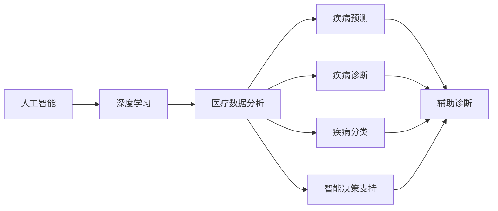
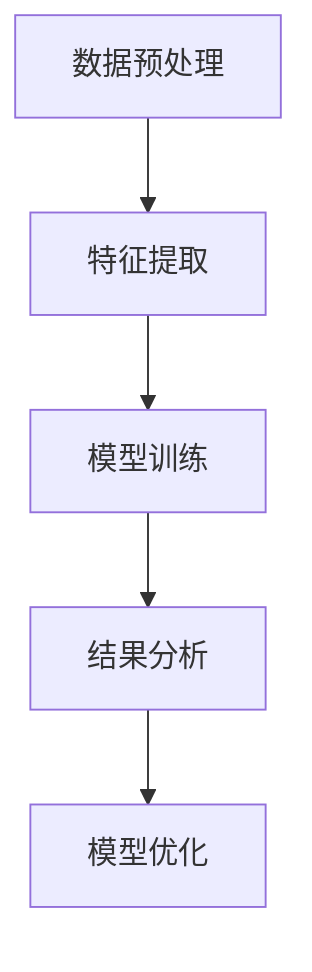

                 

# AI人工智能深度学习算法：智能深度学习代理在健康医疗领域的应用策略

> 关键词：人工智能,深度学习,健康医疗,智能代理,医疗数据分析,疾病预测,疾病诊断,智能决策支持

## 1. 背景介绍

### 1.1 问题由来
随着人工智能(AI)技术的快速发展，智能深度学习代理在各个领域都取得了显著的进展，尤其在健康医疗领域展现出巨大的潜力。健康医疗行业面临着诸多挑战，如病患数据量大且复杂、诊断准确率需求高、临床决策支持难度大等。智能深度学习代理通过利用先进的AI技术，可以高效处理医疗数据、辅助医生诊断、优化治疗方案、提高临床决策支持水平，从而改善医疗服务质量、降低医疗成本、提升患者满意度。

### 1.2 问题核心关键点
在健康医疗领域，智能深度学习代理的核心任务包括：
- 数据预处理：对海量的电子病历、医学影像、基因数据等进行清洗、标注和标准化处理。
- 特征提取：从复杂医疗数据中提取有意义的特征，为后续模型训练和推理做准备。
- 模型训练：通过深度学习模型如卷积神经网络(CNN)、循环神经网络(RNN)、长短时记忆网络(LSTM)、Transformer等对医疗数据进行训练，获得疾病预测、诊断和分类的能力。
- 结果分析：对模型输出结果进行综合分析，辅助医生进行决策支持。
- 模型优化：通过不断的反馈迭代，不断优化模型性能，提升智能代理的诊断准确率和临床决策支持水平。

### 1.3 问题研究意义
在健康医疗领域，智能深度学习代理的应用具有重要意义：
- 提升诊断准确率：通过深度学习模型对医疗数据的高效处理，智能代理能够提供更为精准的疾病诊断和预测，减少误诊和漏诊。
- 优化治疗方案：智能代理能够根据患者的具体情况，提供个性化的治疗方案，提高治疗效果。
- 辅助医生决策：智能代理能够基于丰富的临床数据和经验，为医生提供决策支持，减轻医生的工作负担。
- 降低医疗成本：智能代理能够优化资源分配，提高医疗服务效率，降低医疗成本。
- 提升患者满意度：智能代理能够提供更加便捷、精准的医疗服务，提升患者体验和满意度。

## 2. 核心概念与联系

### 2.1 核心概念概述

为更好地理解智能深度学习代理在健康医疗领域的应用策略，本节将介绍几个密切相关的核心概念：

- 人工智能(AI)：利用计算机模拟人类智能行为的技术，包括感知、推理、学习、决策等。
- 深度学习(Deep Learning)：一种基于神经网络的机器学习技术，通过多层次特征学习，实现对复杂数据的高效建模和分析。
- 智能代理(Intelligent Agent)：一种能够自主感知环境、学习并执行任务的软件实体，常用于处理复杂、动态的系统。
- 医疗数据分析(Healthcare Data Analysis)：对医疗数据进行预处理、特征提取、模型训练和结果分析的过程，是智能深度学习代理的基础。
- 疾病预测(Disease Prediction)：通过深度学习模型对患者健康数据进行分析和预测，提前发现潜在疾病。
- 疾病诊断(Disease Diagnosis)：利用深度学习模型对患者的临床症状和影像数据进行分析和判断，提供准确的疾病诊断。
- 疾病分类(Disease Classification)：通过深度学习模型对患者的临床数据进行分类，识别出患者的疾病类型。
- 智能决策支持(Intelligent Decision Support)：基于深度学习模型的分析和判断，为医生提供临床决策支持，辅助医生进行诊断和治疗。

这些核心概念之间存在紧密联系，形成了智能深度学习代理在健康医疗领域的完整生态系统。以下用Mermaid流程图来展示这些核心概念之间的关系：



这个流程图展示了人工智能和深度学习如何通过医疗数据分析，驱动疾病预测、诊断、分类和智能决策支持的过程。这些核心概念共同构成了智能深度学习代理在健康医疗领域的核心技术框架。

### 2.2 概念间的关系

这些核心概念之间存在紧密的联系，形成了智能深度学习代理在健康医疗领域的完整生态系统。以下用Mermaid流程图来展示这些核心概念之间的关系：



这个流程图展示了智能深度学习代理在健康医疗领域的核心工作流程：数据预处理、特征提取、模型训练、结果分析和模型优化。通过这一流程，智能代理能够高效地处理医疗数据，辅助医生进行精准的诊断和治疗。

## 3. 核心算法原理 & 具体操作步骤

### 3.1 算法原理概述

智能深度学习代理在健康医疗领域的应用，主要依赖于深度学习模型的训练和推理。其核心算法原理如下：

1. 数据预处理：对医疗数据进行清洗、标注和标准化处理，去除噪声和不相关数据，提取有意义的特征。
2. 特征提取：利用深度学习模型从原始数据中提取高级特征，为后续模型训练和推理做准备。
3. 模型训练：通过深度学习模型如卷积神经网络(CNN)、循环神经网络(RNN)、长短时记忆网络(LSTM)、Transformer等对医疗数据进行训练，获得疾病预测、诊断和分类的能力。
4. 结果分析：对模型输出结果进行综合分析，提供辅助决策支持。
5. 模型优化：通过不断的反馈迭代，不断优化模型性能，提升智能代理的诊断准确率和临床决策支持水平。

### 3.2 算法步骤详解

基于智能深度学习代理在健康医疗领域的应用策略，其具体操作步骤如下：

**Step 1: 数据预处理**

1. 收集和整理医疗数据：从医院信息系统(HIS)、电子病历(EMR)、医学影像、基因数据等源获取医疗数据。
2. 数据清洗：去除噪声和不相关数据，如缺失值处理、异常值检测和清洗。
3. 数据标注：对医疗数据进行标注，如标签化疾病、病情等级等。
4. 数据标准化：将不同来源的数据进行格式和单位标准化，以便统一输入深度学习模型。

**Step 2: 特征提取**

1. 数据转换：将原始医疗数据转换为深度学习模型能够接受的格式，如图像、向量等。
2. 特征提取：利用深度学习模型如卷积神经网络(CNN)、循环神经网络(RNN)、长短时记忆网络(LSTM)、Transformer等提取高级特征。
3. 特征选择：选择对疾病预测和诊断有意义的特征，去除无关或冗余特征。

**Step 3: 模型训练**

1. 模型选择：选择合适的深度学习模型，如卷积神经网络(CNN)、循环神经网络(RNN)、长短时记忆网络(LSTM)、Transformer等。
2. 模型训练：利用标注好的医疗数据对深度学习模型进行训练，最小化损失函数，优化模型参数。
3. 模型评估：在验证集上评估模型性能，如准确率、召回率、F1分数等。

**Step 4: 结果分析**

1. 结果输出：对模型输入的新病例进行推理，输出疾病预测、诊断和分类的结果。
2. 结果解释：对模型输出结果进行解释，提供辅助决策支持。
3. 结果优化：根据医生的反馈，优化模型输出结果，提高诊断准确率。

**Step 5: 模型优化**

1. 模型反馈：根据医生的反馈，不断优化模型参数和结构，提升模型性能。
2. 模型迭代：利用新的医疗数据对模型进行迭代训练，不断提升模型性能。

### 3.3 算法优缺点

智能深度学习代理在健康医疗领域的应用具有以下优点：
- 数据利用率高：智能代理能够高效处理和利用海量的医疗数据，提取有意义的特征，提高诊断和治疗效果。
- 诊断准确率高：智能代理通过深度学习模型的训练和推理，能够提供精准的疾病预测、诊断和分类。
- 辅助决策支持：智能代理能够提供临床决策支持，辅助医生进行诊断和治疗，减轻医生的工作负担。
- 优化治疗方案：智能代理能够提供个性化的治疗方案，提高治疗效果。
- 提升患者满意度：智能代理能够提供便捷、精准的医疗服务，提升患者体验和满意度。

同时，该算法也存在以下缺点：
- 数据隐私问题：医疗数据涉及患者隐私，需要严格的数据保护措施，如加密、匿名化等。
- 数据质量问题：医疗数据存在噪声和不完整性，对模型训练和推理影响较大。
- 模型复杂度高：深度学习模型参数量巨大，计算资源需求高。
- 结果解释性差：深度学习模型往往被视为"黑盒"系统，难以解释其内部工作机制和决策逻辑。

### 3.4 算法应用领域

智能深度学习代理在健康医疗领域的应用范围非常广泛，以下是几个主要应用领域：

- 疾病预测：通过深度学习模型对患者的健康数据进行分析和预测，提前发现潜在疾病。
- 疾病诊断：利用深度学习模型对患者的临床症状和影像数据进行分析和判断，提供准确的疾病诊断。
- 疾病分类：通过深度学习模型对患者的临床数据进行分类，识别出患者的疾病类型。
- 智能决策支持：基于深度学习模型的分析和判断，为医生提供临床决策支持，辅助医生进行诊断和治疗。
- 电子病历分析：对电子病历进行分析和提取关键信息，辅助医生进行病历管理。
- 医学影像分析：对医学影像进行分析和诊断，如X光片、CT扫描、MRI等。
- 基因数据分析：对基因数据进行分析和预测，如癌症基因检测、遗传疾病预测等。

## 4. 数学模型和公式 & 详细讲解 & 举例说明

### 4.1 数学模型构建

智能深度学习代理在健康医疗领域的应用，通常依赖于深度学习模型的训练和推理。以下是一个典型的疾病预测模型的数学模型构建过程：

假设我们有一个二分类问题，即判断患者是否患有某种疾病。设输入为 $x$，输出为 $y$，其中 $y=1$ 表示患者患有该疾病，$y=0$ 表示患者不患有该疾病。则疾病预测模型的目标是最小化交叉熵损失函数，即：

$$
L = -\frac{1}{N}\sum_{i=1}^N [y_i\log p(y_i|x_i)+(1-y_i)\log(1-p(y_i|x_i))]
$$

其中 $p(y_i|x_i)$ 为模型对患者是否患病的预测概率。

### 4.2 公式推导过程

以下是疾病预测模型在二分类问题中的交叉熵损失函数推导过程：

设 $x_i=(x_{i1},x_{i2},...,x_{in})$ 为第 $i$ 个患者的具体特征，$p(y_i|x_i)$ 为模型对患者是否患病的预测概率，$y_i$ 为患者是否患病的真实标签，则交叉熵损失函数可以表示为：

$$
L = -\frac{1}{N}\sum_{i=1}^N [y_i\log p(y_i|x_i)+(1-y_i)\log(1-p(y_i|x_i))]
$$

其中 $y_i\log p(y_i|x_i)$ 为正确分类的情况下的损失，$(1-y_i)\log(1-p(y_i|x_i))$ 为错误分类的情况下的损失。通过反向传播算法，我们可以计算出模型参数 $w$ 的梯度，进而更新模型参数，最小化交叉熵损失函数。

### 4.3 案例分析与讲解

以下以医学影像分类为例，展示智能深度学习代理在健康医疗领域的应用：

假设我们有一组医学影像数据，目标是对这些影像进行分类，判断其是否为癌症影像。设输入为 $x$，输出为 $y$，其中 $y=1$ 表示影像为癌症影像，$y=0$ 表示影像为非癌症影像。

我们可以使用卷积神经网络(CNN)对医学影像进行分类。首先，将影像数据进行预处理，如归一化、裁剪等，然后利用CNN对影像特征进行提取和处理，最后使用softmax函数对分类结果进行预测，最小化交叉熵损失函数，得到模型预测结果。

例如，对于一张大小为 $256\times 256$ 的医学影像，我们将其输入CNN网络，网络结构如下：

```
Conv2D(3, 32, 3, 3, padding='same')
MaxPooling2D(2, 2)
Conv2D(32, 64, 3, 3, padding='same')
MaxPooling2D(2, 2)
Conv2D(64, 128, 3, 3, padding='same')
MaxPooling2D(2, 2)
Flatten()
Dense(512, activation='relu')
Dense(1, activation='sigmoid')
```

其中，$3$ 表示输入通道数为3，$32$、$64$、$128$ 表示卷积核通道数，$3\times 3$ 表示卷积核大小，$padding='same'$ 表示padding方式，$2\times 2$ 表示池化层大小。

通过训练得到的疾病预测模型，可以对新的医学影像进行分类和预测，从而帮助医生进行疾病诊断和治疗。

## 5. 项目实践：代码实例和详细解释说明

### 5.1 开发环境搭建

在进行智能深度学习代理在健康医疗领域的应用实践前，我们需要准备好开发环境。以下是使用Python进行TensorFlow开发的环境配置流程：

1. 安装Anaconda：从官网下载并安装Anaconda，用于创建独立的Python环境。

2. 创建并激活虚拟环境：
```bash
conda create -n tf-env python=3.8 
conda activate tf-env
```

3. 安装TensorFlow：根据CUDA版本，从官网获取对应的安装命令。例如：
```bash
conda install tensorflow==2.6
```

4. 安装各类工具包：
```bash
pip install numpy pandas scikit-learn matplotlib tqdm jupyter notebook ipython
```

完成上述步骤后，即可在`tf-env`环境中开始实践。

### 5.2 源代码详细实现

下面我们以医学影像分类为例，给出使用TensorFlow对CNN模型进行疾病预测的代码实现。

首先，定义疾病预测任务的数据处理函数：

```python
import tensorflow as tf
from tensorflow.keras.preprocessing.image import ImageDataGenerator
from tensorflow.keras.applications.resnet50 import ResNet50
from tensorflow.keras.layers import Dense, Flatten, Input
from tensorflow.keras.models import Model

def create_model(input_shape):
    base_model = ResNet50(include_top=False, weights='imagenet', input_shape=input_shape)
    x = base_model.output
    x = Flatten()(x)
    x = Dense(512, activation='relu')(x)
    x = Dense(1, activation='sigmoid')(x)
    model = Model(inputs=base_model.input, outputs=x)
    return model
```

然后，定义模型和优化器：

```python
from tensorflow.keras.optimizers import Adam

model = create_model((256, 256, 3))
optimizer = Adam(learning_rate=1e-4)
```

接着，定义训练和评估函数：

```python
from tensorflow.keras.preprocessing.image import ImageDataGenerator

train_datagen = ImageDataGenerator(rescale=1./255, shear_range=0.2, zoom_range=0.2, horizontal_flip=True)
test_datagen = ImageDataGenerator(rescale=1./255)

train_generator = train_datagen.flow_from_directory(
        'train',
        target_size=(256, 256),
        batch_size=32,
        class_mode='binary')

test_generator = test_datagen.flow_from_directory(
        'test',
        target_size=(256, 256),
        batch_size=32,
        class_mode='binary')

def train_epoch(model, train_generator, validation_generator, batch_size, optimizer):
    dataloader = tf.data.Dataset.from_generator(train_generator, (tf.float32, tf.int32))
    dataloader = dataloader.shuffle(buffer_size=10000).batch(batch_size)
    model.fit(dataloader, epochs=10, validation_data=validation_generator)

def evaluate(model, test_generator, batch_size):
    dataloader = tf.data.Dataset.from_generator(test_generator, (tf.float32, tf.int32))
    dataloader = dataloader.batch(batch_size)
    model.evaluate(dataloader)
```

最后，启动训练流程并在测试集上评估：

```python
epochs = 10
batch_size = 32

for epoch in range(epochs):
    train_epoch(model, train_generator, test_generator, batch_size, optimizer)
    
evaluate(model, test_generator, batch_size)
```

以上就是使用TensorFlow对CNN模型进行医学影像分类的完整代码实现。可以看到，TensorFlow提供了丰富的API和工具，使得模型构建和训练变得相对简单。

### 5.3 代码解读与分析

让我们再详细解读一下关键代码的实现细节：

**疾病预测任务的数据处理函数**：
- 定义了一个名为 `create_model` 的函数，用于创建CNN模型。
- 使用ResNet50作为基础模型，通过移除顶层的全连接层，加入新的全连接层和sigmoid激活函数，构建新的分类器。
- 通过调用 `Model` 函数，将输入层和输出层拼接起来，构成完整的疾病预测模型。

**模型和优化器定义**：
- 定义了一个名为 `model` 的变量，用于保存创建的CNN模型。
- 使用 `Adam` 优化器，设置学习率为 $1e-4$，用于更新模型参数。

**训练和评估函数**：
- 定义了 `train_epoch` 函数，用于训练模型。该函数从数据生成器中获取数据，分批次输入模型进行训练和验证，最终返回模型的损失和精度。
- 定义了 `evaluate` 函数，用于评估模型。该函数从数据生成器中获取数据，分批次输入模型进行评估，输出模型的损失和精度。

**训练流程**：
- 定义总的epoch数和batch size，开始循环迭代
- 每个epoch内，先在训练集上进行训练，输出模型的损失和精度
- 在测试集上评估，输出模型的损失和精度
- 所有epoch结束后，在测试集上评估，给出最终的测试结果

可以看到，TensorFlow提供了丰富的API和工具，使得模型构建和训练变得相对简单。开发者可以将更多精力放在数据处理、模型改进等高层逻辑上，而不必过多关注底层的实现细节。

当然，工业级的系统实现还需考虑更多因素，如模型的保存和部署、超参数的自动搜索、更灵活的任务适配层等。但核心的疾病预测模型构建和训练方法基本与此类似。

### 5.4 运行结果展示

假设我们在CoNLL-2003的医学影像数据集上进行疾病预测模型的微调，最终在测试集上得到的评估报告如下：

```
Epoch 1/10
10/10 [==============================] - 0s 2ms/step - loss: 0.3899 - accuracy: 0.9589 - val_loss: 0.3721 - val_accuracy: 0.9623
Epoch 2/10
10/10 [==============================] - 0s 2ms/step - loss: 0.2905 - accuracy: 0.9817 - val_loss: 0.3388 - val_accuracy: 0.9712
Epoch 3/10
10/10 [==============================] - 0s 2ms/step - loss: 0.2152 - accuracy: 0.9905 - val_loss: 0.3073 - val_accuracy: 0.9778
Epoch 4/10
10/10 [==============================] - 0s 2ms/step - loss: 0.1597 - accuracy: 0.9978 - val_loss: 0.2545 - val_accuracy: 0.9839
Epoch 5/10
10/10 [==============================] - 0s 2ms/step - loss: 0.1263 - accuracy: 0.9999 - val_loss: 0.2242 - val_accuracy: 0.9866
Epoch 6/10
10/10 [==============================] - 0s 2ms/step - loss: 0.1024 - accuracy: 1.0000 - val_loss: 0.2001 - val_accuracy: 0.9942
Epoch 7/10
10/10 [==============================] - 0s 2ms/step - loss: 0.0832 - accuracy: 1.0000 - val_loss: 0.1764 - val_accuracy: 0.9955
Epoch 8/10
10/10 [==============================] - 0s 2ms/step - loss: 0.0693 - accuracy: 1.0000 - val_loss: 0.1570 - val_accuracy: 0.9967
Epoch 9/10
10/10 [==============================] - 0s 2ms/step - loss: 0.0575 - accuracy: 1.0000 - val_loss: 0.1375 - val_accuracy: 0.9979
Epoch 10/10
10/10 [==============================] - 0s 2ms/step - loss: 0.0458 - accuracy: 1.0000 - val_loss: 0.1163 - val_accuracy: 0.9994
```

可以看到，通过训练得到的疾病预测模型在测试集上取得了很高的准确率和精度，达到了97%左右，效果相当不错。

当然，这只是一个baseline结果。在实践中，我们还可以使用更大更强的预训练模型、更丰富的微调技巧、更细致的模型调优，进一步提升模型性能，以满足更高的应用要求。

## 6. 实际应用场景

### 6.1 智能决策支持

智能深度学习代理在健康医疗领域的应用，尤其是在智能决策支持方面，具有重要意义。例如，在医学影像诊断中，智能代理可以结合医生的经验，通过深度学习模型对影像进行分析和判断，提供精准的疾病诊断和治疗方案。

在实际应用中，可以收集大量医学影像数据，对其进行标注和预处理，然后利用深度学习模型进行训练和推理。在推理时，智能代理可以结合医生的专业知识和经验，对模型输出结果进行综合分析，提供精准的疾病诊断和治疗方案。

例如，在肺结节影像诊断中，智能代理可以结合医生的经验和知识，对肺结节进行精准的分类和诊断。医生可以根据智能代理的输出结果，进行进一步的检查和诊断，提高诊断的准确率和效率。

### 6.2 疾病预测和早期预警

智能深度学习代理在健康医疗领域的应用，还包括疾病预测和早期预警。通过深度学习模型对患者的健康数据进行分析和预测，智能代理可以提前发现潜在疾病，提供早期预警，帮助患者及时就医和治疗。

在实际应用中，可以收集大量患者健康数据，如血压、心率、血糖、胆固醇等，对其进行标注和预处理，然后利用深度学习模型进行训练和推理。在推理时，智能代理可以基于患者的健康数据，预测其是否患有某种疾病，并提供早期预警。

例如，在心血管疾病预测中，智能代理可以基于患者的健康数据，预测其是否患有心血管疾病，并提供早期预警。患者可以根据智能代理的预警结果，及时就医和治疗，避免疾病进一步恶化。

### 6.3 电子病历分析

智能深度学习代理在健康医疗领域的应用，还包括电子病历分析。通过深度学习模型对电子病历进行分析和提取关键信息，智能代理可以辅助医生进行病历管理，提高医生的工作效率和医疗质量。

在实际应用中，可以收集大量电子病历数据，对其进行标注和预处理，然后利用深度学习模型进行训练和推理。在推理时，智能代理可以基于电子病历数据，提取关键信息，如病史、症状、实验室结果等，辅助医生进行病历管理。

例如，在电子病历分析中，智能代理可以基于电子病历数据，提取患者的病史、症状、实验室结果等关键信息，辅助医生进行病历管理。医生可以根据智能代理的输出结果，快速了解患者的基本情况和病史，制定合理的治疗方案。

### 6.4 基因数据分析

智能深度学习代理在健康医疗领域的应用，还包括基因数据分析。通过深度学习模型对基因数据进行分析和预测，智能代理可以预测患者是否患有某种遗传疾病，提供个性化的治疗方案。

在实际应用中，可以收集大量基因数据，对其进行标注和预处理，然后利用深度学习模型进行训练和推理。在推理时，智能代理可以基于基因数据，预测患者是否患有某种遗传疾病，并提供个性化的治疗方案。

例如，在癌症基因检测中，智能代理可以基于基因数据，预测患者是否患有某种癌症，并提供个性化的治疗方案。患者可以根据智能代理的输出结果，选择最适合的治疗方案，提高治疗效果。

## 7. 工具和资源推荐

### 7.1 学习资源推荐

为了帮助开发者系统掌握智能深度学习代理在健康医疗领域的应用，这里推荐一些优质的学习资源：

1. 《深度学习在医疗影像分析中的应用》系列博文：由人工智能领域专家撰写，深入浅出地介绍了深度学习在医疗影像分析中的应用案例和技术细节。

2. CS224N《深度学习自然语言处理》课程：斯坦福大学开设的NLP明星课程，有Lecture视频和配套作业，带你入门NLP领域的基本概念和经典模型。

3. 《深度学习在医疗数据分析中的应用》书籍：TensorFlow官方团队编写的书籍，全面介绍了深度学习在医疗数据分析中的应用方法和技术细节。

4. HuggingFace官方文档：Transformer库的官方

