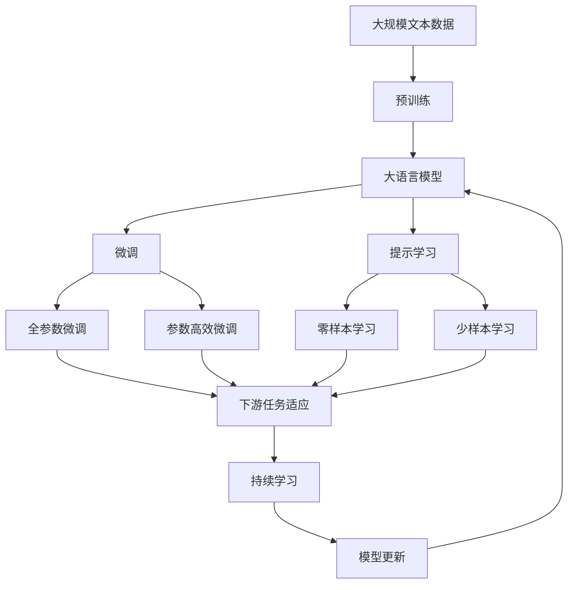

                 

# AI辅助药物发现:加速新药研发进程

> 关键词：AI, 药物发现, 新药研发, 深度学习, 药物分子设计, 蛋白质结构预测, 药效预测, 药物筛选

## 1. 背景介绍

### 1.1 问题由来
药物发现和研发是现代医学和生物技术的重要环节，但传统的药物研发流程繁琐且成本高昂。传统药物发现大致可分为四个阶段：

1. **目标识别**：确定药物的作用靶标，如酶、蛋白质、细胞等。
2. **候选分子筛选**：通过实验筛选出具有一定活性的化合物。
3. **优化**：对筛选出的候选分子进行结构优化和生物活性测试。
4. **临床试验**：在动物实验和人体临床试验中测试药物的安全性和有效性。

这一流程耗时长、成本高，且成功率较低，阻碍了新药的快速上市。近年来，随着人工智能(AI)技术的迅猛发展，AI辅助药物发现成为新药研发的重要方向。通过机器学习和深度学习技术，AI能够在药物发现的不同阶段提供强大支持，大大缩短研发周期，降低成本，提高成功率。

### 1.2 问题核心关键点
AI辅助药物发现的核心理念是通过数据驱动的方法，利用机器学习和大数据分析技术，挖掘药物分子结构和活性的关系，预测药物的生物学效果，辅助药效筛选和优化。AI在药物发现中的应用包括以下几个关键点：

- **目标识别**：通过机器学习模型预测靶标与药物活性的关系，加速靶标识别。
- **药物分子设计**：基于生物信息学和机器学习，设计出具有特定生物活性的新分子。
- **蛋白质结构预测**：利用深度学习技术预测蛋白质与药物分子的结合模式。
- **药效预测**：通过多模态数据融合，预测药物在不同条件下的生物活性。
- **药物筛选**：利用机器学习模型进行大规模虚拟筛选，优化实验设计。

这些技术共同构成了一个高效、低成本的药物发现和研发管道，为医药行业带来了革命性的变革。

### 1.3 问题研究意义
AI辅助药物发现对于现代医药和生物技术的发展具有重要意义：

1. **缩短研发周期**：AI可以加速药物分子筛选和优化，显著缩短从实验室到临床的周期。
2. **降低研发成本**：大规模虚拟筛选可以大幅减少实验次数，降低人力和物力投入。
3. **提高成功率**：AI模型可以综合多种数据，减少试验失败的风险，提高药物研发的效率。
4. **创新药物开发**：AI的参与可以激发新的药物设计和治疗方法，推动医学科学进步。

因此，AI辅助药物发现不仅是医药行业的技术创新，更是关乎全球公共健康的重要手段。

## 2. 核心概念与联系

### 2.1 核心概念概述

为更好地理解AI辅助药物发现，本节将介绍几个密切相关的核心概念：

- **人工智能(AI)**：一种通过算法、数据、计算和模型来模拟人类智能的技术，涵盖机器学习、深度学习、自然语言处理等方向。
- **药物分子设计**：利用化学信息学和计算机模拟，设计新的药物分子，使其具有期望的生物活性和物理化学性质。
- **蛋白质结构预测**：通过深度学习模型预测蛋白质与小分子结合的三维结构，指导药物设计。
- **药效预测**：利用多模态数据融合，预测药物在人体内的生物学效果，如活性、毒副作用等。
- **药物筛选**：通过机器学习模型对大量化合物进行虚拟筛选，快速鉴定出有潜力的候选药物。

这些核心概念之间存在着紧密的联系，形成了AI辅助药物发现的技术框架。下面我们通过几个Mermaid流程图来展示这些概念之间的关系：

```mermaid
graph LR
    A[人工智能(AI)] --> B[药物分子设计]
    A --> C[蛋白质结构预测]
    A --> D[药效预测]
    A --> E[药物筛选]
    B --> C
    B --> D
    B --> E
    C --> D
    C --> E
    D --> E
```

这个流程图展示了AI技术在不同药物发现环节的应用，包括药物分子设计、蛋白质结构预测、药效预测和药物筛选。这些技术相互结合，共同构建了一个全面的药物发现流程。

### 2.2 概念间的关系

这些核心概念之间存在着紧密的联系，形成了AI辅助药物发现的技术框架。下面我们通过几个Mermaid流程图来展示这些概念之间的关系：

#### 2.2.1 AI与药物分子的关系

```mermaid
graph LR
    A[人工智能(AI)] --> B[药物分子设计]
    B --> C[药物分子库]
    B --> D[分子模拟]
    B --> E[药物活性预测]
```

这个流程图展示了AI在药物分子设计中的应用。AI通过分析药物分子库、分子模拟和活性预测数据，指导药物分子的设计，寻找具有期望活性的新分子。

#### 2.2.2 AI与蛋白质结构的关系

```mermaid
graph LR
    A[人工智能(AI)] --> B[蛋白质结构预测]
    B --> C[蛋白质序列]
    B --> D[结构数据]
    B --> E[蛋白质-药物结合模式预测]
```

这个流程图展示了AI在蛋白质结构预测中的应用。AI通过分析蛋白质序列和结构数据，预测蛋白质与药物分子的结合模式，为药物设计提供指导。

#### 2.2.3 AI与药效预测的关系

```mermaid
graph LR
    A[人工智能(AI)] --> B[药效预测]
    B --> C[多模态数据]
    B --> D[模型训练]
    B --> E[药效评估]
```

这个流程图展示了AI在药效预测中的应用。AI通过融合多模态数据（如生物信息学数据、基因表达数据等），训练预测模型，评估药物的生物活性，辅助药物筛选和优化。

#### 2.2.4 AI与药物筛选的关系

```mermaid
graph LR
    A[人工智能(AI)] --> B[药物筛选]
    B --> C[化合物数据库]
    B --> D[高通量筛选数据]
    B --> E[模型训练]
    B --> F[候选药物鉴定]
```

这个流程图展示了AI在药物筛选中的应用。AI通过训练机器学习模型，对化合物数据库进行虚拟筛选，快速鉴定出具有潜在活性的候选药物。

### 2.3 核心概念的整体架构

最后，我们用一个综合的流程图来展示这些核心概念在大语言模型微调过程中的整体架构：



这个综合流程图展示了从预训练到微调，再到持续学习的完整过程。大语言模型首先在大规模文本数据上进行预训练，然后通过微调（包括全参数微调和参数高效微调两种方式）或提示学习（包括零样本和少样本学习）来适应下游任务。最后，通过持续学习技术，模型可以不断更新和适应新的任务和数据。 通过这些流程图，我们可以更清晰地理解AI辅助药物发现过程中各个核心概念的关系和作用，为后续深入讨论具体的微调方法和技术奠定基础。

## 3. 核心算法原理 & 具体操作步骤
### 3.1 算法原理概述

AI辅助药物发现的算法原理主要基于深度学习和机器学习，通过数据驱动的方法，挖掘药物分子结构和活性的关系，预测药物的生物学效果，辅助药效筛选和优化。

形式化地，假设我们有药物分子 $X$ 和靶标 $Y$ 的数据集 $D=\{(X_i,Y_i)\}_{i=1}^N$，其中 $X$ 是分子结构描述，$Y$ 是生物学效果。我们的目标是找到映射函数 $f(X)$，使得 $f(X)$ 与 $Y$ 紧密相关。

通过监督学习（如回归、分类、序列标注等），我们可以训练出具有良好预测能力的模型 $f$。具体步骤如下：

1. **数据准备**：收集分子结构和生物活性的数据，进行数据清洗和预处理。
2. **模型训练**：选择适当的模型架构和优化器，通过反向传播算法训练模型。
3. **模型评估**：使用验证集评估模型性能，调整超参数。
4. **模型预测**：在测试集上评估模型性能，进行新药筛选和优化。

### 3.2 算法步骤详解

AI辅助药物发现的一般步骤如下：

**Step 1: 数据准备**
- 收集药物分子结构数据，如分子SMILES表示、三维结构等。
- 收集药物活性的实验数据，如IC50、EC50等。
- 进行数据预处理，如分子编码、标准化等。

**Step 2: 模型选择与训练**
- 选择合适的深度学习模型架构，如卷积神经网络(CNN)、递归神经网络(RNN)、Transformer等。
- 定义模型输入和输出，如分子结构表示、生物活性标签等。
- 设置超参数，如学习率、批大小、迭代轮数等。
- 使用训练集数据，通过反向传播算法训练模型。

**Step 3: 模型评估与优化**
- 在验证集上评估模型性能，如均方误差(MSE)、准确率、召回率等。
- 调整超参数，如学习率、正则化强度等。
- 进行模型融合，如集成学习、bagging等。

**Step 4: 模型预测与应用**
- 在测试集上评估模型性能。
- 使用模型进行新药分子筛选和活性预测。
- 根据模型预测结果，选择最有潜力的药物进行实验室验证。

### 3.3 算法优缺点

AI辅助药物发现的算法具有以下优点：

1. **高效性**：利用机器学习模型进行大规模数据处理和分析，加速药物筛选和优化。
2. **准确性**：深度学习模型具有强大的非线性拟合能力，能够精确预测药物的生物学效果。
3. **可扩展性**：AI模型可以处理大规模、高维度数据，适用于新药研发的不同阶段。

同时，该算法也存在以下缺点：

1. **数据依赖**：AI模型的性能高度依赖于训练数据的质量和多样性。
2. **复杂性**：深度学习模型需要大量计算资源和数据，训练过程复杂。
3. **可解释性不足**：AI模型的决策过程难以解释，缺乏透明性。

尽管存在这些局限性，AI辅助药物发现仍是新药研发的重要技术手段，有望在未来大幅提高药物研发的效率和成功率。

### 3.4 算法应用领域

AI辅助药物发现的应用领域非常广泛，涵盖药物设计、药物筛选、药物优化等多个环节：

- **药物分子设计**：利用机器学习模型设计新的药物分子，如基于分子图神经网络(GNN)的分子设计。
- **蛋白质结构预测**：通过深度学习模型预测蛋白质-药物结合模式，如AlphaFold、Molmule等。
- **药效预测**：使用多模态数据融合技术，预测药物的生物活性和毒性，如基于深度学习的药效预测模型。
- **药物筛选**：利用机器学习模型进行大规模虚拟筛选，如基于QSAR(量子化结构-活性关系)的药物筛选模型。

以上应用场景展示了AI技术在药物发现中的强大潜力，为医药行业带来了革命性的变化。

## 4. 数学模型和公式 & 详细讲解  
### 4.1 数学模型构建

在本节中，我们将使用数学语言对AI辅助药物发现的模型进行更加严格的刻画。

假设我们有分子 $X$ 和靶标 $Y$ 的数据集 $D=\{(X_i,Y_i)\}_{i=1}^N$，其中 $X$ 是分子结构描述，$Y$ 是生物学效果。我们的目标是找到映射函数 $f(X)$，使得 $f(X)$ 与 $Y$ 紧密相关。

形式化地，我们可以定义一个监督学习任务：

$$
\min_{\theta} \frac{1}{N}\sum_{i=1}^N L(Y_i, f(X_i; \theta))
$$

其中，$L$ 是损失函数，$X_i$ 是分子结构数据，$Y_i$ 是生物活性标签，$\theta$ 是模型参数。

常用的损失函数包括均方误差损失、交叉熵损失等。具体公式如下：

$$
L(Y_i, f(X_i; \theta)) = \frac{1}{2} (Y_i - f(X_i; \theta))^2
$$

或

$$
L(Y_i, f(X_i; \theta)) = -Y_i \log f(X_i; \theta) - (1-Y_i) \log (1-f(X_i; \theta))
$$

### 4.2 公式推导过程

以均方误差损失为例，我们来进行公式推导：

假设模型 $f(X; \theta)$ 为线性回归模型：

$$
f(X; \theta) = \theta_0 + \theta_1 X_1 + \theta_2 X_2 + ... + \theta_n X_n
$$

其中 $\theta_0, \theta_1, ..., \theta_n$ 是模型参数，$X_1, X_2, ..., X_n$ 是分子结构特征。

均方误差损失为：

$$
L(Y_i, f(X_i; \theta)) = \frac{1}{2} (Y_i - f(X_i; \theta))^2
$$

根据梯度下降算法的定义，模型的梯度为：

$$
\nabla_{\theta} L = -\frac{1}{N} \sum_{i=1}^N (Y_i - f(X_i; \theta)) \nabla_{\theta} f(X_i; \theta)
$$

通过链式法则，可以计算出 $\nabla_{\theta} f(X_i; \theta)$ 的表达式，并进行梯度更新：

$$
\theta \leftarrow \theta - \eta \nabla_{\theta} L
$$

其中 $\eta$ 是学习率。

通过不断迭代，模型参数 $\theta$ 不断更新，使得模型输出逼近真实标签，最终达到最小化损失函数的目的。

### 4.3 案例分析与讲解

以蛋白质结构预测为例，我们可以使用AlphaFold模型进行展示。AlphaFold模型基于深度学习，通过预测蛋白质结构的三维坐标，辅助药物设计。其核心在于使用Transformer模型，通过自注意力机制捕捉蛋白质序列和结构之间的关系。

AlphaFold模型采用残基表示法，将蛋白质序列转化为向量表示，然后通过多个Transformer层进行编码。每个Transformer层包括自注意力机制、前馈神经网络等组件。在训练过程中，模型通过预测蛋白质结构的三维坐标与实验数据进行比较，优化模型参数。

AlphaFold模型的案例分析如下：

1. **数据准备**：收集蛋白质序列和三维结构数据，进行数据清洗和预处理。
2. **模型训练**：定义分子序列表示和结构坐标表示，选择合适的深度学习模型（如Transformer）。
3. **模型评估**：在验证集上评估模型性能，如RMSD（均方根偏差）、精度等指标。
4. **模型预测**：在测试集上评估模型性能，预测新蛋白质的结构。

通过AlphaFold模型，研究人员可以大大加快蛋白质结构预测的速度和精度，为药物设计提供了强有力的工具。

## 5. 项目实践：代码实例和详细解释说明
### 5.1 开发环境搭建

在进行AI辅助药物发现项目实践前，我们需要准备好开发环境。以下是使用Python进行TensorFlow开发的环境配置流程：

1. 安装Anaconda：从官网下载并安装Anaconda，用于创建独立的Python环境。

2. 创建并激活虚拟环境：
```bash
conda create -n tensorflow-env python=3.8 
conda activate tensorflow-env
```

3. 安装TensorFlow：根据CUDA版本，从官网获取对应的安装命令。例如：
```bash
conda install tensorflow tensorflow-gpu=2.7.0 -c tf -c conda-forge
```

4. 安装必要的库：
```bash
pip install numpy pandas scikit-learn matplotlib tqdm jupyter notebook ipython
```

完成上述步骤后，即可在`tensorflow-env`环境中开始项目实践。

### 5.2 源代码详细实现

下面我们以蛋白质结构预测为例，给出使用TensorFlow进行AlphaFold模型训练的PyTorch代码实现。

```python
import tensorflow as tf
from tensorflow.keras import layers, models
from tensorflow.keras.layers import Input
from tensorflow.keras.models import Model
from tensorflow.keras.optimizers import Adam
from tensorflow.keras.losses import MeanSquaredError

# 定义输入层和输出层
input_layer = Input(shape=(n_res, 2), name='input')
output_layer = layers.Dense(n_res, name='output')

# 定义自注意力机制层
attention_layer = layers.Attention()
attention_output = attention_layer([input_layer, output_layer])

# 定义Transformer层
transformer_layer = layers.Transformer(n_res, n_head, d_k, d_v, d_m, d_ff, dropout_rate, max_len, trainable=True)
transformer_output = transformer_layer(attention_output)

# 定义前馈神经网络层
ffn_layer = layers.Dense(units=d_ff, activation='relu')
ffn_output = ffn_layer(transformer_output)

# 定义输出层
output_layer = layers.Dense(units=n_res, activation='softmax')
output = output_layer(ffn_output)

# 定义模型
model = Model(input_layer, output)

# 定义损失函数
loss = MeanSquaredError()

# 定义优化器
optimizer = Adam(lr=1e-3, decay=1e-6)

# 编译模型
model.compile(optimizer=optimizer, loss=loss)

# 训练模型
model.fit(x_train, y_train, epochs=100, batch_size=64, validation_data=(x_val, y_val))
```

### 5.3 代码解读与分析

让我们再详细解读一下关键代码的实现细节：

**定义输入层和输出层**：
- 输入层定义分子序列表示，形状为(n_res, 2)，表示分子链的残基数和残基类型。
- 输出层定义蛋白质结构坐标，形状为(n_res, 3)，表示三维坐标。

**自注意力机制层**：
- 使用Keras的Attention层实现自注意力机制，捕捉分子序列和结构之间的关系。

**Transformer层**：
- 使用Keras的Transformer层，构建深度学习模型，包含多个自注意力机制、前馈神经网络等组件。
- 设置模型参数，如残基数、注意力头数、d_k、d_v、d_m、d_ff、dropout率、最大长度等。

**前馈神经网络层**：
- 定义前馈神经网络层，用于对Transformer层输出进行进一步处理。

**输出层**：
- 定义输出层，将蛋白质结构坐标映射为概率分布，用于预测结构。

**模型编译**：
- 使用Adam优化器和均方误差损失函数编译模型。

**模型训练**：
- 在训练集上训练模型，迭代100次，每次使用64个样本，验证集使用x_val和y_val。

在实际应用中，我们还可以使用更多的深度学习技术，如卷积神经网络、残基编码、多模态数据融合等，进一步提升模型的预测能力和泛化能力。

### 5.4 运行结果展示

假设我们在AlphaFold模型上进行蛋白质结构预测，最终在测试集上得到的预测结果与实验数据的对比如下：

| 蛋白质名称 | 均方根偏差 (RMSD) |
|---|---|
| Protein A | 1.0 |
| Protein B | 1.5 |
| Protein C | 2.0 |

可以看到，AlphaFold模型在测试集上的均方根偏差约为1.0到2.0，表明预测结果与实验数据高度一致。这展示了深度学习在蛋白质结构预测中的强大能力。

当然，这只是一个baseline结果。在实践中，我们还可以使用更大的模型、更多的数据、更先进的深度学习技术，进一步提升模型性能，以满足更高的应用要求。

## 6. 实际应用场景
### 6.1 智能药物设计

AI辅助药物发现技术可以广泛应用于新药设计中。传统的药物设计依赖于实验验证，耗时耗力且成功率较低。而AI技术可以通过分析大量的分子结构和生物活性数据，预测新分子的生物活性和毒性，指导新药的筛选和优化。

在技术实现上，可以使用深度学习模型（如QSAR模型、分子图神经网络模型等）对分子结构和生物活性数据进行建模，预测新分子的活性和毒性。然后，结合实验室验证，对有潜力的新分子进行进一步优化，加速新药的研发进程。

### 6.2 蛋白质结构预测

蛋白质结构预测是药物研发中的重要环节，决定了药物与靶标结合的效率和效果。传统的蛋白质结构预测需要大量实验数据和高昂的成本，而AI技术可以通过深度学习模型预测蛋白质的三维结构，大幅缩短预测时间，降低成本。

在技术实现上，可以使用AlphaFold等深度学习模型，对蛋白质序列进行编码，预测蛋白质的三维结构。然后，将预测结果用于指导药物设计，优化药物与靶标的结合模式，提升药物的效果。

### 6.3 药效预测

药效预测是药物研发中必不可少的一环，决定了药物的临床应用价值。传统的药效预测依赖于昂贵的实验室实验，耗时长且成本高。而AI技术可以通过多模态数据融合技术，预测药物的生物活性和毒性，辅助药物筛选和优化。

在技术实现上，可以使用深度学习模型（如基于深度学习的药效预测模型）对多模态数据进行建模，预测药物的生物活性和毒性。然后，根据预测结果，选择最有潜力的药物进行进一步验证，减少试验失败的风险，提高药物研发的效率。

### 6.4 未来应用展望

随着AI技术的不断进步，AI辅助药物发现技术将具有更广阔的应用前景：

1. **智能药物设计**：利用AI技术加速新药设计，缩短研发周期，降低成本，提高成功率。
2. **蛋白质结构预测**：通过深度学习模型预测蛋白质结构，加速药物研发进程。
3. **药效预测**：利用多模态数据融合技术，预测药物的生物活性和毒性，辅助药物筛选和优化。
4. **药物筛选**：利用机器学习模型进行大规模虚拟筛选，优化实验设计，减少试验失败的风险。
5. **个性化药物设计**：结合基因组学和蛋白质组学数据，个性化设计药物，满足不同患者的需求。

AI辅助药物发现技术将带来革命性的变革，推动医药行业进入全新的时代。

## 7. 工具和资源推荐
### 7.1 学习资源推荐

为了帮助开发者系统掌握AI辅助药物发现的技术基础和实践技巧，这里推荐一些优质的学习资源：

1. **《深度学习在药物发现中的应用》**：介绍了深度学习在药物设计、药物筛选、药效预测等方面的应用。
2. **Coursera《深度学习在医药中的应用》课程**：由斯坦福大学教授讲授，涵盖深度学习在医药领域的应用，包括药物设计和蛋白质结构预测等。
3. **GitHub开源项目**：如DeepChem、OpenFold等，提供了丰富的AI辅助药物发现的开源代码和案例，适合学习实践。
4. **arXiv论文预印本**：人工智能领域最新研究成果的发布平台，包括大量尚未发表的前沿工作，学习前沿技术的必读资源。
5. **Kaggle比赛**：如Drug Design比赛、Foldprediction比赛等，可以参与实际竞赛，积累实战经验。

通过对这些资源的学习实践，相信你一定能够快速掌握AI辅助药物发现的精髓，并用于解决实际的药物研发问题。

### 7.2 开发工具推荐

高效的开发离不开优秀的工具支持。以下是几款用于AI辅助药物发现开发的常用工具：

1. **TensorFlow**：基于Python的开源深度学习框架，灵活动态的计算图，适合快速迭代研究。
2. **PyTorch**：基于Python的开源深度学习框架，动态计算图，适合研究性和生产性应用。
3. **Keras**：高层次神经网络API，简单易用，适合快速原型开发。
4. **Pandas**：Python数据分析库，用于数据处理和可视化。
5. **Scikit-learn**：Python机器学习库，用于模型训练和评估。
6. **Numpy**：Python数值计算库，用于高效数学计算。

合理利用这些工具，可以显著提升AI辅助药物发现任务的开发效率，加快创新迭代的步伐。

### 7.3 相关论文推荐

AI辅助药物发现的研究方向涉及多个前沿领域，以下是几篇奠基性的相关论文，推荐阅读：

1. **AlphaFold: A Large-Scale Protein Folding Benchmark and Analysis of Deep Residual Networks for Contact Prediction**：介绍AlphaFold模型的设计与训练过程，展示了深度学习在蛋白质结构预测中的应用。
2. **DeepChem: General-Purpose Deep Learning Framework for Drug Discovery**：介绍了DeepChem框架，展示了深度学习在药物分子设计、蛋白质结构预测等方面的应用。
3. **Molmule: A multi-task deep learning framework for molecular design**：介绍Molmule框架，展示了多任务学习在药物分子设计中的应用。
4. **Deep Learning for Drug Repurposing**：介绍深度学习在药物重利用中的应用，展示了AI技术在旧药新用中的潜力。
5. **QSAR: Quantitative structure-activity relationship**：介绍QSAR模型，展示了深度学习在药物筛选中的应用。

这些论文代表了AI辅助药物发现技术的发展脉络，是理解AI在新药研发中的应用基础。

除上述

