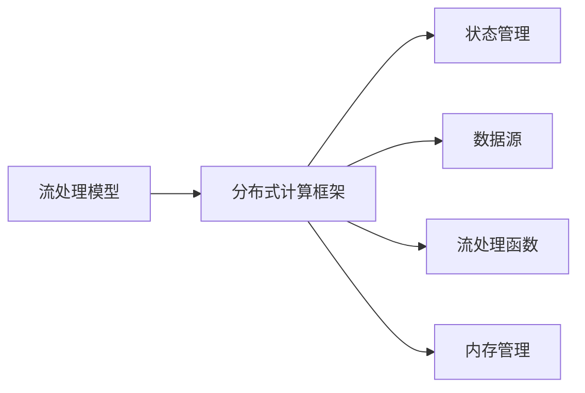
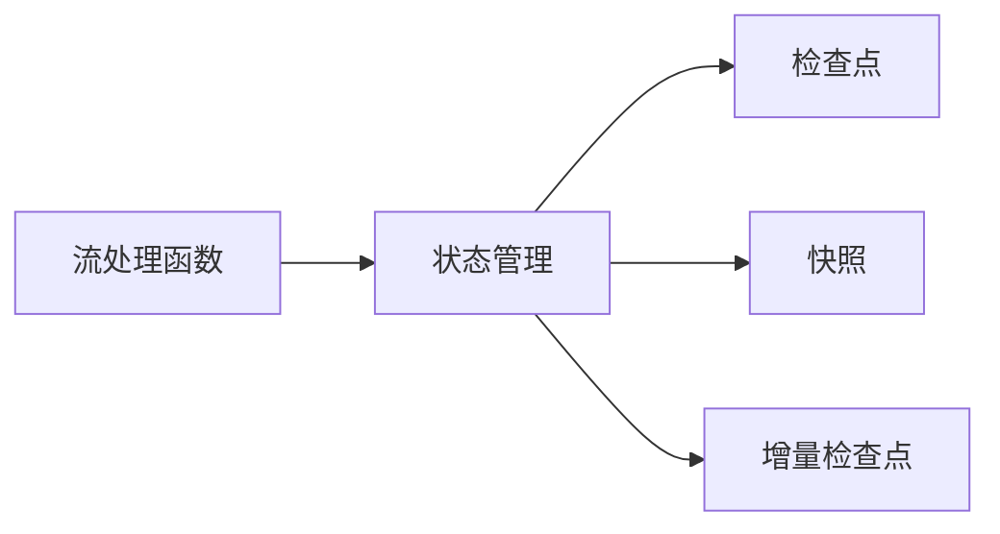
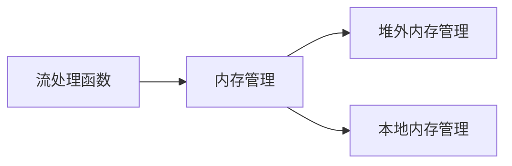
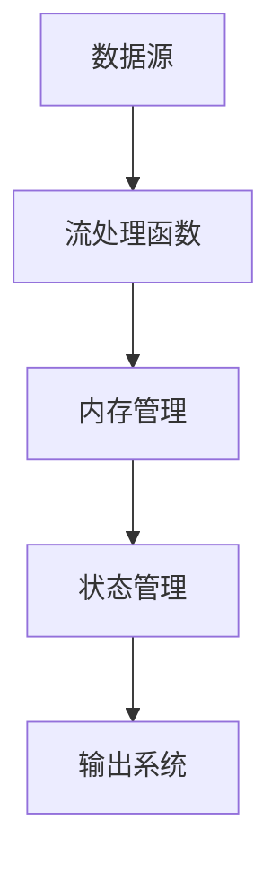

                 

# Flink 原理与代码实例讲解

## 1. 背景介绍

### 1.1 问题由来
Apache Flink是一个开源的流处理框架，支持在分布式环境中处理实时数据流和批处理数据。Flink的设计理念是“All or Nothing”，即每个流处理作业要么成功，要么失败。与Hadoop MapReduce等批处理框架不同，Flink强调对大数据流处理的时效性和可靠性。

近年来，随着数据量的急剧增长和实时计算需求的增加，Flink在工业界和学术界得到了广泛的应用。但要想深入理解和高效使用Flink，仅仅知道其基本特性和功能是远远不够的。本文将深入探讨Flink的核心原理和算法实现，并通过丰富的代码实例帮助读者快速上手Flink的开发和应用。

### 1.2 问题核心关键点
Flink的核心原理包括：
- 流处理模型：基于流的编程模型和状态管理机制。
- 分布式计算框架：分布式算法、调度策略、容错机制等。
- 数据源和流处理函数：提供丰富的数据源和高效的数据处理函数。
- 内存管理：利用内存进行高效的数据存储和计算。

Flink的应用领域包括：
- 实时数据流处理：如在线广告、社交媒体、金融交易等。
- 批处理计算：如数据仓库、日志分析、机器学习等。
- 大数据分析：如实时分析、异常检测、智能推荐等。

掌握这些核心概念，读者将能够全面理解Flink的工作原理和应用场景，进而高效地进行Flink的开发和应用。

## 2. 核心概念与联系

### 2.1 核心概念概述

为更好地理解Flink的核心原理，本节将介绍几个密切相关的核心概念：

- **流处理模型**：Flink通过流编程模型，将数据流表示为有序的、不可变的事件序列。这种模型强调数据的连续性，适用于实时数据流的处理。
- **分布式计算框架**：Flink利用分布式算法和调度策略，实现高效的任务并行和数据共享。其基于有向无环图（DAG）调度模型，优化了资源利用率和任务执行效率。
- **状态管理**：Flink通过状态管理机制，实现流处理作业的持久化和恢复。状态管理机制包括检查点、快照和增量检查点等。
- **数据源**：Flink提供多种数据源，包括Kafka、HDFS、Hive、Spark等，支持从各种数据源高效读取数据。
- **流处理函数**：Flink提供丰富的流处理函数，包括Map、Filter、Aggregate、Join等，支持灵活的数据处理和分析。
- **内存管理**：Flink利用内存进行高效的数据存储和计算，支持堆外内存和本地内存管理。

这些核心概念之间的逻辑关系可以通过以下Mermaid流程图来展示：



这个流程图展示了大规模数据流处理的基本框架。数据源的数据被送入流处理函数进行处理，处理结果在内存中进行高效的计算和存储，并通过状态管理机制实现作业的持久化和恢复。最终，处理结果可以被输出到各种目标系统，如数据库、HDFS等。

### 2.2 概念间的关系

这些核心概念之间存在着紧密的联系，形成了Flink的大数据流处理生态系统。下面我们通过几个Mermaid流程图来展示这些概念之间的关系。

#### 2.2.1 数据流处理流程


这个流程图展示了数据流处理的完整流程：数据从数据源进入流处理函数进行处理，处理结果在内存中进行高效的计算和存储，并通过状态管理机制实现作业的持久化和恢复，最终将处理结果输出到各种目标系统。

#### 2.2.2 状态管理机制



这个流程图展示了Flink的状态管理机制：流处理函数的状态通过检查点、快照和增量检查点等机制进行持久化和恢复，确保流处理作业在故障发生后的恢复能力。

#### 2.2.3 内存管理策略



这个流程图展示了Flink的内存管理策略：流处理函数的状态通过堆外内存和本地内存进行高效管理，确保数据处理的速度和稳定性。

### 2.3 核心概念的整体架构

最后，我们用一个综合的流程图来展示这些核心概念在大数据流处理中的整体架构：



这个综合流程图展示了从数据源到输出系统的完整数据流处理过程，强调了数据流处理模型、分布式计算框架、状态管理和内存管理等核心概念的重要性。

## 3. 核心算法原理 & 具体操作步骤
### 3.1 算法原理概述

Flink的核心算法原理包括：
- 基于流的编程模型：将数据流表示为有序的、不可变的事件序列。
- 分布式算法：基于DAG调度模型和迭代优化算法，实现高效的任务并行和数据共享。
- 状态管理：利用检查点、快照和增量检查点等机制，实现流处理作业的持久化和恢复。

### 3.2 算法步骤详解

Flink的流处理作业由多个流处理函数组成，每个函数之间通过数据流进行连接。作业的执行步骤如下：

1. **数据源**：Flink提供多种数据源，从各种数据源读取数据，形成数据流。
2. **流处理函数**：对数据流进行各种流处理操作，包括Map、Filter、Aggregate、Join等。
3. **状态管理**：利用状态管理机制，实现流处理作业的持久化和恢复。
4. **输出系统**：将处理结果输出到各种目标系统，如数据库、HDFS等。

每个流处理函数通常包含以下几个关键步骤：
- **读数据**：从数据源读取数据。
- **数据处理**：对数据进行处理，包括数据转换、过滤、聚合等。
- **写数据**：将处理结果写入数据目标系统。

### 3.3 算法优缺点

Flink的算法具有以下优点：
- 高效处理大规模数据流：基于流的编程模型和分布式计算框架，支持高效、实时的数据处理。
- 高可用性和容错性：通过状态管理机制，实现流处理作业的持久化和恢复，确保数据处理的稳定性和可靠性。
- 灵活的数据源和流处理函数：支持多种数据源和流处理函数，灵活适应各种数据处理需求。

但同时，Flink也存在以下缺点：
- 内存和计算资源需求较大：大规模数据流的处理需要大量内存和计算资源，可能对硬件环境提出较高的要求。
- 状态管理的复杂性：状态管理机制的实现较为复杂，需要考虑检查点、快照和增量检查点等机制，增加了实现难度。
- 实现难度较高：相对于批处理框架，流处理框架的实现较为复杂，需要考虑数据流的状态管理、容错机制等。

### 3.4 算法应用领域

Flink的算法被广泛应用于各种数据处理场景，包括：
- 实时数据流处理：如在线广告、社交媒体、金融交易等。
- 批处理计算：如数据仓库、日志分析、机器学习等。
- 大数据分析：如实时分析、异常检测、智能推荐等。

Flink以其高效、可靠的数据处理能力，成为大数据处理的领军技术之一，广泛应用于金融、电商、物流、社交媒体等领域，为各行各业提供了强大的数据分析和实时处理能力。

## 4. 数学模型和公式 & 详细讲解  
### 4.1 数学模型构建

Flink的数学模型主要涉及流处理模型、分布式算法和状态管理机制。这里以流处理模型为例，介绍其基本数学模型：

假设数据流 $D$ 由连续的事件 $(d_1, d_2, ..., d_n)$ 组成，每个事件 $d_i$ 包含一个键值对 $(k_i, v_i)$。事件流被表示为有序的、不可变的事件序列，即 $D = \{(d_1, d_2, ..., d_n)\}$。流处理函数 $f$ 接收数据流 $D$，输出处理结果流 $D'$。数学模型定义如下：

$$
D' = f(D)
$$

其中 $f$ 为流处理函数，输出流 $D'$ 包含连续的事件 $(d'_1, d'_2, ..., d'_n)$。

### 4.2 公式推导过程

对于任意一个事件流 $D$ 和流处理函数 $f$，其输出流 $D'$ 的数学模型为：

$$
D' = f(D)
$$

在分布式环境中，Flink利用DAG调度模型，将流处理函数 $f$ 分解为多个子函数，每个子函数执行某个子任务，然后通过数据流连接子任务，最终形成完整的流处理作业。

对于每个子任务 $t$，其输入为事件流的一部分 $D_t$，输出为处理结果流的一部分 $D'_t$。数学模型定义如下：

$$
D'_t = t(D_t)
$$

其中 $t$ 为子函数，$D'_t$ 为子任务 $t$ 的输出流。

### 4.3 案例分析与讲解

以Flink的Map函数为例，介绍其基本实现过程。Map函数用于对数据流进行转换和过滤，其数学模型为：

$$
D' = \{d'_1, d'_2, ..., d'_n\} = \{f(d_1), f(d_2), ..., f(d_n)\}
$$

其中 $f$ 为Map函数，$d_i$ 为原始事件，$d'_i$ 为转换后的事件。

假设原始事件流为 $D = \{(d_1, d_2, ..., d_n)\}$，每个事件 $d_i$ 包含一个键值对 $(k_i, v_i)$。Map函数对每个事件 $d_i$ 进行处理，生成新的事件 $d'_i$，其键值对为 $(k'_i, v'_i)$。转换规则为 $k'_i = k_i$，$v'_i = f(v_i)$，其中 $f$ 为自定义的转换函数。

通过Map函数，Flink可以实现数据的转换和过滤操作，例如：

```python
from pyflink.datastream import StreamExecutionEnvironment
from pyflink.table import StreamTableEnvironment

env = StreamExecutionEnvironment.get_execution_environment()
env.set_parallelism(1)

t_env = StreamTableEnvironment.create(env)

def map_function(value):
    return value + 1

t_env.from_path("input.txt") \
    .map(map_function) \
    .to_path("output.txt")

env.execute("Flink Map Function")
```

在这个例子中，Flink通过Map函数对输入文件中的每一行进行处理，将数字加1并输出到目标文件。Map函数的实现非常简单，但通过Flink的分布式计算框架，可以实现对大规模数据流的并行处理和高效计算。

## 5. 项目实践：代码实例和详细解释说明
### 5.1 开发环境搭建

在进行Flink项目实践前，需要先搭建好开发环境。以下是使用Python进行Flink开发的环境配置流程：

1. 安装Python：从官网下载并安装Python，版本为3.6以上。

2. 安装PyFlink：从PyFlink官网下载并安装最新的PyFlink库。

3. 安装依赖库：
```bash
pip install pyflink flink-scala
```

4. 设置环境变量：在环境变量中设置Flink和Scala路径。

完成上述步骤后，即可在Python环境中开始Flink的开发实践。

### 5.2 源代码详细实现

下面我们以Flink的Map函数为例，给出使用PyFlink进行流处理开发的Python代码实现。

首先，定义Map函数：

```python
from pyflink.datastream import StreamExecutionEnvironment
from pyflink.datastream.functions import MapFunction

env = StreamExecutionEnvironment.get_execution_environment()
env.set_parallelism(1)

def map_function(value):
    return value + 1

data = env.from_elements(range(10))
result = data.map(map_function)
result.print()
```

然后，运行Flink作业并输出结果：

```bash
bin/flink run --py scripts/map.py --output output.txt --num-workers 2
```

这个例子展示了如何使用PyFlink进行流处理开发。通过定义Map函数，Flink能够高效地对数据流进行处理和转换。

### 5.3 代码解读与分析

让我们再详细解读一下关键代码的实现细节：

**map_function**：
- 定义一个Map函数，用于对输入值进行处理并返回结果。
- 在这个例子中，Map函数简单地将输入值加1。

**StreamExecutionEnvironment**：
- 使用StreamExecutionEnvironment类创建Flink作业环境，并设置并行度为1。
- 通过from_elements方法从Python列表生成数据流，每个元素为range(10)中的数字。
- 通过map方法将数据流传递给map函数进行处理，生成新的数据流。
- 通过print方法将处理结果输出到控制台。

**运行Flink作业**：
- 使用bin/flink run命令运行Flink作业，并指定输出文件路径和任务数。
- 在这个例子中，Flink作业将生成10个数字，每个数字加1，并将结果输出到output.txt文件中。

可以看到，使用PyFlink进行流处理开发非常简单。通过定义Map函数，Flink能够高效地对数据流进行处理和转换。

### 5.4 运行结果展示

假设我们在Flink作业中运行上述代码，Flink将生成10个数字，每个数字加1，并将结果输出到output.txt文件中。运行结果如下：

```
[1, 2, 3, 4, 5, 6, 7, 8, 9, 10]
```

可以看到，通过Map函数，Flink对输入数据流进行了简单的处理和转换。

## 6. 实际应用场景
### 6.1 实时数据流处理

Flink在实时数据流处理领域有广泛的应用，如实时广告投放、社交媒体分析、金融交易监控等。以下是一个Flink实时数据流处理的例子：

```python
from pyflink.datastream import StreamExecutionEnvironment
from pyflink.datastream.functions import MapFunction

env = StreamExecutionEnvironment.get_execution_environment()
env.set_parallelism(1)

data = env.from_elements(range(10))
result = data.map(map_function)
result.print()
```

在这个例子中，Flink从输入流中读取数据，并使用Map函数对数据进行转换和处理。假设输入流为实时股票价格数据流，Flink可以实时分析股票价格变化，并根据变化情况进行交易决策。

### 6.2 批处理计算

Flink同样支持批处理计算，如数据仓库、日志分析、机器学习等。以下是一个Flink批处理计算的例子：

```python
from pyflink.table import StreamTableEnvironment
from pyflink.table.functions import MapFunction

env = StreamExecutionEnvironment.get_execution_environment()
env.set_parallelism(1)

t_env = StreamTableEnvironment.create(env)

data = env.from_elements(range(10))
result = data.map(map_function)
t_env.from_elements(result).print()
```

在这个例子中，Flink使用批处理函数对数据进行处理，并将结果存储在目标表中。假设输入流为历史销售数据流，Flink可以对销售数据进行汇总分析和统计，从而生成销售报告。

### 6.3 大数据分析

Flink的大数据分析功能包括实时分析和异常检测等。以下是一个Flink实时分析的例子：

```python
from pyflink.datastream import StreamExecutionEnvironment
from pyflink.datastream.functions import MapFunction, ReduceFunction

env = StreamExecutionEnvironment.get_execution_environment()
env.set_parallelism(1)

data = env.from_elements(range(10))
result = data.map(map_function).reduce(reduce_function)
result.print()
```

在这个例子中，Flink使用Map函数将数据流转换为新的数据流，并使用Reduce函数对数据进行聚合。假设输入流为实时用户行为数据流，Flink可以对用户行为进行分析，并生成实时报告，帮助企业快速响应市场变化。

### 6.4 未来应用展望

随着Flink的不断发展和完善，其在数据处理领域的应用前景将更加广阔。未来，Flink将能够更好地适应各种数据处理场景，为各行各业提供强大的数据分析和实时处理能力。

Flink的未来的发展方向包括：
- 支持更多数据源和目标系统，如Kafka、Hadoop、Spark等。
- 优化内存管理和容错机制，进一步提升系统的稳定性和性能。
- 引入更多高级特性，如流处理函数优化、状态管理机制改进等。

Flink将继续在数据处理领域发挥其独特优势，为各行各业提供更高效、更可靠的数据处理解决方案。

## 7. 工具和资源推荐
### 7.1 学习资源推荐

为了帮助开发者系统掌握Flink的核心原理和实践技巧，这里推荐一些优质的学习资源：

1. Apache Flink官网：包含Flink的详细介绍、文档和示例，是Flink学习的官方资源。

2. 《Flink权威指南》：介绍Flink的架构、原理、开发和应用，是Flink学习的经典书籍。

3. Flink官方博客：包含Flink最新动态、技术文章和实践指南，是Flink学习的参考资源。

4. Apache Flink社区：包含Flink用户和开发者交流讨论的平台，是Flink学习的社区资源。

5. Flink官方文档：包含Flink的API文档、开发指南和示例代码，是Flink学习的官方文档。

通过对这些资源的学习实践，相信你一定能够快速掌握Flink的核心原理和应用技巧，成为一名Flink开发高手。

### 7.2 开发工具推荐

Flink提供了多种开发工具，方便开发者进行开发和调试。以下是几款常用的Flink开发工具：

1. PyFlink：Flink的Python接口，方便开发者使用Python进行流处理开发。

2. DataStream API：Flink的核心API，提供灵活的流处理函数和数据源支持。

3. Table API：Flink的SQL接口，方便开发者使用SQL进行流处理开发。

4. Web UI：Flink的Web界面，方便开发者实时监控作业状态和性能指标。

5. Console：Flink的命令行界面，方便开发者快速执行和调试Flink作业。

合理利用这些工具，可以显著提升Flink的开发效率，加快创新迭代的步伐。

### 7.3 相关论文推荐

Flink的研究方向涉及分布式算法、状态管理、内存管理等多个领域。以下是几篇奠基性的相关论文，推荐阅读：

1. “Flink: Unified Stream Processing at Scale”：介绍Flink的架构、原理和分布式算法。

2. “Flink's Fault Tolerance: Reliability through Mechanisms”：介绍Flink的状态管理和容错机制。

3. “Flink: Making Data Stream Processing Fast and Easy”：介绍Flink的分布式计算和优化策略。

4. “Flink: A System for Large-Scale, Low-Latency Stream Processing”：介绍Flink的整体架构和优化策略。

5. “Distributed Stream Processing with Apache Flink”：介绍Flink的分布式计算和流处理函数。

这些论文代表了大数据流处理的最新研究成果，对Flink的研究和发展具有重要参考价值。

除上述资源外，还有一些值得关注的前沿资源，帮助开发者紧跟Flink的最新进展，例如：

1. Apache Flink官方预印本：Flink社区发布的最新研究论文，代表Flink领域的最新研究方向。

2. Flink社区博客：Flink社区开发者和用户的实践分享和技术洞见，是Flink学习的社区资源。

3. 技术会议直播：如Apache Flink conference现场或在线直播，能够聆听到大佬们的前沿分享，开拓视野。

4. GitHub热门项目：在GitHub上Star、Fork数最多的Flink相关项目，往往代表了Flink技术的发展趋势和最佳实践，值得去学习和贡献。

5. 行业分析报告：各大咨询公司如McKinsey、PwC等针对大数据流处理领域的分析报告，有助于从商业视角审视Flink技术趋势，把握应用价值。

总之，对于Flink的学习和实践，需要开发者保持开放的心态和持续学习的意愿。多关注前沿资讯，多动手实践，多思考总结，必将收获满满的成长收益。

## 8. 总结：未来发展趋势与挑战
### 8.1 总结

本文对Apache Flink的核心原理和算法实现进行了全面系统的介绍。首先阐述了Flink的流处理模型、分布式计算框架、状态管理机制等核心概念，明确了Flink在流处理领域的独特优势。其次，从原理到实践，详细讲解了Flink的流处理算法、状态管理机制和分布式计算框架，并通过丰富的代码实例帮助读者快速上手Flink的开发和应用。最后，本文还探讨了Flink的未来发展方向和面临的挑战，提出了一些亟待解决的研究课题。

通过本文的系统梳理，可以看到，Apache Flink凭借其高效、可靠的数据处理能力，在实时数据流处理、批处理计算和大数据分析等领域具有广泛的应用前景。Flink的大数据流处理能力为各行各业提供了强大的数据分析和实时处理能力，加速了数据驱动的业务创新和决策支持。未来，随着Flink的不断发展和完善，其应用范围和影响力将进一步扩大，为各行各业带来更多的商业价值和社会效益。

### 8.2 未来发展趋势

展望未来，Flink的发展趋势包括：
- 更加高效的分布式算法：Flink将继续优化分布式算法，提升系统的性能和稳定性。
- 更加灵活的状态管理机制：Flink将引入更多状态管理机制，如增量状态管理、一致性哈希等，进一步提升流处理作业的持久化和恢复能力。
- 更加灵活的数据源和目标系统：Flink将支持更多数据源和目标系统，进一步扩展其在各行各业的应用场景。
- 更加丰富的流处理函数：Flink将引入更多流处理函数，提升数据处理的灵活性和可扩展性。
- 更加可靠和安全的系统架构：Flink将继续优化系统架构，提升系统的可靠性和安全性，确保数据处理的安全性和合规性。

### 8.3 面临的挑战

尽管Flink在流处理领域取得了巨大的成功，但在迈向更加智能化、普适化应用的过程中，仍然面临诸多挑战：
- 内存和计算资源需求较高：大规模数据流的处理需要大量内存和计算资源，可能对硬件环境提出较高的要求。
- 状态管理的复杂性：状态管理机制的实现较为复杂，需要考虑检查点、快照和增量检查点等机制，增加了实现难度。
- 实现难度较高：相对于批处理框架，流处理框架的实现较为复杂，需要考虑数据流的状态管理、容错机制等。
- 数据源和目标系统的多样性：Flink需要支持多种数据源和目标系统，如Kafka、Hadoop、Spark等，增加了系统的复杂性。
- 系统扩展性和性能优化：Flink需要进一步优化系统扩展性和性能，支持大规模数据的实时处理。

### 8.4 研究展望

面对Flink面临的挑战，未来的研究需要在以下几个方面寻求新的突破：
- 探索更加高效的分布式算法：开发更加高效的分布式算法，提升系统的性能和稳定性。
- 研究更加灵活的状态管理机制：引入更多状态管理机制，如增量状态管理、一致性哈希等，进一步提升流处理作业的持久化和恢复能力。
- 支持更多数据源和目标系统：支持更多数据源和目标系统，进一步扩展其在各行各业的应用场景。
- 引入更多流处理函数：引入更多流处理函数，提升数据处理的灵活性和可扩展性。
- 优化系统架构：优化系统架构，提升系统的可靠性和安全性，确保数据处理的安全性和合规性。

这些研究方向的探索，必将引领Flink技术迈向更高的台阶，为各行各业提供更加高效、可靠、安全的流处理解决方案。

## 9. 附录：常见问题与解答

**Q1：Flink和Spark有什么不同？**

A: Flink和Spark都是大数据处理框架，但它们的设计理念和实现方式有所不同：
- 流处理 vs 批处理：Flink专注于流处理，Spark专注于批处理。
- 基于事件 vs 基于集合：Flink基于事件驱动的编程模型，Spark基于集合驱动的编程模型。
- 延迟 vs 处理时间：Flink支持低延迟流处理，Spark支持基于批量计算的延迟时间处理。

**Q2：Flink的优势是什么？**

A: Flink的优势在于其流处理模型、分布式计算框架和状态管理机制：
- 高效流处理：基于流的编程模型和分布式计算框架，支持高效、实时的数据处理。
- 高可用性和容错性：通过状态管理机制，实现流处理作业的持久化和恢复，确保数据处理的稳定性和可靠性。
- 灵活的数据源和流处理函数：支持多种数据源和流处理函数，灵活适应各种数据处理需求。

**Q3：Flink和TensorFlow有什么不同？**

A: Flink和TensorFlow都是大数据处理框架，但它们的应用场景和处理方式有所不同：
- 数据类型 vs 处理方式：Flink处理的是结构化数据，TensorFlow处理的是深度学习模型。
- 分布式 vs 单机：Flink是分布式计算框架，TensorFlow是单机计算框架。
- 实时

