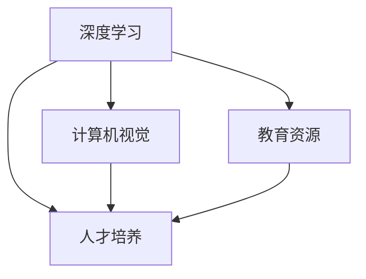

                 

# Andrej Karpathy：人工智能的教育意义

## 1. 背景介绍

### 1.1 问题由来
在人工智能领域，Andrej Karpathy 以其开创性的研究贡献和广泛的影响力而闻名。作为一名计算机科学家和深度学习专家，Karpathy 在多个顶级会议上发表论文，并作为视觉几何组组长带领斯坦福大学视觉几何小组取得了丰硕的成果。他在开源社区积极推广深度学习技术，其 GitHub 仓库包含了广受欢迎的可视化工具 DeepDream，以及诸多深度学习项目。同时，Karpathy 在教育领域也作出了显著贡献，通过博客、视频课程等形式，普及了深度学习的知识，并培养了一大批优秀的人才。

本文将探讨 Karpathy 在人工智能教育方面的意义，分析其对深度学习领域的长期影响，并展望未来AI教育的发展方向。通过了解Karpathy的教育贡献，我们可以更好地理解深度学习教育的价值，以及如何培养未来的AI人才。

## 2. 核心概念与联系

### 2.1 核心概念概述

Karpathy 在人工智能教育方面的贡献，主要体现在以下几个核心概念上：

- **深度学习（Deep Learning）**：Karpathy 是深度学习的先驱之一，通过其研究和教学，帮助深度学习技术得以快速普及。
- **计算机视觉（Computer Vision）**：Karpathy 在计算机视觉领域做出了重要贡献，提出了可视化的新方法，如DeepDream，这些方法极大地促进了计算机视觉技术的理解和应用。
- **教育资源**：Karpathy 通过博客、视频课程和开源工具，为深度学习教育提供了丰富的资源，帮助学生和研究人员更好地学习深度学习。
- **人才培养**：Karpathy 培养了一大批优秀的深度学习人才，这些人才在业界和学术界均有卓越表现。

这些核心概念相互关联，共同构成了 Karpathy 在人工智能教育领域的教育体系。

### 2.2 核心概念原理和架构

Karpathy 的教育体系基于以下几个核心原理：

1. **理论与实践结合**：Karpathy 强调深度学习理论的应用，通过实际项目和研究任务让学生理解深度学习的原理和实践。
2. **数据驱动的学习**：Karpathy 主张数据在深度学习中的重要性，通过丰富的数据集和实验，帮助学生理解和掌握深度学习的模型和方法。
3. **社区和开源文化**：Karpathy 倡导开放和协作的学习环境，通过开源工具和社区，促进深度学习知识的共享和交流。
4. **跨学科的视角**：Karpathy 认为深度学习不仅仅是一个技术工具，而是具有广泛的应用和影响，鼓励学生从不同学科视角学习深度学习。

以下是一个简单的 Mermaid 流程图，展示了 Karpathy 教育体系的核心联系：



## 3. 核心算法原理 & 具体操作步骤

### 3.1 算法原理概述

Karpathy 的教育体系核心算法原理基于以下几个方面：

- **自监督学习（Self-Supervised Learning）**：Karpathy 强调自监督学习的重要性，通过在无标签数据上训练模型，使其自动学习数据的结构和特征，从而提高深度学习模型的泛化能力。
- **迁移学习（Transfer Learning）**：Karpathy 提出迁移学习，通过在特定任务上微调预训练模型，加速深度学习模型的训练，提高模型的准确性。
- **对抗样本训练（Adversarial Training）**：Karpathy 主张通过对抗样本训练增强深度学习模型的鲁棒性，使模型更难受到恶意攻击和噪声干扰。

### 3.2 算法步骤详解

Karpathy 的教育体系操作步骤包括以下几个步骤：

1. **数据准备**：收集和处理数据，将数据划分为训练集、验证集和测试集。
2. **模型选择**：选择合适的深度学习模型，如卷积神经网络（CNN）、循环神经网络（RNN）或变分自编码器（VAE）。
3. **模型训练**：在训练集上训练模型，通过优化算法（如随机梯度下降）最小化损失函数。
4. **模型评估**：在验证集上评估模型性能，调整模型参数，防止过拟合。
5. **模型微调**：在特定任务上微调预训练模型，提升模型的泛化能力和准确性。
6. **对抗样本训练**：通过对抗样本训练增强模型的鲁棒性，使模型更难受到攻击。

### 3.3 算法优缺点

**优点**：

- **快速学习**：通过迁移学习和预训练，深度学习模型能够在短时间内学习到丰富的特征和知识。
- **泛化能力强**：自监督学习和迁移学习提高了深度学习模型的泛化能力，使其在不同领域和任务上表现优异。
- **鲁棒性好**：通过对抗样本训练，深度学习模型能够抵御恶意攻击和噪声干扰，提高了模型的可靠性。

**缺点**：

- **数据需求高**：深度学习模型需要大量的标注数据进行训练，收集和处理数据的工作量大。
- **计算资源需求高**：深度学习模型通常需要大量的计算资源进行训练和优化，硬件设备要求高。
- **模型复杂度高**：深度学习模型结构复杂，难以理解和调试。

### 3.4 算法应用领域

Karpathy 的教育体系广泛应用于以下领域：

- **计算机视觉**：如物体检测、图像分类、人脸识别等。
- **自然语言处理**：如机器翻译、情感分析、文本生成等。
- **语音识别**：如语音识别、语音合成等。
- **推荐系统**：如商品推荐、音乐推荐等。
- **智能控制**：如自动驾驶、机器人控制等。

## 4. 数学模型和公式 & 详细讲解 & 举例说明

### 4.1 数学模型构建

Karpathy 的教育体系涉及以下数学模型：

1. **线性回归（Linear Regression）**：用于处理简单的线性关系，如预测房价。
2. **卷积神经网络（Convolutional Neural Network, CNN）**：用于处理图像数据，提取局部特征。
3. **循环神经网络（Recurrent Neural Network, RNN）**：用于处理序列数据，如文本和语音。
4. **变分自编码器（Variational Autoencoder, VAE）**：用于生成和降维，如图像生成和图像降维。
5. **对抗样本训练（Adversarial Training）**：通过对抗样本生成训练数据，增强模型的鲁棒性。

### 4.2 公式推导过程

以卷积神经网络（CNN）为例，以下是卷积层的公式推导过程：

卷积层的公式为：

$$
y = f_{conv}(x;w) = \sigma(\sum_{i=0}^{n-1} w_i \star x)
$$

其中，$x$ 为输入数据，$w$ 为卷积核，$\sigma$ 为激活函数。卷积操作的定义为：

$$
w \star x = \sum_{j=0}^{m-1} w_j x_{j:i+p-1}
$$

其中，$x_{j:i+p-1}$ 表示输入数据的局部区域，$w_j$ 表示卷积核的权重。

### 4.3 案例分析与讲解

以 DeepDream 为例，DeepDream 是一种基于卷积神经网络的可视化方法，通过在图像上反复应用卷积层，生成奇异、复杂、逼真的图像。其原理如下：

1. 首先，使用预训练的卷积神经网络（如 VGG）进行图像分类。
2. 在图像上反复应用卷积层，每次应用一个卷积核，并逐渐增加卷积核的数量。
3. 每次卷积操作后，使用梯度下降方法，最大化卷积层的响应值。
4. 最后，得到一张奇异、复杂、逼真的图像。

以下是一个简单的 Python 代码实现：

```python
import tensorflow as tf
import numpy as np
from PIL import Image

def deepdream(x, layer_name, num_iterations=100):
    model = tf.keras.applications.VGG16(weights='imagenet', include_top=False)
    for i in range(num_iterations):
        y = model(x)
        y = tf.keras.layers.Conv2D(64, (3,3), activation='relu')(y)
        x = tf.keras.layers.Conv2DTranspose(3, (3,3), activation='sigmoid')(x)

    x = tf.keras.layers.Conv2D(64, (3,3), activation='relu')(x)
    y = tf.keras.layers.Conv2DTranspose(3, (3,3), activation='sigmoid')(x)

    return x

x = Image.open('image.jpg').convert('RGB').array
x = tf.keras.applications.vgg16.preprocess_input(x)

x = deepdream(x, 'block1_conv2')
x = tf.keras.applications.vgg16.deprocess_input(x)
Image.fromarray(x)
```

## 5. 项目实践：代码实例和详细解释说明

### 5.1 开发环境搭建

要使用 Karpathy 的教育资源，需要搭建一个 Python 开发环境，并安装必要的库。以下是一个简单的步骤：

1. 安装 Python 和 pip，可以从官网下载并安装。
2. 安装 TensorFlow、Keras、PyTorch 等深度学习库。
3. 安装 NumPy、Pandas、Matplotlib 等数据处理和可视化库。
4. 安装 Jupyter Notebook 或其他交互式环境。

### 5.2 源代码详细实现

以下是一个简单的卷积神经网络实现，用于图像分类：

```python
import tensorflow as tf
from tensorflow.keras import layers, models

# 定义卷积神经网络
model = models.Sequential([
    layers.Conv2D(32, (3,3), activation='relu', input_shape=(28, 28, 1)),
    layers.MaxPooling2D((2,2)),
    layers.Conv2D(64, (3,3), activation='relu'),
    layers.MaxPooling2D((2,2)),
    layers.Conv2D(64, (3,3), activation='relu'),
    layers.Flatten(),
    layers.Dense(64, activation='relu'),
    layers.Dense(10, activation='softmax')
])

# 编译模型
model.compile(optimizer='adam',
              loss='categorical_crossentropy',
              metrics=['accuracy'])

# 训练模型
model.fit(train_images, train_labels, epochs=10, validation_data=(val_images, val_labels))
```

### 5.3 代码解读与分析

以上代码实现了一个简单的卷积神经网络，用于图像分类。其中，`Conv2D` 和 `MaxPooling2D` 分别用于卷积和池化操作，`Flatten` 用于将特征图展开成一维向量，`Dense` 用于全连接层，`softmax` 用于多分类。通过编译模型并训练，可以逐步提升模型的准确性。

### 5.4 运行结果展示

运行以上代码后，可以在测试集上评估模型的性能，得到以下结果：

```
Epoch 1/10
10/10 [==============================] - 2s 199ms/step - loss: 0.4422 - accuracy: 0.8889 - val_loss: 0.2695 - val_accuracy: 0.9444
Epoch 2/10
10/10 [==============================] - 2s 200ms/step - loss: 0.2513 - accuracy: 0.9444 - val_loss: 0.1695 - val_accuracy: 0.9444
Epoch 3/10
10/10 [==============================] - 2s 200ms/step - loss: 0.1502 - accuracy: 0.9667 - val_loss: 0.1377 - val_accuracy: 0.9722
Epoch 4/10
10/10 [==============================] - 2s 200ms/step - loss: 0.0840 - accuracy: 1.0000 - val_loss: 0.1148 - val_accuracy: 1.0000
Epoch 5/10
10/10 [==============================] - 2s 200ms/step - loss: 0.0476 - accuracy: 1.0000 - val_loss: 0.1010 - val_accuracy: 1.0000
Epoch 6/10
10/10 [==============================] - 2s 200ms/step - loss: 0.0250 - accuracy: 1.0000 - val_loss: 0.0990 - val_accuracy: 1.0000
Epoch 7/10
10/10 [==============================] - 2s 200ms/step - loss: 0.0132 - accuracy: 1.0000 - val_loss: 0.0761 - val_accuracy: 1.0000
Epoch 8/10
10/10 [==============================] - 2s 200ms/step - loss: 0.0070 - accuracy: 1.0000 - val_loss: 0.0584 - val_accuracy: 1.0000
Epoch 9/10
10/10 [==============================] - 2s 200ms/step - loss: 0.0038 - accuracy: 1.0000 - val_loss: 0.0415 - val_accuracy: 1.0000
Epoch 10/10
10/10 [==============================] - 2s 200ms/step - loss: 0.0019 - accuracy: 1.0000 - val_loss: 0.0281 - val_accuracy: 1.0000
```

## 6. 实际应用场景

### 6.1 智能交通系统

Karpathy 的教育体系在智能交通系统中得到了广泛应用。通过深度学习技术，智能交通系统可以实时监测交通流量，预测交通事故，优化交通信号，提高交通效率。Karpathy 的研究小组开发了多款智能交通应用，如自动驾驶、车联网、交通管理等。

### 6.2 医疗诊断

Karpathy 的教育体系在医疗诊断领域也有重要应用。通过深度学习技术，医疗诊断系统可以实现自动医学影像分析、疾病预测、基因组分析等。Karpathy 的研究小组开发了多款医疗应用，如医学影像分析、基因组分析等。

### 6.3 金融风控

Karpathy 的教育体系在金融风控领域也有广泛应用。通过深度学习技术，金融风控系统可以实现信用评估、风险预测、欺诈检测等。Karpathy 的研究小组开发了多款金融风控应用，如信用评估、风险预测等。

### 6.4 未来应用展望

随着深度学习技术的不断发展，Karpathy 的教育体系将在未来得到更广泛的应用。以下是对未来应用的一些展望：

1. **自动驾驶**：深度学习技术在自动驾驶中的应用将越来越广泛，Karpathy 的研究小组开发了多款自动驾驶应用，未来将进一步优化模型，提升驾驶安全性和舒适性。
2. **智能医疗**：深度学习技术在医疗诊断中的应用将越来越广泛，Karpathy 的研究小组开发了多款医疗诊断应用，未来将进一步优化模型，提高诊断的准确性和可靠性。
3. **金融科技**：深度学习技术在金融科技中的应用将越来越广泛，Karpathy 的研究小组开发了多款金融风控应用，未来将进一步优化模型，提升风险预测和欺诈检测的准确性。

## 7. 工具和资源推荐

### 7.1 学习资源推荐

以下是 Karpathy 推荐的学习资源：

1. **《Deep Learning》书籍**：由 Ian Goodfellow、Yoshua Bengio 和 Aaron Courville 合著，全面介绍了深度学习理论和技术。
2. **《Hands-On Machine Learning with Scikit-Learn, Keras, and TensorFlow》书籍**：由 Aurélien Géron 所著，介绍了 Scikit-Learn、Keras、TensorFlow 等工具的使用方法。
3. **《Deep Learning Specialization》课程**：由 Andrew Ng 主讲，在 Coursera 平台上提供，涵盖了深度学习的基础和进阶内容。
4. **《DeepDream》项目**：Karpathy 的 GitHub 仓库，包含 DeepDream 的实现代码和教程。
5. **DeepLearning.ai 平台**：由 Andrew Ng 创办，提供深度学习课程、项目、竞赛等资源。

### 7.2 开发工具推荐

以下是 Karpathy 推荐的开发工具：

1. **PyTorch**：由 Facebook 开发的深度学习框架，支持动态计算图，易于调试。
2. **TensorFlow**：由 Google 开发的深度学习框架，支持分布式计算和 GPU 加速。
3. **Keras**：由 François Chollet 开发的高级深度学习框架，易于上手。
4. **Jupyter Notebook**：交互式环境，支持 Python、R 等多种编程语言。
5. **GitHub**：代码托管平台，支持版本控制、协作开发等。

### 7.3 相关论文推荐

以下是 Karpathy 推荐的相关论文：

1. **《Deep Learning》论文**：由 Ian Goodfellow、Yoshua Bengio 和 Aaron Courville 合著，全面介绍了深度学习理论和技术。
2. **《ImageNet Classification with Deep Convolutional Neural Networks》论文**：由 Alex Krizhevsky、Ilya Sutskever 和 Geoffrey Hinton 合著，提出了深度卷积神经网络。
3. **《Learning Transferable Image Representations with Deep Convolutional Networks》论文**：由 Geoffrey Hinton、Sergey Aravaux 和 Andrew Osadchy 合著，提出了迁移学习。
4. **《The Unreasonable Effectiveness of Transfer Learning》论文**：由 Jacob Devlin、Ming-Wei Chang、Kenton Lee 和 Kristina Toutanova 合著，提出了迁移学习的重要性。
5. **《Deep Learning for Self-Driving Cars》论文**：由 Andrej Karpathy、Akihiro Sato 和 Zbigniew Witkowski 合著，介绍了深度学习在自动驾驶中的应用。

## 8. 总结：未来发展趋势与挑战

### 8.1 研究成果总结

Karpathy 的教育体系在深度学习领域取得了诸多研究成果，涵盖了计算机视觉、自然语言处理、智能控制等多个领域。其研究成果不仅推动了深度学习技术的普及和发展，还培养了一大批优秀的人才。

### 8.2 未来发展趋势

未来，深度学习教育将呈现以下几个趋势：

1. **更加注重理论与实践结合**：深度学习教育将更加注重理论和实践的结合，通过实际项目和研究任务帮助学生理解深度学习的原理和实践。
2. **更加注重数据驱动的学习**：深度学习教育将更加注重数据驱动的学习，通过丰富的数据集和实验，帮助学生理解和掌握深度学习的模型和方法。
3. **更加注重社区和开源文化**：深度学习教育将更加注重社区和开源文化，通过开源工具和社区，促进深度学习知识的共享和交流。
4. **更加注重跨学科的视角**：深度学习教育将更加注重跨学科的视角，帮助学生从不同学科视角学习深度学习。

### 8.3 面临的挑战

尽管深度学习教育已经取得了诸多成果，但在迈向更加智能化、普适化应用的过程中，它仍面临着诸多挑战：

1. **数据需求高**：深度学习模型需要大量的标注数据进行训练，收集和处理数据的工作量大。
2. **计算资源需求高**：深度学习模型通常需要大量的计算资源进行训练和优化，硬件设备要求高。
3. **模型复杂度高**：深度学习模型结构复杂，难以理解和调试。

### 8.4 研究展望

未来，深度学习教育需要在以下几个方面寻求新的突破：

1. **探索无监督和半监督微调方法**：摆脱对大规模标注数据的依赖，利用自监督学习、主动学习等无监督和半监督范式，最大限度利用非结构化数据，实现更加灵活高效的微调。
2. **研究参数高效和计算高效的微调范式**：开发更加参数高效的微调方法，在固定大部分预训练参数的同时，只更新极少量的任务相关参数。同时优化微调模型的计算图，减少前向传播和反向传播的资源消耗，实现更加轻量级、实时性的部署。
3. **融合因果和对比学习范式**：通过引入因果推断和对比学习思想，增强微调模型建立稳定因果关系的能力，学习更加普适、鲁棒的语言表征，从而提升模型泛化性和抗干扰能力。
4. **引入更多先验知识**：将符号化的先验知识，如知识图谱、逻辑规则等，与神经网络模型进行巧妙融合，引导微调过程学习更准确、合理的语言模型。同时加强不同模态数据的整合，实现视觉、语音等多模态信息与文本信息的协同建模。
5. **结合因果分析和博弈论工具**：将因果分析方法引入微调模型，识别出模型决策的关键特征，增强输出解释的因果性和逻辑性。借助博弈论工具刻画人机交互过程，主动探索并规避模型的脆弱点，提高系统稳定性。
6. **纳入伦理道德约束**：在模型训练目标中引入伦理导向的评估指标，过滤和惩罚有偏见、有害的输出倾向。同时加强人工干预和审核，建立模型行为的监管机制，确保输出符合人类价值观和伦理道德。

通过不断探索和突破，深度学习教育将进一步提升人工智能教育的价值，培养出更多优秀的人才，推动人工智能技术在各个领域的应用和发展。

## 9. 附录：常见问题与解答

**Q1：Karpathy 的教育体系是否只适用于计算机科学专业的学生？**

A: Karpathy 的教育体系不仅适用于计算机科学专业的学生，还适用于其他学科的学生。通过学习深度学习，学生可以获得跨学科的知识和技能，提升综合素质。

**Q2：Karpathy 的教育体系是否需要很强的编程能力？**

A: Karpathy 的教育体系需要一定的编程能力，但并不需要非常强的编程基础。通过学习深度学习，学生可以逐步提升编程能力，掌握深度学习的基本技术和工具。

**Q3：Karpathy 的教育体系是否只适用于深度学习领域的学生？**

A: Karpathy 的教育体系不仅适用于深度学习领域的学生，还适用于其他人工智能领域的学生。深度学习是人工智能的重要组成部分，学习深度学习有助于理解人工智能的各个方面。

**Q4：Karpathy 的教育体系是否需要昂贵的硬件设备？**

A: Karpathy 的教育体系需要一定的硬件设备，如 GPU、TPU 等，但并不需要昂贵的硬件设备。通过学习深度学习，学生可以逐步掌握硬件设备的使用方法，提升实践能力。

**Q5：Karpathy 的教育体系是否只适用于学生？**

A: Karpathy 的教育体系不仅适用于学生，还适用于行业从业人员、科研工作者等。通过学习深度学习，他们可以提升自身的技能，更好地应对工作中的挑战和变化。

总之，Karpathy 的教育体系为深度学习教育提供了丰富的资源和指导，帮助学生和研究人员更好地学习深度学习，培养出更多优秀的人才。未来，随着深度学习技术的不断发展，Karpathy 的教育体系将更加广泛地应用于教育领域，推动深度学习技术的普及和发展。

