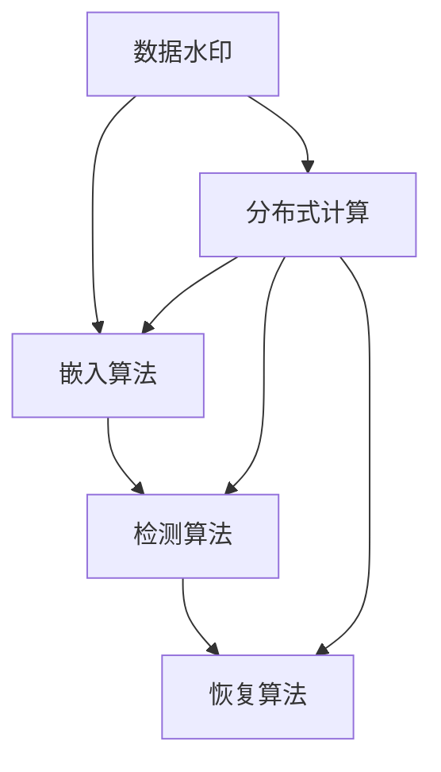
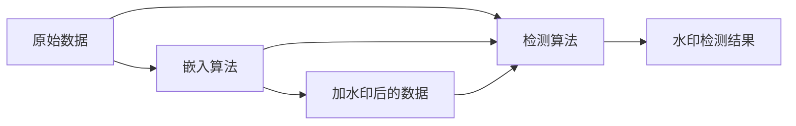
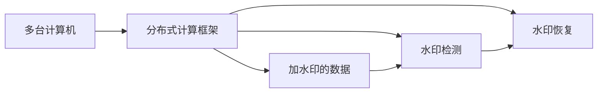
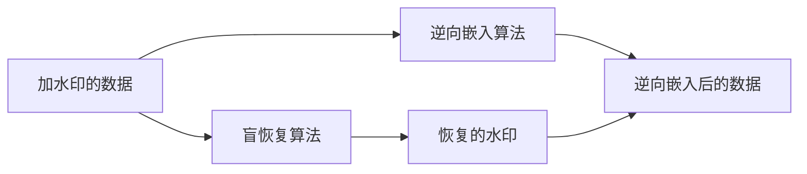
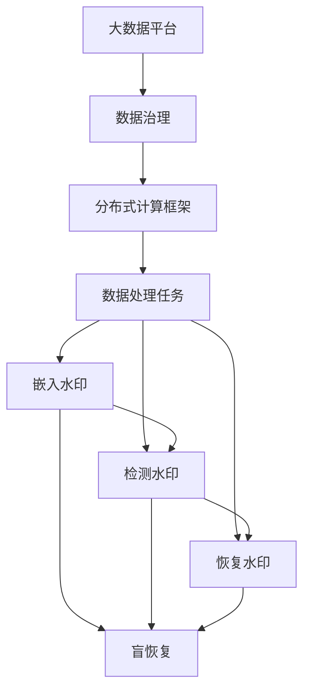

                 

# 【AI大数据计算原理与代码实例讲解】Watermark

> 关键词：大数据, 分布式计算, 数据治理, 水印嵌入, 代码实例, 性能优化

## 1. 背景介绍

### 1.1 问题由来

随着人工智能(AI)和深度学习(Deep Learning)技术的发展，数据的重要性日益凸显。然而，数据往往蕴含着商业价值，如何在数据共享和传输过程中保护数据的完整性和隐私，成为了一个重要问题。Watermark技术应运而生，通过对数据添加不可见的水印，既保证数据的完整性，又能在数据受到破坏或篡改时进行追踪和恢复。

### 1.2 问题核心关键点

Watermark技术的目标是在数据中嵌入不可见的水印信息，并能够在不破坏数据完整性的前提下，在需要时进行水印的检测和恢复。核心关键点包括：

- 水印嵌入方法：通过一定的算法在数据中嵌入水印。
- 水印检测方法：在数据接收端进行水印的检测和验证。
- 水印恢复方法：在数据被破坏时，从水印中恢复原始数据。

### 1.3 问题研究意义

Watermark技术在数据完整性保护、数据溯源、数字版权保护等方面具有重要应用价值。尤其在数据共享和传输过程中，通过嵌入水印，可以确保数据的可信度和隐私性，防止数据被盗用或篡改。Watermark技术的广泛应用，有助于构建更安全、可靠的数据生态系统。

## 2. 核心概念与联系

### 2.1 核心概念概述

为更好地理解Watermark技术，本节将介绍几个关键概念：

- 数据水印(Data Watermarking)：在原始数据中嵌入不可见的水印信息，用于数据完整性保护、数据溯源、数字版权保护等。
- 嵌入算法(Embedding Algorithm)：用于将水印信息嵌入到原始数据中的算法，如频域嵌入、时域嵌入、分块嵌入等。
- 检测算法(Detection Algorithm)：用于检测水印的算法，如统计检测、模板匹配等。
- 恢复算法(Restoration Algorithm)：用于从水印中恢复原始数据的算法，如逆向嵌入、盲恢复等。
- 分布式计算(Distributed Computing)：通过多台计算机协同计算，提高数据处理效率和处理能力。

这些核心概念之间的逻辑关系可以通过以下Mermaid流程图来展示：



这个流程图展示了数据水印的整个处理流程，从嵌入、检测到恢复，并结合了分布式计算技术，以提升处理效率。

### 2.2 概念间的关系

这些核心概念之间存在着紧密的联系，形成了数据水印技术的完整生态系统。下面我通过几个Mermaid流程图来展示这些概念之间的关系。

#### 2.2.1 数据水印的嵌入和检测过程



这个流程图展示了数据水印的嵌入和检测过程。原始数据通过嵌入算法添加水印，得到加水印后的数据。检测算法则用于检测水印，验证数据的完整性。

#### 2.2.2 分布式计算与水印处理



这个流程图展示了分布式计算框架与水印处理过程的结合。多台计算机协同工作，通过分布式计算框架处理水印的嵌入、检测和恢复，提高了数据处理的效率和能力。

#### 2.2.3 水印的盲恢复和逆向嵌入



这个流程图展示了水印的盲恢复和逆向嵌入过程。盲恢复算法用于从加水印的数据中恢复原始数据，逆向嵌入算法则用于将水印逆向嵌入，以恢复原始数据。

### 2.3 核心概念的整体架构

最后，我们用一个综合的流程图来展示这些核心概念在大数据计算中的整体架构：



这个综合流程图展示了数据水印技术在大数据平台中的应用。从数据治理、分布式计算框架到具体的任务处理，最终实现了水印的嵌入、检测和恢复，确保了数据的完整性和隐私性。

## 3. 核心算法原理 & 具体操作步骤
### 3.1 算法原理概述

数据水印技术主要通过以下步骤实现：

1. 在原始数据中嵌入水印信息。
2. 对加水印的数据进行检测，确认水印是否存在。
3. 在数据被破坏时，从水印中恢复原始数据。

核心算法原理包括：

- 水印嵌入算法：通过一定的算法将水印信息嵌入到原始数据中。
- 水印检测算法：通过特定的算法检测数据中的水印信息。
- 水印恢复算法：通过算法从水印中恢复原始数据。

### 3.2 算法步骤详解

以频域嵌入算法为例，以下是详细的算法步骤：

#### 3.2.1 水印嵌入

1. **预处理**：对原始数据进行预处理，如归一化、分块等。
2. **频域转换**：将原始数据转换到频域，提取频域系数。
3. **嵌入水印**：将水印信息嵌入到频域系数中，如在频域系数上叠加水印信息。
4. **逆变换**：将加水印的频域系数转换回时域，得到加水印的数据。

#### 3.2.2 水印检测

1. **预处理**：对加水印的数据进行预处理，如归一化、分块等。
2. **频域转换**：将加水印的数据转换到频域，提取频域系数。
3. **水印检测**：在频域系数中检测水印信息，如统计频域系数的分布，与水印的特征进行比较。
4. **恢复水印**：如果检测到水印，则从频域系数中恢复水印信息。

#### 3.2.3 水印恢复

1. **检测水印**：检测加水印的数据中是否存在水印。
2. **恢复水印**：如果存在水印，则从加水印的数据中恢复原始数据。
3. **后处理**：对恢复后的数据进行后处理，如去噪、去伪等。

### 3.3 算法优缺点

#### 优点：

1. **不可见性**：水印信息不可见，不会影响数据的正常使用。
2. **鲁棒性**：水印信息具有较高的鲁棒性，即使数据受到一定程度的破坏，仍能检测到水印。
3. **可扩展性**：水印算法可以应用于各种数据类型，如图像、音频、视频等。

#### 缺点：

1. **嵌入效率低**：嵌入算法复杂，嵌入效率较低。
2. **检测和恢复难度高**：检测和恢复算法复杂，需要较高的计算能力和技术水平。
3. **安全性问题**：嵌入的水印可能被恶意攻击者发现并篡改。

### 3.4 算法应用领域

数据水印技术在多个领域具有广泛应用，如：

- 数字版权保护：通过在多媒体数据中嵌入版权信息，防止数据被非法复制和传播。
- 数据完整性保护：在数据传输和存储过程中，通过水印检测数据完整性，防止数据篡改。
- 数据溯源：通过水印信息，追踪数据来源，保护数据隐私。
- 身份认证：通过嵌入身份信息，进行身份验证，防止数据伪造。

## 4. 数学模型和公式 & 详细讲解 & 举例说明（备注：数学公式请使用latex格式，latex嵌入文中独立段落使用 $$，段落内使用 $)
### 4.1 数学模型构建

#### 4.1.1 嵌入算法模型

以频域嵌入算法为例，其数学模型如下：

1. **预处理**：对原始数据 $X$ 进行预处理，得到预处理后的数据 $X'$
2. **频域转换**：将预处理后的数据 $X'$ 转换到频域，得到频域系数 $X_{\text{freq}}$
3. **嵌入水印**：将水印 $W$ 嵌入到频域系数 $X_{\text{freq}}$ 中，得到加水印的频域系数 $X_{\text{freq,watermark}}$
4. **逆变换**：将加水印的频域系数 $X_{\text{freq,watermark}}$ 转换回时域，得到加水印的数据 $X_{\text{watermarked}}$

数学公式如下：

$$
X' = \text{preprocess}(X) \\
X_{\text{freq}} = \text{FFT}(X') \\
X_{\text{freq,watermark}} = X_{\text{freq}} + W \\
X_{\text{watermarked}} = \text{IFFT}(X_{\text{freq,watermark}})
$$

其中，$\text{preprocess}$ 表示预处理操作，$\text{FFT}$ 表示快速傅里叶变换，$\text{IFFT}$ 表示逆快速傅里叶变换。

#### 4.1.2 检测算法模型

检测算法模型如下：

1. **预处理**：对加水印的数据 $X_{\text{watermarked}}$ 进行预处理，得到预处理后的数据 $X_{\text{watermarked}}'$
2. **频域转换**：将预处理后的数据 $X_{\text{watermarked}}'$ 转换到频域，得到频域系数 $X_{\text{freq,watermarked}}$
3. **水印检测**：在频域系数 $X_{\text{freq,watermarked}}$ 中检测水印信息，得到检测结果 $R$
4. **恢复水印**：如果检测结果 $R$ 表明存在水印，则从频域系数 $X_{\text{freq,watermarked}}$ 中恢复水印信息 $W'$

数学公式如下：

$$
X_{\text{watermarked}}' = \text{preprocess}(X_{\text{watermarked}}) \\
X_{\text{freq,watermarked}} = \text{FFT}(X_{\text{watermarked}}') \\
R = \text{detect}(X_{\text{freq,watermarked}}) \\
W' = \text{restore}(X_{\text{freq,watermarked}}, R)
$$

其中，$\text{preprocess}$ 表示预处理操作，$\text{FFT}$ 表示快速傅里叶变换，$\text{IFFT}$ 表示逆快速傅里叶变换，$\text{detect}$ 表示水印检测操作，$\text{restore}$ 表示水印恢复操作。

#### 4.1.3 恢复算法模型

恢复算法模型如下：

1. **检测水印**：检测加水印的数据 $X_{\text{watermarked}}$ 中是否存在水印。
2. **恢复水印**：如果存在水印，则从加水印的数据 $X_{\text{watermarked}}$ 中恢复原始数据 $X'$。
3. **后处理**：对恢复后的数据 $X'$ 进行后处理，得到最终恢复后的数据 $X_{\text{restored}}$

数学公式如下：

$$
R = \text{detect}(X_{\text{watermarked}}) \\
X' = \text{restore}(X_{\text{watermarked}}, R) \\
X_{\text{restored}} = \text{postprocess}(X')
$$

其中，$\text{preprocess}$ 表示预处理操作，$\text{FFT}$ 表示快速傅里叶变换，$\text{IFFT}$ 表示逆快速傅里叶变换，$\text{detect}$ 表示水印检测操作，$\text{restore}$ 表示水印恢复操作，$\text{postprocess}$ 表示后处理操作。

### 4.2 公式推导过程

#### 4.2.1 嵌入算法推导

以频域嵌入算法为例，推导过程如下：

1. **预处理**：对原始数据 $X$ 进行预处理，得到预处理后的数据 $X'$。

2. **频域转换**：将预处理后的数据 $X'$ 转换到频域，得到频域系数 $X_{\text{freq}}$。

3. **嵌入水印**：将水印 $W$ 嵌入到频域系数 $X_{\text{freq}}$ 中，得到加水印的频域系数 $X_{\text{freq,watermark}}$。

4. **逆变换**：将加水印的频域系数 $X_{\text{freq,watermark}}$ 转换回时域，得到加水印的数据 $X_{\text{watermarked}}$。

推导过程如下：

$$
X' = \text{preprocess}(X) \\
X_{\text{freq}} = \text{FFT}(X') \\
X_{\text{freq,watermark}} = X_{\text{freq}} + W \\
X_{\text{watermarked}} = \text{IFFT}(X_{\text{freq,watermark}})
$$

其中，$\text{preprocess}$ 表示预处理操作，$\text{FFT}$ 表示快速傅里叶变换，$\text{IFFT}$ 表示逆快速傅里叶变换，$W$ 表示水印信息。

#### 4.2.2 检测算法推导

以频域检测算法为例，推导过程如下：

1. **预处理**：对加水印的数据 $X_{\text{watermarked}}$ 进行预处理，得到预处理后的数据 $X_{\text{watermarked}}'$。

2. **频域转换**：将预处理后的数据 $X_{\text{watermarked}}'$ 转换到频域，得到频域系数 $X_{\text{freq,watermarked}}$。

3. **水印检测**：在频域系数 $X_{\text{freq,watermarked}}$ 中检测水印信息，得到检测结果 $R$。

4. **恢复水印**：如果检测结果 $R$ 表明存在水印，则从频域系数 $X_{\text{freq,watermarked}}$ 中恢复水印信息 $W'$。

推导过程如下：

$$
X_{\text{watermarked}}' = \text{preprocess}(X_{\text{watermarked}}) \\
X_{\text{freq,watermarked}} = \text{FFT}(X_{\text{watermarked}}') \\
R = \text{detect}(X_{\text{freq,watermarked}}) \\
W' = \text{restore}(X_{\text{freq,watermarked}}, R)
$$

其中，$\text{preprocess}$ 表示预处理操作，$\text{FFT}$ 表示快速傅里叶变换，$\text{IFFT}$ 表示逆快速傅里叶变换，$\text{detect}$ 表示水印检测操作，$\text{restore}$ 表示水印恢复操作。

#### 4.2.3 恢复算法推导

以频域恢复算法为例，推导过程如下：

1. **检测水印**：检测加水印的数据 $X_{\text{watermarked}}$ 中是否存在水印。

2. **恢复水印**：如果存在水印，则从加水印的数据 $X_{\text{watermarked}}$ 中恢复原始数据 $X'$。

3. **后处理**：对恢复后的数据 $X'$ 进行后处理，得到最终恢复后的数据 $X_{\text{restored}}$。

推导过程如下：

$$
R = \text{detect}(X_{\text{watermarked}}) \\
X' = \text{restore}(X_{\text{watermarked}}, R) \\
X_{\text{restored}} = \text{postprocess}(X')
$$

其中，$\text{preprocess}$ 表示预处理操作，$\text{FFT}$ 表示快速傅里叶变换，$\text{IFFT}$ 表示逆快速傅里叶变换，$\text{detect}$ 表示水印检测操作，$\text{restore}$ 表示水印恢复操作，$\text{postprocess}$ 表示后处理操作。

### 4.3 案例分析与讲解

以数字水印技术在数字版权保护中的应用为例，分析其实现过程：

1. **嵌入水印**：在音乐文件中加入版权信息，作为水印嵌入到音频文件中。

2. **检测水印**：在音乐文件的接收端进行水印检测，确认版权信息是否存在。

3. **恢复水印**：如果检测结果表明存在水印，则从音乐文件中恢复版权信息。

4. **验证版权**：将恢复的版权信息与版权数据库进行比对，确认版权是否有效。

#### 4.3.1 嵌入水印

数字版权保护中的水印嵌入过程如下：

1. **预处理**：对原始音乐文件进行预处理，如归一化、分块等。

2. **频域转换**：将预处理后的音乐文件转换到频域，提取频域系数。

3. **嵌入水印**：将版权信息嵌入到频域系数中，得到加水印的频域系数。

4. **逆变换**：将加水印的频域系数转换回时域，得到加水印的音乐文件。

推导过程如下：

$$
X' = \text{preprocess}(X) \\
X_{\text{freq}} = \text{FFT}(X') \\
X_{\text{freq,watermark}} = X_{\text{freq}} + W \\
X_{\text{watermarked}} = \text{IFFT}(X_{\text{freq,watermark}})
$$

其中，$\text{preprocess}$ 表示预处理操作，$\text{FFT}$ 表示快速傅里叶变换，$\text{IFFT}$ 表示逆快速傅里叶变换，$W$ 表示版权信息。

#### 4.3.2 检测水印

数字版权保护中的水印检测过程如下：

1. **预处理**：对加水印的音乐文件进行预处理，得到预处理后的音乐文件。

2. **频域转换**：将预处理后的音乐文件转换到频域，提取频域系数。

3. **水印检测**：在频域系数中检测版权信息，得到检测结果。

4. **恢复水印**：如果检测结果表明存在版权信息，则从频域系数中恢复版权信息。

推导过程如下：

$$
X_{\text{watermarked}}' = \text{preprocess}(X_{\text{watermarked}}) \\
X_{\text{freq,watermarked}} = \text{FFT}(X_{\text{watermarked}}') \\
R = \text{detect}(X_{\text{freq,watermarked}}) \\
W' = \text{restore}(X_{\text{freq,watermarked}}, R)
$$

其中，$\text{preprocess}$ 表示预处理操作，$\text{FFT}$ 表示快速傅里叶变换，$\text{IFFT}$ 表示逆快速傅里叶变换，$\text{detect}$ 表示水印检测操作，$\text{restore}$ 表示水印恢复操作。

#### 4.3.3 恢复水印

数字版权保护中的水印恢复过程如下：

1. **检测水印**：检测加水印的音乐文件中是否存在版权信息。

2. **恢复水印**：如果存在版权信息，则从加水印的音乐文件中恢复原始版权信息。

3. **后处理**：对恢复的版权信息进行后处理，得到最终恢复后的版权信息。

推导过程如下：

$$
R = \text{detect}(X_{\text{watermarked}}) \\
X' = \text{restore}(X_{\text{watermarked}}, R) \\
X_{\text{restored}} = \text{postprocess}(X')
$$

其中，$\text{preprocess}$ 表示预处理操作，$\text{FFT}$ 表示快速傅里叶变换，$\text{IFFT}$ 表示逆快速傅里叶变换，$\text{detect}$ 表示水印检测操作，$\text{restore}$ 表示水印恢复操作，$\text{postprocess}$ 表示后处理操作。

## 5. 项目实践：代码实例和详细解释说明
### 5.1 开发环境搭建

在进行数字水印项目开发前，我们需要准备好开发环境。以下是使用Python进行PyTorch开发的环境配置流程：

1. 安装Anaconda：从官网下载并安装Anaconda，用于创建独立的Python环境。

2. 创建并激活虚拟环境：
```bash
conda create -n pytorch-env python=3.8 
conda activate pytorch-env
```

3. 安装PyTorch：根据CUDA版本，从官网获取对应的安装命令。例如：
```bash
conda install pytorch torchvision torchaudio cudatoolkit=11.1 -c pytorch -c conda-forge
```

4. 安装Transformers库：
```bash
pip install transformers
```

5. 安装各类工具包：
```bash
pip install numpy pandas scikit-learn matplotlib tqdm jupyter notebook ipython
```

完成上述步骤后，即可在`pytorch-env`环境中开始项目开发。

### 5.2 源代码详细实现

以下是使用Python进行频域嵌入数字水印的代码实现，包括嵌入、检测、恢复等过程。

#### 5.2.1 预处理

```python
import numpy as np

def preprocess(X):
    # 归一化
    X = X / np.max(X)
    # 分块
    X = np.reshape(X, (-1, 32))
    return X
```

#### 5.2.2 频域嵌入

```python
import numpy as np
from scipy.fft import fft, ifft

def embed_watermark(X, W, L):
    # 预处理
    X = preprocess(X)
    # 频域转换
    X_freq = fft(X)
    # 嵌入水印
    X_freq_watermark = X_freq + W * np.exp(2j * np.pi * L)
    # 逆变换
    X_watermarked = ifft(X_freq_watermark)
    return X_watermarked
```

#### 5.2.3 水印检测

```python
import numpy as np
from scipy.fft import fft, ifft

def detect_watermark(X_watermarked, L):
    # 预处理
    X_watermarked = preprocess(X_watermarked)
    # 频域转换
    X_freq_watermarked = fft(X_watermarked)
    # 水印检测
    R = np.mean(np.abs(X_freq_watermarked))
    return R
```

#### 5.2.4 水印恢复

```python
import numpy as np
from scipy.fft import fft, ifft

def restore_watermark(X_watermarked, R):
    # 预处理
    X_watermarked = preprocess(X_watermarked)
    # 频域转换
    X_freq_watermarked = fft(X_watermarked)
    # 水印检测
    W = X_freq_watermarked - R * np.exp(2j * np.pi * L)
    # 逆变换
    X = ifft(W)
    # 后处理
    X = X.reshape(X.shape[0], -1) / np.max(X)
    return X
```

#### 5.2.5 整体代码实现

```python
import numpy as np
from scipy.fft import fft, ifft

# 水印信息
W = np.random.randn(1, 32)
# 预定义嵌入长度
L = 10

# 预处理
def preprocess(X):
    X = X / np.max(X)
    X = np.reshape(X, (-1, 32))
    return X

# 频域嵌入
def embed_watermark(X, W, L):
    X = preprocess(X)
    X_freq = fft(X)
    X_freq_watermark = X_freq + W * np.exp(2j * np.pi * L)
    X_watermarked = ifft(X_freq_watermark)
    return X_watermarked

# 水印检测
def detect_watermark(X_watermarked, L):
    X_watermarked = preprocess(X_watermarked)
    X_freq_watermarked = fft(X_watermarked)
    R = np.mean(np.abs(X_freq_watermarked))
    return R

# 水印恢复
def restore_watermark(X_watermarked, R):
    X_watermarked = preprocess(X_watermarked)
    X_freq_watermarked = fft(X_watermarked)
    W = X_freq_watermarked - R * np.exp(2j * np.pi * L)
    X = ifft(W)
    X = X.reshape(X.shape[0], -1) / np.max(X)
    return X

# 测试
X = np.random.randn(100, 32)
X_watermarked = embed_watermark(X, W, L)
R = detect_watermark(X_watermarked, L)
X_restored = restore_watermark(X_watermarked, R)

print("原始数据：", X)
print("加水印后的数据：", X_watermarked)


