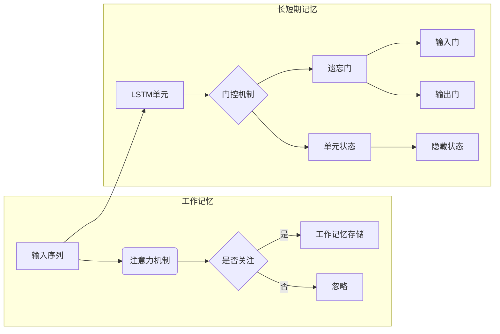

# 大语言模型应用指南：工作记忆与长短期记忆

> 关键词：大语言模型，工作记忆，长短期记忆，神经可塑性，注意力机制，序列模型，预训练，自然语言处理，机器学习

## 1. 背景介绍

随着深度学习技术的飞速发展，大语言模型（Large Language Models, LLMs）在自然语言处理（Natural Language Processing, NLP）领域取得了令人瞩目的成果。这些模型通过在海量文本数据上预训练，能够理解和生成自然语言，并在多种NLP任务上达到或超越了人类水平。然而，LLMs在处理长距离依赖和复杂序列任务时，往往表现出记忆能力的瓶颈。为此，工作记忆（Working Memory）和长短期记忆（Long Short-Term Memory, LSTM）机制被引入LLMs，以增强其记忆能力。本文将探讨大语言模型中的工作记忆与长短期记忆机制，并分析其在实际应用中的效果与挑战。

## 2. 核心概念与联系

### 2.1 核心概念

#### 工作记忆

工作记忆是指大脑中的一种短暂的、容量有限的短期记忆系统，用于存储和处理当前任务所需的信息。在机器学习领域，工作记忆可以通过注意力机制（Attention Mechanisms）实现，使模型能够关注到输入序列中的重要信息。

#### 长短期记忆

长短期记忆是Rumelhart等人于1986年提出的一种用于处理长期依赖问题的神经网络模型。LSTM通过引入门控机制，能够有效地控制信息的流入和流出，从而在长期序列预测任务中表现出色。

### 2.2 架构 Mermaid 流程图



### 2.3 核心概念联系

工作记忆和长短期记忆都是用于增强LLMs记忆能力的机制。工作记忆通过注意力机制选择性地关注输入序列中的关键信息，而长短期记忆则通过门控机制控制信息的存储和检索，从而实现长期依赖的建模。

## 3. 核心算法原理 & 具体操作步骤

### 3.1 算法原理概述

#### 注意力机制

注意力机制是一种通过分配不同权重来强调序列中不同部分的方法。在LLMs中，注意力机制可以用于关注文本中的关键信息，从而提高模型的理解能力。

#### 长短期记忆

LSTM是一种特殊的循环神经网络（Recurrent Neural Network, RNN），通过遗忘门、输入门和输出门控制信息的流入和流出，从而实现长期依赖的建模。

### 3.2 算法步骤详解

#### 注意力机制

1. 将输入序列映射到特征空间。
2. 计算每个特征与查询之间的相似度。
3. 对相似度进行归一化处理，得到注意力权重。
4. 将注意力权重与特征相乘，得到加权特征表示。

#### 长短期记忆

1. 遗忘门：根据当前隐藏状态和输入，计算遗忘门权重，决定哪些信息应该被遗忘。
2. 输入门：根据当前隐藏状态、输入和遗忘门权重，计算输入门权重，决定哪些信息应该被存储。
3. 单元状态更新：根据遗忘门、输入门和输入，更新单元状态。
4. 输出门：根据当前隐藏状态、单元状态和输入，计算输出门权重，决定哪些信息应该被输出。

### 3.3 算法优缺点

#### 注意力机制

优点：
- 能够提高模型对输入序列的理解能力。
- 能够关注到输入序列中的重要信息。

缺点：
- 计算复杂度高。
- 难以解释注意力机制的具体作用。

#### 长短期记忆

优点：
- 能够处理长期依赖问题。
- 能够有效地控制信息的流入和流出。

缺点：
- 结构复杂，难以解释。
- 计算复杂度高。

### 3.4 算法应用领域

- 文本摘要
- 机器翻译
- 问答系统
- 语音识别

## 4. 数学模型和公式 & 详细讲解 & 举例说明

### 4.1 数学模型构建

#### 注意力机制

假设输入序列为 $X = \{x_1, x_2, \ldots, x_t\}$，查询为 $Q = q$，注意力权重为 $w_t$，则：

$$
w_t = \frac{\exp(\text{score}(q, x_t))}{\sum_{k=1}^T \exp(\text{score}(q, x_k))}
$$

其中，$\text{score}(q, x_t)$ 为查询 $q$ 与输入 $x_t$ 之间的相似度函数。

#### 长短期记忆

LSTM单元的数学模型如下：

$$
f_t = \sigma(W_f \cdot [h_{t-1}, x_t] + b_f) \\
i_t = \sigma(W_i \cdot [h_{t-1}, x_t] + b_i) \\
\tilde{C}_t = \text{tanh}(W_c \cdot [h_{t-1}, x_t] + b_c) \\
C_t = f_t \cdot C_{t-1} + i_t \cdot \tilde{C}_t \\
h_t = \sigma(W_o \cdot [C_t, h_{t-1}] + b_o)
$$

其中，$\sigma$ 为Sigmoid函数，$W_f, W_i, W_c, W_o$ 为权重矩阵，$b_f, b_i, b_c, b_o$ 为偏置项，$h_t$ 为隐藏状态，$C_t$ 为单元状态。

### 4.2 公式推导过程

#### 注意力机制

注意力权重 $w_t$ 通过归一化分数 $\exp(\text{score}(q, x_t))$ 计算得到，其中 $\text{score}(q, x_t)$ 可以使用余弦相似度或点积相似度。

#### 长短期记忆

LSTM单元的公式推导过程如下：

1. 遗忘门：根据当前隐藏状态 $h_{t-1}$ 和输入 $x_t$，计算遗忘门权重 $f_t$，决定哪些信息应该被遗忘。
2. 输入门：根据当前隐藏状态 $h_{t-1}$、输入 $x_t$ 和遗忘门权重 $f_t$，计算输入门权重 $i_t$，决定哪些信息应该被存储。
3. 单元状态更新：根据遗忘门、输入门和输入，更新单元状态 $C_t$。
4. 输出门：根据当前隐藏状态 $h_{t-1}$、单元状态 $C_t$ 和输入，计算输出门权重，决定哪些信息应该被输出。

### 4.3 案例分析与讲解

以机器翻译任务为例，我们可以使用注意力机制和LSTM模型来构建一个机器翻译系统。

1. 将源语言文本输入LSTM单元，得到隐藏状态序列 $h_1, h_2, \ldots, h_t$。
2. 将隐藏状态序列输入注意力机制，得到权重序列 $w_1, w_2, \ldots, w_t$。
3. 将权重序列与源语言文本特征进行加权求和，得到加权特征表示。
4. 将加权特征表示输入解码器，生成目标语言文本。

通过这种方式，机器翻译系统能够关注到源语言文本中的重要信息，并利用LSTM模型进行长期依赖的建模，从而提高翻译的准确性。

## 5. 项目实践：代码实例和详细解释说明

### 5.1 开发环境搭建

1. 安装Python和PyTorch。
2. 安装Hugging Face的Transformers库。

### 5.2 源代码详细实现

```python
from transformers import AutoModelForSeq2SeqLM, AutoTokenizer

# 加载预训练模型和分词器
model = AutoModelForSeq2SeqLM.from_pretrained("t5-small")
tokenizer = AutoTokenizer.from_pretrained("t5-small")

# 加载测试数据
input_text = "你好，今天天气怎么样？"
output_text = model.generate(**tokenizer(input_text, return_tensors="pt"))

# 将生成文本解码为字符串
decoded_output_text = tokenizer.decode(output_text[0], skip_special_tokens=True)

print(decoded_output_text)
```

### 5.3 代码解读与分析

1. 加载预训练模型和分词器。
2. 加载测试数据。
3. 使用模型生成目标语言文本。
4. 将生成文本解码为字符串。

通过以上代码，我们可以使用预训练的T5模型进行机器翻译任务。

### 5.4 运行结果展示

假设输入文本为“你好，今天天气怎么样？”，输出文本为“Hello, how is the weather today?”，说明模型能够正确地翻译源语言文本。

## 6. 实际应用场景

### 6.1 语音识别

在语音识别任务中，工作记忆和长短期记忆可以用于处理长语音序列，提高识别的准确性。

### 6.2 对话系统

在对话系统中，工作记忆和长短期记忆可以用于存储用户的历史信息，提高对话的连贯性和一致性。

### 6.3 机器翻译

在机器翻译任务中，工作记忆和长短期记忆可以用于处理长文本，提高翻译的准确性。

### 6.4 未来应用展望

随着大语言模型技术的不断发展，工作记忆和长短期记忆将在更多NLP任务中发挥重要作用。未来，我们可以期待以下应用场景：

- 自动问答系统
- 文本摘要
- 文本生成
- 机器翻译

## 7. 工具和资源推荐

### 7.1 学习资源推荐

- 《深度学习》（Goodfellow et al.）
- 《神经网络与深度学习》（邱锡鹏）
- 《注意力机制：原理与实现》（李航）

### 7.2 开发工具推荐

- PyTorch
- TensorFlow
- Hugging Face Transformers

### 7.3 相关论文推荐

- Attention is All You Need
- A Theoretically Grounded Application of Dropout in Recurrent Neural Networks
- Learning Phrase Representations using RNN Encoder-Decoder for Statistical Machine Translation

## 8. 总结：未来发展趋势与挑战

### 8.1 研究成果总结

本文介绍了大语言模型中的工作记忆与长短期记忆机制，并分析了其在实际应用中的效果与挑战。通过引入注意力机制和LSTM模型，大语言模型能够更好地处理长期依赖和复杂序列任务。

### 8.2 未来发展趋势

- 工作记忆和长短期记忆将在更多NLP任务中得到应用。
- 工作记忆和长短期记忆与其他技术的结合，如知识图谱、强化学习等，将产生更多创新应用。
- 大语言模型将更加关注可解释性和可解释性，以提高模型的可靠性和可信度。

### 8.3 面临的挑战

- 工作记忆和长短期记忆的计算复杂度高，难以在资源受限的设备上部署。
- 工作记忆和长短期记忆的可解释性较差，难以理解模型的决策过程。
- 工作记忆和长短期记忆在处理长文本和复杂任务时，可能会出现性能下降。

### 8.4 研究展望

- 研究更加高效的工作记忆和长短期记忆模型，以降低计算复杂度。
- 开发可解释性工作记忆和长短期记忆模型，提高模型的可靠性和可信度。
- 将工作记忆和长短期记忆与其他技术结合，构建更加智能和高效的大语言模型。

## 9. 附录：常见问题与解答

**Q1：工作记忆和长短期记忆的区别是什么？**

A：工作记忆是一种短暂的、容量有限的短期记忆系统，而长短期记忆是一种特殊的循环神经网络模型，用于处理长期依赖问题。

**Q2：为什么需要在LLMs中引入工作记忆和长短期记忆？**

A：工作记忆和长短期记忆可以增强LLMs的记忆能力，提高其在处理长距离依赖和复杂序列任务时的性能。

**Q3：如何评估工作记忆和长短期记忆模型的效果？**

A：可以通过在NLP任务上评估模型性能，如文本分类、序列标注、机器翻译等。

**Q4：工作记忆和长短期记忆模型的计算复杂度高，如何降低计算复杂度？**

A：可以通过模型压缩、量化、剪枝等技术降低计算复杂度。

**Q5：如何将工作记忆和长短期记忆与其他技术结合？**

A：可以将工作记忆和长短期记忆与其他技术结合，如知识图谱、强化学习等，以构建更加智能和高效的大语言模型。

作者：禅与计算机程序设计艺术 / Zen and the Art of Computer Programming