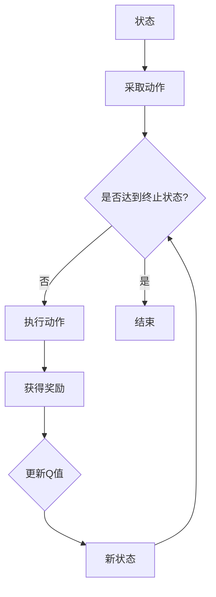

> 强化学习，Q-learning，值函数，策略，探索与利用，状态-动作空间，奖励函数，epsilon-greedy策略，深度学习，函数近似

# 强化学习算法：Q-learning 原理与代码实例讲解

强化学习是机器学习中一个重要的分支，它使机器能够通过与环境的交互来学习如何采取最优动作。Q-learning 是强化学习中最基本的算法之一，它通过学习状态-动作值函数来指导决策。本文将深入探讨 Q-learning 的原理，并通过代码实例进行详细讲解。

## 1. 背景介绍

### 1.1 问题的由来

在现实世界中，许多决策问题都可以被建模为强化学习问题。例如，机器人路径规划、游戏AI、自动驾驶汽车等。强化学习的目标是找到一个策略，使得智能体在一系列状态中采取的动作能够最大化累积奖励。

### 1.2 研究现状

近年来，强化学习在学术界和工业界都取得了显著进展。Q-learning、Deep Q-Network (DQN) 等算法的成功，使得强化学习在多个领域得到了应用。

### 1.3 研究意义

理解和掌握 Q-learning 算法对于学习和应用强化学习至关重要。Q-learning 简单易实现，且能够有效地解决许多强化学习问题。

### 1.4 本文结构

本文将按照以下结构进行讲解：

- 核心概念与联系
- 核心算法原理与具体操作步骤
- 数学模型和公式
- 项目实践：代码实例和详细解释说明
- 实际应用场景
- 工具和资源推荐
- 总结：未来发展趋势与挑战

## 2. 核心概念与联系

### 2.1 核心概念

- **状态 (State)**：智能体所处的环境中的某个特定情况。
- **动作 (Action)**：智能体可以采取的行动。
- **奖励 (Reward)**：智能体采取某个动作后，从环境中获得的奖励。
- **策略 (Policy)**：智能体在特定状态下采取的动作选择规则。
- **价值函数 (Value Function)**：在特定状态下，采取所有可能动作的期望奖励值。

### 2.2 架构的 Mermaid 流程图



## 3. 核心算法原理 & 具体操作步骤

### 3.1 算法原理概述

Q-learning 是一种无模型、非贪婪的强化学习算法。它通过迭代更新状态-动作值函数 $Q(s, a)$ 来指导智能体的行为。

### 3.2 算法步骤详解

1. **初始化**：初始化值函数 $Q(s, a)$ 为随机值，设置学习率 $\alpha$，折扣因子 $\gamma$，探索率 $\epsilon$。
2. **选择动作**：在当前状态下，以 $\epsilon$ 的概率随机选择动作，以 $1-\epsilon$ 的概率选择最大 Q 值的动作。
3. **执行动作**：执行选定的动作，并获取奖励。
4. **更新 Q 值**：根据奖励和下一个状态更新 Q 值。
5. **迭代**：重复步骤 2-4，直到达到终止状态。

### 3.3 算法优缺点

**优点**：

- 简单易实现。
- 不需要环境模型。
- 能够处理离散和连续动作空间。

**缺点**：

- 可能陷入局部最优。
- 学习速度较慢。

### 3.4 算法应用领域

Q-learning 在多个领域都有应用，包括：

- 机器人路径规划
- 游戏AI
- 自动驾驶
- 交易策略

## 4. 数学模型和公式 & 详细讲解 & 举例说明

### 4.1 数学模型构建

Q-learning 的目标是学习状态-动作值函数 $Q(s, a)$，它表示在状态 $s$ 下采取动作 $a$ 的期望回报。

$$
Q(s, a) = \sum_{s' \in S} P(s' | s, a) R(s, a, s')
$$

其中，$P(s' | s, a)$ 是在状态 $s$ 下采取动作 $a$ 后转移到状态 $s'$ 的概率，$R(s, a, s')$ 是在状态 $s$ 下采取动作 $a$ 后获得的奖励。

### 4.2 公式推导过程

Q-learning 的更新公式如下：

$$
Q(s, a) \leftarrow Q(s, a) + \alpha [R(s, a, s') + \gamma \max_{a'} Q(s', a') - Q(s, a)]
$$

其中，$R(s, a, s')$ 是在状态 $s$ 下采取动作 $a$ 后获得的奖励，$\gamma$ 是折扣因子，$\alpha$ 是学习率，$\max_{a'} Q(s', a')$ 是在状态 $s'$ 下采取所有可能动作的最大 Q 值。

### 4.3 案例分析与讲解

假设一个简单的强化学习环境，智能体可以处于三个状态（S1, S2, S3），每个状态有三种动作（U, D, R），每个动作对应一个奖励（1, -1, 0）。智能体的目标是最大化累积奖励。

我们可以使用以下表格来表示状态-动作值函数 $Q(s, a)$：

| 状态 | 动作 U | 动作 D | 动作 R |
|------|--------|--------|--------|
| S1   | 1      | -1     | 0      |
| S2   | 0      | 0      | 1      |
| S3   | 0      | 1      | -1     |

在初始状态下，我们可以随机初始化 $Q(s, a)$ 为 0。然后，智能体开始与环境交互，并更新 $Q(s, a)$。

假设智能体首先处于状态 S1，它以 $\epsilon$ 的概率选择动作 U，以 $1-\epsilon$ 的概率选择动作 R。它执行动作 U 并获得奖励 1。然后，它进入状态 S2。

根据 Q-learning 的更新公式，我们可以计算 $Q(s, a)$：

$$
Q(S1, U) \leftarrow Q(S1, U) + \alpha [1 + \gamma \max_{a'} Q(S2, a')]
$$

由于 $\max_{a'} Q(S2, a') = 1$，我们可以得到：

$$
Q(S1, U) \leftarrow Q(S1, U) + \alpha [1 + \gamma]
$$

重复此过程，我们可以计算出所有状态-动作值函数的值。

## 5. 项目实践：代码实例和详细解释说明

### 5.1 开发环境搭建

为了演示 Q-learning 算法，我们将使用 Python 编写一个简单的环境。你需要安装以下库：

- NumPy
- Matplotlib

可以使用以下命令安装所需的库：

```bash
pip install numpy matplotlib
```

### 5.2 源代码详细实现

以下是一个简单的 Q-learning 环境和 Q-learning 算法的 Python 实现示例：

```python
import numpy as np
import matplotlib.pyplot as plt

# 状态-动作空间
states = np.array([[0, 0], [0, 1], [1, 0], [1, 1]])
actions = np.array([[0, 0], [0, 1], [1, 0], [1, 1]])
rewards = np.array([[1, -1], [0, 0], [0, -1], [0, 0]])

# 初始化 Q 表
Q = np.zeros((len(states), len(actions)))

# 参数设置
alpha = 0.1  # 学习率
gamma = 0.9  # 折扣因子
epsilon = 0.1  # 探索率

# 迭代次数
episodes = 1000

# Q-learning 算法
for episode in range(episodes):
    state = np.random.choice(states)
    done = False
    while not done:
        action = np.random.choice(actions) if np.random.random() < epsilon else np.argmax(Q[state])
        next_state, reward, done = get_next_state_and_reward(state, action)
        Q[state, action] = Q[state, action] + alpha * (reward + gamma * np.max(Q[next_state]) - Q[state, action])
        state = next_state

# 绘制 Q 表
plt.imshow(Q, cmap='viridis')
plt.colorbar()
plt.show()
```

### 5.3 代码解读与分析

- 我们定义了一个状态-动作空间，其中包含四个状态和四个动作。
- 我们定义了一个奖励矩阵，其中每个元素表示在对应的状态和动作下获得的奖励。
- 我们初始化了一个 Q 表，用于存储状态-动作值函数。
- 我们设置了学习率、折扣因子和探索率。
- 我们运行了 1000 次迭代，每次迭代智能体都会与环境交互，并更新 Q 表。
- 最后，我们使用 Matplotlib 绘制了 Q 表。

### 5.4 运行结果展示

运行上述代码后，你会看到 Q 表的图像，它显示了每个状态-动作对的值函数。

## 6. 实际应用场景

Q-learning 在多个领域都有实际应用，以下是一些例子：

- **机器人路径规划**：Q-learning 可以用于机器人路径规划，帮助机器人选择最佳的路径来避免障碍物。
- **游戏AI**：Q-learning 可以用于游戏AI，帮助智能体学习如何玩游戏。
- **自动驾驶**：Q-learning 可以用于自动驾驶，帮助自动驾驶汽车学习如何做出最佳决策。

## 7. 工具和资源推荐

### 7.1 学习资源推荐

- 《Reinforcement Learning: An Introduction》
- 《Artificial Intelligence: A Modern Approach》
- 《Reinforcement Learning: A Practitioner's Guide》

### 7.2 开发工具推荐

- OpenAI Gym：一个开源的环境库，用于开发强化学习算法。
- TensorFlow：一个开源的机器学习框架，可以用于实现强化学习算法。
- PyTorch：另一个开源的机器学习框架，同样可以用于实现强化学习算法。

### 7.3 相关论文推荐

- "Q-Learning" by Richard S. Sutton and Andrew G. Barto
- "Deep Q-Network" by Volodymyr Mnih et al.
- "Human-level control through deep reinforcement learning" by Volodymyr Mnih et al.

## 8. 总结：未来发展趋势与挑战

### 8.1 研究成果总结

Q-learning 是强化学习中的一个基本算法，它通过学习状态-动作值函数来指导决策。Q-learning 在多个领域都有应用，并且是开发更复杂强化学习算法的基础。

### 8.2 未来发展趋势

- **深度学习与强化学习结合**：将深度学习技术应用于强化学习，以提高学习效率和性能。
- **多智能体强化学习**：研究多个智能体在复杂环境中协作或竞争的算法。
- **强化学习在现实世界中的应用**：将强化学习应用于现实世界中的问题，如机器人、自动驾驶、游戏等。

### 8.3 面临的挑战

- **稳定性**：如何确保强化学习算法在复杂环境中稳定运行。
- **可解释性**：如何解释强化学习算法的决策过程。
- **样本效率**：如何提高强化学习算法的样本效率。

### 8.4 研究展望

Q-learning 作为强化学习中的一个基本算法，将继续在学术界和工业界得到研究和发展。随着技术的进步，Q-learning 及其变体将在更多领域得到应用。

## 9. 附录：常见问题与解答

**Q1：Q-learning 和其他强化学习算法有什么区别？**

A: Q-learning 是一种基于值函数的强化学习算法，它通过学习状态-动作值函数来指导决策。其他强化学习算法，如策略梯度算法，直接学习策略函数。

**Q2：Q-learning 如何避免过拟合？**

A: Q-learning 通过更新策略来避免过拟合。当奖励信号变得饱和时，Q-learning 会逐渐收敛到最佳策略。

**Q3：Q-learning 是否可以处理连续动作空间？**

A: Q-learning 通常用于离散动作空间。对于连续动作空间，可以使用一些技术，如函数近似，来处理。

**Q4：Q-learning 是否可以用于多智能体强化学习？**

A: Q-learning 可以用于多智能体强化学习，但需要扩展到多智能体环境。

**Q5：Q-learning 是否可以用于实际应用？**

A: Q-learning 可以用于实际应用，但可能需要与其他技术结合，如函数近似和深度学习。

作者：禅与计算机程序设计艺术 / Zen and the Art of Computer Programming