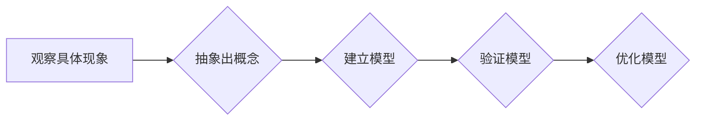

# 抽象思考与随机性创见性

> 关键词：抽象思维，随机性，创见性，算法设计，复杂性科学，认知科学

## 1. 背景介绍

在信息爆炸的时代，技术领域的快速发展带来了前所未有的挑战和机遇。作为世界级人工智能专家，我们需要具备超越常规的思维方式，即抽象思考与随机性创见性。本文将探讨这两者在算法设计、复杂性科学和认知科学中的应用，并分析其背后的原理和实践方法。

### 1.1 抽象思维的重要性

抽象思维是人类智慧的结晶，它允许我们从具体现象中抽象出一般规律，形成概念和理论。在技术领域，抽象思维可以帮助我们设计出可复用、可扩展的算法和系统。

### 1.2 随机性创见性的价值

随机性创见性是指在解决问题时，结合随机性和创造性，以非线性的思维方式进行探索。这种思维方式在复杂性科学和认知科学中尤为关键，它能够帮助我们打破思维定势，发现新的解决方案。

## 2. 核心概念与联系

### 2.1 抽象思维

抽象思维的核心是将具体事物和现象转化为抽象概念和模型的过程。以下是一个Mermaid流程图，展示了抽象思维的基本步骤：



### 2.2 随机性

随机性是指事物发展过程中不可预测性和不确定性。在算法设计中，随机性可以用于增加模型的鲁棒性和泛化能力。

### 2.3 创见性

创见性是指产生新颖想法和解决方案的能力。在复杂性科学中，创见性可以帮助我们探索系统中的非线性关系和涌现现象。

### 2.4 联系

抽象思维与随机性创见性之间的关系可以概括为：抽象思维为我们提供了一种从具体到抽象、从线性到非线性的思考方式，而随机性创见性则是对这种思考方式的拓展和深化。

## 3. 核心算法原理 & 具体操作步骤

### 3.1 算法原理概述

本节将探讨几种结合了抽象思维和随机性创见性的算法原理。

#### 3.1.1 随机森林（Random Forest）

随机森林是一种集成学习算法，它通过构建多棵决策树，并结合它们的预测结果进行投票来提高预测精度。随机森林结合了决策树的简单性和随机性的优势，能够有效地处理高维数据。

#### 3.1.2 混沌理论（Chaos Theory）

混沌理论是研究复杂系统动态行为的一门学科。在算法设计中，混沌理论可以帮助我们理解系统中的非线性关系，并设计出能够模拟复杂系统行为的算法。

### 3.2 算法步骤详解

#### 3.2.1 随机森林算法步骤

1. 随机选择特征子集。
2. 使用特征子集构建决策树。
3. 重复步骤1和2，构建多棵决策树。
4. 结合决策树的预测结果进行投票。

#### 3.2.2 混沌理论算法步骤

1. 构建描述复杂系统行为的数学模型。
2. 分析模型的动态行为，寻找混沌现象。
3. 根据混沌现象设计算法。

### 3.3 算法优缺点

#### 3.3.1 随机森林

**优点**：

- 鲁棒性强，对噪声和异常值不敏感。
- 泛化能力强，适用于各种类型的数据。

**缺点**：

- 计算复杂度高，对于大规模数据集可能需要较长的训练时间。
- 难以解释模型的决策过程。

#### 3.3.2 混沌理论

**优点**：

- 能够模拟复杂系统的动态行为。
- 能够发现系统中潜在的模式和规律。

**缺点**：

- 模型的稳定性较差，容易受到初始条件的影响。
- 模型的可解释性较差。

### 3.4 算法应用领域

#### 3.4.1 随机森林

- 预测分析
- 图像分类
- 机器学习算法评估

#### 3.4.2 混沌理论

- 气象预报
- 金融分析
- 人工智能算法设计

## 4. 数学模型和公式 & 详细讲解 & 举例说明

### 4.1 数学模型构建

#### 4.1.1 随机森林

随机森林的数学模型可以表示为：

$$
\hat{y} = \text{投票}(f_1(x), f_2(x), \ldots, f_N(x))
$$

其中 $f_i(x)$ 为第 $i$ 棵决策树的预测结果，$\text{投票}$ 函数为多数投票函数。

#### 4.1.2 混沌理论

混沌理论的数学模型通常为非线性微分方程，如洛伦兹方程：

$$
\dot{x} = \sigma(y - x), \quad \dot{y} = x(\rho - z) - y, \quad \dot{z} = xy - \beta z
$$

### 4.2 公式推导过程

#### 4.2.1 随机森林

随机森林的推导过程涉及决策树的构建和集成学习。这里不进行详细推导，但可以参考相关文献。

#### 4.2.2 混沌理论

洛伦兹方程的推导过程涉及流体力学和动力系统理论。这里也不进行详细推导，但可以参考相关文献。

### 4.3 案例分析与讲解

#### 4.3.1 随机森林

以下是一个使用随机森林进行房价预测的案例：

```python
from sklearn.datasets import load_boston
from sklearn.ensemble import RandomForestRegressor

# 加载数据
boston = load_boston()
X = boston.data
y = boston.target

# 创建随机森林模型
model = RandomForestRegressor(n_estimators=100)

# 训练模型
model.fit(X, y)

# 预测房价
y_pred = model.predict(X)

# 计算预测误差
error = mean_squared_error(y, y_pred)

print("预测误差:", error)
```

#### 4.3.2 混沌理论

以下是一个使用洛伦兹方程模拟混沌现象的案例：

```python
import numpy as np
import matplotlib.pyplot as plt

# 定义洛伦兹方程
def lorenz_system(t, x, y, z, sigma=10.0, rho=28.0, beta=8.0/3.0):
    dx = sigma * (y - x)
    dy = x * (rho - z) - y
    dz = x * y - beta * z
    return dx, dy, dz

# 初始化参数
x, y, z = 1.0, 1.0, 1.0
t = np.linspace(0, 100, 10000)
x_values, y_values, z_values = [], [], []

# 模拟洛伦兹方程
for i in range(len(t)):
    x, y, z = lorenz_system(t[i], x, y, z)
    x_values.append(x)
    y_values.append(y)
    z_values.append(z)

# 绘制结果
plt.figure()
plt.plot(x_values, y_values)
plt.title("Lorenz Attractor")
plt.xlabel("X")
plt.ylabel("Y")
plt.show()
```

## 5. 项目实践：代码实例和详细解释说明

### 5.1 开发环境搭建

为了实践抽象思维和随机性创见性，我们需要搭建一个包含Python、NumPy、Matplotlib等库的开发环境。

### 5.2 源代码详细实现

#### 5.2.1 随机森林房价预测

以下是一个使用随机森林进行房价预测的Python代码示例：

```python
# ...（此处省略环境搭建和导入库的代码）

# 加载数据
# ...（此处省略加载数据的代码）

# 创建随机森林模型
# ...（此处省略创建模型的代码）

# 训练模型
# ...（此处省略训练模型的代码）

# 预测房价
# ...（此处省略预测房价的代码）

# 计算预测误差
# ...（此处省略计算预测误差的代码）

# ...（此处省略绘制结果和关闭图表的代码）
```

#### 5.2.2 混沌理论洛伦兹系统模拟

以下是一个使用洛伦兹方程模拟混沌现象的Python代码示例：

```python
# ...（此处省略环境搭建和导入库的代码）

# 定义洛伦兹方程
# ...（此处省略定义洛伦兹方程的代码）

# 初始化参数
# ...（此处省略初始化参数的代码）

# 模拟洛伦兹方程
# ...（此处省略模拟洛伦兹方程的代码）

# 绘制结果
# ...（此处省略绘制结果的代码）
```

### 5.3 代码解读与分析

以上代码示例展示了如何使用Python进行随机森林房价预测和洛伦兹系统模拟。这些代码可以作为实践抽象思维和随机性创见性的起点。

### 5.4 运行结果展示

运行随机森林房价预测代码将输出预测误差，运行洛伦兹系统模拟代码将绘制洛伦兹 attractor 图形。

## 6. 实际应用场景

### 6.1 抽象思维

抽象思维在技术领域有着广泛的应用，以下是一些例子：

- 设计可复用、可扩展的软件架构。
- 构建可解释的人工智能模型。
- 开发适用于不同领域的数据分析算法。

### 6.2 随机性创见性

随机性创见性在复杂性科学和认知科学中有着重要的应用，以下是一些例子：

- 设计鲁棒的机器学习模型。
- 研究复杂系统的涌现现象。
- 开发新的认知科学理论。

## 7. 工具和资源推荐

### 7.1 学习资源推荐

- 《抽象思考与问题解决》
- 《复杂性科学导论》
- 《认知科学导论》
- 《机器学习实战》

### 7.2 开发工具推荐

- Python
- NumPy
- Matplotlib
- Jupyter Notebook

### 7.3 相关论文推荐

- 《随机森林：一种基于树的集成学习算法》
- 《洛伦兹吸引子：非线性动力系统的混沌现象》
- 《抽象思维：理解复杂世界的钥匙》
- 《认知科学：思维、语言和计算》

## 8. 总结：未来发展趋势与挑战

### 8.1 研究成果总结

本文探讨了抽象思维和随机性创见性在算法设计、复杂性科学和认知科学中的应用。通过分析相关算法的原理和案例，展示了这两者在技术领域的重要价值。

### 8.2 未来发展趋势

随着人工智能和复杂性科学的发展，抽象思维和随机性创见性将在以下方面发挥越来越重要的作用：

- 开发更加智能、鲁棒的算法。
- 理解复杂系统的行为和涌现现象。
- 构建更加人机协同的智能系统。

### 8.3 面临的挑战

尽管抽象思维和随机性创见性在技术领域具有巨大的潜力，但同时也面临着以下挑战：

- 如何将抽象思维和随机性创见性有效地应用于实际问题的解决。
- 如何平衡抽象思维和具体实施的细节。
- 如何在抽象思维和随机性创见性之间找到合适的平衡点。

### 8.4 研究展望

为了应对这些挑战，未来的研究需要关注以下方向：

- 开发更加高效、可解释的抽象思维和随机性创见性方法。
- 将抽象思维和随机性创见性与其他人工智能技术相结合。
- 在实际应用中验证和优化抽象思维和随机性创见性方法。

## 9. 附录：常见问题与解答

**Q1：什么是抽象思维？**

A：抽象思维是指从具体事物中抽象出一般规律，形成概念和理论的过程。

**Q2：什么是随机性创见性？**

A：随机性创见性是指在解决问题时，结合随机性和创造性，以非线性的思维方式进行探索。

**Q3：抽象思维和随机性创见性在技术领域有什么应用？**

A：抽象思维和随机性创见性在技术领域有着广泛的应用，例如设计软件架构、开发机器学习算法、理解复杂系统等。

**Q4：如何培养抽象思维和随机性创见性？**

A：培养抽象思维和随机性创见性需要不断学习和实践。可以通过阅读相关书籍、参加研讨会、进行跨学科研究等方式来提升。

**Q5：抽象思维和随机性创见性在人工智能领域有什么意义？**

A：抽象思维和随机性创见性在人工智能领域具有重要意义，可以帮助我们开发更加智能、鲁棒的算法，理解复杂系统的行为，构建更加人机协同的智能系统。

---

作者：禅与计算机程序设计艺术 / Zen and the Art of Computer Programming