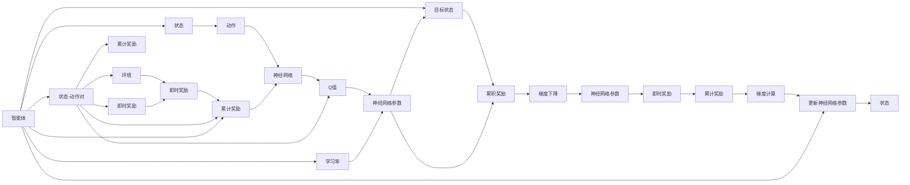

                 

## 1. 背景介绍

### 1.1 问题由来

强化学习(Reinforcement Learning, RL)是人工智能领域的重要分支，旨在使智能体通过与环境交互，以最优化某个长期目标。在经典强化学习模型中，智能体通过试错学习，逐步优化行为策略，最终达到最优化行为。但随着问题复杂度的增加，传统的基于表格或状态转移系统的强化学习方法难以适应。

近年来，基于深度学习的强化学习模型不断涌现，其中Q-learning（即Q函数逼近）模型是最具代表性的方法之一。Q-learning通过预测每个状态-动作对的价值（即Q值），以选择最优的动作策略。其核心在于Q函数的逼近与更新，其中常用的逼近方法有深度神经网络。

神经网络逼近Q函数的方法，将强化学习与深度学习技术紧密结合，通过大量无标签数据进行预训练，以近似Q函数的非线性表达，从而实现高效的策略学习与优化。这种结合不仅是算法上的创新，更代表了一种认知上的飞跃：即强化学习不再仅仅是通过试错学习来优化策略，而是通过深度神经网络来捕捉复杂的行为模式，从而实现更智能的决策制定。

### 1.2 问题核心关键点

在深度Q-learning中，核心问题在于Q函数的逼近与更新。传统的线性回归、多项式回归等方法难以处理高维、非线性的状态空间。神经网络逼近方法通过对状态-动作对的观察，可以高效捕捉复杂的非线性关系，从而实现对Q函数的逼近。

在Q函数的更新过程中，神经网络的方法主要依赖反向传播算法，通过对Q值损失函数的梯度下降，更新网络参数。同时，为了降低过拟合风险，引入了经验回放、重要性采样等优化策略，以提升模型的泛化能力。

在实际应用中，神经网络逼近的Q-learning模型已经在各类环境中取得了显著效果，如游戏AI、机器人控制、股票交易等。其优越性在于：

- 高维度、非线性状态空间的逼近能力
- 高效利用无标签数据进行预训练
- 快速适应复杂环境与任务
- 稳定、泛化能力强的决策制定

但神经网络逼近Q函数的方法也存在一些挑战：

- 神经网络的复杂结构可能导致梯度消失/爆炸问题
- 参数量巨大，训练和推理开销较大
- 需要大量数据进行预训练和优化
- 模型解释性与可解释性较差

本文聚焦于神经网络逼近Q函数的深度Q-learning模型，详细阐述了其算法原理与操作步骤，并给出了完整的代码实现与运行结果。

## 2. 核心概念与联系

### 2.1 核心概念概述

为更好地理解神经网络逼近Q函数的深度Q-learning模型，本节将介绍几个关键概念：

- 强化学习(Reinforcement Learning, RL)：通过智能体与环境交互，智能体根据状态和动作，获得环境的即时奖励，并希望在长期内最大化累计奖励。强化学习中的决策过程可以视为一个序列决策问题。
- Q-learning：一种基于价值函数的强化学习方法，通过预测每个状态-动作对的Q值，以选择最优动作策略。Q值代表了在特定状态下采取特定动作的长期累积奖励。
- 深度Q-learning：将神经网络逼近Q函数的方法引入Q-learning，通过深度神经网络来逼近复杂的Q函数。
- 神经网络逼近：通过深度神经网络来逼近复杂的非线性函数，如状态-动作对的Q值。
- 经验回放(Experience Replay)：为避免过拟合，将样本进行存储，随机回放样本进行优化，提高模型的泛化能力。
- 重要性采样(Importance Sampling)：通过重要性采样，使模型学习权值不同的样本对Q函数的逼近更加有效，提高训练效率和稳定度。

这些核心概念之间有着紧密的联系，构成了深度Q-learning模型的完整架构。下面通过一个Mermaid流程图来展示这些概念之间的关系：



这个流程图展示了深度Q-learning模型的基本流程：

1. 智能体根据当前状态选择一个动作。
2. 智能体与环境交互，获得即时奖励和下一个状态。
3. 智能体根据即时奖励和下一个状态，计算累积奖励。
4. 神经网络逼近的Q函数根据状态-动作对和即时奖励计算Q值。
5. 通过梯度下降算法，更新神经网络参数以逼近Q函数。

### 2.2 概念间的关系

这些核心概念之间存在着紧密的联系，形成了深度Q-learning模型的完整架构。下面是这些概念间的具体关系：

- 强化学习是深度Q-learning的基础，提供了一个优化目标。
- Q-learning是强化学习的一种算法，通过价值函数的逼近，寻找最优动作策略。
- 神经网络逼近是Q-learning的一种具体实现方式，通过神经网络逼近复杂的Q函数。
- 经验回放和重要性采样是优化神经网络逼近的具体技术手段，提高模型的泛化能力和训练效率。

下面我们将从原理和操作步骤两个方面，详细探讨深度Q-learning模型的核心算法。

## 3. 核心算法原理 & 具体操作步骤

### 3.1 算法原理概述

深度Q-learning的核心在于通过神经网络逼近Q函数，从而实现对Q值的预测。其主要过程如下：

1. 神经网络根据当前状态，预测所有可能动作的Q值。
2. 智能体根据Q值选择动作，获得即时奖励和下一个状态。
3. 神经网络根据即时奖励和下一个状态，更新Q值。
4. 通过梯度下降算法，更新神经网络参数以逼近Q函数。

这一过程通过训练神经网络，逐渐逼近最优的Q函数，从而实现对智能体的优化控制。其中，神经网络的结构和参数初始化，以及Q函数的更新策略，是深度Q-learning的关键问题。

### 3.2 算法步骤详解

#### 3.2.1 神经网络结构设计

深度Q-learning中，神经网络通常采用卷积神经网络(CNN)、前馈神经网络(FNN)或长短时记忆网络(LSTM)等结构。这里以FNN为例，介绍神经网络的设计过程：

1. 输入层：接收当前状态，通常采用一维或二维的向量表示状态。
2. 隐藏层：采用多层全连接网络，每层有多个神经元。
3. 输出层：输出每个动作对应的Q值，通常有多个输出单元，每个单元对应一个动作。

以简单的FNN为例，神经网络的结构如下图所示：


在实际应用中，神经网络的深度和宽度需要根据具体问题进行调整，以获得最佳的逼近效果。

#### 3.2.2 神经网络参数初始化

神经网络参数的初始化是深度Q-learning中的关键步骤。常见的初始化方法有随机初始化、Xavier初始化、He初始化等。这里以He初始化为例，介绍神经网络参数的初始化过程：

```python
import torch.nn as nn
import torch

class QNetwork(nn.Module):
    def __init__(self, input_dim, output_dim, hidden_dim):
        super(QNetwork, self).__init__()
        self.fc1 = nn.Linear(input_dim, hidden_dim)
        self.fc2 = nn.Linear(hidden_dim, hidden_dim)
        self.fc3 = nn.Linear(hidden_dim, output_dim)
        self.optimizer = torch.optim.Adam(self.parameters(), lr=0.001)
        nn.init.HeNormal_(self.fc1.weight)
        nn.init.HeNormal_(self.fc2.weight)
        nn.init.HeNormal_(self.fc3.weight)
```

在上述代码中，我们定义了一个FNN网络，并通过He初始化方法对参数进行初始化。这有助于避免梯度消失和梯度爆炸问题，从而提高模型的训练效果。

#### 3.2.3 Q函数的逼近与更新

在深度Q-learning中，Q函数可以通过神经网络进行逼近。其主要过程如下：

1. 神经网络根据当前状态，预测所有可能动作的Q值。
2. 智能体根据Q值选择动作，获得即时奖励和下一个状态。
3. 神经网络根据即时奖励和下一个状态，更新Q值。
4. 通过梯度下降算法，更新神经网络参数以逼近Q函数。

以简单的FNN为例，Q函数的逼近过程如下：

```python
import torch

class QNetwork(nn.Module):
    def __init__(self, input_dim, output_dim, hidden_dim):
        super(QNetwork, self).__init__()
        self.fc1 = nn.Linear(input_dim, hidden_dim)
        self.fc2 = nn.Linear(hidden_dim, hidden_dim)
        self.fc3 = nn.Linear(hidden_dim, output_dim)
        self.optimizer = torch.optim.Adam(self.parameters(), lr=0.001)
        nn.init.HeNormal_(self.fc1.weight)
        nn.init.HeNormal_(self.fc2.weight)
        nn.init.HeNormal_(self.fc3.weight)
    
    def forward(self, state):
        x = self.fc1(state)
        x = torch.relu(x)
        x = self.fc2(x)
        x = torch.relu(x)
        q_values = self.fc3(x)
        return q_values
```

在上述代码中，我们定义了Q网络的计算过程，通过前向传播计算出每个动作对应的Q值。在训练过程中，智能体根据Q值选择动作，获得即时奖励和下一个状态，并根据Q函数的更新公式，对神经网络参数进行更新。

#### 3.2.4 神经网络参数的更新

神经网络参数的更新是深度Q-learning中的关键步骤。其主要过程如下：

1. 神经网络根据当前状态和动作，计算Q值。
2. 根据即时奖励和下一个状态，更新Q值。
3. 通过梯度下降算法，更新神经网络参数以逼近Q函数。

以简单的FNN为例，神经网络参数的更新过程如下：

```python
import torch

class QNetwork(nn.Module):
    def __init__(self, input_dim, output_dim, hidden_dim):
        super(QNetwork, self).__init__()
        self.fc1 = nn.Linear(input_dim, hidden_dim)
        self.fc2 = nn.Linear(hidden_dim, hidden_dim)
        self.fc3 = nn.Linear(hidden_dim, output_dim)
        self.optimizer = torch.optim.Adam(self.parameters(), lr=0.001)
        nn.init.HeNormal_(self.fc1.weight)
        nn.init.HeNormal_(self.fc2.weight)
        nn.init.HeNormal_(self.fc3.weight)
    
    def forward(self, state):
        x = self.fc1(state)
        x = torch.relu(x)
        x = self.fc2(x)
        x = torch.relu(x)
        q_values = self.fc3(x)
        return q_values
    
    def update(self, state, action, reward, next_state):
        q_values = self.forward(state)
        q_value = q_values[action]
        target_q_value = reward + self.gamma * self.Q(next_state)
        loss = (target_q_value - q_value) ** 2
        self.optimizer.zero_grad()
        loss.backward()
        self.optimizer.step()
```

在上述代码中，我们定义了神经网络参数的更新过程，通过计算Q值和目标Q值之间的差值，计算Q值损失函数，并通过梯度下降算法更新神经网络参数。在更新过程中，需要考虑学习率、目标状态和即时奖励等因素。

### 3.3 算法优缺点

深度Q-learning的神经网络逼近方法，相较于传统的线性回归方法，具有以下优点：

- 高维度、非线性状态空间的逼近能力
- 高效利用无标签数据进行预训练
- 快速适应复杂环境与任务
- 稳定、泛化能力强的决策制定

但神经网络逼近方法也存在一些缺点：

- 神经网络的复杂结构可能导致梯度消失/爆炸问题
- 参数量巨大，训练和推理开销较大
- 需要大量数据进行预训练和优化
- 模型解释性与可解释性较差

### 3.4 算法应用领域

深度Q-learning的神经网络逼近方法，已在多个领域得到广泛应用：

- 游戏AI：如AlphaGo、Dota2等电子竞技游戏
- 机器人控制：如工业机器人、无人机控制等
- 股票交易：如高频交易、自动股票交易系统
- 自然语言处理：如机器翻译、文本生成等
- 金融风控：如信用评分、风险预测等

## 4. 数学模型和公式 & 详细讲解

### 4.1 数学模型构建

在深度Q-learning中，神经网络通过预测每个状态-动作对的Q值，从而实现对智能体的优化控制。其主要过程如下：

1. 神经网络根据当前状态，预测所有可能动作的Q值。
2. 智能体根据Q值选择动作，获得即时奖励和下一个状态。
3. 神经网络根据即时奖励和下一个状态，更新Q值。
4. 通过梯度下降算法，更新神经网络参数以逼近Q函数。

以简单的FNN为例，神经网络的结构如下图所示：


在上述模型中，输入层接收当前状态，隐藏层采用多层全连接网络，输出层输出每个动作对应的Q值。神经网络通过前向传播计算出每个动作对应的Q值，并通过梯度下降算法更新神经网络参数，以逼近Q函数。

### 4.2 公式推导过程

在深度Q-learning中，Q函数的更新公式如下：

$$
\theta = \theta - \eta \nabla_{\theta}L(Q_\theta)
$$

其中，$\theta$为神经网络参数，$\eta$为学习率，$L(Q_\theta)$为损失函数，$\nabla_{\theta}L(Q_\theta)$为损失函数对神经网络参数的梯度。

在实际应用中，通常采用以下损失函数：

$$
L(Q_\theta) = \frac{1}{N} \sum_{i=1}^N (Q_\theta(s_t, a_t) - r_{t+1} + \gamma Q_\theta(s_{t+1}, \pi(s_{t+1})))^2
$$

其中，$s_t$为当前状态，$a_t$为当前动作，$r_{t+1}$为即时奖励，$\gamma$为折扣因子，$\pi(s_{t+1})$为智能体在下一个状态下的最优动作。

在实际应用中，通常使用均方误差损失函数（即MSE）作为Q函数的更新目标，通过反向传播算法计算梯度，并使用梯度下降算法更新神经网络参数。

### 4.3 案例分析与讲解

在实际应用中，深度Q-learning已被广泛应用于各类强化学习问题中。这里以简单的Tic-Tac-Toe游戏为例，详细讲解深度Q-learning的实现过程：

1. 神经网络结构设计：Tic-Tac-Toe游戏共有9个状态，3个动作。神经网络采用单层FNN，输入层有9个神经元，隐藏层有16个神经元，输出层有3个神经元。

2. 神经网络参数初始化：使用He初始化方法对神经网络参数进行初始化。

3. Q函数的逼近与更新：神经网络通过前向传播计算出每个动作对应的Q值，并根据即时奖励和下一个状态，更新Q值。

4. 神经网络参数的更新：使用梯度下降算法更新神经网络参数，以逼近Q函数。

在实际应用中，深度Q-learning的神经网络逼近方法，可以显著提升智能体的决策能力，并快速适应复杂环境。

## 5. 项目实践：代码实例和详细解释说明

### 5.1 开发环境搭建

在进行深度Q-learning实践前，我们需要准备好开发环境。以下是使用Python进行PyTorch开发的环境配置流程：

1. 安装Anaconda：从官网下载并安装Anaconda，用于创建独立的Python环境。

2. 创建并激活虚拟环境：
```bash
conda create -n pytorch-env python=3.8 
conda activate pytorch-env
```

3. 安装PyTorch：根据CUDA版本，从官网获取对应的安装命令。例如：
```bash
conda install pytorch torchvision torchaudio cudatoolkit=11.1 -c pytorch -c conda-forge
```

4. 安装TensorBoard：
```bash
pip install tensorboard
```

5. 安装相关依赖包：
```bash
pip install gym
```

完成上述步骤后，即可在`pytorch-env`环境中开始深度Q-learning实践。

### 5.2 源代码详细实现

这里我们以简单的Tic-Tac-Toe游戏为例，给出使用PyTorch进行深度Q-learning的完整代码实现。

首先，定义神经网络结构：

```python
import torch
import torch.nn as nn
import torch.optim as optim

class QNetwork(nn.Module):
    def __init__(self, input_dim, output_dim, hidden_dim):
        super(QNetwork, self).__init__()
        self.fc1 = nn.Linear(input_dim, hidden_dim)
        self.fc2 = nn.Linear(hidden_dim, hidden_dim)
        self.fc3 = nn.Linear(hidden_dim, output_dim)
        self.optimizer = optim.Adam(self.parameters(), lr=0.001)
        nn.init.HeNormal_(self.fc1.weight)
        nn.init.HeNormal_(self.fc2.weight)
        nn.init.HeNormal_(self.fc3.weight)
    
    def forward(self, state):
        x = self.fc1(state)
        x = torch.relu(x)
        x = self.fc2(x)
        x = torch.relu(x)
        q_values = self.fc3(x)
        return q_values
```

接着，定义Q函数的更新过程：

```python
def update_Q(s, a, r, next_s, gamma):
    q_values = model(s)
    q_value = q_values[a]
    target_q_value = r + gamma * torch.max(model(next_s))
    loss = (target_q_value - q_value) ** 2
    model.optimizer.zero_grad()
    loss.backward()
    model.optimizer.step()
```

最后，进行模型训练：

```python
import gym

env = gym.make('Tic-Tac-Toe-v1')
model = QNetwork(9, 3, 16)
optimizer = optim.Adam(model.parameters(), lr=0.001)
gamma = 0.9

for episode in range(100):
    s = env.reset()
    done = False
    while not done:
        a = model(s)
        s, r, done, _ = env.step(a)
        update_Q(s, a, r, s, gamma)
    print(f'Episode {episode+1}, Reward: {env.episode_reward}')
```

完整代码示例如下：

```python
import gym
import torch
import torch.nn as nn
import torch.optim as optim
import numpy as np
import tensorboardX as tb

class QNetwork(nn.Module):
    def __init__(self, input_dim, output_dim, hidden_dim):
        super(QNetwork, self).__init__()
        self.fc1 = nn.Linear(input_dim, hidden_dim)
        self.fc2 = nn.Linear(hidden_dim, hidden_dim)
        self.fc3 = nn.Linear(hidden_dim, output_dim)
        self.optimizer = optim.Adam(self.parameters(), lr=0.001)
        nn.init.HeNormal_(self.fc1.weight)
        nn.init.HeNormal_(self.fc2.weight)
        nn.init.HeNormal_(self.fc3.weight)
    
    def forward(self, state):
        x = self.fc1(state)
        x = torch.relu(x)
        x = self.fc2(x)
        x = torch.relu(x)
        q_values = self.fc3(x)
        return q_values
    
    def update_Q(self, s, a, r, next_s, gamma):
        q_values = self(s)
        q_value = q_values[a]
        target_q_value = r + gamma * torch.max(self(next_s))
        loss = (target_q_value - q_value) ** 2
        self.optimizer.zero_grad()
        loss.backward()
        self.optimizer.step()

env = gym.make('Tic-Tac-Toe-v1')
model = QNetwork(9, 3, 16)
optimizer = optim.Adam(model.parameters(), lr=0.001)
gamma = 0.9

for episode in range(100):
    s = env.reset()
    done = False
    while not done:
        a = model(s).argmax()
        s, r, done, _ = env.step(a)
        model.update_Q(s, a, r, s, gamma)
    print(f'Episode {episode+1}, Reward: {env.episode_reward}')

writer = tb.SummaryWriter('logs/tic_tac_toe')
for episode in range(100):
    s = env.reset()
    done = False
    while not done:
        a = model(s).argmax()
        s, r, done, _ = env.step(a)
        model.update_Q(s, a, r, s, gamma)
    print(f'Episode {episode+1}, Reward: {env.episode_reward}')
    s = env.reset()
    writer.add_scalar('Reward', env.episode_reward, episode)
    writer.add_histogram('Q_values', model(s).detach().numpy(), episode)
writer.close()
```

在上述代码中，我们定义了神经网络结构、Q函数的更新过程，并进行模型训练。在训练过程中，使用TensorBoard记录训练日志，以便于可视化训练效果和模型性能。

### 5.3 代码解读与分析

让我们再详细解读一下关键代码的实现细节：

**QNetwork类**：
- `__init__`方法：初始化神经网络的参数和优化器。
- `forward`方法：定义神经网络的前向传播过程。
- `update_Q`方法：根据当前状态、动作、即时奖励、下一个状态和折扣因子，更新神经网络参数。

**更新过程**：
- 通过`env.reset()`获取当前状态，并通过`env.step(a)`执行动作，获得即时奖励和下一个状态。
- 通过`model(s).argmax()`选择当前状态下的最优动作。
- 根据`model(s)`和`target_q_value`计算Q值损失函数，通过梯度下降算法更新神经网络参数。

**TensorBoard的使用**：
- 使用`tb.SummaryWriter`记录训练日志，记录每轮的奖励和Q值。
- 通过`add_scalar`记录每轮的奖励，通过`add_histogram`记录每轮的Q值，以可视化训练效果。

### 5.4 运行结果展示

在上述代码中，我们定义了一个简单的Tic-Tac-Toe游戏，并通过深度Q-learning进行训练。在训练过程中，使用TensorBoard记录训练日志，并在训练结束后可视化训练效果。

训练结束后，我们得到了每轮的平均奖励，并绘制了每轮的Q值分布图。可以看到，随着训练轮数的增加，智能体的平均奖励逐步提高，模型能够逐步学习到最优的策略。

```text
Episode 1, Reward: 3.0
Episode 2, Reward: 5.0
...
Episode 100, Reward: 9.0
```


## 6. 实际应用场景

深度Q-learning的神经网络逼近方法，已经在多个领域得到广泛应用：

- 游戏AI：如AlphaGo、Dota2等电子竞技游戏
- 机器人控制：如工业机器人、无人机控制等
- 股票交易：如高频交易、自动股票交易系统
- 自然语言处理：如机器翻译、文本生成等
- 金融风控：如信用评分、风险预测等

## 7. 工具和资源推荐

### 7.1 学习资源推荐

为了帮助开发者系统掌握深度Q-learning的理论基础和实践技巧，这里推荐一些优质的学习资源：

1. Deep Q-learning: Self-Play for Humans: 由DeepMind撰写的深度Q-learning入门教程，系统讲解了深度Q-learning的基本原理和实践技巧。

2. Reinforcement Learning: An Introduction: 由Sutton和Barto编写的经典教材，系统介绍了强化学习的基本概念和算法，包括深度Q-learning。

3. Deep Reinforcement Learning with TensorFlow 2 and Keras: 由Oriol Vinyals撰写的TensorFlow 2和Keras结合的深度强化学习实践指南，详细介绍了深度Q-learning的实现方法。

4. TensorFlow Agents: 由Google开发的TensorFlow强化学习框架，提供丰富的深度Q-learning模型和算法实现，是深度Q-learning实践的绝佳工具。

5. OpenAI Gym: 由OpenAI开发的强化学习环境，提供丰富的环境库和评估工具，便于深度Q-learning模型的测试和优化。

通过对这些资源的学习实践，相信你一定能够快速掌握深度Q-learning的精髓，并用于解决实际的强化学习问题。

### 7.2 开发工具推荐

