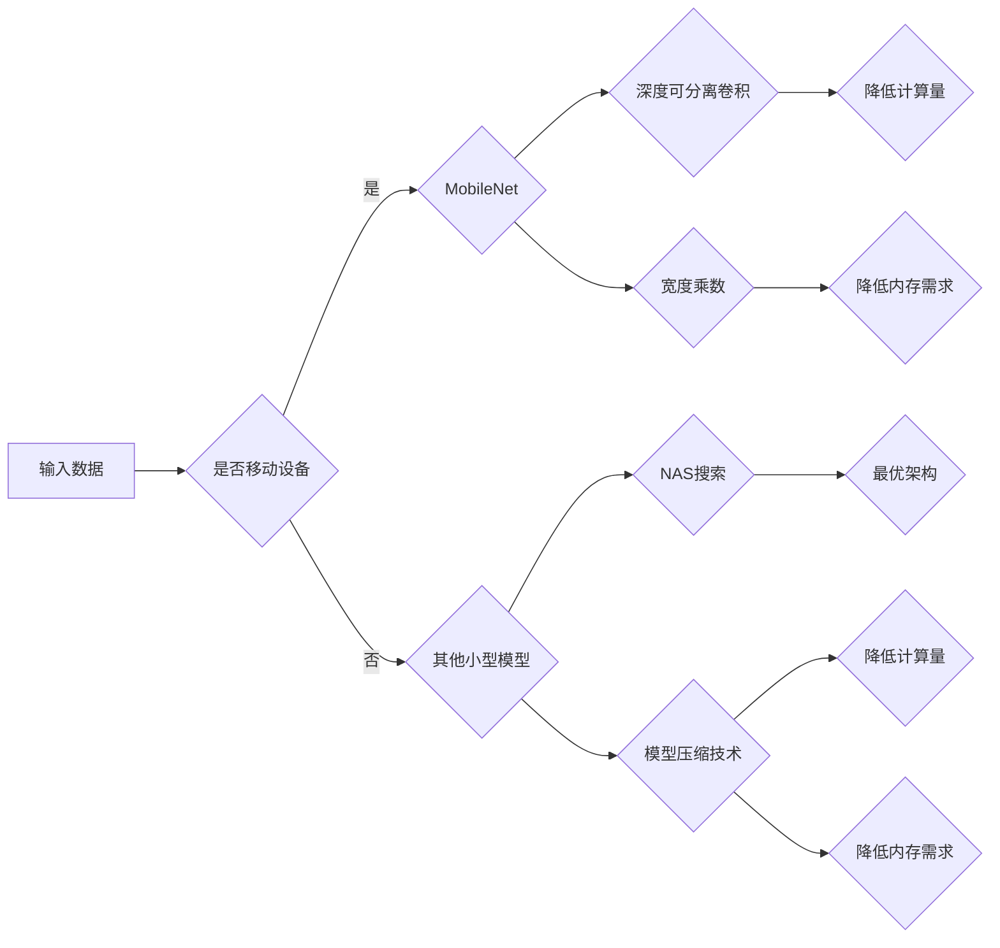

# 小型高效AI模型的发展趋势：以MobileNet为例

> 关键词：小型AI模型，MobileNet，深度学习，神经网络，神经网络架构搜索，模型压缩，边缘计算，效率与精度权衡

## 1. 背景介绍

随着深度学习技术的飞速发展，AI模型在各个领域得到了广泛应用。然而，随着模型复杂度的增加，模型的计算量和内存需求也随之增长，这对移动设备和边缘设备来说是一个巨大的挑战。因此，小型高效的AI模型成为了研究的热点。MobileNet作为早期成功的小型深度学习模型之一，为后续的小型高效AI模型设计提供了重要的参考。

## 2. 核心概念与联系

### 2.1 核心概念

- **小型AI模型**：指在保证一定精度的情况下，具有较小模型尺寸和较低计算量的深度学习模型。
- **MobileNet**：由Google提出的一种轻量级深度神经网络架构，通过深度可分离卷积和宽度乘数等设计，实现了在移动设备上的高效推理。
- **神经网络架构搜索（NAS）**：一种自动搜索最优神经网络架构的方法，通过搜索算法自动生成高性能的网络结构。
- **模型压缩**：通过剪枝、量化、蒸馏等方法减小模型尺寸，降低计算量和内存需求。
- **边缘计算**：在数据源附近进行计算，以减少延迟，提高实时性。

### 2.2 核心概念原理和架构的 Mermaid 流程图



### 2.3 核心概念的联系

- MobileNet作为小型AI模型的一个典型代表，其设计理念和技术为后续小型模型的发展提供了重要的参考。
- 神经网络架构搜索（NAS）可以帮助我们找到性能更优的小型模型架构。
- 模型压缩技术可以降低小型模型的计算量和内存需求，使其更适合边缘计算等场景。
- 边缘计算对小型高效模型的性能提出了更高的要求，推动了小型模型的发展。

## 3. 核心算法原理 & 具体操作步骤

### 3.1 算法原理概述

MobileNet的核心原理是使用深度可分离卷积和宽度乘数来降低计算量和内存需求。

- **深度可分离卷积**：将传统的卷积操作分解为两个操作：深度卷积和逐点卷积。深度卷积用于捕获通道间的空间特征，逐点卷积用于聚合深度卷积的结果。这种方法可以显著减少参数数量，降低计算量。
- **宽度乘数**：通过调整网络中每个卷积层的通道数，可以控制模型的复杂度。宽度乘数越大，模型复杂度越高，但精度也可能更高。

### 3.2 算法步骤详解

1. **输入数据**：将输入数据输入到MobileNet模型中。
2. **深度可分离卷积**：进行深度卷积和逐点卷积操作。
3. **激活函数**：使用ReLU等激活函数对卷积层输出进行非线性变换。
4. **全局平均池化**：将特征图进行全局平均池化操作。
5. **全连接层**：将全局平均池化后的特征输入到全连接层，进行分类或回归任务。
6. **输出**：输出最终的预测结果。

### 3.3 算法优缺点

**优点**：

- **小型化**：通过深度可分离卷积和宽度乘数，MobileNet在保证精度的情况下，实现了小型化设计。
- **高效化**：深度可分离卷积降低了计算量，使得MobileNet在移动设备和边缘设备上具有很高的效率。
- **可扩展性**：MobileNet的架构易于扩展，可以通过增加卷积层或调整宽度乘数来适应不同的任务需求。

**缺点**：

- **精度损失**：与全连接卷积网络相比，MobileNet的精度可能略有下降。
- **可解释性**：由于MobileNet的架构较为复杂，其可解释性相对较低。

### 3.4 算法应用领域

MobileNet在以下领域具有广泛的应用：

- **移动设备**：MobileNet在移动设备上具有很高的效率，适合用于移动端图像识别、语音识别等任务。
- **边缘设备**：MobileNet在边缘设备上具有很小的模型尺寸和计算量，适合用于边缘计算、物联网等领域。
- **嵌入式系统**：MobileNet在嵌入式系统上具有很高的效率，适合用于嵌入式图像识别、语音识别等任务。

## 4. 数学模型和公式 & 详细讲解 & 举例说明

### 4.1 数学模型构建

MobileNet的数学模型可以表示为：

$$
y = f(W_1 \cdot (W_0 \cdot x) + b_0) + b_1
$$

其中，$x$ 是输入数据，$W_0$ 和 $W_1$ 分别是深度卷积和逐点卷积的权重矩阵，$b_0$ 和 $b_1$ 分别是深度卷积和逐点卷积的偏置向量，$f$ 是激活函数。

### 4.2 公式推导过程

MobileNet的深度可分离卷积可以表示为：

$$
y = \sum_{i=1}^{C} \sum_{j=1}^{K} \sum_{k=1}^{C'} w_{ij}^{k} x_{jk} + b_k
$$

其中，$C$ 是输入通道数，$K$ 是输出通道数，$C'$ 是卷积核大小。

逐点卷积可以表示为：

$$
y = \sum_{i=1}^{K} \sum_{j=1}^{C'} w_{ik} x_{ij} + b_k
$$

### 4.3 案例分析与讲解

以下是一个简单的MobileNet模型在ImageNet数据集上的案例：

- **输入数据**：32x32x3的彩色图像
- **输出**：1000个类别

通过深度可分离卷积和宽度乘数，MobileNet将输入图像转换为1000维的特征向量，并输出每个类别的概率。

## 5. 项目实践：代码实例和详细解释说明

### 5.1 开发环境搭建

以下是在Python中实现MobileNet模型的开发环境搭建步骤：

1. 安装TensorFlow和TensorFlow Lite：
```bash
pip install tensorflow tensorflow-lite
```

2. 安装TensorFlow Hub：
```bash
pip install tensorflow-hub
```

### 5.2 源代码详细实现

以下是一个简单的MobileNet模型在TensorFlow Lite中的实现示例：

```python
import tensorflow as tf
import tensorflow_hub as hub

# 加载MobileNet模型
model = hub.load('https://tfhub.dev/google/tf2-preview/mobilenet_v2_1.0_224')

# 加载图片
image = tf.io.read_file('path/to/your/image.jpg')
image = tf.image.decode_jpeg(image, channels=3)
image = tf.expand_dims(image, 0)

# 预测结果
predictions = model.predict(image)
```

### 5.3 代码解读与分析

- 首先导入所需的库。
- 加载MobileNet模型。
- 读取图片并解码。
- 扩展图片的维度。
- 使用模型进行预测。

### 5.4 运行结果展示

运行上述代码后，模型将输出每个类别的概率，并打印出最高概率的类别。

## 6. 实际应用场景

MobileNet在以下领域具有广泛的应用：

- **移动设备**：MobileNet在移动设备上具有很高的效率，适合用于移动端图像识别、语音识别等任务。
- **边缘设备**：MobileNet在边缘设备上具有很小的模型尺寸和计算量，适合用于边缘计算、物联网等领域。
- **嵌入式系统**：MobileNet在嵌入式系统上具有很高的效率，适合用于嵌入式图像识别、语音识别等任务。

## 7. 工具和资源推荐

### 7.1 学习资源推荐

- TensorFlow官方网站：https://www.tensorflow.org/
- TensorFlow Lite官网：https://www.tensorflow.org/lite/
- TensorFlow Hub官网：https://tfhub.dev/

### 7.2 开发工具推荐

- TensorFlow：https://www.tensorflow.org/
- TensorFlow Lite：https://www.tensorflow.org/lite/
- TensorFlow Hub：https://tfhub.dev/

### 7.3 相关论文推荐

- MobileNets: Efficient Convolutional Neural Networks for Mobile Vision Applications
- MobileNetV2: Inverted Residuals and Linear Bottlenecks

## 8. 总结：未来发展趋势与挑战

### 8.1 研究成果总结

本文以MobileNet为例，介绍了小型高效AI模型的发展趋势。通过深度可分离卷积和宽度乘数，MobileNet实现了在保证精度的情况下，降低计算量和内存需求。MobileNet在移动设备、边缘设备和嵌入式系统等领域具有广泛的应用。

### 8.2 未来发展趋势

- **更小的模型尺寸**：随着模型压缩技术的发展，未来小型AI模型的尺寸将更加紧凑，更加适合边缘计算和嵌入式系统。
- **更高的计算效率**：通过优化算法和硬件加速，小型AI模型的计算效率将进一步提高。
- **更好的可解释性**：随着可解释性AI技术的发展，小型AI模型的可解释性将得到提升。

### 8.3 面临的挑战

- **精度与效率的权衡**：在保证精度的情况下，如何在降低计算量和内存需求的同时，进一步提高模型效率，是一个重要的挑战。
- **模型的可解释性**：如何提高小型AI模型的可解释性，使其决策过程更加透明，是一个重要的研究课题。

### 8.4 研究展望

未来，小型高效AI模型将在更多领域得到应用，为构建智能化的未来社会做出贡献。

---

作者：禅与计算机程序设计艺术 / Zen and the Art of Computer Programming