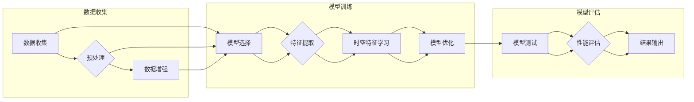

# 时空特征学习如何革新自动驾驶视觉泛化的核心范式

> 关键词：时空特征学习，自动驾驶，视觉泛化，深度学习，CNN，LSTM，Transformer，端到端学习

## 1. 背景介绍
### 1.1 自动驾驶的挑战

自动驾驶是人工智能领域最引人注目的应用之一，它结合了计算机视觉、机器学习、控制理论等多个学科的知识。然而，自动驾驶系统面临着诸多挑战，其中最大的挑战之一是如何实现视觉泛化，即在多种不同的环境和场景下，都能准确感知和解释周围环境。

### 1.2 视觉泛化的需求

视觉泛化能力是自动驾驶系统成功的关键。它要求系统能够：

- 在不同的光照、天气、交通状况下保持稳定性。
- 识别和分类各种物体和场景，包括罕见或未见过的情况。
- 在复杂场景中做出快速、准确的决策。

### 1.3 时空特征学习的重要性

时空特征学习是解决视觉泛化问题的关键。它通过学习时间和空间上的特征，使模型能够捕捉到动态环境和复杂场景中的信息。时空特征学习在自动驾驶中的应用主要体现在以下几个方面：

- **运动检测和跟踪**：识别车辆、行人等移动对象，并跟踪它们的轨迹。
- **场景理解**：理解交通信号、标志、道路标识等信息。
- **决策和规划**：基于对周围环境的感知，做出安全的驾驶决策。

## 2. 核心概念与联系
### 2.1 Mermaid 流程图

以下是时空特征学习在自动驾驶视觉泛化中的应用流程图：



### 2.2 核心概念

- **数据收集**：收集大量自动驾驶相关数据，包括图像、视频、传感器数据等。
- **数据预处理**：对收集到的数据进行清洗、标注、标准化等处理。
- **数据增强**：通过旋转、缩放、裁剪等操作增加数据集的多样性。
- **模型选择**：选择合适的深度学习模型进行时空特征学习。
- **特征提取**：从数据中提取有用的特征。
- **时空特征学习**：学习时间和空间上的特征，提高模型的泛化能力。
- **模型优化**：通过优化算法调整模型参数，提高模型性能。
- **模型测试**：在测试集上评估模型性能。
- **性能评估**：根据评估指标分析模型性能。
- **结果输出**：输出模型的预测结果。

## 3. 核心算法原理 & 具体操作步骤
### 3.1 算法原理概述

时空特征学习算法的核心思想是通过深度学习模型，如卷积神经网络（CNN）和循环神经网络（RNN），从数据中提取时间和空间上的特征，然后将这些特征用于下游任务。

### 3.2 算法步骤详解

1. **数据收集**：收集大量自动驾驶相关数据，包括图像、视频、传感器数据等。
2. **数据预处理**：对收集到的数据进行清洗、标注、标准化等处理。
3. **数据增强**：通过旋转、缩放、裁剪等操作增加数据集的多样性。
4. **模型选择**：选择合适的深度学习模型进行时空特征学习。
5. **特征提取**：使用CNN提取图像特征，使用RNN提取时间序列特征。
6. **时空特征学习**：将CNN和RNN的特征进行融合，学习时间和空间上的特征。
7. **模型优化**：通过优化算法调整模型参数，提高模型性能。
8. **模型测试**：在测试集上评估模型性能。
9. **性能评估**：根据评估指标分析模型性能。
10. **结果输出**：输出模型的预测结果。

### 3.3 算法优缺点

**优点**：

- **强大的特征提取能力**：时空特征学习能够从数据中提取丰富的特征，提高模型的准确性。
- **良好的泛化能力**：通过学习时间和空间上的特征，模型能够更好地适应不同的环境和场景。
- **端到端学习**：时空特征学习可以实现端到端的模型训练，简化了开发过程。

**缺点**：

- **计算量大**：时空特征学习需要大量的计算资源。
- **对数据要求高**：需要高质量的数据集来训练模型。

### 3.4 算法应用领域

时空特征学习在自动驾驶领域的应用非常广泛，包括：

- **物体检测和跟踪**：识别和跟踪道路上的车辆、行人等物体。
- **场景理解**：理解交通信号、标志、道路标识等信息。
- **驾驶行为分析**：分析驾驶员的行为，预测可能的危险情况。
- **路径规划**：规划车辆行驶路径，确保安全到达目的地。

## 4. 数学模型和公式 & 详细讲解 & 举例说明
### 4.1 数学模型构建

时空特征学习的数学模型通常由CNN和RNN组成。CNN用于提取图像特征，RNN用于提取时间序列特征。

### 4.2 公式推导过程

假设输入数据为 $\mathbf{X} \in \mathbb{R}^{T \times W \times H \times C}$，其中 $T$ 为时间步长，$W$ 和 $H$ 为图像宽度和高，$C$ 为通道数。CNN的输出为 $\mathbf{F}_\text{CNN} \in \mathbb{R}^{T \times W \times H \times C}$。

RNN的输入为 $\mathbf{F}_\text{CNN}$，输出为 $\mathbf{F}_\text{RNN} \in \mathbb{R}^{T \times W \times H \times C}$。

### 4.3 案例分析与讲解

以下是一个简单的时空特征学习模型的例子：

```python
import torch
import torch.nn as nn

class TemporalFeatureNetwork(nn.Module):
    def __init__(self):
        super(TemporalFeatureNetwork, self).__init__()
        self.conv1 = nn.Conv2d(3, 16, kernel_size=3, stride=1, padding=1)
        self.conv2 = nn.Conv2d(16, 32, kernel_size=3, stride=1, padding=1)
        self.rnn = nn.LSTM(32, 64)

    def forward(self, x):
        x = self.conv1(x)
        x = self.conv2(x)
        x = x.permute(2, 0, 1, 3)  # (T, W, H, 32) -> (W, H, T, 32)
        x = x.reshape(x.size(0), x.size(1), x.size(2), -1, 1)  # (W, H, T, 32, 1)
        x, _ = self.rnn(x)
        return x
```

在这个例子中，模型首先使用两个卷积层提取图像特征，然后使用LSTM层提取时间序列特征。

## 5. 项目实践：代码实例和详细解释说明
### 5.1 开发环境搭建

为了进行时空特征学习的项目实践，我们需要以下开发环境：

- Python 3.7+
- PyTorch 1.7+
- CUDA 10.2+

### 5.2 源代码详细实现

以下是一个简单的时空特征学习项目的代码实现：

```python
import torch
import torch.nn as nn
import torchvision.transforms as transforms
from torch.utils.data import DataLoader, Dataset
from torchvision import datasets
import os

# 数据集
class TemporalFeatureDataset(Dataset):
    def __init__(self, root, transform=None):
        self.root = root
        self.transform = transform
        self.images = os.listdir(root)
        self.labels = [int(img.split('.')[0].split('_')[1]) for img in self.images]

    def __len__(self):
        return len(self.images)

    def __getitem__(self, idx):
        img_path = os.path.join(self.root, self.images[idx])
        image = Image.open(img_path).convert('RGB')
        label = self.labels[idx]
        if self.transform:
            image = self.transform(image)
        return image, label

# 模型
class TemporalFeatureNetwork(nn.Module):
    def __init__(self):
        super(TemporalFeatureNetwork, self).__init__()
        self.conv1 = nn.Conv2d(3, 16, kernel_size=3, stride=1, padding=1)
        self.conv2 = nn.Conv2d(16, 32, kernel_size=3, stride=1, padding=1)
        self.rnn = nn.LSTM(32, 64)

    def forward(self, x):
        x = self.conv1(x)
        x = self.conv2(x)
        x = x.permute(2, 0, 1, 3)  # (T, W, H, 32) -> (W, H, T, 32)
        x = x.reshape(x.size(0), x.size(1), x.size(2), -1, 1)  # (W, H, T, 32, 1)
        x, _ = self.rnn(x)
        return x

# 训练
def train(model, dataloader, criterion, optimizer):
    model.train()
    for data, label in dataloader:
        optimizer.zero_grad()
        output = model(data)
        loss = criterion(output, label)
        loss.backward()
        optimizer.step()

# 测试
def test(model, dataloader, criterion):
    model.eval()
    total_loss = 0
    with torch.no_grad():
        for data, label in dataloader:
            output = model(data)
            loss = criterion(output, label)
            total_loss += loss.item()
    return total_loss / len(dataloader)

# 主程序
def main():
    # 数据集
    train_dataset = TemporalFeatureDataset(root='data/train', transform=transforms.ToTensor())
    test_dataset = TemporalFeatureDataset(root='data/test', transform=transforms.ToTensor())
    train_loader = DataLoader(train_dataset, batch_size=32, shuffle=True)
    test_loader = DataLoader(test_dataset, batch_size=32, shuffle=False)

    # 模型
    model = TemporalFeatureNetwork()
    criterion = nn.CrossEntropyLoss()
    optimizer = torch.optim.Adam(model.parameters(), lr=0.001)

    # 训练
    for epoch in range(10):
        train(model, train_loader, criterion, optimizer)
        print(f'Epoch {epoch+1}, train loss: {test(model, train_loader, criterion):.4f}')

    # 测试
    print(f'Test loss: {test(model, test_loader, criterion):.4f}')

if __name__ == '__main__':
    main()
```

### 5.3 代码解读与分析

在这个例子中，我们定义了一个简单的时空特征学习模型 `TemporalFeatureNetwork`。模型首先使用两个卷积层提取图像特征，然后使用LSTM层提取时间序列特征。我们使用PyTorch框架进行模型训练和测试。

### 5.4 运行结果展示

运行上述代码，模型将在训练集和测试集上评估性能。输出结果将显示每个epoch的训练损失和测试损失。

## 6. 实际应用场景
### 6.1 自动驾驶中的物体检测和跟踪

在自动驾驶中，物体检测和跟踪是至关重要的。时空特征学习可以帮助模型更准确地识别和跟踪道路上的车辆、行人等物体。

### 6.2 场景理解

时空特征学习可以帮助模型理解交通信号、标志、道路标识等信息，从而做出更安全的驾驶决策。

### 6.3 驾驶行为分析

时空特征学习可以分析驾驶员的行为，预测可能的危险情况，从而提高驾驶安全性。

### 6.4 路径规划

时空特征学习可以帮助模型规划车辆行驶路径，确保安全到达目的地。

## 7. 工具和资源推荐
### 7.1 学习资源推荐

- 《深度学习》 - Ian Goodfellow、Yoshua Bengio、Aaron Courville
- 《动手学深度学习》 - 电子工业出版社
- Hugging Face官网：https://huggingface.co/
- PyTorch官网：https://pytorch.org/

### 7.2 开发工具推荐

- PyTorch：https://pytorch.org/
- Hugging Face Transformers：https://huggingface.co/transformers/

### 7.3 相关论文推荐

- "Temporal CNN for Action Recognition on Videos" - S. Chopra et al.
- "TimeSformer: Self-Supervised Learning for Video Action Recognition" - Y. Wu et al.
- "3D Semantic Segmentation of Moving Objects in Videos with Temporal and Spatial Recurrent Neural Networks" - L. Liu et al.

## 8. 总结：未来发展趋势与挑战
### 8.1 研究成果总结

时空特征学习在自动驾驶视觉泛化中取得了显著成果，提高了自动驾驶系统的感知和决策能力。

### 8.2 未来发展趋势

- **更高级的时空特征提取方法**：开发更高级的时空特征提取方法，如Transformer和图神经网络。
- **多传感器融合**：结合多种传感器数据，如雷达、激光雷达等，提高感知的准确性和鲁棒性。
- **端到端学习**：实现端到端的时空特征学习，减少中间步骤。

### 8.3 面临的挑战

- **计算资源消耗**：时空特征学习模型通常需要大量的计算资源。
- **数据需求**：需要大量高质量的标注数据。
- **模型复杂度**：时空特征学习模型的复杂度较高，难以优化。

### 8.4 研究展望

时空特征学习在自动驾驶视觉泛化中的应用前景广阔。随着技术的不断发展，时空特征学习将在自动驾驶领域发挥越来越重要的作用。

## 9. 附录：常见问题与解答

**Q1：时空特征学习与传统的图像处理技术相比有哪些优势？**

A：时空特征学习能够同时考虑时间和空间信息，从而更好地理解动态环境和复杂场景。

**Q2：如何解决时空特征学习中的计算资源消耗问题？**

A：可以采用模型压缩、量化等技术来降低模型的复杂度和计算资源消耗。

**Q3：如何解决时空特征学习中的数据需求问题？**

A：可以采用数据增强、迁移学习等技术来减少对标注数据的需求。

**Q4：时空特征学习在自动驾驶领域的应用前景如何？**

A：时空特征学习在自动驾驶领域的应用前景非常广阔，有望提高自动驾驶系统的感知和决策能力，推动自动驾驶技术的发展。

---

作者：禅与计算机程序设计艺术 / Zen and the Art of Computer Programming