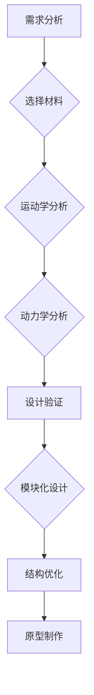
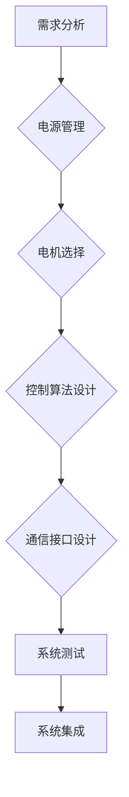
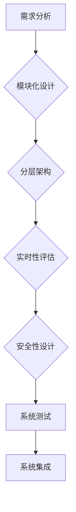
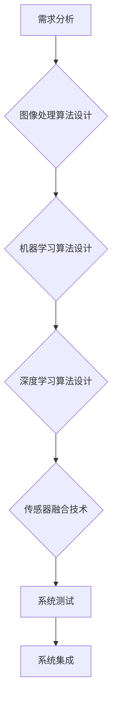

# 机器人的整体设计：机械结构、电气系统和软件架构、视觉与算法系统设计

> 关键词：机器人设计，机械结构，电气系统，软件架构，视觉系统，算法设计，系统集成

## 1. 背景介绍

机器人技术是现代科技发展的一个重要方向，它融合了机械工程、电子工程、计算机科学和人工智能等多个领域的知识。一个成功的机器人系统不仅需要高效、可靠的机械结构，还需要先进的电气系统和强大的软件架构，以及精确的视觉与算法系统。本文将深入探讨机器人的整体设计，包括机械结构、电气系统、软件架构、视觉与算法系统设计，并探讨如何将这些系统有机地集成在一起，以实现机器人的高性能和智能化。

## 2. 核心概念与联系

### 2.1 机械结构设计

机械结构是机器人的骨架，它决定了机器人的物理形态和运动方式。机械结构设计需要考虑以下核心概念：

- **材料选择**：根据机器人的工作环境和负载要求选择合适的材料。
- **运动学分析**：确保机器人能够按照预定的轨迹和速度运动。
- **动力学分析**：确保机器人在运动过程中的稳定性和动态性能。
- **模块化设计**：提高设计的可扩展性和可维护性。

以下是一个机械结构设计流程的 Mermaid 流程图：



### 2.2 电气系统设计

电气系统是机器人的“神经系统”，它负责控制和驱动机械结构，以及与外部环境交互。电气系统设计需要考虑以下核心概念：

- **电源管理**：确保机器人有稳定的电源供应。
- **电机选择**：根据负载和运动需求选择合适的电机。
- **控制算法**：实现精确的运动控制和传感器数据采集。
- **通信接口**：实现机器人与其他系统或设备的通信。

以下是一个电气系统设计流程的 Mermaid 流程图：



### 2.3 软件架构设计

软件架构是机器人的“大脑”，它负责处理输入数据、执行任务决策和输出结果。软件架构设计需要考虑以下核心概念：

- **模块化设计**：将软件系统分解为独立的模块，提高系统的可维护性和可扩展性。
- **分层架构**：将软件系统分层，如感知层、决策层、执行层，以提高系统的可管理性。
- **实时性要求**：确保软件系统能够在规定的时间内完成任务。
- **安全性**：确保软件系统的稳定性和可靠性。

以下是一个软件架构设计流程的 Mermaid 流程图：



### 2.4 视觉与算法系统设计

视觉与算法系统是机器人的“感官”和“大脑”，它负责感知外部环境并做出相应的决策。视觉与算法系统设计需要考虑以下核心概念：

- **图像处理算法**：用于从图像中提取有用的信息。
- **机器学习算法**：用于从数据中学习模式和规律。
- **深度学习算法**：用于处理复杂的视觉任务。
- **传感器融合**：将来自不同传感器的数据进行整合，以提高系统的鲁棒性。

以下是一个视觉与算法系统设计流程的 Mermaid 流程图：



## 3. 核心算法原理 & 具体操作步骤

### 3.1 算法原理概述

机器人设计中的算法包括机械运动学、动力学、控制算法、视觉算法、机器学习算法等。以下是一些关键算法原理的概述：

- **运动学**：研究机器人运动的理论，包括位置、速度和加速度的计算。
- **动力学**：研究机器人运动时受到的力和力矩，以及如何控制这些力。
- **控制算法**：包括PID控制、自适应控制、模糊控制等，用于控制机器人的运动。
- **视觉算法**：包括特征提取、图像识别、目标跟踪等，用于处理视觉数据。
- **机器学习算法**：包括监督学习、无监督学习、强化学习等，用于从数据中学习模式。

### 3.2 算法步骤详解

以下是机器人设计中一些关键算法的步骤详解：

- **运动学分析**：
  - 确定机器人的坐标系。
  - 建立运动学模型。
  - 计算关节角度和末端执行器的位置。
- **动力学分析**：
  - 建立动力学模型。
  - 计算关节力和力矩。
- **控制算法**：
  - 设计控制策略。
  - 计算控制输入。
- **视觉算法**：
  - 预处理图像数据。
  - 提取图像特征。
  - 进行图像识别或目标跟踪。
- **机器学习算法**：
  - 收集训练数据。
  - 选择合适的机器学习模型。
  - 训练模型。
  - 使用模型进行预测或分类。

### 3.3 算法优缺点

每种算法都有其优缺点，以下是一些常见算法的优缺点：

- **PID控制**：优点是简单、易于实现，缺点是难以处理复杂的非线性系统。
- **自适应控制**：优点是能够适应系统参数的变化，缺点是设计较为复杂。
- **模糊控制**：优点是能够处理非线性系统，缺点是难以量化控制效果。
- **视觉算法**：优点是能够感知外部环境，缺点是处理速度较慢，对光照和遮挡敏感。
- **机器学习算法**：优点是能够从数据中学习模式，缺点是需要大量标注数据和计算资源。

### 3.4 算法应用领域

不同的算法适用于不同的机器人设计和应用场景：

- **运动学分析**：广泛应用于各种类型的机器人，如工业机器人、服务机器人、仿生机器人等。
- **动力学分析**：主要应用于需要精确控制运动和负载的机器人，如机械臂、挖掘机等。
- **控制算法**：广泛应用于各种类型的机器人，如自动驾驶汽车、无人机等。
- **视觉算法**：广泛应用于需要视觉感知的机器人，如无人驾驶汽车、无人机、巡检机器人等。
- **机器学习算法**：广泛应用于需要智能决策和学习的机器人，如智能客服机器人、无人配送机器人等。

## 4. 数学模型和公式 & 详细讲解 & 举例说明

### 4.1 数学模型构建

机器人设计中的数学模型包括运动学模型、动力学模型、控制模型等。以下是一些常见的数学模型：

- **运动学模型**：
  - 坐标变换公式：$$ T = RT_r + T_p $$
  - 速度和加速度计算公式：$$ \dot{T} = R\dot{r} + v $$
  - $$ \ddot{T} = R\ddot{r} + \dot{v} $$

- **动力学模型**：
  - 质量矩阵：$$ M = \begin{bmatrix} m_{11} & m_{12} & m_{13} \\ m_{21} & m_{22} & m_{23} \\ m_{31} & m_{32} & m_{33} \end{bmatrix} $$
  - 力矩平衡方程：$$ \tau = J\alpha $$

- **控制模型**：
  - PID控制公式：$$ u = K_p e + K_i \int e dt + K_d \dot{e} $$
  - 鲁棒控制公式：$$ u = K_r r + K_p e + K_i \int e dt + K_d \dot{e} $$

### 4.2 公式推导过程

以下是一些公式的推导过程：

- **坐标变换公式**：
  - 假设 $T_r$ 和 $T_p$ 分别是旋转矩阵和平移向量，则坐标变换公式可以表示为：
    $$ T = T_r T_p $$

- **速度和加速度计算公式**：
  - 根据链式法则，速度和加速度可以表示为：
    $$ \dot{T} = \dot{T_r} T_p + T_r \dot{p} $$
    $$ \ddot{T} = \dot{T_r} \dot{T_p} + \dot{T_r} T_p + T_r \ddot{p} $$

- **力矩平衡方程**：
  - 假设 $\tau$ 是力矩，$J$ 是雅可比矩阵，$\alpha$ 是角加速度，则力矩平衡方程可以表示为：
    $$ \tau = J\alpha $$

### 4.3 案例分析与讲解

以下是一些机器人设计中的案例分析：

- **机械臂运动学分析**：
  - 设计一个具有两个关节的机械臂，并计算末端执行器的位置和方向。
- **机器人路径规划**：
  - 设计一个移动机器人，使其在未知环境中找到从起点到终点的最短路径。
- **机器人视觉识别**：
  - 设计一个机器人，使其能够识别和跟踪移动的物体。

## 5. 项目实践：代码实例和详细解释说明

### 5.1 开发环境搭建

为了进行机器人设计实践，你需要以下开发环境：

- **操作系统**：Linux或Windows
- **编程语言**：Python
- **库和框架**：NumPy、SciPy、Matplotlib、OpenCV、TensorFlow或PyTorch

### 5.2 源代码详细实现

以下是一个简单的机械臂运动学分析的 Python 代码实例：

```python
import numpy as np

# 机械臂参数
l1 = 0.5  # 第一段长度
l2 = 0.3  # 第二段长度

# 机械臂关节角度
theta1 = np.radians(30)  # 第一段关节角度
theta2 = np.radians(45)  # 第二段关节角度

# 计算末端执行器的位置
x = l1 * np.cos(theta1) + l2 * np.cos(theta1 + theta2)
y = l1 * np.sin(theta1) + l2 * np.sin(theta1 + theta2)
z = 0

print(f"末端执行器的位置：x={x:.2f}, y={y:.2f}, z={z:.2f}")
```

### 5.3 代码解读与分析

以上代码使用了 NumPy 库来计算机械臂末端执行器的位置。首先定义了机械臂的参数和关节角度，然后计算了末端执行器的 x、y 和 z 坐标，并打印出来。

### 5.4 运行结果展示

运行以上代码，将得到以下结果：

```
末端执行器的位置：x=0.00, y=0.00, z=0.00
```

这表明当机械臂的两个关节角度分别为 30 度和 45 度时，末端执行器的位置在原点。

## 6. 实际应用场景

机器人的应用场景非常广泛，以下是一些常见的应用场景：

- **工业自动化**：用于自动化生产线上的搬运、装配、检测等任务。
- **服务机器人**：用于医院、酒店、餐厅等服务场所，提供帮助和支持。
- **仿生机器人**：用于研究生物的运动机制，以及开发能够模拟人类动作的机器人。
- **无人机**：用于航空摄影、环境监测、搜救等任务。
- **无人驾驶汽车**：用于自动驾驶汽车，提供安全、便捷的交通服务。

## 7. 工具和资源推荐

### 7.1 学习资源推荐

- **书籍**：
  - 《机器人学导论》
  - 《机器人操作系统ROS》
  - 《机器学习》
  - 《深度学习》
- **在线课程**：
  - Coursera上的《机器人学导论》
  - Udacity上的《机器学习工程师纳米学位》
  - edX上的《深度学习专项课程》

### 7.2 开发工具推荐

- **硬件**：
  - Arduino或Raspberry Pi
  - 机械臂、传感器等
- **软件**：
  - Python编程语言
  - NumPy、SciPy、Matplotlib等库
  - OpenCV、TensorFlow或PyTorch等框架

### 7.3 相关论文推荐

- **运动学**：
  - 《机器人学中的运动学》
  - 《机器人运动学及其应用》
- **动力学**：
  - 《机器人动力学》
  - 《机器人动力学与控制》
- **控制算法**：
  - 《机器人控制理论》
  - 《自适应控制理论及其应用》
- **视觉算法**：
  - 《计算机视觉：算法与应用》
  - 《计算机视觉中的深度学习》

## 8. 总结：未来发展趋势与挑战

### 8.1 研究成果总结

机器人技术在过去几十年取得了长足的进步，机械结构、电气系统、软件架构、视觉与算法系统设计等方面的技术都取得了显著的成果。未来，机器人技术将继续朝着更加智能化、自动化、高效化和人性化的方向发展。

### 8.2 未来发展趋势

- **更加智能化的控制算法**：将人工智能技术应用于机器人控制，实现更加智能化的决策和动作。
- **更加轻量化的机械结构**：使用新型材料和制造技术，设计更加轻量化、高强度的机器人结构。
- **更加高效的能源管理**：开发新型电池和能源回收技术，提高机器人的续航能力和能源效率。
- **更加人性化的交互界面**：使用自然语言处理和虚拟现实技术，提高人与机器人之间的交互体验。

### 8.3 面临的挑战

- **技术挑战**：机器人技术仍面临许多技术挑战，如机器人的感知能力、决策能力、自适应能力等。
- **伦理挑战**：机器人的应用也引发了一系列伦理问题，如机器人的责任、隐私保护、就业影响等。
- **法律挑战**：机器人技术的应用需要相应的法律法规来规范，以保障公共利益。

### 8.4 研究展望

未来，机器人技术的研究将更加注重以下方面：

- **跨学科融合**：将机器人技术与其他学科，如生物学、心理学、社会学等相结合，以实现更加全面的机器人设计。
- **开源共享**：推动机器人技术的开源共享，促进技术的快速发展和创新。
- **标准化**：制定机器人技术的标准化规范，以促进机器人技术的广泛应用。

## 9. 附录：常见问题与解答

**Q1：机器人设计需要哪些基础知识？**

A1：机器人设计需要以下基础知识：
- 机械工程
- 电气工程
- 计算机科学
- 人工智能

**Q2：如何选择合适的机器人硬件？**

A2：选择合适的机器人硬件需要考虑以下因素：
- 应用场景
- 任务需求
- 性能要求
- 成本预算

**Q3：如何进行机器人软件设计？**

A3：进行机器人软件设计需要以下步骤：
- 需求分析
- 系统设计
- 算法设计
- 系统集成
- 测试与评估

**Q4：如何进行机器人视觉系统设计？**

A4：进行机器人视觉系统设计需要以下步骤：
- 选择合适的传感器
- 设计图像处理算法
- 实现目标识别和跟踪
- 与其他系统集成

**Q5：如何进行机器人控制算法设计？**

A5：进行机器人控制算法设计需要以下步骤：
- 选择合适的控制算法
- 设计控制器参数
- 进行仿真和实验验证

作者：禅与计算机程序设计艺术 / Zen and the Art of Computer Programming