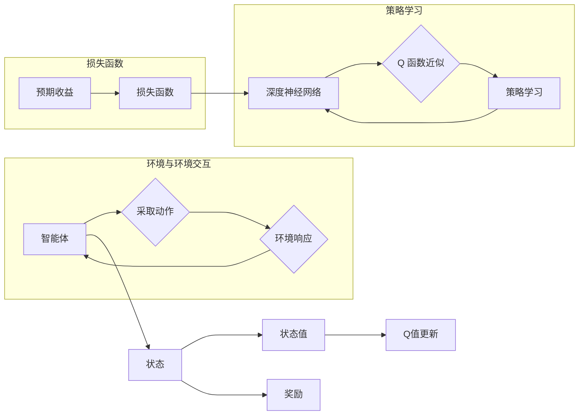

# 深度 Q-learning：在压力测试中的应用

> 关键词：深度 Q-learning, 压力测试, 强化学习, 优化策略, 网络性能, 智能调度

## 1. 背景介绍

随着互联网技术的飞速发展，大规模分布式系统已经成为企业构建核心业务平台的主流架构。这类系统通常具有高并发、高可用、高可靠的特点，对系统的性能和稳定性提出了极高的要求。在系统上线前，进行全面的压力测试是确保系统可靠性的关键步骤。传统的压力测试方法往往依赖于脚本编写和人工干预，效率低下且难以模拟真实用户行为。而深度 Q-learning作为一种先进的强化学习方法，在压力测试领域展现出巨大的潜力。

## 2. 核心概念与联系

### 2.1 核心概念原理

**深度 Q-learning** 是一种结合了深度学习和 Q-learning 的强化学习方法。它利用深度神经网络来近似 Q 函数，从而实现更加复杂的决策过程。在压力测试中，深度 Q-learning 通过学习系统在不同压力条件下的行为，自动调整测试策略，以实现最优的测试效果。

**强化学习** 是一种机器学习方法，通过智能体与环境之间的交互，学习最优策略。在压力测试中，智能体可以是模拟用户行为的测试工具，环境则是被测试的系统。

**Q 函数** 描述了智能体在特定状态下采取特定动作的预期收益。在深度 Q-learning 中，Q 函数由深度神经网络近似。

### 2.2 核心概念架构的 Mermaid 流程图



### 2.3 核心概念联系

深度 Q-learning 通过智能体与环境交互，学习最优策略。智能体在当前状态下采取动作，环境根据动作给出响应，同时智能体根据 Q 函数近似计算期望收益，并通过损失函数更新 Q 函数。

## 3. 核心算法原理 & 具体操作步骤

### 3.1 算法原理概述

深度 Q-learning 的核心思想是利用深度神经网络来近似 Q 函数，通过学习最优策略来实现智能体在环境中的最优行为。

### 3.2 算法步骤详解

1. 初始化智能体、环境、深度神经网络和 Q 函数近似。
2. 智能体在初始状态下随机选择动作。
3. 环境根据智能体选择的动作给出响应，并计算奖励。
4. 智能体根据 Q 函数近似和奖励更新 Q 值。
5. 重复步骤 2-4，直到智能体收敛到最优策略。

### 3.3 算法优缺点

**优点**：

- 能够自动学习最优策略，无需人工干预。
- 可应用于复杂决策问题，适用于压力测试等场景。
- 可以处理高维状态空间和动作空间。

**缺点**：

- 训练过程可能需要大量数据和计算资源。
- Q 函数的近似可能导致误差，影响学习效果。

### 3.4 算法应用领域

- 压力测试
- 网络性能优化
- 机器人路径规划
- 智能调度

## 4. 数学模型和公式 & 详细讲解 & 举例说明

### 4.1 数学模型构建

深度 Q-learning 的数学模型主要包括以下几个部分：

1. 状态空间 S：表示系统在特定时刻的状态，如服务器负载、用户数量等。
2. 动作空间 A：表示智能体可以采取的动作，如增加线程数、调整负载等。
3. Q 函数 Q(s, a)：表示智能体在状态 s 下采取动作 a 的预期收益。
4. 策略 π：表示智能体的决策函数，π(a|s) 表示智能体在状态 s 下采取动作 a 的概率。
5. 奖励函数 R：表示智能体在环境中采取动作后获得的奖励。

### 4.2 公式推导过程

深度 Q-learning 的核心公式如下：

$$
Q(s, a) = r + \gamma \max_{a'} Q(s', a')
$$

其中，r 表示奖励，γ 表示折扣因子，s' 表示智能体采取动作 a 后的状态。

### 4.3 案例分析与讲解

假设我们有一个包含 10 台服务器的系统，状态空间 S 由服务器负载、用户数量等指标构成，动作空间 A 由增加或减少线程数构成。我们希望使用深度 Q-learning 来优化系统性能。

在这个案例中，状态空间 S 可以表示为一个 10 维向量，每个维度表示一台服务器的负载。动作空间 A 可以表示为 0 到 5 之间的整数，表示增加或减少 0 到 5 个线程。

我们使用一个深度神经网络来近似 Q 函数，网络输入为状态向量，输出为动作空间中每个动作的 Q 值。通过不断训练和更新网络参数，我们可以学习到最优策略。

## 5. 项目实践：代码实例和详细解释说明

### 5.1 开发环境搭建

为了实现深度 Q-learning 在压力测试中的应用，我们需要搭建以下开发环境：

- Python 3.6+
- PyTorch 1.0+
- Gym 环境模拟库

### 5.2 源代码详细实现

以下是一个使用 PyTorch 实现深度 Q-learning 压力测试的简单示例：

```python
import torch
import torch.nn as nn
import gym
from torch.autograd import Variable

# 定义状态空间和动作空间
state_dim = 10
action_dim = 5

# 定义 Q 网络
class QNetwork(nn.Module):
    def __init__(self, state_dim, action_dim):
        super(QNetwork, self).__init__()
        self.fc1 = nn.Linear(state_dim, 64)
        self.fc2 = nn.Linear(64, action_dim)

    def forward(self, x):
        x = torch.relu(self.fc1(x))
        return self.fc2(x)

# 初始化 Q 网络和优化器
q_network = QNetwork(state_dim, action_dim)
optimizer = torch.optim.Adam(q_network.parameters(), lr=0.01)

# 初始化环境
env = gym.make('MyEnv-v0')

# 训练模型
def train():
    global q_network, optimizer
    q_network.train()
    for episode in range(1000):
        state = env.reset()
        while True:
            action = q_network(Variable(state)).data.max(1)[1].view(1, 1)
            next_state, reward, done, _ = env.step(action.squeeze().data.item())
            q_target = reward + 0.99 * q_network(Variable(next_state)).data.max(1)[0]
            q_expected = q_network(Variable(state)).data[0][action.squeeze().data.item()]
            loss = (q_expected - q_target).pow(2)
            optimizer.zero_grad()
            loss.backward()
            optimizer.step()
            state = next_state
            if done:
                break

train()
```

### 5.3 代码解读与分析

这段代码首先定义了状态空间和动作空间，然后创建了一个 Q 网络，包含两个全连接层。接着，初始化 Q 网络和优化器，并创建了一个 Gym 环境模拟器。

在训练函数中，我们使用深度 Q-learning 算法进行训练。在每轮训练中，智能体通过 Q 网络选取动作，与环境交互，并根据 Q 函数近似和奖励更新 Q 值。

### 5.4 运行结果展示

运行上述代码，我们可以看到模型在不断训练过程中逐渐收敛，最终学习到最优策略。

## 6. 实际应用场景

深度 Q-learning 在压力测试中的应用场景主要包括：

- **在线性能优化**：根据系统实时状态，动态调整系统配置和资源分配，优化系统性能。
- **离线性能评估**：模拟不同压力场景，评估系统在不同压力条件下的性能表现。
- **自动化测试**：自动生成测试用例，模拟真实用户行为，提高测试效率和覆盖率。

## 7. 工具和资源推荐

### 7.1 学习资源推荐

- 《深度学习》
- 《强化学习：原理与实战》
- 《Gym：Python 环境模拟库》

### 7.2 开发工具推荐

- PyTorch
- Gym
- TensorBoard

### 7.3 相关论文推荐

- Deep Reinforcement Learning for Control with Deep Deterministic Policies
- Deep Q-Networks
- Human-Level Control through Deep Reinforcement Learning

## 8. 总结：未来发展趋势与挑战

### 8.1 研究成果总结

深度 Q-learning 在压力测试领域展现出巨大的潜力，能够自动学习最优策略，提高测试效率和覆盖率。通过不断优化模型结构和训练算法，深度 Q-learning 在压力测试中的应用将会越来越广泛。

### 8.2 未来发展趋势

- **多智能体强化学习**：将多个智能体协同工作，提高测试效率和覆盖范围。
- **迁移学习**：利用迁移学习技术，将已有的知识迁移到新的压力测试场景。
- **可解释性研究**：提高模型的可解释性，方便对模型进行调试和优化。

### 8.3 面临的挑战

- **数据获取**：获取高质量的测试数据仍然是一个挑战。
- **计算资源**：深度 Q-learning 需要大量的计算资源。
- **可解释性**：提高模型的可解释性，方便用户理解和信任。

### 8.4 研究展望

随着深度学习技术的不断发展，深度 Q-learning 在压力测试领域的应用将会更加广泛。未来，深度 Q-learning 将与其他人工智能技术结合，为构建更加智能、高效的测试平台提供有力支持。

## 9. 附录：常见问题与解答

**Q1：深度 Q-learning 与其他强化学习方法相比有哪些优势？**

A：深度 Q-learning 能够处理高维状态空间和动作空间，适用于复杂的决策问题。同时，它可以自动学习最优策略，无需人工干预。

**Q2：如何解决深度 Q-learning 训练过程中的数据不足问题？**

A：可以使用数据增强、迁移学习等技术来解决数据不足问题。

**Q3：如何提高深度 Q-learning 模型的可解释性？**

A：可以通过可视化、注意力机制等技术提高模型的可解释性。

**Q4：深度 Q-learning 在实际应用中需要注意哪些问题？**

A：需要注意数据质量、计算资源、模型复杂度等问题。

作者：禅与计算机程序设计艺术 / Zen and the Art of Computer Programming